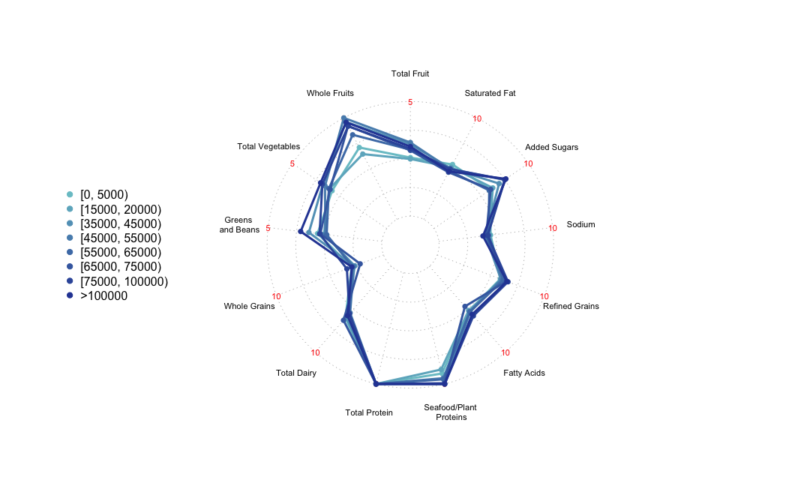

<!-- README.md is generated from README.Rmd. Please edit that file -->

# heiscore

<!-- badges: start -->

<!-- badges: end -->

## Overview

The heiscore package aims to increase the accessibility of evaluating a population’s dietary habits using the Healthy Eating Index (HEI) and enable straightforward comparisons of the diet quality of different demographic subgroups. It allows users with minimal technical experience to obtain preloaded dietary recall data from the National Health and Nutrition Examination Survey (NHANES) and use it calculate HEI scores that are representative of the U.S. population using three distinct methods prescribed by the National Cancer Institute. Additionally, heiscore includes functions that visualize this multidimensional diet quality data via various graphing techniques including histograms, bar charts, and radar charts. These plots facilitate clear comparisons of dietary patterns between sub-populations in the U.S. and across several years.

heiscore’s four functions:

-   `selectDataset()` retrieves a tibble containing NHANES dietary recall data converted to relevant food groups (the U.S. Department of Agriculture’s Food Patterns Components) and demographic data for the chosen years.
-   `score()` calculates HEI scores for the chosen time period and demographic subgroups.
-   `plotScore()` graphs HEI score distributions for the chosen time period and demographic subgroups.
-   `runShinyApp()` launches an interactive R shiny app that plots the distributions of raw dietary data, demographic information, and HEI scores with options to compare years and demographic subgroups of interest

## Installation

``` r
# Install the heiscore package from CRAN
install.packages("heiscore")
```

## Example

This is a basic example which shows you how to solve a common problem:

``` r
library(heiscore)

# Retrieve NHANES dietary data converted to Food Patterns components and 
# demographic data for 2017 and 2018 
selectDataset(years = '1718')
#>       SEQN     WTDRD1     WTDR2D    SEX         RACE_ETH AGE          FAMINC
#> 1    93703      0.000         NA Female            Asian   2         >100000
#> 2    93704  81714.005  82442.869   Male            White   2         >100000
#> 3    93705   7185.561   5640.391 Female            Black  66  [10000, 15000)
#> 4    93706   6463.883      0.000   Male            Asian  18            <NA>
#> 5    93707  15333.777  22707.067   Male            Other  13  [65000, 75000)
#> 6    93708  10825.545  22481.854 Female            Asian  66  [25000, 35000)
#> 7    93709      0.000         NA Female            Black  75   [5000, 10000)
#> 8    93710   8616.341   7185.296 Female            White   0         >100000
#> 9    93711   9098.493   8229.960   Male            Asian  56         >100000
#> 10   93712  60947.446  89066.416   Male Mexican American  18  [15000, 20000)
#> 11   93713 252846.565 243894.020   Male            White  67  [25000, 35000)
#> 12   93714   9694.008   7807.591 Female            Black  54  [35000, 45000)
#> 13   93715   7365.113   6025.261   Male            Other  71  [45000, 55000)
#> 14   93716   7604.236   6703.764   Male            Asian  61         >100000
#> 15   93717 105894.675 107259.312   Male            White  22  [15000, 20000)
#> 16   93718      0.000         NA   Male            Black  45  [65000, 75000)
#> 17   93719  61579.904 128211.419 Female            White  13 [75000, 100000)
#> 18   93720  16512.570  20972.268 Female            Black   1 [75000, 100000)
#> 19   93721   7874.668   6710.609 Female Mexican American  60  [45000, 55000)
#> 20   93722  74963.774  60071.422 Female            White  60  [25000, 35000)
#> 21   93723 138718.148 272915.991   Male            White  64  [55000, 65000)
#> 22   93724   8650.874   7102.660 Female            Black   5  [15000, 20000)
#> 23   93725      0.000         NA Female            White   9         >100000
#> 24   93726   3238.131   2759.460 Female Mexican American  67  [20000, 25000)
#> 25   93727  42662.011  44345.755   Male            Asian  70         >100000
#> 26   93728  30998.769  25488.141   Male            Black  53         >100000
#> 27   93729  11898.856   9783.605   Male            Black  42  [10000, 15000)
#> 28   93730      0.000         NA   Male   Other Hispanic  57         Refused
#> 29   93731  58105.205  82531.230   Male Mexican American  20         >100000
#> 30   93732  18851.614  18184.134   Male            White  72  [10000, 15000)
#> 31   93733  38169.824  49306.416 Female            White  11  [55000, 65000)
#> 32   93735  11197.817   9995.584   Male   Other Hispanic  52   [5000, 10000)
#> 33   93736  15750.630  14206.842   Male Mexican American  11          >20000
#> 34   93737      0.000         NA   Male            Black   8       [0, 5000)
#> 35   93738  48847.770  44624.277   Male   Other Hispanic  26         >100000
#> 36   93739  21461.642  19129.566 Female Mexican American   5  [45000, 55000)
#> 37   93740  12920.884  16098.952   Male            Black  72   [5000, 10000)
#> 38   93741   9041.270  19467.123 Female            Asian   9         >100000
#> 39   93742  12380.614   9921.349   Male            Black  72  [35000, 45000)
#> 40   93743 167227.571 161306.540   Male            White  61  [45000, 55000)
#> 41   93744  37197.306  30904.231 Female            White  10  [35000, 45000)
#> 42   93745      0.000         NA   Male            Asian   5  [15000, 20000)
#> 43   93746  21936.592  43484.428 Female            Black  25  [35000, 45000)
#> 44   93747  77324.787 110687.152 Female   Other Hispanic  13  [25000, 35000)
#> 45   93748  23084.338  32494.455   Male Mexican American   0  [55000, 65000)
#> 46   93749  21512.787  27893.005 Female            White   1  [10000, 15000)
#> 47   93751      0.000         NA Female Mexican American   7       [0, 5000)
#> 48   93752  27697.499  22195.096 Female            White  73  [45000, 55000)
#> 49   93753  22226.032  18465.810 Female            White  10  [65000, 75000)
#> 50   93754  65533.384  88643.945   Male   Other Hispanic  72  [10000, 15000)
#> 51   93755  33323.167  66055.785 Female            Black  26  [25000, 35000)
#> 52   93756  11048.560  10225.908 Female            Black  64            <NA>
#> 53   93757 150442.448 145115.728   Male            White  63  [35000, 45000)
#> 54   93758  39771.897  50843.421 Female            White  55  [10000, 15000)
#> 55   93759 110120.303  90087.358   Male            Other  60          >20000
#> 56   93760  46188.277  47618.338 Female Mexican American  54            <NA>
#> 57   93761  17107.819      0.000   Male            Asian  44  [25000, 35000)
#> 58   93762  24066.311  49321.746 Female Mexican American  74  [10000, 15000)
#> 59   93763  58371.564  48996.262   Male            White  40 [75000, 100000)
#> 60   93764  19204.469  24900.091 Female            White   1  [25000, 35000)
#> 61   93765 129511.936      0.000   Male            White  19 [75000, 100000)
#> 62   93766  12755.597  11414.247 Female   Other Hispanic  36  [10000, 15000)
#> 63   93767  45730.432  46909.694   Male   Other Hispanic  61  [20000, 25000)
#> 64   93768  16449.490      0.000   Male            White  80  [45000, 55000)
#> 65   93769      0.000         NA   Male            Other   6         >100000
#> 66   93770  33405.368  35159.179   Male   Other Hispanic  55   [5000, 10000)
#> 67   93771  23838.162  25917.673   Male            Asian   3  [55000, 65000)
#> 68   93772  14803.489  11922.787 Female            Black  55   [5000, 10000)
#> 69   93773      0.000         NA   Male            White  69   [5000, 10000)
#> 70   93774      0.000         NA Female            White  41 [75000, 100000)
#> 71   93775  28111.359  38726.384 Female            Asian  47  [45000, 55000)
#> 72   93776  14149.692  11663.056 Female            Black  32  [65000, 75000)
#> 73   93777      0.000         NA Female            Black  72  [35000, 45000)
#> 74   93778  41258.570  41255.547 Female            Black  19         >100000
#> 75   93779  15135.941  21069.748 Female            Other  10         >100000
#> 76   93780  71611.422  69424.310 Female            Other  46  [25000, 35000)
#> 77   93781      0.000         NA   Male   Other Hispanic  32  [20000, 25000)
#> 78   93782  23452.631  19331.116 Female            Black  25 [75000, 100000)
#> 79   93783  63049.114  56419.009 Female   Other Hispanic  21  [10000, 15000)
#> 80   93784      0.000         NA Female            White   2  [15000, 20000)
#> 81   93785  82988.449 103397.715 Female            White  80  [65000, 75000)
#> 82   93787  23626.914  23625.183 Female            Other  13   [5000, 10000)
#> 83   93788 222090.633 276709.159 Female            White  66         >100000
#> 84   93789 185980.283 156494.892 Female            White  34 [75000, 100000)
#> 85   93790   8674.076   7834.636 Female            Other   5         >100000
#> 86   93791  53598.902  58503.712   Male            Other  20  [55000, 65000)
#> 87   93792  69264.486  73081.040 Female   Other Hispanic  31       [0, 5000)
#> 88   93793  14646.015  33105.516   Male Mexican American  12          <20000
#> 89   93794   8427.084   7277.135 Female            Asian  62         >100000
#> 90   93795   7662.994   7240.602   Male            Black  64  [65000, 75000)
#> 91   93796      0.000         NA   Male            White  71  [15000, 20000)
#> 92   93797      0.000         NA Female            White  52 [75000, 100000)
#> 93   93798  14792.048  11611.193 Female            Black  61            <NA>
#> 94   93799  29706.902  24425.928   Male            Black  41 [75000, 100000)
#> 95   93800  23457.208  18797.184 Female            White  80  [25000, 35000)
#> 96   93801  43161.117  38527.204   Male   Other Hispanic  59         >100000
#> 97   93802   7824.027   6557.818 Female            White   2   [5000, 10000)
#> 98   93803  14379.706      0.000   Male            Black  12  [45000, 55000)
#> 99   93804  28550.301  28658.940   Male            White   1  [20000, 25000)
#> 100  93805  70365.093  66484.648 Female            White  64  [65000, 75000)
#> 101  93806   9700.345   8774.360   Male            Asian  44  [45000, 55000)
#> 102  93807  14012.995  12901.275 Female Mexican American  13         >100000
#> 103  93808  25084.547  22170.459   Male            White  14         >100000
#> 104  93809   7910.763  15865.416   Male            Other   1         >100000
#> 105  93810      0.000         NA   Male            Black  13            <NA>
#> 106  93811  29333.922  65305.426   Male            Asian  24  [55000, 65000)
#> 107  93812 220132.397 433091.502   Male            White  67 [75000, 100000)
#> 108  93813  18260.504  38397.844 Female Mexican American  42  [35000, 45000)
#> 109  93814  20340.502  16382.319 Female            Black  41         >100000
#> 110  93815   7125.896   5873.606 Female            Other  32  [15000, 20000)
#> 111  93816      0.000         NA Female   Other Hispanic  80       [0, 5000)
#> 112  93817  10614.620  23090.427   Male            Asian  55         >100000
#> 113  93818  16156.632  15185.618   Male Mexican American  14 [75000, 100000)
#> 114  93819  11876.600      0.000 Female            Black  63  [25000, 35000)
#> 115  93820  16912.862      0.000 Female            Black  11  [45000, 55000)
#> 116  93821  22934.160  21396.263 Female            Asian  16  [35000, 45000)
#> 117  93822  22423.852  19812.071 Female Mexican American   6  [35000, 45000)
#> 118  93823  39884.654  54222.244 Female   Other Hispanic  58          <20000
#> 119  93824  34936.691  30547.566 Female   Other Hispanic  52            <NA>
#> 120  93825  12112.633  15406.779   Male            White  74  [25000, 35000)
#> 121  93827  15722.727      0.000 Female            Asian  68            <NA>
#> 122  93828      0.000         NA Female            White   2  [25000, 35000)
#> 123  93829  34210.730  28198.609 Female            Black  38         >100000
#> 124  93830   2935.982      0.000   Male            Black  67 [75000, 100000)
#> 125  93831   6587.786      0.000   Male   Other Hispanic  61  [25000, 35000)
#> 126  93832  21774.946  22634.339   Male            Asian  63         >100000
#> 127  93833  19269.526  16343.967   Male            White   6 [75000, 100000)
#> 128  93834  21459.089  42431.869 Female            White  48   [5000, 10000)
#> 129  93836  28059.858  25833.730 Female Mexican American  13  [65000, 75000)
#> 130  93837  33674.269  68144.481 Female            White  35  [20000, 25000)
#> 131  93838      0.000         NA   Male Mexican American   5            <NA>
#> 132  93839 166469.545 136872.571 Female            White  50            <NA>
#> 133  93840  11585.052  10479.155   Male            Asian  47         >100000
#> 134  93841 228696.549      0.000 Female            Other  48         >100000
#> 135  93842   4853.067   4067.779   Male            Black   2  [15000, 20000)
#> 136  93843  74678.899      0.000 Female   Other Hispanic  42         >100000
#> 137  93844      0.000         NA   Male            White   6       [0, 5000)
#> 138  93845 125080.528 105250.209 Female            White  28 [75000, 100000)
#> 139  93846  43382.246      0.000 Female            Black  29  [15000, 20000)
#> 140  93847  25919.664  22663.355 Female Mexican American  43       [0, 5000)
#> 141  93848  20680.590  19540.654   Male            Black  62  [15000, 20000)
#> 142  93849 221196.858 181869.798 Female            White  40         >100000
#> 143  93850  20288.362      0.000 Female            Black  74         >100000
#> 144  93851 141156.975 175871.569 Female            White  74 [75000, 100000)
#> 145  93852  11554.457  22380.125 Female            Other  45  [35000, 45000)
#> 146  93853  19321.007  17246.643   Male Mexican American  50  [15000, 20000)
#> 147  93854  23154.635  23242.742   Male            White   0 [75000, 100000)
#> 148  93855  52330.361  50477.498   Male            White  71  [45000, 55000)
#> 149  93856  11221.389   8992.391   Male            Black  66  [55000, 65000)
#> 150  93857  22238.443  18639.461 Female            White   3  [45000, 55000)
#> 151  93858   6186.372   5246.342 Female            Other  19   [5000, 10000)
#> 152  93859   5536.841   4437.012   Male            Black  73         >100000
#> 153  93861      0.000         NA   Male            White  76  [55000, 65000)
#> 154  93862  12630.376  11493.133   Male Mexican American   2 [75000, 100000)
#> 155  93863  16521.457      0.000   Male            Asian  50         Refused
#> 156  93864  30498.523  28078.924 Female   Other Hispanic  12       [0, 5000)
#> 157  93865  11484.708  11528.410   Male            White   0         >100000
#> 158  93866  75195.085  64595.565   Male            White  26      Don't know
#> 159  93867  37312.390  51709.706 Female Mexican American   2         >100000
#> 160  93868   6343.469   5083.413   Male            Black  68         Refused
#> 161  93869      0.000         NA   Male            White  80  [15000, 20000)
#> 162  93870 122537.793 121576.869 Female            White  20         >100000
#> 163  93871  27918.561      0.000 Female Mexican American  55  [10000, 15000)
#> 164  93873  19956.806  18373.533 Female Mexican American  16  [10000, 15000)
#> 165  93874  23534.396      0.000 Female Mexican American   8          <20000
#> 166  93875  43757.219  43415.288   Male            Black  37   [5000, 10000)
#> 167  93876  36212.211  50784.537   Male Mexican American  10  [15000, 20000)
#> 168  93877  18596.468  15213.423   Male            White  64  [45000, 55000)
#> 169  93878  18606.427  23299.872 Female            Black  59   [5000, 10000)
#> 170  93879  23270.387  19333.481 Female            White   7   [5000, 10000)
#> 171  93880  25297.183  50991.804 Female            White   5  [45000, 55000)
#> 172  93881  82764.327 113694.555 Female Mexican American   8  [20000, 25000)
#> 173  93883  42251.678  54148.463 Female            Black  30          <20000
#> 174  93884  38186.609      0.000   Male            White  19      Don't know
#> 175  93885      0.000         NA   Male            Black   8 [75000, 100000)
#> 176  93887  26951.513  25997.240   Male            White  63  [15000, 20000)
#> 177  93888  10499.607   8834.995 Female            White  37         >100000
#> 178  93890  33161.791  47730.358   Male            Asian  27         >100000
#> 179  93891  58251.348  60054.901 Female Mexican American  56      Don't know
#> 180  93892  53992.046  51014.530 Female            White  80  [20000, 25000)
#> 181  93893   5824.482   4789.068   Male            Black  55         >100000
#> 182  93894  35147.430  43791.202 Female            White  66          <20000
#> 183  93895 110664.716 223393.246   Male            White  40         >100000
#> 184  93896  12783.408  10842.591   Male            White  10  [55000, 65000)
#> 185  93897      0.000         NA Female            White  10  [20000, 25000)
#> 186  93898   8109.800   6797.531   Male            Black   5  [55000, 65000)
#> 187  93899  39939.060  50800.867   Male            White  67  [25000, 35000)
#> 188  93900  39288.452  35070.320   Male Mexican American  48  [35000, 45000)
#> 189  93901   8951.659   8241.479 Female Mexican American  12  [35000, 45000)
#> 190  93902      0.000         NA Female Mexican American  24      Don't know
#> 191  93903  44292.974  56338.869   Male            White  62  [20000, 25000)
#> 192  93904  54589.357  53477.874   Male            Other  10         >100000
#> 193  93905   6157.659   5864.766   Male            Asian  15 [75000, 100000)
#> 194  93906  31515.358  28790.466   Male Mexican American  39         >100000
#> 195  93907  48481.020  39046.802 Female            Black  41  [25000, 35000)
#> 196  93908      0.000         NA Female            Asian  20         Refused
#> 197  93909   9583.833   8668.970   Male            Asian  41         >100000
#> 198  93911 109825.457 109834.073   Male            White   6         >100000
#> 199  93912  33214.969  27377.841 Female            Black  25            <NA>
#> 200  93913  33854.826      0.000 Female            Asian  40          >20000
#> 201  93914  37235.917  52368.139   Male            Asian  41         >100000
#> 202  93915  46630.751  40057.667   Male            White  34         >100000
#> 203  93916  12176.970  27109.305   Male            Asian  28          >20000
#> 204  93917  19016.695  16807.513   Male            White  14  [25000, 35000)
#> 205  93918  26840.334  23056.913   Male            White  36  [35000, 45000)
#> 206  93919  70121.511  68691.872 Female            White   8         >100000
#> 207  93920   8092.616  16806.268 Female            Asian  61         >100000
#> 208  93921  41416.211  40571.817 Female            White   7  [20000, 25000)
#> 209  93922      0.000         NA   Male   Other Hispanic  11       [0, 5000)
#> 210  93923  89700.282  75293.143   Male            White  52            <NA>
#> 211  93924  43605.025  54328.765 Female            White  70  [10000, 15000)
#> 212  93925   8420.434   7140.934 Female            Black  13         >100000
#> 213  93926  88522.564  76044.399   Male            Other  31  [45000, 55000)
#> 214  93927  49479.394  63253.248 Female            White  54  [25000, 35000)
#> 215  93928  34638.325      0.000   Male            White  11          >20000
#> 216  93929  73349.905  61720.981 Female            White  35         >100000
#> 217  93930  24470.087      0.000   Male   Other Hispanic  80            <NA>
#> 218  93931  48262.130  47884.997   Male            Other  24  [35000, 45000)
#> 219  93932  10357.994   9177.490 Female            Asian  54         >100000
#> 220  93934      0.000         NA Female            White   0 [75000, 100000)
#> 221  93935  32113.560      0.000   Male Mexican American  39   [5000, 10000)
#> 222  93936  16337.795  16399.963   Male            White   0 [75000, 100000)
#> 223  93937 115295.344 153993.306   Male            White  30  [55000, 65000)
#> 224  93938  65130.132 135603.113 Female            Other  18  [65000, 75000)
#> 225  93939  10764.555  20850.142 Female            Black  40  [35000, 45000)
#> 226  93940 143825.030 120724.688   Male            White  50         >100000
#> 227  93941  24540.593  26173.449   Male            Other  42         >100000
#> 228  93942      0.000         NA Female            White  52         >100000
#> 229  93944  12651.102  11276.401 Female Mexican American   2  [20000, 25000)
#> 230  93945  13426.738  12686.643   Male            Black  66  [15000, 20000)
#> 231  93946      0.000         NA   Male Mexican American  22  [25000, 35000)
#> 232  93947  55235.149  57704.734 Female            Asian  53  [35000, 45000)
#> 233  93948  35091.320      0.000   Male            Black  13       [0, 5000)
#> 234  93949   5833.710  12430.607 Female            Asian  49         >100000
#> 235  93950  69763.259 153268.341   Male   Other Hispanic  30         >100000
#> 236  93951  11741.894  14913.132 Female            Black   0  [25000, 35000)
#> 237  93952  50635.143  42607.427 Female            White  34  [25000, 35000)
#> 238  93953  31647.617  34543.675   Male            Other  26  [55000, 65000)
#> 239  93954      0.000         NA   Male            White  24  [35000, 45000)
#> 240  93955  24230.819  32105.141 Female Mexican American  66  [10000, 15000)
#> 241  93957  20411.645  40360.718 Female            White  41  [45000, 55000)
#> 242  93958   5136.652   4217.365 Female            Black   2  [55000, 65000)
#> 243  93959  11762.217   9232.892 Female            Black  61  [25000, 35000)
#> 244  93960   4917.176   9476.403   Male            Black  60  [10000, 15000)
#> 245  93962  13699.632  11663.011   Male            White   0         >100000
#> 246  93963  12859.477  16356.733   Male            White  80  [25000, 35000)
#> 247  93964  27415.854  38557.323   Male            Asian  52         >100000
#> 248  93965 135862.639 189026.780 Female   Other Hispanic  30  [65000, 75000)
#> 249  93966  14828.913  14885.340   Male            White   0  [65000, 75000)
#> 250  93967  16749.589  14259.554   Male            White   1  [15000, 20000)
#> 251  93968  26941.702  34442.570   Male            Black  57  [35000, 45000)
#> 252  93969  36720.833  30899.096 Female            White  33  [15000, 20000)
#> 253  93970  33447.634  36508.411   Male            Asian  33 [75000, 100000)
#> 254  93971  19233.817  15814.635   Male            Black  40         >100000
#> 255  93972  92795.649 191707.943   Male            White  35 [75000, 100000)
#> 256  93973  58676.933      0.000 Female   Other Hispanic  14  [20000, 25000)
#> 257  93974  56675.469  47572.584   Male            White  59  [20000, 25000)
#> 258  93975  43944.902  36131.845 Female            White  54  [35000, 45000)
#> 259  93976   6543.038   5802.490 Female   Other Hispanic   0  [10000, 15000)
#> 260  93977      0.000         NA Female            Black  66            <NA>
#> 261  93978      0.000         NA   Male            Asian  57       [0, 5000)
#> 262  93979  29027.894  25655.706   Male            White  16  [35000, 45000)
#> 263  93980 110069.231 222740.115 Female            White  29  [65000, 75000)
#> 264  93981      0.000         NA Female            Asian  52            <NA>
#> 265  93982 157887.256 201839.208 Female            White  57       [0, 5000)
#> 266  93983  12666.400  10937.959 Female            Asian  75  [45000, 55000)
#> 267  93984  69069.643  68528.009 Female            White  32  [65000, 75000)
#> 268  93985   5706.838   4863.234 Female   Other Hispanic  61  [20000, 25000)
#> 269  93986  10162.564   8270.691 Female            Black   7         Refused
#> 270  93987  16128.168  14733.689   Male Mexican American  35  [35000, 45000)
#> 271  93988 180338.163 178923.978 Female            White  32  [15000, 20000)
#> 272  93989  17807.023  14983.890 Female            White  39         >100000
#> 273  93990 183340.536 228429.290 Female            White  64  [25000, 35000)
#> 274  93991  35357.322  33232.346   Male   Other Hispanic  12            <NA>
#> 275  93992      0.000         NA Female            Asian  12         >100000
#> 276  93993  30914.478  30551.921 Female            White   2  [20000, 25000)
#> 277  93994   6352.201      0.000 Female            Black   0   [5000, 10000)
#> 278  93995 118442.254 120904.581 Female            White  12         >100000
#> 279  93996  19308.256      0.000   Male   Other Hispanic   3      Don't know
#> 280  93997      0.000         NA Female            White  11  [25000, 35000)
#> 281  93998 153349.826 152147.280 Female            White  24  [45000, 55000)
#> 282  93999  34584.172  68555.449 Female            Black  23         >100000
#> 283  94001  22217.928      0.000 Female Mexican American  18            <NA>
#> 284  94002  19606.568  16160.951 Female            Black  27 [75000, 100000)
#> 285  94003  30731.560  30878.907 Female Mexican American  75  [25000, 35000)
#> 286  94004  38153.172  83201.240 Female            Asian  25         >100000
#> 287  94005  17443.389  15733.687   Male Mexican American   7  [10000, 15000)
#> 288  94006  37420.701  35171.716   Male Mexican American  13         >100000
#> 289  94007  19920.364      0.000   Male            Black  79  [45000, 55000)
#> 290  94008  10623.921   9289.229 Female Mexican American  46          <20000
#> 291  94009  11174.838  23744.342 Female   Other Hispanic  11 [75000, 100000)
#> 292  94010  95219.782 121115.705   Male            White  71  [35000, 45000)
#> 293  94011  30892.160  32611.367 Female            Asian   7  [45000, 55000)
#> 294  94012 216417.411 214720.297 Female            Other  25  [45000, 55000)
#> 295  94013  18582.169  15597.608   Male            White  56 [75000, 100000)
#> 296  94014  34578.994  36503.380 Female            Asian   6         >100000
#> 297  94015  30389.800  25571.788 Female            White  30  [25000, 35000)
#> 298  94016   7193.556   5884.913   Male            Other  70  [15000, 20000)
#> 299  94017  76987.980  64622.617   Male            White  54 [75000, 100000)
#> 300  94019  23747.877      0.000 Female            Black  64 [75000, 100000)
#> 301  94020  79408.387  80116.685   Male            White   3  [35000, 45000)
#> 302  94021  66098.430  65580.095 Female            White  38       [0, 5000)
#> 303  94022  12819.047  11368.174 Female   Other Hispanic   1  [15000, 20000)
#> 304  94024  21910.472  19762.932   Male   Other Hispanic  10  [25000, 35000)
#> 305  94025   8858.202  19241.568 Female            Asian   5         >100000
#> 306  94026      0.000         NA Female            White  80            <NA>
#> 307  94027  44097.464      0.000   Male Mexican American  20      Don't know
#> 308  94028 113108.956 119341.392 Female   Other Hispanic  39  [65000, 75000)
#> 309  94029  55821.530  45896.902 Female            White  46  [45000, 55000)
#> 310  94030  83007.430  69675.258   Male            White  45         >100000
#> 311  94031  16716.224  15794.809   Male            Black  67  [10000, 15000)
#> 312  94032  81266.687 107170.637   Male            Other  10  [20000, 25000)
#> 313  94033 186516.918 192291.775 Female   Other Hispanic  55         >100000
#> 314  94034      0.000         NA Female   Other Hispanic  54  [10000, 15000)
#> 315  94035      0.000         NA Female            Other  12   [5000, 10000)
#> 316  94036  12076.398  11118.318 Female Mexican American  12  [15000, 20000)
#> 317  94037  11082.047  10024.166   Male            Asian  59         >100000
#> 318  94038  93537.106  96433.161 Female Mexican American  59  [15000, 20000)
#> 319  94039   8057.373   7103.241   Male            Asian  60         >100000
#> 320  94040   8140.311   6849.933   Male            Other  28            <NA>
#> 321  94041  17581.073  14982.181 Female   Other Hispanic  60         >100000
#> 322  94042  75866.971  65172.742   Male            Other  26  [20000, 25000)
#> 323  94043   8326.582   7340.571   Male            Asian  64         >100000
#> 324  94044  40200.916  86513.057 Female   Other Hispanic  34         >100000
#> 325  94045   6276.647   5460.562   Male   Other Hispanic  62  [10000, 15000)
#> 326  94046  28711.564      0.000   Male   Other Hispanic  46  [35000, 45000)
#> 327  94047  40108.923  35070.006 Female Mexican American  45 [75000, 100000)
#> 328  94048  29127.376  37048.842   Male            White  80  [25000, 35000)
#> 329  94049   5591.155   4388.843 Female            Black  66  [25000, 35000)
#> 330  94050  49076.134  40350.784 Female            White  55  [10000, 15000)
#> 331  94051  67830.947      0.000 Female            White  80         >100000
#> 332  94052   8604.961   7212.568   Male            Black   4  [15000, 20000)
#> 333  94053      0.000         NA Female            Black  62  [35000, 45000)
#> 334  94054      0.000         NA   Male Mexican American  50  [35000, 45000)
#> 335  94055  15603.729  14743.636   Male            Black  80  [55000, 65000)
#> 336  94056  19796.246  25572.794   Male            Black   8         >100000
#> 337  94057  17790.408  14256.154 Female            White  62  [35000, 45000)
#> 338  94058  62931.511  50429.496 Female            White  61  [35000, 45000)
#> 339  94059   5833.009   5100.203 Female Mexican American  54  [15000, 20000)
#> 340  94060  47287.207  46800.762   Male            White  59  [45000, 55000)
#> 341  94061  61483.933  85543.090 Female Mexican American  36  [25000, 35000)
#> 342  94062      0.000         NA   Male            White   5         >100000
#> 343  94063  11105.790   9502.949   Male            White   2   [5000, 10000)
#> 344  94064  20412.129      0.000   Male Mexican American  17  [15000, 20000)
#> 345  94065  23103.902  28197.508 Female            Black  69  [25000, 35000)
#> 346  94066   8151.962      0.000 Female            White   1         >100000
#> 347  94067  21420.543  19120.766   Male Mexican American  44  [35000, 45000)
#> 348  94068 241055.807 306613.221   Male            White  69 [75000, 100000)
#> 349  94069 131396.943 107493.379   Male            White  61  [55000, 65000)
#> 350  94070  13671.744  29437.183 Female            Asian   8         >100000
#> 351  94071      0.000         NA   Male            Asian  33 [75000, 100000)
#> 352  94072  16653.963  23442.797   Male Mexican American   0  [25000, 35000)
#> 353  94073  13330.868  18032.041   Male   Other Hispanic  69  [45000, 55000)
#> 354  94074 299360.047 399837.857   Male            White  29  [65000, 75000)
#> 355  94075      0.000         NA   Male Mexican American   9  [15000, 20000)
#> 356  94076  50109.841  70896.045   Male Mexican American   2  [10000, 15000)
#> 357  94078  59975.325  51923.153 Female            White  19            <NA>
#> 358  94079  18430.539  19271.729 Female Mexican American   0         >100000
#> 359  94080 131419.568 124172.133 Female            White  79  [35000, 45000)
#> 360  94081   9047.919  19182.757   Male            Asian  80         >100000
#> 361  94082 290961.393 274915.657 Female            White  69 [75000, 100000)
#> 362  94083  21147.348  19074.604   Male   Other Hispanic   7         >100000
#> 363  94084      0.000         NA Female            Asian  61  [45000, 55000)
#> 364  94086  52614.319  49712.781 Female            White  80  [20000, 25000)
#> 365  94087  36087.671  31895.344   Male            White  19   [5000, 10000)
#> 366  94088      0.000         NA Female            White   1 [75000, 100000)
#> 367  94089  10378.023   8801.063 Female            Black  12   [5000, 10000)
#> 368  94090  43457.830  40010.105 Female Mexican American  16         >100000
#> 369  94091      0.000         NA   Male Mexican American  11         >100000
#> 370  94092  19494.416  17401.434   Male Mexican American  52      Don't know
#> 371  94093 100555.273  86380.973   Male            White  36         >100000
#> 372  94094  21228.960  27991.494 Female            Black  15 [75000, 100000)
#> 373  94095  12342.635   9688.498 Female            Black  78  [20000, 25000)
#> 374  94096  81012.428  78144.018   Male            White  80          >20000
#> 375  94097  22985.003  18418.787 Female            White  62  [25000, 35000)
#> 376  94098  17080.115  14078.492 Female            Black  23  [25000, 35000)
#> 377  94099  13897.095      0.000 Female            Other  20  [45000, 55000)
#> 378  94100   6660.312   5906.491 Female   Other Hispanic   0  [35000, 45000)
#> 379  94101  14993.790  12947.756 Female            Asian  64 [75000, 100000)
#> 380  94103  31570.337  26777.230   Male            White   7         >100000
#> 381  94104  41704.157  57289.605 Female Mexican American   7  [15000, 20000)
#> 382  94105  18249.050  15956.407 Female Mexican American  46         >100000
#> 383  94106  27726.686  26060.311   Male Mexican American  19          >20000
#> 384  94107  64669.454 129212.607 Female            White  11 [75000, 100000)
#> 385  94108   7344.854  15367.105   Male Mexican American  64  [20000, 25000)
#> 386  94109  15590.725  13497.544 Female            White  13   [5000, 10000)
#> 387  94110      0.000         NA   Male            White   3  [65000, 75000)
#> 388  94111  31818.835  31445.672 Female            White   2  [45000, 55000)
#> 389  94112 112006.783      0.000   Male Mexican American  28  [25000, 35000)
#> 390  94113 108121.003 134711.093 Female            White  60  [25000, 35000)
#> 391  94114  15162.464  12758.955   Male            Black  20      Don't know
#> 392  94115  10047.558   8553.864   Male            White   1   [5000, 10000)
#> 393  94116  89949.108  72079.759 Female            White  60  [55000, 65000)
#> 394  94117  17469.527  14363.583 Female            White  57  [35000, 45000)
#> 395  94118  15498.737  13551.617 Female   Other Hispanic  50          <20000
#> 396  94119  12480.364  10261.739   Male            Black  57  [65000, 75000)
#> 397  94121 115066.968      0.000 Female            White  12  [15000, 20000)
#> 398  94122      0.000         NA   Male   Other Hispanic  33      Don't know
#> 399  94124  18160.129  16210.400   Male   Other Hispanic  55  [25000, 35000)
#> 400  94125  12624.407  14177.306   Male            Asian  13  [25000, 35000)
#> 401  94126   7122.267   5590.708 Female            Black  62  [25000, 35000)
#> 402  94127  33449.633  30331.316 Female            Asian  34          >20000
#> 403  94128  50976.533  66694.873   Male            Black  35  [65000, 75000)
#> 404  94129  12107.105  10059.093   Male            Black   7         Refused
#> 405  94130  14420.605  11886.359 Female            Black  27      Don't know
#> 406  94131  29602.387  24909.212 Female            White  39 [75000, 100000)
#> 407  94132  13771.803  11923.158   Male            Black  14       [0, 5000)
#> 408  94133  52931.046  75181.979   Male Mexican American  28      Don't know
#> 409  94134  45409.397  45627.119 Female   Other Hispanic  61  [25000, 35000)
#> 410  94135      0.000         NA Female   Other Hispanic  37  [45000, 55000)
#> 411  94136  28221.797      0.000   Male   Other Hispanic  10       [0, 5000)
#> 412  94137  85206.599  80916.034 Female            Black  49         >100000
#> 413  94138   8164.129   7050.063 Female            Asian  72         >100000
#> 414  94139  13496.705  11801.103 Female   Other Hispanic  49  [15000, 20000)
#> 415  94140  13399.087  12593.802   Male Mexican American  17  [15000, 20000)
#> 416  94141  31205.750  29485.657   Male            Black  71         >100000
#> 417  94142  29567.712  38533.245   Male            Other   5  [25000, 35000)
#> 418  94143   9674.118   8108.722   Male            Black   3  [35000, 45000)
#> 419  94144  37298.856  50207.992   Male            Other  18  [25000, 35000)
#> 420  94145  14657.122  13494.300 Female   Other Hispanic  15      Don't know
#> 421  94146  13253.377  26714.975 Female            White   2  [25000, 35000)
#> 422  94148  42031.107      0.000 Female Mexican American  18  [35000, 45000)
#> 423  94149      0.000         NA   Male            Black  14      Don't know
#> 424  94150  25997.136  25076.654   Male            White  68  [25000, 35000)
#> 425  94151  69291.799 152232.554   Male   Other Hispanic  23  [65000, 75000)
#> 426  94152  20096.073  16103.774 Female            White  64  [15000, 20000)
#> 427  94153  12359.196  10268.541   Male            Other  10  [20000, 25000)
#> 428  94154  31970.356  25619.104 Female            White  80 [75000, 100000)
#> 429  94155   8904.179   8054.195   Male            Asian  56         >100000
#> 430  94156  34672.322      0.000 Female Mexican American  63 [75000, 100000)
#> 431  94157  28540.524  29059.805 Female            Asian  60         >100000
#> 432  94158      0.000         NA   Male Mexican American  66          >20000
#> 433  94159  13586.707  12508.806 Female Mexican American  13  [10000, 15000)
#> 434  94160 165207.443 216142.264 Female            White  22         >100000
#> 435  94161      0.000         NA   Male            Asian  53  [35000, 45000)
#> 436  94162   6007.516   5226.423   Male   Other Hispanic  64  [10000, 15000)
#> 437  94163  14795.980      0.000   Male            White  35  [45000, 55000)
#> 438  94164  17829.097  16633.530 Female            Asian  18  [25000, 35000)
#> 439  94165  10062.823  19695.074 Female            Black   9  [15000, 20000)
#> 440  94166  76031.610  65314.173   Male            White  28  [10000, 15000)
#> 441  94167 275042.005 377958.649   Male            Other  17 [75000, 100000)
#> 442  94168  19825.759  26268.563 Female   Other Hispanic  66  [10000, 15000)
#> 443  94169      0.000         NA   Male            Asian  26         >100000
#> 444  94170      0.000         NA   Male            Black   2            <NA>
#> 445  94171  14423.503  28819.638   Male            Black   8  [25000, 35000)
#> 446  94172  27082.857  22699.874 Female            White   2 [75000, 100000)
#> 447  94173   7067.809   5547.960 Female            Black  68  [20000, 25000)
#> 448  94174  17270.548      0.000 Female Mexican American  45      Don't know
#> 449  94175  15068.011  14534.497   Male            White  77  [20000, 25000)
#> 450  94176 251544.746 329098.073 Female            White  24  [35000, 45000)
#> 451  94177  14873.503  13004.932 Female Mexican American  59  [25000, 35000)
#> 452  94178 120603.170 249155.923   Male            White  34         >100000
#> 453  94179  14364.878  13856.261   Male            White  72  [25000, 35000)
#> 454  94180  28607.408  36954.027 Female            White   7  [45000, 55000)
#> 455  94181  33449.633  30331.316 Female            Asian  36          >20000
#> 456  94182      0.000         NA Female            White  59         >100000
#> 457  94183 101245.820  84984.303   Male            White  49         >100000
#> 458  94184  61272.477  51969.898   Male            White   8 [75000, 100000)
#> 459  94185      0.000         NA   Male Mexican American   3      Don't know
#> 460  94186  12207.839  10352.836 Female            Black  13      Don't know
#> 461  94187  22280.811  19741.460 Female            Asian  54         >100000
#> 462  94189  32689.839  29252.248 Female Mexican American  21  [35000, 45000)
#> 463  94190  24095.920  21795.747   Male            Asian  43         >100000
#> 464  94191  16034.729  13439.731 Female            White   2 [75000, 100000)
#> 465  94192 419417.639 406608.042 Female            White  54         >100000
#> 466  94193  19376.488  15605.899 Female            Black  58  [35000, 45000)
#> 467  94194  26929.943  53807.290 Female            White   9  [25000, 35000)
#> 468  94195  82215.292  83924.487 Female            White  16 [75000, 100000)
#> 469  94196   5735.479   4782.902 Female            White   0  [25000, 35000)
#> 470  94197  13114.086  25667.042 Female            Black   8  [25000, 35000)
#> 471  94198   6763.983   5764.109 Female Mexican American  63         >100000
#> 472  94199      0.000         NA   Male            Asian  69       [0, 5000)
#> 473  94200  21731.191      0.000 Female   Other Hispanic  26 [75000, 100000)
#> 474  94201  22284.417  47245.844   Male            Asian  77            <NA>
#> 475  94202   5748.509   4702.748   Male            White  70         >100000
#> 476  94203      0.000         NA   Male   Other Hispanic   2 [75000, 100000)
#> 477  94205 105467.419  84515.192 Female            White  73          >20000
#> 478  94206  11634.041      0.000   Male            Asian  56 [75000, 100000)
#> 479  94207  24071.355  22744.517   Male            Black  62  [10000, 15000)
#> 480  94208   7756.767   6247.330 Female            Black  45 [75000, 100000)
#> 481  94209   5826.566   5167.110 Female   Other Hispanic   0         >100000
#> 482  94210  17232.417      0.000   Male            Black  80  [10000, 15000)
#> 483  94211 180218.541 178805.293 Female            White  23  [35000, 45000)
#> 484  94212  21482.872      0.000 Female            Asian  67  [65000, 75000)
#> 485  94214 114654.738 117038.325 Female            White  19 [75000, 100000)
#> 486  94215  45029.463  59603.997   Male            White   0  [45000, 55000)
#> 487  94216   9297.506   7298.188 Female            Black  67         >100000
#> 488  94217      0.000         NA   Male            Asian  18         >100000
#> 489  94218  24522.206      0.000 Female            White   5          >20000
#> 490  94219  43155.020  38616.933 Female Mexican American  23          >20000
#> 491  94220   6815.214   5779.630 Female            Black  17  [25000, 35000)
#> 492  94221      0.000         NA Female            Black  27       [0, 5000)
#> 493  94222  46720.981  39977.986   Male            Other   2      Don't know
#> 494  94223  15111.480  13213.012 Female   Other Hispanic  43  [15000, 20000)
#> 495  94224      0.000         NA   Male   Other Hispanic  23 [75000, 100000)
#> 496  94225   8991.073   8563.407   Male            Asian  12  [35000, 45000)
#> 497  94226  15109.581  12664.658   Male            Black   5  [25000, 35000)
#> 498  94227  53204.581  51320.765   Male            White  80 [75000, 100000)
#> 499  94228   5720.799  12200.874 Female Mexican American   0  [25000, 35000)
#> 500  94229  26332.860  24372.171 Female            Black  69         Refused
#> 501  94230  11130.469   9636.381   Male            Black  15          >20000
#> 502  94232 201640.740 256478.851   Male            White  70         >100000
#> 503  94233  19022.909  25731.400   Male Mexican American  62  [45000, 55000)
#> 504  94234  24958.545  31581.636 Female            Other  10  [35000, 45000)
#> 505  94235  83207.318 112002.263 Female            White  18       [0, 5000)
#> 506  94236  10636.267   8915.183   Male            Black   5       [0, 5000)
#> 507  94237 219791.409 432420.637   Male            White  63         >100000
#> 508  94238  22452.835  19041.086 Female            Black  15         >100000
#> 509  94241  66460.635  71057.845 Female            Asian  30         >100000
#> 510  94242  13404.480  12665.611   Male            Black  60       [0, 5000)
#> 511  94243  11301.190   9245.292   Male            Other  80  [20000, 25000)
#> 512  94245  46068.097  38764.442 Female            White  31  [35000, 45000)
#> 513  94246      0.000         NA   Male            Asian  48  [45000, 55000)
#> 514  94247  42586.185  87979.447   Male            White  27  [35000, 45000)
#> 515  94248  15872.525  13083.121 Female            Black  38  [15000, 20000)
#> 516  94249  12698.558  23971.887 Female            Black  66  [25000, 35000)
#> 517  94250      0.000         NA Female            White  23  [65000, 75000)
#> 518  94251  59400.810  49983.381 Female            White  22  [55000, 65000)
#> 519  94252  21255.764  18402.517   Male            Other  15         >100000
#> 520  94253   8927.361   7007.638 Female            Other  70  [15000, 20000)
#> 521  94254      0.000         NA Female            Asian   8         >100000
#> 522  94255  44783.329  96136.972   Male Mexican American  43 [75000, 100000)
#> 523  94256  18482.051      0.000 Female            White   8  [15000, 20000)
#> 524  94257  11507.274  25294.422   Male            Asian  11 [75000, 100000)
#> 525  94258  15203.068  12761.239   Male            White  51  [45000, 55000)
#> 526  94259  15974.955  14154.285 Female            Asian  50  [25000, 35000)
#> 527  94260  11257.540      0.000 Female            Asian  48   [5000, 10000)
#> 528  94261  37540.224  38223.250 Female            Asian  63  [55000, 65000)
#> 529  94262  66774.844 146702.859   Male Mexican American  22  [25000, 35000)
#> 530  94263  79470.033      0.000   Male            White  17  [35000, 45000)
#> 531  94264 105494.233 136273.682 Female            White   7 [75000, 100000)
#> 532  94265  22469.383      0.000   Male            Other  75          <20000
#> 533  94266  21025.043  18767.728   Male   Other Hispanic  43  [35000, 45000)
#> 534  94267  24638.989  33081.319 Female            Asian  80         >100000
#> 535  94268  19221.123  16640.995   Male            Black  13         >100000
#> 536  94269      0.000         NA Female Mexican American  10  [55000, 65000)
#> 537  94270  38315.561  84178.443   Male Mexican American  33  [10000, 15000)
#> 538  94271  13996.678      0.000   Male            White  18  [10000, 15000)
#> 539  94272  17730.895  37687.588   Male            White  16  [25000, 35000)
#> 540  94273      0.000         NA   Male Mexican American  63            <NA>
#> 541  94274 137913.412 142183.427 Female   Other Hispanic  58         >100000
#> 542  94275  20033.038  17882.228   Male Mexican American  54 [75000, 100000)
#> 543  94276      0.000         NA   Male            Asian  80  [45000, 55000)
#> 544  94277   6455.007   5644.059 Female   Other Hispanic  41  [15000, 20000)
#> 545  94278  26905.862      0.000   Male            Asian  62            <NA>
#> 546  94279  15183.560  14055.733   Male            Asian  39         >100000
#> 547  94280  11721.075   9539.068 Female            Other   9  [20000, 25000)
#> 548  94281  22424.873      0.000 Female            Other  31   [5000, 10000)
#> 549  94282   8129.063   6893.837 Female            Black  17  [15000, 20000)
#> 550  94283  20511.144      0.000 Female            Black  60   [5000, 10000)
#> 551  94284      0.000         NA Female            Black  58  [45000, 55000)
#> 552  94285  32693.732  70184.072   Male   Other Hispanic  43  [55000, 65000)
#> 553  94286  12675.835   9950.047 Female            Black  75 [75000, 100000)
#> 554  94287 407032.853 412278.182   Male            White  20         >100000
#> 555  94290  17859.093  16194.192 Female            Asian  35         >100000
#> 556  94291  88440.975 123048.638 Female Mexican American  27  [35000, 45000)
#> 557  94292  21890.187  49113.831 Female            Asian  14         >100000
#> 558  94293  89166.119 175426.647   Male            White  64         >100000
#> 559  94294  56717.148  81188.191 Female Mexican American  14      Don't know
#> 560  94295  19389.831  17179.966 Female            Asian  48         >100000
#> 561  94296  14439.693      0.000 Female            White   1  [35000, 45000)
#> 562  94298      0.000         NA   Male            Other  80  [35000, 45000)
#> 563  94299  23026.570      0.000 Female            Other  12  [25000, 35000)
#> 564  94300 214878.446 267723.287 Female            White  69  [45000, 55000)
#> 565  94301   4197.810   3624.983 Female            Asian  64  [45000, 55000)
#> 566  94302  43376.560      0.000 Female            Asian  24          >20000
#> 567  94303   3444.002      0.000   Male   Other Hispanic  65  [20000, 25000)
#> 568  94304   8682.921   7854.058   Male            Asian  40         >100000
#> 569  94305  49958.649 104015.578 Female            White  18 [75000, 100000)
#> 570  94306  69704.769 141057.116 Female            White  22  [20000, 25000)
#> 571  94307      0.000         NA Female            White  10  [55000, 65000)
#> 572  94308  26113.131  36350.372 Female            Other  11         >100000
#> 573  94309  36175.271  49835.279 Female            Asian  54         >100000
#> 574  94310  26142.921  37480.600   Male            Asian   2  [55000, 65000)
#> 575  94311      0.000         NA Female            Black  41  [45000, 55000)
#> 576  94312  15454.164  32176.085 Female            White  15  [25000, 35000)
#> 577  94313  31467.663  25873.679   Male            Black  41  [55000, 65000)
#> 578  94314  59114.977  83138.581   Male            Asian  48  [35000, 45000)
#> 579  94315   8033.211  17132.607 Female   Other Hispanic   0         Refused
#> 580  94317 216574.622 285608.299   Male            Other  10 [75000, 100000)
#> 581  94318  27528.834      0.000 Female            Other   3         >100000
#> 582  94319 200359.274 168178.729   Male            White  44         >100000
#> 583  94320  20717.829      0.000   Male            Black  33  [55000, 65000)
#> 584  94321   7973.880   6389.961   Male            Black  60   [5000, 10000)
#> 585  94322  16042.559      0.000   Male   Other Hispanic  20         Refused
#> 586  94323   6468.021   5702.096   Male            Asian  60         >100000
#> 587  94324 207050.364 264688.125 Female            White  50         >100000
#> 588  94325  15066.424  13010.479 Female            Asian  62  [10000, 15000)
#> 589  94326 123764.015 103885.757   Male            White  55 [75000, 100000)
#> 590  94327      0.000         NA   Male            Black  61  [25000, 35000)
#> 591  94328      0.000         NA Female            Asian  29  [65000, 75000)
#> 592  94329  28712.623      0.000 Female            Black   6 [75000, 100000)
#> 593  94330 294177.026 241874.667 Female            White  57  [55000, 65000)
#> 594  94331      0.000         NA Female            White   4 [75000, 100000)
#> 595  94333   5887.823   4910.080   Male            Black   0  [10000, 15000)
#> 596  94335      0.000         NA   Male            Asian  69  [55000, 65000)
#> 597  94336  12989.690  11300.781   Male   Other Hispanic  74  [25000, 35000)
#> 598  94337  67976.347  95601.104   Male            Other  44  [35000, 45000)
#> 599  94338      0.000         NA Female            Other   4          >20000
#> 600  94339  81376.752  74340.726   Male   Other Hispanic  37  [35000, 45000)
#> 601  94340 136423.393 117193.114   Male            White  25 [75000, 100000)
#> 602  94341      0.000         NA   Male Mexican American  24  [45000, 55000)
#> 603  94342  53209.952  50530.574 Female            Black  57  [65000, 75000)
#> 604  94343  23119.989  20113.946   Male Mexican American  71  [45000, 55000)
#> 605  94344      0.000         NA Female Mexican American   8  [15000, 20000)
#> 606  94345  46429.153      0.000   Male            White  65  [25000, 35000)
#> 607  94346   7036.853   6370.793   Male   Other Hispanic   0  [25000, 35000)
#> 608  94347   8915.179   8586.805 Female            Other   0  [35000, 45000)
#> 609  94348  34712.755      0.000   Male            White  80          >20000
#> 610  94349  18877.551  42670.383   Male Mexican American  17  [35000, 45000)
#> 611  94350  21950.849  19855.443   Male            Asian  54 [75000, 100000)
#> 612  94351      0.000         NA   Male            White  14  [55000, 65000)
#> 613  94352  51429.141  51675.725 Female   Other Hispanic  70  [25000, 35000)
#> 614  94353      0.000         NA Female            White  19  [35000, 45000)
#> 615  94354      0.000         NA Female Mexican American  10         >100000
#> 616  94355  30924.521  41142.318   Male            White   2  [55000, 65000)
#> 617  94356  35169.216  44960.716   Male            Black  58  [25000, 35000)
#> 618  94357  12359.196  10268.541   Male            Other   8  [20000, 25000)
#> 619  94358  21870.785  28949.628   Male            White   0  [25000, 35000)
#> 620  94359  86446.079  93114.945   Male Mexican American  36  [25000, 35000)
#> 621  94360 218969.180 230465.251   Male   Other Hispanic  44  [15000, 20000)
#> 622  94361      0.000         NA Female Mexican American  38          <20000
#> 623  94362  14650.370  11985.193   Male            White  79  [55000, 65000)
#> 624  94364  48884.811      0.000 Female            White  19  [20000, 25000)
#> 625  94365  45683.919  45326.933   Male            Black  22   [5000, 10000)
#> 626  94366  14925.256  13816.615   Male            Asian  25  [15000, 20000)
#> 627  94367   7125.735  13946.571 Female            Black   9  [55000, 65000)
#> 628  94368      0.000         NA Female            White  33 [75000, 100000)
#> 629  94369      0.000         NA   Male            Black   2  [65000, 75000)
#> 630  94370  14360.185  15329.312   Male Mexican American   0  [20000, 25000)
#> 631  94371  47717.694  49710.340 Female Mexican American  10 [75000, 100000)
#> 632  94372   2952.234   2365.807   Male            Black  68 [75000, 100000)
#> 633  94373  37073.172      0.000 Female            White  80  [25000, 35000)
#> 634  94374  27104.306  23699.170 Female Mexican American  52  [25000, 35000)
#> 635  94375  51766.702  55347.504 Female            Other  30  [65000, 75000)
#> 636  94376  11718.818  11072.865   Male            Black  66         >100000
#> 637  94377  35843.515  30791.003   Male            White  33  [25000, 35000)
#> 638  94378   5066.751   4825.748   Male            Asian  13 [75000, 100000)
#> 639  94379   7054.091   5935.733 Female            White  24 [75000, 100000)
#> 640  94380   4921.393   3943.816   Male            Black  63       [0, 5000)
#> 641  94381  35161.564  32543.509 Female            Black  80         >100000
#> 642  94382 159915.495 209218.765 Female            White  32  [10000, 15000)
#> 643  94383  44385.630  95144.526 Female Mexican American   4 [75000, 100000)
#> 644  94384  29974.302      0.000 Female            White   0 [75000, 100000)
#> 645  94385      0.000         NA Female            Asian  48  [45000, 55000)
#> 646  94386  23933.649  19178.975 Female            White  71  [20000, 25000)
#> 647  94387  75701.585      0.000 Female            Black  39  [45000, 55000)
#> 648  94388  16000.201  13188.359 Female            Black  33  [20000, 25000)
#> 649  94389  25373.984      0.000   Male            White   4  [35000, 45000)
#> 650  94390   8969.383   7745.433 Female            Asian  72  [15000, 20000)
#> 651  94391      0.000         NA   Male            White   1         >100000
#> 652  94392  31015.577  26099.080   Male            Black  25  [65000, 75000)
#> 653  94393  43440.445  39684.482   Male   Other Hispanic  36          <20000
#> 654  94394      0.000         NA Female            Other  18  [20000, 25000)
#> 655  94395  21428.020  18938.714   Male            White  19  [20000, 25000)
#> 656  94396      0.000         NA Female            Black  15  [25000, 35000)
#> 657  94397   4164.177      0.000   Male            Black   0      Don't know
#> 658  94398  22447.780  44497.745 Female            Black  39  [20000, 25000)
#> 659  94399  28100.143  28234.873 Female   Other Hispanic  62  [55000, 65000)
#> 660  94400      0.000         NA Female            White   6  [15000, 20000)
#> 661  94401 402734.829 398591.881   Male            White  57  [65000, 75000)
#> 662  94402  17933.069  15210.414   Male            White  10  [45000, 55000)
#> 663  94403  52522.029  67846.082 Female            White   7  [25000, 35000)
#> 664  94404  33779.274  27068.661 Female            White  80  [25000, 35000)
#> 665  94405  94481.257  93740.349 Female            White  39   [5000, 10000)
#> 666  94406  23380.814  46347.277 Female            Black  34      Don't know
#> 667  94407 217336.260 270785.549 Female            White  76         >100000
#> 668  94408  30354.209  24832.210   Male            White  72  [35000, 45000)
#> 669  94409  37280.961  40156.994   Male   Other Hispanic  23  [15000, 20000)
#> 670  94410   7691.666   6037.664 Female            Black  80          <20000
#> 671  94411  17743.907  15362.071   Male            Black  13  [45000, 55000)
#> 672  94412      0.000         NA   Male Mexican American  80  [10000, 15000)
#> 673  94413  13265.308  14897.042   Male            Other  16   [5000, 10000)
#> 674  94414  41066.168  53728.700   Male            Black  32       [0, 5000)
#> 675  94415  60499.741  55268.790   Male   Other Hispanic  37  [25000, 35000)
#> 676  94416  80561.198      0.000 Female            White  28  [35000, 45000)
#> 677  94417  26549.869  22253.143 Female            White   3  [25000, 35000)
#> 678  94418 103011.599 198518.891 Female            White  76  [35000, 45000)
#> 679  94419  18432.886  15001.402 Female            Black  10  [15000, 20000)
#> 680  94420  37820.979  47122.255 Female            White  80  [15000, 20000)
#> 681  94421      0.000         NA Female            Asian  75         >100000
#> 682  94422  26526.086  26214.995 Female            White   2  [10000, 15000)
#> 683  94423   8680.722      0.000   Male            Asian  18  [10000, 15000)
#> 684  94424  11992.632  22639.264 Female            Black  75            <NA>
#> 685  94425 108429.357 102449.770 Female            White  75  [45000, 55000)
#> 686  94426   6332.789   5616.037 Female Mexican American   0  [65000, 75000)
#> 687  94427      0.000         NA Female            Asian  49  [55000, 65000)
#> 688  94428   7628.415   6636.574   Male   Other Hispanic  60  [20000, 25000)
#> 689  94429  12438.308   9967.582   Male            Black  61         >100000
#> 690  94430  19720.756  16255.072 Female            Other  25  [45000, 55000)
#> 691  94431   7628.887  15400.046   Male            White  47 [75000, 100000)
#> 692  94432  11369.876   9689.143 Female Mexican American  71  [45000, 55000)
#> 693  94433  70643.543  68487.894   Male            Black  46  [25000, 35000)
#> 694  94434  15616.327  14160.507 Female            Asian  26  [35000, 45000)
#> 695  94435  15843.728  15578.976   Male            Black   1  [45000, 55000)
#> 696  94436  49203.512  63057.721 Female            Black  31  [10000, 15000)
#> 697  94437   8164.571  16374.441   Male            Black   1  [15000, 20000)
#> 698  94438  68728.645  70500.968   Male   Other Hispanic  80  [35000, 45000)
#> 699  94439   7754.421      0.000 Female            Asian   7  [65000, 75000)
#> 700  94440   4671.979   3816.407 Female            Other   0         >100000
#> 701  94441  17322.337      0.000   Male            Other  12          >20000
#> 702  94443  38589.680  35253.125   Male Mexican American  32  [55000, 65000)
#> 703  94444  18152.271  14248.840 Female            Black  78  [35000, 45000)
#> 704  94445   9141.711      0.000   Male            White  53  [55000, 65000)
#> 705  94446  53575.639  56527.720 Female   Other Hispanic  28  [25000, 35000)
#> 706  94447  14026.940  12144.047   Male            Black  15  [25000, 35000)
#> 707  94448 238031.896      0.000   Male            White  41 [75000, 100000)
#> 708  94449  23083.060  30554.276   Male            White   1  [25000, 35000)
#> 709  94450      0.000         NA   Male Mexican American  30  [35000, 45000)
#> 710  94451      0.000         NA Female            White   4  [15000, 20000)
#> 711  94453  45166.535  38005.814 Female            White  20  [20000, 25000)
#> 712  94454  47737.762  50959.445   Male   Other Hispanic   1  [65000, 75000)
#> 713  94455  37724.313  80156.776 Female Mexican American  10         >100000
#> 714  94456  10287.886   8906.654 Female            White  16  [35000, 45000)
#> 715  94457 203345.037 167191.891 Female            White  46         >100000
#> 716  94458      0.000         NA   Male            Asian  56         >100000
#> 717  94459  31453.889  25333.084 Female            Black  52  [15000, 20000)
#> 718  94460   6333.819   4971.806 Female            Black  61         >100000
#> 719  94461  38550.446  35492.048 Female Mexican American  19  [10000, 15000)
#> 720  94462  24684.805  22726.437 Female   Other Hispanic  12         >100000
#> 721  94463  31266.914  25772.133 Female            Black  26          <20000
#> 722  94464 129445.487 164649.414   Male            White  77         >100000
#> 723  94465  18873.266  16212.885   Male            Other  31  [45000, 55000)
#> 724  94466  10707.682      0.000   Male            Asian   1         >100000
#> 725  94467  10520.706   9815.219 Female            Asian  18  [15000, 20000)
#> 726  94468  17175.266  21813.944 Female            Black   0          <20000
#> 727  94469  48030.906  39590.057 Female            Other  37         >100000
#> 728  94470  83668.697  68447.794   Male            White  64          <20000
#> 729  94471  36798.566      0.000 Female   Other Hispanic  42      Don't know
#> 730  94472  43885.932  56022.594 Female            Other   5  [20000, 25000)
#> 731  94473 197349.113 186465.842 Female            White  73  [35000, 45000)
#> 732  94474 118367.565 238942.595   Male            White  55 [75000, 100000)
#> 733  94475  95996.438 101285.954 Female Mexican American  26 [75000, 100000)
#> 734  94476 606348.836 775141.531 Female            White  55          >20000
#> 735  94477  50823.364  48264.161 Female            Black  58 [75000, 100000)
#> 736  94478  21809.065  43231.633 Female            Black  37  [10000, 15000)
#> 737  94479  46145.306  43600.517 Female            White  64  [10000, 15000)
#> 738  94480  18443.027  40006.548   Male Mexican American   6  [20000, 25000)
#> 739  94481  46121.356  44824.459 Female            Other  31  [45000, 55000)
#> 740  94482  16605.277  16604.061 Female            Black  13            <NA>
#> 741  94483  15641.324  32482.980 Female            Other  74         >100000
#> 742  94484   6732.631  13571.414   Male            Black   5  [35000, 45000)
#> 743  94485  15323.652  15067.172 Female            Other   0  [25000, 35000)
#> 744  94486  55330.509  52544.350 Female            Black  44  [10000, 15000)
#> 745  94487  35293.289      0.000   Male            Black  29  [15000, 20000)
#> 746  94488  40778.590  87756.221 Female   Other Hispanic  38  [20000, 25000)
#> 747  94489  59301.430  62323.952 Female Mexican American   4  [35000, 45000)
#> 748  94490  19739.651  38041.285 Female            White  64  [10000, 15000)
#> 749  94491  10614.570   9001.667 Female            Black  19  [25000, 35000)
#> 750  94492  16565.386  15141.002   Male            Asian   6  [65000, 75000)
#> 751  94493   7595.708   6608.120   Male Mexican American  63  [35000, 45000)
#> 752  94494  17684.381      0.000   Male            White  10  [25000, 35000)
#> 753  94495  12028.161  10864.127 Female            Other   4         >100000
#> 754  94496 181576.876 183196.485   Male            White   3 [75000, 100000)
#> 755  94497  17530.473  14714.830   Male            Other  45   [5000, 10000)
#> 756  94498  12081.779  10816.929 Female            Other  11         >100000
#> 757  94499   8138.494   6521.877   Male            Black  62  [35000, 45000)
#> 758  94500  13741.798  12718.613 Female            Black  60  [15000, 20000)
#> 759  94501  35755.522      0.000 Female            Asian  41         >100000
#> 760  94502   8751.849   8164.976 Female            Asian  15  [35000, 45000)
#> 761  94503  32646.760  26293.827 Female            Black  52  [35000, 45000)
#> 762  94504  76520.051 154853.073   Male            Black  28  [35000, 45000)
#> 763  94505  38899.275  54552.915   Male Mexican American   7   [5000, 10000)
#> 764  94506  33515.991  31020.462 Female            Black  69          >20000
#> 765  94507  24025.917  20217.400   Male            Black  34  [35000, 45000)
#> 766  94508  49369.662  40693.543 Female            Black  34         >100000
#> 767  94509  26141.384  25342.990 Female            White  53  [55000, 65000)
#> 768  94510 135093.987 111075.340 Female            White  49         >100000
#> 769  94511  21717.839  28055.108   Male            Black   7  [25000, 35000)
#> 770  94512  13404.697  11720.653 Female Mexican American  43  [35000, 45000)
#> 771  94513  47538.769      0.000   Male            White   2 [75000, 100000)
#> 772  94514  22578.174      0.000 Female            Asian   8            <NA>
#> 773  94515      0.000         NA Female   Other Hispanic  58  [25000, 35000)
#> 774  94516   9536.321      0.000 Female            Black  19       [0, 5000)
#> 775  94517  13831.122  13173.237   Male            Asian  19  [45000, 55000)
#> 776  94518   4028.799   8079.726 Female            White   0  [35000, 45000)
#> 777  94519 219712.039 184423.165   Male            White  59 [75000, 100000)
#> 778  94520  15184.814  13696.485   Male Mexican American   7  [35000, 45000)
#> 779  94521   8569.512      0.000   Male Mexican American   0  [35000, 45000)
#> 780  94522   8039.279      0.000   Male            Black  60   [5000, 10000)
#> 781  94523  12755.794  10012.812 Female            Black  65  [35000, 45000)
#> 782  94525  53772.340  50806.941 Female            White  66  [25000, 35000)
#> 783  94526  15169.960  30699.339   Male            Black  37   [5000, 10000)
#> 784  94527      0.000         NA   Male Mexican American  36  [55000, 65000)
#> 785  94528  30914.872  28618.531   Male            Asian  34  [35000, 45000)
#> 786  94529      0.000         NA   Male            Black  58  [25000, 35000)
#> 787  94530  29936.208  25190.810   Male            Black  22         >100000
#> 788  94531  33338.961  29833.110 Female Mexican American  34  [35000, 45000)
#> 789  94532  51773.606  72033.033 Female Mexican American  36  [25000, 35000)
#> 790  94534  38752.579  37380.465   Male            White  80  [20000, 25000)
#> 791  94536  22147.087  22608.137   Male            Black  13  [25000, 35000)
#> 792  94537  27935.561  60597.719   Male   Other Hispanic  11  [25000, 35000)
#> 793  94538  10105.753   9141.068   Male            Asian  42          >20000
#> 794  94539 104492.249  85914.350 Female            White  55       [0, 5000)
#> 795  94540      0.000         NA Female            Black  10          <20000
#> 796  94541  15880.412  29978.476 Female            Black  79 [75000, 100000)
#> 797  94542      0.000         NA   Male            Black  30         >100000
#> 798  94543  14144.420  11995.150 Female            Black  12 [75000, 100000)
#> 799  94544      0.000         NA Female            White  17          >20000
#> 800  94545  27080.550  40102.310   Male            Asian  18            <NA>
#> 801  94546  25903.679  25901.781 Female            Other  19       [0, 5000)
#> 802  94547  10534.346      0.000 Female            Black  67  [20000, 25000)
#> 803  94548  11160.477      0.000   Male            Black   4  [35000, 45000)
#> 804  94549  16931.722  16332.220   Male            White  80  [25000, 35000)
#> 805  94550  13201.209  11195.261 Female            Other  17  [45000, 55000)
#> 806  94551  11273.795  10258.699   Male Mexican American   2            <NA>
#> 807  94552  15003.432  13293.486 Female            Asian  56  [55000, 65000)
#> 808  94553  82856.244 103232.996 Female            White  72         Refused
#> 809  94554   9432.352      0.000   Male Mexican American  69         >100000
#> 810  94555  18533.559  17419.692   Male Mexican American  19  [25000, 35000)
#> 811  94556  24913.035  21130.661   Male            White   7  [45000, 55000)
#> 812  94557  12093.237   9967.997 Female            Black  35  [35000, 45000)
#> 813  94558  16085.341  16162.464 Female Mexican American  62      Don't know
#> 814  94559 131119.048 181977.390   Male Mexican American  41         >100000
#> 815  94560  44963.493  37834.962 Female            White  24  [35000, 45000)
#> 816  94561  56513.799  59394.239 Female Mexican American   5  [20000, 25000)
#> 817  94562  33461.845  29574.562   Male            White  16  [15000, 20000)
#> 818  94563 120114.432      0.000   Male            White   8         >100000
#> 819  94564   9473.577  19415.246 Female   Other Hispanic  80  [25000, 35000)
#> 820  94565  53965.856 113478.386 Female   Other Hispanic  45       [0, 5000)
#> 821  94567  35091.320      0.000   Male            Black  16       [0, 5000)
#> 822  94568  14611.431  19359.727 Female Mexican American  60  [10000, 15000)
#> 823  94569  37154.104  31263.677 Female            White  27         >100000
#> 824  94570  11125.887   9338.911   Male            White  48  [10000, 15000)
#> 825  94571  40283.304  38061.789 Female            White  80  [55000, 65000)
#> 826  94572  18336.147  15549.936 Female            Black  14  [25000, 35000)
#> 827  94573      0.000         NA Female Mexican American  62         Refused
#> 828  94574   8541.667   7395.085   Male            Black  18 [75000, 100000)
#> 829  94575  55773.672  52697.904 Female            White  80            <NA>
#> 830  94576  26949.804      0.000 Female Mexican American  33  [10000, 15000)
#> 831  94577  66600.044  56041.246 Female            White  30         >100000
#> 832  94578   6061.888   4959.117   Male            White  71  [25000, 35000)
#> 833  94579  29379.209  58094.237   Male            Black  52   [5000, 10000)
#> 834  94580      0.000         NA Female Mexican American   5  [20000, 25000)
#> 835  94582  14100.882  12766.189   Male Mexican American   1  [35000, 45000)
#> 836  94583   7830.341   6405.856   Male            White  80  [10000, 15000)
#> 837  94584  26352.984  22351.992   Male            Other  10  [25000, 35000)
#> 838  94585      0.000         NA   Male            White   8 [75000, 100000)
#> 839  94586 191523.434 180961.434 Female            White  74         >100000
#> 840  94587  21631.164  18727.006 Female            White  19         >100000
#> 841  94588  21985.374  18647.486   Male            White   7  [35000, 45000)
#> 842  94589  87046.288 179830.250   Male            White  33  [65000, 75000)
#> 843  94590  14138.861  12048.808 Female   Other Hispanic  65   [5000, 10000)
#> 844  94591  46366.871  60512.659   Male            White  42  [45000, 55000)
#> 845  94592   5039.028   4202.121 Female            White   0  [25000, 35000)
#> 846  94593  15419.262  14851.323 Female            Black   0  [10000, 15000)
#> 847  94594  14595.746  11755.471 Female            Black  42  [25000, 35000)
#> 848  94595      0.000         NA   Male            Asian  28  [15000, 20000)
#> 849  94596  34053.993  28584.438   Male            White  45         >100000
#> 850  94597  48184.164  66776.450 Female Mexican American   5 [75000, 100000)
#> 851  94599  49123.855  41173.844 Female            White   4         >100000
#> 852  94600      0.000         NA Female            White  77  [35000, 45000)
#> 853  94601  18924.964  16384.135 Female            White  15  [35000, 45000)
#> 854  94602  30732.560  31006.685   Male            White   2  [35000, 45000)
#> 855  94603  16170.634  13276.637 Female            Black   5  [25000, 35000)
#> 856  94604  36600.192  38637.062 Female            Other   6         >100000
#> 857  94605  24306.013  48062.536   Male            Black  42  [45000, 55000)
#> 858  94606  11103.021   9128.992 Female            White  57 [75000, 100000)
#> 859  94607 167533.929      0.000   Male            White  38         >100000
#> 860  94608  29462.045  64727.464   Male Mexican American  24          >20000
#> 861  94609  10709.217   9247.851 Female            Asian  70         >100000
#> 862  94610  12124.666  11311.621 Female            Asian  16         >100000
#> 863  94611  21460.519  18960.940 Female Mexican American  11  [10000, 15000)
#> 864  94612  27771.976      0.000   Male            Black   9  [25000, 35000)
#> 865  94613  70078.914  94330.609 Female            White  13         >100000
#> 866  94615  34715.293  30353.982 Female   Other Hispanic  47         >100000
#> 867  94616   8603.954   7485.275   Male Mexican American  62  [10000, 15000)
#> 868  94617  18244.096  15611.021   Male            White   4  [45000, 55000)
#> 869  94618 133855.242 112356.189   Male            White  49  [55000, 65000)
#> 870  94619   5483.986   4394.656   Male            Black  61         >100000
#> 871  94620  10266.741      0.000 Female            Other   0  [35000, 45000)
#> 872  94621      0.000         NA   Male            Asian   9         >100000
#> 873  94622      0.000         NA   Male            White   4  [25000, 35000)
#> 874  94623 300514.201 291336.080 Female            White  48         >100000
#> 875  94624  41488.812  59715.588   Male            Asian  38         >100000
#> 876  94625  33065.453  27824.016   Male            Black  22  [20000, 25000)
#> 877  94626  41899.131  42771.372   Male            Other  15  [25000, 35000)
#> 878  94627 101808.989 107154.049   Male   Other Hispanic  59  [35000, 45000)
#> 879  94628      0.000         NA   Male            Black   2       [0, 5000)
#> 880  94629  16170.485  13553.517 Female            White   2 [75000, 100000)
#> 881  94630  15378.021  13313.767   Male            Black  15       [0, 5000)
#> 882  94631  66778.589 132373.737 Female            Black  21 [75000, 100000)
#> 883  94632  83852.970  79228.705 Female            White  70  [25000, 35000)
#> 884  94633 149082.150 185745.774 Female            White  68 [75000, 100000)
#> 885  94634  40762.046  38514.130 Female            White  80  [25000, 35000)
#> 886  94635      0.000         NA   Male            Black   3  [15000, 20000)
#> 887  94636  45247.134  48121.411   Male Mexican American   8  [20000, 25000)
#> 888  94637  72378.818  76067.879 Female Mexican American   5       [0, 5000)
#> 889  94638  37177.883  75236.613   Male            Black  35  [35000, 45000)
#> 890  94639  33723.566  30059.079 Female Mexican American   4   [5000, 10000)
#> 891  94640  10588.993  22563.277 Female            Asian  55         >100000
#> 892  94641      0.000         NA   Male            Asian  70            <NA>
#> 893  94642  20062.880  16077.175 Female            White  62  [55000, 65000)
#> 894  94643      0.000         NA Female            Other   4  [45000, 55000)
#> 895  94644  34575.822  29702.004   Male            White  24  [10000, 15000)
#> 896  94646      0.000         NA   Male            Black   3          >20000
#> 897  94647  13734.189  12453.830 Female            Asian  38         >100000
#> 898  94648      0.000         NA Female            Asian  45  [55000, 65000)
#> 899  94649  46744.636  38240.911   Male            White  67  [25000, 35000)
#> 900  94650   9229.657   7244.929 Female            Black  65  [65000, 75000)
#> 901  94651  79634.723 101803.083 Female            White  57  [15000, 20000)
#> 902  94652  49549.552  39706.005 Female            White  74  [45000, 55000)
#> 903  94654  91851.843  73604.496 Female            White  61  [65000, 75000)
#> 904  94655      0.000         NA Female            White   3         >100000
#> 905  94656  32345.099  26872.924 Female            White   7  [35000, 45000)
#> 906  94657   8620.832   7718.311 Female            Other   9  [25000, 35000)
#> 907  94658      0.000         NA Female            Black   8  [55000, 65000)
#> 908  94659   6463.883   6156.425   Male            Asian  18          >20000
#> 909  94660  58030.298  59827.007 Female Mexican American  40         >100000
#> 910  94661  43364.311  60096.814 Female Mexican American   2  [35000, 45000)
#> 911  94662  14314.861  18948.103   Male            White   0  [10000, 15000)
#> 912  94663  24623.874      0.000 Female            Other  30         >100000
#> 913  94664   8433.207   7628.181   Male            Asian  41         >100000
#> 914  94665   5593.903      0.000   Male            White   0  [10000, 15000)
#> 915  94666  17897.129  14751.926 Female            Black  38  [25000, 35000)
#> 916  94667  33063.088  29212.119 Female Mexican American   9  [15000, 20000)
#> 917  94668  20238.688      0.000   Male            White   7 [75000, 100000)
#> 918  94669 193855.877 166529.898   Male            White  38         >100000
#> 919  94670   4482.767   3592.317   Male            Black  60  [20000, 25000)
#> 920  94671  19700.948      0.000   Male            Other   5  [65000, 75000)
#> 921  94672 249740.587      0.000 Female            White  29         >100000
#> 922  94673  30887.115      0.000 Female            Black  23            <NA>
#> 923  94674  66015.246 140317.530   Male            White  17  [55000, 65000)
#> 924  94675   9145.492  12105.583   Male            White   0  [25000, 35000)
#> 925  94676   4543.063   3640.636   Male            Black  67         >100000
#> 926  94677 167994.723 166677.333 Female            White  25  [55000, 65000)
#> 927  94678 377703.175 482846.507 Female            White  58         >100000
#> 928  94679  30213.121      0.000   Male Mexican American  63  [65000, 75000)
#> 929  94680  13206.787      0.000   Male            White   1  [35000, 45000)
#> 930  94681  25843.193  21141.832   Male            White  60  [25000, 35000)
#> 931  94682  16756.695  21726.361 Female            White   0  [65000, 75000)
#> 932  94683   4434.250   3622.214 Female            Black   0  [55000, 65000)
#> 933  94684  39644.892  33359.575 Female            White  38  [25000, 35000)
#> 934  94685  11217.869   9034.915 Female            Black  47  [35000, 45000)
#> 935  94686 137384.103 115603.170 Female            White  33  [35000, 45000)
#> 936  94687      0.000         NA Female            Asian  35  [15000, 20000)
#> 937  94688 113894.617  93175.054   Male            White  61         >100000
#> 938  94689  27962.709  25544.987   Male   Other Hispanic  22  [15000, 20000)
#> 939  94690   8755.383   7338.447 Female            White   2  [20000, 25000)
#> 940  94692 177863.686 175777.750 Female            White   3         >100000
#> 941  94693  16921.462  14203.635   Male            White  59  [20000, 25000)
#> 942  94695 355005.465      0.000 Female            White  56         >100000
#> 943  94696  18831.629  15483.514 Female            White  43  [45000, 55000)
#> 944  94697 180218.541 178805.293 Female            White  23  [55000, 65000)
#> 945  94698  19539.570  15737.246 Female            Black  59          >20000
#> 946  94699  18884.679  17033.710   Male   Other Hispanic  10  [25000, 35000)
#> 947  94700  22748.763  20519.058   Male Mexican American  10         >100000
#> 948  94701  12665.660  26371.061   Male            Black  16  [25000, 35000)
#> 949  94702  13180.694  11177.864 Female            Black  17  [25000, 35000)
#> 950  94703   7766.116   6452.237 Female            White  10 [75000, 100000)
#> 951  94704  34819.510      0.000 Female            Black  80  [15000, 20000)
#> 952  94705  20658.335  16216.005 Female            Other  62         >100000
#> 953  94706  14694.171  13019.472 Female            Asian  43 [75000, 100000)
#> 954  94707  30700.983  39050.406   Male            White  80  [65000, 75000)
#> 955  94708  53139.903  44604.880   Male            White  41         >100000
#> 956  94709  20238.688      0.000   Male            White   6 [75000, 100000)
#> 957  94710  16322.169  13734.828   Male            Black  35  [25000, 35000)
#> 958  94711  20590.650  16500.098 Female            White  64  [35000, 45000)
#> 959  94712  13141.327  11187.705   Male            White   1  [15000, 20000)
#> 960  94713      0.000         NA Female            Black  56         Refused
#> 961  94714   4963.809   4139.510   Male            Black   1   [5000, 10000)
#> 962  94715  28455.497  27547.036 Female            Black   4          >20000
#> 963  94716  79617.803  75227.096 Female            White  76  [20000, 25000)
#> 964  94717  52482.946  72096.582 Female Mexican American   6  [35000, 45000)
#> 965  94718  27679.647  23200.082 Female            White   3  [35000, 45000)
#> 966  94719  14370.502  12565.124 Female Mexican American  56  [35000, 45000)
#> 967  94720  36999.680  36710.554   Male            Black  22  [15000, 20000)
#> 968  94721 142891.495 153914.831   Male   Other Hispanic  30  [45000, 55000)
#> 969  94722  35730.339  35733.143   Male            White  11  [20000, 25000)
#> 970  94723  20732.161  17948.701 Female            White  18  [25000, 35000)
#> 971  94724 107195.962 101284.394 Female            White  80  [10000, 15000)
#> 972  94725 229920.167 192991.723   Male            White  56            <NA>
#> 973  94726 202298.990 196120.498 Female            White  46         >100000
#> 974  94727  20659.253  27240.305 Female            Black  17  [20000, 25000)
#> 975  94728   7830.014   7072.259 Female            Asian   3         >100000
#> 976  94729  14784.158  29918.594   Male            Black  37  [55000, 65000)
#> 977  94730   4601.503   3921.294 Female Mexican American  62      Don't know
#> 978  94731  23759.919  19136.331 Female            Black  44  [45000, 55000)
#> 979  94732  10384.671   8363.855 Female            Black  45  [35000, 45000)
#> 980  94733  19797.468  16448.113 Female            White  10  [20000, 25000)
#> 981  94734      0.000         NA   Male            White   8  [10000, 15000)
#> 982  94735  41314.331  86874.998 Female   Other Hispanic  45  [20000, 25000)
#> 983  94736   9983.326   9030.328   Male            Asian  51 [75000, 100000)
#> 984  94738  10011.725   8391.467 Female            White   4  [20000, 25000)
#> 985  94739  51968.607  51434.004   Male            White  57  [20000, 25000)
#> 986  94740  10209.635   9046.040 Female            Asian  46  [25000, 35000)
#> 987  94741   6321.821   5190.429 Female            Black   3  [65000, 75000)
#> 988  94742 138184.373 135367.068 Female            White  10 [75000, 100000)
#> 989  94743  35969.205  48416.804 Female            White  13  [55000, 65000)
#> 990  94744  34788.113      0.000   Male            Black  43  [25000, 35000)
#> 991  94745  26860.563  23740.155   Male            White  19  [15000, 20000)
#> 992  94747 222929.048 216120.485 Female            White  59            <NA>
#> 993  94748  12363.799   9957.852 Female            Black  51       [0, 5000)
#> 994  94749  18580.739  15757.362 Female            Black  13  [25000, 35000)
#> 995  94750   9743.454  19169.405   Male            White  80  [15000, 20000)
#> 996  94751      0.000         NA   Male            Other   9         >100000
#> 997  94752  56517.532 111193.369   Male            White  73  [35000, 45000)
#> 998  94753  22257.882      0.000 Female            Asian  74 [75000, 100000)
#> 999  94754 107231.606 133602.968 Female            White  65         >100000
#> 1000 94755  10448.947      0.000 Female   Other Hispanic  74  [35000, 45000)
#> 1001 94757  45652.739  66715.278   Male   Other Hispanic  19   [5000, 10000)
#> 1002 94759  42273.436  59284.889   Male   Other Hispanic   6  [25000, 35000)
#> 1003 94760   7231.814      0.000 Female            Black  74  [10000, 15000)
#> 1004 94761  27650.379  30180.652   Male            Asian  24  [45000, 55000)
#> 1005 94763  53044.092  43614.482   Male            Black  43         >100000
#> 1006 94764  15201.968  29445.083 Female            Black  43         >100000
#> 1007 94765  64181.393      0.000   Male            White  55   [5000, 10000)
#> 1008 94766  39761.811  38548.502   Male            Black  42         >100000
#> 1009 94767      0.000         NA   Male            Other  69  [15000, 20000)
#> 1010 94768  98405.427  94921.184   Male            White  80  [55000, 65000)
#> 1011 94770   7415.636   6184.182   Male            Black   0  [55000, 65000)
#> 1012 94771  30286.614      0.000 Female            White  42         >100000
#> 1013 94772  14309.179  21189.788   Male            Other  17  [45000, 55000)
#> 1014 94773 187392.063      0.000   Male Mexican American  32  [65000, 75000)
#> 1015 94774  12579.962  10891.001 Female            White  17  [45000, 55000)
#> 1016 94775  20858.513  17192.883 Female            Black  26  [25000, 35000)
#> 1017 94776   8834.465   7685.814   Male   Other Hispanic  72  [25000, 35000)
#> 1018 94777  35542.042  33581.994 Female            White  80  [55000, 65000)
#> 1019 94778      0.000         NA Female            White   9  [35000, 45000)
#> 1020 94779  13905.610  27358.088   Male            White  80  [45000, 55000)
#> 1021 94780  29787.313  25914.389   Male Mexican American  74         >100000
#> 1022 94781  30212.877  31894.281 Female            Asian   9          >20000
#> 1023 94782 110914.145      0.000 Female            White  16 [75000, 100000)
#> 1024 94783  31625.878  44588.136 Female            Asian  28  [55000, 65000)
#> 1025 94784      0.000         NA   Male            White   4  [15000, 20000)
#> 1026 94785      0.000         NA   Male            Asian  55  [45000, 55000)
#> 1027 94786  45982.936  93052.749 Female            White  24  [55000, 65000)
#> 1028 94787  16865.255  15851.653   Male Mexican American  19  [25000, 35000)
#> 1029 94788  15139.755  13414.272 Female            Asian  53         >100000
#> 1030 94789      0.000         NA Female            Black   8       [0, 5000)
#> 1031 94790   4797.313   4000.663   Male            Black   0  [35000, 45000)
#> 1032 94792      0.000         NA   Male            Asian  66  [55000, 65000)
#> 1033 94793  31234.034  27880.650   Male Mexican American  40  [55000, 65000)
#> 1034 94794   7274.141  14588.236 Female            White   0  [25000, 35000)
#> 1035 94795  21848.206  19550.697 Female Mexican American  27         >100000
#> 1036 94796   9579.096   8672.405   Male Mexican American   0          >20000
#> 1037 94797   7921.602   6840.631 Female            Asian  66  [15000, 20000)
#> 1038 94799  26465.534  24365.892 Female Mexican American  17  [55000, 65000)
#> 1039 94800  68292.030  57923.721   Male            White   6         >100000
#> 1040 94801  24000.749  19734.153   Male            Black  45         >100000
#> 1041 94802      0.000         NA   Male   Other Hispanic  22 [75000, 100000)
#> 1042 94804  12827.076  11105.246   Male            Black  16  [35000, 45000)
#> 1043 94805      0.000         NA   Male            Other  62   [5000, 10000)
#> 1044 94806      0.000         NA   Male   Other Hispanic  55  [25000, 35000)
#> 1045 94807  23872.404  22437.672   Male Mexican American  12 [75000, 100000)
#> 1046 94808      0.000         NA Female            Black  41  [20000, 25000)
#> 1047 94809   9869.200  20226.039 Female Mexican American  79 [75000, 100000)
#> 1048 94810      0.000         NA   Male            Other  56         Refused
#> 1049 94811  15453.668  14601.846   Male            Black  68   [5000, 10000)
#> 1050 94812  12845.177  11618.989   Male            Asian  46         >100000
#> 1051 94813  15773.519  21178.175 Female            Asian  62  [55000, 65000)
#> 1052 94814      0.000         NA Female Mexican American  11         >100000
#> 1053 94815   4873.814   4064.460   Male            Black   1  [45000, 55000)
#> 1054 94816  43712.349      0.000 Female            White  18       [0, 5000)
#> 1055 94819  12640.470  27202.508 Female Mexican American  32  [35000, 45000)
#> 1056 94820  15216.955  31034.700 Female            Black  16  [25000, 35000)
#> 1057 94821      0.000         NA   Male            Asian  15         >100000
#> 1058 94822      0.000         NA Female            Black  11  [55000, 65000)
#> 1059 94823   5208.098   4254.349 Female            Black   1  [15000, 20000)
#> 1060 94824  39880.349  53057.249   Male            White   2         >100000
#> 1061 94825   9281.854   7553.935 Female            Other   6      Don't know
#> 1062 94826   9127.761   8448.128 Female            Black  66            <NA>
#> 1063 94827      0.000         NA Female            Black   9  [25000, 35000)
#> 1064 94828   5908.188   4952.168   Male            Black   2  [25000, 35000)
#> 1065 94829  87806.025 109400.072 Female            White  80  [65000, 75000)
#> 1066 94830  11571.871  11378.186 Female            White   0  [45000, 55000)
#> 1067 94831  43023.694  40651.053 Female            White  64  [25000, 35000)
#> 1068 94832 193007.772 240473.980 Female            White  71 [75000, 100000)
#> 1069 94833  12076.398  11118.318 Female Mexican American  15  [45000, 55000)
#> 1070 94834  39471.821  31630.324 Female            White  62         >100000
#> 1071 94835  50004.172  41113.824 Female            White  59   [5000, 10000)
#> 1072 94836   8910.883  17172.616 Female            White  71          >20000
#> 1073 94837      0.000         NA Female Mexican American  33  [15000, 20000)
#> 1074 94839  15224.096  12760.288 Female            White   4  [25000, 35000)
#> 1075 94840  11458.682      0.000 Female            White  16            <NA>
#> 1076 94841      0.000         NA Female   Other Hispanic  14      Don't know
#> 1077 94842  20824.493  19172.383 Female Mexican American  12  [15000, 20000)
#> 1078 94843  71409.044  70571.579 Female            White   3 [75000, 100000)
#> 1079 94844      0.000         NA   Male            White  36         >100000
#> 1080 94845   6681.544  14547.592   Male   Other Hispanic   0  [25000, 35000)
#> 1081 94846  22888.864  29829.235   Male            Black   4  [15000, 20000)
#> 1082 94847  27340.210      0.000 Female            Black  80  [20000, 25000)
#> 1083 94848  22381.436  20027.853 Female   Other Hispanic  32 [75000, 100000)
#> 1084 94849   3190.068   2605.876 Female            Other   0  [65000, 75000)
#> 1085 94850  35411.086  29723.563   Male            White  46  [65000, 75000)
#> 1086 94851      0.000         NA Female            Asian   8  [65000, 75000)
#> 1087 94852  23050.327      0.000   Male Mexican American  33  [15000, 20000)
#> 1088 94853      0.000         NA   Male   Other Hispanic   2  [25000, 35000)
#> 1089 94854      0.000         NA Female            White  52            <NA>
#> 1090 94855  33253.220  42511.285   Male            Black  54            <NA>
#> 1091 94856  72038.733  57727.471 Female            White  77          >20000
#> 1092 94857      0.000         NA Female   Other Hispanic  35  [15000, 20000)
#> 1093 94858  94879.018  91981.281 Female            White  44  [15000, 20000)
#> 1094 94859  10361.371   8970.273 Female            White  14  [25000, 35000)
#> 1095 94860  12689.203  10459.229 Female            Black  33  [35000, 45000)
#> 1096 94861  13293.318  10706.490 Female            Black  56  [45000, 55000)
#> 1097 94862  43466.858  59880.214 Female            Asian  53         >100000
#> 1098 94863  18497.749  16511.773   Male   Other Hispanic  51  [10000, 15000)
#> 1099 94864  30877.022  69793.712   Male   Other Hispanic  16  [55000, 65000)
#> 1100 94865  11393.579   9272.540 Female            Black  11   [5000, 10000)
#> 1101 94867 245243.599 320063.480   Male            White  55         >100000
#> 1102 94868  25340.961  22620.276   Male   Other Hispanic  59         >100000
#> 1103 94869  52127.748  69351.322   Male            White   2          >20000
#> 1104 94870   8541.667   7395.085   Male            Black  13 [75000, 100000)
#> 1105 94872  18123.954      0.000   Male            White  80  [25000, 35000)
#> 1106 94873  31566.834  69351.638   Male Mexican American  21            <NA>
#> 1107 94874  32706.229  28906.726   Male            White  18 [75000, 100000)
#> 1108 94875  25084.547  22170.459   Male            White  16         >100000
#> 1109 94876   8074.306   7532.867 Female            Asian  17         >100000
#> 1110 94877  14295.269  12436.609   Male Mexican American  71  [25000, 35000)
#> 1111 94878  37359.730  30794.211 Female            Black  37  [25000, 35000)
#> 1112 94879   5269.673   4244.215 Female            Other  48         >100000
#> 1113 94881  16261.995      0.000   Male            Asian  14  [45000, 55000)
#> 1114 94882  46794.510  64464.408 Female            Asian  55  [20000, 25000)
#> 1115 94883  20727.797  26498.645   Male            Black  59 [75000, 100000)
#> 1116 94884  37804.279  33401.088 Female Mexican American   7         >100000
#> 1117 94885   9228.975  17786.122   Male            Black  64  [65000, 75000)
#> 1118 94886  22890.768  21515.032   Male Mexican American  19  [10000, 15000)
#> 1119 94887      0.000         NA   Male            White  80            <NA>
#> 1120 94888   7893.450   6833.881   Male            Black  12  [20000, 25000)
#> 1121 94889  25760.057  22523.800 Female Mexican American  41 [75000, 100000)
#> 1122 94890 410820.499      0.000   Male            White  57  [35000, 45000)
#> 1123 94891  55678.507  69723.331 Female            Black  40  [35000, 45000)
#> 1124 94892  67265.358      0.000   Male            White  61  [10000, 15000)
#> 1125 94893      0.000         NA Female            Other  48 [75000, 100000)
#> 1126 94894 155212.669 130283.310   Male            White  50         >100000
#> 1127 94895      0.000         NA Female   Other Hispanic  23         Refused
#> 1128 94896  21358.936  17202.570 Female            Black  50  [20000, 25000)
#> 1129 94897      0.000         NA Female            Black   4  [65000, 75000)
#> 1130 94898  44838.306  35930.699 Female            White  74  [25000, 35000)
#> 1131 94899  51754.095  50298.810 Female            Black  32  [45000, 55000)
#> 1132 94900  28518.847  26804.864   Male Mexican American  12         >100000
#> 1133 94901  12566.511      0.000 Female            White  13  [20000, 25000)
#> 1134 94902   7662.447   6616.839 Female            Asian  67  [65000, 75000)
#> 1135 94903  34083.893  28024.824   Male            Black  49         >100000
#> 1136 94904      0.000         NA   Male            White   6 [75000, 100000)
#> 1137 94905 123905.904      0.000 Female            White  19         >100000
#> 1138 94906  22544.189  45508.810   Male            White  46         >100000
#> 1139 94907  92954.611 115814.845 Female            White  80         >100000
#> 1140 94908  28808.349  36075.214 Female            Black  56  [25000, 35000)
#> 1141 94909  56500.271      0.000   Male            White  59          >20000
#> 1142 94910  24435.638      0.000   Male            White  18         >100000
#> 1143 94911  24019.171      0.000   Male            White  11  [35000, 45000)
#> 1144 94912  35373.073  30002.623   Male            White  10         >100000
#> 1145 94913  22103.465  21733.507 Female            White   0  [65000, 75000)
#> 1146 94914   8323.046   7764.927 Female            Other  17  [45000, 55000)
#> 1147 94915   9932.287  19439.587 Female            Black  11  [35000, 45000)
#> 1148 94916  29748.303  24520.399 Female            Black  26  [10000, 15000)
#> 1149 94917      0.000         NA   Male Mexican American  11  [55000, 65000)
#> 1150 94918  25654.057  53674.123   Male   Other Hispanic  71   [5000, 10000)
#> 1151 94919  27379.870      0.000   Male   Other Hispanic   5  [25000, 35000)
#> 1152 94920  60029.662  57006.878 Female            Black  58  [55000, 65000)
#> 1153 94921   9653.957   8336.591 Female            Asian  61 [75000, 100000)
#> 1154 94922  17022.462  21209.368   Male            Black  66  [45000, 55000)
#> 1155 94923  21228.960  21227.405 Female            Black  15 [75000, 100000)
#> 1156 94924      0.000         NA Female            White  29  [25000, 35000)
#> 1157 94925  14232.241  11582.753 Female            Black   8  [45000, 55000)
#> 1158 94926 160234.394 162299.294   Male            White  37  [15000, 20000)
#> 1159 94927  16308.880  14788.497 Female            Asian  28            <NA>
#> 1160 94928  49602.280  65413.125   Male            White   9  [10000, 15000)
#> 1161 94929  43161.641  84916.805   Male            White  78         >100000
#> 1162 94930  11573.106  22416.247 Female            Black  50         Refused
#> 1163 94931  29124.541  56127.385 Female            White  63  [15000, 20000)
#> 1164 94933  21707.620  18980.474 Female Mexican American  54   [5000, 10000)
#> 1165 94934   4672.240   4358.933 Female            Asian  12         >100000
#> 1166 94935  92102.508 117741.595 Female            Other  41  [55000, 65000)
#> 1167 94936  19549.220  38751.992 Female            Black  25  [35000, 45000)
#> 1168 94937   6025.658   5057.852   Male            White  59  [10000, 15000)
#> 1169 94938  10565.819   8467.041   Male            Black  61  [35000, 45000)
#> 1170 94939  17162.518  14441.966   Male            Other  31  [20000, 25000)
#> 1171 94940  21214.260      0.000 Female            Other  80  [15000, 20000)
#> 1172 94941  18000.627  36427.739   Male            Black  28  [45000, 55000)
#> 1173 94942  39435.363  52199.274   Male            White   0  [45000, 55000)
#> 1174 94943      0.000         NA Female            Asian   5  [55000, 65000)
#> 1175 94944  35854.928  51324.808 Female Mexican American  17  [65000, 75000)
#> 1176 94945  39345.970      0.000   Male Mexican American  29       [0, 5000)
#> 1177 94946  41492.399  35643.619   Male            White  23  [25000, 35000)
#> 1178 94947   8178.628   6795.149   Male            Black   8         >100000
#> 1179 94948   3725.316   3106.684   Male            Black   0       [0, 5000)
#> 1180 94949  12240.135  26650.199   Male Mexican American   0  [45000, 55000)
#> 1181 94950  73092.208      0.000 Female            White  80  [35000, 45000)
#> 1182 94951   6046.739   4921.072 Female            Black   9            <NA>
#> 1183 94952  86677.808  81897.761 Female            White  63  [65000, 75000)
#> 1184 94953  22895.501  18824.861 Female            White  59       [0, 5000)
#> 1185 94954      0.000         NA   Male            Black  34  [55000, 65000)
#> 1186 94956   6084.743   4952.002 Female            Black  11  [65000, 75000)
#> 1187 94957 114909.202  96453.152   Male            White  43  [35000, 45000)
#> 1188 94958  12321.463  26254.865 Female            Asian  58         >100000
#> 1189 94959  38147.980  31366.441   Male            Black  48         >100000
#> 1190 94960  49700.323      0.000   Male            White  26  [15000, 20000)
#> 1191 94961   8762.487   8345.694   Male            Asian  14  [55000, 65000)
#> 1192 94962  20026.234  17743.838 Female            Asian  57         >100000
#> 1193 94964  98631.721 103809.972   Male Mexican American  48  [35000, 45000)
#> 1194 94965 134514.970 181065.578 Female            White  14         >100000
#> 1195 94966  44023.303  43570.433   Male            Other  44  [25000, 35000)
#> 1196 94967  40858.298  51164.745 Female            Black  40         >100000
#> 1197 94968      0.000         NA   Male            Black  24      Don't know
#> 1198 94969   8125.199  15985.629   Male            White  80  [15000, 20000)
#> 1199 94970  16952.732      0.000   Male Mexican American  55  [20000, 25000)
#> 1200 94971  15499.425  13694.155 Female   Other Hispanic  10  [10000, 15000)
#> 1201 94972  30345.745  61408.758 Female            White  39  [65000, 75000)
#> 1202 94974  20651.421  26913.353   Male            Black   4  [25000, 35000)
#> 1203 94975  46926.858  59991.816   Male            Black  56 [75000, 100000)
#> 1204 94976  20858.372  18435.242   Male            White  12  [35000, 45000)
#> 1205 94977  33813.255  27095.892 Female            White  75          >20000
#> 1206 94978  23343.931  20807.321 Female   Other Hispanic   5  [35000, 45000)
#> 1207 94979   4960.531   3975.179   Male            Black  66  [35000, 45000)
#> 1208 94980  23907.878  22127.749 Female            Black  60  [35000, 45000)
#> 1209 94981  17127.824  17192.998   Male            White   0  [45000, 55000)
#> 1210 94982  19805.915  16325.266 Female            Black  32  [25000, 35000)
#> 1211 94983  14903.387  33437.924 Female            Asian  18  [35000, 45000)
#> 1212 94984      0.000         NA   Male   Other Hispanic  62  [65000, 75000)
#> 1213 94986  77354.415  63282.198   Male            White  62         >100000
#> 1214 94987  32855.048  26328.042 Female            White  63  [35000, 45000)
#> 1215 94989  20774.974  17846.528   Male            Other  35  [25000, 35000)
#> 1216 94990  28615.901  23528.873   Male            Black  56            <NA>
#> 1217 94991  78397.384  77784.765   Male            Black  26         >100000
#> 1218 94992  29240.108  25020.036   Male            White   2         >100000
#> 1219 94993  19510.620  37599.908 Female            White  80   [5000, 10000)
#> 1220 94994  17064.940      0.000 Female   Other Hispanic  18         Refused
#> 1221 94995  16925.037  36817.741   Male            Other  58         >100000
#> 1222 94997  25261.420  22087.807 Female   Other Hispanic  44  [10000, 15000)
#> 1223 94998  20404.319      0.000   Male            White  45   [5000, 10000)
#> 1224 94999   6807.369   6148.581 Female            Other   2         >100000
#> 1225 95000      0.000         NA Female            Asian  76  [10000, 15000)
#> 1226 95001  12135.384   9724.560 Female            White  80  [20000, 25000)
#> 1227 95002  37848.108  53758.538   Male Mexican American  26  [35000, 45000)
#> 1228 95004      0.000         NA   Male            White  80         >100000
#> 1229 95005  35219.878  34145.163   Male            Other  46  [65000, 75000)
#> 1230 95006  56931.657      0.000   Male            White  11         >100000
#> 1231 95007  12234.237  24069.807   Male            White  79  [25000, 35000)
#> 1232 95008  62117.392  85331.561 Female   Other Hispanic   9  [35000, 45000)
#> 1233 95009      0.000         NA   Male            Black  13  [25000, 35000)
#> 1234 95011  29544.638  27915.331 Female            White  65            <NA>
#> 1235 95012  10079.832   8405.724 Female            White   1  [25000, 35000)
#> 1236 95013 248257.916      0.000   Male            White  56         >100000
#> 1237 95014  40222.955  36745.184   Male Mexican American  35  [55000, 65000)
#> 1238 95015  59757.297  77192.342 Female            White   7  [55000, 65000)
#> 1239 95016  25580.603  24674.870   Male            White  73          <20000
#> 1240 95017  35125.192  31962.509   Male Mexican American   5            <NA>
#> 1241 95019  14662.740  29598.929   Male            White  40  [25000, 35000)
#> 1242 95020  11744.678   9219.125 Female            Black  80  [25000, 35000)
#> 1243 95021  71409.044  93059.137 Female            White   5 [75000, 100000)
#> 1244 95022  16483.027  15175.346 Female Mexican American  16         >100000
#> 1245 95023      0.000         NA   Male Mexican American  13  [45000, 55000)
#> 1246 95024 114975.825 101619.013   Male            White  19         >100000
#> 1247 95025 385751.444 503438.013   Male            White  57         >100000
#> 1248 95026  17223.411  14493.207   Male            Black  20       [0, 5000)
#> 1249 95027  10945.070   9451.520 Female            Asian  76       [0, 5000)
#> 1250 95028  72314.462  73246.360   Male            White  30  [20000, 25000)
#> 1251 95029  11506.265   9267.190 Female            Black  43  [25000, 35000)
#> 1252 95030   6342.833      0.000   Male            Other  63  [25000, 35000)
#> 1253 95031  90916.995  74752.669 Female            White  54 [75000, 100000)
#> 1254 95032 108445.896 145974.971 Female            White  12 [75000, 100000)
#> 1255 95033      0.000         NA Female            Asian  49  [65000, 75000)
#> 1256 95034 450715.700 425859.946 Female            White  61  [45000, 55000)
#> 1257 95035  25072.720  54541.736   Male            Other  42          >20000
#> 1258 95036  40542.650  39107.155   Male            White  80  [45000, 55000)
#> 1259 95037  50411.334  45110.190 Female Mexican American  20  [10000, 15000)
#> 1260 95038      0.000         NA Female            Asian   7  [45000, 55000)
#> 1261 95039  64945.167  54648.733 Female            White  23  [20000, 25000)
#> 1262 95040  15241.507  12825.112 Female            White  26  [35000, 45000)
#> 1263 95041  13246.520      0.000 Female   Other Hispanic  60            <NA>
#> 1264 95042   6541.553   5574.559 Female   Other Hispanic  65  [15000, 20000)
#> 1265 95043      0.000         NA   Male            Asian  64  [35000, 45000)
#> 1266 95044  10979.298  13679.426 Female            White  67 [75000, 100000)
#> 1267 95045  94263.774  75537.271 Female            White  69         >100000
#> 1268 95046   5283.031   4146.978 Female            Black  63  [10000, 15000)
#> 1269 95047   5560.036   4548.561   Male            White  74          >20000
#> 1270 95048 161659.662 138872.071   Male            White  23 [75000, 100000)
#> 1271 95049      0.000         NA   Male   Other Hispanic   3         Refused
#> 1272 95050  18839.914  37644.080   Male            Black   6  [55000, 65000)
#> 1273 95051  19101.102  15705.513   Male            Black  52  [55000, 65000)
#> 1274 95052  20936.534  18550.391 Female            Asian  40  [35000, 45000)
#> 1275 95053  51781.499  51248.821   Male            White  50          <20000
#> 1276 95054  26582.377  24473.465 Female Mexican American  16  [35000, 45000)
#> 1277 95055  50383.158 108158.199   Male Mexican American  40      Don't know
#> 1278 95056  18478.873  15549.225 Female            Other  34  [20000, 25000)
#> 1279 95057  81889.864 104160.590   Male            White  71 [75000, 100000)
#> 1280 95058 172608.644 171255.073 Female            White  36         >100000
#> 1281 95059  42765.253  42325.325   Male            White  53       [0, 5000)
#> 1282 95060  18222.433  16145.617 Female            Asian  44  [35000, 45000)
#> 1283 95061  55039.019 118153.000   Male Mexican American  45  [65000, 75000)
#> 1284 95062  11960.321  11301.055   Male            Black  61   [5000, 10000)
#> 1285 95063  22813.828      0.000 Female            White  46   [5000, 10000)
#> 1286 95064  10206.312   8588.438   Male            Black  27         Refused
#> 1287 95066  13420.107      0.000 Female   Other Hispanic  73       [0, 5000)
#> 1288 95067  16508.575  31975.883 Female            Black  55  [55000, 65000)
#> 1289 95068      0.000         NA Female            White  80  [35000, 45000)
#> 1290 95069 115054.529      0.000   Male            White  26  [35000, 45000)
#> 1291 95070   7080.039   6159.498   Male   Other Hispanic  61          >20000
#> 1292 95071      0.000         NA Female            White  38  [10000, 15000)
#> 1293 95072  46015.322  61939.507 Female            White  16 [75000, 100000)
#> 1294 95073  38728.386  38914.074 Female Mexican American  71  [65000, 75000)
#> 1295 95074  28553.088  56600.162 Female            Black  37         >100000
#> 1296 95075      0.000         NA   Male            White  70  [15000, 20000)
#> 1297 95077  24095.920  21795.747   Male            Asian  47 [75000, 100000)
#> 1298 95078   5167.885   4221.499 Female            Black   0  [45000, 55000)
#> 1299 95079  46783.066  96271.312   Male            White   4 [75000, 100000)
#> 1300 95080  59059.414  53952.998   Male   Other Hispanic  28            <NA>
#> 1301 95081  16769.142  13932.510   Male            Black   9         >100000
#> 1302 95083  48507.623  41669.975   Male            White  37  [35000, 45000)
#> 1303 95084  19290.631  16506.515   Male            White   4  [20000, 25000)
#> 1304 95085  17593.304  17298.835 Female            White   0         >100000
#> 1305 95086      0.000         NA   Male            Asian   7  [45000, 55000)
#> 1306 95087   7698.293   6892.353 Female            Asian   8  [35000, 45000)
#> 1307 95088  40991.205  55726.574 Female Mexican American  50  [65000, 75000)
#> 1308 95089  62964.274  61193.767 Female            Black  31  [35000, 45000)
#> 1309 95090  15720.130  17653.826   Male            Asian  18   [5000, 10000)
#> 1310 95091  21043.456  26219.381   Male            Black  62  [10000, 15000)
#> 1311 95092   7791.277      0.000   Male            Other  12          >20000
#> 1312 95093  28868.641  39246.235 Female Mexican American  51  [20000, 25000)
#> 1313 95094  24650.276  22058.108 Female   Other Hispanic  37  [10000, 15000)
#> 1314 95095  20567.523  16481.565 Female            White  80  [20000, 25000)
#> 1315 95096      0.000         NA   Male Mexican American  21  [65000, 75000)
#> 1316 95097 212677.457 409861.545 Female            White  66 [75000, 100000)
#> 1317 95098  17922.545  24242.989   Male   Other Hispanic  68          <20000
#> 1318 95099  43393.211  58261.509 Female            Asian  70 [75000, 100000)
#> 1319 95100  22958.477  21418.950 Female            Asian  17         >100000
#> 1320 95101   8756.439      0.000 Female            White  80  [10000, 15000)
#> 1321 95102  17189.830  35698.827 Female            Asian  61  [55000, 65000)
#> 1322 95103  64873.033  59263.958   Male   Other Hispanic  39         >100000
#> 1323 95104  42854.733  57014.403   Male            White   2  [55000, 65000)
#> 1324 95105 127755.586 123232.140   Male            White  67  [35000, 45000)
#> 1325 95106      0.000         NA   Male            Asian  17   [5000, 10000)
#> 1326 95107  35628.081  29600.488 Female            White   6  [15000, 20000)
#> 1327 95108  14236.196  13380.600   Male   Other Hispanic  13   [5000, 10000)
#> 1328 95109  41045.008  43137.022 Female Mexican American   3  [55000, 65000)
#> 1329 95110  10331.969   8804.664 Female Mexican American  67         >100000
#> 1330 95111  44593.389  39412.947   Male            White  15   [5000, 10000)
#> 1331 95112   8519.339   7224.810 Female            Black  14  [20000, 25000)
#> 1332 95113 152034.338 211526.594 Female Mexican American  20 [75000, 100000)
#> 1333 95114  30477.657  27842.487   Male Mexican American  34  [55000, 65000)
#> 1334 95115  49986.535  64061.220 Female            Black  33  [35000, 45000)
#> 1335 95116  90919.996  74379.946   Male            White  62  [55000, 65000)
#> 1336 95117  31328.207  32636.444 Female   Other Hispanic   9  [45000, 55000)
#> 1337 95118   7937.200   7179.523   Male            Asian  57 [75000, 100000)
#> 1338 95120  17444.270  35582.665   Male            White  10  [35000, 45000)
#> 1339 95121   5720.360   4874.757 Female Mexican American  66          >20000
#> 1340 95122  33328.287  46394.117 Female            Other   6         >100000
#> 1341 95123  23179.850  48742.153 Female   Other Hispanic  50         >100000
#> 1342 95124  22738.475  44962.897   Male            Black  58  [25000, 35000)
#> 1343 95125  16064.766      0.000   Male            White   5       [0, 5000)
#> 1344 95126  29190.548  25863.692 Female            Asian  59          >20000
#> 1345 95127  42699.613  37739.173   Male            White  16  [65000, 75000)
#> 1346 95128  19805.915  16325.266 Female            Black  33         Refused
#> 1347 95129  12399.407  12719.154   Male Mexican American  60  [10000, 15000)
#> 1348 95130  48091.520  47527.516 Female            White   2  [25000, 35000)
#> 1349 95131  13679.580  11191.008   Male            White  60  [25000, 35000)
#> 1350 95132  79501.059 102696.629 Female            White   9  [45000, 55000)
#> 1351 95133  19436.413  16148.591   Male            Black   7  [15000, 20000)
#> 1352 95134  41160.390  37601.566   Male Mexican American  37  [10000, 15000)
#> 1353 95135  12331.748  15685.484   Male            White  78  [15000, 20000)
#> 1354 95136  12239.606  10814.018 Female Mexican American  10  [35000, 45000)
#> 1355 95137  99859.544  82105.303 Female            White  53         >100000
#> 1356 95138 132239.357 105968.600 Female            White  71  [65000, 75000)
#> 1357 95140  26588.548  55909.898 Female Mexican American  42         >100000
#> 1358 95142  40861.010  37181.873   Male Mexican American   3  [15000, 20000)
#> 1359 95143  21303.792      0.000 Female Mexican American  51  [45000, 55000)
#> 1360 95145  56981.321  56313.060 Female            White   5  [35000, 45000)
#> 1361 95146  14911.450  12135.520 Female            Black  10  [35000, 45000)
#> 1362 95147  14596.089  12233.915 Female            White   2  [45000, 55000)
#> 1363 95148  71607.644  68001.852 Female            Black  56          <20000
#> 1364 95149 367540.518 356315.320 Female            White  48  [35000, 45000)
#> 1365 95150  17375.474      0.000   Male            White  15       [0, 5000)
#> 1366 95151  19321.505  15483.082 Female            White  80  [20000, 25000)
#> 1367 95152  38054.979  36893.752   Male            Black  59   [5000, 10000)
#> 1368 95153  52757.078 106761.151 Female            White  23  [35000, 45000)
#> 1369 95154      0.000         NA Female            White   8  [25000, 35000)
#> 1370 95155  22737.495      0.000   Male Mexican American  62   [5000, 10000)
#> 1371 95156  45697.722  59552.548 Female            White   3  [55000, 65000)
#> 1372 95157  58823.105  75200.110   Male            Black  54          >20000
#> 1373 95158  27899.863  24154.081 Female            White  15  [45000, 55000)
#> 1374 95159  45060.072  39010.394 Female            White  12         >100000
#> 1375 95160      0.000         NA Female            Black  66            <NA>
#> 1376 95161  23243.526  21399.502 Female   Other Hispanic  16  [25000, 35000)
#> 1377 95162   7441.972   7087.991   Male            Other  17 [75000, 100000)
#> 1378 95163  16716.781      0.000   Male            Asian  68          <20000
#> 1379 95164  33118.897  35353.995   Male   Other Hispanic   1         >100000
#> 1380 95165  33023.927      0.000 Female            Black  39 [75000, 100000)
#> 1381 95166  16497.897  22747.853 Female Mexican American   0  [25000, 35000)
#> 1382 95167  10617.326   9775.001 Female Mexican American  13  [20000, 25000)
#> 1383 95168   8576.302   6907.387 Female            Black  59  [65000, 75000)
#> 1384 95169      0.000         NA Female            Asian  61  [35000, 45000)
#> 1385 95170  40437.726      0.000 Female            Asian  67         >100000
#> 1386 95171  23432.091  19266.050 Female            White  41  [45000, 55000)
#> 1387 95172  63938.213  84716.302 Female Mexican American  71 [75000, 100000)
#> 1388 95173   5221.055   4183.953   Male            Black  80  [10000, 15000)
#> 1389 95174      0.000         NA Female            Other  25  [35000, 45000)
#> 1390 95175   3531.366      0.000   Male            Other   0         >100000
#> 1391 95176      0.000         NA Female Mexican American   9      Don't know
#> 1392 95177  15823.116  16530.573 Female            Asian  57       [0, 5000)
#> 1393 95178  16784.077  14288.915   Male            White   1         >100000
#> 1394 95179  32859.727  66496.143 Female            White  31  [15000, 20000)
#> 1395 95180  13589.898  12531.175   Male            Asian   4  [65000, 75000)
#> 1396 95181  44229.005  59074.117   Male            White  39         >100000
#> 1397 95182  28135.880  25115.124   Male   Other Hispanic  56         >100000
#> 1398 95183  10099.615  22361.747 Female Mexican American  14  [45000, 55000)
#> 1399 95184 115753.410      0.000 Female            White  21          >20000
#> 1400 95185  10297.219  21439.750   Male            Black  17  [45000, 55000)
#> 1401 95186  17666.652  38525.954 Female            Asian  28 [75000, 100000)
#> 1402 95187   6217.558  12423.318   Male            Black  10          >20000
#> 1403 95188  18884.113  23895.271 Female            Black  11          <20000
#> 1404 95189   3747.913   3003.434   Male            Black  66  [25000, 35000)
#> 1405 95190  32412.914  69753.144 Female Mexican American  28  [20000, 25000)
#> 1406 95191  57280.240      0.000 Female Mexican American  54  [10000, 15000)
#> 1407 95192  22642.658  19603.243   Male            Black  15  [55000, 65000)
#> 1408 95193  31679.733  26870.017   Male            White   9         >100000
#> 1409 95194  25484.310      0.000   Male Mexican American  19            <NA>
#> 1410 95195  22616.489  20822.211 Female   Other Hispanic  19   [5000, 10000)
#> 1411 95196   3231.373   2639.618 Female            Black   1            <NA>
#> 1412 95197  85749.405  86854.435   Male            White  34  [35000, 45000)
#> 1413 95198  11159.284   9463.611 Female            Black  19       [0, 5000)
#> 1414 95199  18037.435  16694.406 Female            Black  61  [45000, 55000)
#> 1415 95200  25955.460  23226.041 Female Mexican American  23  [20000, 25000)
#> 1416 95201      0.000         NA Female            White  17         >100000
#> 1417 95202 135371.926 177108.211 Female            White  23         >100000
#> 1418 95203  14909.691  29482.315   Male            Black  54  [15000, 20000)
#> 1419 95204      0.000         NA Female            Asian  18         >100000
#> 1420 95205  19026.901  24669.861 Female            White   1  [65000, 75000)
#> 1421 95206  15884.238  13060.508   Male            Black  47 [75000, 100000)
#> 1422 95207  11211.584   8800.665 Female            Black  71         Refused
#> 1423 95208  14809.014      0.000   Male Mexican American  78  [35000, 45000)
#> 1424 95209      0.000         NA Female            Black  73          >20000
#> 1425 95210  75569.087  62133.498 Female            White  44         >100000
#> 1426 95211 109151.382      0.000 Female Mexican American  22  [55000, 65000)
#> 1427 95212      0.000         NA   Male            Asian   3         >100000
#> 1428 95213  93497.544 100710.394   Male Mexican American  25 [75000, 100000)
#> 1429 95214  14881.125  18541.340   Male            Black  70  [20000, 25000)
#> 1430 95215 105090.226 101880.625 Female            White  52       [0, 5000)
#> 1431 95216  45005.643  48000.180   Male            Asian  50         >100000
#> 1432 95217  29422.626  26225.490 Female Mexican American   3            <NA>
#> 1433 95218  70078.914  71535.802 Female            White  16         >100000
#> 1434 95219  65698.198  86639.655   Male            White   7  [55000, 65000)
#> 1435 95220   5013.883  10275.503 Female Mexican American  61  [35000, 45000)
#> 1436 95221  25893.478  21788.315 Female            Other  35  [10000, 15000)
#> 1437 95222  95086.337  95542.242 Female   Other Hispanic  72      Don't know
#> 1438 95223  18943.149  38634.204 Female            Black  16  [35000, 45000)
#> 1439 95224  22480.925  21684.942   Male            Other  73  [45000, 55000)
#> 1440 95225  39879.816  51515.322 Female            White  10  [45000, 55000)
#> 1441 95226  14794.670  12292.035   Male            Black   8   [5000, 10000)
#> 1442 95227  31986.153  71210.025   Male            Asian  22 [75000, 100000)
#> 1443 95228 169613.683 342390.534   Male            White  46         >100000
#> 1444 95229  24926.145  34827.346 Female            Other   0         >100000
#> 1445 95230   5745.774   5201.919   Male Mexican American   0   [5000, 10000)
#> 1446 95231  55642.954  56360.011   Male            Other  32  [45000, 55000)
#> 1447 95232  15000.718  12364.524 Female            Black  23  [15000, 20000)
#> 1448 95233  49728.743  52468.855 Female Mexican American  21  [35000, 45000)
#> 1449 95235      0.000         NA   Male Mexican American   4  [55000, 65000)
#> 1450 95236  18281.618  15579.170 Female Mexican American  76       [0, 5000)
#> 1451 95237  70280.150  60373.440   Male            White  29  [15000, 20000)
#> 1452 95238   5772.489      0.000   Male            Black  78  [65000, 75000)
#> 1453 95239  30498.316  27291.180 Female Mexican American  23  [10000, 15000)
#> 1454 95240  25795.036  27332.052 Female            Asian   1  [35000, 45000)
#> 1455 95242  37667.021  30337.165 Female            Black  58  [25000, 35000)
#> 1456 95243      0.000         NA Female            Black  68  [25000, 35000)
#> 1457 95244   6705.739      0.000 Female            Black  48  [20000, 25000)
#> 1458 95245      0.000         NA   Male            White   6         >100000
#> 1459 95246   5034.061  10736.252 Female   Other Hispanic   0  [20000, 25000)
#> 1460 95247  45264.916  60774.536 Female            Asian  64  [10000, 15000)
#> 1461 95248   9637.750   8037.065 Female            White   0         >100000
#> 1462 95249      0.000         NA Female            White  70  [20000, 25000)
#> 1463 95250      0.000         NA   Male            Asian  44         >100000
#> 1464 95251  74023.648  62287.908 Female            White  38  [25000, 35000)
#> 1465 95252  29850.471  37968.590   Male            White  70  [15000, 20000)
#> 1466 95253   8178.628   6795.149   Male            Black  10         >100000
#> 1467 95254      0.000         NA Female   Other Hispanic   3       [0, 5000)
#> 1468 95255      0.000         NA Female            White  24         >100000
#> 1469 95256  45879.652  43349.513 Female            White  66   [5000, 10000)
#> 1470 95257  13982.123  11524.934 Female            Black  39         >100000
#> 1471 95258  16428.355  22221.868   Male   Other Hispanic  62  [20000, 25000)
#> 1472 95259  55758.100  70922.044   Male            White  80            <NA>
#> 1473 95260 134526.206 115563.355   Male            White  26  [45000, 55000)
#> 1474 95261      0.000         NA Female   Other Hispanic  24  [25000, 35000)
#> 1475 95262  46970.698  38716.168 Female            Other  24  [20000, 25000)
#> 1476 95263   3343.783   6846.036   Male            White   0  [35000, 45000)
#> 1477 95264      0.000         NA Female            Asian  18  [55000, 65000)
#> 1478 95265  31466.514  66167.194 Female Mexican American  46  [25000, 35000)
#> 1479 95266 236712.304 229482.781 Female            White  58         >100000
#> 1480 95267   8185.971   6826.594   Male            Black   1  [35000, 45000)
#> 1481 95268  71761.871  69220.996   Male            White  70  [25000, 35000)
#> 1482 95269      0.000         NA   Male            Black  18            <NA>
#> 1483 95270   7707.782   6460.565   Male            Other   5  [25000, 35000)
#> 1484 95271  16130.895  16192.276   Male            White   0          <20000
#> 1485 95272  14419.900  11555.233 Female            White  80  [25000, 35000)
#> 1486 95273  14323.719  12461.360   Male Mexican American  62  [25000, 35000)
#> 1487 95274 107202.232  88142.519 Female            White  48  [55000, 65000)
#> 1488 95275  23393.408  20727.254 Female            Other  41         >100000
#> 1489 95276 130889.362 112439.161   Male            White  33 [75000, 100000)
#> 1490 95277  10962.371   9332.678   Male            White   0         >100000
#> 1491 95278  13009.651  11375.238 Female   Other Hispanic  43  [65000, 75000)
#> 1492 95279  24691.998      0.000   Male            Asian  36  [25000, 35000)
#> 1493 95280 123903.999 120119.799 Female            White  42          >20000
#> 1494 95281  15940.231  19454.496 Female            Black  61  [35000, 45000)
#> 1495 95282  13922.641  12725.496   Male            Asian   6  [25000, 35000)
#> 1496 95283  15585.172  14648.503   Male Mexican American  18   [5000, 10000)
#> 1497 95284   6076.153  12776.820 Female   Other Hispanic  41  [10000, 15000)
#> 1498 95285  16725.741  33418.816 Female            White   6  [10000, 15000)
#> 1499 95286  44292.177      0.000 Female            White  17 [75000, 100000)
#> 1500 95287  67566.496  93080.026 Female            Asian  56         >100000
#> 1501 95288 122097.171 163078.112   Male            White  34  [25000, 35000)
#> 1502 95289  23382.444  20444.888 Female Mexican American  56  [65000, 75000)
#> 1503 95290      0.000         NA Female            Other   8          >20000
#> 1504 95291   5507.876   4616.632   Male            Black   4  [15000, 20000)
#> 1505 95292      0.000         NA   Male            White   8  [55000, 65000)
#> 1506 95293  20464.460  18087.091   Male            White  16  [10000, 15000)
#> 1507 95294  14890.504  13205.183 Female Mexican American   1  [35000, 45000)
#> 1508 95295      0.000         NA   Male            Asian   5         >100000
#> 1509 95296  51410.952  54831.679   Male            Asian  40         >100000
#> 1510 95297      0.000         NA   Male            Other  15          >20000
#> 1511 95298   4996.580   9629.431   Male            Black  60         Refused
#> 1512 95299  94386.614  78418.197 Female            White   7         >100000
#> 1513 95302  17285.912  15114.268 Female Mexican American  45  [65000, 75000)
#> 1514 95303  43664.382      0.000   Male            Other  15  [15000, 20000)
#> 1515 95304   6772.504      0.000   Male            Black   2            <NA>
#> 1516 95305  86787.316 124232.361 Female Mexican American  17  [35000, 45000)
#> 1517 95306  12450.106  11480.179   Male            Other   3         >100000
#> 1518 95307  15585.172  35228.364   Male Mexican American  19       [0, 5000)
#> 1519 95308   5280.713   4145.158 Female            Black  64  [35000, 45000)
#> 1520 95309  13091.472  10972.800 Female            White   5  [45000, 55000)
#> 1521 95310      0.000         NA   Male Mexican American  52  [55000, 65000)
#> 1522 95311   9693.102   8564.114 Female Mexican American  10  [35000, 45000)
#> 1523 95312  26031.414  24097.814   Male            Asian  25 [75000, 100000)
#> 1524 95313 170711.467      0.000 Female            White  54         >100000
#> 1525 95314  11881.923   9872.003   Male            Black  11       [0, 5000)
#> 1526 95315  89753.631 111826.651 Female            Other  63  [35000, 45000)
#> 1527 95316   9362.707   7858.923   Male            White  43  [55000, 65000)
#> 1528 95317  10212.889      0.000 Female            White   5  [45000, 55000)
#> 1529 95318 121668.079  97497.419 Female            White  60         >100000
#> 1530 95319  13243.632  11579.823 Female Mexican American  55  [15000, 20000)
#> 1531 95320  11253.658  10188.464   Male Mexican American   1  [15000, 20000)
#> 1532 95321   6380.479   5113.071   Male            Black  65         Refused
#> 1533 95323  43415.009  40190.164   Male            Asian  21         >100000
#> 1534 95324  60107.380  61657.384   Male   Other Hispanic  70  [45000, 55000)
#> 1535 95325   8917.493  18657.424   Male   Other Hispanic  68  [20000, 25000)
#> 1536 95326  76849.712  62869.310   Male            White  72 [75000, 100000)
#> 1537 95328      0.000         NA Female            White  17  [25000, 35000)
#> 1538 95329  26996.132  28792.372   Male            Asian  47  [45000, 55000)
#> 1539 95330  34088.700  31550.528 Female            Black  77         Refused
#> 1540 95331  32305.132  40877.741 Female            Other   8  [25000, 35000)
#> 1541 95332  34421.224  42009.904 Female            Black  75  [20000, 25000)
#> 1542 95333      0.000         NA   Male            Black  39  [25000, 35000)
#> 1543 95334   7207.866   6142.376 Female   Other Hispanic  60            <NA>
#> 1544 95336  31393.054  62724.797 Female            White   9  [55000, 65000)
#> 1545 95337  81757.809  83457.493 Female            White  13  [15000, 20000)
#> 1546 95338   8586.811      0.000   Male   Other Hispanic  72       [0, 5000)
#> 1547 95341  16566.031  16288.755 Female            White   0  [45000, 55000)
#> 1548 95342  35031.430  70890.882 Female            White  31   [5000, 10000)
#> 1549 95344  21808.065  18119.059   Male            Black  11         >100000
#> 1550 95345   7149.732   6063.317 Female            Black  17  [20000, 25000)
#> 1551 95346  33573.528  31073.715 Female            Black  61  [20000, 25000)
#> 1552 95348  37438.442  33501.499 Female   Other Hispanic  39  [55000, 65000)
#> 1553 95349  43059.529  43955.926   Male            Black  14  [35000, 45000)
#> 1554 95350  12344.818  10469.001 Female            Black  14            <NA>
#> 1555 95351  26419.684  23956.729 Female            Asian  25         >100000
#> 1556 95352  13577.539  11163.559 Female            White  50  [15000, 20000)
#> 1557 95353  30445.565  27243.977 Female Mexican American  39  [15000, 20000)
#> 1558 95354  10153.598   9280.536   Male            Asian   8          >20000
#> 1559 95355  46088.437  51076.515   Male Mexican American  14          <20000
#> 1560 95356   8651.839  18343.018   Male            Asian  61            <NA>
#> 1561 95357  25898.998  20859.154 Female            Black  56  [10000, 15000)
#> 1562 95358  28314.258      0.000 Female            Asian  70  [10000, 15000)
#> 1563 95359  15812.207  15627.200   Male            Black   2  [15000, 20000)
#> 1564 95360 160964.827 316684.411   Male            White  69  [45000, 55000)
#> 1565 95361 137724.127 175179.510   Male            White  72  [35000, 45000)
#> 1566 95362  18526.759  16199.227 Female Mexican American  42  [35000, 45000)
#> 1567 95363  24836.258  24545.667   Male            Black   2  [55000, 65000)
#> 1568 95364  20987.410  18983.973   Male            Asian  41         >100000
#> 1569 95365  11694.098      0.000 Female            White   0  [25000, 35000)
#> 1570 95366   8936.325   7813.647 Female Mexican American  44         >100000
#> 1571 95367  28027.546  24506.422 Female Mexican American  55         >100000
#> 1572 95368      0.000         NA Female            Asian   1  [25000, 35000)
#> 1573 95369  16356.366  14160.392 Female            White  15  [35000, 45000)
#> 1574 95370  50176.018  66754.720   Male            White   4  [10000, 15000)
#> 1575 95371  37492.791  31800.519   Male            White   7         >100000
#> 1576 95372  32805.720  31644.167   Male            White  80  [55000, 65000)
#> 1577 95373  44922.535  95484.293   Male            White  13         >100000
#> 1578 95374  27995.320  25574.779   Male Mexican American  27  [25000, 35000)
#> 1579 95375  42637.295  45474.250   Male            Other  56         >100000
#> 1580 95376   6780.622   5633.627   Male            Black   7  [15000, 20000)
#> 1581 95377  29058.851  23772.502   Male            White  63         Refused
#> 1582 95378  12088.878      0.000 Female            Black  80  [35000, 45000)
#> 1583 95379  25604.771  21053.029   Male            Black  59          <20000
#> 1584 95380  25719.071  24808.435   Male            White  62  [25000, 35000)
#> 1585 95381  17247.567  16090.996 Female            Other  17         >100000
#> 1586 95382  13479.995  10802.351   Male            Black  60         >100000
#> 1587 95383  52362.208  72566.629 Female Mexican American   5      Don't know
#> 1588 95384   7032.767   5864.730 Female            White   0  [35000, 45000)
#> 1589 95385  38153.172  34596.372 Female            Asian  28         >100000
#> 1590 95387  41783.917  42653.759   Male            Black  15   [5000, 10000)
#> 1591 95388  26688.422  27244.012   Male            Black  17  [20000, 25000)
#> 1592 95389  31115.313  26729.290   Male            White  20          >20000
#> 1593 95391  10623.921   9289.229 Female Mexican American  44       [0, 5000)
#> 1594 95392 123733.862 165264.146   Male            White  21          >20000
#> 1595 95393  19030.800  17256.668 Female            Asian  28 [75000, 100000)
#> 1596 95394  28614.260  25542.144   Male Mexican American  47  [35000, 45000)
#> 1597 95395  22623.986  19586.534 Female            White  13   [5000, 10000)
#> 1598 95396  21228.416  18002.720 Female            Black  13 [75000, 100000)
#> 1599 95397  14370.377  28272.478   Male            White  68  [20000, 25000)
#> 1600 95398  13838.029  11598.859   Male            Other   3         >100000
#> 1601 95399  46015.322  61939.507 Female            White  13 [75000, 100000)
#> 1602 95400  27670.111  23192.089 Female            White   5         >100000
#> 1603 95401  37602.216      0.000 Female            White  80         >100000
#> 1604 95402  80751.144  80120.132   Male            Black  28         >100000
#> 1605 95403      0.000         NA Female            White  49  [20000, 25000)
#> 1606 95405  31625.203  33729.447   Male            Asian  53 [75000, 100000)
#> 1607 95406  17968.404  14699.615   Male            White  80         >100000
#> 1608 95407   8802.338   7190.381 Female            Black   1         >100000
#> 1609 95408  27893.318  55732.159 Female            White   9  [20000, 25000)
#> 1610 95409  66750.798      0.000 Female            White   6 [75000, 100000)
#> 1611 95410  16467.063  15559.381   Male            Black  76          >20000
#> 1612 95411   6836.914   5478.840   Male            Black  71         >100000
#> 1613 95412   6596.810   5286.431   Male            Black  60  [15000, 20000)
#> 1614 95413  26618.464  21885.910 Female            White  51  [10000, 15000)
#> 1615 95414  15142.350  13833.107   Male Mexican American  27       [0, 5000)
#> 1616 95415 469344.298 465663.768 Female            White  36         >100000
#> 1617 95416  18001.290  39255.705 Female            Asian  36         >100000
#> 1618 95417  26584.146  27269.678   Male Mexican American  63  [10000, 15000)
#> 1619 95418  72906.469  70681.769   Male            Black  59 [75000, 100000)
#> 1620 95419   9109.247   8030.555   Male            Asian  68          >20000
#> 1621 95420  13775.310  12682.446 Female Mexican American  18  [35000, 45000)
#> 1622 95421  22350.400      0.000   Male            White  78  [25000, 35000)
#> 1623 95422  66995.105  56373.673 Female            White  39         >100000
#> 1624 95423  13331.703  12088.865 Female            Asian  33  [35000, 45000)
#> 1625 95424 632242.469 825129.489   Male            White  40         >100000
#> 1626 95425  12992.418  28544.056   Male Mexican American  22       [0, 5000)
#> 1627 95426   4500.336   4074.365   Male Mexican American   0  [20000, 25000)
#> 1628 95427  13936.804  17364.751   Male            Black  62  [10000, 15000)
#> 1629 95428  10860.918  10902.246   Male            White   0  [15000, 20000)
#> 1630 95429  17165.045  17247.345 Female Mexican American  60       [0, 5000)
#> 1631 95430      0.000         NA   Male            Black   2         >100000
#> 1632 95431  47993.463  45346.753 Female            White  66  [25000, 35000)
#> 1633 95432      0.000         NA Female            White  18  [65000, 75000)
#> 1634 95433      0.000         NA Female            Black  11  [55000, 65000)
#> 1635 95434  19477.228  16598.041 Female   Other Hispanic  78  [25000, 35000)
#> 1636 95435   8249.850  18509.743 Female            Asian  15          <20000
#> 1637 95436  15466.489  32522.643 Female Mexican American  43  [45000, 55000)
#> 1638 95437      0.000         NA   Male            Asian  23  [45000, 55000)
#> 1639 95441   7849.903   6682.918   Male            White   0  [35000, 45000)
#> 1640 95442  61884.360 125231.451 Female            White  33 [75000, 100000)
#> 1641 95443   5537.596  11105.608 Female            White   0  [25000, 35000)
#> 1642 95444  28017.257  23575.389 Female            White  37  [25000, 35000)
#> 1643 95445  33097.859      0.000 Female   Other Hispanic  24          <20000
#> 1644 95446  33799.598  30170.767   Male Mexican American  42  [35000, 45000)
#> 1645 95447   8405.511   7162.981 Female Mexican American  70  [25000, 35000)
#> 1646 95448  82135.314  79227.147   Male            White  80  [25000, 35000)
#> 1647 95449  26602.066  23745.985   Male   Other Hispanic  55         >100000
#> 1648 95450  21914.802      0.000   Male            Black  38  [20000, 25000)
#> 1649 95451  29181.082  26010.192 Female Mexican American   3            <NA>
#> 1650 95452  15244.906  31494.683   Male            White  38  [25000, 35000)
#> 1651 95453  23490.392  25302.553   Male Mexican American  39         >100000
#> 1652 95454  11687.956  10168.297   Male Mexican American  60  [45000, 55000)
#> 1653 95455  21807.234      0.000   Male   Other Hispanic  47  [15000, 20000)
#> 1654 95456  25926.712  36360.003   Male Mexican American   6 [75000, 100000)
#> 1655 95457  38248.929  38246.127 Female            Black  16  [35000, 45000)
#> 1656 95458  44880.649  62941.283   Male Mexican American  10  [45000, 55000)
#> 1657 95459  12745.476  26666.435   Male Mexican American  63  [25000, 35000)
#> 1658 95460  16878.391  14912.508 Female Mexican American  11 [75000, 100000)
#> 1659 95461   9052.980   7367.669 Female            Black   8       [0, 5000)
#> 1660 95462  10061.245   9087.561 Female            Other   4  [45000, 55000)
#> 1661 95463  14366.884  13503.434   Male Mexican American  19      Don't know
#> 1662 95464  52606.628  68556.125 Female            White   3         >100000
#> 1663 95465  16759.249      0.000 Female Mexican American  56  [45000, 55000)
#> 1664 95466  26177.279  52842.745   Male            White  52  [35000, 45000)
#> 1665 95467  11741.157   9408.651 Female            White  80  [15000, 20000)
#> 1666 95468 116177.643 112064.138   Male            White  63         >100000
#> 1667 95469 295375.360 610220.450   Male            White  28  [25000, 35000)
#> 1668 95470  33806.592  30762.636   Male Mexican American   3   [5000, 10000)
#> 1669 95471  58301.946 114704.050   Male            White  80  [55000, 65000)
#> 1670 95472 135246.876 116182.439   Male            White  34         >100000
#> 1671 95473  72762.590  62505.955   Male            White  36  [20000, 25000)
#> 1672 95474   8678.985   7153.759 Female            Black  34  [10000, 15000)
#> 1673 95475   6626.467   5392.877 Female            Black   8  [15000, 20000)
#> 1674 95476      0.000         NA   Male            Black   8  [25000, 35000)
#> 1675 95477   7850.197   7323.786 Female            Asian  13          >20000
#> 1676 95478  25918.669  23378.268   Male   Other Hispanic  11  [25000, 35000)
#> 1677 95479  73413.165 145162.629 Female            White  57         >100000
#> 1678 95480 194537.375 187649.384   Male            White  71 [75000, 100000)
#> 1679 95481  67704.212  70555.645   Male            White  19  [55000, 65000)
#> 1680 95482      0.000         NA Female            Asian  14         Refused
#> 1681 95483   9030.068   7530.309 Female            White   0 [75000, 100000)
#> 1682 95484  21860.447  27237.322   Male            Black  80  [15000, 20000)
#> 1683 95485  51098.473  45162.332   Male            White  18         >100000
#> 1684 95486 100335.104  97513.758 Female            Black  36         >100000
#> 1685 95487  13747.067      0.000   Male            Black  17       [0, 5000)
#> 1686 95488  64247.784  54061.913 Female            White  21  [55000, 65000)
#> 1687 95489  17620.656      0.000 Female            White   9  [25000, 35000)
#> 1688 95490      0.000         NA   Male            Other  13 [75000, 100000)
#> 1689 95491  20400.156  18563.320   Male   Other Hispanic   2         >100000
#> 1690 95492 147521.825 183801.719 Female            White  80  [25000, 35000)
#> 1691 95493 108085.042  92849.345   Male            White  25  [35000, 45000)
#> 1692 95494      0.000         NA Female   Other Hispanic  22  [25000, 35000)
#> 1693 95495   6641.900   5433.614   Male            White  75  [15000, 20000)
#> 1694 95496  42336.689      0.000 Female            Black  10  [35000, 45000)
#> 1695 95497  76363.511  76369.503   Male            White   6  [55000, 65000)
#> 1696 95499      0.000         NA   Male            Black  52          >20000
#> 1697 95500      0.000         NA Female            White  61   [5000, 10000)
#> 1698 95501  46040.035  38740.829 Female            White  25  [20000, 25000)
#> 1699 95502  25694.850  34011.415   Male            White   1  [35000, 45000)
#> 1700 95503  37197.244  33203.631   Male Mexican American  52         >100000
#> 1701 95504 101496.964 126458.011 Female            White  61  [25000, 35000)
#> 1702 95505 135162.409      0.000   Male            White  29  [55000, 65000)
#> 1703 95506  13398.706  12119.679   Male            Asian  48         >100000
#> 1704 95507   5062.890   4243.650   Male            Black   2       [0, 5000)
#> 1705 95508  11470.113  10837.868   Male            Black  63  [15000, 20000)
#> 1706 95509  44092.168  36252.928 Female            White  51  [65000, 75000)
#> 1707 95510   9177.027      0.000 Female            Asian  51 [75000, 100000)
#> 1708 95513  34685.174  33577.826 Female            Black   3  [25000, 35000)
#> 1709 95514  47280.745  43192.741   Male Mexican American  35 [75000, 100000)
#> 1710 95515  16524.839  31846.743   Male            Black  69         Refused
#> 1711 95516  19221.123  16640.995   Male            Black  15         >100000
#> 1712 95518   5198.014   4950.767   Male            Other  16  [25000, 35000)
#> 1713 95519  28617.172  23529.264 Female            White  53  [15000, 20000)
#> 1714 95520      0.000         NA Female            Black   4       [0, 5000)
#> 1715 95521   4436.140  10161.073   Male            Other  13  [55000, 65000)
#> 1716 95522 251544.746      0.000 Female            White  22       [0, 5000)
#> 1717 95523  31641.684  40873.597 Female            White   9  [10000, 15000)
#> 1718 95524      0.000         NA Female Mexican American  62      Don't know
#> 1719 95525  75569.354  94631.615 Female            Black  51  [25000, 35000)
#> 1720 95526      0.000         NA Female            Other  80  [25000, 35000)
#> 1721 95527  60696.969      0.000   Male            White  58  [10000, 15000)
#> 1722 95528  38455.770  30816.121 Female            White  75         >100000
#> 1723 95530   8616.770   7801.166   Male   Other Hispanic   0  [45000, 55000)
#> 1724 95531 153945.710 129219.843   Male            White  58         >100000
#> 1725 95533  46954.417  45291.900   Male            White  68  [15000, 20000)
#> 1726 95534   5518.224      0.000 Female   Other Hispanic  67  [20000, 25000)
#> 1727 95535  29636.054  31607.946   Male            Other  46  [15000, 20000)
#> 1728 95536      0.000         NA   Male            Black  11         >100000
#> 1729 95537   9121.101   8250.410   Male            Asian  48  [65000, 75000)
#> 1730 95538  13890.572  11825.566   Male            White   1  [10000, 15000)
#> 1731 95539   9168.158   7347.010   Male            Black  69  [20000, 25000)
#> 1732 95540  11402.490  11696.529   Male Mexican American  68  [15000, 20000)
#> 1733 95541   5705.074   4861.732 Female Mexican American  65  [45000, 55000)
#> 1734 95542  29190.281  27720.409 Female            Black  56  [65000, 75000)
#> 1735 95543  22671.070      0.000 Female            Asian  28         >100000
#> 1736 95544 324073.801      0.000   Male            White  29         >100000
#> 1737 95545   7418.232      0.000   Male            Asian  14  [10000, 15000)
#> 1738 95546  51637.105  57225.707   Male Mexican American  15  [55000, 65000)
#> 1739 95547  12083.685  10930.188   Male            Other  57  [25000, 35000)
#> 1740 95548 296708.515      0.000   Male            White  28  [10000, 15000)
#> 1741 95549  14346.030  12543.726 Female Mexican American  53         >100000
#> 1742 95550  46007.577  90515.938   Male            White  62  [20000, 25000)
#> 1743 95551      0.000         NA Female Mexican American  57      Don't know
#> 1744 95552      0.000         NA   Male            Black   5  [25000, 35000)
#> 1745 95553   7143.305   5724.371   Male            Black  79  [65000, 75000)
#> 1746 95554      0.000         NA   Male            White   7  [25000, 35000)
#> 1747 95555  78903.546  87443.152   Male Mexican American  18  [45000, 55000)
#> 1748 95556 121268.072      0.000   Male   Other Hispanic  41         >100000
#> 1749 95557  57275.550  53010.935 Female            Black  79          >20000
#> 1750 95559  38127.928      0.000 Female            White  42  [25000, 35000)
#> 1751 95560      0.000         NA   Male   Other Hispanic   1      Don't know
#> 1752 95561   6246.442   5005.659   Male            Black  63   [5000, 10000)
#> 1753 95562   8706.176   7111.829 Female            Black   1  [15000, 20000)
#> 1754 95563  58468.165 115611.315 Female            White  46         >100000
#> 1755 95564   8929.388  19627.908   Male            Asian  11         >100000
#> 1756 95565  74050.445      0.000   Male            Asian  29  [35000, 45000)
#> 1757 95566  15758.982  12628.293 Female            White  78  [10000, 15000)
#> 1758 95567   8810.586  11423.929   Male            Other   1         >100000
#> 1759 95568  42306.524  45232.948 Female            Asian  34            <NA>
#> 1760 95569  44809.849  57426.937 Female            Black  23 [75000, 100000)
#> 1761 95570      0.000         NA Female            White   2  [25000, 35000)
#> 1762 95571  37165.187  73488.130 Female            White  54          >20000
#> 1763 95572  35342.135  28912.739   Male            White  75         Refused
#> 1764 95573 204249.121 272803.707   Male            White  23         >100000
#> 1765 95574 128610.380 127601.836 Female            White  36  [20000, 25000)
#> 1766 95575  11279.131  21737.191   Male            Black  64  [35000, 45000)
#> 1767 95576  46879.676  37566.529 Female            White  73  [55000, 65000)
#> 1768 95577 105067.479  99273.292 Female            White  63  [25000, 35000)
#> 1769 95578  12936.457  17369.019 Female            Asian  62 [75000, 100000)
#> 1770 95579  25485.662  20955.095   Male            Black  54  [20000, 25000)
#> 1771 95580      0.000         NA   Male   Other Hispanic   1         Refused
#> 1772 95581   9967.793      0.000 Female            Asian  44  [45000, 55000)
#> 1773 95582  10649.548   9656.752 Female            Asian  32         >100000
#> 1774 95583  36297.116  48092.640 Female Mexican American  69  [35000, 45000)
#> 1775 95584 211846.910 211863.531   Male            White   9         >100000
#> 1776 95585  47326.684  52448.776   Male Mexican American  19 [75000, 100000)
#> 1777 95586  11741.260   9677.876 Female            Black  26  [25000, 35000)
#> 1778 95587  45625.287  38391.835 Female            White  29 [75000, 100000)
#> 1779 95588  18252.744      0.000   Male            Black  72  [20000, 25000)
#> 1780 95589      0.000         NA Female            Black  63         >100000
#> 1781 95590  17050.991  14834.035   Male   Other Hispanic  61         >100000
#> 1782 95591  38781.200  41463.770 Female            Asian  36         >100000
#> 1783 95592  18432.742  15957.998 Female            White  14  [10000, 15000)
#> 1784 95593  39300.088  32150.666   Male            White  70 [75000, 100000)
#> 1785 95594  45005.643  63295.386   Male            Asian  50            <NA>
#> 1786 95595  59311.224  57499.777 Female            White  43  [25000, 35000)
#> 1787 95596  14468.094  13598.561   Male Mexican American  12  [25000, 35000)
#> 1788 95597 261801.025 252531.429   Male            White  71         >100000
#> 1789 95598  38597.608  35260.368   Male   Other Hispanic  22  [45000, 55000)
#> 1790 95599 299702.031 296618.985   Male            White  47  [15000, 20000)
#> 1791 95600   4805.856   3851.229   Male            Other  74  [35000, 45000)
#> 1792 95601  21163.245  17313.254   Male            White  69  [15000, 20000)
#> 1793 95602  36227.826  79591.734   Male Mexican American  21  [35000, 45000)
#> 1794 95603  53086.769  70627.215   Male            Other   3       [0, 5000)
#> 1795 95604  11837.263  11125.843   Male Mexican American  16         >100000
#> 1796 95605  39369.230  42803.586   Male            Other   3         >100000
#> 1797 95606  28869.829      0.000   Male Mexican American  25  [25000, 35000)
#> 1798 95607 100351.883  99319.559   Male            White  42  [55000, 65000)
#> 1799 95608      0.000         NA   Male            Black  67            <NA>
#> 1800 95609 130448.554 109767.186 Female            White  22         >100000
#> 1801 95610      0.000         NA Female   Other Hispanic  41         >100000
#> 1802 95611  53418.643 107833.504   Male            Other  53       [0, 5000)
#> 1803 95612      0.000         NA   Male            Other  24         Refused
#> 1804 95613  14249.987  13024.694   Male            Other   9  [35000, 45000)
#> 1805 95614  14693.526  13096.891 Female   Other Hispanic   2  [35000, 45000)
#> 1806 95615  20878.380  19727.542   Male            Black  78  [20000, 25000)
#> 1807 95616  70240.120 100545.751 Female Mexican American  17 [75000, 100000)
#> 1808 95617   7216.803   5783.269   Male            Black  60         >100000
#> 1809 95618   8129.063  16579.073 Female            Black  16  [15000, 20000)
#> 1810 95619  12517.737  10615.645 Female            Black  16         >100000
#> 1811 95620  17035.270  14153.226 Female            White   6  [45000, 55000)
#> 1812 95621   7959.321  16874.789   Male            Asian  73  [35000, 45000)
#> 1813 95622 203188.315 196982.661 Female            White  42 [75000, 100000)
#> 1814 95623  14881.134  30904.262 Female            Asian  60  [55000, 65000)
#> 1815 95624   9586.994   9426.793   Male            Black   0 [75000, 100000)
#> 1816 95625   9869.608      0.000   Male            Asian  43         >100000
#> 1817 95626  15595.651  21095.508   Male Mexican American  76  [20000, 25000)
#> 1818 95628  11306.864   9588.765 Female            Other  18  [25000, 35000)
#> 1819 95629  29239.856  27627.357 Female            White  80  [10000, 15000)
#> 1820 95630  23896.515  22117.231 Female            Black  80  [15000, 20000)
#> 1821 95631  36662.262  40630.160   Male Mexican American  13       [0, 5000)
#> 1822 95632  55145.702  77625.336   Male   Other Hispanic   1  [65000, 75000)
#> 1823 95633   6733.634  13799.980 Female Mexican American  64         >100000
#> 1824 95634  37778.265  50853.326   Male            Black  13 [75000, 100000)
#> 1825 95635  37812.335  34106.184   Male Mexican American   7  [15000, 20000)
#> 1826 95636  37451.870  32746.760 Female   Other Hispanic  51  [65000, 75000)
#> 1827 95637  34801.936  28470.812   Male            White  74  [35000, 45000)
#> 1828 95638  15171.655  34293.661   Male   Other Hispanic  16  [35000, 45000)
#> 1829 95639  26377.258  57950.254   Male Mexican American  31         >100000
#> 1830 95640  23141.558  48182.836   Male            Black  19  [15000, 20000)
#> 1831 95641  68649.709  66553.052 Female            Other  50          <20000
#> 1832 95642  30482.800  28064.449 Female Mexican American  13 [75000, 100000)
#> 1833 95643 351573.001 469575.672   Male            White  20  [65000, 75000)
#> 1834 95644   6159.582   5249.053 Female Mexican American  62            <NA>
#> 1835 95645   8307.634   7079.573 Female Mexican American  67  [35000, 45000)
#> 1836 95646   7794.324   6635.601   Male            White   0  [35000, 45000)
#> 1837 95647  21129.908  29413.556 Female            Asian   8          >20000
#> 1838 95648      0.000         NA   Male            White  72  [15000, 20000)
#> 1839 95649  14701.516  12088.038   Male            Black  48 [75000, 100000)
#> 1840 95650      0.000         NA Female            White   3         >100000
#> 1841 95651  60472.522  76918.598   Male            White  80  [45000, 55000)
#> 1842 95652 114277.931 155358.146 Female Mexican American  44         >100000
#> 1843 95653  18416.757  15436.691   Male            Black   5  [20000, 25000)
#> 1844 95654  88621.400 112722.830   Male            White  72         Refused
#> 1845 95655  75602.734 156188.839   Male            White  22  [65000, 75000)
#> 1846 95656   8326.243   6672.332   Male            Other  78  [20000, 25000)
#> 1847 95657  77961.624  66972.132   Male            White  31  [55000, 65000)
#> 1848 95658  49670.549      0.000   Male            White  29         >100000
#> 1849 95659   4169.324   3428.146   Male            Black  46       [0, 5000)
#> 1850 95660  56659.936  48057.648   Male            White   7         >100000
#> 1851 95662 120037.722 237355.132 Female            White  44  [35000, 45000)
#> 1852 95663  36158.745      0.000   Male Mexican American  43  [35000, 45000)
#> 1853 95664  17499.142  14688.531   Male            White  47  [10000, 15000)
#> 1854 95665 182459.448 184810.756   Male            White  23  [15000, 20000)
#> 1855 95666  51424.264 106238.170   Male            White  33  [20000, 25000)
#> 1856 95667  23450.683  21339.176   Male   Other Hispanic   2         >100000
#> 1857 95668  19780.829  16856.762 Female Mexican American  68  [10000, 15000)
#> 1858 95669  83118.846  68340.970 Female            White  56  [55000, 65000)
#> 1859 95670      0.000         NA Female Mexican American   4  [55000, 65000)
#> 1860 95671  10999.303   9373.350 Female Mexican American  66  [65000, 75000)
#> 1861 95672  21490.049  20305.496   Male            Black  75         >100000
#> 1862 95673   3677.071   2946.663   Male            Black  80  [45000, 55000)
#> 1863 95674  18499.207  15210.616   Male            Black  49         >100000
#> 1864 95675  18931.333  19419.520   Male   Other Hispanic  66  [10000, 15000)
#> 1865 95676  24131.635  51803.705   Male   Other Hispanic  53  [45000, 55000)
#> 1866 95677  11082.295   9207.638   Male            Black   8  [10000, 15000)
#> 1867 95678  52455.362  44140.294   Male            Black  34 [75000, 100000)
#> 1868 95679  39960.544  37558.915   Male Mexican American  14         >100000
#> 1869 95680  25375.089  50175.123 Female            White  45  [20000, 25000)
#> 1870 95681  33555.765  26889.555 Female            White  80  [65000, 75000)
#> 1871 95682  10895.930  24162.349   Male            Asian   3         >100000
#> 1872 95683  10309.748  20676.122 Female            White   0         >100000
#> 1873 95684 159604.523 137106.625   Male            White  30 [75000, 100000)
#> 1874 95685  31699.137  27230.818   Male            White  30  [25000, 35000)
#> 1875 95686  43809.905  45655.005   Male            White  18  [15000, 20000)
#> 1876 95687  12329.652  11650.029   Male            Black  80  [10000, 15000)
#> 1877 95688  10359.295   9152.713 Female Mexican American   8  [55000, 65000)
#> 1878 95689  16215.814  19790.836 Female            Black  60       [0, 5000)
#> 1879 95690      0.000         NA   Male            Asian  54  [25000, 35000)
#> 1880 95691   6699.072   6064.984   Male   Other Hispanic   0  [25000, 35000)
#> 1881 95692  61547.153  76683.383 Female            White  69  [45000, 55000)
#> 1882 95693      0.000         NA Female            White   2         >100000
#> 1883 95694  36107.801  31992.583 Female            Asian  50 [75000, 100000)
#> 1884 95695   7902.238   7154.266   Male Mexican American   0      Don't know
#> 1885 95696  29441.901  24774.858   Male            Black  26   [5000, 10000)
#> 1886 95697  12744.452  13326.123 Female   Other Hispanic   0         >100000
#> 1887 95698      0.000         NA Female            Asian  55  [20000, 25000)
#> 1888 95699   3918.005   3229.463 Female            Black  22  [45000, 55000)
#> 1889 95700  13921.245  12172.308 Female   Other Hispanic  59      Don't know
#> 1890 95701  15974.874      0.000   Male            Other   8          >20000
#> 1891 95702  34232.210  37656.302 Female            Asian  16         Refused
#> 1892 95703   8988.396   7408.795 Female            Black  24            <NA>
#> 1893 95704      0.000         NA   Male            Asian  50         >100000
#> 1894 95705 116486.151 102953.883   Male            White  18            <NA>
#> 1895 95706  17932.637  17207.997 Female            Other   6  [15000, 20000)
#> 1896 95707  20018.782  16779.021 Female            White   5  [10000, 15000)
#> 1897 95708  50790.071  66285.306   Male            White  52         >100000
#> 1898 95709   9823.230  21592.684   Male            Other  11         >100000
#> 1899 95710  25690.196  35213.349   Male            Asian  61  [45000, 55000)
#> 1900 95711  45498.337      0.000   Male Mexican American  54  [15000, 20000)
#> 1901 95712      0.000         NA Female            Black  12  [65000, 75000)
#> 1902 95713   4070.637   7844.950   Male            Black  64  [20000, 25000)
#> 1903 95714   4949.059   3884.823 Female            Black  63         >100000
#> 1904 95715  18104.300  15673.652 Female            White  12  [55000, 65000)
#> 1905 95716  69469.793      0.000 Female   Other Hispanic  38            <NA>
#> 1906 95717 131557.751 126899.682   Male            White  76 [75000, 100000)
#> 1907 95718  10220.456  20107.866   Male            White  63  [25000, 35000)
#> 1908 95719  40312.492  34630.032   Male            White  22  [25000, 35000)
#> 1909 95720  10973.427  14028.161 Female            White  59  [45000, 55000)
#> 1910 95721  34232.210  37656.302 Female            Asian  14         Refused
#> 1911 95722  19905.752  18184.654   Male Mexican American  38          <20000
#> 1912 95723  33182.143  31352.237 Female            White  80  [20000, 25000)
#> 1913 95724      0.000         NA Female            White   4         >100000
#> 1914 95725  19625.013  38610.520   Male            White  70  [45000, 55000)
#> 1915 95726  32114.293  26470.596 Female            Black  32  [15000, 20000)
#> 1916 95727  41358.346  40932.891   Male            White  52  [20000, 25000)
#> 1917 95728      0.000         NA   Male            Asian   1         >100000
#> 1918 95729  20795.928  27554.010 Female Mexican American  71  [55000, 65000)
#> 1919 95730   8193.506  16096.183 Female            Black   0  [20000, 25000)
#> 1920 95731  30057.279      0.000 Female            Asian  47            <NA>
#> 1921 95732  29569.389  30184.115 Female            White  14  [25000, 35000)
#> 1922 95733      0.000         NA   Male Mexican American  22  [55000, 65000)
#> 1923 95734 138637.346 172732.289 Female            White  71  [15000, 20000)
#> 1924 95735  14906.490  32335.106   Male Mexican American   8  [10000, 15000)
#> 1925 95736  24335.883  20427.194   Male            White  58  [10000, 15000)
#> 1926 95737   4370.561   3720.823   Male            White   0  [35000, 45000)
#> 1927 95738  36584.827  34742.604 Female            Other  49  [10000, 15000)
#> 1928 95739  27401.318  23241.164   Male            White   6         >100000
#> 1929 95740  17264.303  15919.325   Male            Other   5         >100000
#> 1930 95741  14698.457  30602.678 Female            White  19       [0, 5000)
#> 1931 95742  33108.941  28082.238   Male            White   9  [20000, 25000)
#> 1932 95743  10705.220   9360.314 Female Mexican American  58      Don't know
#> 1933 95744  11809.840  10463.869 Female            Asian  57         >100000
#> 1934 95745  11400.112  10551.284 Female            Black  60  [25000, 35000)
#> 1935 95746  42831.292  42834.652   Male            White   7  [25000, 35000)
#> 1936 95747   9059.256   8171.319   Male Mexican American  10  [35000, 45000)
#> 1937 95748      0.000         NA   Male            Black  43         >100000
#> 1938 95749  36717.112  33118.308   Male Mexican American  10  [25000, 35000)
#> 1939 95750  24639.821  20652.210 Female            White   5  [55000, 65000)
#> 1940 95751      0.000         NA   Male            Asian   4  [25000, 35000)
#> 1941 95752  31043.416  31843.940   Male   Other Hispanic  80  [20000, 25000)
#> 1942 95753  33622.932  43594.752 Female            White   0         >100000
#> 1943 95754  60307.077      0.000   Male            White  33  [15000, 20000)
#> 1944 95755      0.000         NA Female            Asian  14         >100000
#> 1945 95756  59537.676  51145.229   Male            White  26            <NA>
#> 1946 95757  13439.612  12631.891   Male Mexican American  13  [25000, 35000)
#> 1947 95758  14236.196  13380.600   Male   Other Hispanic  15   [5000, 10000)
#> 1948 95759   8808.457   6914.302 Female            Black  63  [15000, 20000)
#> 1949 95760  12840.908  12069.169   Male Mexican American  14  [55000, 65000)
#> 1950 95761  20394.681      0.000   Male   Other Hispanic  51  [55000, 65000)
#> 1951 95762 113326.233 112440.670   Male            Black  32  [15000, 20000)
#> 1952 95763   7171.354      0.000   Male            White  75  [15000, 20000)
#> 1953 95764  63375.310  63380.282   Male            White   6          >20000
#> 1954 95765  36460.296  32545.804   Male Mexican American  51  [10000, 15000)
#> 1955 95766  44222.066  45141.410 Female            White  19 [75000, 100000)
#> 1956 95767  34937.093  33700.075   Male            White  60  [25000, 35000)
#> 1957 95768  65007.396      0.000   Male   Other Hispanic  23  [45000, 55000)
#> 1958 95769  11419.756   9151.354   Male            Black  61  [45000, 55000)
#> 1959 95770  28380.890  36282.444   Male            Black  50  [20000, 25000)
#> 1960 95771  10808.264   8484.075 Female            Black  63 [75000, 100000)
#>      DR1TKCAL DR2TKCAL DR1T_F_TOTAL DR2T_F_TOTAL DR1_FWHOLEFRT DR2_FWHOLEFRT
#> 1          NA       NA           NA           NA            NA            NA
#> 2        1230     1356         0.99         1.94          0.00          1.07
#> 3        1202     1235         0.00         0.03          0.00          0.00
#> 4        1987       NA         0.00           NA          0.00            NA
#> 5        1775     1794         0.00         0.00          0.00          0.00
#> 6        1251      842         0.49         0.00          0.49          0.00
#> 7          NA       NA           NA           NA            NA            NA
#> 8         900     1195         0.71         1.06          0.64          1.05
#> 9        2840     2819         0.97         2.38          0.71          0.58
#> 10       2045     3348         3.80         0.00          1.82          0.00
#> 11       2040     2167         1.53         2.16          1.53          2.16
#> 12       2493     1173         0.15         0.05          0.14          0.05
#> 13       1287      785         0.32         0.00          0.32          0.00
#> 14       2917     2583         2.36         3.20          2.36          3.20
#> 15       3151     2262         0.26         0.13          0.24          0.00
#> 16         NA       NA           NA           NA            NA            NA
#> 17       2224     1442         3.46         2.83          2.16          2.83
#> 18       1440     1322         0.64         2.68          0.50          0.46
#> 19       1930     1676         0.87         0.59          0.00          0.59
#> 20       1009     1577         2.24         0.50          1.62          0.00
#> 21       1762     1449         0.88         0.09          0.84          0.10
#> 22        778     1312         0.43         1.40          0.00          0.00
#> 23         NA       NA           NA           NA            NA            NA
#> 24       1692     1565         0.88         1.24          0.88          1.24
#> 25       2881     2105         0.95         2.19          0.90          2.18
#> 26       2605     2207         0.00         0.00          0.00          0.00
#> 27       3274     2997         0.00         0.00          0.00          0.00
#> 28         NA       NA           NA           NA            NA            NA
#> 29       2266     2515         0.00         1.47          0.00          0.66
#> 30       1945     3682         0.84         0.00          0.84          0.00
#> 31       2886     1608         0.00         0.50          0.00          0.00
#> 32       1412     1838         0.00         2.68          0.00          2.51
#> 33        837     1366         0.00         0.00          0.00          0.00
#> 34         NA       NA           NA           NA            NA            NA
#> 35        857      690         0.03         0.00          0.03          0.00
#> 36       2109      838         0.09         0.07          0.00          0.00
#> 37       1037     1652         0.00         0.00          0.00          0.00
#> 38       1121     1340         2.82         0.85          0.84          0.85
#> 39       1779      877         3.36         0.47          3.36          0.47
#> 40       5594     3367         0.00         1.69          0.00          1.69
#> 41       2508     3249         0.03         0.02          0.03          0.02
#> 42         NA       NA           NA           NA            NA            NA
#> 43       1544     2867         1.30         1.07          1.30          1.07
#> 44       1842     3606         0.02         0.03          0.02          0.03
#> 45       1159     1374         0.03         0.11          0.03          0.11
#> 46         NA       NA           NA           NA            NA            NA
#> 47         NA       NA           NA           NA            NA            NA
#> 48        749     1245         1.61         1.04          1.61          1.04
#> 49       2634     2733         0.00         0.00          0.00          0.00
#> 50       2064     1733         6.44         7.53          6.44          7.53
#> 51       2693     2236         0.03         0.13          0.00          0.13
#> 52       1137     1659         0.04         0.25          0.00          0.00
#> 53       1609     1978         0.00         0.00          0.00          0.00
#> 54       1448      797         0.06         0.24          0.00          0.23
#> 55       1420     1057         1.86         0.74          1.86          0.69
#> 56        572      922         0.84         0.56          0.84          0.00
#> 57       1722       NA         0.00           NA          0.00            NA
#> 58       2106     1368         0.27         0.00          0.27          0.00
#> 59       2615     3144         0.00         0.87          0.00          0.84
#> 60       1231     1983         0.70         2.21          0.70          2.21
#> 61       2594       NA         0.00           NA          0.00            NA
#> 62       1341      804         0.48         0.22          0.35          0.22
#> 63       1742     1717         0.84         0.00          0.84          0.00
#> 64       1404       NA         0.81           NA          0.79            NA
#> 65         NA       NA           NA           NA            NA            NA
#> 66       3436     1334         3.10         0.62          0.00          0.00
#> 67        905      662         2.77         1.34          2.34          0.84
#> 68        891      897         0.00         0.14          0.00          0.14
#> 69         NA       NA           NA           NA            NA            NA
#> 70         NA       NA           NA           NA            NA            NA
#> 71       1353     1961         2.23         1.40          0.93          0.09
#> 72       1149     1531         1.50         1.50          1.50          1.50
#> 73         NA       NA           NA           NA            NA            NA
#> 74       1731      825         0.00         0.00          0.00          0.00
#> 75       1616     2136         3.00         0.00          3.00          0.00
#> 76       1963     2108         0.00         1.66          0.00          1.66
#> 77         NA       NA           NA           NA            NA            NA
#> 78       1261     1176         0.00         0.02          0.00          0.00
#> 79       1786     1289         5.37         2.26          5.37          2.26
#> 80         NA       NA           NA           NA            NA            NA
#> 81       2089     2215         0.40         0.00          0.40          0.00
#> 82       2160     1525         0.00         0.00          0.00          0.00
#> 83        962     2012         0.00         0.50          0.00          0.00
#> 84       1949     1324         1.82         2.17          1.82          2.17
#> 85       1055     1184         0.61         1.92          0.61          1.91
#> 86       2324     3509         0.80         1.54          0.75          0.57
#> 87          0     2588         0.00         0.00          0.00          0.00
#> 88       1532     1261         1.82         2.22          0.83          1.17
#> 89       1397     1373         1.28         1.03          1.29          1.03
#> 90        947     1052         0.00         0.00          0.00          0.00
#> 91         NA       NA           NA           NA            NA            NA
#> 92         NA       NA           NA           NA            NA            NA
#> 93       3440     1928         4.76         1.24          0.83          0.00
#> 94       1531      777         6.23         3.29          6.17          3.23
#> 95       1699     2553         1.35         0.00          1.35          0.00
#> 96       2574     1972         0.57         3.30          0.28          2.66
#> 97       1357     1925         0.00         1.25          0.00          1.25
#> 98       1016       NA         0.00           NA          0.00            NA
#> 99       1182      663         2.15         2.34          1.98          2.34
#> 100      1145     2109         1.30         0.01          1.30          0.00
#> 101      2064     2825         0.84         0.84          0.84          0.84
#> 102      1737     1868         0.00         0.25          0.00          0.17
#> 103      3351     1959         0.00         0.00          0.00          0.00
#> 104      1260     1342         0.48         1.99          0.43          1.99
#> 105        NA       NA           NA           NA            NA            NA
#> 106      2683     3624         0.81         0.29          0.81          0.29
#> 107      3670     3818         2.21         2.32          0.85          2.32
#> 108       400      875         2.61         2.58          2.61          2.58
#> 109      2055      748         0.76         0.00          0.00          0.00
#> 110       720     2179         0.00         0.00          0.00          0.00
#> 111        NA       NA           NA           NA            NA            NA
#> 112       975      961         0.56         0.53          0.56          0.54
#> 113      1477      725         0.91         0.00          0.82          0.00
#> 114       849       NA         1.77           NA          0.84            NA
#> 115      4040       NA         1.89           NA          1.89            NA
#> 116       793      989         1.31         1.68          0.38          0.38
#> 117      1217     1036         1.50         2.13          0.01          0.83
#> 118      2065     1853         0.00         0.85          0.00          0.84
#> 119      2209     1543         1.09         0.05          0.00          0.02
#> 120      1815     1124         0.07         0.00          0.07          0.00
#> 121      1667       NA         0.91           NA          0.91            NA
#> 122        NA       NA           NA           NA            NA            NA
#> 123      1637     2418         1.22         2.91          0.66          0.52
#> 124      2197       NA         3.47           NA          3.47            NA
#> 125      3226       NA         0.00           NA          0.00            NA
#> 126      2618     3634         1.93         0.00          1.59          0.00
#> 127      1282     2141         1.00         3.75          0.00          0.10
#> 128       533      571         0.00         0.00          0.00          0.00
#> 129      1833     1638         1.50         0.00          1.50          0.00
#> 130      1370     2850         0.07         0.05          0.07          0.05
#> 131        NA       NA           NA           NA            NA            NA
#> 132      2891     2598         0.00         0.09          0.00          0.10
#> 133      1941     2143         0.00         0.00          0.00          0.00
#> 134      1671       NA         1.36           NA          1.36            NA
#> 135      1151     1131         1.54         0.84          0.28          0.33
#> 136      2150       NA         2.93           NA          2.16            NA
#> 137        NA       NA           NA           NA            NA            NA
#> 138      2298     1239         0.00         0.00          0.00          0.00
#> 139      1783       NA         0.22           NA          0.19            NA
#> 140      1535     2250         0.00         0.00          0.00          0.00
#> 141      5709     3559         0.00         0.00          0.00          0.00
#> 142      3121     1750         0.72         0.71          0.72          0.71
#> 143      2096       NA         1.49           NA          0.00            NA
#> 144      1293     1295         1.85         1.58          1.85          1.58
#> 145      1321      842         0.00         0.15          0.00          0.15
#> 146      1987     1480         0.00         2.10          0.00          0.00
#> 147        NA       NA           NA           NA            NA            NA
#> 148      1979     1858         0.99         1.50          0.00          0.76
#> 149      2283      916         0.00         0.00          0.00          0.00
#> 150       594     2321         0.02         0.00          0.00          0.00
#> 151       429      834         0.03         0.00          0.03          0.00
#> 152      1154     1673         2.65         4.31          2.03          2.58
#> 153        NA       NA           NA           NA            NA            NA
#> 154      1338     1473         1.00         0.50          0.00          0.00
#> 155      1830       NA         1.82           NA          1.82            NA
#> 156      1463      512         0.00         1.32          0.00          1.32
#> 157        NA       NA           NA           NA            NA            NA
#> 158      1639     2478         0.00         0.00          0.00          0.00
#> 159      1477     1826         1.75         1.11          1.54          0.89
#> 160      1794     1545         0.00         0.00          0.00          0.00
#> 161        NA       NA           NA           NA            NA            NA
#> 162      1659     1933         0.42         0.05          0.42          0.05
#> 163      1868       NA         0.00           NA          0.00            NA
#> 164      2208     1212         0.00         0.56          0.00          0.06
#> 165      1325       NA         0.65           NA          0.65            NA
#> 166      4401     1311         0.03         0.00          0.00          0.00
#> 167      4126     2341         1.50         0.03          1.50          0.00
#> 168      3757     2427         0.39         0.00          0.39          0.00
#> 169      1401     2266         3.04         1.47          3.00          1.47
#> 170      1786     1362         0.81         0.61          0.00          0.58
#> 171      1577     1268         0.00         0.00          0.00          0.00
#> 172      1820     1590         1.60         0.82          1.60          0.82
#> 173      1803      795         0.65         0.00          0.65          0.00
#> 174      2377       NA         0.60           NA          0.00            NA
#> 175        NA       NA           NA           NA            NA            NA
#> 176      1230     1220         0.11         0.47          0.11          0.47
#> 177      1359      893         0.52         1.34          0.52          1.34
#> 178      2140     1324         0.00         0.03          0.00          0.03
#> 179      2134     1713         3.54         4.02          3.49          2.66
#> 180      1401     1166         1.79         1.30          1.68          1.30
#> 181      2607     1723         0.09         1.49          0.00          0.00
#> 182      1011      923         0.01         0.00          0.00          0.00
#> 183      3440     3798         0.55         2.13          0.55          2.13
#> 184      2670     2337         0.75         0.00          0.75          0.00
#> 185        NA       NA           NA           NA            NA            NA
#> 186      1926     1252         2.72         0.15          0.00          0.00
#> 187      2402     1628         0.00         0.00          0.00          0.00
#> 188      2663     2268         0.00         1.82          0.00          1.82
#> 189      1049      891         0.00         0.02          0.00          0.00
#> 190        NA       NA           NA           NA            NA            NA
#> 191      2341     1029         0.84         1.05          0.84          1.05
#> 192      2403     2178         5.86         6.53          4.62          6.53
#> 193      1616     2550         1.62         2.20          0.75          2.20
#> 194      3584     2722         0.00         0.00          0.00          0.00
#> 195      1819     1882         0.91         0.81          0.87          0.81
#> 196        NA       NA           NA           NA            NA            NA
#> 197      2947     2827         1.51         0.00          0.21          0.00
#> 198      1786     1418         0.00         0.00          0.00          0.00
#> 199      2460     3031         0.00         0.00          0.00          0.00
#> 200      1649       NA         1.36           NA          0.00            NA
#> 201      1899     1957         1.85         0.02          1.85          0.00
#> 202      1284     1963         0.00         0.00          0.00          0.00
#> 203      1712     2969         0.15         0.00          0.16          0.00
#> 204      3768     1614         0.11         0.83          0.00          0.83
#> 205      2785     2395         0.00         0.00          0.00          0.00
#> 206      1451     1715         0.48         0.65          0.48          0.65
#> 207      1567     1514         0.87         2.28          0.87          2.17
#> 208      1204     1662         1.82         0.50          1.82          0.00
#> 209        NA       NA           NA           NA            NA            NA
#> 210      1714     3568         0.00         1.98          0.00          0.00
#> 211       879     1859         0.04         0.03          0.00          0.00
#> 212      1159     1443         0.61         0.99          0.50          0.00
#> 213      2641     2138         0.02         0.08          0.00          0.00
#> 214      1315     1454         0.00         0.42          0.00          0.42
#> 215      1270       NA         0.01           NA          0.01            NA
#> 216      3444     3037         3.24         3.01          3.18          3.01
#> 217      1466       NA         0.84           NA          0.84            NA
#> 218      2394     2236         0.00         4.19          0.00          2.39
#> 219      1678     1211         0.51         1.31          0.51          1.31
#> 220        NA       NA           NA           NA            NA            NA
#> 221      3146       NA         1.55           NA          1.55            NA
#> 222       876      822         1.08         0.17          0.90          0.17
#> 223      3156     2195         0.15         0.04          0.10          0.00
#> 224      2102     1097         0.00         0.07          0.00          0.07
#> 225      1012     1207         0.00         1.48          0.00          0.00
#> 226      1339      637         0.00         0.00          0.00          0.00
#> 227      2982     2248         0.53         3.65          0.53          3.66
#> 228        NA       NA           NA           NA            NA            NA
#> 229       858     1069         3.36         0.84          0.37          0.84
#> 230      3369     1113         0.02         0.00          0.02          0.00
#> 231        NA       NA           NA           NA            NA            NA
#> 232      1983     1996         0.84         0.10          0.84          0.10
#> 233      4130       NA         0.50           NA          0.00            NA
#> 234      1993     1637         0.19         0.52          0.19          0.52
#> 235      2204     2063         0.00         0.00          0.00          0.00
#> 236       574      532         0.00         0.00          0.00          0.00
#> 237      3770     2127         1.28         2.35          1.28          2.35
#> 238      2098     2865         0.00         2.42          0.00          0.00
#> 239        NA       NA           NA           NA            NA            NA
#> 240      1232     2513         0.53         1.69          0.00          1.66
#> 241      2030     1725         0.05         3.38          0.00          3.38
#> 242      1140     1400         1.59         0.19          0.42          0.16
#> 243      3622     1962         1.74         1.06          0.00          0.57
#> 244      1797     1101         0.00         0.98          0.00          0.98
#> 245        NA       NA           NA           NA            NA            NA
#> 246      2723     2180         0.00         0.76          0.00          0.00
#> 247      2229     1720         0.83         0.00          0.83          0.00
#> 248      1635      932         0.03         0.08          0.03          0.08
#> 249       711      351         0.00         0.00          0.00          0.00
#> 250      1445     1237         3.63         1.74          1.39          0.48
#> 251      1406     1435         0.00         0.00          0.00          0.00
#> 252      1286     1485         0.98         2.78          0.98          2.78
#> 253      2629     1000         1.98         1.26          0.00          0.00
#> 254      3868     2926         0.57         0.86          0.57          0.00
#> 255      4343     2237         0.00         0.00          0.00          0.00
#> 256      2603       NA         4.42           NA          1.82            NA
#> 257      3486     5086         0.14         1.69          0.02          0.59
#> 258      2025     2141         0.17         0.00          0.17          0.00
#> 259       724      645         0.42         0.32          0.30          0.07
#> 260        NA       NA           NA           NA            NA            NA
#> 261        NA       NA           NA           NA            NA            NA
#> 262      2538     2813         2.20         0.83          1.82          0.83
#> 263      2362     2289         0.00         0.00          0.00          0.00
#> 264        NA       NA           NA           NA            NA            NA
#> 265      2758     2697         0.52         0.60          0.52          0.60
#> 266      2759     2763         2.17         0.84          0.00          0.84
#> 267      2093     1835         0.00         0.84          0.00          0.84
#> 268      3001     1977         0.09         0.13          0.02          0.13
#> 269      1271     1008         0.04         0.01          0.00          0.00
#> 270      2154     1864         0.06         0.00          0.00          0.00
#> 271      2120      928         1.73         0.00          1.10          0.00
#> 272      4076     2230         7.19         1.35          6.57          1.29
#> 273      1925     1752         0.04         1.62          0.03          1.62
#> 274      1476     2928         0.00         0.07          0.00          0.00
#> 275        NA       NA           NA           NA            NA            NA
#> 276      1946     1925         4.32         2.89          0.29          0.91
#> 277        NA       NA           NA           NA            NA            NA
#> 278      1125     2473         0.00         0.00          0.00          0.00
#> 279      1096       NA         2.18           NA          1.56            NA
#> 280        NA       NA           NA           NA            NA            NA
#> 281      2044     2122         0.00         0.93          0.00          0.93
#> 282      2541      549         2.28         0.00          0.08          0.00
#> 283      2034       NA         0.83           NA          0.83            NA
#> 284      3184     3444         0.00         1.98          0.00          0.00
#> 285      2575     1006         0.03         0.04          0.00          0.04
#> 286      2017     2369         0.04         0.54          0.04          0.00
#> 287      4026     2786         2.20         3.05          2.20          1.50
#> 288      1595     1346         1.43         0.05          0.00          0.05
#> 289      1372       NA         0.28           NA          0.28            NA
#> 290      1039     2143         1.30         0.99          0.49          0.90
#> 291      2113     1170         1.84         0.00          1.82          0.00
#> 292      2817     2166         3.36         1.25          2.15          0.10
#> 293      2064     1540         0.18         0.00          0.16          0.00
#> 294      2784     3341         0.02         1.38          0.02          1.38
#> 295      5449     3591         0.84         0.84          0.84          0.84
#> 296      1970     1810         2.52         0.54          0.00          0.00
#> 297       944     2098         0.00         0.27          0.00          0.27
#> 298      1541     1935         0.00         0.00          0.00          0.00
#> 299      2953     2229         0.07         3.64          0.00          3.64
#> 300      1566       NA         0.00           NA          0.00            NA
#> 301      1054     1182         2.47         0.27          2.47          0.27
#> 302      1744     2314         0.00         0.00          0.00          0.00
#> 303       560      897         1.27         2.73          0.84          2.23
#> 304      1428     1667         0.04         1.07          0.00          0.20
#> 305      1869      937         0.18         0.75          0.00          0.75
#> 306        NA       NA           NA           NA            NA            NA
#> 307       749       NA         0.00           NA          0.00            NA
#> 308      1590     1851         2.34         0.12          2.34          0.01
#> 309       951     2465         0.00         2.27          0.00          2.27
#> 310      3639     3245         0.00         3.03          0.00          3.03
#> 311      4153     2840         0.07         1.76          0.00          0.00
#> 312      2616     2883         1.05         0.49          0.05          0.46
#> 313      2750     2147         0.88         0.30          0.63          0.30
#> 314        NA       NA           NA           NA            NA            NA
#> 315        NA       NA           NA           NA            NA            NA
#> 316      2841     2067         1.72         2.57          0.83          1.14
#> 317      2287     2971         0.91         2.66          0.91          2.66
#> 318      2201     1753         2.79         2.08          1.62          2.08
#> 319      1738     2416         1.21         0.00          1.21          0.00
#> 320      1235      158         0.00         0.00          0.00          0.00
#> 321      1245     1723         1.83         1.83          0.97          0.97
#> 322      1451     2028         0.00         0.00          0.00          0.00
#> 323      3297     1792         0.25         1.57          0.24          1.57
#> 324      2371     1036         0.09         0.09          0.09          0.09
#> 325       965      710         0.00         0.00          0.00          0.00
#> 326      2015       NA         0.92           NA          0.84            NA
#> 327      5695     2603         4.21         0.73          4.21          0.73
#> 328      1765     2481         1.71         1.05          0.97          0.97
#> 329      1259     2380         0.00         1.90          0.00          1.90
#> 330      2198     1578         0.00         0.87          0.00          0.87
#> 331      1810       NA         1.14           NA          0.52            NA
#> 332      1333     1388         1.00         1.56          0.00          0.05
#> 333        NA       NA           NA           NA            NA            NA
#> 334        NA       NA           NA           NA            NA            NA
#> 335      2170     1238         0.13         0.21          0.08          0.15
#> 336       703     1073         0.42         1.37          0.42          1.37
#> 337      2734     1836         0.38         2.01          0.25          2.01
#> 338      1020     1183         1.41         0.84          1.41          0.84
#> 339      2728     2329         1.33         2.19          1.31          2.19
#> 340      1014     1628         2.57         1.04          2.29          1.04
#> 341      1445     1128         1.50         1.78          1.50          1.69
#> 342        NA       NA           NA           NA            NA            NA
#> 343      1124     1889         2.07         0.40          1.61          0.40
#> 344      2277       NA         2.73           NA          2.73            NA
#> 345      1080      602         0.02         0.00          0.02          0.00
#> 346      1177       NA         1.02           NA          1.02            NA
#> 347      3118     4526         0.68         0.00          0.68          0.00
#> 348      2261     1556         0.00         0.00          0.00          0.00
#> 349      2145     1188         0.65         0.00          0.65          0.00
#> 350      1916     1753         2.75         0.92          1.82          0.81
#> 351        NA       NA           NA           NA            NA            NA
#> 352       952     1032         0.00         0.00          0.00          0.00
#> 353      1556     4829         0.02         1.90          0.00          0.91
#> 354      1749     1772         0.00         0.00          0.00          0.00
#> 355        NA       NA           NA           NA            NA            NA
#> 356       963      991         0.65         0.19          0.45          0.00
#> 357      1649     1787         0.94         0.00          0.94          0.00
#> 358        NA       NA           NA           NA            NA            NA
#> 359      1689     1576         0.00         0.00          0.00          0.00
#> 360      2553     3110         4.99         3.88          3.85          2.89
#> 361      2256     1862         0.97         0.07          0.66          0.07
#> 362      1779     1608         0.65         0.00          0.00          0.00
#> 363        NA       NA           NA           NA            NA            NA
#> 364      1859     1886         0.00         0.00          0.00          0.00
#> 365      3025     2384         1.56         2.17          0.00          0.00
#> 366        NA       NA           NA           NA            NA            NA
#> 367      1942      712         0.00         0.15          0.00          0.15
#> 368      2262     2618         0.00         0.81          0.00          0.00
#> 369        NA       NA           NA           NA            NA            NA
#> 370      1435     1704         0.14         0.00          0.14          0.00
#> 371      2775     1293         1.27         2.75          1.27          2.75
#> 372      2364     2923         2.08         0.05          1.88          0.00
#> 373       655      666         0.00         0.00          0.00          0.00
#> 374      2762     2788         1.45         0.74          0.71          0.00
#> 375      1550     1142         0.74         0.00          0.49          0.00
#> 376      2753     1406         0.00         0.00          0.00          0.00
#> 377      1504       NA         0.00           NA          0.00            NA
#> 378       732      548         0.00         0.00          0.00          0.00
#> 379      1098     1985         1.46         2.51          1.47          2.07
#> 380      2482     2660         0.00         0.99          0.00          0.00
#> 381      1757     1272         1.58         1.18          1.17          0.66
#> 382      2385     1372         0.00         0.00          0.00          0.00
#> 383      6356     3436         0.00         0.15          0.00          0.00
#> 384      2033     2221         0.46         0.01          0.31          0.01
#> 385      2861     1775         0.00         0.00          0.00          0.00
#> 386      1599     3128         1.04         0.00          1.04          0.00
#> 387        NA       NA           NA           NA            NA            NA
#> 388      1503     1259         2.01         0.42          1.17          0.42
#> 389      1352       NA         0.00           NA          0.00            NA
#> 390      1492      810         2.80         0.86          2.80          0.84
#> 391      1211     3698         0.00         7.43          0.00          4.32
#> 392      2057     1640         3.43         1.41          1.69          0.42
#> 393       718      908         0.85         0.84          0.84          0.84
#> 394      2483     2423         2.02         2.02          2.02          2.02
#> 395      1562     1879         4.66         0.83          4.66          0.83
#> 396      1119     1284         0.00         0.00          0.00          0.00
#> 397      1301       NA         2.32           NA          1.82            NA
#> 398        NA       NA           NA           NA            NA            NA
#> 399      3179     1784         3.57         0.00          0.84          0.00
#> 400      1643     2502         0.58         0.84          0.53          0.84
#> 401      2619      674         0.29         0.23          0.29          0.23
#> 402      1168     2719         1.01         1.28          1.01          1.28
#> 403      2229     1777         0.00         1.49          0.00          0.00
#> 404      1844     1266         1.60         0.00          1.60          0.00
#> 405      1126      969         3.56         0.62          0.84          0.00
#> 406      1700     1717         0.01         0.00          0.01          0.00
#> 407      2120     2542         0.00         0.19          0.00          0.00
#> 408      2751     2930         1.82         2.20          1.82          2.20
#> 409      1192     1587         0.00         0.92          0.00          0.00
#> 410        NA       NA           NA           NA            NA            NA
#> 411      1706       NA         0.00           NA          0.00            NA
#> 412      1002     1904         0.05         0.61          0.03          0.61
#> 413       900     1001         0.55         0.25          0.55          0.25
#> 414      3180     1598         0.00         0.00          0.00          0.00
#> 415      1695     4395         0.66         2.36          0.00          0.00
#> 416      2291     3431         1.85         0.98          1.85          0.97
#> 417      1412     1719         1.62         0.00          1.62          0.00
#> 418      2170     1009         0.93         0.59          0.93          0.56
#> 419      4207     1166         0.17         0.00          0.17          0.00
#> 420       861      827         1.82         3.18          1.82          3.16
#> 421       937     1281         0.00         0.02          0.00          0.00
#> 422      3300       NA         4.87           NA          1.55            NA
#> 423        NA       NA           NA           NA            NA            NA
#> 424      1352     2859         0.00         0.76          0.00          0.76
#> 425      2454     1303         5.26         4.48          4.83          4.48
#> 426      2712     1282         2.25         0.00          2.25          0.00
#> 427      1899     1900         0.41         0.63          0.00          0.00
#> 428      2742     1271         3.45         0.88          2.46          0.26
#> 429      1636     1872         0.41         4.16          0.41          4.16
#> 430      2416       NA         0.00           NA          0.00            NA
#> 431      1424      694         0.00         0.00          0.00          0.00
#> 432        NA       NA           NA           NA            NA            NA
#> 433      1746     2641         0.00         1.00          0.00          0.00
#> 434      1451     1153         0.02         0.00          0.00          0.00
#> 435        NA       NA           NA           NA            NA            NA
#> 436      1189      631         2.08         2.34          2.08          2.34
#> 437      6642       NA         0.00           NA          0.00            NA
#> 438      3442     2086         3.26         0.03          0.47          0.00
#> 439       931     2819         0.00         3.95          0.00          1.96
#> 440      4211     3032         0.08         0.00          0.00          0.00
#> 441      2919     2115         4.47         0.24          0.13          0.14
#> 442      1259     1424         0.00         1.65          0.00          1.65
#> 443        NA       NA           NA           NA            NA            NA
#> 444        NA       NA           NA           NA            NA            NA
#> 445      2317     2052         1.01         2.10          0.00          0.00
#> 446      1144     1460         1.11         0.81          1.11          0.81
#> 447       886      773         0.02         0.00          0.00          0.00
#> 448      1785       NA         2.67           NA          1.37            NA
#> 449      7084     4906         3.72         1.13          3.08          0.79
#> 450      2274     1675         1.64         6.00          0.65          4.02
#> 451      1563     1262         3.10         2.11          2.48          1.59
#> 452      2530      600         0.00         0.00          0.00          0.00
#> 453      2025     1840         0.12         0.00          0.00          0.00
#> 454      2196     3267         1.83         1.05          0.84          0.01
#> 455      3040     1881         0.00         0.00          0.00          0.00
#> 456        NA       NA           NA           NA            NA            NA
#> 457      2519     1407         0.00         0.01          0.00          0.01
#> 458      1818     2149         1.82         0.54          1.82          0.41
#> 459        NA       NA           NA           NA            NA            NA
#> 460       956     3989         0.94         0.00          0.94          0.00
#> 461       719      850         0.78         0.02          0.78          0.00
#> 462      3148     1441         1.17         2.55          0.18          0.75
#> 463      1592     3496         0.00         0.00          0.00          0.00
#> 464      1072      949         1.32         0.45          0.94          0.44
#> 465      1131      459         0.00         0.84          0.00          0.84
#> 466      2252     3244         0.70         0.00          0.70          0.00
#> 467      2042     1923         1.02         0.59          0.26          0.57
#> 468      1441      536         0.00         0.00          0.00          0.00
#> 469        NA       NA           NA           NA            NA            NA
#> 470      1623     1454         0.68         1.54          0.57          1.43
#> 471      2048      914         2.89         0.00          1.90          0.00
#> 472        NA       NA           NA           NA            NA            NA
#> 473      1904       NA         1.15           NA          1.12            NA
#> 474      1952     2570         0.00         0.00          0.00          0.00
#> 475      2323     1918         0.14         0.27          0.14          0.27
#> 476        NA       NA           NA           NA            NA            NA
#> 477      2059     2952         2.02         3.54          0.72          3.54
#> 478      2139       NA         0.57           NA          0.57            NA
#> 479      2793     1814         0.00         2.19          0.00          2.18
#> 480      2427     2304         2.02         0.57          0.97          0.42
#> 481        NA       NA           NA           NA            NA            NA
#> 482      3013       NA         2.52           NA          2.52            NA
#> 483      1697     1080         0.35         0.05          0.35          0.05
#> 484      1439       NA         1.28           NA          1.28            NA
#> 485      1841      988         0.07         0.00          0.07          0.00
#> 486       467      581         0.00         0.00          0.00          0.00
#> 487       499      586         0.00         0.00          0.00          0.00
#> 488        NA       NA           NA           NA            NA            NA
#> 489      1380       NA         0.00           NA          0.00            NA
#> 490      2021     1296         0.50         0.54          0.50          0.54
#> 491      2417     2947         4.12         0.46          1.94          0.46
#> 492        NA       NA           NA           NA            NA            NA
#> 493      1506     1540         4.66         3.52          3.67          2.53
#> 494      3133     2362         0.00         1.43          0.00          1.25
#> 495        NA       NA           NA           NA            NA            NA
#> 496      2123     2889         0.52         1.50          0.00          1.47
#> 497      2877     1840         4.52         1.78          0.83          0.90
#> 498      1378     1402         2.28         4.45          1.66          3.71
#> 499      1602      688         0.85         0.06          0.42          0.01
#> 500      1165     1347         1.82         1.82          1.82          0.83
#> 501      2105     1672         0.00         0.50          0.00          0.00
#> 502      2021     1938         1.94         1.08          1.94          1.08
#> 503      1165      977         2.53         0.75          1.97          0.00
#> 504      1642     2135         0.00         2.45          0.00          1.46
#> 505      2288     1652         0.18         0.02          0.18          0.00
#> 506      1257     1061         0.82         0.99          0.75          0.00
#> 507      2987     2752         1.88         6.17          1.88          6.17
#> 508      1541     1346         1.39         2.19          1.35          1.42
#> 509      2021      696         0.00         0.42          0.00          0.42
#> 510      2952     2109         0.00         0.03          0.00          0.00
#> 511      1348      874         0.02         0.00          0.00          0.00
#> 512      2799     2822         1.06         0.54          0.94          0.54
#> 513        NA       NA           NA           NA            NA            NA
#> 514      2824     4632         0.00         0.00          0.00          0.00
#> 515       867     2318         0.00         0.00          0.00          0.00
#> 516       909     1437         0.27         1.36          0.03          0.00
#> 517        NA       NA           NA           NA            NA            NA
#> 518      1214      247         0.00         0.00          0.00          0.00
#> 519      3871     1558         0.00         0.00          0.00          0.00
#> 520      1559     1334         2.89         1.84          2.86          1.82
#> 521        NA       NA           NA           NA            NA            NA
#> 522      2158      534         2.25         0.00          0.83          0.00
#> 523       846       NA         0.91           NA          0.91            NA
#> 524      2894     2541         0.03         3.89          0.00          3.89
#> 525      1754     2364         1.04         3.17          0.05          2.52
#> 526      1519     2432         0.99         1.12          0.99          1.12
#> 527      1027       NA         1.50           NA          1.50            NA
#> 528       598     2597         1.24         0.85          1.24          0.84
#> 529      5979     7411         3.36         0.00          3.30          0.00
#> 530      3269       NA         0.05           NA          0.05            NA
#> 531      1631     1092         1.37         1.40          1.38          1.40
#> 532      2116       NA         1.69           NA          1.69            NA
#> 533      4117     2443         4.37         0.00          3.54          0.00
#> 534      2596     2448         3.64         0.00          3.57          0.00
#> 535      1835      880         0.04         0.00          0.00          0.00
#> 536        NA       NA           NA           NA            NA            NA
#> 537      1994     2760         1.65         3.16          1.64          2.66
#> 538      1731       NA         1.30           NA          0.00            NA
#> 539      1305     1249         1.43         0.00          0.00          0.00
#> 540        NA       NA           NA           NA            NA            NA
#> 541      1433     1598         0.09         0.00          0.09          0.00
#> 542      3143     2529         2.83         2.04          1.29          2.04
#> 543        NA       NA           NA           NA            NA            NA
#> 544       902      220         0.00         0.00          0.00          0.00
#> 545      2227       NA         1.69           NA          1.69            NA
#> 546      1749     1822         3.05         3.02          3.05          2.56
#> 547      2068     1267         0.58         0.63          0.06          0.00
#> 548      2740       NA         0.00           NA          0.00            NA
#> 549      1178      872         0.00         0.00          0.00          0.00
#> 550      1823       NA         0.12           NA          0.08            NA
#> 551        NA       NA           NA           NA            NA            NA
#> 552      6354     4774         0.81         0.00          0.00          0.00
#> 553      1888     2657         2.05         1.97          0.25          1.97
#> 554      1702     1905         0.00         0.00          0.00          0.00
#> 555      1592     1694         3.59         0.00          3.59          0.00
#> 556      1759     1241         0.84         2.74          0.84          2.74
#> 557      1370     1948         0.62         0.02          0.53          0.00
#> 558      2259     3620         0.00         0.00          0.00          0.00
#> 559      1289     1892         4.14         3.78          2.65          2.24
#> 560      2105     2307         0.06         0.90          0.06          0.90
#> 561       972       NA         1.06           NA          0.06            NA
#> 562        NA       NA           NA           NA            NA            NA
#> 563      1208       NA         1.29           NA          1.29            NA
#> 564      2495     2236         0.00         0.72          0.00          0.00
#> 565      1382     1998         0.07         0.85          0.04          0.83
#> 566      2680       NA         0.62           NA          0.10            NA
#> 567      1216       NA         1.69           NA          1.69            NA
#> 568      2013     1136         0.58         0.98          0.58          0.98
#> 569      2090     1789         0.00         0.00          0.00          0.00
#> 570      2525     2575         1.17         0.91          1.18          0.91
#> 571        NA       NA           NA           NA            NA            NA
#> 572       920     1287         1.29         2.46          1.29          1.82
#> 573      2061     1011         0.00         0.00          0.00          0.00
#> 574      1770      827         3.00         0.00          3.00          0.00
#> 575        NA       NA           NA           NA            NA            NA
#> 576      2650      872         0.00         0.00          0.00          0.00
#> 577      2082     1450         0.34         0.10          0.02          0.10
#> 578      2429     3627         0.92         0.81          0.91          0.81
#> 579        NA       NA           NA           NA            NA            NA
#> 580      1982     1292         0.00         0.91          0.00          0.91
#> 581      1445       NA         2.16           NA          0.18            NA
#> 582      2325     1610         0.03         0.00          0.00          0.00
#> 583      3332       NA         2.51           NA          0.01            NA
#> 584      1478     1138         0.00         0.00          0.00          0.00
#> 585      2484       NA         0.00           NA          0.00            NA
#> 586      1639     2169         0.00         2.31          0.00          2.29
#> 587      2323     3175         0.08         2.40          0.00          0.90
#> 588      1809     1285         0.00         0.14          0.00          0.14
#> 589      2161     3259         2.49         0.09          2.17          0.09
#> 590        NA       NA           NA           NA            NA            NA
#> 591        NA       NA           NA           NA            NA            NA
#> 592      1385       NA         1.02           NA          1.02            NA
#> 593      1337     1304         0.78         0.00          0.78          0.00
#> 594        NA       NA           NA           NA            NA            NA
#> 595       819      901         0.63         0.87          0.38          0.00
#> 596        NA       NA           NA           NA            NA            NA
#> 597      1250      510         0.84         0.84          0.84          0.84
#> 598      6237     3833         1.32         3.93          1.32          3.93
#> 599        NA       NA           NA           NA            NA            NA
#> 600      2333     2436         0.02         0.00          0.00          0.00
#> 601      2931     1974         0.84         0.87          0.84          0.84
#> 602        NA       NA           NA           NA            NA            NA
#> 603       562        0         0.00         0.00          0.00          0.00
#> 604      3613     1995         0.05         0.58          0.00          0.58
#> 605        NA       NA           NA           NA            NA            NA
#> 606      2141       NA         0.00           NA          0.00            NA
#> 607        NA       NA           NA           NA            NA            NA
#> 608        NA       NA           NA           NA            NA            NA
#> 609      1110       NA         0.00           NA          0.00            NA
#> 610      1556      653         0.18         0.00          0.00          0.00
#> 611      3493     1342         0.00         1.40          0.00          1.40
#> 612        NA       NA           NA           NA            NA            NA
#> 613      1342     1573         1.81         0.49          0.88          0.49
#> 614        NA       NA           NA           NA            NA            NA
#> 615        NA       NA           NA           NA            NA            NA
#> 616      1734     1193         1.79         0.68          0.88          0.68
#> 617      7627     3306         3.48         0.00          3.48          0.00
#> 618       639     1424         0.84         0.56          0.83          0.00
#> 619       860      523         0.26         0.26          0.26          0.26
#> 620      2685     2525         0.00         0.00          0.00          0.00
#> 621      1687     3169         0.31         1.43          0.31          0.00
#> 622        NA       NA           NA           NA            NA            NA
#> 623      3849     1897         2.28         0.84          2.28          0.84
#> 624      1365       NA         0.00           NA          0.00            NA
#> 625       722     1107         0.00         0.02          0.00          0.00
#> 626      2681     1816         1.21         3.77          1.21          3.76
#> 627      1151     1844         0.00         0.04          0.00          0.02
#> 628        NA       NA           NA           NA            NA            NA
#> 629        NA       NA           NA           NA            NA            NA
#> 630        NA       NA           NA           NA            NA            NA
#> 631      2150     1374         3.50         0.99          2.34          0.84
#> 632      3102     2680         0.68         2.37          0.06          1.75
#> 633      1556       NA         0.01           NA          0.01            NA
#> 634      3043     2689         3.22         0.00          3.21          0.00
#> 635      1023     1743         0.00         0.00          0.00          0.00
#> 636      4434     2423         1.90         2.29          0.00          1.36
#> 637      4025     2718         0.00         0.15          0.00          0.00
#> 638      4077     1477         0.84         0.01          0.84          0.00
#> 639       637     1154         0.01         3.66          0.01          3.66
#> 640      1518     2753         0.88         2.73          0.83          2.73
#> 641      2565     1096         3.24         2.87          3.24          1.82
#> 642      1487     2010         0.00         0.00          0.00          0.00
#> 643      1196     1019         2.20         0.02          2.20          0.00
#> 644       989       NA         0.05           NA          0.00            NA
#> 645        NA       NA           NA           NA            NA            NA
#> 646      1492     1011         0.84         0.00          0.84          0.00
#> 647      3157       NA         0.39           NA          0.39            NA
#> 648      2848     1995         0.00         1.62          0.00          0.00
#> 649      1360       NA         0.05           NA          0.00            NA
#> 650      1590     2029         2.02         0.84          2.03          0.84
#> 651        NA       NA           NA           NA            NA            NA
#> 652      3708     3351         2.02         0.92          1.92          0.84
#> 653      5588     7151         6.63         4.70          4.61          1.43
#> 654        NA       NA           NA           NA            NA            NA
#> 655      1578     1163         0.00         0.99          0.00          0.00
#> 656        NA       NA           NA           NA            NA            NA
#> 657       648       NA         0.00           NA          0.00            NA
#> 658      1123     1557         0.00         0.00          0.00          0.00
#> 659      1984     2446         0.11         0.00          0.11          0.00
#> 660        NA       NA           NA           NA            NA            NA
#> 661      3335     5287         0.00         1.44          0.00          0.00
#> 662      3352     3289         0.09         0.14          0.00          0.00
#> 663      1340     2021         0.43         2.49          0.00          0.00
#> 664      1941     1471         0.00         0.42          0.00          0.42
#> 665      1851      500         0.00         0.00          0.00          0.00
#> 666      3243     2430         2.00         0.00          1.01          0.00
#> 667      1540     1621         1.84         0.06          1.84          0.06
#> 668      2451     2901         0.93         1.89          0.00          0.09
#> 669      3476     3230         1.05         1.49          0.99          0.00
#> 670      1647      988         2.31         0.74          1.32          0.00
#> 671      1592     2225         0.29         0.42          0.29          0.42
#> 672        NA       NA           NA           NA            NA            NA
#> 673       936      595         1.06         1.40          0.00          0.41
#> 674       582      663         0.24         0.00          0.24          0.00
#> 675      2261     1223         0.00         0.00          0.00          0.00
#> 676      2983       NA         0.84           NA          0.84            NA
#> 677      4161     1692         0.33         3.66          0.00          1.82
#> 678      1894     1809         4.00         0.46          4.00          0.46
#> 679      1941     2517         0.00         1.49          0.00          0.00
#> 680      1860     1277         0.66         1.64          0.04          0.90
#> 681        NA       NA           NA           NA            NA            NA
#> 682      1351      764         4.52         5.38          3.66          4.39
#> 683      1124       NA         0.00           NA          0.00            NA
#> 684      1116     1153         3.28         2.78          1.62          1.62
#> 685      1752     1486         2.64         1.20          2.64          1.20
#> 686       860      774         0.94         1.81          0.67          1.12
#> 687        NA       NA           NA           NA            NA            NA
#> 688      2450     1741         0.84         1.25          0.84          1.25
#> 689      1558     2856         1.03         7.52          1.03          5.90
#> 690      2538     2185         0.00         2.67          0.00          1.68
#> 691      1976     1766         0.84         0.00          0.84          0.00
#> 692      2284     1884         0.10         2.35          0.11          0.91
#> 693      2674     1745         1.20         0.00          1.20          0.00
#> 694      1185     1180         0.00         0.00          0.00          0.00
#> 695      1131     2090         0.00         1.73          0.00          0.00
#> 696       992     1220         0.00         0.00          0.00          0.00
#> 697      1261      779         1.68         2.08          1.25          1.58
#> 698      1567     1012         1.37         0.13          0.13          0.13
#> 699      1252       NA         0.57           NA          0.57            NA
#> 700        NA       NA           NA           NA            NA            NA
#> 701      1399       NA         1.80           NA          0.00            NA
#> 702      1518     1099         0.00         0.00          0.00          0.00
#> 703      2649     1329         0.01         1.24          0.01          0.86
#> 704      2842       NA         0.00           NA          0.00            NA
#> 705      1809     1008         9.48         1.68          7.66          1.68
#> 706      2130     1601         0.62         0.62          0.00          0.00
#> 707      1817       NA         0.05           NA          0.00            NA
#> 708       789     1389         1.45         1.98          0.46          0.00
#> 709        NA       NA           NA           NA            NA            NA
#> 710        NA       NA           NA           NA            NA            NA
#> 711      1617     1692         0.00         0.00          0.00          0.00
#> 712      1091     1216         1.63         2.36          0.78          2.36
#> 713      2077     2923         1.72         3.25          1.72          3.25
#> 714       916     1990         0.00         0.04          0.00          0.00
#> 715      2009     2260         0.59         0.87          0.59          0.00
#> 716        NA       NA           NA           NA            NA            NA
#> 717      1629     3083         2.27         0.00          1.28          0.00
#> 718      1220      818         0.72         0.00          0.73          0.00
#> 719      1245     1442         0.84         0.00          0.84          0.00
#> 720      1794     2278         0.00         3.20          0.00          3.19
#> 721      1211     2404         0.02         0.05          0.00          0.00
#> 722      1984     2169         0.97         1.09          0.97          1.09
#> 723      7021     5640         0.00         0.00          0.00          0.00
#> 724       988       NA         1.46           NA          1.46            NA
#> 725      1967      938         4.48         0.00          3.31          0.00
#> 726        NA       NA           NA           NA            NA            NA
#> 727       840      906         0.80         1.56          0.80          1.56
#> 728      1672     1785         0.05         0.00          0.05          0.00
#> 729      2751       NA         0.00           NA          0.00            NA
#> 730      1458     1332         0.38         1.34          0.37          1.26
#> 731      1860      764         1.10         0.36          1.10          0.31
#> 732      2129     1338         2.13         0.00          2.13          0.00
#> 733      1574     1287         0.00         0.00          0.00          0.00
#> 734      1845     1302         0.59         0.05          0.59          0.05
#> 735      1582      986         1.12         1.50          0.50          0.00
#> 736      1106     1475         0.00         2.87          0.00          1.82
#> 737      1289     1055         0.00         0.00          0.00          0.00
#> 738      3082     2029         1.85         1.93          0.83          0.33
#> 739      1933     1544         0.00         0.00          0.00          0.00
#> 740      1641      701         0.00         0.00          0.00          0.00
#> 741      1369     2580         1.29         1.91          0.85          0.06
#> 742      1391     1758         0.01         1.83          0.01          0.00
#> 743       676      670         0.07         0.00          0.08          0.00
#> 744      2678     2005         3.63         2.48          0.65          0.00
#> 745      1507       NA         1.98           NA          1.96            NA
#> 746      1794     2142         1.00         1.82          0.91          1.82
#> 747      1156      778         0.57         0.12          0.57          0.00
#> 748       816     1118         0.43         0.98          0.00          0.48
#> 749      2033      966         0.00         0.00          0.00          0.00
#> 750      2529     2615         2.07         2.54          2.06          1.55
#> 751      1618     1310         2.59         0.80          2.59          0.80
#> 752      1718       NA         0.00           NA          0.00            NA
#> 753      1528     1425         1.27         1.75          0.54          1.75
#> 754      1758     1407         0.44         2.35          0.41          2.11
#> 755      3613     4011         0.00         0.00          0.00          0.00
#> 756      1756      431         0.00         0.00          0.00          0.00
#> 757      3444     5382         0.99         0.00          0.00          0.00
#> 758      1392     1254         1.08         0.75          1.08          0.75
#> 759      1828       NA         0.17           NA          0.17            NA
#> 760      1968     1583         0.03         0.00          0.03          0.00
#> 761      2322     3290         2.26         0.00          2.26          0.00
#> 762       556      926         0.00         1.43          0.00          0.00
#> 763      1700     2218         0.02         0.40          0.00          0.00
#> 764       759      658         0.10         1.34          0.10          0.84
#> 765      2197     2194         0.05         0.00          0.00          0.00
#> 766       826      939         0.00         1.28          0.00          1.28
#> 767      1221      986         0.00         0.00          0.00          0.00
#> 768      3001     2167         1.43         1.34          1.34          1.34
#> 769      2504     2343         3.87         5.18          1.82          0.71
#> 770      2533     3234         2.04         0.29          2.00          0.29
#> 771      1447       NA         1.20           NA          1.06            NA
#> 772      2331       NA         0.36           NA          0.12            NA
#> 773        NA       NA           NA           NA            NA            NA
#> 774      1667       NA         0.25           NA          0.16            NA
#> 775      3121     2175         1.07         1.49          1.07          0.00
#> 776        NA       NA           NA           NA            NA            NA
#> 777      3488     1759         0.99         0.00          0.97          0.00
#> 778      1371     1157         0.55         2.19          0.03          1.55
#> 779      1054       NA         0.20           NA          0.20            NA
#> 780      4928       NA         0.00           NA          0.00            NA
#> 781       962     2558         0.89         0.91          0.84          0.90
#> 782      2723     1943         3.89         1.29          0.42          0.42
#> 783      2917      253         0.23         0.00          0.15          0.00
#> 784        NA       NA           NA           NA            NA            NA
#> 785      2361     2604         0.84         1.69          0.84          1.69
#> 786        NA       NA           NA           NA            NA            NA
#> 787       763     2234         0.00         0.87          0.00          0.00
#> 788      1381     1867         0.00         0.00          0.00          0.00
#> 789      2436     3997         0.64         2.08          0.00          1.48
#> 790      2737     2433         0.25         0.59          0.25          0.59
#> 791      1808     1299         1.04         0.02          0.00          0.00
#> 792      1950     1086         0.00         1.67          0.00          1.67
#> 793      2073     1903         0.00         0.63          0.00          0.63
#> 794       886      840         0.00         2.13          0.00          2.13
#> 795        NA       NA           NA           NA            NA            NA
#> 796      1078      784         1.01         1.34          0.98          0.84
#> 797        NA       NA           NA           NA            NA            NA
#> 798      4129      820         5.92         1.87          1.02          1.87
#> 799        NA       NA           NA           NA            NA            NA
#> 800      1814      816         0.62         0.00          0.00          0.00
#> 801      1555     1640         0.00         0.12          0.00          0.12
#> 802      2073       NA         0.02           NA          0.00            NA
#> 803      1755       NA         1.59           NA          0.75            NA
#> 804      3374     2424         0.54         0.80          0.04          0.30
#> 805      2699     1101         0.02         0.00          0.00          0.00
#> 806      1041      675         2.69         2.00          2.68          1.50
#> 807      1164     1162         0.00         0.00          0.00          0.00
#> 808      1498     1873         0.00         0.84          0.00          0.84
#> 809      1400       NA         0.62           NA          0.00            NA
#> 810      2896     4281         2.92         5.71          2.92          4.49
#> 811      1983     1787         0.00         0.07          0.00          0.04
#> 812      2223      707         1.29         0.84          1.29          0.84
#> 813       944      933         2.78         1.82          2.69          1.82
#> 814      4301     2395         0.00         0.00          0.00          0.00
#> 815      4808      403         0.60         0.00          0.40          0.00
#> 816      1796     1837         0.15         1.22          0.14          1.22
#> 817      1378     2290         0.00         0.62          0.00          0.00
#> 818      1728       NA         1.24           NA          1.13            NA
#> 819      1410     1325         0.65         0.72          0.65          0.72
#> 820      2592     2235         2.79         4.16          0.00          0.42
#> 821      3078       NA         0.91           NA          0.91            NA
#> 822      1769     2590         1.90         3.22          1.44          2.19
#> 823      2069      865         0.00         0.99          0.00          0.99
#> 824      3204     2311         0.00         0.00          0.00          0.00
#> 825      1774     1804         0.12         0.45          0.12          0.45
#> 826      4531     2069         0.00         1.39          0.00          0.00
#> 827        NA       NA           NA           NA            NA            NA
#> 828      1216     1124         0.00         0.00          0.00          0.00
#> 829      1797     1398         0.95         1.07          0.91          1.07
#> 830      1757       NA         0.00           NA          0.00            NA
#> 831       872     1041         0.00         0.00          0.00          0.00
#> 832      2118     2046         0.05         0.99          0.05          0.00
#> 833      1571     1655         0.00         0.05          0.00          0.05
#> 834        NA       NA           NA           NA            NA            NA
#> 835        NA       NA           NA           NA            NA            NA
#> 836      2291     1482         0.02         0.00          0.02          0.00
#> 837      1749     2299         2.09         0.62          0.11          0.00
#> 838        NA       NA           NA           NA            NA            NA
#> 839      1712     1821         0.08         0.00          0.08          0.00
#> 840      2723     1026         0.00         0.00          0.00          0.00
#> 841      1586     1055         0.84         2.34          0.03          2.23
#> 842      3034     2300         0.00         2.25          0.00          1.01
#> 843       649      944         0.87         0.47          0.84          0.47
#> 844      3142     3026         0.00         0.00          0.00          0.00
#> 845       784      686         0.46         0.46          0.46          0.46
#> 846        NA       NA           NA           NA            NA            NA
#> 847      2179     2797         0.26         2.05          0.24          2.03
#> 848        NA       NA           NA           NA            NA            NA
#> 849      2561     2454         0.84         0.84          0.84          0.84
#> 850       731      868         2.65         1.68          2.65          1.18
#> 851      2312     1983         1.11         3.11          0.12          1.35
#> 852        NA       NA           NA           NA            NA            NA
#> 853      1534     1279         0.00         0.00          0.00          0.00
#> 854      2019     1294         1.51         1.02          0.51          0.03
#> 855      2132     1746         4.38         3.16          2.33          0.83
#> 856      1262     1519         3.14         2.59          2.51          1.63
#> 857      2529     2512         0.00         0.25          0.00          0.00
#> 858      2836      692         1.05         1.00          1.05          1.00
#> 859      1139       NA         0.00           NA          0.00            NA
#> 860      2028     1375         3.08         0.03          1.10          0.00
#> 861      1239     1232         0.52         1.50          0.52          1.50
#> 862      2919     1817         5.17         0.00          3.87          0.00
#> 863      3206     1751         1.02         0.74          0.00          0.00
#> 864      2221       NA         0.03           NA          0.00            NA
#> 865      1649     1493         1.55         1.77          0.91          1.17
#> 866      1296      836         0.06         0.54          0.06          0.54
#> 867      1556     1557         0.11         1.82          0.00          1.82
#> 868      1458     1811         0.00         2.97          0.00          0.00
#> 869      3227     2884         0.00         0.07          0.00          0.07
#> 870       758     1699         0.21         3.15          0.21          1.85
#> 871       861       NA         0.22           NA          0.16            NA
#> 872        NA       NA           NA           NA            NA            NA
#> 873        NA       NA           NA           NA            NA            NA
#> 874      2660     2727         3.89         0.32          2.90          0.32
#> 875      1834     1423         0.83         1.87          0.83          1.87
#> 876      1262     1567         0.05         0.00          0.00          0.00
#> 877      2991     2127         0.99         0.00          0.00          0.00
#> 878      1591     1543         0.80         1.56          0.80          1.51
#> 879        NA       NA           NA           NA            NA            NA
#> 880      1920     1167         0.11         0.59          0.00          0.38
#> 881      2617     2268         0.66         0.03          0.62          0.03
#> 882      2138     2979         0.04         0.51          0.00          0.00
#> 883      1115     2417         1.94         0.04          1.92          0.00
#> 884      3888     2365         0.00         0.06          0.00          0.00
#> 885       773     1534         0.00         0.92          0.00          0.92
#> 886        NA       NA           NA           NA            NA            NA
#> 887      2048      959         1.40         0.04          0.04          0.00
#> 888      1986     1046         3.64         1.55          3.63          1.55
#> 889      1800     2333         0.07         0.04          0.00          0.00
#> 890      1349      351         0.03         1.45          0.03          0.59
#> 891      2588     1163         0.84         1.09          0.84          1.09
#> 892        NA       NA           NA           NA            NA            NA
#> 893      1963      523         0.03         0.03          0.00          0.00
#> 894        NA       NA           NA           NA            NA            NA
#> 895      2538     1630         0.00         0.00          0.00          0.00
#> 896        NA       NA           NA           NA            NA            NA
#> 897      1255     3312         1.04         0.50          1.04          0.49
#> 898        NA       NA           NA           NA            NA            NA
#> 899      3939     2980         1.69         1.67          1.67          1.67
#> 900       822      893         0.01         0.84          0.00          0.84
#> 901      2305     2035         1.42         0.84          1.18          0.84
#> 902      1966     1192         0.33         3.02          0.32          2.89
#> 903      1411     2025         0.16         0.07          0.17          0.06
#> 904        NA       NA           NA           NA            NA            NA
#> 905      1362     1330         1.37         0.88          0.94          0.88
#> 906      1230     3014         2.56         0.70          1.82          0.04
#> 907        NA       NA           NA           NA            NA            NA
#> 908      1868     1184         0.00         0.00          0.00          0.00
#> 909      1061     2165         0.00         0.00          0.00          0.00
#> 910        NA       NA           NA           NA            NA            NA
#> 911       506      625         0.00         0.00          0.00          0.00
#> 912      2237       NA         0.00           NA          0.00            NA
#> 913      3550     1825         0.09         0.00          0.00          0.00
#> 914       708       NA         0.41           NA          0.41            NA
#> 915      1937     1343         0.00         0.05          0.00          0.06
#> 916      3210     1329         0.03         0.77          0.00          0.77
#> 917      1840       NA         2.84           NA          1.04            NA
#> 918      1998     2613         0.82         2.78          0.82          2.35
#> 919      2040     1041         1.68         1.68          1.68          1.68
#> 920      1860       NA         7.20           NA          6.58            NA
#> 921      1054       NA         0.00           NA          0.00            NA
#> 922      2852       NA         0.61           NA          0.00            NA
#> 923      1619     2113         0.12         0.00          0.12          0.00
#> 924       476      945         0.13         0.50          0.01          0.00
#> 925      2641     1781         1.82         1.05          1.82          0.00
#> 926      1694     1151         0.00         0.00          0.00          0.00
#> 927      1816     1206         0.68         0.11          0.06          0.11
#> 928      2040       NA         1.49           NA          0.00            NA
#> 929      1231       NA         2.05           NA          1.06            NA
#> 930       744     1079         0.00         0.00          0.00          0.00
#> 931       864      937         0.42         0.42          0.42          0.42
#> 932       648      567         0.00         0.00          0.00          0.00
#> 933      1670     2384         0.05         1.54          0.00          1.50
#> 934      3155     2100         0.06         5.09          0.00          0.75
#> 935      2513     1586         0.00         0.01          0.00          0.00
#> 936        NA       NA           NA           NA            NA            NA
#> 937      3122     1961         0.02         0.91          0.02          0.91
#> 938      2367     1161         0.00         0.03          0.00          0.00
#> 939      1418     2394         3.07         0.17          0.46          0.14
#> 940      1360      905         1.44         1.71          1.42          1.71
#> 941      2809     1861         0.00         0.00          0.00          0.00
#> 942      2440       NA         0.03           NA          0.03            NA
#> 943      2598     5268         0.25         2.20          0.25          2.20
#> 944      1873     1730         0.00         0.02          0.00          0.00
#> 945      3061     2413        11.78         0.38         11.78          0.38
#> 946      2610      701         0.81         0.11          0.81          0.00
#> 947      2061     1643         1.82         0.11          1.82          0.00
#> 948      5507     3128         0.00         0.21          0.00          0.15
#> 949      1855     1153         0.03         0.00          0.00          0.00
#> 950      1497     1672         0.99         0.00          0.00          0.00
#> 951       767       NA         1.27           NA          0.84            NA
#> 952      1364     1144         1.42         1.84          1.08          1.83
#> 953      1936     1682         0.52         0.48          0.52          0.48
#> 954      2269     1979         2.40         2.08          2.40          2.08
#> 955      2479     1431         0.00         0.00          0.00          0.00
#> 956      2353       NA         3.69           NA          1.88            NA
#> 957       852      773         0.00         0.14          0.00          0.14
#> 958      1433     1812         2.28         0.31          2.28          0.31
#> 959      3010     2747         1.81         2.76          1.19          0.28
#> 960        NA       NA           NA           NA            NA            NA
#> 961      1445     1541         1.07         1.35          0.04          1.29
#> 962      1297     1368         3.67         0.81          2.21          0.00
#> 963      1918     1251         1.18         2.17          1.18          2.17
#> 964      2377     1702         1.08         0.04          0.31          0.04
#> 965       895     1064         1.31         1.10          1.29          0.57
#> 966      1596     1216         0.12         0.48          0.07          0.47
#> 967      3709     1346         2.62         2.49          0.30          1.50
#> 968      3588     2503         2.27         0.00          2.08          0.00
#> 969      1921     1929         1.82         0.00          1.82          0.00
#> 970      2334     1953         0.00         0.00          0.00          0.00
#> 971      1337     1056         0.75         1.76          0.75          1.76
#> 972      1696     1207         0.00         0.00          0.00          0.00
#> 973      2506     1701         0.55         0.00          0.50          0.00
#> 974      1419     1623         0.02         0.00          0.02          0.00
#> 975      1368     1287         0.93         4.31          0.93          4.11
#> 976      1313     1250         0.02         1.98          0.02          1.98
#> 977      2159     1334         0.84         0.84          0.84          0.84
#> 978      2018     1415         0.74         0.87          0.00          0.84
#> 979      1787     3087         1.45         0.97          1.45          0.84
#> 980      2111     1845         0.07         0.04          0.00          0.04
#> 981        NA       NA           NA           NA            NA            NA
#> 982      1278     1455         0.00         0.62          0.00          0.00
#> 983      1012     1881         0.39         1.50          0.39          1.50
#> 984      1578     1702         2.97         1.68          0.00          1.03
#> 985      2055     1502         0.84         1.39          0.84          1.39
#> 986      2458     4185         1.73         0.96          1.74          0.14
#> 987      1087     1009         0.83         1.25          0.21          0.75
#> 988      1474     2066         2.05         2.60          0.91          1.98
#> 989      2738     2075         0.00         0.00          0.00          0.00
#> 990       745       NA         0.00           NA          0.00            NA
#> 991      2978     2226         0.00         0.00          0.00          0.00
#> 992       459     1204         1.39         3.73          1.39          2.92
#> 993      1200     1435         0.02         0.02          0.02          0.00
#> 994       953     2019         1.31         0.66          1.31          0.66
#> 995      1041      483         0.00         1.50          0.00          1.50
#> 996        NA       NA           NA           NA            NA            NA
#> 997      2456     1801         0.03         0.03          0.00          0.00
#> 998      1794       NA         1.47           NA          1.47            NA
#> 999      2172     1951         1.46         2.14          0.84          2.14
#> 1000     1392       NA         0.05           NA          0.05            NA
#> 1001     3070     1956         0.17         1.06          0.12          1.06
#> 1002      999     2006         0.86         1.83          0.84          0.33
#> 1003     1944       NA         0.57           NA          0.57            NA
#> 1004     2262     2857         0.93         0.84          0.09          0.00
#> 1005     1309     1007         0.03         0.03          0.00          0.00
#> 1006     1919     1227         0.00         0.26          0.00          0.00
#> 1007      891       NA         1.32           NA          1.32            NA
#> 1008     2100     1501         0.00         0.07          0.00          0.00
#> 1009       NA       NA           NA           NA            NA            NA
#> 1010     1735     2788         0.10         0.63          0.10          0.43
#> 1011      162      340         0.00         0.19          0.00          0.19
#> 1012     1712       NA         0.00           NA          0.00            NA
#> 1013     2377     1147         0.00         0.00          0.00          0.00
#> 1014     2632       NA         7.09           NA          6.99            NA
#> 1015     1454      948         0.57         0.00          0.57          0.00
#> 1016     1593     1205         0.00         0.00          0.00          0.00
#> 1017      945     2232         0.00         3.34          0.00          3.34
#> 1018     1251     1092         0.04         0.36          0.00          0.11
#> 1019       NA       NA           NA           NA            NA            NA
#> 1020     1767     2307         0.89         1.59          0.89          1.59
#> 1021     1694     2008         0.00         0.84          0.00          0.84
#> 1022     1749     1375         0.61         0.00          0.61          0.00
#> 1023     1839       NA         3.04           NA          3.01            NA
#> 1024     2045     2512         4.47         6.20          3.63          5.37
#> 1025       NA       NA           NA           NA            NA            NA
#> 1026       NA       NA           NA           NA            NA            NA
#> 1027     1460     1671         0.00         1.98          0.00          0.00
#> 1028     3117     1657         0.00         0.00          0.00          0.00
#> 1029      856     1296         0.21         0.00          0.21          0.00
#> 1030       NA       NA           NA           NA            NA            NA
#> 1031       NA       NA           NA           NA            NA            NA
#> 1032       NA       NA           NA           NA            NA            NA
#> 1033     4486     2239         2.81         1.90          2.38          0.41
#> 1034       NA       NA           NA           NA            NA            NA
#> 1035     1148     1017         2.03         3.65          2.03          3.65
#> 1036      799      719         0.00         0.00          0.00          0.00
#> 1037     1992      624         1.03         0.00          1.03          0.00
#> 1038     1546     1304         1.34         0.83          1.25          0.83
#> 1039     1578     1969         1.48         2.19          1.46          1.82
#> 1040     3213     1847         8.00         2.13          7.15          1.14
#> 1041       NA       NA           NA           NA            NA            NA
#> 1042     3467      968         0.11         0.02          0.00          0.00
#> 1043       NA       NA           NA           NA            NA            NA
#> 1044       NA       NA           NA           NA            NA            NA
#> 1045     2268     1737         0.06         0.35          0.00          0.29
#> 1046       NA       NA           NA           NA            NA            NA
#> 1047     1242     1704         0.00         1.82          0.00          1.82
#> 1048       NA       NA           NA           NA            NA            NA
#> 1049     2837     1492         0.00         1.82          0.00          1.82
#> 1050     1816     2371         2.54         1.11          1.87          1.05
#> 1051     1470      725         7.71         4.19          7.71          4.19
#> 1052       NA       NA           NA           NA            NA            NA
#> 1053     1506      734         4.65         0.74          0.42          0.00
#> 1054      837       NA         0.00           NA          0.00            NA
#> 1055     2423      853         1.82         0.04          1.82          0.00
#> 1056     1209     1009         0.03         0.00          0.00          0.00
#> 1057       NA       NA           NA           NA            NA            NA
#> 1058       NA       NA           NA           NA            NA            NA
#> 1059     1718     1238         1.53         0.50          1.45          0.00
#> 1060      899     1493         1.81         3.29          1.07          1.16
#> 1061     1149     1324         0.03         0.99          0.00          0.33
#> 1062     1079     1137         1.85         1.70          1.81          1.70
#> 1063       NA       NA           NA           NA            NA            NA
#> 1064     2670     2246         3.53         2.22          1.37          1.60
#> 1065     1423     1098         1.91         0.72          1.91          0.72
#> 1066       NA       NA           NA           NA            NA            NA
#> 1067     2114      651         0.00         0.09          0.00          0.08
#> 1068     1312     3461         0.74         1.22          0.74          0.98
#> 1069     1483     1747         0.04         0.03          0.00          0.00
#> 1070     2607     2084         0.87         1.53          0.87          1.53
#> 1071      911      468         0.00         0.00          0.00          0.00
#> 1072     1499     1319         3.40         0.85          3.40          0.85
#> 1073       NA       NA           NA           NA            NA            NA
#> 1074     1559     1452         2.94         2.02          2.93          0.54
#> 1075     1502       NA         0.73           NA          0.70            NA
#> 1076       NA       NA           NA           NA            NA            NA
#> 1077     1467      571         1.66         0.00          1.66          0.00
#> 1078     1692     1169         1.29         0.26          0.85          0.26
#> 1079       NA       NA           NA           NA            NA            NA
#> 1080       NA       NA           NA           NA            NA            NA
#> 1081     1752      978         0.84         0.99          0.00          0.00
#> 1082     1204       NA         0.00           NA          0.00            NA
#> 1083      958      779         1.20         0.54          1.18          0.54
#> 1084       NA       NA           NA           NA            NA            NA
#> 1085     1476     2743         0.75         0.00          0.75          0.00
#> 1086       NA       NA           NA           NA            NA            NA
#> 1087     2372       NA         0.00           NA          0.00            NA
#> 1088       NA       NA           NA           NA            NA            NA
#> 1089       NA       NA           NA           NA            NA            NA
#> 1090        3      929         0.00         0.00          0.00          0.00
#> 1091     1969     1759         0.38         0.18          0.24          0.00
#> 1092       NA       NA           NA           NA            NA            NA
#> 1093     1559     1657         0.00         2.37          0.00          2.37
#> 1094      928     1803         0.00         0.00          0.00          0.00
#> 1095     2487     2418         0.13         0.00          0.10          0.00
#> 1096     1423      993         0.00         0.00          0.00          0.00
#> 1097      991     1688         0.89         1.54          0.88          1.54
#> 1098     1944     1223         0.05         0.00          0.05          0.00
#> 1099     2707      997         1.73         0.00          1.73          0.00
#> 1100     2693     1953         0.00         0.49          0.00          0.46
#> 1101     3910     3456         0.30         0.00          0.00          0.00
#> 1102     3681     3661         0.82         3.11          0.57          2.76
#> 1103     1066     1159         1.00         0.95          1.00          0.91
#> 1104     1047     1408         0.00         0.00          0.00          0.00
#> 1105     1369       NA         0.00           NA          0.00            NA
#> 1106     1461      902         2.05         0.00          2.05          0.00
#> 1107     3105      793         1.28         0.00          1.26          0.00
#> 1108     2858     4234         1.82         0.00          1.82          0.00
#> 1109     1920     3980         0.49         3.43          0.49          1.82
#> 1110     1457     1301         0.41         2.01          0.41          0.00
#> 1111     1711      951         0.00         1.26          0.00          1.26
#> 1112     1993      811         0.04         0.00          0.00          0.00
#> 1113     2434       NA         0.00           NA          0.00            NA
#> 1114     1589      396         0.17         0.00          0.12          0.00
#> 1115     2258     1426         0.63         0.00          0.63          0.00
#> 1116     2471     2688         0.02         2.11          0.02          1.12
#> 1117     1673     2711         0.01         0.02          0.00          0.00
#> 1118     4282     1546         0.00         0.00          0.00          0.00
#> 1119       NA       NA           NA           NA            NA            NA
#> 1120     1326     1041         0.00         0.00          0.00          0.00
#> 1121     2864     1335         1.56         1.70          1.56          1.70
#> 1122     2034       NA         0.00           NA          0.00            NA
#> 1123     2310      997         3.16         4.07          1.36          2.01
#> 1124     3301       NA         0.78           NA          0.02            NA
#> 1125       NA       NA           NA           NA            NA            NA
#> 1126     3579     1622         2.23         0.17          0.00          0.17
#> 1127       NA       NA           NA           NA            NA            NA
#> 1128      890     1572         0.00         0.00          0.00          0.00
#> 1129       NA       NA           NA           NA            NA            NA
#> 1130     1447     1259         0.48         2.20          0.00          2.20
#> 1131     1064     1633         0.00         0.00          0.00          0.00
#> 1132     1854      527         0.00         0.00          0.00          0.00
#> 1133     1028       NA         0.02           NA          0.00            NA
#> 1134     1037      913         1.39         1.45          1.32          1.38
#> 1135     4221     1668         0.76         0.00          0.00          0.00
#> 1136       NA       NA           NA           NA            NA            NA
#> 1137     2038       NA         0.00           NA          0.00            NA
#> 1138     2568     3340         0.00         0.36          0.00          0.36
#> 1139      821     2053         0.63         2.16          0.63          2.14
#> 1140     1182     2325         0.00         1.79          0.00          1.26
#> 1141     1543       NA         0.05           NA          0.00            NA
#> 1142     1763       NA         0.23           NA          0.20            NA
#> 1143     2227       NA         1.53           NA          1.50            NA
#> 1144     1924     2110         1.83         2.45          0.84          1.82
#> 1145       NA       NA           NA           NA            NA            NA
#> 1146     1617     1897         0.00         0.00          0.00          0.00
#> 1147     3034     1642         0.00         1.00          0.00          0.00
#> 1148     1528     1214         2.71         1.71          2.60          1.69
#> 1149       NA       NA           NA           NA            NA            NA
#> 1150     2814     2588         0.00         0.00          0.00          0.00
#> 1151     1079       NA         0.00           NA          0.00            NA
#> 1152     2546     1481         1.35         2.44          1.31          0.46
#> 1153     2233     3506         1.07         4.24          1.01          3.19
#> 1154     2528     2872         0.03         0.00          0.03          0.00
#> 1155     1551     1113         0.00         0.00          0.00          0.00
#> 1156       NA       NA           NA           NA            NA            NA
#> 1157     1477      877         0.00         0.31          0.00          0.00
#> 1158     2652     2948         0.00         0.00          0.00          0.00
#> 1159     3385     3055         0.00         0.42          0.00          0.42
#> 1160     1433     1812         0.00         0.00          0.00          0.00
#> 1161     2315     2555         0.00         1.05          0.00          0.17
#> 1162     2167     1451         0.74         0.48          0.61          0.00
#> 1163     1738     3067         0.00         0.00          0.00          0.00
#> 1164     1327      484         2.33         0.00          2.33          0.00
#> 1165     1244     1617         0.00         1.46          0.00          1.46
#> 1166     2067     1279         0.00         0.09          0.00          0.00
#> 1167     1477     1486         0.33         0.00          0.00          0.00
#> 1168     4970    11241         0.37         2.10          0.33          1.95
#> 1169     2797      341         0.02         0.00          0.00          0.00
#> 1170     2846     7076         0.00         0.00          0.00          0.00
#> 1171     1158       NA         0.06           NA          0.06            NA
#> 1172     1806     4518         0.11         0.62          0.00          0.52
#> 1173       NA       NA           NA           NA            NA            NA
#> 1174       NA       NA           NA           NA            NA            NA
#> 1175     1134      356         0.87         0.80          0.87          0.80
#> 1176     3009       NA         0.00           NA          0.00            NA
#> 1177     3681     2334         0.00         0.00          0.00          0.00
#> 1178     1406     1184         1.58         2.93          1.36          2.19
#> 1179      465     1672         0.47         0.70          0.00          0.42
#> 1180       NA       NA           NA           NA            NA            NA
#> 1181      886       NA         0.27           NA          0.00            NA
#> 1182     1785     2164         0.05         1.57          0.00          0.05
#> 1183     1990     2061         0.01         0.11          0.00          0.00
#> 1184     1076      911         0.10         0.07          0.10          0.07
#> 1185       NA       NA           NA           NA            NA            NA
#> 1186     1882     2027         0.00         0.84          0.00          0.84
#> 1187      932      939         0.00         1.67          0.00          1.67
#> 1188     2294     1063         2.13         0.39          2.13          0.39
#> 1189     1595     1852         2.18         2.07          1.10          1.08
#> 1190     4036       NA         2.07           NA          1.08            NA
#> 1191     1378     2044         0.00         0.25          0.00          0.25
#> 1192     1151     1476         0.45         0.00          0.45          0.00
#> 1193     1750     1471         0.00         0.00          0.00          0.00
#> 1194     1010      871         0.02         2.30          0.00          2.30
#> 1195     1472     4024         0.00         0.14          0.00          0.04
#> 1196     1660      861         0.61         0.00          0.62          0.00
#> 1197       NA       NA           NA           NA            NA            NA
#> 1198     1321     1512         0.00         0.00          0.00          0.00
#> 1199     2048       NA         1.78           NA          1.50            NA
#> 1200     1795     1573         0.96         0.00          0.01          0.00
#> 1201     1294     2515         0.00         1.59          0.00          0.10
#> 1202     1687     2095         0.83         1.21          0.83          1.21
#> 1203     2436     2676         0.65         0.50          0.00          0.00
#> 1204     2379     1397         0.12         4.15          0.09          4.15
#> 1205      985      655         0.61         1.01          0.61          1.01
#> 1206     1047      973         0.50         0.50          0.00          0.00
#> 1207     2370     1699         3.98         0.81          1.29          0.00
#> 1208     1206     1558         0.10         0.20          0.00          0.00
#> 1209      796      795         0.00         0.00          0.00          0.00
#> 1210     3935     1421         0.00         1.43          0.00          0.00
#> 1211     3792      842         0.84         1.82          0.73          1.82
#> 1212       NA       NA           NA           NA            NA            NA
#> 1213     1595     1274         1.35         0.15          1.35          0.15
#> 1214     2057     1667         1.43         0.88          1.43          0.84
#> 1215     1661     2982         0.00         0.00          0.00          0.00
#> 1216     2731     2226         0.03         1.49          0.00          0.00
#> 1217     2395     5015         0.00         0.00          0.00          0.00
#> 1218     1331      754         3.04         0.00          3.05          0.00
#> 1219     2107     2246         1.52         2.81          0.00          1.81
#> 1220     1397       NA         0.00           NA          0.00            NA
#> 1221     2884     2722         2.25         3.15          2.25          2.98
#> 1222     3097     1912         3.32         4.16          0.84          4.15
#> 1223     1871       NA         0.00           NA          0.00            NA
#> 1224     1285     1494         0.90         1.95          0.90          1.85
#> 1225       NA       NA           NA           NA            NA            NA
#> 1226     2121     2042         0.69         0.60          0.07          0.17
#> 1227     1484     2599         0.00         0.00          0.00          0.00
#> 1228       NA       NA           NA           NA            NA            NA
#> 1229     1307      486         0.00         0.00          0.00          0.00
#> 1230     2064       NA         1.04           NA          0.89            NA
#> 1231     1483     2410         3.16         3.73          2.66          3.23
#> 1232     2366     1038         0.06         1.01          0.06          1.01
#> 1233       NA       NA           NA           NA            NA            NA
#> 1234     1359     1292         0.01         0.00          0.01          0.00
#> 1235     1211     1051         0.00         1.90          0.00          0.91
#> 1236     1566       NA         0.00           NA          0.00            NA
#> 1237     2479     2336         0.00         0.00          0.00          0.00
#> 1238     1710     1930         4.45         0.09          4.36          0.05
#> 1239      786      464         0.03         0.00          0.00          0.00
#> 1240     1640     2132         1.84         1.83          0.01          0.00
#> 1241     3733     2242         0.00         0.00          0.00          0.00
#> 1242     1180     1537         0.02         0.03          0.00          0.03
#> 1243     1271     1061         1.29         0.27          0.86          0.27
#> 1244     3392     2285         0.00         0.11          0.00          0.00
#> 1245       NA       NA           NA           NA            NA            NA
#> 1246     3480     3093         1.80         1.82          1.80          1.82
#> 1247     3103     3359         0.02         0.05          0.00          0.05
#> 1248     4428     5137         1.93         3.99          1.82          1.82
#> 1249     1249     1593         1.28         0.59          1.28          0.57
#> 1250     2023     1997         0.37         0.00          0.37          0.00
#> 1251     1885     1936         0.05         0.05          0.00          0.00
#> 1252     2964       NA         0.00           NA          0.00            NA
#> 1253     4198     3077         0.58         0.04          0.56          0.04
#> 1254     1569      992         0.75         0.00          0.75          0.00
#> 1255       NA       NA           NA           NA            NA            NA
#> 1256     1663     2386         0.04         1.04          0.00          0.90
#> 1257     1917     3021         0.00         0.00          0.00          0.00
#> 1258      959     1668         0.00         0.99          0.00          0.00
#> 1259     1858     2150         3.66         0.00          3.66          0.00
#> 1260       NA       NA           NA           NA            NA            NA
#> 1261      164     1024         0.00         0.00          0.00          0.00
#> 1262     1313     1817         0.84         2.84          0.84          2.86
#> 1263      827       NA         0.83           NA          0.00            NA
#> 1264      963     1262         0.47         0.00          0.47          0.00
#> 1265       NA       NA           NA           NA            NA            NA
#> 1266     2137     1349         0.88         1.99          0.78          1.95
#> 1267     1412     1725         0.39         2.53          0.18          2.53
#> 1268     1700      838         0.00         1.82          0.00          1.82
#> 1269     1846      993         0.00         0.39          0.00          0.00
#> 1270     2507     1631         0.00         0.00          0.00          0.00
#> 1271       NA       NA           NA           NA            NA            NA
#> 1272     3703     1983         0.46         2.50          0.03          0.00
#> 1273     3214     1767         0.00         0.83          0.00          0.83
#> 1274      938     1028         3.12         1.82          1.82          1.82
#> 1275     2323      626         0.00         0.00          0.00          0.00
#> 1276     1097      675         0.00         1.28          0.00          0.91
#> 1277     1744     1579         3.64         0.00          3.64          0.00
#> 1278     1969     1216         0.00         0.00          0.00          0.00
#> 1279     1374     1778         2.07         0.84          2.07          0.84
#> 1280     1741     1375         0.23         0.00          0.23          0.00
#> 1281     1783     1231         0.00         0.05          0.00          0.05
#> 1282     1810     2073         0.00         2.30          0.00          1.30
#> 1283     3665     4361         1.15         1.30          1.15          0.80
#> 1284      660     1085         0.23         0.26          0.23          0.26
#> 1285      729       NA         0.00           NA          0.00            NA
#> 1286     5147     3191         2.58         0.00          2.58          0.00
#> 1287     1662       NA         1.52           NA          0.94            NA
#> 1288     3256     1788         0.11         0.21          0.00          0.12
#> 1289       NA       NA           NA           NA            NA            NA
#> 1290     3107       NA         0.00           NA          0.00            NA
#> 1291     1804     1657         1.59         0.00          1.59          0.00
#> 1292       NA       NA           NA           NA            NA            NA
#> 1293     1484     1399         1.52         3.01          1.52          3.01
#> 1294     1012      843         0.87         0.00          0.87          0.00
#> 1295     1842     1902         1.28         0.44          1.28          0.43
#> 1296       NA       NA           NA           NA            NA            NA
#> 1297     2392     2873         0.01         1.72          0.00          1.27
#> 1298      606      618         0.12         0.14          0.00          0.02
#> 1299      935     1249         0.00         0.05          0.00          0.05
#> 1300     2938     1560         4.64         4.15          2.66          2.91
#> 1301     2719     2206         1.53         1.60          0.52          0.77
#> 1302     2766     1799         0.00         0.00          0.00          0.00
#> 1303     1556     1965         1.40         2.44          0.88          1.70
#> 1304      584      563         0.46         0.23          0.46          0.23
#> 1305       NA       NA           NA           NA            NA            NA
#> 1306     2609     1942         0.51         0.91          0.51          0.91
#> 1307     1425     2118         0.00         0.30          0.00          0.17
#> 1308     1775     1829         0.00         0.00          0.00          0.00
#> 1309     1758      979         0.00         0.84          0.00          0.84
#> 1310     2979     2620         2.42         1.61          0.91          0.00
#> 1311      816       NA         0.00           NA          0.00            NA
#> 1312     1912     1477         0.42         0.84          0.42          0.84
#> 1313     1277      549         1.44         2.34          1.44          2.34
#> 1314     1744     1722         0.62         0.74          0.00          0.00
#> 1315       NA       NA           NA           NA            NA            NA
#> 1316     2793     2121         3.17         1.82          0.00          1.34
#> 1317     2674     3202         0.94         1.69          0.91          1.68
#> 1318     1253     1163         1.45         1.20          1.45          1.18
#> 1319     2049      955         0.00         3.28          0.00          2.72
#> 1320      995       NA         0.00           NA          0.00            NA
#> 1321     1269     1272         0.00         1.82          0.00          1.82
#> 1322     4138     4083         0.00         2.93          0.00          2.93
#> 1323     1130     1104         1.33         0.00          1.33          0.00
#> 1324     3310     4449         0.78         0.00          0.78          0.00
#> 1325       NA       NA           NA           NA            NA            NA
#> 1326     1236     1711         0.02         0.00          0.00          0.00
#> 1327     1401     1734         0.09         0.00          0.09          0.00
#> 1328      410      886         0.43         1.21          0.00          0.75
#> 1329     1342     1046         0.02         1.50          0.01          1.50
#> 1330     3910     2074         4.17         1.17          2.01          1.17
#> 1331      691      632         0.78         1.49          0.03          0.87
#> 1332     1247     1087         0.00         0.01          0.00          0.01
#> 1333     1207      995         0.41         0.83          0.41          0.83
#> 1334      707      747         0.42         0.83          0.42          0.83
#> 1335     2691     2318         1.53         1.29          0.37          0.30
#> 1336     2143     1386         1.45         2.52          0.83          2.52
#> 1337     1135     1026         0.39         0.00          0.39          0.00
#> 1338     2016     1440         0.00         0.00          0.00          0.00
#> 1339     1022     1718         0.04         0.29          0.04          0.27
#> 1340     1229     1821         1.56         2.59          1.56          2.59
#> 1341     2686     2156         0.31         1.02          0.06          1.03
#> 1342     3084     4844         0.81         0.07          0.00          0.00
#> 1343     1288       NA         0.00           NA          0.00            NA
#> 1344     3256     1561         2.49         0.05          2.49          0.00
#> 1345     2047     1365         0.00         0.03          0.00          0.03
#> 1346      383     1314         0.00         0.00          0.00          0.00
#> 1347     1838     1540         1.82         0.00          1.82          0.00
#> 1348      529     1002         0.05         1.74          0.06          1.22
#> 1349     1526     2571         0.71         0.53          0.67          0.53
#> 1350     2142     1788         3.80         0.07          3.79          0.04
#> 1351     3698     2522         0.62         0.02          0.62          0.02
#> 1352     1378     1895         0.00         1.98          0.00          0.00
#> 1353     1257      654         0.00         0.50          0.00          0.00
#> 1354     3006     1274         0.94         0.83          0.83          0.83
#> 1355     1262     1503         1.06         0.03          0.00          0.00
#> 1356     1835     1282         6.83         2.35          5.84          2.35
#> 1357     2387     1847         0.00         1.42          0.00          0.60
#> 1358     1963     1497         1.27         0.60          1.25          0.00
#> 1359     1407       NA         1.53           NA          1.53            NA
#> 1360     1236     1535         2.47         0.27          2.47          0.27
#> 1361     1885     1328         1.12         0.00          0.62          0.00
#> 1362       NA     1404           NA         0.00            NA          0.00
#> 1363     1730     2111         1.50         0.88          1.50          0.88
#> 1364     3503     2685         0.00         0.05          0.00          0.05
#> 1365     2958       NA         0.00           NA          0.00            NA
#> 1366     1469     1543         0.11         1.77          0.11          1.72
#> 1367     2333      609         1.80         0.62          0.00          0.00
#> 1368     1826     2017         0.07         3.18          0.07          1.26
#> 1369       NA       NA           NA           NA            NA            NA
#> 1370     2857       NA         0.91           NA          0.91            NA
#> 1371     1262     1574         0.46         0.53          0.46          0.52
#> 1372     2345     1768         1.24         0.23          0.00          0.23
#> 1373     1284     2064         0.00         0.27          0.00          0.00
#> 1374      890     1356         0.92         0.08          0.91          0.05
#> 1375       NA       NA           NA           NA            NA            NA
#> 1376      879     1538         0.00         0.12          0.00          0.09
#> 1377     2144     3151         0.00         2.53          0.00          2.53
#> 1378     2736       NA         0.83           NA          0.83            NA
#> 1379     1271     1728         1.21         1.61          0.19          0.00
#> 1380     1415       NA         0.00           NA          0.00            NA
#> 1381       NA       NA           NA           NA            NA            NA
#> 1382     1046     1932         0.00         0.00          0.00          0.00
#> 1383     2657     1476         0.00         0.00          0.00          0.00
#> 1384       NA       NA           NA           NA            NA            NA
#> 1385     1053       NA         1.48           NA          1.48            NA
#> 1386     2550     1891         0.00         0.00          0.00          0.00
#> 1387     1736      899         0.97         0.00          0.97          0.00
#> 1388      724     2215         0.83         2.13          0.83          2.13
#> 1389       NA       NA           NA           NA            NA            NA
#> 1390     1074       NA         0.37           NA          0.00            NA
#> 1391       NA       NA           NA           NA            NA            NA
#> 1392      840     1844         0.84         2.86          0.84          2.56
#> 1393     1700     1698         2.14         2.65          2.14          2.65
#> 1394      889     1301         0.00         0.10          0.00          0.11
#> 1395     2262     2545         3.27         1.36          2.53          1.36
#> 1396     2880     1490         4.64         0.26          3.78          0.26
#> 1397     1689     1762         0.00         0.57          0.00          0.57
#> 1398     1816     1342         0.88         1.81          0.84          1.81
#> 1399     2071       NA         0.63           NA          0.63            NA
#> 1400     1971     3818         0.00         0.50          0.00          0.00
#> 1401     2171     1239         2.07         0.47          2.07          0.47
#> 1402     1821     1989         0.04         0.31          0.03          0.00
#> 1403     1626     1328         2.61         0.29          2.55          0.26
#> 1404     1461      506         0.00         0.00          0.00          0.00
#> 1405     3649     1711         1.76         4.67          1.60          4.67
#> 1406      807       NA         0.93           NA          0.93            NA
#> 1407     5980     1556         0.50         3.51          0.35          0.00
#> 1408     3525     2328         0.00         0.74          0.00          0.00
#> 1409     1998       NA         1.86           NA          1.82            NA
#> 1410      742      520         0.00         1.66          0.00          1.66
#> 1411      693      697         0.58         0.50          0.58          0.50
#> 1412     2346     1579         0.00         0.00          0.00          0.00
#> 1413     1597     1920         0.00         0.64          0.00          0.00
#> 1414     2227     1495         0.91         0.01          0.91          0.01
#> 1415     3010     1608         0.00         1.76          0.00          1.67
#> 1416       NA       NA           NA           NA            NA            NA
#> 1417     2873     3619         0.00         0.00          0.00          0.00
#> 1418     2182     1554         0.83         0.83          0.83          0.83
#> 1419       NA       NA           NA           NA            NA            NA
#> 1420      921     1224         0.00         2.01          0.00          0.89
#> 1421     2431     2764         2.40         0.84          1.78          0.84
#> 1422     3500     1805         0.28         1.55          0.28          1.05
#> 1423     2459       NA         0.84           NA          0.84            NA
#> 1424       NA       NA           NA           NA            NA            NA
#> 1425     1458      787         1.12         1.41          1.12          1.41
#> 1426     1256       NA         0.93           NA          0.94            NA
#> 1427       NA       NA           NA           NA            NA            NA
#> 1428     2988     3006         0.65         0.28          0.64          0.28
#> 1429     2192     2173         1.45         5.06          1.45          2.51
#> 1430     2779     1299         0.06         0.00          0.00          0.00
#> 1431     1555     1396         1.01         2.16          0.98          2.16
#> 1432     1247     1462         0.86         1.05          0.02          0.00
#> 1433     1196     2941         0.00         0.02          0.00          0.00
#> 1434     2353     1702         1.99         0.15          1.88          0.00
#> 1435     1677     1550         0.00         0.00          0.00          0.00
#> 1436      918     2006         0.00         0.00          0.00          0.00
#> 1437     1068     1156         0.84         2.90          0.84          2.88
#> 1438     2654     2097         0.02         0.00          0.00          0.00
#> 1439     3648     1513         0.19         0.97          0.20          0.98
#> 1440     1491     2464         0.48         1.69          0.00          0.95
#> 1441     1938      669         0.24         0.00          0.24          0.00
#> 1442     1855     3353         1.01         0.68          1.01          0.00
#> 1443     2115     2522         0.01         2.32          0.01          2.32
#> 1444      563      547         0.42         0.34          0.42          0.34
#> 1445     1720     1712         1.08         1.38          0.71          1.38
#> 1446      926     4731         1.49         0.00          0.00          0.00
#> 1447      635      616         0.00         0.00          0.00          0.00
#> 1448     1811      819         0.00         0.87          0.00          0.84
#> 1449       NA       NA           NA           NA            NA            NA
#> 1450      971      869         0.00         0.84          0.00          0.84
#> 1451     3886     3440         0.00         0.03          0.00          0.03
#> 1452      781       NA         0.00           NA          0.00            NA
#> 1453     3384     1431         1.84         2.66          1.67          2.66
#> 1454      558      865         0.50         2.44          0.00          1.82
#> 1455     2436     1924         3.94         5.12          2.29          2.45
#> 1456       NA       NA           NA           NA            NA            NA
#> 1457     3027       NA         1.20           NA          0.00            NA
#> 1458       NA       NA           NA           NA            NA            NA
#> 1459      636      988         0.17         0.46          0.17          0.47
#> 1460     2081     1511         0.78         0.67          0.78          0.67
#> 1461      571      632         0.00         0.00          0.00          0.00
#> 1462       NA       NA           NA           NA            NA            NA
#> 1463       NA       NA           NA           NA            NA            NA
#> 1464     1482     1877         2.13         0.84          2.13          0.84
#> 1465     1119     1284         0.00         0.00          0.00          0.00
#> 1466      694     1192         0.37         0.62          0.37          0.62
#> 1467       NA       NA           NA           NA            NA            NA
#> 1468       NA       NA           NA           NA            NA            NA
#> 1469     1915     1024         0.00         0.00          0.00          0.00
#> 1470     1129     1104         2.51         3.60          1.02          2.11
#> 1471      989     1846         0.00         0.00          0.00          0.00
#> 1472     2706     3073         1.99         2.20          1.34          1.70
#> 1473     4084     5609         6.01         9.66          6.01          9.66
#> 1474       NA       NA           NA           NA            NA            NA
#> 1475     4070     2040         0.16         0.00          0.00          0.00
#> 1476      835      715         0.23         0.23          0.23          0.23
#> 1477       NA       NA           NA           NA            NA            NA
#> 1478     1535     2683         0.01         2.23          0.00          0.00
#> 1479     2342     2610         0.07         0.95          0.07          0.52
#> 1480      945      882         0.60         0.96          0.60          0.96
#> 1481     2274      914         0.00         1.20          0.00          1.20
#> 1482       NA       NA           NA           NA            NA            NA
#> 1483     2767     1669         5.00         1.34          4.50          0.84
#> 1484     1053      846         0.00         0.00          0.00          0.00
#> 1485     1847     1989         0.50         0.14          0.50          0.13
#> 1486     2445     2487         0.99         1.61          0.00          1.61
#> 1487     1676     2180         0.24         0.00          0.24          0.00
#> 1488     1718     2108         1.97         0.08          1.97          0.07
#> 1489     2242     3539         0.00         0.07          0.00          0.07
#> 1490       NA       NA           NA           NA            NA            NA
#> 1491     1390     2074         0.00         1.04          0.00          1.04
#> 1492     2197       NA         4.58           NA          4.52            NA
#> 1493     3114     2395         0.70         0.50          0.05          0.00
#> 1494     1508      875         1.33         2.34          1.33          2.34
#> 1495     1023     1047         2.01         0.08          2.03          0.08
#> 1496     2868     2486         0.89         0.00          0.84          0.00
#> 1497     2248      970         0.00         0.00          0.00          0.00
#> 1498     2076     1571         0.56         0.47          0.56          0.04
#> 1499     3194       NA         0.00           NA          0.00            NA
#> 1500     1372     1748         0.38         3.10          0.38          0.00
#> 1501     1893      786         3.64         1.82          2.65          1.82
#> 1502     1423      900         0.00         0.00          0.00          0.00
#> 1503       NA       NA           NA           NA            NA            NA
#> 1504     1233     1615         0.11         1.83          0.00          0.00
#> 1505       NA       NA           NA           NA            NA            NA
#> 1506      886     2903         0.83         0.43          0.83          0.00
#> 1507       NA       NA           NA           NA            NA            NA
#> 1508       NA       NA           NA           NA            NA            NA
#> 1509     1725     1794         2.82         0.83          1.96          0.83
#> 1510       NA       NA           NA           NA            NA            NA
#> 1511     1429     1751         1.51         0.76          1.51          0.76
#> 1512     1579     2509         0.36         1.07          0.25          1.07
#> 1513     1557     1954         1.31         1.59          0.91          1.50
#> 1514     1981       NA         0.00           NA          0.00            NA
#> 1515      808       NA         0.00           NA          0.00            NA
#> 1516     1077      843         0.83         0.00          0.83          0.00
#> 1517     1297     1469         0.96         3.50          0.96          3.50
#> 1518      519     1367         0.00         0.02          0.00          0.02
#> 1519     1862     1463         0.20         0.83          0.20          0.83
#> 1520     2235     2465         1.12         2.72          0.14          0.00
#> 1521       NA       NA           NA           NA            NA            NA
#> 1522     1807     1401         0.00         2.54          0.00          2.51
#> 1523     1892     2509         1.72         4.28          1.72          4.28
#> 1524     1134       NA         0.00           NA          0.00            NA
#> 1525     2914     3503         0.09         2.54          0.00          0.00
#> 1526     1573     2248         0.83         1.14          0.83          0.63
#> 1527     3905     2899         0.00         0.00          0.00          0.00
#> 1528     1293       NA         2.90           NA          2.89            NA
#> 1529     1976     1279         0.00         0.00          0.00          0.00
#> 1530     2089     2531         0.43         4.66          0.43          4.66
#> 1531       NA       NA           NA           NA            NA            NA
#> 1532     2875     1915         8.24         4.44          0.00          0.84
#> 1533     2835     2719         2.66         3.01          2.66          1.03
#> 1534     2529     2710         0.75         0.09          0.75          0.00
#> 1535     4833      953         0.00         0.58          0.00          0.58
#> 1536     2490     3540         1.23         0.84          1.23          0.84
#> 1537       NA       NA           NA           NA            NA            NA
#> 1538     2054     2566         2.81         2.27          2.81          2.27
#> 1539     2631     1018         0.99         0.00          0.00          0.00
#> 1540     2696     1770         0.26         0.94          0.26          0.44
#> 1541     1783     2769         0.04         0.29          0.00          0.29
#> 1542       NA       NA           NA           NA            NA            NA
#> 1543     1389     1404         1.39         1.68          0.00          0.98
#> 1544     2799     2279         1.00         0.00          0.99          0.00
#> 1545     2287     2598         2.34         0.00          1.84          0.00
#> 1546     1972       NA         1.68           NA          1.68            NA
#> 1547      480      540         0.00         0.00          0.00          0.00
#> 1548     1932     2838         0.00         3.48          0.00          2.59
#> 1549     1571     2196         0.00         1.65          0.00          0.16
#> 1550     2465      756         0.07         2.53          0.00          1.04
#> 1551     1880     2257         0.10         0.08          0.03          0.00
#> 1552     1451     2371         4.69         1.28          0.00          1.28
#> 1553      781     1389         1.49         1.63          0.50          0.00
#> 1554     3378     2309         2.50         0.01          0.33          0.01
#> 1555     2245     3087         0.04         0.00          0.02          0.00
#> 1556     1817     1581         0.00         0.00          0.00          0.00
#> 1557     2212     2344         0.01         4.53          0.00          0.93
#> 1558     1848     2392         1.68         1.26          0.84          0.42
#> 1559     3146     3544         2.93         0.03          2.93          0.00
#> 1560     3390     2249         5.79         5.64          5.79          5.64
#> 1561      818      872         0.47         0.00          0.47          0.00
#> 1562     1176       NA         0.00           NA          0.00            NA
#> 1563     2266     1357        13.52         4.96          0.50          0.00
#> 1564     2501     1476         0.62         0.00          0.00          0.00
#> 1565     1987     2138         0.00         0.00          0.00          0.00
#> 1566     1527     1074         1.50         1.01          1.50          1.01
#> 1567     2093     1153         1.40         0.88          0.88          0.88
#> 1568     3511     2423         0.59         2.64          0.59          2.64
#> 1569      609       NA         0.20           NA          0.20            NA
#> 1570     1916     1798         1.21         3.47          1.21          2.66
#> 1571     1685     1707         0.00         2.63          0.00          2.63
#> 1572       NA       NA           NA           NA            NA            NA
#> 1573     1255     1178         0.00         0.00          0.00          0.00
#> 1574     1944     1507         1.75         1.61          1.75          1.59
#> 1575     2517     1760         0.04         0.15          0.00          0.11
#> 1576     1512     2174         0.06         1.66          0.06          1.66
#> 1577     2583     2279         1.33         1.93          0.83          1.82
#> 1578     1141     2515         0.19         1.95          0.19          1.95
#> 1579     4108     2072         0.05         4.40          0.05          4.40
#> 1580     1889     1760         0.00         1.06          0.00          0.91
#> 1581     3583     2603         0.14         0.00          0.14          0.00
#> 1582     2394       NA         0.45           NA          0.29            NA
#> 1583     2182     2465         0.00         0.00          0.00          0.00
#> 1584     3376     2827         1.18         0.79          1.18          0.79
#> 1585     1454     2159         4.25         3.13          4.20          1.87
#> 1586     3679     2670         2.06         0.00          0.26          0.00
#> 1587      875     1186         1.80         2.32          0.98          1.82
#> 1588      772      775         0.06         0.00          0.06          0.00
#> 1589     1299      652         0.63         0.00          0.00          0.00
#> 1590     1313     1198         0.83         0.24          0.83          0.00
#> 1591     1478     1137         0.05         0.00          0.05          0.00
#> 1592     2065     2595         0.27         0.00          0.27          0.00
#> 1593     1901     2648         6.51         6.40          5.21          4.33
#> 1594     1672     1583         0.00         0.00          0.00          0.00
#> 1595     2328     1725         0.14         0.00          0.10          0.00
#> 1596     3479     2444         0.00         0.00          0.00          0.00
#> 1597     1312     1139         1.95         0.00          1.95          0.00
#> 1598     1948     1783         0.00         0.00          0.00          0.00
#> 1599      386     1191         0.00         0.83          0.00          0.83
#> 1600     1372     1019         2.70         0.96          2.05          0.35
#> 1601     1936     3018         0.85         3.55          0.85          3.55
#> 1602     1280     1548         1.36         2.35          0.41          1.17
#> 1603      936       NA         0.00           NA          0.00            NA
#> 1604     2861     3749         2.07         0.85          2.06          0.85
#> 1605       NA       NA           NA           NA            NA            NA
#> 1606     1727     1599         3.10         2.95          3.03          2.93
#> 1607     2156     2388         1.16         1.51          0.13          1.19
#> 1608      828     1016         1.93         2.27          1.19          1.52
#> 1609      821     1451         0.68         0.87          0.68          0.87
#> 1610      424       NA         0.31           NA          0.31            NA
#> 1611     2087     2016         0.83         0.07          0.83          0.07
#> 1612     1721     1023         2.27         2.08          2.27          2.08
#> 1613     2418     4054         1.82         0.01          1.82          0.00
#> 1614     2405     1196         1.45         0.08          0.09          0.00
#> 1615     6069     3899         0.00         0.64          0.00          0.64
#> 1616     1511     1142         1.07         0.11          1.06          0.00
#> 1617     1960     2657         0.00         0.29          0.00          0.27
#> 1618     1808     1702         0.00         0.00          0.00          0.00
#> 1619     2704     3982         0.00         0.00          0.00          0.00
#> 1620     1503     2406         1.27         1.55          1.27          1.55
#> 1621     2977     1213         0.00         1.03          0.00          0.06
#> 1622     2488       NA         0.00           NA          0.00            NA
#> 1623     2136     1596         2.13         0.72          1.62          0.72
#> 1624      865      946         0.06         1.82          0.06          1.82
#> 1625     2600     1302         3.01         3.13          1.50          2.53
#> 1626     3579     2053         0.00         0.00          0.00          0.00
#> 1627       NA       NA           NA           NA            NA            NA
#> 1628     2299     1839         2.04         3.51          2.04          2.15
#> 1629      809      786         0.03         0.03          0.03          0.03
#> 1630     2515     1934         0.00         0.84          0.00          0.84
#> 1631       NA       NA           NA           NA            NA            NA
#> 1632     2619     2526         0.00         2.20          0.00          2.20
#> 1633       NA       NA           NA           NA            NA            NA
#> 1634       NA       NA           NA           NA            NA            NA
#> 1635     1025     1519         1.33         1.37          1.33          0.84
#> 1636     1072      393         0.00         0.00          0.00          0.00
#> 1637     2594     1258         0.13         0.00          0.00          0.00
#> 1638       NA       NA           NA           NA            NA            NA
#> 1639       NA       NA           NA           NA            NA            NA
#> 1640     2722     2127         0.00         0.00          0.00          0.00
#> 1641       NA       NA           NA           NA            NA            NA
#> 1642     1189     1330         0.00         0.03          0.00          0.03
#> 1643     2558       NA         1.82           NA          1.82            NA
#> 1644     3157     2106         0.00         0.00          0.00          0.00
#> 1645     1338     1205         0.10         0.53          0.02          0.53
#> 1646     1810      281         0.00         0.00          0.00          0.00
#> 1647     1872     1555         0.92         2.34          0.92          2.34
#> 1648     2081       NA         0.00           NA          0.00            NA
#> 1649     1294     1564         3.91         3.01          1.27          2.59
#> 1650     6492     1418         0.00         0.00          0.00          0.00
#> 1651     1920     1338         0.00         0.00          0.00          0.00
#> 1652     3030     4798         1.05         1.36          1.05          1.37
#> 1653     3615       NA         0.90           NA          0.00            NA
#> 1654     2685     1647         0.04         1.84          0.04          1.82
#> 1655      991     1066         1.36         0.04          0.33          0.00
#> 1656     1302     1245         1.07         0.84          0.37          0.84
#> 1657     2110     1888         1.49         1.80          0.00          0.00
#> 1658     2739     2227         0.00         2.77          0.00          2.68
#> 1659     1361     2092         0.00         0.04          0.00          0.04
#> 1660     1633      830         0.25         0.75          0.25          0.75
#> 1661     1571     2640         0.05         0.11          0.00          0.00
#> 1662     1023     1146         0.36         0.37          0.36          0.37
#> 1663      960       NA         0.03           NA          0.02            NA
#> 1664     1841     3426         1.18         3.98          0.98          1.75
#> 1665     1632     1946         0.00         0.74          0.00          0.00
#> 1666     1956     2614         0.47         0.00          0.40          0.00
#> 1667     1818     2352         0.18         0.29          0.18          0.29
#> 1668     1503      718         2.54         1.50          1.92          1.50
#> 1669     2417     2101         0.74         0.58          0.00          0.08
#> 1670     3137     1884         0.15         0.00          0.13          0.00
#> 1671     4439     2415         0.00         0.00          0.00          0.00
#> 1672     2623      860         0.04         0.20          0.00          0.20
#> 1673     1451     2100         0.51         4.31          0.50          0.00
#> 1674       NA       NA           NA           NA            NA            NA
#> 1675     1252     2304         3.18         1.41          2.68          0.91
#> 1676     2467     2604         2.86         2.37          2.36          1.88
#> 1677     1916     1601         0.07         3.80          0.08          2.79
#> 1678     4125     2893         2.55         1.92          2.55          1.92
#> 1679      962     1062         0.00         0.00          0.00          0.00
#> 1680       NA       NA           NA           NA            NA            NA
#> 1681       NA       NA           NA           NA            NA            NA
#> 1682     1877     2379         2.15         0.99          1.72          0.00
#> 1683     2131     2386         0.00         0.00          0.00          0.00
#> 1684     2754     3116         0.14         0.04          0.13          0.00
#> 1685      670       NA         0.04           NA          0.00            NA
#> 1686     1211     1233         0.00         1.88          0.00          1.88
#> 1687     2208       NA         0.00           NA          0.00            NA
#> 1688       NA       NA           NA           NA            NA            NA
#> 1689      975      751         0.20         0.11          0.00          0.00
#> 1690     1478     1152         2.74         1.40          2.74          1.40
#> 1691     3556     2513         0.00         0.00          0.00          0.00
#> 1692       NA       NA           NA           NA            NA            NA
#> 1693     1978     2974         0.10         1.45          0.10          1.45
#> 1694     2601       NA         0.46           NA          0.00            NA
#> 1695     2373     1863         0.00         0.00          0.00          0.00
#> 1696       NA       NA           NA           NA            NA            NA
#> 1697       NA       NA           NA           NA            NA            NA
#> 1698     3648     2741         0.00         0.15          0.00          0.14
#> 1699       NA      701           NA         1.45            NA          1.20
#> 1700     2446     1841         0.99         0.99          0.00          0.00
#> 1701      736      797         2.20         1.40          0.84          0.59
#> 1702     2088       NA         0.00           NA          0.00            NA
#> 1703     3111     2100         0.00         0.00          0.00          0.00
#> 1704     1707     2100         2.17         0.58          0.00          0.00
#> 1705     3172     2198         0.00         0.00          0.00          0.00
#> 1706     1432     1541         0.02         0.02          0.00          0.02
#> 1707     1418       NA         0.00           NA          0.00            NA
#> 1708     1027      811         0.37         0.26          0.37          0.26
#> 1709     2790     3476         2.48         0.12          0.50          0.00
#> 1710     1568      860         0.00         3.02          0.00          2.28
#> 1711     6155     3106         0.13         1.41          0.00          1.33
#> 1712     3673     2277         0.00         0.29          0.00          0.29
#> 1713     1118      729         2.35         1.30          0.00          0.00
#> 1714       NA       NA           NA           NA            NA            NA
#> 1715     1243     1562         1.26         1.65          1.26          0.66
#> 1716     1848       NA         0.04           NA          0.00            NA
#> 1717     1771     1259         2.07         0.50          2.07          0.00
#> 1718       NA       NA           NA           NA            NA            NA
#> 1719     1980     1235         7.91         0.00          0.00          0.00
#> 1720       NA       NA           NA           NA            NA            NA
#> 1721     3397       NA         7.55           NA          1.09            NA
#> 1722     3475     1802         0.00         0.58          0.00          0.58
#> 1723      864      941         0.23         0.72          0.23          0.72
#> 1724     2068     3018         1.94         2.61          1.94          1.37
#> 1725     1546     1255         0.84         0.88          0.84          0.84
#> 1726     1235       NA         0.00           NA          0.00            NA
#> 1727     3355     3162         1.67         0.04          1.67          0.00
#> 1728       NA       NA           NA           NA            NA            NA
#> 1729     2120     2716         1.44         3.30          1.44          3.30
#> 1730     1602      105         2.33         0.00          0.35          0.00
#> 1731      622     1283         0.03         0.00          0.03          0.00
#> 1732     1286     1146         1.50         0.05          1.50          0.00
#> 1733     1999     1896         1.54         2.51          1.54          1.50
#> 1734     2040     1605         6.42         1.00          5.57          0.00
#> 1735     2226       NA         0.09           NA          0.09            NA
#> 1736     1312       NA         0.00           NA          0.00            NA
#> 1737     2059       NA         2.71           NA          0.91            NA
#> 1738     3525     2852         2.32         1.82          1.82          1.82
#> 1739     2354     2471         0.00         0.00          0.00          0.00
#> 1740     3812       NA         0.00           NA          0.00            NA
#> 1741     1492     1341         0.00         0.42          0.00          0.42
#> 1742     2289     2888         0.00         1.16          0.00          1.16
#> 1743       NA       NA           NA           NA            NA            NA
#> 1744       NA       NA           NA           NA            NA            NA
#> 1745     3373     2414         1.68         0.84          1.68          0.84
#> 1746       NA       NA           NA           NA            NA            NA
#> 1747     4188     4912         0.08         0.00          0.00          0.00
#> 1748     2388       NA         0.43           NA          0.43            NA
#> 1749     1733     2117         0.62         0.75          0.62          0.75
#> 1750     2095       NA         0.00           NA          0.00            NA
#> 1751       NA       NA           NA           NA            NA            NA
#> 1752     1197     1586         0.00         0.00          0.00          0.00
#> 1753     1671     1075         7.01         2.17          0.50          0.00
#> 1754     1185     1323         0.00         0.04          0.00          0.00
#> 1755     2865     2038         0.00         2.49          0.00          2.50
#> 1756     2920       NA         0.93           NA          0.93            NA
#> 1757     1543      959         0.96         0.16          0.96          0.16
#> 1758     1010     1060         0.52         2.13          0.48          1.18
#> 1759     2780     2602         0.00         0.90          0.00          0.85
#> 1760      498     1989         0.00         2.03          0.00          1.18
#> 1761       NA       NA           NA           NA            NA            NA
#> 1762     1100      544         0.00         0.88          0.00          0.88
#> 1763     3172     1913         2.32         0.00          2.29          0.00
#> 1764     1881     1181         5.16         4.33          5.16          4.33
#> 1765     1625     1521         3.30         1.01          3.30          1.01
#> 1766     4645     3897         0.84         3.09          0.84          0.90
#> 1767     1676     2112         1.61         1.63          1.20          1.58
#> 1768      922     1116         0.03         0.00          0.00          0.00
#> 1769     1651     1843         2.70         1.29          2.70          1.29
#> 1770     1130     1868         0.00         1.24          0.00          0.00
#> 1771       NA       NA           NA           NA            NA            NA
#> 1772      727       NA         1.28           NA          1.28            NA
#> 1773     2434     2199         4.82        11.36          3.56         11.36
#> 1774     1647     3999         3.55         5.92          2.20          3.04
#> 1775     2733     1643         5.57         2.03          5.51          1.88
#> 1776      829     1554         0.00         0.00          0.00          0.00
#> 1777     2011     2491         0.09         0.07          0.00          0.02
#> 1778     3529     2121         0.00         0.00          0.00          0.00
#> 1779     3389       NA         0.00           NA          0.00            NA
#> 1780       NA       NA           NA           NA            NA            NA
#> 1781     3195     2594         0.02         0.00          0.02          0.00
#> 1782     1735     1617         0.42         0.83          0.42          0.83
#> 1783     1614     1995         0.00         0.00          0.00          0.00
#> 1784     4180     2193         1.39         1.44          0.77          1.44
#> 1785      942     1365         2.09         2.35          2.09          2.35
#> 1786     1397      875         0.18         2.65          0.18          2.65
#> 1787      753     1434         0.00         0.01          0.00          0.00
#> 1788     1847     2068         0.55         0.03          0.33          0.00
#> 1789     1681     1375         0.09         0.62          0.00          0.00
#> 1790     1597      983         1.25         1.25          0.00          0.00
#> 1791     1681     2151         2.25         1.05          1.75          0.18
#> 1792     1456     1642         3.12         4.16          1.82          2.92
#> 1793     1585     1808         0.79         1.82          0.79          1.82
#> 1794     2547     1645         0.00         0.84          0.00          0.84
#> 1795     2392     2724         0.00         0.00          0.00          0.00
#> 1796      892      880         2.11         1.16          1.49          0.67
#> 1797     2649       NA         1.99           NA          1.82            NA
#> 1798     2772     1443         0.00         0.00          0.00          0.00
#> 1799       NA       NA           NA           NA            NA            NA
#> 1800     2353     2008         0.00         0.56          0.00          0.56
#> 1801       NA       NA           NA           NA            NA            NA
#> 1802     1145     1115         1.09         0.00          1.09          0.00
#> 1803       NA       NA           NA           NA            NA            NA
#> 1804     2510     1773         0.00         0.30          0.00          0.31
#> 1805     2108      891         3.19         1.60          2.20          1.60
#> 1806     2082     1288         4.56         0.00          3.36          0.00
#> 1807     1025     1498         0.00         0.00          0.00          0.00
#> 1808       60     1077         0.00         0.00          0.00          0.00
#> 1809     1451     1993         0.00         0.04          0.00          0.00
#> 1810     1168     1445         0.00         0.95          0.00          0.95
#> 1811     2121     2814        12.17         4.31         12.17          2.33
#> 1812     1600     1378         0.00         1.82          0.00          1.82
#> 1813      200      997         0.00         0.00          0.00          0.00
#> 1814     1562     1930         1.10         0.00          1.10          0.00
#> 1815       NA      640           NA         0.00            NA          0.00
#> 1816     2718       NA         1.83           NA          1.77            NA
#> 1817     1189     1609         0.00         0.42          0.00          0.42
#> 1818     1934     2459         0.81         0.08          0.00          0.05
#> 1819     1492     1067         1.95         1.87          1.33          1.13
#> 1820      828      837         0.00         0.00          0.00          0.00
#> 1821     1930     1217         0.04         0.42          0.00          0.42
#> 1822       NA       NA           NA           NA            NA            NA
#> 1823     2878     2906         1.60         2.05          1.60          2.06
#> 1824     4850     3119         3.11         0.00          3.02          0.00
#> 1825     2188     1364         0.00         0.93          0.00          0.89
#> 1826      733     1572         0.07         2.09          0.07          2.09
#> 1827     1934     2190         0.66         2.00          0.66          2.00
#> 1828     1646     1306         0.99         0.02          0.00          0.00
#> 1829     2371     1915         3.15         1.39          3.15          1.39
#> 1830     2029     2280         0.00         0.00          0.00          0.00
#> 1831     1709       20         0.00         0.00          0.00          0.00
#> 1832     1045     1715         0.00         0.06          0.00          0.00
#> 1833     2386     2142         0.00         0.06          0.00          0.06
#> 1834     1213      976         0.73         0.04          0.11          0.00
#> 1835     1140      725         2.78         2.66          2.78          2.66
#> 1836       NA       NA           NA           NA            NA            NA
#> 1837     1666     2265         5.53         3.48          4.48          3.48
#> 1838       NA       NA           NA           NA            NA            NA
#> 1839      439     1514         1.20         4.86          1.20          3.26
#> 1840       NA       NA           NA           NA            NA            NA
#> 1841     2484     2050         1.05         2.63          1.05          2.63
#> 1842     1240      751         0.00         0.00          0.00          0.00
#> 1843     1202     1769         0.00         0.02          0.00          0.00
#> 1844     1795     2379         0.00         1.47          0.00          1.47
#> 1845     1520      855         0.00         0.81          0.00          0.00
#> 1846      776      741         0.00         0.00          0.00          0.00
#> 1847     1572     2260         0.00         2.10          0.00          2.10
#> 1848      880       NA         0.84           NA          0.84            NA
#> 1849     1572     2246         0.03         0.00          0.00          0.00
#> 1850     1993     1454         0.41         1.00          0.37          0.69
#> 1851     1387     1678         0.39         2.72          0.40          2.72
#> 1852     2908       NA         2.27           NA          1.46            NA
#> 1853     2232     2974         1.24         0.84          0.00          0.84
#> 1854     1805     1903         0.04         1.82          0.00          1.82
#> 1855     1402      644         0.00         0.00          0.00          0.00
#> 1856     1488     1752         1.14         5.11          0.52          4.61
#> 1857     1956     1944         1.06         0.00          0.98          0.00
#> 1858     2473     3698         1.91         1.82          1.91          1.82
#> 1859       NA       NA           NA           NA            NA            NA
#> 1860     2206     1270         0.70         1.16          0.70          1.16
#> 1861     1658     2719         0.43         2.64          0.12          2.14
#> 1862      785     1272         0.00         0.39          0.00          0.39
#> 1863     2957     1252         6.67         1.70          1.59          1.08
#> 1864     2038     1224         1.79         1.89          1.67          0.00
#> 1865     3056     3680         1.68         0.00          1.68          0.00
#> 1866     3042     1736         2.25         1.89          0.74          1.89
#> 1867     4232     3222         3.57         0.00          1.37          0.00
#> 1868     2152     1757         1.82         0.88          1.82          0.88
#> 1869     2352     3095         0.00         0.00          0.00          0.00
#> 1870     1231     1320         0.76         0.76          0.76          0.76
#> 1871     1780     1616         2.58         1.20          2.56          0.46
#> 1872     1280      697         0.35         0.00          0.35          0.00
#> 1873     2487     3576         1.43         1.06          1.43          1.05
#> 1874     3690     1048         0.05         2.66          0.05          2.66
#> 1875     2205     1172         0.00         0.00          0.00          0.00
#> 1876     1632     2775         2.72         3.78          0.36          1.49
#> 1877     1797     1740         0.02         0.07          0.00          0.08
#> 1878     3682     2769         1.09         1.42          1.09          1.42
#> 1879       NA       NA           NA           NA            NA            NA
#> 1880      648      344         0.00         0.00          0.00          0.00
#> 1881     3238     3444         2.54         2.74          0.00          2.18
#> 1882       NA       NA           NA           NA            NA            NA
#> 1883     1634      816         0.38         0.16          0.00          0.16
#> 1884       NA       NA           NA           NA            NA            NA
#> 1885     1100      519         0.00         0.00          0.00          0.00
#> 1886      390      480         0.00         0.00          0.00          0.00
#> 1887       NA       NA           NA           NA            NA            NA
#> 1888     1596     3406         0.50         0.00          0.50          0.00
#> 1889      832      642         0.84         0.00          0.84          0.00
#> 1890     1474       NA         0.02           NA          0.02            NA
#> 1891     2240     2842         1.66         1.84          1.55          1.82
#> 1892     1006     1632         3.09         0.07          3.05          0.00
#> 1893       NA       NA           NA           NA            NA            NA
#> 1894     1005     2201         0.00         0.00          0.00          0.00
#> 1895     1660     1637         0.00         0.50          0.00          0.00
#> 1896     1303      607         2.33         0.98          0.35          0.97
#> 1897     2082     1790         0.02         0.00          0.02          0.00
#> 1898     1913     1763         0.04         1.07          0.04          1.07
#> 1899     1640     3966         1.21         1.53          1.21          1.52
#> 1900     5983       NA         5.89           NA          4.58            NA
#> 1901       NA       NA           NA           NA            NA            NA
#> 1902     2756     2543         1.10         0.00          0.00          0.00
#> 1903     2745     1430         0.00         1.10          0.00          1.10
#> 1904     1988     1700         0.75         1.74          0.75          0.75
#> 1905      737       NA         0.84           NA          0.84            NA
#> 1906     2026     2953         1.94         0.93          0.97          0.90
#> 1907     2164     1923         0.00         0.00          0.00          0.00
#> 1908     2213     2314         0.07         0.00          0.07          0.00
#> 1909     2337     2303         0.83         2.89          0.83          1.90
#> 1910     2542     1468         0.00         0.49          0.00          0.47
#> 1911     1672      953         1.66         3.08          1.66          2.27
#> 1912      962     1633         1.08         0.39          0.00          0.00
#> 1913       NA       NA           NA           NA            NA            NA
#> 1914     1723     1812         0.01         0.00          0.00          0.00
#> 1915     1596     4161         0.84         0.99          0.84          0.00
#> 1916     2201     1898         0.00         0.50          0.00          0.50
#> 1917       NA       NA           NA           NA            NA            NA
#> 1918     2266      952         0.00         0.10          0.00          0.08
#> 1919      279      375         0.00         0.00          0.00          0.00
#> 1920      791       NA         0.77           NA          0.77            NA
#> 1921      360      805         0.00         0.00          0.00          0.00
#> 1922       NA       NA           NA           NA            NA            NA
#> 1923     1205     1807         0.47         0.50          0.36          0.50
#> 1924     2115     1232         0.84         0.43          0.84          0.00
#> 1925     6281     2531         0.07         0.00          0.00          0.00
#> 1926     1312     1501         0.23         0.59          0.23          0.59
#> 1927     3082     1873         1.09         0.50          0.97          0.33
#> 1928     1424     1424         0.00         1.72          0.00          0.88
#> 1929     1741     1754         2.01         0.42          1.02          0.41
#> 1930     2379     1139         2.66         2.66          2.66          2.66
#> 1931     1912     1878         0.57         0.47          0.56          0.47
#> 1932     2702     1340         2.71         0.07          2.71          0.08
#> 1933     1703     1753         0.84         1.11          0.84          1.11
#> 1934     1798     2124        10.94         3.67         10.94          3.59
#> 1935     1143     1820         1.43         0.03          0.00          0.03
#> 1936     2222      837         0.50         0.46          0.00          0.46
#> 1937       NA       NA           NA           NA            NA            NA
#> 1938     3328     1738         3.02         0.02          3.02          0.02
#> 1939     1566     1425         0.65         1.98          0.00          1.06
#> 1940       NA       NA           NA           NA            NA            NA
#> 1941     2648     2949         0.43         0.25          0.00          0.00
#> 1942      965     1124         1.10         0.94          1.10          0.94
#> 1943     4110       NA         0.00           NA          0.00            NA
#> 1944       NA       NA           NA           NA            NA            NA
#> 1945     4050     3075         0.33         0.03          0.00          0.03
#> 1946     2428     2053         1.71         0.90          0.00          0.09
#> 1947     1542     2442         0.00         3.96          0.00          0.00
#> 1948     2155     2582         1.87         3.24          1.87          3.24
#> 1949     1971     1538         1.82         0.00          1.82          0.00
#> 1950     2781       NA         3.58           NA          3.58            NA
#> 1951     3133      963         0.00         0.00          0.00          0.00
#> 1952     3390       NA         0.03           NA          0.00            NA
#> 1953     2380     3064         0.00         0.00          0.00          0.00
#> 1954     1477     1005         0.84         0.84          0.84          0.84
#> 1955     1559     1847         0.00         0.00          0.00          0.00
#> 1956     1019     1919         0.00         0.00          0.00          0.00
#> 1957      942       NA         0.00           NA          0.00            NA
#> 1958     2908     3018         1.80         2.20          1.80          2.20
#> 1959     4570     1971         0.08         0.02          0.00          0.00
#> 1960     3426     2317         3.73         2.82          2.94          2.07
#>      DR1T_F_JUICE DR2T_F_JUICE DR1_VTOTALLEG DR2_VTOTALLEG DR1_VDRKGRLEG
#> 1              NA           NA            NA            NA            NA
#> 2            0.99         0.87          0.82          0.02          0.00
#> 3            0.00         0.03          1.65          0.52          0.46
#> 4            0.00           NA          0.72            NA          0.00
#> 5            0.00         0.00          0.94          0.70          0.00
#> 6            0.00         0.00          2.33          0.26          0.00
#> 7              NA           NA            NA            NA            NA
#> 8            0.07         0.01          0.17          0.23          0.14
#> 9            0.25         1.80          5.62          1.55          0.93
#> 10           1.98         0.00          1.57          1.00          0.83
#> 11           0.00         0.00          2.05          1.13          0.10
#> 12           0.00         0.00          0.35          0.79          0.00
#> 13           0.00         0.00          0.02          0.20          0.00
#> 14           0.00         0.00          3.55          1.74          0.52
#> 15           0.02         0.13          4.34          0.77          0.44
#> 16             NA           NA            NA            NA            NA
#> 17           1.30         0.00          1.14          0.27          0.56
#> 18           0.14         2.22          1.38          0.54          0.00
#> 19           0.87         0.00          1.61          3.46          0.53
#> 20           0.62         0.50          0.00          1.40          0.00
#> 21           0.04         0.00          0.00          2.61          0.00
#> 22           0.43         1.40          0.12          0.49          0.00
#> 23             NA           NA            NA            NA            NA
#> 24           0.00         0.00          1.91          2.18          0.78
#> 25           0.05         0.00          4.36          3.25          1.70
#> 26           0.00         0.00          0.93          0.99          0.00
#> 27           0.00         0.00          1.25          2.21          0.00
#> 28             NA           NA            NA            NA            NA
#> 29           0.00         0.81          0.78          1.46          0.00
#> 30           0.00         0.00          2.24          2.52          0.00
#> 31           0.00         0.50          2.14          0.35          0.00
#> 32           0.00         0.17          1.20          1.28          0.00
#> 33           0.00         0.00          0.54          1.63          0.44
#> 34             NA           NA            NA            NA            NA
#> 35           0.00         0.00          0.19          0.11          0.00
#> 36           0.09         0.07          0.86          0.00          0.80
#> 37           0.00         0.00          1.25          2.21          0.00
#> 38           1.98         0.00          0.66          2.99          0.06
#> 39           0.00         0.00          0.97          0.02          0.00
#> 40           0.00         0.00          4.37          0.63          0.00
#> 41           0.00         0.00          0.00          0.91          0.00
#> 42             NA           NA            NA            NA            NA
#> 43           0.00         0.00          1.53          5.97          0.00
#> 44           0.00         0.00          0.23          0.10          0.00
#> 45           0.00         0.00          0.00          0.00          0.00
#> 46             NA           NA            NA            NA            NA
#> 47             NA           NA            NA            NA            NA
#> 48           0.00         0.00          0.00          0.00          0.00
#> 49           0.00         0.00          5.14          1.93          1.03
#> 50           0.00         0.00          2.03          0.00          0.00
#> 51           0.03         0.00          4.17          0.55          0.00
#> 52           0.04         0.25          2.35          1.28          0.00
#> 53           0.00         0.00          1.18          2.43          0.00
#> 54           0.06         0.01          1.36          1.09          0.65
#> 55           0.00         0.05          0.79          2.21          0.24
#> 56           0.00         0.56          0.39          0.70          0.00
#> 57           0.00           NA          1.63            NA          0.18
#> 58           0.00         0.00          1.84          1.18          0.44
#> 59           0.00         0.03          0.81          0.80          0.00
#> 60           0.00         0.00          1.24          0.64          0.10
#> 61           0.00           NA          1.11            NA          0.00
#> 62           0.13         0.00          1.79          0.49          1.30
#> 63           0.00         0.00          2.29          3.49          0.91
#> 64           0.02           NA          0.09            NA          0.00
#> 65             NA           NA            NA            NA            NA
#> 66           3.10         0.62          3.17          0.62          3.17
#> 67           0.43         0.50          0.00          0.00          0.00
#> 68           0.00         0.00          0.00          1.38          0.00
#> 69             NA           NA            NA            NA            NA
#> 70             NA           NA            NA            NA            NA
#> 71           1.30         1.31          1.25          0.85          0.34
#> 72           0.00         0.00          0.92          2.68          0.56
#> 73             NA           NA            NA            NA            NA
#> 74           0.00         0.00          0.05          0.87          0.00
#> 75           0.00         0.00          0.16          1.11          0.00
#> 76           0.00         0.00          1.10          2.29          0.00
#> 77             NA           NA            NA            NA            NA
#> 78           0.00         0.02          0.98          0.21          0.00
#> 79           0.00         0.00          1.58          0.45          0.00
#> 80             NA           NA            NA            NA            NA
#> 81           0.00         0.00          0.20          0.52          0.06
#> 82           0.00         0.00          0.62          0.37          0.00
#> 83           0.00         0.50          0.20          0.00          0.00
#> 84           0.00         0.00          0.81          2.53          0.06
#> 85           0.00         0.00          1.01          0.56          0.35
#> 86           0.05         0.97          0.67          1.00          0.00
#> 87           0.00         0.00          0.00          1.27          0.00
#> 88           0.99         1.05          0.01          0.09          0.00
#> 89           0.00         0.00          0.09          0.16          0.00
#> 90           0.00         0.00          0.73          1.03          0.60
#> 91             NA           NA            NA            NA            NA
#> 92             NA           NA            NA            NA            NA
#> 93           3.93         1.24          2.61          1.78          0.00
#> 94           0.06         0.06          6.08          3.92          4.65
#> 95           0.00         0.00          0.00          1.53          0.00
#> 96           0.29         0.65          2.09          1.41          0.82
#> 97           0.00         0.00          1.16          1.71          0.00
#> 98           0.00           NA          0.89            NA          0.00
#> 99           0.17         0.00          0.57          0.33          0.00
#> 100          0.00         0.01          1.64          1.65          0.00
#> 101          0.00         0.00          1.93          1.54          0.00
#> 102          0.00         0.09          1.19          0.77          1.17
#> 103          0.00         0.00          1.21          0.29          0.47
#> 104          0.05         0.00          0.36          0.00          0.00
#> 105            NA           NA            NA            NA            NA
#> 106          0.00         0.00          0.49          1.70          0.00
#> 107          1.36         0.00          1.50          2.45          0.22
#> 108          0.00         0.00          0.14          3.02          0.00
#> 109          0.76         0.00          0.59          2.62          0.58
#> 110          0.00         0.00          0.00          3.48          0.00
#> 111            NA           NA            NA            NA            NA
#> 112          0.00         0.00          0.35          0.92          0.00
#> 113          0.09         0.00          2.45          0.33          0.00
#> 114          0.93           NA          1.82            NA          0.00
#> 115          0.00           NA          9.07            NA          3.92
#> 116          0.93         1.30          0.73          0.22          0.00
#> 117          1.49         1.30          0.66          0.25          0.00
#> 118          0.00         0.01          7.01          3.57          0.55
#> 119          1.09         0.03          1.75          1.53          0.74
#> 120          0.00         0.00          2.37          1.40          0.00
#> 121          0.00           NA          3.33            NA          0.38
#> 122            NA           NA            NA            NA            NA
#> 123          0.56         2.39          1.86          5.45          0.54
#> 124          0.00           NA          1.49            NA          0.00
#> 125          0.00           NA          0.45            NA          0.33
#> 126          0.34         0.00          1.19          6.38          0.00
#> 127          1.00         3.65          0.58          0.15          0.00
#> 128          0.00         0.00          0.06          0.50          0.00
#> 129          0.00         0.00          0.20          1.33          0.00
#> 130          0.00         0.00          0.28          3.39          0.00
#> 131            NA           NA            NA            NA            NA
#> 132          0.00         0.00          1.30          4.35          0.64
#> 133          0.00         0.00          3.05          2.36          1.39
#> 134          0.00           NA          0.00            NA          0.00
#> 135          1.26         0.51          0.21          0.56          0.00
#> 136          0.77           NA          2.96            NA          1.51
#> 137            NA           NA            NA            NA            NA
#> 138          0.00         0.00          1.01          0.37          0.00
#> 139          0.03           NA          0.21            NA          0.00
#> 140          0.00         0.00          0.58          1.04          0.00
#> 141          0.00         0.00          3.18          1.14          0.52
#> 142          0.00         0.00          2.39          3.04          1.45
#> 143          1.49           NA          2.93            NA          1.15
#> 144          0.00         0.00          0.27          0.91          0.00
#> 145          0.00         0.00          1.00          0.00          0.00
#> 146          0.00         2.10          1.72          0.38          0.60
#> 147            NA           NA            NA            NA            NA
#> 148          0.99         0.74          0.88          1.43          0.00
#> 149          0.00         0.00          0.59          1.02          0.00
#> 150          0.02         0.00          0.08          0.72          0.00
#> 151          0.00         0.00          0.13          0.26          0.00
#> 152          0.62         1.73          2.03          0.67          0.00
#> 153            NA           NA            NA            NA            NA
#> 154          1.00         0.50          1.16          1.07          0.35
#> 155          0.00           NA          2.20            NA          0.00
#> 156          0.00         0.00          1.81          0.91          0.00
#> 157            NA           NA            NA            NA            NA
#> 158          0.00         0.00          0.00          2.12          0.00
#> 159          0.21         0.22          0.48          0.00          0.00
#> 160          0.00         0.00          1.04          1.64          0.00
#> 161            NA           NA            NA            NA            NA
#> 162          0.00         0.00          1.06          0.32          0.85
#> 163          0.00           NA          2.50            NA          0.00
#> 164          0.00         0.51          0.68          0.39          0.03
#> 165          0.00           NA          0.59            NA          0.40
#> 166          0.03         0.00          3.45          0.30          0.00
#> 167          0.00         0.03          1.44          0.67          0.00
#> 168          0.00         0.00          1.83          1.70          0.00
#> 169          0.04         0.00          0.34          3.67          0.00
#> 170          0.81         0.03          0.00          0.87          0.00
#> 171          0.00         0.00          1.70          0.38          0.00
#> 172          0.00         0.00          1.48          1.27          0.53
#> 173          0.00         0.00          0.00          0.00          0.00
#> 174          0.60           NA          1.40            NA          0.00
#> 175            NA           NA            NA            NA            NA
#> 176          0.00         0.00          1.02          0.66          0.00
#> 177          0.00         0.00          3.06          3.52          0.00
#> 178          0.00         0.00          1.24          0.25          0.00
#> 179          0.05         1.36          1.10          1.40          1.09
#> 180          0.11         0.00          1.13          2.01          0.00
#> 181          0.09         1.49          0.40          2.00          0.00
#> 182          0.01         0.00          0.00          0.00          0.00
#> 183          0.00         0.00          1.11          0.93          0.00
#> 184          0.00         0.00          1.46          0.29          0.00
#> 185            NA           NA            NA            NA            NA
#> 186          2.72         0.15          0.73          1.25          0.00
#> 187          0.00         0.00          1.53          2.34          0.00
#> 188          0.00         0.00          4.89          0.38          0.11
#> 189          0.00         0.02          0.06          0.30          0.00
#> 190            NA           NA            NA            NA            NA
#> 191          0.00         0.00          4.08          0.72          0.82
#> 192          1.24         0.00          1.82          0.77          0.78
#> 193          0.87         0.00          1.08          0.57          0.03
#> 194          0.00         0.00          6.18          0.47          0.00
#> 195          0.04         0.00          0.80          0.51          0.00
#> 196            NA           NA            NA            NA            NA
#> 197          1.30         0.00          3.15          7.83          1.53
#> 198          0.00         0.00          1.11          0.39          0.00
#> 199          0.00         0.00          0.73          1.94          0.00
#> 200          1.36           NA          0.88            NA          0.00
#> 201          0.00         0.02          2.97          1.00          0.94
#> 202          0.00         0.00          0.30          0.15          0.00
#> 203          0.00         0.00          2.63          1.37          1.11
#> 204          0.11         0.00          0.32          1.34          0.00
#> 205          0.00         0.00          3.83          0.37          0.14
#> 206          0.00         0.00          0.47          0.84          0.26
#> 207          0.00         0.11          3.50          2.54          0.25
#> 208          0.00         0.50          0.33          2.94          0.00
#> 209            NA           NA            NA            NA            NA
#> 210          0.00         1.98          1.19          1.06          0.00
#> 211          0.04         0.03          0.00          0.57          0.00
#> 212          0.11         0.99          0.00          0.00          0.00
#> 213          0.02         0.08          2.18          3.39          0.34
#> 214          0.00         0.00          0.57          1.65          0.00
#> 215          0.00           NA          0.31            NA          0.00
#> 216          0.06         0.00          0.47          3.15          0.00
#> 217          0.00           NA          0.93            NA          0.58
#> 218          0.00         1.80          0.39          0.00          0.00
#> 219          0.00         0.00          1.40          1.53          0.42
#> 220            NA           NA            NA            NA            NA
#> 221          0.00           NA          0.71            NA          0.00
#> 222          0.18         0.00          0.28          0.70          0.00
#> 223          0.05         0.04          1.21          0.44          0.00
#> 224          0.00         0.00          0.77          1.62          0.00
#> 225          0.00         1.48          0.00          0.00          0.00
#> 226          0.00         0.00          1.00          0.10          0.00
#> 227          0.00         0.00          0.45          1.44          0.16
#> 228            NA           NA            NA            NA            NA
#> 229          2.99         0.00          0.00          0.00          0.00
#> 230          0.00         0.00          1.37          0.26          0.00
#> 231            NA           NA            NA            NA            NA
#> 232          0.00         0.00          0.96          2.39          0.00
#> 233          0.50           NA          0.21            NA          0.00
#> 234          0.00         0.00          0.00          0.48          0.00
#> 235          0.00         0.00          1.61          2.49          0.54
#> 236          0.00         0.00          0.00          0.00          0.00
#> 237          0.00         0.00          0.61          0.07          0.00
#> 238          0.00         2.42          0.00          1.30          0.00
#> 239            NA           NA            NA            NA            NA
#> 240          0.53         0.03          0.00          0.38          0.00
#> 241          0.05         0.00          1.51          0.00          0.08
#> 242          1.17         0.03          0.20          0.94          0.00
#> 243          1.74         0.49          1.39          0.15          0.50
#> 244          0.00         0.00          0.82          0.93          0.00
#> 245            NA           NA            NA            NA            NA
#> 246          0.00         0.76          1.70          1.87          0.00
#> 247          0.00         0.00          2.77          2.06          1.61
#> 248          0.00         0.00          1.05          1.55          0.34
#> 249          0.00         0.00          0.00          0.00          0.00
#> 250          2.23         1.26          1.02          0.18          0.07
#> 251          0.00         0.00          1.72          0.06          1.37
#> 252          0.00         0.00          0.25          0.00          0.00
#> 253          1.98         1.26          4.05          1.07          0.34
#> 254          0.00         0.86          1.09          3.76          0.00
#> 255          0.00         0.00          3.53          4.63          0.25
#> 256          2.60           NA          2.02            NA          0.30
#> 257          0.12         1.10          8.07         11.41          2.70
#> 258          0.00         0.00          2.81          2.41          0.36
#> 259          0.12         0.25          0.62          0.10          0.15
#> 260            NA           NA            NA            NA            NA
#> 261            NA           NA            NA            NA            NA
#> 262          0.38         0.00          0.69          1.21          0.00
#> 263          0.00         0.00          0.23          2.32          0.00
#> 264            NA           NA            NA            NA            NA
#> 265          0.00         0.00          2.83          0.29          0.87
#> 266          2.17         0.00          2.39          3.14          0.37
#> 267          0.00         0.00          3.93          1.51          2.96
#> 268          0.07         0.00          2.18          1.14          0.00
#> 269          0.04         0.01          0.43          0.33          0.00
#> 270          0.06         0.00          2.37          1.61          0.63
#> 271          0.63         0.00          0.83          3.48          0.78
#> 272          0.62         0.06          7.16          3.40          1.69
#> 273          0.01         0.00          2.09          1.13          0.00
#> 274          0.00         0.07          0.27          2.29          0.00
#> 275            NA           NA            NA            NA            NA
#> 276          4.03         1.98          0.53          0.62          0.00
#> 277            NA           NA            NA            NA            NA
#> 278          0.00         0.00          0.14          1.13          0.00
#> 279          0.63           NA          0.53            NA          0.00
#> 280            NA           NA            NA            NA            NA
#> 281          0.00         0.00          0.09          0.05          0.00
#> 282          2.21         0.00          1.48          0.20          0.00
#> 283          0.00           NA          2.13            NA          0.03
#> 284          0.00         1.98          0.74          2.93          0.27
#> 285          0.03         0.00          0.62          0.11          0.00
#> 286          0.00         0.54          1.89          0.93          0.25
#> 287          0.00         1.55          0.61          0.85          0.00
#> 288          1.43         0.00          0.15          0.00          0.00
#> 289          0.00           NA          3.21            NA          0.84
#> 290          0.81         0.09          2.06          4.53          0.00
#> 291          0.02         0.00          0.86          0.37          0.00
#> 292          1.21         1.15          3.11          6.52          1.09
#> 293          0.02         0.00          0.98          3.32          0.00
#> 294          0.00         0.00          2.00          0.36          0.02
#> 295          0.00         0.00          2.11          2.27          0.33
#> 296          2.52         0.54          1.87          0.66          0.00
#> 297          0.00         0.00          0.28          0.45          0.00
#> 298          0.00         0.00          1.10          2.16          0.00
#> 299          0.07         0.00          3.66          1.51          0.76
#> 300          0.00           NA          0.94            NA          0.64
#> 301          0.00         0.00          0.17          0.40          0.00
#> 302          0.00         0.00          1.87          0.90          0.00
#> 303          0.43         0.50          0.55          1.42          0.22
#> 304          0.04         0.87          1.34          1.35          1.04
#> 305          0.18         0.00          0.53          0.13          0.52
#> 306            NA           NA            NA            NA            NA
#> 307          0.00           NA          0.48            NA          0.00
#> 308          0.00         0.11          0.82          2.83          0.00
#> 309          0.00         0.00          2.25          1.05          0.00
#> 310          0.00         0.00          3.97          3.05          0.54
#> 311          0.07         1.76          0.00          0.19          0.00
#> 312          1.00         0.03          0.73          0.11          0.00
#> 313          0.25         0.00          4.58          1.98          0.71
#> 314            NA           NA            NA            NA            NA
#> 315            NA           NA            NA            NA            NA
#> 316          0.89         1.43          0.20          1.23          0.00
#> 317          0.00         0.00          1.90          1.03          1.20
#> 318          1.17         0.00          2.12          0.47          1.64
#> 319          0.00         0.00          1.37          1.30          0.19
#> 320          0.00         0.00          1.86          0.94          0.00
#> 321          0.86         0.86          2.34          1.92          1.24
#> 322          0.00         0.00          0.29          0.67          0.00
#> 323          0.00         0.00          4.00          0.50          2.08
#> 324          0.00         0.00          1.55          0.38          0.00
#> 325          0.00         0.00          0.09          0.00          0.00
#> 326          0.08           NA          0.52            NA          0.00
#> 327          0.00         0.00          3.85          0.86          0.13
#> 328          0.74         0.08          1.22          0.70          0.00
#> 329          0.00         0.00          0.62          1.61          0.13
#> 330          0.00         0.00          2.18          2.38          1.13
#> 331          0.62           NA          1.46            NA          0.00
#> 332          1.00         1.51          0.97          0.37          0.00
#> 333            NA           NA            NA            NA            NA
#> 334            NA           NA            NA            NA            NA
#> 335          0.05         0.06          3.69          0.00          0.61
#> 336          0.00         0.00          0.00          1.21          0.00
#> 337          0.13         0.00          0.91          1.30          0.00
#> 338          0.00         0.00          0.83          1.29          0.00
#> 339          0.02         0.00          1.81          1.35          0.02
#> 340          0.28         0.00          1.74          2.15          0.93
#> 341          0.00         0.09          0.66          0.32          0.00
#> 342            NA           NA            NA            NA            NA
#> 343          0.46         0.00          0.93          1.64          0.13
#> 344          0.00           NA          1.58            NA          0.00
#> 345          0.00         0.00          0.00          0.94          0.00
#> 346          0.00           NA          0.80            NA          0.37
#> 347          0.00         0.00          1.43          2.01          0.00
#> 348          0.00         0.00          1.89          1.53          0.00
#> 349          0.00         0.00          1.98          1.23          0.00
#> 350          0.93         0.11          4.28          3.84          0.77
#> 351            NA           NA            NA            NA            NA
#> 352          0.00         0.00          0.00          0.00          0.00
#> 353          0.02         0.99          3.07          8.13          0.78
#> 354          0.00         0.00          1.81          1.08          0.00
#> 355            NA           NA            NA            NA            NA
#> 356          0.19         0.19          0.52          0.79          0.52
#> 357          0.00         0.00          1.47          1.40          0.07
#> 358            NA           NA            NA            NA            NA
#> 359          0.00         0.00          1.84          4.89          0.00
#> 360          1.14         0.99          1.53          0.58          0.00
#> 361          0.31         0.00          1.09          1.10          0.00
#> 362          0.65         0.00          0.69          0.10          0.00
#> 363            NA           NA            NA            NA            NA
#> 364          0.00         0.00          1.01          0.31          0.00
#> 365          1.56         2.17          0.79          0.61          0.00
#> 366            NA           NA            NA            NA            NA
#> 367          0.00         0.00          1.62          0.76          0.22
#> 368          0.00         0.81          1.30          1.88          0.74
#> 369            NA           NA            NA            NA            NA
#> 370          0.00         0.00          0.82          1.66          0.22
#> 371          0.00         0.00          0.29          0.96          0.00
#> 372          0.20         0.05          4.48          0.32          0.00
#> 373          0.00         0.00          0.00          1.60          0.00
#> 374          0.74         0.74          3.07          0.73          0.00
#> 375          0.25         0.00          0.34          0.88          0.20
#> 376          0.00         0.00          1.32          1.37          0.00
#> 377          0.00           NA          0.18            NA          0.00
#> 378          0.00         0.00          0.00          0.00          0.00
#> 379          0.00         0.43          0.86          1.09          0.00
#> 380          0.00         0.99          2.68          0.35          1.82
#> 381          0.41         0.52          0.84          1.05          0.28
#> 382          0.00         0.00          0.67          1.12          0.00
#> 383          0.00         0.15          2.07          2.57          0.00
#> 384          0.16         0.00          1.20          0.37          0.00
#> 385          0.00         0.00          2.71          0.46          0.00
#> 386          0.00         0.00          0.41          1.11          0.00
#> 387            NA           NA            NA            NA            NA
#> 388          0.84         0.00          1.34          1.24          0.00
#> 389          0.00           NA          3.61            NA          0.00
#> 390          0.00         0.02          2.04          3.04          0.00
#> 391          0.00         3.11          1.91          4.94          0.58
#> 392          1.74         0.99          0.75          0.36          0.00
#> 393          0.01         0.00          3.68          7.78          0.00
#> 394          0.00         0.00          2.88          1.88          1.13
#> 395          0.00         0.00          1.41          0.25          0.13
#> 396          0.00         0.00          0.35          0.89          0.35
#> 397          0.50           NA          0.01            NA          0.00
#> 398            NA           NA            NA            NA            NA
#> 399          2.73         0.00          3.21          1.33          0.00
#> 400          0.05         0.00          3.49          1.56          1.64
#> 401          0.00         0.00          0.01          0.94          0.00
#> 402          0.00         0.00          0.93          0.00          0.41
#> 403          0.00         1.49          1.15          2.19          0.00
#> 404          0.00         0.00          0.00          0.14          0.00
#> 405          2.72         0.62          0.55          0.00          0.20
#> 406          0.00         0.00          2.88          1.46          0.36
#> 407          0.00         0.19          0.00          1.51          0.00
#> 408          0.00         0.00          2.16          0.06          1.98
#> 409          0.00         0.92          0.60          0.00          0.08
#> 410            NA           NA            NA            NA            NA
#> 411          0.00           NA          0.81            NA          0.00
#> 412          0.02         0.00          3.92          1.00          0.66
#> 413          0.00         0.00          1.28          1.37          0.00
#> 414          0.00         0.00          1.22          1.71          0.00
#> 415          0.66         2.36          0.61          2.82          0.00
#> 416          0.00         0.01          2.05          2.66          0.00
#> 417          0.00         0.00          0.00          0.69          0.00
#> 418          0.00         0.03          1.01          0.03          0.00
#> 419          0.00         0.00          7.37          0.45          1.54
#> 420          0.00         0.02          0.47          0.00          0.00
#> 421          0.00         0.02          0.03          0.03          0.01
#> 422          3.32           NA          2.87            NA          0.40
#> 423            NA           NA            NA            NA            NA
#> 424          0.00         0.00          0.04          5.36          0.00
#> 425          0.43         0.00          4.35          2.79          1.86
#> 426          0.00         0.00          2.88          2.81          0.44
#> 427          0.41         0.63          1.48          0.75          0.52
#> 428          0.99         0.62          2.62          0.89          0.37
#> 429          0.00         0.00          3.76          1.83          0.76
#> 430          0.00           NA          4.81            NA          0.00
#> 431          0.00         0.00          1.73          0.76          0.00
#> 432            NA           NA            NA            NA            NA
#> 433          0.00         1.00          0.47          0.63          0.00
#> 434          0.02         0.00          1.70          1.98          0.69
#> 435            NA           NA            NA            NA            NA
#> 436          0.00         0.00          0.00          0.48          0.00
#> 437          0.00           NA          1.51            NA          0.00
#> 438          2.79         0.03          1.28          0.18          0.56
#> 439          0.00         1.98          0.42          1.20          0.00
#> 440          0.08         0.00          1.77          2.28          0.00
#> 441          4.34         0.10          0.36          0.18          0.00
#> 442          0.00         0.00          4.37          3.36          0.29
#> 443            NA           NA            NA            NA            NA
#> 444            NA           NA            NA            NA            NA
#> 445          1.01         2.10          1.25          0.27          0.00
#> 446          0.00         0.00          0.38          0.87          0.00
#> 447          0.02         0.00          0.33          0.24          0.00
#> 448          1.30           NA          2.95            NA          1.05
#> 449          0.64         0.34          9.76          3.34          0.76
#> 450          0.99         1.98          2.32          4.37          0.44
#> 451          0.62         0.52          1.10          0.57          0.00
#> 452          0.00         0.00          1.35          0.03          0.00
#> 453          0.12         0.00          4.37          1.56          0.43
#> 454          0.99         1.04          1.55          1.61          0.00
#> 455          0.00         0.00          1.05          1.84          0.00
#> 456            NA           NA            NA            NA            NA
#> 457          0.00         0.00          2.71          2.72          0.00
#> 458          0.00         0.13          1.00          1.44          0.00
#> 459            NA           NA            NA            NA            NA
#> 460          0.00         0.00          0.00          5.60          0.00
#> 461          0.00         0.02          0.79          0.00          0.00
#> 462          0.99         1.80          1.42          0.82          0.00
#> 463          0.00         0.00          2.32          5.09          0.47
#> 464          0.38         0.01          1.68          0.83          0.00
#> 465          0.00         0.00          0.76          0.00          0.00
#> 466          0.00         0.00          1.90          2.97          0.01
#> 467          0.76         0.02          2.26          1.01          0.48
#> 468          0.00         0.00          0.06          0.00          0.00
#> 469            NA           NA            NA            NA            NA
#> 470          0.11         0.11          1.73          1.31          0.00
#> 471          0.99         0.00          2.12          1.21          0.11
#> 472            NA           NA            NA            NA            NA
#> 473          0.03           NA          0.69            NA          0.47
#> 474          0.00         0.00          1.30          2.65          0.00
#> 475          0.00         0.00          1.69          2.94          0.00
#> 476            NA           NA            NA            NA            NA
#> 477          1.30         0.00          1.86          1.02          0.00
#> 478          0.00           NA          0.83            NA          0.00
#> 479          0.00         0.01          0.02          2.37          0.00
#> 480          1.05         0.16          3.85          2.37          0.80
#> 481            NA           NA            NA            NA            NA
#> 482          0.00           NA          6.58            NA          2.11
#> 483          0.00         0.00          4.82          0.19          2.16
#> 484          0.00           NA          0.00            NA          0.00
#> 485          0.00         0.00          0.46          2.28          0.10
#> 486          0.00         0.00          0.00          0.00          0.00
#> 487          0.00         0.00          0.00          0.00          0.00
#> 488            NA           NA            NA            NA            NA
#> 489          0.00           NA          0.07            NA          0.00
#> 490          0.00         0.00          1.21          0.87          0.00
#> 491          2.17         0.00          0.86          0.85          0.28
#> 492            NA           NA            NA            NA            NA
#> 493          0.99         0.99          0.26          1.12          0.00
#> 494          0.00         0.18          1.46          0.98          0.33
#> 495            NA           NA            NA            NA            NA
#> 496          0.52         0.03          0.06          0.47          0.00
#> 497          3.69         0.88          0.89          0.13          0.00
#> 498          0.62         0.74          1.52          0.54          0.00
#> 499          0.43         0.05          1.55          0.66          0.38
#> 500          0.00         0.99          0.56          0.06          0.00
#> 501          0.00         0.50          0.16          1.13          0.00
#> 502          0.00         0.00          3.11          3.31          0.69
#> 503          0.57         0.75          6.48          1.35          1.18
#> 504          0.00         0.99          1.62          3.38          0.96
#> 505          0.00         0.02          0.35          0.28          0.16
#> 506          0.07         0.99          0.49          0.08          0.00
#> 507          0.00         0.00          3.29          1.89          0.00
#> 508          0.04         0.78          0.11          1.27          0.00
#> 509          0.00         0.00          1.66          0.63          0.00
#> 510          0.00         0.03          1.12          0.73          0.33
#> 511          0.02         0.00          0.50          1.96          0.00
#> 512          0.13         0.00          0.55          2.32          0.00
#> 513            NA           NA            NA            NA            NA
#> 514          0.00         0.00          0.89          2.17          0.00
#> 515          0.00         0.00          0.00          3.97          0.00
#> 516          0.24         1.36          0.98          1.98          0.00
#> 517            NA           NA            NA            NA            NA
#> 518          0.00         0.00          0.47          0.10          0.00
#> 519          0.00         0.00          2.18          0.41          0.00
#> 520          0.03         0.02          2.62          1.10          0.86
#> 521            NA           NA            NA            NA            NA
#> 522          1.42         0.00          3.00          0.77          0.00
#> 523          0.00           NA          0.00            NA          0.00
#> 524          0.03         0.00          3.29          0.52          0.44
#> 525          0.99         0.65          0.32          2.08          0.00
#> 526          0.00         0.00          3.62          0.95          0.42
#> 527          0.00           NA          0.88            NA          0.20
#> 528          0.00         0.01          0.00          0.31          0.00
#> 529          0.06         0.00          3.50          4.08          0.00
#> 530          0.00           NA          1.97            NA          0.00
#> 531          0.00         0.00          0.00          0.28          0.00
#> 532          0.00           NA          0.80            NA          0.00
#> 533          0.83         0.00          3.21          4.15          0.04
#> 534          0.07         0.00          3.16          5.84          0.43
#> 535          0.04         0.00          0.00          0.00          0.00
#> 536            NA           NA            NA            NA            NA
#> 537          0.00         0.50          2.77          0.82          1.28
#> 538          1.30           NA          3.38            NA          1.48
#> 539          1.43         0.00          0.19          0.21          0.00
#> 540            NA           NA            NA            NA            NA
#> 541          0.00         0.00          1.56          1.70          0.72
#> 542          1.54         0.00          4.03          3.67          1.83
#> 543            NA           NA            NA            NA            NA
#> 544          0.00         0.00          1.09          0.30          1.09
#> 545          0.00           NA          3.82            NA          3.42
#> 546          0.00         0.46          1.39          2.91          0.68
#> 547          0.52         0.63          2.33          0.34          2.14
#> 548          0.00           NA          0.94            NA          0.00
#> 549          0.00         0.00          0.07          0.00          0.00
#> 550          0.04           NA          4.84            NA          0.00
#> 551            NA           NA            NA            NA            NA
#> 552          0.81         0.00          1.76          0.00          0.00
#> 553          1.80         0.00          3.96          0.72          2.66
#> 554          0.00         0.00          1.08          1.48          0.14
#> 555          0.00         0.00          0.46          0.94          0.00
#> 556          0.00         0.00          3.43          1.45          0.86
#> 557          0.08         0.02          0.12          0.56          0.00
#> 558          0.00         0.00          1.14          0.88          0.00
#> 559          1.49         1.54          1.53          0.04          0.00
#> 560          0.00         0.00          1.29          1.01          0.94
#> 561          1.00           NA          0.08            NA          0.02
#> 562            NA           NA            NA            NA            NA
#> 563          0.00           NA          2.96            NA          1.24
#> 564          0.00         0.72          2.49          1.79          0.79
#> 565          0.03         0.02          0.90          1.22          0.24
#> 566          0.52           NA          1.84            NA          0.12
#> 567          0.00           NA          0.15            NA          0.00
#> 568          0.00         0.00          2.27          4.69          0.00
#> 569          0.00         0.00          0.76          1.91          0.00
#> 570          0.00         0.00          4.11          2.37          1.29
#> 571            NA           NA            NA            NA            NA
#> 572          0.00         0.65          0.09          0.00          0.05
#> 573          0.00         0.00          1.50          0.66          0.00
#> 574          0.00         0.00          0.00          0.31          0.00
#> 575            NA           NA            NA            NA            NA
#> 576          0.00         0.00          3.97          0.02          0.00
#> 577          0.32         0.00          2.26          2.26          0.00
#> 578          0.01         0.00          3.15          2.53          1.21
#> 579            NA           NA            NA            NA            NA
#> 580          0.00         0.00          0.00          0.14          0.00
#> 581          1.98           NA          0.00            NA          0.00
#> 582          0.03         0.00          3.84          0.00          1.35
#> 583          2.50           NA          1.79            NA          0.00
#> 584          0.00         0.00          0.04          0.81          0.00
#> 585          0.00           NA          1.33            NA          0.00
#> 586          0.00         0.02          1.48          2.38          0.28
#> 587          0.08         1.49          0.78          1.04          0.00
#> 588          0.00         0.00          0.43          0.69          0.00
#> 589          0.32         0.00          0.07          0.93          0.00
#> 590            NA           NA            NA            NA            NA
#> 591            NA           NA            NA            NA            NA
#> 592          0.00           NA          1.10            NA          0.00
#> 593          0.00         0.00          0.81          1.60          0.00
#> 594            NA           NA            NA            NA            NA
#> 595          0.25         0.87          0.49          0.85          0.03
#> 596            NA           NA            NA            NA            NA
#> 597          0.00         0.00          1.65          0.69          0.00
#> 598          0.00         0.00          6.31          4.14          0.56
#> 599            NA           NA            NA            NA            NA
#> 600          0.02         0.00          1.87          3.77          0.00
#> 601          0.00         0.03          2.24          4.88          0.61
#> 602            NA           NA            NA            NA            NA
#> 603          0.00         0.00          0.00          0.00          0.00
#> 604          0.05         0.00          5.61          2.90          1.50
#> 605            NA           NA            NA            NA            NA
#> 606          0.00           NA          2.60            NA          0.00
#> 607            NA           NA            NA            NA            NA
#> 608            NA           NA            NA            NA            NA
#> 609          0.00           NA          0.21            NA          0.00
#> 610          0.18         0.00          2.02          1.46          0.03
#> 611          0.00         0.00          1.62          1.75          0.35
#> 612            NA           NA            NA            NA            NA
#> 613          0.93         0.00          0.94          0.64          0.00
#> 614            NA           NA            NA            NA            NA
#> 615            NA           NA            NA            NA            NA
#> 616          0.91         0.00          0.72          0.79          0.00
#> 617          0.00         0.00          3.99          4.26          0.00
#> 618          0.01         0.56          1.11          0.52          1.04
#> 619          0.00         0.00          0.14          0.46          0.00
#> 620          0.00         0.00          2.23          0.69          0.79
#> 621          0.00         1.43          3.22          1.65          0.00
#> 622            NA           NA            NA            NA            NA
#> 623          0.00         0.00          1.47          4.60          0.00
#> 624          0.00           NA          0.13            NA          0.00
#> 625          0.00         0.02          0.10          0.35          0.00
#> 626          0.00         0.01          4.74          3.72          0.52
#> 627          0.00         0.02          1.23          0.37          0.00
#> 628            NA           NA            NA            NA            NA
#> 629            NA           NA            NA            NA            NA
#> 630            NA           NA            NA            NA            NA
#> 631          1.16         0.15          1.58          0.20          0.72
#> 632          0.62         0.62          0.62          0.26          0.00
#> 633          0.00           NA          1.92            NA          0.00
#> 634          0.01         0.00          6.21          0.91          1.85
#> 635          0.00         0.00          1.21          0.86          0.00
#> 636          1.90         0.93          2.64          1.05          0.76
#> 637          0.00         0.15          3.59          3.34          0.58
#> 638          0.00         0.01          1.04          0.78          0.00
#> 639          0.00         0.00          1.07          0.55          0.00
#> 640          0.04         0.00          1.37          2.08          0.00
#> 641          0.00         1.05          4.15          1.06          0.00
#> 642          0.00         0.00          2.78          1.20          0.36
#> 643          0.00         0.02          0.16          0.69          0.06
#> 644          0.05           NA          0.17            NA          0.00
#> 645            NA           NA            NA            NA            NA
#> 646          0.00         0.00          0.58          1.62          0.00
#> 647          0.00           NA          0.50            NA          0.00
#> 648          0.00         1.62          2.36          0.90          0.00
#> 649          0.05           NA          0.00            NA          0.00
#> 650          0.00         0.00          1.27          1.62          0.43
#> 651            NA           NA            NA            NA            NA
#> 652          0.10         0.08          0.96          0.59          0.00
#> 653          2.02         3.27          1.06          1.80          0.00
#> 654            NA           NA            NA            NA            NA
#> 655          0.00         0.99          0.15          0.04          0.00
#> 656            NA           NA            NA            NA            NA
#> 657          0.00           NA          0.00            NA          0.00
#> 658          0.00         0.00          0.95          1.56          0.75
#> 659          0.00         0.00          0.44          2.33          0.00
#> 660            NA           NA            NA            NA            NA
#> 661          0.00         1.44          1.81          1.63          0.00
#> 662          0.09         0.14          0.52          0.81          0.00
#> 663          0.43         2.49          1.95          0.25          0.00
#> 664          0.00         0.00          0.53          0.52          0.00
#> 665          0.00         0.00          1.32          0.46          0.00
#> 666          0.99         0.00          0.45          2.39          0.00
#> 667          0.00         0.00          0.59          0.56          0.00
#> 668          0.93         1.80          2.41          1.34          2.41
#> 669          0.06         1.49          2.01          1.74          0.00
#> 670          0.99         0.74          2.59          2.96          1.14
#> 671          0.00         0.00          0.17          1.20          0.00
#> 672            NA           NA            NA            NA            NA
#> 673          1.06         0.99          1.14          0.08          0.00
#> 674          0.00         0.00          0.45          1.21          0.00
#> 675          0.00         0.00          0.19          0.30          0.00
#> 676          0.00           NA          1.27            NA          0.00
#> 677          0.33         1.84          0.60          1.00          0.00
#> 678          0.00         0.00          0.21          3.95          0.00
#> 679          0.00         1.49          1.62          1.04          0.00
#> 680          0.62         0.74          2.12          2.57          0.00
#> 681            NA           NA            NA            NA            NA
#> 682          0.86         0.99          0.28          0.04          0.00
#> 683          0.00           NA          0.00            NA          0.00
#> 684          1.66         1.16          2.95          5.85          1.50
#> 685          0.00         0.00          1.25          0.10          0.00
#> 686          0.27         0.69          0.02          0.49          0.00
#> 687            NA           NA            NA            NA            NA
#> 688          0.00         0.00          2.15          1.51          0.00
#> 689          0.00         1.62          0.70          3.36          0.00
#> 690          0.00         0.99          1.21          1.13          0.14
#> 691          0.00         0.00          1.02          2.12          0.00
#> 692          0.00         1.44          2.02          0.89          1.20
#> 693          0.00         0.00          0.00          0.05          0.00
#> 694          0.00         0.00          1.51          0.21          0.35
#> 695          0.00         1.73          1.16          1.83          0.00
#> 696          0.00         0.00          1.70          0.00          0.00
#> 697          0.43         0.50          2.45          1.38          0.28
#> 698          1.24         0.00          0.62          0.71          0.33
#> 699          0.00           NA          0.90            NA          0.00
#> 700            NA           NA            NA            NA            NA
#> 701          1.80           NA          0.20            NA          0.00
#> 702          0.00         0.00          0.11          0.97          0.00
#> 703          0.00         0.37          1.08          1.31          0.00
#> 704          0.00           NA          0.70            NA          0.43
#> 705          1.82         0.00          3.17          2.26          2.33
#> 706          0.62         0.62          0.97          0.14          0.00
#> 707          0.05           NA          0.39            NA          0.00
#> 708          0.99         1.98          0.39          0.55          0.00
#> 709            NA           NA            NA            NA            NA
#> 710            NA           NA            NA            NA            NA
#> 711          0.00         0.00          0.59          1.46          0.00
#> 712          0.84         0.00          0.75          0.14          0.00
#> 713          0.00         0.00          1.08          0.43          0.00
#> 714          0.00         0.04          0.50          2.26          0.00
#> 715          0.00         0.87          0.90          2.68          0.00
#> 716            NA           NA            NA            NA            NA
#> 717          0.99         0.00          2.01          2.83          0.26
#> 718          0.00         0.00          0.00          0.20          0.00
#> 719          0.00         0.00          0.77          0.18          0.33
#> 720          0.00         0.00          1.65          0.89          0.13
#> 721          0.02         0.05          0.01          1.13          0.00
#> 722          0.00         0.00          1.22          1.13          0.00
#> 723          0.00         0.00          0.90          2.58          0.00
#> 724          0.00           NA          1.15            NA          0.60
#> 725          1.17         0.00          0.17          0.08          0.00
#> 726            NA           NA            NA            NA            NA
#> 727          0.00         0.00          0.60          1.62          0.00
#> 728          0.00         0.00          1.26          0.59          0.00
#> 729          0.00           NA          2.05            NA          0.96
#> 730          0.01         0.08          0.21          0.59          0.00
#> 731          0.00         0.05          1.20          1.64          1.20
#> 732          0.00         0.00          0.26          0.00          0.00
#> 733          0.00         0.00          2.79          1.81          0.17
#> 734          0.00         0.00          0.63          0.14          0.00
#> 735          0.62         1.50          1.96          1.04          0.27
#> 736          0.00         1.05          0.94          0.70          0.00
#> 737          0.00         0.00          1.28          0.00          0.00
#> 738          1.02         1.60          0.89          1.37          0.00
#> 739          0.00         0.00          0.07          0.00          0.00
#> 740          0.00         0.00          0.07          0.00          0.00
#> 741          0.44         1.86          1.56          1.87          0.04
#> 742          0.00         1.83          1.09          0.63          0.00
#> 743          0.00         0.00          0.87          1.53          0.00
#> 744          2.98         2.48          0.00          0.59          0.00
#> 745          0.02           NA          0.49            NA          0.00
#> 746          0.09         0.00          3.17          4.09          1.03
#> 747          0.00         0.12          0.43          0.22          0.19
#> 748          0.43         0.50          0.00          0.42          0.00
#> 749          0.00         0.00          1.12          0.86          0.78
#> 750          0.00         1.00          1.63          3.44          0.00
#> 751          0.00         0.00          0.40          0.85          0.18
#> 752          0.00           NA          0.00            NA          0.00
#> 753          0.74         0.00          0.00          0.18          0.00
#> 754          0.03         0.25          0.19          0.61          0.00
#> 755          0.00         0.00          0.19          0.84          0.00
#> 756          0.00         0.00          0.00          0.75          0.00
#> 757          0.99         0.00          0.46          5.31          0.00
#> 758          0.00         0.00          1.35          1.35          0.67
#> 759          0.00           NA          2.45            NA          0.17
#> 760          0.00         0.00          2.56          1.25          1.25
#> 761          0.00         0.00          2.05          1.46          0.00
#> 762          0.00         1.43          0.00          0.00          0.00
#> 763          0.02         0.40          0.06          0.82          0.00
#> 764          0.00         0.50          0.01          0.00          0.00
#> 765          0.05         0.00          0.70          1.03          0.00
#> 766          0.00         0.00          0.48          1.30          0.00
#> 767          0.00         0.00          0.00          0.44          0.00
#> 768          0.09         0.00          0.35          0.00          0.27
#> 769          2.04         4.46          3.54          3.61          0.85
#> 770          0.05         0.00          1.53          4.23          0.00
#> 771          0.16           NA          0.73            NA          0.00
#> 772          0.24           NA          1.76            NA          0.00
#> 773            NA           NA            NA            NA            NA
#> 774          0.09           NA          0.73            NA          0.00
#> 775          0.00         1.49          1.38          2.09          0.00
#> 776            NA           NA            NA            NA            NA
#> 777          0.02         0.00          1.72          3.89          1.21
#> 778          0.52         0.64          0.79          0.79          0.00
#> 779          0.00           NA          0.32            NA          0.13
#> 780          0.00           NA          2.01            NA          0.76
#> 781          0.05         0.00          0.36          0.53          0.00
#> 782          3.47         0.87          1.12          1.23          0.43
#> 783          0.08         0.00          1.46          2.49          1.36
#> 784            NA           NA            NA            NA            NA
#> 785          0.00         0.00          1.35          0.00          0.00
#> 786            NA           NA            NA            NA            NA
#> 787          0.00         0.87          0.34          0.00          0.00
#> 788          0.00         0.00          0.88          2.49          0.00
#> 789          0.64         0.60          1.83          1.25          0.00
#> 790          0.00         0.00          1.65          1.48          0.00
#> 791          1.04         0.02          1.95          1.05          0.97
#> 792          0.00         0.00          0.26          0.48          0.00
#> 793          0.00         0.01          1.39          1.54          0.06
#> 794          0.00         0.00          0.34          0.35          0.00
#> 795            NA           NA            NA            NA            NA
#> 796          0.03         0.50          2.58          1.12          0.74
#> 797            NA           NA            NA            NA            NA
#> 798          4.90         0.00          2.50          1.60          0.58
#> 799            NA           NA            NA            NA            NA
#> 800          0.62         0.00          0.12          0.17          0.00
#> 801          0.00         0.00          1.49          1.17          0.77
#> 802          0.02           NA          1.68            NA          0.00
#> 803          0.84           NA          1.35            NA          0.02
#> 804          0.50         0.50          4.24          2.94          0.00
#> 805          0.02         0.00          1.33          0.41          0.00
#> 806          0.01         0.50          0.98          0.00          0.00
#> 807          0.00         0.00          0.84          1.58          0.37
#> 808          0.00         0.00          1.32          1.12          0.00
#> 809          0.62           NA          1.13            NA          0.00
#> 810          0.00         1.22          1.56          1.37          0.78
#> 811          0.00         0.03          0.00          0.38          0.00
#> 812          0.00         0.00          0.55          0.73          0.10
#> 813          0.09         0.00          0.94          0.17          0.00
#> 814          0.00         0.00          1.18          3.52          0.00
#> 815          0.20         0.00          0.66          0.00          0.00
#> 816          0.00         0.00          0.95          0.22          0.51
#> 817          0.00         0.62          0.06          0.73          0.00
#> 818          0.11           NA          1.75            NA          0.00
#> 819          0.00         0.00          0.67          1.25          0.27
#> 820          2.79         3.74          2.43          0.98          0.00
#> 821          0.00           NA          0.02            NA          0.00
#> 822          0.46         1.03          1.33          2.48          0.00
#> 823          0.00         0.00          3.26          0.09          0.00
#> 824          0.00         0.00          1.44          0.87          0.27
#> 825          0.00         0.00          0.73          2.66          0.00
#> 826          0.00         1.39          5.16          1.31          0.00
#> 827            NA           NA            NA            NA            NA
#> 828          0.00         0.00          0.00          0.00          0.00
#> 829          0.04         0.00          1.99          1.39          0.00
#> 830          0.00           NA          1.51            NA          0.81
#> 831          0.00         0.00          0.19          2.01          0.00
#> 832          0.00         0.99          0.38          0.09          0.14
#> 833          0.00         0.00          1.46          1.70          0.00
#> 834            NA           NA            NA            NA            NA
#> 835            NA           NA            NA            NA            NA
#> 836          0.00         0.00          0.00          1.88          0.00
#> 837          1.98         0.62          0.28          3.43          0.00
#> 838            NA           NA            NA            NA            NA
#> 839          0.00         0.00          4.43          1.48          1.45
#> 840          0.00         0.00          0.66          0.06          0.24
#> 841          0.81         0.11          0.00          0.17          0.00
#> 842          0.00         1.24          2.14          1.75          0.00
#> 843          0.03         0.00          0.04          0.13          0.00
#> 844          0.00         0.00          1.53          1.55          0.00
#> 845          0.00         0.00          0.02          0.00          0.00
#> 846            NA           NA            NA            NA            NA
#> 847          0.01         0.00          0.39          0.49          0.00
#> 848            NA           NA            NA            NA            NA
#> 849          0.00         0.00          1.84          0.65          0.68
#> 850          0.00         0.50          1.90          1.33          0.00
#> 851          0.99         1.76          0.47          0.36          0.23
#> 852            NA           NA            NA            NA            NA
#> 853          0.00         0.00          1.04          0.70          0.52
#> 854          0.99         0.99          0.30          0.44          0.00
#> 855          2.05         2.33          2.18          2.19          0.29
#> 856          0.62         0.99          1.28          1.31          0.44
#> 857          0.00         0.25          0.94          1.28          0.00
#> 858          0.00         0.00          1.27          3.25          0.00
#> 859          0.00           NA          0.55            NA          0.00
#> 860          1.98         0.03          1.32          1.04          0.00
#> 861          0.00         0.00          0.83          1.46          0.00
#> 862          1.30         0.00          0.08          1.15          0.00
#> 863          1.02         0.74          0.93          0.72          0.00
#> 864          0.03           NA          0.00            NA          0.00
#> 865          0.64         0.60          0.18          0.50          0.00
#> 866          0.00         0.00          1.51          0.37          0.00
#> 867          0.11         0.00          2.18          4.62          0.00
#> 868          0.00         2.97          0.20          0.25          0.00
#> 869          0.00         0.00          1.11          2.36          0.08
#> 870          0.00         1.30          2.16          0.57          0.00
#> 871          0.06           NA          0.25            NA          0.00
#> 872            NA           NA            NA            NA            NA
#> 873            NA           NA            NA            NA            NA
#> 874          0.99         0.00          4.14          1.89          0.75
#> 875          0.00         0.00          1.38          2.06          1.38
#> 876          0.05         0.00          0.34          0.94          0.00
#> 877          0.99         0.00          1.84          0.68          0.00
#> 878          0.00         0.05          2.90          2.01          0.79
#> 879            NA           NA            NA            NA            NA
#> 880          0.11         0.21          0.56          0.26          0.00
#> 881          0.04         0.00          0.20          0.85          0.00
#> 882          0.04         0.51          0.68          2.08          0.00
#> 883          0.02         0.04          0.80          2.49          0.10
#> 884          0.00         0.06          0.75          2.23          0.00
#> 885          0.00         0.00          0.00          1.09          0.00
#> 886            NA           NA            NA            NA            NA
#> 887          1.36         0.04          0.91          0.18          0.26
#> 888          0.00         0.00          0.54          0.35          0.00
#> 889          0.07         0.04          0.00          0.58          0.00
#> 890          0.00         0.86          0.61          0.22          0.00
#> 891          0.00         0.00          2.26          0.57          0.53
#> 892            NA           NA            NA            NA            NA
#> 893          0.03         0.03          3.96          0.00          0.00
#> 894            NA           NA            NA            NA            NA
#> 895          0.00         0.00          0.00          0.94          0.00
#> 896            NA           NA            NA            NA            NA
#> 897          0.00         0.01          2.89         10.78          0.42
#> 898            NA           NA            NA            NA            NA
#> 899          0.02         0.00          7.43          4.61          2.46
#> 900          0.01         0.00          1.01          1.38          0.00
#> 901          0.24         0.00          0.66          0.87          0.31
#> 902          0.00         0.13          1.93          0.69          0.00
#> 903          0.00         0.00          2.57          0.60          0.45
#> 904            NA           NA            NA            NA            NA
#> 905          0.43         0.00          0.37          0.82          0.00
#> 906          0.74         0.66          0.85          0.71          0.00
#> 907            NA           NA            NA            NA            NA
#> 908          0.00         0.00          1.28          0.00          0.00
#> 909          0.00         0.00          1.18          1.88          0.00
#> 910            NA           NA            NA            NA            NA
#> 911          0.00         0.00          0.20          1.03          0.00
#> 912          0.00           NA          1.30            NA          0.00
#> 913          0.09         0.00          1.57          0.48          0.33
#> 914          0.00           NA          0.00            NA          0.00
#> 915          0.00         0.00          1.93          0.76          0.00
#> 916          0.03         0.02          2.77          0.26          0.00
#> 917          1.80           NA          0.51            NA          0.00
#> 918          0.00         0.43          0.10          5.06          0.00
#> 919          0.00         0.00          1.47          0.00          0.00
#> 920          0.62           NA          0.05            NA          0.00
#> 921          0.00           NA          1.24            NA          0.00
#> 922          0.61           NA          1.55            NA          0.00
#> 923          0.00         0.00          1.55          0.00          0.00
#> 924          0.12         0.50          0.00          0.00          0.00
#> 925          0.00         1.05          0.86          1.06          0.00
#> 926          0.00         0.00          3.25          0.20          0.11
#> 927          0.62         0.00          2.75          0.73          0.09
#> 928          1.49           NA          1.64            NA          1.01
#> 929          0.99           NA          1.54            NA          0.14
#> 930          0.00         0.00          0.02          1.09          0.00
#> 931          0.00         0.00          0.28          0.00          0.00
#> 932          0.00         0.00          0.00          0.00          0.00
#> 933          0.05         0.04          1.52          0.98          0.00
#> 934          0.06         4.34          0.89          0.89          0.00
#> 935          0.00         0.01          1.72          1.99          0.75
#> 936            NA           NA            NA            NA            NA
#> 937          0.00         0.00          0.32          1.07          0.00
#> 938          0.00         0.03          0.60          0.38          0.00
#> 939          2.61         0.03          0.31          0.00          0.00
#> 940          0.02         0.00          0.43          0.34          0.27
#> 941          0.00         0.00          0.19          0.33          0.00
#> 942          0.00           NA          1.59            NA          0.05
#> 943          0.00         0.00          2.87          2.80          0.00
#> 944          0.00         0.02          2.08          1.22          0.00
#> 945          0.00         0.00          2.07          1.99          0.00
#> 946          0.00         0.11          1.02          0.28          0.00
#> 947          0.00         0.11          0.09          1.15          0.08
#> 948          0.00         0.06          3.12          1.60          0.00
#> 949          0.03         0.00          1.14          0.64          0.00
#> 950          0.99         0.00          0.77          2.01          0.28
#> 951          0.43           NA          0.50            NA          0.22
#> 952          0.34         0.01          1.11          0.76          0.00
#> 953          0.00         0.00          2.83          3.02          1.44
#> 954          0.00         0.00          0.80          1.84          0.00
#> 955          0.00         0.00          0.71          0.00          0.08
#> 956          1.81           NA          0.63            NA          0.00
#> 957          0.00         0.00          0.51          0.48          0.00
#> 958          0.00         0.00          0.84          3.10          0.16
#> 959          0.62         2.48          0.27          0.62          0.00
#> 960            NA           NA            NA            NA            NA
#> 961          1.03         0.07          0.46          0.76          0.06
#> 962          1.46         0.81          0.68          0.05          0.00
#> 963          0.00         0.00          2.43          0.17          0.39
#> 964          0.78         0.00          0.00          0.17          0.00
#> 965          0.02         0.53          0.00          0.25          0.00
#> 966          0.04         0.00          1.05          1.55          0.88
#> 967          2.32         0.99          0.52          1.76          0.00
#> 968          0.19         0.00          4.40          1.17          1.58
#> 969          0.00         0.00          0.00          0.87          0.00
#> 970          0.00         0.00          0.10          0.21          0.00
#> 971          0.00         0.00          1.38          1.24          0.43
#> 972          0.00         0.00          2.75          0.61          0.73
#> 973          0.05         0.00          1.06          1.03          0.00
#> 974          0.00         0.00          0.00          0.00          0.00
#> 975          0.00         0.20          1.63          0.92          0.38
#> 976          0.00         0.00          0.00          1.04          0.00
#> 977          0.00         0.00          0.59          0.86          0.00
#> 978          0.74         0.03          1.50          0.81          0.27
#> 979          0.00         0.13          0.54          0.00          0.00
#> 980          0.07         0.00          0.87          0.15          0.00
#> 981            NA           NA            NA            NA            NA
#> 982          0.00         0.62          0.65          1.69          0.00
#> 983          0.00         0.00          0.03          2.17          0.00
#> 984          2.97         0.65          0.59          0.30          0.00
#> 985          0.00         0.00          0.34          0.90          0.00
#> 986          0.00         0.81          3.08         10.59          0.05
#> 987          0.62         0.50          0.36          1.17          0.00
#> 988          1.14         0.62          0.44          3.23          0.00
#> 989          0.00         0.00          0.83          0.30          0.25
#> 990          0.00           NA          0.93            NA          0.00
#> 991          0.00         0.00          0.62          0.52          0.00
#> 992          0.00         0.81          0.72          0.40          0.00
#> 993          0.00         0.02          0.94          0.93          0.00
#> 994          0.00         0.00          0.21          0.63          0.00
#> 995          0.00         0.00          0.65          1.69          0.00
#> 996            NA           NA            NA            NA            NA
#> 997          0.03         0.03          1.53          0.60          0.00
#> 998          0.00           NA          0.66            NA          0.00
#> 999          0.62         0.00          1.81          4.15          0.00
#> 1000         0.00           NA          0.35            NA          0.00
#> 1001         0.05         0.00          1.68          1.08          0.00
#> 1002         0.02         1.50          1.45          0.79          0.00
#> 1003         0.00           NA          0.93            NA          0.00
#> 1004         0.84         0.84          1.59          0.35          0.00
#> 1005         0.03         0.03          0.33          0.91          0.18
#> 1006         0.00         0.26          1.47          0.57          0.00
#> 1007         0.00           NA          0.38            NA          0.00
#> 1008         0.00         0.07          0.00          0.54          0.00
#> 1009           NA           NA            NA            NA            NA
#> 1010         0.00         0.19          1.62          3.68          0.00
#> 1011         0.00         0.00          0.41          0.03          0.00
#> 1012         0.00           NA          0.39            NA          0.01
#> 1013         0.00         0.00          0.07          0.44          0.00
#> 1014         0.10           NA          3.08            NA          0.44
#> 1015         0.00         0.00          0.00          1.33          0.00
#> 1016         0.00         0.00          0.65          0.00          0.00
#> 1017         0.00         0.00          2.12          1.57          0.00
#> 1018         0.04         0.25          0.96          0.92          0.93
#> 1019           NA           NA            NA            NA            NA
#> 1020         0.00         0.00          2.98          1.92          0.00
#> 1021         0.00         0.00          0.80          0.76          0.00
#> 1022         0.00         0.00          2.48          2.41          1.12
#> 1023         0.03           NA          1.25            NA          0.25
#> 1024         0.84         0.84          0.32          2.26          0.00
#> 1025           NA           NA            NA            NA            NA
#> 1026           NA           NA            NA            NA            NA
#> 1027         0.00         1.98          1.08          0.53          0.38
#> 1028         0.00         0.00          0.21          0.20          0.00
#> 1029         0.00         0.00          0.24          1.36          0.00
#> 1030           NA           NA            NA            NA            NA
#> 1031           NA           NA            NA            NA            NA
#> 1032           NA           NA            NA            NA            NA
#> 1033         0.43         1.49          2.27          1.50          0.59
#> 1034           NA           NA            NA            NA            NA
#> 1035         0.00         0.00          0.42          0.74          0.40
#> 1036         0.00         0.00          0.00          0.00          0.00
#> 1037         0.00         0.00          5.04          0.86          1.94
#> 1038         0.09         0.00          1.24          1.83          0.64
#> 1039         0.02         0.37          1.72          1.40          0.00
#> 1040         0.85         0.99          4.06          0.27          1.87
#> 1041           NA           NA            NA            NA            NA
#> 1042         0.11         0.02          0.40          0.71          0.24
#> 1043           NA           NA            NA            NA            NA
#> 1044           NA           NA            NA            NA            NA
#> 1045         0.06         0.06          3.60          1.95          1.05
#> 1046           NA           NA            NA            NA            NA
#> 1047         0.00         0.00          1.60          0.69          0.73
#> 1048           NA           NA            NA            NA            NA
#> 1049         0.00         0.00          0.76          0.49          0.00
#> 1050         0.67         0.05          0.38          0.68          0.00
#> 1051         0.00         0.00          0.69          0.00          0.16
#> 1052           NA           NA            NA            NA            NA
#> 1053         4.23         0.74          0.76          0.88          0.00
#> 1054         0.00           NA          0.35            NA          0.00
#> 1055         0.00         0.04          2.46          1.39          0.93
#> 1056         0.03         0.00          0.07          0.24          0.00
#> 1057           NA           NA            NA            NA            NA
#> 1058           NA           NA            NA            NA            NA
#> 1059         0.09         0.50          0.36          0.32          0.00
#> 1060         0.74         2.13          0.08          0.50          0.00
#> 1061         0.03         0.66          0.33          0.34          0.00
#> 1062         0.04         0.00          2.08          1.28          0.00
#> 1063           NA           NA            NA            NA            NA
#> 1064         2.16         0.62          2.09          0.54          0.62
#> 1065         0.00         0.00          1.58          0.84          0.00
#> 1066           NA           NA            NA            NA            NA
#> 1067         0.00         0.01          0.54          0.28          0.00
#> 1068         0.00         0.24          2.29          4.63          1.08
#> 1069         0.04         0.03          2.78          0.49          0.00
#> 1070         0.00         0.00          4.25          2.71          0.57
#> 1071         0.00         0.00          2.65          0.83          0.00
#> 1072         0.00         0.00          2.16          6.13          0.00
#> 1073           NA           NA            NA            NA            NA
#> 1074         0.00         1.48          0.13          1.05          0.00
#> 1075         0.03           NA          0.91            NA          0.00
#> 1076           NA           NA            NA            NA            NA
#> 1077         0.00         0.00          0.31          0.24          0.31
#> 1078         0.44         0.00          1.42          0.58          0.00
#> 1079           NA           NA            NA            NA            NA
#> 1080           NA           NA            NA            NA            NA
#> 1081         0.84         0.99          2.01          0.49          0.20
#> 1082         0.00           NA          1.88            NA          0.00
#> 1083         0.02         0.00          0.59          0.51          0.59
#> 1084           NA           NA            NA            NA            NA
#> 1085         0.00         0.00          0.42          0.22          0.00
#> 1086           NA           NA            NA            NA            NA
#> 1087         0.00           NA          1.16            NA          0.00
#> 1088           NA           NA            NA            NA            NA
#> 1089           NA           NA            NA            NA            NA
#> 1090         0.00         0.00          0.00          1.50          0.00
#> 1091         0.14         0.18          1.63          2.86          0.00
#> 1092           NA           NA            NA            NA            NA
#> 1093         0.00         0.00          3.88          0.72          0.00
#> 1094         0.00         0.00          1.03          2.15          0.14
#> 1095         0.03         0.00          0.71          1.45          0.22
#> 1096         0.00         0.00          0.13          0.00          0.00
#> 1097         0.01         0.00          0.97          3.17          0.14
#> 1098         0.00         0.00          5.73          0.58          0.00
#> 1099         0.00         0.00          7.45          2.68          4.50
#> 1100         0.00         0.03          0.10          0.26          0.00
#> 1101         0.30         0.00          1.02          0.67          0.00
#> 1102         0.25         0.34          0.26          1.56          0.00
#> 1103         0.00         0.04          0.57          0.40          0.00
#> 1104         0.00         0.00          1.78          0.23          0.00
#> 1105         0.00           NA          0.32            NA          0.00
#> 1106         0.00         0.00          0.66          0.15          0.00
#> 1107         0.02         0.00          4.69          0.43          1.13
#> 1108         0.00         0.00          0.54          1.53          0.00
#> 1109         0.00         1.61          0.39          2.90          0.00
#> 1110         0.00         2.01          1.07          1.95          0.00
#> 1111         0.00         0.00          1.34          0.05          0.42
#> 1112         0.04         0.00          1.34          0.85          0.00
#> 1113         0.00           NA          1.34            NA          0.00
#> 1114         0.05         0.00          0.59          0.01          0.00
#> 1115         0.00         0.00          1.05          0.58          0.00
#> 1116         0.00         0.99          3.03          3.36          0.51
#> 1117         0.01         0.02          1.12          0.44          0.62
#> 1118         0.00         0.00          2.88          0.27          0.89
#> 1119           NA           NA            NA            NA            NA
#> 1120         0.00         0.00          0.39          0.61          0.00
#> 1121         0.00         0.00          3.01          2.91          0.06
#> 1122         0.00           NA          2.82            NA          0.46
#> 1123         1.80         2.06          3.18          1.55          0.00
#> 1124         0.76           NA          6.26            NA          4.13
#> 1125           NA           NA            NA            NA            NA
#> 1126         2.23         0.00          4.72          0.51          1.26
#> 1127           NA           NA            NA            NA            NA
#> 1128         0.00         0.00          1.00          1.62          0.11
#> 1129           NA           NA            NA            NA            NA
#> 1130         0.48         0.00          1.28          0.59          0.00
#> 1131         0.00         0.00          1.01          0.78          0.00
#> 1132         0.00         0.00          1.35          0.05          0.74
#> 1133         0.02           NA          0.88            NA          0.00
#> 1134         0.07         0.07          2.14          0.94          0.00
#> 1135         0.76         0.00          2.28          0.89          0.18
#> 1136           NA           NA            NA            NA            NA
#> 1137         0.00           NA          2.44            NA          0.00
#> 1138         0.00         0.00          1.61          1.17          0.00
#> 1139         0.00         0.02          0.06          0.28          0.00
#> 1140         0.00         0.53          0.94          4.66          0.32
#> 1141         0.05           NA          0.00            NA          0.00
#> 1142         0.03           NA          0.09            NA          0.00
#> 1143         0.03           NA          1.31            NA          0.00
#> 1144         0.99         0.63          0.14          0.54          0.00
#> 1145           NA           NA            NA            NA            NA
#> 1146         0.00         0.00          0.41          1.01          0.00
#> 1147         0.00         1.00          1.40          0.51          0.00
#> 1148         0.11         0.02          2.53          0.22          1.37
#> 1149           NA           NA            NA            NA            NA
#> 1150         0.00         0.00          1.43          0.80          1.19
#> 1151         0.00           NA          0.52            NA          0.00
#> 1152         0.04         1.98          1.76          0.15          0.00
#> 1153         0.06         1.05          6.70          6.60          2.01
#> 1154         0.00         0.00          2.41          1.91          2.08
#> 1155         0.00         0.00          1.98          2.26          0.64
#> 1156           NA           NA            NA            NA            NA
#> 1157         0.00         0.31          3.12          0.09          0.00
#> 1158         0.00         0.00          1.45          0.64          0.00
#> 1159         0.00         0.00          3.00          3.12          0.00
#> 1160         0.00         0.00          0.06          0.96          0.00
#> 1161         0.00         0.88          0.10          0.16          0.00
#> 1162         0.13         0.48          0.89          2.71          0.17
#> 1163         0.00         0.00          1.14          3.44          0.00
#> 1164         0.00         0.00          0.69          0.83          0.00
#> 1165         0.00         0.00          0.63          0.53          0.00
#> 1166         0.00         0.09          0.67          0.46          0.00
#> 1167         0.33         0.00          0.35          0.38          0.00
#> 1168         0.04         0.15          3.00          3.78          0.00
#> 1169         0.02         0.00          0.88          1.03          0.00
#> 1170         0.00         0.00          0.59          2.17          0.00
#> 1171         0.00           NA          1.91            NA          0.00
#> 1172         0.11         0.10          0.28          4.76          0.00
#> 1173           NA           NA            NA            NA            NA
#> 1174           NA           NA            NA            NA            NA
#> 1175         0.00         0.00          0.81          0.17          0.51
#> 1176         0.00           NA          1.06            NA          0.00
#> 1177         0.00         0.00          2.92          2.42          0.03
#> 1178         0.22         0.74          0.19          0.19          0.00
#> 1179         0.47         0.28          0.08          0.81          0.00
#> 1180           NA           NA            NA            NA            NA
#> 1181         0.27           NA          1.35            NA          0.17
#> 1182         0.05         1.52          0.79          0.89          0.00
#> 1183         0.01         0.11          0.97          1.67          0.00
#> 1184         0.00         0.00          0.54          0.00          0.54
#> 1185           NA           NA            NA            NA            NA
#> 1186         0.00         0.00          1.53          1.36          0.34
#> 1187         0.00         0.00          0.97          0.40          0.27
#> 1188         0.00         0.00          1.75          3.96          0.45
#> 1189         1.08         0.99          0.00          0.97          0.00
#> 1190         0.99           NA          5.16            NA          1.18
#> 1191         0.00         0.00          2.12          1.20          0.00
#> 1192         0.00         0.00          1.46          1.72          0.83
#> 1193         0.00         0.00          2.48          1.23          0.00
#> 1194         0.02         0.00          0.96          0.09          0.96
#> 1195         0.00         0.10          1.25          3.88          0.00
#> 1196         0.00         0.00          0.35          1.00          0.00
#> 1197           NA           NA            NA            NA            NA
#> 1198         0.00         0.00          1.26          0.97          0.00
#> 1199         0.28           NA          1.82            NA          0.77
#> 1200         0.95         0.00          1.03          0.64          0.53
#> 1201         0.00         1.49          0.12          0.33          0.00
#> 1202         0.00         0.00          1.09          0.37          0.00
#> 1203         0.65         0.50          2.10          2.17          0.56
#> 1204         0.03         0.00          0.30          0.48          0.00
#> 1205         0.00         0.00          1.59          0.00          1.59
#> 1206         0.50         0.50          0.00          0.05          0.00
#> 1207         2.69         0.81          0.22          0.07          0.00
#> 1208         0.10         0.20          0.00          1.67          0.00
#> 1209         0.00         0.00          0.00          0.00          0.00
#> 1210         0.00         1.43          1.24          0.49          0.00
#> 1211         0.11         0.00          8.04          1.25          1.28
#> 1212           NA           NA            NA            NA            NA
#> 1213         0.00         0.00          2.93          0.63          0.39
#> 1214         0.00         0.04          1.48          0.40          0.16
#> 1215         0.00         0.00          3.03          3.33          0.00
#> 1216         0.03         1.49          1.70          1.25          0.00
#> 1217         0.00         0.00          1.65          2.20          0.00
#> 1218         0.00         0.00          0.00          0.43          0.00
#> 1219         1.52         1.00          2.09          3.15          0.64
#> 1220         0.00           NA          2.27            NA          1.03
#> 1221         0.00         0.17          1.14          3.26          0.00
#> 1222         2.48         0.00          7.08          3.71          2.37
#> 1223         0.00           NA          0.02            NA          0.00
#> 1224         0.00         0.11          0.42          0.47          0.00
#> 1225           NA           NA            NA            NA            NA
#> 1226         0.62         0.43          0.87          1.82          0.00
#> 1227         0.00         0.00          0.00          0.46          0.00
#> 1228           NA           NA            NA            NA            NA
#> 1229         0.00         0.00          0.21          2.36          0.00
#> 1230         0.15           NA          0.08            NA          0.00
#> 1231         0.50         0.50          2.53          0.00          0.00
#> 1232         0.00         0.00          0.79          0.15          0.31
#> 1233           NA           NA            NA            NA            NA
#> 1234         0.00         0.00          1.39          0.76          0.00
#> 1235         0.00         0.99          0.37          0.98          0.00
#> 1236         0.00           NA          2.53            NA          0.00
#> 1237         0.00         0.00          1.45          2.44          0.00
#> 1238         0.09         0.04          1.42          0.54          0.25
#> 1239         0.03         0.00          0.00          0.51          0.00
#> 1240         1.83         1.83          0.70          1.33          0.08
#> 1241         0.00         0.00          0.20          1.67          0.00
#> 1242         0.02         0.00          1.14          0.58          0.75
#> 1243         0.43         0.00          1.16          0.57          0.00
#> 1244         0.00         0.11          3.69          1.81          0.06
#> 1245           NA           NA            NA            NA            NA
#> 1246         0.00         0.00          2.88          2.82          0.85
#> 1247         0.02         0.00          1.28          0.52          0.00
#> 1248         0.11         2.17          0.97          1.22          0.00
#> 1249         0.00         0.02          1.06          1.81          0.00
#> 1250         0.00         0.00          1.65          0.69          0.00
#> 1251         0.05         0.05          0.30          0.21          0.21
#> 1252         0.00           NA          1.34            NA          0.00
#> 1253         0.02         0.00          2.49          1.05          0.31
#> 1254         0.00         0.00          1.79          1.47          1.23
#> 1255           NA           NA            NA            NA            NA
#> 1256         0.04         0.14          0.95          2.44          0.00
#> 1257         0.00         0.00          0.64          1.30          0.00
#> 1258         0.00         0.99          0.12          3.53          0.00
#> 1259         0.00         0.00          0.80          0.59          0.51
#> 1260           NA           NA            NA            NA            NA
#> 1261         0.00         0.00          0.00          0.00          0.00
#> 1262         0.00         0.00          0.65          1.40          0.00
#> 1263         0.83           NA          0.99            NA          0.01
#> 1264         0.00         0.00          0.27          0.10          0.00
#> 1265           NA           NA            NA            NA            NA
#> 1266         0.10         0.04          3.95          3.78          1.24
#> 1267         0.21         0.00          3.81          2.28          0.00
#> 1268         0.00         0.00          0.00          0.00          0.00
#> 1269         0.00         0.39          3.13          1.77          0.00
#> 1270         0.00         0.00          1.58          0.39          0.00
#> 1271           NA           NA            NA            NA            NA
#> 1272         0.43         2.50          1.81          0.99          1.65
#> 1273         0.00         0.00          2.43          0.35          0.00
#> 1274         1.30         0.00          0.57          0.00          0.00
#> 1275         0.00         0.00          1.80          0.43          0.01
#> 1276         0.00         0.37          1.29          1.26          0.00
#> 1277         0.00         0.00          1.25          1.60          0.00
#> 1278         0.00         0.00          1.16          1.10          0.00
#> 1279         0.00         0.00          0.45          3.65          0.00
#> 1280         0.00         0.00          0.75          0.91          0.13
#> 1281         0.00         0.00          0.44          0.49          0.00
#> 1282         0.00         1.00          2.88          2.65          1.41
#> 1283         0.00         0.50          1.57          1.37          0.53
#> 1284         0.00         0.00          0.00          0.96          0.00
#> 1285         0.00           NA          0.16            NA          0.00
#> 1286         0.00         0.00          1.07          1.43          0.00
#> 1287         0.58           NA          1.20            NA          0.43
#> 1288         0.11         0.09          1.03          1.05          0.00
#> 1289           NA           NA            NA            NA            NA
#> 1290         0.00           NA          0.87            NA          0.00
#> 1291         0.00         0.00          0.00          0.00          0.00
#> 1292           NA           NA            NA            NA            NA
#> 1293         0.00         0.00          1.04          1.88          0.33
#> 1294         0.00         0.00          1.22          1.94          0.00
#> 1295         0.00         0.00          2.31          2.97          0.00
#> 1296           NA           NA            NA            NA            NA
#> 1297         0.01         0.45          0.75          0.12          0.00
#> 1298         0.12         0.12          0.00          0.06          0.00
#> 1299         0.00         0.00          0.00          0.14          0.00
#> 1300         1.98         1.24          1.14          2.88          0.00
#> 1301         1.01         0.83          3.05          1.70          0.74
#> 1302         0.00         0.00          2.63          1.05          0.00
#> 1303         0.52         0.74          0.46          0.75          0.00
#> 1304         0.00         0.00          0.00          0.25          0.00
#> 1305           NA           NA            NA            NA            NA
#> 1306         0.00         0.00          0.70          0.66          0.10
#> 1307         0.00         0.13          1.19          3.40          0.56
#> 1308         0.00         0.00          0.00          3.08          0.00
#> 1309         0.00         0.00          2.41          1.06          0.56
#> 1310         1.51         1.61          0.82          1.66          0.60
#> 1311         0.00           NA          1.88            NA          0.00
#> 1312         0.00         0.00          3.22          1.71          1.45
#> 1313         0.00         0.00          3.65          1.95          0.58
#> 1314         0.62         0.74          0.38          0.78          0.00
#> 1315           NA           NA            NA            NA            NA
#> 1316         3.17         0.48          0.68          2.40          0.00
#> 1317         0.03         0.01          4.96          4.21          0.93
#> 1318         0.00         0.02          1.33          0.62          0.78
#> 1319         0.00         0.57          1.01          0.00          0.00
#> 1320         0.00           NA          0.45            NA          0.00
#> 1321         0.00         0.00          0.90          1.61          0.68
#> 1322         0.00         0.00          1.02          2.72          0.00
#> 1323         0.00         0.00          0.76          0.23          0.00
#> 1324         0.00         0.00          1.70          4.38          0.00
#> 1325           NA           NA            NA            NA            NA
#> 1326         0.02         0.00          0.00          1.01          0.00
#> 1327         0.00         0.00          1.22          0.50          0.00
#> 1328         0.43         0.46          0.00          0.17          0.00
#> 1329         0.01         0.00          1.67          1.74          0.00
#> 1330         2.17         0.00          0.18          0.95          0.09
#> 1331         0.75         0.62          0.00          0.00          0.00
#> 1332         0.00         0.00          0.01          0.71          0.00
#> 1333         0.00         0.00          1.26          1.87          0.00
#> 1334         0.00         0.00          1.77          1.12          0.00
#> 1335         1.16         0.99          0.01          2.06          0.00
#> 1336         0.62         0.00          1.58          0.44          0.37
#> 1337         0.00         0.00          0.43          0.23          0.00
#> 1338         0.00         0.00          0.65          0.65          0.00
#> 1339         0.00         0.02          0.80          4.51          0.00
#> 1340         0.00         0.00          0.00          0.00          0.00
#> 1341         0.25         0.00          0.78          0.35          0.00
#> 1342         0.81         0.07          2.75          1.27          2.31
#> 1343         0.00           NA          0.68            NA          0.00
#> 1344         0.00         0.05          2.60          1.66          0.20
#> 1345         0.00         0.00          0.62          0.00          0.00
#> 1346         0.00         0.00          0.68          0.91          0.00
#> 1347         0.00         0.00          2.27          0.45          0.14
#> 1348         0.00         0.50          0.05          0.56          0.00
#> 1349         0.04         0.00          2.09          6.82          0.03
#> 1350         0.00         0.03          0.00          0.38          0.00
#> 1351         0.00         0.00          0.93          1.47          0.00
#> 1352         0.00         1.98          1.70          0.13          0.00
#> 1353         0.00         0.50          0.00          0.00          0.00
#> 1354         0.11         0.00          2.07          0.85          0.04
#> 1355         1.06         0.03          0.04          0.00          0.00
#> 1356         0.99         0.00          1.06          0.15          0.00
#> 1357         0.00         0.82          4.77          2.76          0.48
#> 1358         0.02         0.60          4.08          2.79          2.02
#> 1359         0.00           NA          2.13            NA          0.00
#> 1360         0.00         0.00          0.17          0.57          0.00
#> 1361         0.50         0.00          1.47          0.72          0.00
#> 1362           NA         0.00            NA          0.57            NA
#> 1363         0.00         0.00          1.11          0.67          0.00
#> 1364         0.00         0.00          0.99          0.00          0.00
#> 1365         0.00           NA          0.96            NA          0.00
#> 1366         0.00         0.05          2.48          1.62          0.00
#> 1367         1.80         0.62          1.00          0.00          0.00
#> 1368         0.00         1.92          0.31          0.00          0.00
#> 1369           NA           NA            NA            NA            NA
#> 1370         0.00           NA          2.22            NA          2.16
#> 1371         0.00         0.00          0.90          0.48          0.00
#> 1372         1.24         0.00          0.52          1.25          0.00
#> 1373         0.00         0.27          0.16          1.39          0.00
#> 1374         0.01         0.03          0.01          0.36          0.00
#> 1375           NA           NA            NA            NA            NA
#> 1376         0.00         0.03          0.44          1.28          0.00
#> 1377         0.00         0.00          0.40          1.37          0.00
#> 1378         0.00           NA          1.39            NA          0.00
#> 1379         1.02         1.61          1.11          0.32          0.00
#> 1380         0.00           NA          2.36            NA          1.58
#> 1381           NA           NA            NA            NA            NA
#> 1382         0.00         0.00          2.17          0.94          0.07
#> 1383         0.00         0.00          0.97          1.56          0.38
#> 1384           NA           NA            NA            NA            NA
#> 1385         0.00           NA          0.98            NA          0.74
#> 1386         0.00         0.00          1.11          1.78          0.00
#> 1387         0.00         0.00          1.40          1.31          0.77
#> 1388         0.00         0.00          0.00          3.48          0.00
#> 1389           NA           NA            NA            NA            NA
#> 1390         0.37           NA          1.30            NA          0.00
#> 1391           NA           NA            NA            NA            NA
#> 1392         0.00         0.30          0.10          0.06          0.00
#> 1393         0.00         0.00          0.78          0.51          0.13
#> 1394         0.00         0.00          2.74          0.72          0.17
#> 1395         0.74         0.00          0.44          1.28          0.00
#> 1396         0.86         0.00          2.94          1.25          2.12
#> 1397         0.00         0.00          0.73          2.06          0.00
#> 1398         0.04         0.00          3.24          0.00          0.22
#> 1399         0.00           NA          1.75            NA          0.00
#> 1400         0.00         0.50          0.56          1.17          0.00
#> 1401         0.00         0.00          2.21          1.37          0.18
#> 1402         0.01         0.31          0.38          0.94          0.00
#> 1403         0.06         0.02          2.05          0.50          0.00
#> 1404         0.00         0.00          0.53          0.00          0.00
#> 1405         0.16         0.00          5.24          1.36          0.55
#> 1406         0.00           NA          1.30            NA          0.00
#> 1407         0.15         3.51          0.75          0.32          0.00
#> 1408         0.00         0.74          1.63          0.98          0.00
#> 1409         0.04           NA          0.90            NA          0.00
#> 1410         0.00         0.00          2.17          1.81          0.10
#> 1411         0.00         0.00          0.32          0.24          0.00
#> 1412         0.00         0.00          0.68          1.42          0.00
#> 1413         0.00         0.64          0.90          1.21          0.00
#> 1414         0.00         0.00          0.00          0.98          0.00
#> 1415         0.00         0.09          1.43          1.77          0.00
#> 1416           NA           NA            NA            NA            NA
#> 1417         0.00         0.00          4.75          5.06          0.23
#> 1418         0.00         0.00          0.91          2.68          0.00
#> 1419           NA           NA            NA            NA            NA
#> 1420         0.00         1.12          0.15          0.79          0.00
#> 1421         0.62         0.00          0.00          1.15          0.00
#> 1422         0.00         0.50          0.71          1.91          0.00
#> 1423         0.00           NA          2.98            NA          2.70
#> 1424           NA           NA            NA            NA            NA
#> 1425         0.00         0.00          1.20          1.00          1.18
#> 1426         0.00           NA          1.45            NA          0.00
#> 1427           NA           NA            NA            NA            NA
#> 1428         0.00         0.00          1.39          1.66          0.58
#> 1429         0.00         2.55          1.52          1.17          0.00
#> 1430         0.06         0.00          2.02          0.99          0.00
#> 1431         0.03         0.00          3.54          1.94          1.29
#> 1432         0.84         1.05          1.07          0.65          0.00
#> 1433         0.00         0.02          0.27          0.62          0.05
#> 1434         0.11         0.15          0.69          1.78          0.00
#> 1435         0.00         0.00          1.60          1.04          0.58
#> 1436         0.00         0.00          0.89          2.50          0.00
#> 1437         0.00         0.02          3.90          1.33          0.95
#> 1438         0.02         0.00          0.88          0.84          0.00
#> 1439         0.00         0.00          2.18          0.51          0.00
#> 1440         0.48         0.74          0.45          0.36          0.04
#> 1441         0.00         0.00          0.36          0.00          0.00
#> 1442         0.00         0.68          2.52          1.10          1.09
#> 1443         0.00         0.00          3.07          1.86          0.00
#> 1444         0.00         0.00          0.36          0.11          0.00
#> 1445         0.37         0.00          0.42          0.00          0.00
#> 1446         1.49         0.00          0.00          1.32          0.00
#> 1447         0.00         0.00          0.04          0.26          0.00
#> 1448         0.00         0.03          0.00          1.04          0.00
#> 1449           NA           NA            NA            NA            NA
#> 1450         0.00         0.00          1.69          1.07          0.00
#> 1451         0.00         0.00          1.69          4.02          0.00
#> 1452         0.00           NA          1.16            NA          0.00
#> 1453         0.17         0.00          2.00          2.06          0.00
#> 1454         0.50         0.62          0.00          0.00          0.00
#> 1455         1.65         2.67          2.57          2.30          0.24
#> 1456           NA           NA            NA            NA            NA
#> 1457         1.20           NA          3.97            NA          1.04
#> 1458           NA           NA            NA            NA            NA
#> 1459         0.00         0.00          0.40          0.81          0.00
#> 1460         0.00         0.00          1.96          0.78          0.36
#> 1461         0.00         0.00          0.00          0.00          0.00
#> 1462           NA           NA            NA            NA            NA
#> 1463           NA           NA            NA            NA            NA
#> 1464         0.00         0.00          0.21          0.65          0.00
#> 1465         0.00         0.00          0.56          0.37          0.00
#> 1466         0.00         0.00          0.31          0.00          0.00
#> 1467           NA           NA            NA            NA            NA
#> 1468           NA           NA            NA            NA            NA
#> 1469         0.00         0.00          1.39          1.59          0.00
#> 1470         1.49         1.49          0.55          0.60          0.00
#> 1471         0.00         0.00          0.32          0.00          0.00
#> 1472         0.65         0.50          1.03          1.16          0.00
#> 1473         0.00         0.00          0.85          1.42          0.10
#> 1474           NA           NA            NA            NA            NA
#> 1475         0.16         0.00          1.61          5.20          0.44
#> 1476         0.00         0.00          0.25          0.28          0.00
#> 1477           NA           NA            NA            NA            NA
#> 1478         0.01         2.23          3.13          4.04          0.60
#> 1479         0.00         0.43          2.25          1.98          0.00
#> 1480         0.00         0.00          0.61          1.18          0.00
#> 1481         0.00         0.00          2.86          0.90          0.02
#> 1482           NA           NA            NA            NA            NA
#> 1483         0.50         0.50          2.17          0.40          1.48
#> 1484         0.00         0.00          0.00          0.00          0.00
#> 1485         0.00         0.01          1.29          4.63          0.42
#> 1486         0.99         0.00          1.38          0.52          1.38
#> 1487         0.00         0.00          0.30          1.45          0.00
#> 1488         0.00         0.01          1.77          1.27          0.00
#> 1489         0.00         0.00          4.98          2.45          0.00
#> 1490           NA           NA            NA            NA            NA
#> 1491         0.00         0.00          0.78          1.03          0.36
#> 1492         0.06           NA          3.94            NA          0.31
#> 1493         0.65         0.50          0.44          0.84          0.00
#> 1494         0.00         0.00          0.85          0.59          0.00
#> 1495         0.00         0.00          0.48          0.36          0.11
#> 1496         0.05         0.00          2.34          2.96          0.00
#> 1497         0.00         0.00          0.84          1.13          0.00
#> 1498         0.00         0.43          1.80          0.87          0.38
#> 1499         0.00           NA          0.54            NA          0.00
#> 1500         0.00         3.10          3.18          3.46          0.46
#> 1501         0.99         0.00          1.99          0.25          0.27
#> 1502         0.00         0.00          0.92          0.00          0.00
#> 1503           NA           NA            NA            NA            NA
#> 1504         0.11         1.83          0.22          0.12          0.00
#> 1505           NA           NA            NA            NA            NA
#> 1506         0.00         0.43          0.00          0.70          0.00
#> 1507           NA           NA            NA            NA            NA
#> 1508           NA           NA            NA            NA            NA
#> 1509         0.86         0.00          3.44          2.57          2.30
#> 1510           NA           NA            NA            NA            NA
#> 1511         0.00         0.00          0.58          0.82          0.00
#> 1512         0.11         0.00          0.31          0.17          0.13
#> 1513         0.40         0.09          1.55          1.77          0.59
#> 1514         0.00           NA          0.00            NA          0.00
#> 1515         0.00           NA          0.72            NA          0.00
#> 1516         0.00         0.00          0.20          0.00          0.00
#> 1517         0.00         0.00          1.43          0.63          0.52
#> 1518         0.00         0.00          1.56          0.56          0.07
#> 1519         0.00         0.00          0.57          0.79          0.00
#> 1520         0.99         2.72          0.20          0.25          0.00
#> 1521           NA           NA            NA            NA            NA
#> 1522         0.00         0.03          0.72          1.46          0.00
#> 1523         0.00         0.00          5.68          3.28          0.77
#> 1524         0.00           NA          0.17            NA          0.00
#> 1525         0.09         2.54          0.04          0.00          0.00
#> 1526         0.00         0.51          0.59          0.29          0.00
#> 1527         0.00         0.00          0.63          0.21          0.11
#> 1528         0.01           NA          2.09            NA          0.00
#> 1529         0.00         0.00          1.06          1.78          0.00
#> 1530         0.00         0.00          1.83          1.75          0.00
#> 1531           NA           NA            NA            NA            NA
#> 1532         8.24         3.60          0.27          0.14          0.00
#> 1533         0.00         1.98          1.33          1.76          0.00
#> 1534         0.00         0.09          4.67          2.64          0.00
#> 1535         0.00         0.00          1.68          0.75          1.05
#> 1536         0.00         0.00          1.09          3.45          0.00
#> 1537           NA           NA            NA            NA            NA
#> 1538         0.00         0.00          0.32          3.75          0.04
#> 1539         0.99         0.00          4.15          0.66          1.97
#> 1540         0.00         0.50          2.82          0.00          0.41
#> 1541         0.04         0.00          4.74          2.13          0.47
#> 1542           NA           NA            NA            NA            NA
#> 1543         1.39         0.70          3.34          2.34          0.00
#> 1544         0.01         0.00          1.04          0.52          0.00
#> 1545         0.50         0.00          2.03          0.07          0.00
#> 1546         0.00           NA          1.54            NA          0.00
#> 1547         0.00         0.00          0.00          0.00          0.00
#> 1548         0.00         0.89          0.00          3.75          0.00
#> 1549         0.00         1.49          0.66          2.22          0.00
#> 1550         0.07         1.49          3.99          0.78          0.00
#> 1551         0.07         0.08          0.12          7.18          0.00
#> 1552         4.69         0.00          0.69          2.88          0.00
#> 1553         0.99         1.63          0.28          0.63          0.00
#> 1554         2.17         0.00          0.81          0.36          0.17
#> 1555         0.02         0.00          1.37          1.20          0.19
#> 1556         0.00         0.00          1.06          0.00          0.83
#> 1557         0.01         3.60          2.31          1.36          0.00
#> 1558         0.84         0.84          0.77          0.15          0.00
#> 1559         0.00         0.03          1.19          0.22          0.00
#> 1560         0.00         0.00          2.73          3.95          0.27
#> 1561         0.00         0.00          0.78          0.34          0.00
#> 1562         0.00           NA          0.00            NA          0.00
#> 1563        13.02         4.96          0.30          1.34          0.26
#> 1564         0.62         0.00          1.55          0.12          0.03
#> 1565         0.00         0.00          2.18          1.81          0.38
#> 1566         0.00         0.00          0.24          1.51          0.00
#> 1567         0.52         0.00          0.58          0.47          0.00
#> 1568         0.00         0.00          1.86          4.57          0.00
#> 1569         0.00           NA          0.84            NA          0.00
#> 1570         0.00         0.81          0.75          4.16          0.19
#> 1571         0.00         0.00          3.14          4.61          0.07
#> 1572           NA           NA            NA            NA            NA
#> 1573         0.00         0.00          0.78          0.60          0.00
#> 1574         0.00         0.02          0.13          0.80          0.00
#> 1575         0.04         0.04          0.02          0.57          0.00
#> 1576         0.00         0.00          2.81          0.34          0.14
#> 1577         0.50         0.11          1.23          1.55          0.00
#> 1578         0.00         0.00          0.07          1.60          0.00
#> 1579         0.00         0.00          4.14          0.09          0.49
#> 1580         0.00         0.15          0.19          0.11          0.00
#> 1581         0.00         0.00          2.72          0.64          0.00
#> 1582         0.16           NA          1.45            NA          1.39
#> 1583         0.00         0.00          2.23          0.00          0.00
#> 1584         0.00         0.00          5.00          1.25          0.00
#> 1585         0.05         1.26          1.11          2.82          0.00
#> 1586         1.80         0.00          1.21          0.60          1.15
#> 1587         0.82         0.50          0.94          0.60          0.00
#> 1588         0.00         0.00          0.89          1.03          0.00
#> 1589         0.62         0.00          1.22          0.00          0.18
#> 1590         0.00         0.24          1.81          2.20          0.45
#> 1591         0.00         0.00          0.26          0.65          0.00
#> 1592         0.00         0.00          0.70          1.70          0.00
#> 1593         1.30         2.07          3.81          2.26          3.50
#> 1594         0.00         0.00          1.21          0.59          0.00
#> 1595         0.04         0.00          3.05          1.13          0.00
#> 1596         0.00         0.00          3.69          4.00          2.23
#> 1597         0.00         0.00          0.39          0.68          0.00
#> 1598         0.00         0.00          1.27          0.00          0.69
#> 1599         0.00         0.00          0.00          1.74          0.00
#> 1600         0.65         0.62          0.00          0.31          0.00
#> 1601         0.00         0.00          2.25          0.21          1.58
#> 1602         0.95         1.18          0.48          0.00          0.00
#> 1603         0.00           NA          0.00            NA          0.00
#> 1604         0.01         0.00          1.09          2.86          0.47
#> 1605           NA           NA            NA            NA            NA
#> 1606         0.07         0.02          2.54          1.63          0.08
#> 1607         1.03         0.31          1.97          2.36          0.00
#> 1608         0.74         0.75          0.03          0.62          0.00
#> 1609         0.00         0.00          0.24          0.28          0.00
#> 1610         0.00           NA          0.04            NA          0.00
#> 1611         0.00         0.00          1.13          3.26          0.64
#> 1612         0.00         0.00          0.00          0.01          0.00
#> 1613         0.00         0.01          0.98          1.74          0.49
#> 1614         1.36         0.08          3.22          0.48          2.18
#> 1615         0.00         0.00          4.64          2.12          0.05
#> 1616         0.01         0.11          2.87          0.77          1.72
#> 1617         0.00         0.02          2.42          4.11          0.00
#> 1618         0.00         0.00          1.11          0.47          0.88
#> 1619         0.00         0.00          1.72          1.77          0.00
#> 1620         0.00         0.00          2.81          3.35          0.03
#> 1621         0.00         0.97          3.16          1.03          1.44
#> 1622         0.00           NA          1.92            NA          0.00
#> 1623         0.50         0.01          4.69          0.63          2.22
#> 1624         0.00         0.00          1.64          3.56          1.58
#> 1625         1.51         0.60          0.31          0.00          0.24
#> 1626         0.00         0.00          0.86          1.07          0.15
#> 1627           NA           NA            NA            NA            NA
#> 1628         0.00         1.36          2.58          1.68          1.14
#> 1629         0.00         0.00          0.02          0.02          0.00
#> 1630         0.00         0.00          4.25          2.34          0.05
#> 1631           NA           NA            NA            NA            NA
#> 1632         0.00         0.00          1.94          2.43          0.00
#> 1633           NA           NA            NA            NA            NA
#> 1634           NA           NA            NA            NA            NA
#> 1635         0.00         0.53          2.57          0.20          0.22
#> 1636         0.00         0.00          0.55          0.73          0.00
#> 1637         0.13         0.00          3.47          1.13          0.00
#> 1638           NA           NA            NA            NA            NA
#> 1639           NA           NA            NA            NA            NA
#> 1640         0.00         0.00          1.06          0.22          0.00
#> 1641           NA           NA            NA            NA            NA
#> 1642         0.00         0.00          0.80          0.09          0.00
#> 1643         0.00           NA          2.87            NA          0.00
#> 1644         0.00         0.00          2.25          1.31          0.00
#> 1645         0.08         0.00          2.39          4.19          0.99
#> 1646         0.00         0.00          0.39          0.00          0.00
#> 1647         0.00         0.00          1.35          3.62          0.79
#> 1648         0.00           NA          2.21            NA          0.43
#> 1649         2.64         0.42          0.83          0.29          0.00
#> 1650         0.00         0.00          0.00          0.00          0.00
#> 1651         0.00         0.00          1.91          4.73          1.91
#> 1652         0.00         0.00          1.45          5.20          0.00
#> 1653         0.90           NA          1.99            NA          0.00
#> 1654         0.00         0.02          0.98          0.30          0.00
#> 1655         1.03         0.04          0.46          0.51          0.00
#> 1656         0.69         0.00          0.14          2.95          0.00
#> 1657         1.49         1.80          2.66          1.86          0.91
#> 1658         0.00         0.09          3.63          3.97          0.36
#> 1659         0.00         0.00          0.58          0.80          0.36
#> 1660         0.00         0.00          0.53          0.92          0.36
#> 1661         0.05         0.11          0.51          0.50          0.00
#> 1662         0.00         0.00          1.28          1.38          0.00
#> 1663         0.01           NA          0.67            NA          0.02
#> 1664         0.20         2.23          1.21          2.62          0.25
#> 1665         0.00         0.74          0.48          1.25          0.00
#> 1666         0.07         0.00          1.72          1.65          0.00
#> 1667         0.00         0.00          3.57          2.73          0.79
#> 1668         0.62         0.00          1.56          0.97          0.74
#> 1669         0.74         0.50          1.48          0.53          0.63
#> 1670         0.02         0.00          2.31          1.48          0.86
#> 1671         0.00         0.00          0.81          0.84          0.00
#> 1672         0.04         0.00          0.34          0.85          0.00
#> 1673         0.01         4.31          0.89          0.32          0.00
#> 1674           NA           NA            NA            NA            NA
#> 1675         0.50         0.50          0.81          0.00          0.00
#> 1676         0.50         0.50          1.82          1.21          0.00
#> 1677         0.00         1.01          1.88          5.01          0.14
#> 1678         0.00         0.00          0.00          1.24          0.00
#> 1679         0.00         0.00          0.33          0.05          0.01
#> 1680           NA           NA            NA            NA            NA
#> 1681           NA           NA            NA            NA            NA
#> 1682         0.43         0.99          0.85          1.61          0.00
#> 1683         0.00         0.00          0.67          0.94          0.00
#> 1684         0.01         0.04          0.18          0.29          0.00
#> 1685         0.04           NA          1.24            NA          0.24
#> 1686         0.00         0.00          2.19          0.98          0.00
#> 1687         0.00           NA          1.62            NA          0.00
#> 1688           NA           NA            NA            NA            NA
#> 1689         0.20         0.11          0.88          0.45          0.00
#> 1690         0.00         0.00          1.74          0.95          0.41
#> 1691         0.00         0.00          1.57          0.69          0.00
#> 1692           NA           NA            NA            NA            NA
#> 1693         0.00         0.00          0.80          1.40          0.37
#> 1694         0.46           NA          1.04            NA          0.00
#> 1695         0.00         0.00          1.35          0.37          0.77
#> 1696           NA           NA            NA            NA            NA
#> 1697           NA           NA            NA            NA            NA
#> 1698         0.00         0.00          0.84          0.00          0.00
#> 1699           NA         0.25            NA          0.14            NA
#> 1700         0.99         0.99          3.18          2.44          0.16
#> 1701         1.36         0.81          0.00          1.10          0.00
#> 1702         0.00           NA          0.39            NA          0.00
#> 1703         0.00         0.00          1.48          1.07          0.10
#> 1704         2.17         0.58          0.09          0.57          0.00
#> 1705         0.00         0.00          0.41          2.37          0.00
#> 1706         0.02         0.00          3.16          1.10          0.61
#> 1707         0.00           NA          0.47            NA          0.00
#> 1708         0.00         0.00          0.80          0.11          0.21
#> 1709         1.98         0.12          2.80          1.11          2.79
#> 1710         0.00         0.74          2.90          0.32          0.00
#> 1711         0.13         0.08          2.53          0.47          0.00
#> 1712         0.00         0.00          1.03          0.77          0.00
#> 1713         2.35         1.30          1.86          5.28          0.00
#> 1714           NA           NA            NA            NA            NA
#> 1715         0.00         0.99          0.00          0.02          0.00
#> 1716         0.04           NA          1.36            NA          0.01
#> 1717         0.00         0.50          1.71          1.55          0.00
#> 1718           NA           NA            NA            NA            NA
#> 1719         7.91         0.00          3.21          0.00          0.00
#> 1720           NA           NA            NA            NA            NA
#> 1721         6.45           NA          3.71            NA          1.56
#> 1722         0.00         0.00          2.79          3.15          0.00
#> 1723         0.00         0.00          0.37          0.19          0.00
#> 1724         0.00         1.24          1.01          3.07          0.00
#> 1725         0.00         0.04          0.91          0.93          0.00
#> 1726         0.00           NA          0.55            NA          0.00
#> 1727         0.00         0.04          3.06          2.47          0.69
#> 1728           NA           NA            NA            NA            NA
#> 1729         0.00         0.00          1.29          0.86          0.64
#> 1730         1.98         0.00          0.65          0.00          0.00
#> 1731         0.00         0.00          2.12          0.85          0.00
#> 1732         0.00         0.05          0.53          1.75          0.53
#> 1733         0.00         1.01          2.51          1.57          0.00
#> 1734         0.85         1.00          3.20          0.71          1.76
#> 1735         0.00           NA          1.87            NA          0.00
#> 1736         0.00           NA          0.97            NA          0.00
#> 1737         1.80           NA          1.67            NA          0.79
#> 1738         0.50         0.00          1.00          1.59          0.00
#> 1739         0.00         0.00          2.45          1.51          1.32
#> 1740         0.00           NA          0.45            NA          0.00
#> 1741         0.00         0.00          1.79          2.30          1.25
#> 1742         0.00         0.00          0.00          1.45          0.00
#> 1743           NA           NA            NA            NA            NA
#> 1744           NA           NA            NA            NA            NA
#> 1745         0.00         0.00          4.31          1.95          0.00
#> 1746           NA           NA            NA            NA            NA
#> 1747         0.08         0.00          3.13          2.58          1.27
#> 1748         0.00           NA          4.99            NA          0.76
#> 1749         0.00         0.00          6.41          4.73          0.22
#> 1750         0.00           NA          0.83            NA          0.00
#> 1751           NA           NA            NA            NA            NA
#> 1752         0.00         0.00          1.11          3.23          0.00
#> 1753         6.51         2.17          1.27          0.80          0.00
#> 1754         0.00         0.04          0.76          3.34          0.11
#> 1755         0.00         0.00          0.82          0.35          0.00
#> 1756         0.00           NA          2.86            NA          0.00
#> 1757         0.00         0.00          0.00          1.06          0.00
#> 1758         0.04         0.95          0.36          0.18          0.32
#> 1759         0.00         0.05          3.25          1.96          1.08
#> 1760         0.00         0.85          1.14          3.47          0.14
#> 1761           NA           NA            NA            NA            NA
#> 1762         0.00         0.00          0.46          0.00          0.00
#> 1763         0.03         0.00          1.88          0.88          0.00
#> 1764         0.00         0.00          1.10          2.28          0.00
#> 1765         0.00         0.00          4.38          2.49          0.00
#> 1766         0.00         2.19          2.93          3.25          0.55
#> 1767         0.41         0.05          2.65          1.09          0.00
#> 1768         0.03         0.00          0.72          3.01          0.04
#> 1769         0.00         0.00          1.94          2.73          0.41
#> 1770         0.00         1.24          1.63          1.63          0.00
#> 1771           NA           NA            NA            NA            NA
#> 1772         0.00           NA          1.34            NA          0.00
#> 1773         1.26         0.00          1.95          2.53          0.86
#> 1774         1.35         2.88          1.41          0.00          0.00
#> 1775         0.06         0.16          0.75          1.65          0.44
#> 1776         0.00         0.00          1.04          0.52          1.04
#> 1777         0.09         0.05          0.22          0.52          0.00
#> 1778         0.00         0.00          1.31          0.98          0.00
#> 1779         0.00           NA          6.25            NA          0.00
#> 1780           NA           NA            NA            NA            NA
#> 1781         0.00         0.00          2.01          2.14          0.70
#> 1782         0.00         0.00          1.78          0.46          0.14
#> 1783         0.00         0.00          0.41          0.00          0.00
#> 1784         0.62         0.00          2.98          1.54          0.00
#> 1785         0.00         0.00          1.85          0.89          1.78
#> 1786         0.00         0.00          2.18          0.00          0.00
#> 1787         0.00         0.01          0.63          0.67          0.08
#> 1788         0.22         0.03          3.65          1.94          0.00
#> 1789         0.09         0.62          1.14          0.26          0.38
#> 1790         1.25         1.25          1.68          2.17          0.00
#> 1791         0.50         0.87          1.37          1.15          0.44
#> 1792         1.30         1.24          1.13          2.11          0.00
#> 1793         0.00         0.00          0.00          1.31          0.00
#> 1794         0.00         0.00          0.67          1.37          0.00
#> 1795         0.00         0.00          0.90          2.35          0.00
#> 1796         0.62         0.50          0.27          1.08          0.22
#> 1797         0.17           NA          0.02            NA          0.00
#> 1798         0.00         0.00          0.00          0.00          0.00
#> 1799           NA           NA            NA            NA            NA
#> 1800         0.00         0.00          1.17          1.09          0.04
#> 1801           NA           NA            NA            NA            NA
#> 1802         0.00         0.00          0.00          0.00          0.00
#> 1803           NA           NA            NA            NA            NA
#> 1804         0.00         0.00          0.35          1.39          0.00
#> 1805         0.99         0.00          0.93          0.80          0.00
#> 1806         1.21         0.00          2.83          1.56          0.78
#> 1807         0.00         0.00          0.00          1.11          0.00
#> 1808         0.00         0.00          0.00          1.32          0.00
#> 1809         0.00         0.04          0.76          0.25          0.00
#> 1810         0.00         0.00          1.17          1.92          0.00
#> 1811         0.00         1.98          2.63          0.20          0.00
#> 1812         0.00         0.00          2.27          2.70          0.00
#> 1813         0.00         0.00          0.00          0.00          0.00
#> 1814         0.00         0.00          0.57          2.63          0.08
#> 1815           NA         0.00            NA          0.00            NA
#> 1816         0.06           NA          5.68            NA          2.44
#> 1817         0.00         0.00          0.00          1.29          0.00
#> 1818         0.81         0.03          1.02          0.61          0.00
#> 1819         0.62         0.74          1.61          0.64          0.00
#> 1820         0.00         0.00          0.79          0.00          0.00
#> 1821         0.04         0.00          1.53          2.07          0.91
#> 1822           NA           NA            NA            NA            NA
#> 1823         0.00         0.00          1.78          8.37          0.63
#> 1824         0.09         0.00          1.25          0.56          0.00
#> 1825         0.00         0.03          1.24          0.26          0.00
#> 1826         0.00         0.00          0.65          1.15          0.37
#> 1827         0.00         0.00          2.63          4.03          0.00
#> 1828         0.99         0.02          1.10          0.73          0.13
#> 1829         0.00         0.00          1.35          0.24          0.83
#> 1830         0.00         0.00          0.61          1.30          0.00
#> 1831         0.00         0.00          1.12          0.00          0.04
#> 1832         0.00         0.06          0.01          0.30          0.00
#> 1833         0.00         0.00          0.28          0.11          0.05
#> 1834         0.62         0.04          1.90          0.00          1.11
#> 1835         0.00         0.00          0.71          0.93          0.45
#> 1836           NA           NA            NA            NA            NA
#> 1837         1.05         0.00          0.53          0.50          0.00
#> 1838           NA           NA            NA            NA            NA
#> 1839         0.00         1.60          0.00          5.72          0.00
#> 1840           NA           NA            NA            NA            NA
#> 1841         0.00         0.00          3.04          1.06          0.52
#> 1842         0.00         0.00          1.74          1.59          0.37
#> 1843         0.00         0.02          0.26          0.89          0.26
#> 1844         0.00         0.00          2.66          1.44          0.00
#> 1845         0.00         0.81          1.84          0.56          0.00
#> 1846         0.00         0.00          1.28          1.58          0.59
#> 1847         0.00         0.00          4.12          0.36          3.18
#> 1848         0.00           NA          0.26            NA          0.00
#> 1849         0.03         0.00          1.31          5.19          0.00
#> 1850         0.04         0.32          0.50          0.94          0.00
#> 1851         0.00         0.00          0.84          1.96          0.00
#> 1852         0.80           NA          0.87            NA          0.00
#> 1853         1.24         0.00          1.51          0.50          0.00
#> 1854         0.04         0.00          1.19          0.60          0.00
#> 1855         0.00         0.00          0.55          1.91          0.00
#> 1856         0.62         0.50          0.60          0.91          0.00
#> 1857         0.08         0.00          1.08          0.72          0.00
#> 1858         0.00         0.00          0.67          4.88          0.00
#> 1859           NA           NA            NA            NA            NA
#> 1860         0.00         0.00          1.59          1.99          0.00
#> 1861         0.32         0.50          2.72          1.46          0.00
#> 1862         0.00         0.00          1.44          1.36          0.00
#> 1863         5.08         0.62          1.31          1.77          1.09
#> 1864         0.12         1.89          0.98          0.72          0.00
#> 1865         0.00         0.00          4.42          2.63          1.08
#> 1866         1.51         0.00          0.16          0.10          0.00
#> 1867         2.20         0.00          1.19          0.78          0.64
#> 1868         0.00         0.00          1.11          0.63          0.00
#> 1869         0.00         0.00          1.34          1.03          0.00
#> 1870         0.00         0.00          0.81          1.52          0.00
#> 1871         0.02         0.74          2.25          0.00          1.28
#> 1872         0.00         0.00          0.06          0.52          0.05
#> 1873         0.00         0.00          0.33          3.30          0.11
#> 1874         0.00         0.00          1.02          1.04          0.00
#> 1875         0.00         0.00          0.90          1.00          0.00
#> 1876         2.36         2.29          0.00          3.00          0.00
#> 1877         0.02         0.00          1.18          1.73          0.00
#> 1878         0.00         0.00          2.47          2.68          1.81
#> 1879           NA           NA            NA            NA            NA
#> 1880         0.00         0.00          0.00          0.00          0.00
#> 1881         2.54         0.56          1.82          4.63          0.00
#> 1882           NA           NA            NA            NA            NA
#> 1883         0.38         0.00          0.89          1.09          0.00
#> 1884           NA           NA            NA            NA            NA
#> 1885         0.00         0.00          1.72          1.77          0.00
#> 1886         0.00         0.00          0.00          0.00          0.00
#> 1887           NA           NA            NA            NA            NA
#> 1888         0.00         0.00          2.09          7.18          0.00
#> 1889         0.00         0.00          0.66          0.76          0.34
#> 1890         0.00           NA          0.19            NA          0.00
#> 1891         0.11         0.02          2.66          0.62          2.25
#> 1892         0.03         0.07          0.00          1.76          0.00
#> 1893           NA           NA            NA            NA            NA
#> 1894         0.00         0.00          0.00          0.00          0.00
#> 1895         0.00         0.50          2.89          0.83          0.00
#> 1896         1.98         0.02          0.65          0.13          0.00
#> 1897         0.00         0.00          1.32          3.53          0.00
#> 1898         0.00         0.00          0.25          1.20          0.00
#> 1899         0.00         0.02          0.57          6.53          0.26
#> 1900         1.30           NA          3.81            NA          3.16
#> 1901           NA           NA            NA            NA            NA
#> 1902         1.10         0.00          1.78          0.90          0.86
#> 1903         0.00         0.00          0.04          1.21          0.00
#> 1904         0.00         0.99          0.62          1.63          0.00
#> 1905         0.00           NA          2.89            NA          1.54
#> 1906         0.97         0.02          2.57          0.26          0.00
#> 1907         0.00         0.00          0.42          0.14          0.00
#> 1908         0.00         0.00          1.25          0.00          0.00
#> 1909         0.00         0.99          2.40          2.20          0.71
#> 1910         0.00         0.02          0.78          0.91          0.78
#> 1911         0.00         0.81          5.09          2.66          0.55
#> 1912         1.08         0.39          1.76          0.34          0.33
#> 1913           NA           NA            NA            NA            NA
#> 1914         0.01         0.00          0.72          0.39          0.00
#> 1915         0.00         0.99          2.99          5.31          1.38
#> 1916         0.00         0.00          0.29          0.77          0.00
#> 1917           NA           NA            NA            NA            NA
#> 1918         0.00         0.02          0.73          2.10          0.19
#> 1919         0.00         0.00          0.54          1.89          0.00
#> 1920         0.00           NA          3.92            NA          1.73
#> 1921         0.00         0.00          0.00          0.00          0.00
#> 1922           NA           NA            NA            NA            NA
#> 1923         0.12         0.00          1.18          3.82          0.00
#> 1924         0.00         0.43          0.30          0.08          0.00
#> 1925         0.07         0.00          1.16          1.98          0.72
#> 1926         0.00         0.00          0.89          0.28          0.00
#> 1927         0.12         0.18          4.02          1.99          0.00
#> 1928         0.00         0.84          1.38          2.98          0.00
#> 1929         0.99         0.01          0.10          0.41          0.00
#> 1930         0.00         0.00          6.62          5.20          1.43
#> 1931         0.01         0.00          0.31          2.61          0.00
#> 1932         0.00         0.00          0.78          0.00          0.78
#> 1933         0.00         0.00          1.09          2.93          0.12
#> 1934         0.00         0.09          0.18          0.69          0.00
#> 1935         1.43         0.00          0.61          1.63          0.00
#> 1936         0.50         0.00          3.04          0.59          0.18
#> 1937           NA           NA            NA            NA            NA
#> 1938         0.00         0.00          1.23          0.47          0.00
#> 1939         0.65         0.92          0.16          0.33          0.00
#> 1940           NA           NA            NA            NA            NA
#> 1941         0.43         0.25          2.28          2.71          1.24
#> 1942         0.00         0.00          0.48          0.48          0.00
#> 1943         0.00           NA          1.68            NA          0.00
#> 1944           NA           NA            NA            NA            NA
#> 1945         0.33         0.00          2.13          1.03          0.00
#> 1946         1.71         0.81          2.05          0.08          1.35
#> 1947         0.00         3.96          1.10          0.24          0.00
#> 1948         0.00         0.00          2.10          2.33          0.79
#> 1949         0.00         0.00          0.15          1.32          0.00
#> 1950         0.00           NA          2.98            NA          1.12
#> 1951         0.00         0.00          0.44          0.20          0.00
#> 1952         0.03           NA          1.82            NA          0.00
#> 1953         0.00         0.00          1.04          1.08          0.00
#> 1954         0.00         0.00          0.56          0.36          0.00
#> 1955         0.00         0.00          1.48          0.56          0.00
#> 1956         0.00         0.00          0.00          0.98          0.00
#> 1957         0.00           NA          0.66            NA          0.00
#> 1958         0.00         0.00          2.52          2.05          1.30
#> 1959         0.08         0.02          0.26          0.27          0.00
#> 1960         0.80         0.76          3.61          2.25          0.00
#>      DR2_VDRKGRLEG DR1_VNONDRKGR DR2_VNONDRKGR DR1T_V_DRKGR DR2T_V_DRKGR
#> 1               NA            NA            NA           NA           NA
#> 2             0.00          0.82          0.02         0.00         0.00
#> 3             0.23          1.19          0.29         0.31         0.00
#> 4               NA          0.72            NA         0.00           NA
#> 5             0.00          0.94          0.70         0.00         0.00
#> 6             0.00          2.33          0.26         0.00         0.00
#> 7               NA            NA            NA           NA           NA
#> 8             0.21          0.03          0.02         0.14         0.21
#> 9             0.40          4.69          1.15         0.53         0.01
#> 10            0.00          0.74          1.00         0.00         0.00
#> 11            0.09          1.95          1.04         0.10         0.00
#> 12            0.00          0.35          0.79         0.00         0.00
#> 13            0.00          0.02          0.20         0.00         0.00
#> 14            1.47          3.03          0.27         0.52         1.47
#> 15            0.00          3.90          0.77         0.44         0.00
#> 16              NA            NA            NA           NA           NA
#> 17            0.00          0.58          0.27         0.56         0.00
#> 18            0.00          1.38          0.54         0.00         0.00
#> 19            0.00          1.08          3.46         0.00         0.00
#> 20            0.00          0.00          1.40         0.00         0.00
#> 21            0.33          0.00          2.28         0.00         0.33
#> 22            0.00          0.12          0.49         0.00         0.00
#> 23              NA            NA            NA           NA           NA
#> 24            0.51          1.13          1.67         0.26         0.00
#> 25            1.64          2.66          1.61         0.00         0.00
#> 26            0.51          0.93          0.48         0.00         0.00
#> 27            0.00          1.25          2.21         0.00         0.00
#> 28              NA            NA            NA           NA           NA
#> 29            0.00          0.78          1.46         0.00         0.00
#> 30            0.00          2.24          2.52         0.00         0.00
#> 31            0.00          2.14          0.35         0.00         0.00
#> 32            1.06          1.20          0.22         0.00         0.16
#> 33            0.10          0.10          1.53         0.00         0.00
#> 34              NA            NA            NA           NA           NA
#> 35            0.00          0.19          0.11         0.00         0.00
#> 36            0.00          0.06          0.00         0.00         0.00
#> 37            0.83          1.25          1.38         0.00         0.83
#> 38            0.43          0.60          2.56         0.06         0.00
#> 39            0.00          0.97          0.02         0.00         0.00
#> 40            0.00          4.37          0.63         0.00         0.00
#> 41            0.00          0.00          0.91         0.00         0.00
#> 42              NA            NA            NA           NA           NA
#> 43            0.37          1.53          5.60         0.00         0.00
#> 44            0.00          0.23          0.10         0.00         0.00
#> 45            0.00          0.00          0.00         0.00         0.00
#> 46              NA            NA            NA           NA           NA
#> 47              NA            NA            NA           NA           NA
#> 48            0.00          0.00          0.00         0.00         0.00
#> 49            0.61          4.11          1.32         0.00         0.00
#> 50            0.00          2.03          0.00         0.00         0.00
#> 51            0.00          4.17          0.55         0.00         0.00
#> 52            0.00          2.35          1.28         0.00         0.00
#> 53            0.00          1.18          2.43         0.00         0.00
#> 54            0.00          0.71          1.09         0.65         0.00
#> 55            0.19          0.55          2.02         0.24         0.19
#> 56            0.00          0.39          0.70         0.00         0.00
#> 57              NA          1.45            NA         0.00           NA
#> 58            0.74          1.40          0.44         0.44         0.00
#> 59            0.00          0.81          0.80         0.00         0.00
#> 60            0.00          1.14          0.64         0.00         0.00
#> 61              NA          1.11            NA         0.00           NA
#> 62            0.17          0.49          0.32         1.30         0.11
#> 63            3.49          1.38          0.00         0.00         0.00
#> 64              NA          0.09            NA         0.00           NA
#> 65              NA            NA            NA           NA           NA
#> 66            0.00          0.00          0.62         0.00         0.00
#> 67            0.00          0.00          0.00         0.00         0.00
#> 68            0.00          0.00          1.38         0.00         0.00
#> 69              NA            NA            NA           NA           NA
#> 70              NA            NA            NA           NA           NA
#> 71            0.32          0.91          0.53         0.34         0.19
#> 72            1.24          0.36          1.44         0.00         1.24
#> 73              NA            NA            NA           NA           NA
#> 74            0.74          0.05          0.13         0.00         0.74
#> 75            0.00          0.16          1.11         0.00         0.00
#> 76            0.21          1.10          2.08         0.00         0.21
#> 77              NA            NA            NA           NA           NA
#> 78            0.00          0.98          0.21         0.00         0.00
#> 79            0.22          1.58          0.23         0.00         0.22
#> 80              NA            NA            NA           NA           NA
#> 81            0.52          0.14          0.00         0.00         0.52
#> 82            0.00          0.62          0.37         0.00         0.00
#> 83            0.00          0.20          0.00         0.00         0.00
#> 84            2.18          0.75          0.35         0.00         2.18
#> 85            0.23          0.66          0.33         0.35         0.00
#> 86            0.00          0.67          1.00         0.00         0.00
#> 87            1.03          0.00          0.24         0.00         0.00
#> 88            0.00          0.01          0.09         0.00         0.00
#> 89            0.00          0.09          0.16         0.00         0.00
#> 90            1.03          0.13          0.00         0.60         0.00
#> 91              NA            NA            NA           NA           NA
#> 92              NA            NA            NA           NA           NA
#> 93            0.00          2.61          1.78         0.00         0.00
#> 94            2.55          1.43          1.37         4.65         2.55
#> 95            0.00          0.00          1.53         0.00         0.00
#> 96            0.00          1.27          1.41         0.00         0.00
#> 97            0.00          1.16          1.71         0.00         0.00
#> 98              NA          0.89            NA         0.00           NA
#> 99            0.00          0.57          0.33         0.00         0.00
#> 100           0.50          1.64          1.15         0.00         0.50
#> 101           0.00          1.93          1.54         0.00         0.00
#> 102           0.00          0.02          0.77         1.17         0.00
#> 103           0.25          0.74          0.04         0.47         0.25
#> 104           0.00          0.36          0.00         0.00         0.00
#> 105             NA            NA            NA           NA           NA
#> 106           0.00          0.49          1.70         0.00         0.00
#> 107           0.00          1.28          2.45         0.22         0.00
#> 108           0.00          0.14          3.02         0.00         0.00
#> 109           0.00          0.01          2.62         0.00         0.00
#> 110           0.29          0.00          3.19         0.00         0.29
#> 111             NA            NA            NA           NA           NA
#> 112           0.38          0.35          0.54         0.00         0.38
#> 113           0.00          2.45          0.33         0.00         0.00
#> 114             NA          1.82            NA         0.00           NA
#> 115             NA          5.15            NA         3.92           NA
#> 116           0.00          0.73          0.22         0.00         0.00
#> 117           0.00          0.66          0.25         0.00         0.00
#> 118           0.00          6.46          3.57         0.55         0.00
#> 119           0.37          1.01          1.16         0.00         0.37
#> 120           0.00          2.37          1.40         0.00         0.00
#> 121             NA          2.95            NA         0.00           NA
#> 122             NA            NA            NA           NA           NA
#> 123           1.74          1.32          3.71         0.54         1.74
#> 124             NA          1.49            NA         0.00           NA
#> 125             NA          0.12            NA         0.00           NA
#> 126           0.00          1.19          6.38         0.00         0.00
#> 127           0.00          0.58          0.15         0.00         0.00
#> 128           0.00          0.06          0.50         0.00         0.00
#> 129           0.34          0.20          0.99         0.00         0.00
#> 130           0.00          0.28          3.39         0.00         0.00
#> 131             NA            NA            NA           NA           NA
#> 132           0.00          0.66          4.35         0.00         0.00
#> 133           0.46          1.66          1.90         1.39         0.46
#> 134             NA          0.00            NA         0.00           NA
#> 135           0.00          0.21          0.56         0.00         0.00
#> 136             NA          1.45            NA         1.51           NA
#> 137             NA            NA            NA           NA           NA
#> 138           0.00          1.01          0.37         0.00         0.00
#> 139             NA          0.21            NA         0.00           NA
#> 140           0.56          0.58          0.48         0.00         0.00
#> 141           0.00          2.66          1.14         0.52         0.00
#> 142           0.93          0.94          2.11         1.45         0.80
#> 143             NA          1.78            NA         0.80           NA
#> 144           0.00          0.27          0.91         0.00         0.00
#> 145           0.00          1.00          0.00         0.00         0.00
#> 146           0.28          1.12          0.10         0.00         0.00
#> 147             NA            NA            NA           NA           NA
#> 148           0.44          0.88          0.99         0.00         0.44
#> 149           0.29          0.59          0.73         0.00         0.29
#> 150           0.00          0.08          0.72         0.00         0.00
#> 151           0.00          0.13          0.26         0.00         0.00
#> 152           0.57          2.03          0.10         0.00         0.57
#> 153             NA            NA            NA           NA           NA
#> 154           1.05          0.81          0.02         0.00         0.00
#> 155             NA          2.20            NA         0.00           NA
#> 156           0.00          1.81          0.91         0.00         0.00
#> 157             NA            NA            NA           NA           NA
#> 158           0.86          0.00          1.26         0.00         0.00
#> 159           0.00          0.48          0.00         0.00         0.00
#> 160           0.00          1.04          1.64         0.00         0.00
#> 161             NA            NA            NA           NA           NA
#> 162           0.00          0.21          0.32         0.39         0.00
#> 163             NA          2.50            NA         0.00           NA
#> 164           0.02          0.65          0.37         0.03         0.02
#> 165             NA          0.19            NA         0.00           NA
#> 166           0.13          3.45          0.17         0.00         0.01
#> 167           0.44          1.44          0.23         0.00         0.00
#> 168           0.00          1.83          1.70         0.00         0.00
#> 169           0.00          0.34          3.67         0.00         0.00
#> 170           0.00          0.00          0.87         0.00         0.00
#> 171           0.00          1.70          0.38         0.00         0.00
#> 172           0.00          0.95          1.27         0.00         0.00
#> 173           0.00          0.00          0.00         0.00         0.00
#> 174             NA          1.40            NA         0.00           NA
#> 175             NA            NA            NA           NA           NA
#> 176           0.00          1.02          0.66         0.00         0.00
#> 177           0.03          3.06          3.49         0.00         0.03
#> 178           0.00          1.24          0.25         0.00         0.00
#> 179           0.79          0.01          0.61         0.00         0.00
#> 180           0.00          1.13          2.01         0.00         0.00
#> 181           0.00          0.40          2.00         0.00         0.00
#> 182           0.00          0.00          0.00         0.00         0.00
#> 183           0.39          1.11          0.54         0.00         0.39
#> 184           0.00          1.46          0.29         0.00         0.00
#> 185             NA            NA            NA           NA           NA
#> 186           0.00          0.73          1.25         0.00         0.00
#> 187           0.00          1.53          2.34         0.00         0.00
#> 188           0.00          4.78          0.38         0.11         0.00
#> 189           0.00          0.06          0.30         0.00         0.00
#> 190             NA            NA            NA           NA           NA
#> 191           0.00          3.26          0.72         0.00         0.00
#> 192           0.00          1.04          0.77         0.27         0.00
#> 193           0.00          1.05          0.57         0.00         0.00
#> 194           0.00          6.18          0.47         0.00         0.00
#> 195           0.00          0.80          0.51         0.00         0.00
#> 196             NA            NA            NA           NA           NA
#> 197           1.38          1.62          6.45         0.00         0.00
#> 198           0.00          1.11          0.39         0.00         0.00
#> 199           0.00          0.73          1.94         0.00         0.00
#> 200             NA          0.88            NA         0.00           NA
#> 201           0.07          2.03          0.93         0.94         0.07
#> 202           0.00          0.30          0.15         0.00         0.00
#> 203           0.79          1.52          0.58         0.27         0.00
#> 204           0.00          0.32          1.34         0.00         0.00
#> 205           0.00          3.69          0.37         0.14         0.00
#> 206           0.19          0.21          0.65         0.26         0.19
#> 207           0.68          3.25          1.86         0.25         0.68
#> 208           0.00          0.33          2.94         0.00         0.00
#> 209             NA            NA            NA           NA           NA
#> 210           0.00          1.19          1.06         0.00         0.00
#> 211           0.52          0.00          0.05         0.00         0.52
#> 212           0.00          0.00          0.00         0.00         0.00
#> 213           2.95          1.84          0.44         0.34         2.95
#> 214           0.00          0.57          1.65         0.00         0.00
#> 215             NA          0.31            NA         0.00           NA
#> 216           0.60          0.47          2.55         0.00         0.02
#> 217             NA          0.35            NA         0.00           NA
#> 218           0.00          0.39          0.00         0.00         0.00
#> 219           0.00          0.98          1.53         0.42         0.00
#> 220             NA            NA            NA           NA           NA
#> 221             NA          0.71            NA         0.00           NA
#> 222           0.00          0.28          0.70         0.00         0.00
#> 223           0.00          1.21          0.44         0.00         0.00
#> 224           0.25          0.77          1.37         0.00         0.25
#> 225           0.00          0.00          0.00         0.00         0.00
#> 226           0.00          1.00          0.10         0.00         0.00
#> 227           0.00          0.29          1.44         0.16         0.00
#> 228             NA            NA            NA           NA           NA
#> 229           0.00          0.00          0.00         0.00         0.00
#> 230           0.00          1.37          0.26         0.00         0.00
#> 231             NA            NA            NA           NA           NA
#> 232           0.00          0.96          2.39         0.00         0.00
#> 233             NA          0.21            NA         0.00           NA
#> 234           0.22          0.00          0.26         0.00         0.22
#> 235           0.83          1.07          1.66         0.03         0.00
#> 236           0.00          0.00          0.00         0.00         0.00
#> 237           0.00          0.61          0.07         0.00         0.00
#> 238           0.00          0.00          1.30         0.00         0.00
#> 239             NA            NA            NA           NA           NA
#> 240           0.00          0.00          0.38         0.00         0.00
#> 241           0.00          1.43          0.00         0.08         0.00
#> 242           0.00          0.20          0.94         0.00         0.00
#> 243           0.00          0.89          0.15         0.50         0.00
#> 244           0.93          0.82          0.00         0.00         0.93
#> 245             NA            NA            NA           NA           NA
#> 246           0.00          1.70          1.87         0.00         0.00
#> 247           0.00          1.16          2.06         0.80         0.00
#> 248           0.34          0.71          1.21         0.34         0.34
#> 249           0.00          0.00          0.00         0.00         0.00
#> 250           0.13          0.95          0.05         0.00         0.02
#> 251           0.00          0.35          0.06         1.37         0.00
#> 252           0.00          0.25          0.00         0.00         0.00
#> 253           0.52          3.71          0.55         0.34         0.52
#> 254           0.00          1.09          3.76         0.00         0.00
#> 255           0.46          3.28          4.17         0.25         0.00
#> 256             NA          1.72            NA         0.30           NA
#> 257           3.77          5.37          7.64         0.45         2.00
#> 258           0.27          2.45          2.14         0.00         0.01
#> 259           0.00          0.47          0.10         0.00         0.00
#> 260             NA            NA            NA           NA           NA
#> 261             NA            NA            NA           NA           NA
#> 262           0.00          0.69          1.21         0.00         0.00
#> 263           0.39          0.23          1.93         0.00         0.39
#> 264             NA            NA            NA           NA           NA
#> 265           0.00          1.96          0.29         0.87         0.00
#> 266           0.00          2.02          3.14         0.28         0.00
#> 267           0.00          0.97          1.51         2.20         0.00
#> 268           0.00          2.18          1.14         0.00         0.00
#> 269           0.13          0.43          0.20         0.00         0.13
#> 270           0.00          1.74          1.61         0.00         0.00
#> 271           0.18          0.05          3.30         0.78         0.18
#> 272           0.53          5.47          2.87         1.06         0.00
#> 273           0.00          2.09          1.13         0.00         0.00
#> 274           2.22          0.27          0.07         0.00         0.00
#> 275             NA            NA            NA           NA           NA
#> 276           0.00          0.53          0.62         0.00         0.00
#> 277             NA            NA            NA           NA           NA
#> 278           0.00          0.14          1.13         0.00         0.00
#> 279             NA          0.53            NA         0.00           NA
#> 280             NA            NA            NA           NA           NA
#> 281           0.00          0.09          0.05         0.00         0.00
#> 282           0.00          1.48          0.20         0.00         0.00
#> 283             NA          2.10            NA         0.03           NA
#> 284           0.00          0.47          2.93         0.27         0.00
#> 285           0.00          0.62          0.11         0.00         0.00
#> 286           0.26          1.64          0.67         0.00         0.00
#> 287           0.00          0.61          0.85         0.00         0.00
#> 288           0.00          0.15          0.00         0.00         0.00
#> 289             NA          2.37            NA         0.41           NA
#> 290           0.09          2.06          4.44         0.00         0.09
#> 291           0.00          0.86          0.37         0.00         0.00
#> 292           0.40          2.02          6.12         1.09         0.40
#> 293           0.26          0.98          3.06         0.00         0.00
#> 294           0.09          1.98          0.27         0.02         0.09
#> 295           0.74          1.78          1.53         0.33         0.74
#> 296           0.00          1.87          0.66         0.00         0.00
#> 297           0.00          0.28          0.45         0.00         0.00
#> 298           0.00          1.10          2.16         0.00         0.00
#> 299           0.02          2.90          1.49         0.09         0.02
#> 300             NA          0.30            NA         0.64           NA
#> 301           0.00          0.17          0.40         0.00         0.00
#> 302           0.00          1.87          0.90         0.00         0.00
#> 303           0.00          0.33          1.42         0.00         0.00
#> 304           0.00          0.30          1.35         1.04         0.00
#> 305           0.13          0.01          0.00         0.52         0.13
#> 306             NA            NA            NA           NA           NA
#> 307             NA          0.48            NA         0.00           NA
#> 308           0.39          0.82          2.44         0.00         0.20
#> 309           0.00          2.25          1.05         0.00         0.00
#> 310           0.74          3.43          2.31         0.11         0.00
#> 311           0.13          0.00          0.06         0.00         0.13
#> 312           0.00          0.73          0.11         0.00         0.00
#> 313           0.72          3.87          1.26         0.71         0.72
#> 314             NA            NA            NA           NA           NA
#> 315             NA            NA            NA           NA           NA
#> 316           0.00          0.20          1.23         0.00         0.00
#> 317           0.20          0.70          0.83         0.00         0.20
#> 318           0.32          0.48          0.15         1.64         0.00
#> 319           0.00          1.18          1.30         0.19         0.00
#> 320           0.00          1.86          0.94         0.00         0.00
#> 321           0.00          1.10          1.92         1.24         0.00
#> 322           0.00          0.29          0.67         0.00         0.00
#> 323           0.00          1.92          0.50         0.00         0.00
#> 324           0.00          1.55          0.38         0.00         0.00
#> 325           0.00          0.09          0.00         0.00         0.00
#> 326             NA          0.52            NA         0.00           NA
#> 327           0.00          3.72          0.86         0.13         0.00
#> 328           0.00          1.22          0.70         0.00         0.00
#> 329           0.00          0.49          1.61         0.13         0.00
#> 330           0.42          1.05          1.96         0.76         0.29
#> 331             NA          1.46            NA         0.00           NA
#> 332           0.00          0.97          0.37         0.00         0.00
#> 333             NA            NA            NA           NA           NA
#> 334             NA            NA            NA           NA           NA
#> 335           0.00          3.08          0.00         0.00         0.00
#> 336           0.21          0.00          1.00         0.00         0.21
#> 337           0.00          0.91          1.30         0.00         0.00
#> 338           0.00          0.83          1.29         0.00         0.00
#> 339           0.06          1.79          1.29         0.02         0.06
#> 340           0.74          0.81          1.41         0.93         0.74
#> 341           0.10          0.66          0.22         0.00         0.10
#> 342             NA            NA            NA           NA           NA
#> 343           0.42          0.80          1.22         0.13         0.35
#> 344             NA          1.58            NA         0.00           NA
#> 345           0.93          0.00          0.01         0.00         0.93
#> 346             NA          0.43            NA         0.00           NA
#> 347           0.26          1.43          1.75         0.00         0.00
#> 348           0.00          1.89          1.53         0.00         0.00
#> 349           0.12          1.98          1.11         0.00         0.00
#> 350           1.85          3.51          1.99         0.00         0.00
#> 351             NA            NA            NA           NA           NA
#> 352           0.00          0.00          0.00         0.00         0.00
#> 353           1.20          2.29          6.93         0.00         1.20
#> 354           0.74          1.81          0.34         0.00         0.00
#> 355             NA            NA            NA           NA           NA
#> 356           0.44          0.00          0.35         0.00         0.00
#> 357           0.00          1.40          1.40         0.00         0.00
#> 358             NA            NA            NA           NA           NA
#> 359           0.00          1.84          4.89         0.00         0.00
#> 360           0.00          1.53          0.58         0.00         0.00
#> 361           0.00          1.09          1.10         0.00         0.00
#> 362           0.00          0.69          0.10         0.00         0.00
#> 363             NA            NA            NA           NA           NA
#> 364           0.00          1.01          0.31         0.00         0.00
#> 365           0.00          0.79          0.61         0.00         0.00
#> 366             NA            NA            NA           NA           NA
#> 367           0.32          1.40          0.44         0.00         0.00
#> 368           0.44          0.56          1.44         0.00         0.00
#> 369             NA            NA            NA           NA           NA
#> 370           0.97          0.60          0.69         0.00         0.67
#> 371           0.00          0.29          0.96         0.00         0.00
#> 372           0.14          4.48          0.18         0.00         0.14
#> 373           0.00          0.00          1.60         0.00         0.00
#> 374           0.00          3.07          0.73         0.00         0.00
#> 375           0.05          0.14          0.83         0.18         0.00
#> 376           0.41          1.32          0.96         0.00         0.41
#> 377             NA          0.18            NA         0.00           NA
#> 378           0.00          0.00          0.00         0.00         0.00
#> 379           1.01          0.86          0.08         0.00         1.01
#> 380           0.00          0.86          0.35         1.82         0.00
#> 381           0.33          0.56          0.72         0.00         0.00
#> 382           0.00          0.67          1.12         0.00         0.00
#> 383           0.08          2.07          2.49         0.00         0.08
#> 384           0.00          1.20          0.37         0.00         0.00
#> 385           0.00          2.71          0.46         0.00         0.00
#> 386           0.00          0.41          1.11         0.00         0.00
#> 387             NA            NA            NA           NA           NA
#> 388           0.00          1.34          1.24         0.00         0.00
#> 389             NA          3.61            NA         0.00           NA
#> 390           0.00          2.04          3.04         0.00         0.00
#> 391           4.11          1.33          0.83         0.00         4.11
#> 392           0.00          0.75          0.36         0.00         0.00
#> 393           0.99          3.68          6.79         0.00         0.99
#> 394           0.00          1.75          1.88         1.13         0.00
#> 395           0.00          1.28          0.25         0.00         0.00
#> 396           0.00          0.00          0.89         0.35         0.00
#> 397             NA          0.01            NA         0.00           NA
#> 398             NA            NA            NA           NA           NA
#> 399           0.00          3.21          1.33         0.00         0.00
#> 400           0.00          1.85          1.56         1.64         0.00
#> 401           0.00          0.01          0.94         0.00         0.00
#> 402           0.00          0.52          0.00         0.41         0.00
#> 403           1.25          1.15          0.94         0.00         0.99
#> 404           0.00          0.00          0.14         0.00         0.00
#> 405           0.00          0.35          0.00         0.00         0.00
#> 406           0.00          2.52          1.46         0.00         0.00
#> 407           0.00          0.00          1.51         0.00         0.00
#> 408           0.00          0.18          0.06         0.00         0.00
#> 409           0.00          0.52          0.00         0.00         0.00
#> 410             NA            NA            NA           NA           NA
#> 411             NA          0.81            NA         0.00           NA
#> 412           0.00          3.26          1.00         0.66         0.00
#> 413           0.79          1.28          0.58         0.00         0.00
#> 414           0.00          1.22          1.71         0.00         0.00
#> 415           0.72          0.61          2.10         0.00         0.00
#> 416           0.00          2.05          2.66         0.00         0.00
#> 417           0.05          0.00          0.64         0.00         0.05
#> 418           0.00          1.01          0.03         0.00         0.00
#> 419           0.00          5.83          0.45         1.54         0.00
#> 420           0.00          0.47          0.00         0.00         0.00
#> 421           0.00          0.02          0.03         0.01         0.00
#> 422             NA          2.47            NA         0.40           NA
#> 423             NA            NA            NA           NA           NA
#> 424           4.45          0.04          0.91         0.00         0.00
#> 425           1.26          2.49          1.53         1.12         0.00
#> 426           1.53          2.44          1.28         0.44         1.53
#> 427           0.10          0.96          0.65         0.52         0.00
#> 428           0.19          2.25          0.70         0.37         0.19
#> 429           0.22          3.00          1.61         0.76         0.22
#> 430             NA          4.81            NA         0.00           NA
#> 431           0.00          1.73          0.76         0.00         0.00
#> 432             NA            NA            NA           NA           NA
#> 433           0.00          0.47          0.63         0.00         0.00
#> 434           0.64          1.01          1.34         0.33         0.00
#> 435             NA            NA            NA           NA           NA
#> 436           0.00          0.00          0.48         0.00         0.00
#> 437             NA          1.51            NA         0.00           NA
#> 438           0.00          0.72          0.18         0.55         0.00
#> 439           0.58          0.42          0.62         0.00         0.00
#> 440           0.00          1.77          2.28         0.00         0.00
#> 441           0.00          0.36          0.18         0.00         0.00
#> 442           0.00          4.08          3.36         0.00         0.00
#> 443             NA            NA            NA           NA           NA
#> 444             NA            NA            NA           NA           NA
#> 445           0.00          1.25          0.27         0.00         0.00
#> 446           0.00          0.38          0.87         0.00         0.00
#> 447           0.00          0.33          0.24         0.00         0.00
#> 448             NA          1.90            NA         0.00           NA
#> 449           1.29          9.00          2.05         0.00         0.00
#> 450           0.72          1.88          3.65         0.44         0.72
#> 451           0.03          1.10          0.54         0.00         0.03
#> 452           0.00          1.35          0.03         0.00         0.00
#> 453           0.00          3.94          1.56         0.00         0.00
#> 454           0.23          1.55          1.38         0.00         0.00
#> 455           0.92          1.05          0.92         0.00         0.57
#> 456             NA            NA            NA           NA           NA
#> 457           0.41          2.71          2.31         0.00         0.41
#> 458           0.52          1.00          0.92         0.00         0.52
#> 459             NA            NA            NA           NA           NA
#> 460           0.00          0.00          5.60         0.00         0.00
#> 461           0.00          0.79          0.00         0.00         0.00
#> 462           0.00          1.42          0.82         0.00         0.00
#> 463           2.56          1.85          2.53         0.27         0.00
#> 464           0.00          1.68          0.83         0.00         0.00
#> 465           0.00          0.76          0.00         0.00         0.00
#> 466           1.38          1.89          1.59         0.01         0.00
#> 467           0.19          1.78          0.82         0.00         0.00
#> 468           0.00          0.06          0.00         0.00         0.00
#> 469             NA            NA            NA           NA           NA
#> 470           0.00          1.73          1.31         0.00         0.00
#> 471           0.00          2.01          1.21         0.11         0.00
#> 472             NA            NA            NA           NA           NA
#> 473             NA          0.22            NA         0.47           NA
#> 474           0.38          1.30          2.27         0.00         0.38
#> 475           0.23          1.69          2.71         0.00         0.23
#> 476             NA            NA            NA           NA           NA
#> 477           0.09          1.86          0.93         0.00         0.09
#> 478             NA          0.83            NA         0.00           NA
#> 479           1.27          0.02          1.10         0.00         1.27
#> 480           0.78          3.05          1.59         0.80         0.78
#> 481             NA            NA            NA           NA           NA
#> 482             NA          4.47            NA         0.00           NA
#> 483           0.13          2.66          0.06         2.16         0.00
#> 484             NA          0.00            NA         0.00           NA
#> 485           0.21          0.36          2.07         0.00         0.00
#> 486           0.00          0.00          0.00         0.00         0.00
#> 487           0.00          0.00          0.00         0.00         0.00
#> 488             NA            NA            NA           NA           NA
#> 489             NA          0.07            NA         0.00           NA
#> 490           0.00          1.21          0.87         0.00         0.00
#> 491           0.00          0.58          0.85         0.00         0.00
#> 492             NA            NA            NA           NA           NA
#> 493           0.26          0.26          0.86         0.00         0.26
#> 494           0.00          1.13          0.98         0.33         0.00
#> 495             NA            NA            NA           NA           NA
#> 496           0.00          0.06          0.47         0.00         0.00
#> 497           0.00          0.89          0.13         0.00         0.00
#> 498           0.43          1.52          0.11         0.00         0.00
#> 499           0.38          1.17          0.28         0.00         0.00
#> 500           0.00          0.56          0.06         0.00         0.00
#> 501           0.00          0.16          1.13         0.00         0.00
#> 502           0.00          2.42          3.31         0.69         0.00
#> 503           0.76          5.30          0.59         1.18         0.62
#> 504           0.00          0.66          3.38         0.00         0.00
#> 505           0.00          0.19          0.28         0.16         0.00
#> 506           0.00          0.49          0.08         0.00         0.00
#> 507           0.00          3.29          1.89         0.00         0.00
#> 508           0.00          0.11          1.27         0.00         0.00
#> 509           0.63          1.66          0.00         0.00         0.63
#> 510           0.00          0.79          0.73         0.33         0.00
#> 511           0.23          0.50          1.73         0.00         0.23
#> 512           1.48          0.55          0.84         0.00         0.00
#> 513             NA            NA            NA           NA           NA
#> 514           0.00          0.89          2.17         0.00         0.00
#> 515           2.18          0.00          1.79         0.00         0.00
#> 516           0.00          0.98          1.98         0.00         0.00
#> 517             NA            NA            NA           NA           NA
#> 518           0.00          0.47          0.10         0.00         0.00
#> 519           0.00          2.18          0.41         0.00         0.00
#> 520           0.00          1.76          1.10         0.43         0.00
#> 521             NA            NA            NA           NA           NA
#> 522           0.00          3.00          0.77         0.00         0.00
#> 523             NA          0.00            NA         0.00           NA
#> 524           0.00          2.85          0.52         0.00         0.00
#> 525           0.00          0.32          2.08         0.00         0.00
#> 526           0.00          3.20          0.95         0.27         0.00
#> 527             NA          0.68            NA         0.00           NA
#> 528           0.00          0.00          0.31         0.00         0.00
#> 529           0.58          3.50          3.50         0.00         0.00
#> 530             NA          1.97            NA         0.00           NA
#> 531           0.03          0.00          0.25         0.00         0.03
#> 532             NA          0.80            NA         0.00           NA
#> 533           1.10          3.17          3.05         0.04         0.05
#> 534           0.00          2.73          5.84         0.43         0.00
#> 535           0.00          0.00          0.00         0.00         0.00
#> 536             NA            NA            NA           NA           NA
#> 537           0.74          1.49          0.08         0.52         0.00
#> 538             NA          1.90            NA         1.48           NA
#> 539           0.00          0.19          0.21         0.00         0.00
#> 540             NA            NA            NA           NA           NA
#> 541           1.05          0.84          0.65         0.72         1.05
#> 542           1.68          2.20          1.99         0.71         0.14
#> 543             NA            NA            NA           NA           NA
#> 544           0.00          0.00          0.30         0.00         0.00
#> 545             NA          0.40            NA         3.29           NA
#> 546           1.51          0.71          1.40         0.00         0.96
#> 547           0.04          0.19          0.30         2.14         0.00
#> 548             NA          0.94            NA         0.00           NA
#> 549           0.00          0.07          0.00         0.00         0.00
#> 550             NA          4.84            NA         0.00           NA
#> 551             NA            NA            NA           NA           NA
#> 552           0.00          1.76          0.00         0.00         0.00
#> 553           0.72          1.30          0.00         2.66         0.72
#> 554           0.32          0.94          1.16         0.14         0.00
#> 555           0.00          0.46          0.94         0.00         0.00
#> 556           0.00          2.57          1.45         0.86         0.00
#> 557           0.00          0.12          0.56         0.00         0.00
#> 558           0.03          1.14          0.85         0.00         0.03
#> 559           0.00          1.53          0.04         0.00         0.00
#> 560           0.00          0.35          1.01         0.00         0.00
#> 561             NA          0.06            NA         0.02           NA
#> 562             NA            NA            NA           NA           NA
#> 563             NA          1.72            NA         1.24           NA
#> 564           0.21          1.70          1.58         0.00         0.00
#> 565           0.33          0.66          0.89         0.21         0.33
#> 566             NA          1.72            NA         0.12           NA
#> 567             NA          0.15            NA         0.00           NA
#> 568           0.00          2.27          4.69         0.00         0.00
#> 569           0.00          0.76          1.91         0.00         0.00
#> 570           0.25          2.82          2.12         0.00         0.25
#> 571             NA            NA            NA           NA           NA
#> 572           0.00          0.04          0.00         0.05         0.00
#> 573           0.00          1.50          0.66         0.00         0.00
#> 574           0.02          0.00          0.29         0.00         0.02
#> 575             NA            NA            NA           NA           NA
#> 576           0.00          3.97          0.02         0.00         0.00
#> 577           0.41          2.26          1.85         0.00         0.41
#> 578           1.81          1.94          0.72         1.21         1.81
#> 579             NA            NA            NA           NA           NA
#> 580           0.00          0.00          0.14         0.00         0.00
#> 581             NA          0.00            NA         0.00           NA
#> 582           0.00          2.49          0.00         1.16         0.00
#> 583             NA          1.79            NA         0.00           NA
#> 584           0.09          0.04          0.72         0.00         0.09
#> 585             NA          1.33            NA         0.00           NA
#> 586           0.00          1.20          2.38         0.21         0.00
#> 587           0.64          0.78          0.40         0.00         0.00
#> 588           0.00          0.43          0.69         0.00         0.00
#> 589           0.00          0.07          0.93         0.00         0.00
#> 590             NA            NA            NA           NA           NA
#> 591             NA            NA            NA           NA           NA
#> 592             NA          1.10            NA         0.00           NA
#> 593           0.23          0.81          1.37         0.00         0.23
#> 594             NA            NA            NA           NA           NA
#> 595           0.26          0.46          0.59         0.03         0.26
#> 596             NA            NA            NA           NA           NA
#> 597           0.00          1.65          0.69         0.00         0.00
#> 598           1.96          5.75          2.18         0.56         1.96
#> 599             NA            NA            NA           NA           NA
#> 600           0.76          1.87          3.01         0.00         0.20
#> 601           0.00          1.63          4.88         0.00         0.00
#> 602             NA            NA            NA           NA           NA
#> 603           0.00          0.00          0.00         0.00         0.00
#> 604           0.00          4.11          2.90         0.00         0.00
#> 605             NA            NA            NA           NA           NA
#> 606             NA          2.60            NA         0.00           NA
#> 607             NA            NA            NA           NA           NA
#> 608             NA            NA            NA           NA           NA
#> 609             NA          0.21            NA         0.00           NA
#> 610           0.00          1.99          1.46         0.03         0.00
#> 611           0.00          1.27          1.75         0.00         0.00
#> 612             NA            NA            NA           NA           NA
#> 613           0.00          0.94          0.64         0.00         0.00
#> 614             NA            NA            NA           NA           NA
#> 615             NA            NA            NA           NA           NA
#> 616           0.10          0.72          0.69         0.00         0.00
#> 617           0.00          3.99          4.26         0.00         0.00
#> 618           0.04          0.07          0.48         1.04         0.00
#> 619           0.00          0.14          0.46         0.00         0.00
#> 620           0.00          1.44          0.69         0.00         0.00
#> 621           0.26          3.22          1.39         0.00         0.00
#> 622             NA            NA            NA           NA           NA
#> 623           0.00          1.47          4.60         0.00         0.00
#> 624             NA          0.13            NA         0.00           NA
#> 625           0.00          0.10          0.35         0.00         0.00
#> 626           0.89          4.22          2.83         0.52         0.89
#> 627           0.00          1.23          0.37         0.00         0.00
#> 628             NA            NA            NA           NA           NA
#> 629             NA            NA            NA           NA           NA
#> 630             NA            NA            NA           NA           NA
#> 631           0.00          0.86          0.20         0.72         0.00
#> 632           0.00          0.62          0.26         0.00         0.00
#> 633             NA          1.92            NA         0.00           NA
#> 634           0.00          4.36          0.91         1.85         0.00
#> 635           0.00          1.21          0.86         0.00         0.00
#> 636           0.00          1.88          1.05         0.00         0.00
#> 637           0.00          3.01          3.34         0.00         0.00
#> 638           0.00          1.04          0.78         0.00         0.00
#> 639           0.00          1.07          0.55         0.00         0.00
#> 640           1.56          1.37          0.52         0.00         1.56
#> 641           0.00          4.15          1.06         0.00         0.00
#> 642           0.00          2.42          1.20         0.00         0.00
#> 643           0.26          0.10          0.43         0.00         0.00
#> 644             NA          0.17            NA         0.00           NA
#> 645             NA            NA            NA           NA           NA
#> 646           0.00          0.58          1.62         0.00         0.00
#> 647             NA          0.50            NA         0.00           NA
#> 648           0.00          2.36          0.90         0.00         0.00
#> 649             NA          0.00            NA         0.00           NA
#> 650           0.00          0.84          1.62         0.00         0.00
#> 651             NA            NA            NA           NA           NA
#> 652           0.00          0.96          0.59         0.00         0.00
#> 653           0.53          1.06          1.27         0.00         0.00
#> 654             NA            NA            NA           NA           NA
#> 655           0.00          0.15          0.04         0.00         0.00
#> 656             NA            NA            NA           NA           NA
#> 657             NA          0.00            NA         0.00           NA
#> 658           0.00          0.20          1.56         0.00         0.00
#> 659           0.00          0.44          2.33         0.00         0.00
#> 660             NA            NA            NA           NA           NA
#> 661           0.00          1.81          1.63         0.00         0.00
#> 662           0.00          0.52          0.81         0.00         0.00
#> 663           0.00          1.95          0.25         0.00         0.00
#> 664           0.07          0.53          0.45         0.00         0.00
#> 665           0.00          1.32          0.46         0.00         0.00
#> 666           1.39          0.45          1.00         0.00         0.74
#> 667           0.00          0.59          0.56         0.00         0.00
#> 668           0.00          0.00          1.34         1.06         0.00
#> 669           0.00          2.01          1.74         0.00         0.00
#> 670           0.20          1.45          2.76         1.14         0.20
#> 671           0.00          0.17          1.20         0.00         0.00
#> 672             NA            NA            NA           NA           NA
#> 673           0.00          1.14          0.08         0.00         0.00
#> 674           0.00          0.45          1.21         0.00         0.00
#> 675           0.00          0.19          0.30         0.00         0.00
#> 676             NA          1.27            NA         0.00           NA
#> 677           0.00          0.60          1.00         0.00         0.00
#> 678           0.00          0.21          3.95         0.00         0.00
#> 679           1.04          1.62          0.00         0.00         1.04
#> 680           0.73          2.12          1.84         0.00         0.73
#> 681             NA            NA            NA           NA           NA
#> 682           0.00          0.28          0.04         0.00         0.00
#> 683             NA          0.00            NA         0.00           NA
#> 684           2.47          1.45          3.38         1.50         1.94
#> 685           0.00          1.25          0.10         0.00         0.00
#> 686           0.00          0.02          0.49         0.00         0.00
#> 687             NA            NA            NA           NA           NA
#> 688           0.00          2.15          1.51         0.00         0.00
#> 689           0.00          0.70          3.36         0.00         0.00
#> 690           0.22          1.07          0.91         0.14         0.22
#> 691           0.59          1.02          1.53         0.00         0.00
#> 692           0.74          0.82          0.15         1.20         0.74
#> 693           0.00          0.00          0.05         0.00         0.00
#> 694           0.00          1.16          0.21         0.00         0.00
#> 695           0.00          1.16          1.83         0.00         0.00
#> 696           0.00          1.70          0.00         0.00         0.00
#> 697           0.47          2.17          0.91         0.28         0.47
#> 698           0.38          0.29          0.33         0.00         0.09
#> 699             NA          0.90            NA         0.00           NA
#> 700             NA            NA            NA           NA           NA
#> 701             NA          0.20            NA         0.00           NA
#> 702           0.00          0.11          0.97         0.00         0.00
#> 703           0.52          1.08          0.79         0.00         0.52
#> 704             NA          0.27            NA         0.00           NA
#> 705           0.00          0.84          2.26         2.33         0.00
#> 706           0.00          0.97          0.14         0.00         0.00
#> 707             NA          0.39            NA         0.00           NA
#> 708           0.00          0.39          0.55         0.00         0.00
#> 709             NA            NA            NA           NA           NA
#> 710             NA            NA            NA           NA           NA
#> 711           0.15          0.59          1.31         0.00         0.15
#> 712           0.00          0.75          0.14         0.00         0.00
#> 713           0.00          1.08          0.43         0.00         0.00
#> 714           0.00          0.50          2.26         0.00         0.00
#> 715           2.56          0.90          0.12         0.00         1.34
#> 716             NA            NA            NA           NA           NA
#> 717           0.37          1.75          2.46         0.26         0.37
#> 718           0.00          0.00          0.20         0.00         0.00
#> 719           0.00          0.44          0.18         0.33         0.00
#> 720           0.00          1.52          0.89         0.00         0.00
#> 721           0.00          0.01          1.13         0.00         0.00
#> 722           0.00          1.22          1.13         0.00         0.00
#> 723           0.00          0.90          2.58         0.00         0.00
#> 724             NA          0.55            NA         0.00           NA
#> 725           0.00          0.17          0.08         0.00         0.00
#> 726             NA            NA            NA           NA           NA
#> 727           0.55          0.60          1.07         0.00         0.55
#> 728           0.00          1.26          0.59         0.00         0.00
#> 729             NA          1.09            NA         0.00           NA
#> 730           0.00          0.21          0.59         0.00         0.00
#> 731           0.00          0.00          1.64         1.20         0.00
#> 732           0.00          0.26          0.00         0.00         0.00
#> 733           0.00          2.62          1.81         0.17         0.00
#> 734           0.00          0.63          0.14         0.00         0.00
#> 735           0.32          1.69          0.72         0.27         0.32
#> 736           0.32          0.94          0.38         0.00         0.32
#> 737           0.00          1.28          0.00         0.00         0.00
#> 738           0.49          0.89          0.88         0.00         0.33
#> 739           0.00          0.07          0.00         0.00         0.00
#> 740           0.00          0.07          0.00         0.00         0.00
#> 741           0.00          1.52          1.87         0.04         0.00
#> 742           0.00          1.09          0.63         0.00         0.00
#> 743           0.11          0.87          1.42         0.00         0.11
#> 744           0.00          0.00          0.59         0.00         0.00
#> 745             NA          0.49            NA         0.00           NA
#> 746           0.13          2.14          3.96         0.00         0.13
#> 747           0.00          0.24          0.22         0.19         0.00
#> 748           0.00          0.00          0.42         0.00         0.00
#> 749           0.00          0.34          0.86         0.78         0.00
#> 750           0.66          1.63          2.78         0.00         0.00
#> 751           0.14          0.22          0.71         0.18         0.14
#> 752             NA          0.00            NA         0.00           NA
#> 753           0.00          0.00          0.18         0.00         0.00
#> 754           0.00          0.19          0.61         0.00         0.00
#> 755           0.00          0.19          0.84         0.00         0.00
#> 756           0.00          0.00          0.75         0.00         0.00
#> 757           0.00          0.46          5.31         0.00         0.00
#> 758           0.27          0.68          1.08         0.67         0.27
#> 759             NA          2.28            NA         0.17           NA
#> 760           0.00          1.31          1.25         0.55         0.00
#> 761           0.25          2.05          1.21         0.00         0.00
#> 762           0.00          0.00          0.00         0.00         0.00
#> 763           0.00          0.06          0.82         0.00         0.00
#> 764           0.00          0.01          0.00         0.00         0.00
#> 765           0.00          0.70          1.03         0.00         0.00
#> 766           0.00          0.48          1.30         0.00         0.00
#> 767           0.00          0.00          0.44         0.00         0.00
#> 768           0.00          0.08          0.00         0.00         0.00
#> 769           0.00          2.69          3.61         0.32         0.00
#> 770           2.82          1.53          1.41         0.00         0.26
#> 771             NA          0.73            NA         0.00           NA
#> 772             NA          1.76            NA         0.00           NA
#> 773             NA            NA            NA           NA           NA
#> 774             NA          0.73            NA         0.00           NA
#> 775           0.00          1.38          2.09         0.00         0.00
#> 776             NA            NA            NA           NA           NA
#> 777           3.06          0.51          0.83         0.01         1.48
#> 778           0.00          0.79          0.79         0.00         0.00
#> 779             NA          0.19            NA         0.13           NA
#> 780             NA          1.25            NA         0.00           NA
#> 781           0.26          0.36          0.27         0.00         0.26
#> 782           0.00          0.69          1.23         0.00         0.00
#> 783           0.00          0.10          2.49         1.36         0.00
#> 784             NA            NA            NA           NA           NA
#> 785           0.00          1.35          0.00         0.00         0.00
#> 786             NA            NA            NA           NA           NA
#> 787           0.00          0.34          0.00         0.00         0.00
#> 788           0.00          0.88          2.49         0.00         0.00
#> 789           0.00          1.83          1.25         0.00         0.00
#> 790           0.00          1.65          1.48         0.00         0.00
#> 791           0.53          0.98          0.52         0.00         0.00
#> 792           0.12          0.26          0.36         0.00         0.12
#> 793           0.00          1.33          1.54         0.01         0.00
#> 794           0.22          0.34          0.13         0.00         0.00
#> 795             NA            NA            NA           NA           NA
#> 796           0.33          1.84          0.79         0.00         0.33
#> 797             NA            NA            NA           NA           NA
#> 798           0.00          1.92          1.60         0.58         0.00
#> 799             NA            NA            NA           NA           NA
#> 800           0.00          0.12          0.17         0.00         0.00
#> 801           0.36          0.72          0.81         0.00         0.36
#> 802             NA          1.68            NA         0.00           NA
#> 803             NA          1.33            NA         0.02           NA
#> 804           0.00          4.24          2.94         0.00         0.00
#> 805           0.16          1.33          0.25         0.00         0.00
#> 806           0.00          0.98          0.00         0.00         0.00
#> 807           1.58          0.47          0.00         0.37         1.00
#> 808           0.00          1.32          1.12         0.00         0.00
#> 809             NA          1.13            NA         0.00           NA
#> 810           0.00          0.78          1.37         0.78         0.00
#> 811           0.00          0.00          0.38         0.00         0.00
#> 812           0.00          0.45          0.73         0.00         0.00
#> 813           0.00          0.94          0.17         0.00         0.00
#> 814           0.13          1.18          3.39         0.00         0.13
#> 815           0.00          0.66          0.00         0.00         0.00
#> 816           0.00          0.44          0.22         0.00         0.00
#> 817           0.58          0.06          0.15         0.00         0.00
#> 818             NA          1.75            NA         0.00           NA
#> 819           0.97          0.40          0.28         0.27         0.60
#> 820           0.00          2.43          0.98         0.00         0.00
#> 821             NA          0.02            NA         0.00           NA
#> 822           0.51          1.33          1.97         0.00         0.00
#> 823           0.00          3.26          0.09         0.00         0.00
#> 824           0.00          1.17          0.87         0.00         0.00
#> 825           0.43          0.73          2.23         0.00         0.43
#> 826           0.00          5.16          1.31         0.00         0.00
#> 827             NA            NA            NA           NA           NA
#> 828           0.00          0.00          0.00         0.00         0.00
#> 829           0.00          1.99          1.39         0.00         0.00
#> 830             NA          0.70            NA         0.04           NA
#> 831           0.50          0.19          1.51         0.00         0.50
#> 832           0.00          0.24          0.09         0.14         0.00
#> 833           0.00          1.46          1.70         0.00         0.00
#> 834             NA            NA            NA           NA           NA
#> 835             NA            NA            NA           NA           NA
#> 836           0.00          0.00          1.88         0.00         0.00
#> 837           0.00          0.28          3.43         0.00         0.00
#> 838             NA            NA            NA           NA           NA
#> 839           1.39          2.98          0.09         0.67         1.39
#> 840           0.00          0.42          0.06         0.00         0.00
#> 841           0.00          0.00          0.17         0.00         0.00
#> 842           0.80          2.14          0.95         0.00         0.80
#> 843           0.13          0.04          0.00         0.00         0.00
#> 844           0.00          1.53          1.55         0.00         0.00
#> 845           0.00          0.02          0.00         0.00         0.00
#> 846             NA            NA            NA           NA           NA
#> 847           0.00          0.39          0.49         0.00         0.00
#> 848             NA            NA            NA           NA           NA
#> 849           0.46          1.16          0.19         0.68         0.46
#> 850           0.20          1.90          1.13         0.00         0.00
#> 851           0.00          0.24          0.36         0.05         0.00
#> 852             NA            NA            NA           NA           NA
#> 853           0.00          0.52          0.70         0.52         0.00
#> 854           0.00          0.30          0.44         0.00         0.00
#> 855           0.00          1.89          2.19         0.29         0.00
#> 856           0.44          0.84          0.87         0.00         0.00
#> 857           0.00          0.94          1.28         0.00         0.00
#> 858           0.00          1.27          3.25         0.00         0.00
#> 859             NA          0.55            NA         0.00           NA
#> 860           0.00          1.32          1.04         0.00         0.00
#> 861           0.00          0.83          1.46         0.00         0.00
#> 862           0.05          0.08          1.10         0.00         0.05
#> 863           0.48          0.93          0.24         0.00         0.48
#> 864             NA          0.00            NA         0.00           NA
#> 865           0.00          0.18          0.50         0.00         0.00
#> 866           0.00          1.51          0.37         0.00         0.00
#> 867           2.55          2.18          2.07         0.00         0.15
#> 868           0.00          0.20          0.25         0.00         0.00
#> 869           0.60          1.03          1.76         0.08         0.60
#> 870           0.00          2.16          0.57         0.00         0.00
#> 871             NA          0.25            NA         0.00           NA
#> 872             NA            NA            NA           NA           NA
#> 873             NA            NA            NA           NA           NA
#> 874           0.00          3.39          1.89         0.75         0.00
#> 875           0.00          0.00          2.06         0.00         0.00
#> 876           0.00          0.34          0.94         0.00         0.00
#> 877           0.00          1.84          0.68         0.00         0.00
#> 878           1.35          2.11          0.66         0.07         0.00
#> 879             NA            NA            NA           NA           NA
#> 880           0.00          0.56          0.26         0.00         0.00
#> 881           0.00          0.20          0.85         0.00         0.00
#> 882           0.36          0.68          1.72         0.00         0.00
#> 883           0.00          0.70          2.49         0.00         0.00
#> 884           0.00          0.75          2.23         0.00         0.00
#> 885           0.00          0.00          1.09         0.00         0.00
#> 886             NA            NA            NA           NA           NA
#> 887           0.00          0.65          0.18         0.26         0.00
#> 888           0.00          0.54          0.35         0.00         0.00
#> 889           0.00          0.00          0.58         0.00         0.00
#> 890           0.00          0.61          0.22         0.00         0.00
#> 891           0.36          1.73          0.21         0.00         0.00
#> 892             NA            NA            NA           NA           NA
#> 893           0.00          3.96          0.00         0.00         0.00
#> 894             NA            NA            NA           NA           NA
#> 895           0.00          0.00          0.94         0.00         0.00
#> 896             NA            NA            NA           NA           NA
#> 897           0.00          2.47         10.78         0.41         0.00
#> 898             NA            NA            NA           NA           NA
#> 899           0.01          4.97          4.60         2.28         0.01
#> 900           0.00          1.01          1.38         0.00         0.00
#> 901           0.00          0.35          0.87         0.31         0.00
#> 902           0.00          1.93          0.69         0.00         0.00
#> 903           0.00          2.12          0.60         0.00         0.00
#> 904             NA            NA            NA           NA           NA
#> 905           0.00          0.37          0.82         0.00         0.00
#> 906           0.50          0.85          0.21         0.00         0.50
#> 907             NA            NA            NA           NA           NA
#> 908           0.00          1.28          0.00         0.00         0.00
#> 909           0.00          1.18          1.88         0.00         0.00
#> 910             NA            NA            NA           NA           NA
#> 911           0.00          0.20          1.03         0.00         0.00
#> 912             NA          1.30            NA         0.00           NA
#> 913           0.00          1.24          0.48         0.33         0.00
#> 914             NA          0.00            NA         0.00           NA
#> 915           0.00          1.93          0.76         0.00         0.00
#> 916           0.00          2.77          0.26         0.00         0.00
#> 917             NA          0.51            NA         0.00           NA
#> 918           1.44          0.10          3.62         0.00         0.00
#> 919           0.00          1.47          0.00         0.00         0.00
#> 920             NA          0.05            NA         0.00           NA
#> 921             NA          1.24            NA         0.00           NA
#> 922             NA          1.55            NA         0.00           NA
#> 923           0.00          1.55          0.00         0.00         0.00
#> 924           0.00          0.00          0.00         0.00         0.00
#> 925           0.00          0.86          1.06         0.00         0.00
#> 926           0.00          3.14          0.20         0.11         0.00
#> 927           0.00          2.66          0.73         0.09         0.00
#> 928             NA          0.63            NA         1.01           NA
#> 929             NA          1.40            NA         0.14           NA
#> 930           0.00          0.02          1.09         0.00         0.00
#> 931           0.00          0.28          0.00         0.00         0.00
#> 932           0.00          0.00          0.00         0.00         0.00
#> 933           0.00          1.52          0.98         0.00         0.00
#> 934           0.00          0.89          0.89         0.00         0.00
#> 935           1.26          0.97          0.73         0.00         1.17
#> 936             NA            NA            NA           NA           NA
#> 937           0.00          0.32          1.07         0.00         0.00
#> 938           0.28          0.60          0.10         0.00         0.00
#> 939           0.00          0.31          0.00         0.00         0.00
#> 940           0.17          0.16          0.17         0.00         0.00
#> 941           0.00          0.19          0.33         0.00         0.00
#> 942             NA          1.54            NA         0.00           NA
#> 943           0.00          2.87          2.80         0.00         0.00
#> 944           0.00          2.08          1.22         0.00         0.00
#> 945           1.67          2.07          0.32         0.00         0.00
#> 946           0.00          1.02          0.28         0.00         0.00
#> 947           0.00          0.01          1.15         0.08         0.00
#> 948           0.39          3.12          1.21         0.00         0.39
#> 949           0.00          1.14          0.64         0.00         0.00
#> 950           0.52          0.49          1.49         0.28         0.52
#> 951             NA          0.28            NA         0.22           NA
#> 952           0.00          1.11          0.76         0.00         0.00
#> 953           0.46          1.39          2.56         0.00         0.00
#> 954           0.00          0.80          1.84         0.00         0.00
#> 955           0.00          0.63          0.00         0.00         0.00
#> 956             NA          0.63            NA         0.00           NA
#> 957           0.26          0.51          0.22         0.00         0.00
#> 958           0.03          0.68          3.07         0.16         0.00
#> 959           0.00          0.27          0.62         0.00         0.00
#> 960             NA            NA            NA           NA           NA
#> 961           0.00          0.40          0.76         0.06         0.00
#> 962           0.00          0.68          0.05         0.00         0.00
#> 963           0.00          2.04          0.17         0.39         0.00
#> 964           0.00          0.00          0.17         0.00         0.00
#> 965           0.00          0.00          0.25         0.00         0.00
#> 966           0.44          0.17          1.11         0.14         0.00
#> 967           0.50          0.52          1.26         0.00         0.50
#> 968           0.79          2.82          0.38         0.00         0.00
#> 969           0.00          0.00          0.87         0.00         0.00
#> 970           0.00          0.10          0.21         0.00         0.00
#> 971           0.00          0.95          1.24         0.00         0.00
#> 972           0.32          2.02          0.29         0.73         0.32
#> 973           0.00          1.06          1.03         0.00         0.00
#> 974           0.00          0.00          0.00         0.00         0.00
#> 975           0.38          1.25          0.54         0.20         0.20
#> 976           1.04          0.00          0.00         0.00         1.04
#> 977           0.57          0.59          0.29         0.00         0.00
#> 978           0.00          1.23          0.81         0.27         0.00
#> 979           0.00          0.54          0.00         0.00         0.00
#> 980           0.11          0.87          0.04         0.00         0.00
#> 981             NA            NA            NA           NA           NA
#> 982           0.15          0.65          1.54         0.00         0.15
#> 983           0.60          0.03          1.57         0.00         0.00
#> 984           0.00          0.59          0.30         0.00         0.00
#> 985           0.30          0.34          0.60         0.00         0.30
#> 986           1.48          3.03          9.11         0.00         0.18
#> 987           0.02          0.36          1.15         0.00         0.02
#> 988           0.00          0.44          3.23         0.00         0.00
#> 989           0.00          0.58          0.30         0.00         0.00
#> 990             NA          0.93            NA         0.00           NA
#> 991           0.00          0.62          0.52         0.00         0.00
#> 992           0.00          0.72          0.40         0.00         0.00
#> 993           0.38          0.94          0.55         0.00         0.38
#> 994           0.34          0.21          0.29         0.00         0.00
#> 995           0.30          0.65          1.39         0.00         0.20
#> 996             NA            NA            NA           NA           NA
#> 997           0.00          1.53          0.60         0.00         0.00
#> 998             NA          0.66            NA         0.00           NA
#> 999           2.07          1.81          2.08         0.00         2.07
#> 1000            NA          0.35            NA         0.00           NA
#> 1001          0.00          1.68          1.08         0.00         0.00
#> 1002          0.00          1.45          0.79         0.00         0.00
#> 1003            NA          0.93            NA         0.00           NA
#> 1004          0.00          1.59          0.35         0.00         0.00
#> 1005          0.00          0.15          0.91         0.00         0.00
#> 1006          0.00          1.47          0.57         0.00         0.00
#> 1007            NA          0.38            NA         0.00           NA
#> 1008          0.26          0.00          0.28         0.00         0.26
#> 1009            NA            NA            NA           NA           NA
#> 1010          0.45          1.62          3.23         0.00         0.45
#> 1011          0.00          0.41          0.03         0.00         0.00
#> 1012            NA          0.38            NA         0.01           NA
#> 1013          0.30          0.07          0.14         0.00         0.30
#> 1014            NA          2.64            NA         0.44           NA
#> 1015          0.00          0.00          1.33         0.00         0.00
#> 1016          0.00          0.65          0.00         0.00         0.00
#> 1017          0.79          2.12          0.78         0.00         0.00
#> 1018          0.00          0.03          0.92         0.93         0.00
#> 1019            NA            NA            NA           NA           NA
#> 1020          0.47          2.98          1.45         0.00         0.00
#> 1021          0.00          0.80          0.76         0.00         0.00
#> 1022          0.49          1.36          1.92         0.00         0.00
#> 1023            NA          1.00            NA         0.00           NA
#> 1024          0.92          0.32          1.34         0.00         0.00
#> 1025            NA            NA            NA           NA           NA
#> 1026            NA            NA            NA           NA           NA
#> 1027          0.00          0.70          0.53         0.00         0.00
#> 1028          0.00          0.21          0.20         0.00         0.00
#> 1029          0.00          0.24          1.36         0.00         0.00
#> 1030            NA            NA            NA           NA           NA
#> 1031            NA            NA            NA           NA           NA
#> 1032            NA            NA            NA           NA           NA
#> 1033          0.79          1.68          0.71         0.00         0.00
#> 1034            NA            NA            NA           NA           NA
#> 1035          0.59          0.02          0.15         0.40         0.17
#> 1036          0.00          0.00          0.00         0.00         0.00
#> 1037          0.26          3.10          0.60         1.94         0.26
#> 1038          0.71          0.60          1.12         0.27         0.18
#> 1039          0.00          1.72          1.40         0.00         0.00
#> 1040          0.00          2.19          0.27         1.87         0.00
#> 1041            NA            NA            NA           NA           NA
#> 1042          0.00          0.16          0.71         0.00         0.00
#> 1043            NA            NA            NA           NA           NA
#> 1044            NA            NA            NA           NA           NA
#> 1045          0.47          2.55          1.48         0.00         0.10
#> 1046            NA            NA            NA           NA           NA
#> 1047          0.08          0.87          0.61         0.00         0.01
#> 1048            NA            NA            NA           NA           NA
#> 1049          0.00          0.76          0.49         0.00         0.00
#> 1050          0.00          0.38          0.68         0.00         0.00
#> 1051          0.00          0.53          0.00         0.16         0.00
#> 1052            NA            NA            NA           NA           NA
#> 1053          0.00          0.76          0.88         0.00         0.00
#> 1054            NA          0.35            NA         0.00           NA
#> 1055          0.02          1.53          1.37         0.00         0.02
#> 1056          0.00          0.07          0.24         0.00         0.00
#> 1057            NA            NA            NA           NA           NA
#> 1058            NA            NA            NA           NA           NA
#> 1059          0.00          0.36          0.32         0.00         0.00
#> 1060          0.00          0.08          0.50         0.00         0.00
#> 1061          0.00          0.33          0.34         0.00         0.00
#> 1062          1.04          2.08          0.24         0.00         1.04
#> 1063            NA            NA            NA           NA           NA
#> 1064          0.00          1.47          0.54         0.62         0.00
#> 1065          0.55          1.58          0.29         0.00         0.55
#> 1066            NA            NA            NA           NA           NA
#> 1067          0.16          0.54          0.12         0.00         0.16
#> 1068          0.30          1.21          4.33         1.08         0.00
#> 1069          0.00          2.78          0.49         0.00         0.00
#> 1070          0.00          3.68          2.71         0.02         0.00
#> 1071          0.00          2.65          0.83         0.00         0.00
#> 1072          0.63          2.16          5.50         0.00         0.63
#> 1073            NA            NA            NA           NA           NA
#> 1074          0.00          0.13          1.05         0.00         0.00
#> 1075            NA          0.91            NA         0.00           NA
#> 1076            NA            NA            NA           NA           NA
#> 1077          0.00          0.00          0.24         0.31         0.00
#> 1078          0.43          1.42          0.15         0.00         0.00
#> 1079            NA            NA            NA           NA           NA
#> 1080            NA            NA            NA           NA           NA
#> 1081          0.00          1.81          0.49         0.20         0.00
#> 1082            NA          1.88            NA         0.00           NA
#> 1083          0.51          0.00          0.00         0.59         0.00
#> 1084            NA            NA            NA           NA           NA
#> 1085          0.00          0.42          0.22         0.00         0.00
#> 1086            NA            NA            NA           NA           NA
#> 1087            NA          1.16            NA         0.00           NA
#> 1088            NA            NA            NA           NA           NA
#> 1089            NA            NA            NA           NA           NA
#> 1090          0.35          0.00          1.15         0.00         0.35
#> 1091          0.31          1.63          2.55         0.00         0.31
#> 1092            NA            NA            NA           NA           NA
#> 1093          0.00          3.88          0.72         0.00         0.00
#> 1094          0.00          0.89          2.15         0.14         0.00
#> 1095          0.00          0.49          1.45         0.22         0.00
#> 1096          0.00          0.13          0.00         0.00         0.00
#> 1097          0.05          0.83          3.12         0.00         0.00
#> 1098          0.00          5.73          0.58         0.00         0.00
#> 1099          1.98          2.95          0.70         0.00         0.00
#> 1100          0.00          0.10          0.26         0.00         0.00
#> 1101          0.00          1.02          0.67         0.00         0.00
#> 1102          0.00          0.26          1.56         0.00         0.00
#> 1103          0.00          0.57          0.40         0.00         0.00
#> 1104          0.00          1.78          0.23         0.00         0.00
#> 1105            NA          0.32            NA         0.00           NA
#> 1106          0.00          0.66          0.15         0.00         0.00
#> 1107          0.00          3.56          0.43         1.04         0.00
#> 1108          1.33          0.54          0.20         0.00         1.33
#> 1109          0.43          0.39          2.47         0.00         0.43
#> 1110          0.00          1.07          1.95         0.00         0.00
#> 1111          0.00          0.92          0.05         0.00         0.00
#> 1112          0.00          1.34          0.85         0.00         0.00
#> 1113            NA          1.34            NA         0.00           NA
#> 1114          0.00          0.59          0.01         0.00         0.00
#> 1115          0.00          1.05          0.58         0.00         0.00
#> 1116          2.51          2.52          0.85         0.00         0.00
#> 1117          0.00          0.50          0.44         0.62         0.00
#> 1118          0.00          1.99          0.27         0.00         0.00
#> 1119            NA            NA            NA           NA           NA
#> 1120          0.00          0.39          0.61         0.00         0.00
#> 1121          0.00          2.95          2.91         0.06         0.00
#> 1122            NA          2.36            NA         0.00           NA
#> 1123          0.00          3.18          1.55         0.00         0.00
#> 1124            NA          2.13            NA         4.13           NA
#> 1125            NA            NA            NA           NA           NA
#> 1126          0.00          3.46          0.51         1.26         0.00
#> 1127            NA            NA            NA           NA           NA
#> 1128          0.00          0.89          1.62         0.11         0.00
#> 1129            NA            NA            NA           NA           NA
#> 1130          0.00          1.28          0.59         0.00         0.00
#> 1131          0.00          1.01          0.78         0.00         0.00
#> 1132          0.00          0.61          0.05         0.00         0.00
#> 1133            NA          0.88            NA         0.00           NA
#> 1134          0.00          2.14          0.94         0.00         0.00
#> 1135          0.30          2.10          0.59         0.18         0.30
#> 1136            NA            NA            NA           NA           NA
#> 1137            NA          2.44            NA         0.00           NA
#> 1138          0.00          1.61          1.17         0.00         0.00
#> 1139          0.00          0.06          0.28         0.00         0.00
#> 1140          0.00          0.62          4.66         0.00         0.00
#> 1141            NA          0.00            NA         0.00           NA
#> 1142            NA          0.09            NA         0.00           NA
#> 1143            NA          1.31            NA         0.00           NA
#> 1144          0.00          0.14          0.54         0.00         0.00
#> 1145            NA            NA            NA           NA           NA
#> 1146          0.00          0.41          1.01         0.00         0.00
#> 1147          0.00          1.40          0.51         0.00         0.00
#> 1148          0.00          1.16          0.22         1.37         0.00
#> 1149            NA            NA            NA           NA           NA
#> 1150          0.00          0.24          0.80         1.19         0.00
#> 1151            NA          0.52            NA         0.00           NA
#> 1152          0.00          1.76          0.15         0.00         0.00
#> 1153          3.03          4.69          3.57         1.65         2.42
#> 1154          0.00          0.33          1.91         2.08         0.00
#> 1155          0.80          1.34          1.46         0.00         0.80
#> 1156            NA            NA            NA           NA           NA
#> 1157          0.00          3.12          0.09         0.00         0.00
#> 1158          0.00          1.45          0.64         0.00         0.00
#> 1159          0.00          3.00          3.12         0.00         0.00
#> 1160          0.00          0.06          0.96         0.00         0.00
#> 1161          0.00          0.10          0.16         0.00         0.00
#> 1162          0.00          0.72          2.71         0.17         0.00
#> 1163          0.00          1.14          3.44         0.00         0.00
#> 1164          0.28          0.69          0.55         0.00         0.28
#> 1165          0.26          0.63          0.27         0.00         0.26
#> 1166          0.00          0.67          0.46         0.00         0.00
#> 1167          0.00          0.35          0.38         0.00         0.00
#> 1168          0.00          3.00          3.78         0.00         0.00
#> 1169          0.00          0.88          1.03         0.00         0.00
#> 1170          0.82          0.59          1.35         0.00         0.82
#> 1171            NA          1.91            NA         0.00           NA
#> 1172          0.00          0.28          4.76         0.00         0.00
#> 1173            NA            NA            NA           NA           NA
#> 1174            NA            NA            NA           NA           NA
#> 1175          0.00          0.30          0.17         0.00         0.00
#> 1176            NA          1.06            NA         0.00           NA
#> 1177          0.00          2.89          2.42         0.03         0.00
#> 1178          0.00          0.19          0.19         0.00         0.00
#> 1179          0.00          0.08          0.81         0.00         0.00
#> 1180            NA            NA            NA           NA           NA
#> 1181            NA          1.18            NA         0.00           NA
#> 1182          0.41          0.79          0.48         0.00         0.07
#> 1183          0.07          0.97          1.60         0.00         0.07
#> 1184          0.00          0.00          0.00         0.54         0.00
#> 1185            NA            NA            NA           NA           NA
#> 1186          0.00          1.19          1.36         0.00         0.00
#> 1187          0.00          0.70          0.40         0.27         0.00
#> 1188          0.22          1.30          3.74         0.45         0.00
#> 1189          0.00          0.00          0.97         0.00         0.00
#> 1190            NA          3.98            NA         0.00           NA
#> 1191          0.00          2.12          1.20         0.00         0.00
#> 1192          0.03          0.63          1.69         0.00         0.00
#> 1193          0.67          2.48          0.56         0.00         0.16
#> 1194          0.00          0.00          0.09         0.96         0.00
#> 1195          0.00          1.25          3.88         0.00         0.00
#> 1196          0.00          0.35          1.00         0.00         0.00
#> 1197            NA            NA            NA           NA           NA
#> 1198          0.00          1.26          0.97         0.00         0.00
#> 1199            NA          1.05            NA         0.03           NA
#> 1200          0.00          0.50          0.64         0.00         0.00
#> 1201          0.00          0.12          0.33         0.00         0.00
#> 1202          0.05          1.09          0.32         0.00         0.05
#> 1203          0.00          1.54          2.17         0.56         0.00
#> 1204          0.00          0.30          0.48         0.00         0.00
#> 1205          0.00          0.00          0.00         0.00         0.00
#> 1206          0.00          0.00          0.05         0.00         0.00
#> 1207          0.00          0.22          0.07         0.00         0.00
#> 1208          0.00          0.00          1.67         0.00         0.00
#> 1209          0.00          0.00          0.00         0.00         0.00
#> 1210          0.00          1.24          0.49         0.00         0.00
#> 1211          0.76          6.76          0.49         0.02         0.00
#> 1212            NA            NA            NA           NA           NA
#> 1213          0.00          2.54          0.63         0.39         0.00
#> 1214          0.00          1.32          0.40         0.00         0.00
#> 1215          1.67          3.03          1.66         0.00         0.00
#> 1216          0.00          1.70          1.25         0.00         0.00
#> 1217          1.24          1.65          0.96         0.00         1.24
#> 1218          0.29          0.00          0.14         0.00         0.00
#> 1219          0.00          1.45          3.15         0.00         0.00
#> 1220            NA          1.24            NA         0.00           NA
#> 1221          0.48          1.14          2.78         0.00         0.48
#> 1222          0.26          4.71          3.45         0.16         0.00
#> 1223            NA          0.02            NA         0.00           NA
#> 1224          0.00          0.42          0.47         0.00         0.00
#> 1225            NA            NA            NA           NA           NA
#> 1226          0.00          0.87          1.82         0.00         0.00
#> 1227          0.00          0.00          0.46         0.00         0.00
#> 1228            NA            NA            NA           NA           NA
#> 1229          2.36          0.21          0.00         0.00         2.36
#> 1230            NA          0.08            NA         0.00           NA
#> 1231          0.00          2.53          0.00         0.00         0.00
#> 1232          0.00          0.48          0.15         0.00         0.00
#> 1233            NA            NA            NA           NA           NA
#> 1234          0.00          1.39          0.76         0.00         0.00
#> 1235          0.00          0.37          0.98         0.00         0.00
#> 1236            NA          2.53            NA         0.00           NA
#> 1237          0.88          1.45          1.56         0.00         0.00
#> 1238          0.08          1.17          0.46         0.00         0.00
#> 1239          0.00          0.00          0.51         0.00         0.00
#> 1240          0.00          0.62          1.33         0.08         0.00
#> 1241          0.00          0.20          1.67         0.00         0.00
#> 1242          0.00          0.39          0.58         0.00         0.00
#> 1243          0.43          1.16          0.14         0.00         0.00
#> 1244          0.90          3.63          0.91         0.06         0.00
#> 1245            NA            NA            NA           NA           NA
#> 1246          0.00          2.03          2.82         0.85         0.00
#> 1247          0.00          1.28          0.52         0.00         0.00
#> 1248          0.26          0.97          0.96         0.00         0.26
#> 1249          0.00          1.06          1.81         0.00         0.00
#> 1250          0.00          1.65          0.69         0.00         0.00
#> 1251          0.12          0.09          0.09         0.00         0.00
#> 1252            NA          1.34            NA         0.00           NA
#> 1253          0.00          2.18          1.05         0.31         0.00
#> 1254          0.32          0.56          1.15         1.23         0.00
#> 1255            NA            NA            NA           NA           NA
#> 1256          0.00          0.95          2.44         0.00         0.00
#> 1257          0.00          0.64          1.30         0.00         0.00
#> 1258          0.00          0.12          3.53         0.00         0.00
#> 1259          0.00          0.29          0.59         0.00         0.00
#> 1260            NA            NA            NA           NA           NA
#> 1261          0.00          0.00          0.00         0.00         0.00
#> 1262          0.00          0.65          1.40         0.00         0.00
#> 1263            NA          0.98            NA         0.01           NA
#> 1264          0.00          0.27          0.10         0.00         0.00
#> 1265            NA            NA            NA           NA           NA
#> 1266          0.46          2.71          3.32         1.24         0.46
#> 1267          0.37          3.81          1.91         0.00         0.37
#> 1268          0.00          0.00          0.00         0.00         0.00
#> 1269          0.00          3.13          1.77         0.00         0.00
#> 1270          0.00          1.58          0.39         0.00         0.00
#> 1271            NA            NA            NA           NA           NA
#> 1272          0.00          0.16          0.99         0.17         0.00
#> 1273          0.00          2.43          0.35         0.00         0.00
#> 1274          0.00          0.57          0.00         0.00         0.00
#> 1275          0.00          1.79          0.43         0.00         0.00
#> 1276          0.00          1.29          1.26         0.00         0.00
#> 1277          0.00          1.25          1.60         0.00         0.00
#> 1278          0.00          1.16          1.10         0.00         0.00
#> 1279          0.00          0.45          3.65         0.00         0.00
#> 1280          0.00          0.62          0.91         0.00         0.00
#> 1281          0.00          0.44          0.49         0.00         0.00
#> 1282          1.63          1.47          1.02         1.41         1.63
#> 1283          0.00          1.04          1.37         0.00         0.00
#> 1284          0.00          0.00          0.96         0.00         0.00
#> 1285            NA          0.16            NA         0.00           NA
#> 1286          0.00          1.07          1.43         0.00         0.00
#> 1287            NA          0.77            NA         0.00           NA
#> 1288          0.00          1.03          1.05         0.00         0.00
#> 1289            NA            NA            NA           NA           NA
#> 1290            NA          0.87            NA         0.00           NA
#> 1291          0.00          0.00          0.00         0.00         0.00
#> 1292            NA            NA            NA           NA           NA
#> 1293          0.00          0.71          1.88         0.11         0.00
#> 1294          0.37          1.22          1.57         0.00         0.00
#> 1295          1.04          2.31          1.93         0.00         1.04
#> 1296            NA            NA            NA           NA           NA
#> 1297          0.00          0.75          0.12         0.00         0.00
#> 1298          0.03          0.00          0.03         0.00         0.03
#> 1299          0.00          0.00          0.14         0.00         0.00
#> 1300          0.00          1.14          2.88         0.00         0.00
#> 1301          0.78          2.31          0.92         0.00         0.78
#> 1302          0.00          2.63          1.05         0.00         0.00
#> 1303          0.29          0.46          0.46         0.00         0.00
#> 1304          0.00          0.00          0.25         0.00         0.00
#> 1305            NA            NA            NA           NA           NA
#> 1306          0.00          0.60          0.66         0.10         0.00
#> 1307          0.25          0.63          3.15         0.03         0.25
#> 1308          3.08          0.00          0.00         0.00         0.00
#> 1309          0.00          1.85          1.06         0.00         0.00
#> 1310          0.00          0.22          1.66         0.60         0.00
#> 1311            NA          1.88            NA         0.00           NA
#> 1312          0.73          1.77          0.98         0.00         0.00
#> 1313          0.07          3.07          1.88         0.58         0.07
#> 1314          0.16          0.38          0.62         0.00         0.16
#> 1315            NA            NA            NA           NA           NA
#> 1316          0.00          0.68          2.40         0.00         0.00
#> 1317          0.00          4.03          4.21         0.38         0.00
#> 1318          0.00          0.55          0.62         0.78         0.00
#> 1319          0.00          1.01          0.00         0.00         0.00
#> 1320            NA          0.45            NA         0.00           NA
#> 1321          0.14          0.22          1.47         0.00         0.00
#> 1322          0.00          1.02          2.72         0.00         0.00
#> 1323          0.00          0.76          0.23         0.00         0.00
#> 1324          0.00          1.70          4.38         0.00         0.00
#> 1325            NA            NA            NA           NA           NA
#> 1326          0.04          0.00          0.97         0.00         0.00
#> 1327          0.00          1.22          0.50         0.00         0.00
#> 1328          0.00          0.00          0.17         0.00         0.00
#> 1329          0.00          1.67          1.74         0.00         0.00
#> 1330          0.00          0.09          0.95         0.09         0.00
#> 1331          0.00          0.00          0.00         0.00         0.00
#> 1332          0.00          0.01          0.71         0.00         0.00
#> 1333          0.29          1.26          1.58         0.00         0.00
#> 1334          0.08          1.77          1.04         0.00         0.00
#> 1335          0.00          0.01          2.06         0.00         0.00
#> 1336          0.00          1.21          0.44         0.00         0.00
#> 1337          0.00          0.43          0.23         0.00         0.00
#> 1338          0.00          0.65          0.65         0.00         0.00
#> 1339          0.00          0.80          4.51         0.00         0.00
#> 1340          0.00          0.00          0.00         0.00         0.00
#> 1341          0.02          0.78          0.33         0.00         0.00
#> 1342          0.00          0.44          1.27         0.00         0.00
#> 1343            NA          0.68            NA         0.00           NA
#> 1344          0.30          2.40          1.36         0.00         0.00
#> 1345          0.00          0.62          0.00         0.00         0.00
#> 1346          0.00          0.68          0.91         0.00         0.00
#> 1347          0.00          2.13          0.45         0.14         0.00
#> 1348          0.00          0.05          0.56         0.00         0.00
#> 1349          1.42          2.06          5.40         0.03         0.00
#> 1350          0.00          0.00          0.38         0.00         0.00
#> 1351          0.00          0.93          1.47         0.00         0.00
#> 1352          0.00          1.70          0.13         0.00         0.00
#> 1353          0.00          0.00          0.00         0.00         0.00
#> 1354          0.00          2.03          0.85         0.04         0.00
#> 1355          0.00          0.04          0.00         0.00         0.00
#> 1356          0.00          1.06          0.15         0.00         0.00
#> 1357          1.91          4.29          0.85         0.48         0.37
#> 1358          1.01          2.06          1.78         2.02         1.01
#> 1359            NA          2.13            NA         0.00           NA
#> 1360          0.00          0.17          0.57         0.00         0.00
#> 1361          0.00          1.47          0.72         0.00         0.00
#> 1362          0.00            NA          0.57           NA         0.00
#> 1363          0.13          1.11          0.54         0.00         0.00
#> 1364          0.00          0.99          0.00         0.00         0.00
#> 1365            NA          0.96            NA         0.00           NA
#> 1366          1.13          2.48          0.49         0.00         0.00
#> 1367          0.00          1.00          0.00         0.00         0.00
#> 1368          0.00          0.31          0.00         0.00         0.00
#> 1369            NA            NA            NA           NA           NA
#> 1370            NA          0.06            NA         1.37           NA
#> 1371          0.00          0.90          0.48         0.00         0.00
#> 1372          0.00          0.52          1.25         0.00         0.00
#> 1373          0.00          0.16          1.39         0.00         0.00
#> 1374          0.00          0.01          0.36         0.00         0.00
#> 1375            NA            NA            NA           NA           NA
#> 1376          0.76          0.44          0.52         0.00         0.00
#> 1377          0.00          0.40          1.37         0.00         0.00
#> 1378            NA          1.39            NA         0.00           NA
#> 1379          0.00          1.11          0.32         0.00         0.00
#> 1380            NA          0.78            NA         1.20           NA
#> 1381            NA            NA            NA           NA           NA
#> 1382          0.62          2.10          0.32         0.07         0.62
#> 1383          0.86          0.59          0.70         0.38         0.00
#> 1384            NA            NA            NA           NA           NA
#> 1385            NA          0.24            NA         0.00           NA
#> 1386          0.00          1.11          1.78         0.00         0.00
#> 1387          0.81          0.63          0.50         0.00         0.00
#> 1388          1.31          0.00          2.17         0.00         1.31
#> 1389            NA            NA            NA           NA           NA
#> 1390            NA          1.30            NA         0.00           NA
#> 1391            NA            NA            NA           NA           NA
#> 1392          0.00          0.10          0.06         0.00         0.00
#> 1393          0.51          0.65          0.00         0.13         0.00
#> 1394          0.00          2.57          0.72         0.17         0.00
#> 1395          0.00          0.44          1.28         0.00         0.00
#> 1396          0.00          0.82          1.25         1.80         0.00
#> 1397          0.37          0.73          1.69         0.00         0.37
#> 1398          0.00          3.02          0.00         0.22         0.00
#> 1399            NA          1.75            NA         0.00           NA
#> 1400          0.00          0.56          1.17         0.00         0.00
#> 1401          0.92          2.03          0.45         0.00         0.00
#> 1402          0.00          0.38          0.94         0.00         0.00
#> 1403          0.00          2.05          0.50         0.00         0.00
#> 1404          0.00          0.53          0.00         0.00         0.00
#> 1405          0.00          4.69          1.36         0.02         0.00
#> 1406            NA          1.30            NA         0.00           NA
#> 1407          0.00          0.75          0.32         0.00         0.00
#> 1408          0.03          1.63          0.95         0.00         0.03
#> 1409            NA          0.90            NA         0.00           NA
#> 1410          0.28          2.07          1.53         0.10         0.28
#> 1411          0.00          0.32          0.24         0.00         0.00
#> 1412          0.00          0.68          1.42         0.00         0.00
#> 1413          0.00          0.90          1.21         0.00         0.00
#> 1414          0.00          0.00          0.98         0.00         0.00
#> 1415          0.00          1.43          1.77         0.00         0.00
#> 1416            NA            NA            NA           NA           NA
#> 1417          2.94          4.52          2.12         0.23         0.00
#> 1418          0.00          0.91          2.68         0.00         0.00
#> 1419            NA            NA            NA           NA           NA
#> 1420          0.09          0.15          0.70         0.00         0.09
#> 1421          0.00          0.00          1.15         0.00         0.00
#> 1422          0.91          0.71          1.00         0.00         0.91
#> 1423            NA          0.28            NA         0.00           NA
#> 1424            NA            NA            NA           NA           NA
#> 1425          0.36          0.02          0.64         1.18         0.36
#> 1426            NA          1.45            NA         0.00           NA
#> 1427            NA            NA            NA           NA           NA
#> 1428          1.16          0.81          0.50         0.00         0.00
#> 1429          0.72          1.52          0.45         0.00         0.72
#> 1430          0.00          2.02          0.99         0.00         0.00
#> 1431          0.45          2.25          1.49         1.27         0.45
#> 1432          0.00          1.07          0.65         0.00         0.00
#> 1433          0.00          0.22          0.62         0.00         0.00
#> 1434          0.00          0.69          1.78         0.00         0.00
#> 1435          0.25          1.02          0.79         0.00         0.00
#> 1436          1.67          0.89          0.83         0.00         0.00
#> 1437          0.26          2.95          1.07         0.95         0.26
#> 1438          0.00          0.88          0.84         0.00         0.00
#> 1439          0.00          2.18          0.51         0.00         0.00
#> 1440          0.18          0.41          0.18         0.00         0.18
#> 1441          0.00          0.36          0.00         0.00         0.00
#> 1442          0.25          1.43          0.85         1.09         0.25
#> 1443          0.87          3.07          0.99         0.00         0.00
#> 1444          0.00          0.36          0.11         0.00         0.00
#> 1445          0.00          0.42          0.00         0.00         0.00
#> 1446          0.00          0.00          1.32         0.00         0.00
#> 1447          0.00          0.04          0.26         0.00         0.00
#> 1448          1.04          0.00          0.00         0.00         1.04
#> 1449            NA            NA            NA           NA           NA
#> 1450          0.05          1.69          1.02         0.00         0.00
#> 1451          0.00          1.69          4.02         0.00         0.00
#> 1452            NA          1.16            NA         0.00           NA
#> 1453          0.00          2.00          2.06         0.00         0.00
#> 1454          0.00          0.00          0.00         0.00         0.00
#> 1455          0.20          2.33          2.10         0.00         0.20
#> 1456            NA            NA            NA           NA           NA
#> 1457            NA          2.93            NA         1.04           NA
#> 1458            NA            NA            NA           NA           NA
#> 1459          0.00          0.40          0.81         0.00         0.00
#> 1460          0.00          1.60          0.78         0.36         0.00
#> 1461          0.00          0.00          0.00         0.00         0.00
#> 1462            NA            NA            NA           NA           NA
#> 1463            NA            NA            NA           NA           NA
#> 1464          0.00          0.21          0.65         0.00         0.00
#> 1465          0.00          0.56          0.37         0.00         0.00
#> 1466          0.00          0.31          0.00         0.00         0.00
#> 1467            NA            NA            NA           NA           NA
#> 1468            NA            NA            NA           NA           NA
#> 1469          0.00          1.39          1.59         0.00         0.00
#> 1470          0.21          0.55          0.39         0.00         0.21
#> 1471          0.00          0.32          0.00         0.00         0.00
#> 1472          0.00          1.03          1.16         0.00         0.00
#> 1473          0.40          0.75          1.02         0.00         0.00
#> 1474            NA            NA            NA           NA           NA
#> 1475          0.00          1.17          5.20         0.44         0.00
#> 1476          0.00          0.25          0.28         0.00         0.00
#> 1477            NA            NA            NA           NA           NA
#> 1478          0.00          2.53          4.04         0.00         0.00
#> 1479          0.43          2.25          1.55         0.00         0.14
#> 1480          0.00          0.61          1.18         0.00         0.00
#> 1481          0.00          2.84          0.90         0.02         0.00
#> 1482            NA            NA            NA           NA           NA
#> 1483          0.14          0.69          0.26         0.00         0.14
#> 1484          0.00          0.00          0.00         0.00         0.00
#> 1485          1.21          0.87          3.42         0.42         1.12
#> 1486          0.43          0.00          0.09         0.00         0.00
#> 1487          0.00          0.30          1.45         0.00         0.00
#> 1488          0.23          1.77          1.04         0.00         0.14
#> 1489          0.00          4.98          2.45         0.00         0.00
#> 1490            NA            NA            NA           NA           NA
#> 1491          0.00          0.42          1.03         0.36         0.00
#> 1492            NA          3.63            NA         0.31           NA
#> 1493          0.07          0.44          0.77         0.00         0.00
#> 1494          0.00          0.85          0.59         0.00         0.00
#> 1495          0.00          0.37          0.36         0.11         0.00
#> 1496          0.00          2.34          2.96         0.00         0.00
#> 1497          0.02          0.84          1.11         0.00         0.00
#> 1498          0.00          1.42          0.87         0.38         0.00
#> 1499            NA          0.54            NA         0.00           NA
#> 1500          1.58          2.72          1.88         0.46         1.58
#> 1501          0.00          1.72          0.25         0.27         0.00
#> 1502          0.00          0.92          0.00         0.00         0.00
#> 1503            NA            NA            NA           NA           NA
#> 1504          0.00          0.22          0.12         0.00         0.00
#> 1505            NA            NA            NA           NA           NA
#> 1506          0.00          0.00          0.70         0.00         0.00
#> 1507            NA            NA            NA           NA           NA
#> 1508            NA            NA            NA           NA           NA
#> 1509          0.00          1.14          2.57         2.30         0.00
#> 1510            NA            NA            NA           NA           NA
#> 1511          0.00          0.58          0.82         0.00         0.00
#> 1512          0.00          0.18          0.17         0.13         0.00
#> 1513          0.40          0.96          1.37         0.00         0.00
#> 1514            NA          0.00            NA         0.00           NA
#> 1515            NA          0.72            NA         0.00           NA
#> 1516          0.00          0.20          0.00         0.00         0.00
#> 1517          0.08          0.91          0.55         0.52         0.08
#> 1518          0.00          1.49          0.56         0.00         0.00
#> 1519          0.00          0.57          0.79         0.00         0.00
#> 1520          0.00          0.20          0.25         0.00         0.00
#> 1521            NA            NA            NA           NA           NA
#> 1522          1.13          0.72          0.33         0.00         1.13
#> 1523          1.02          4.91          2.26         0.00         0.00
#> 1524            NA          0.17            NA         0.00           NA
#> 1525          0.00          0.04          0.00         0.00         0.00
#> 1526          0.00          0.59          0.29         0.00         0.00
#> 1527          0.16          0.52          0.05         0.00         0.00
#> 1528            NA          2.09            NA         0.00           NA
#> 1529          0.00          1.06          1.78         0.00         0.00
#> 1530          0.00          1.83          1.75         0.00         0.00
#> 1531            NA            NA            NA           NA           NA
#> 1532          0.00          0.27          0.14         0.00         0.00
#> 1533          0.00          1.33          1.76         0.00         0.00
#> 1534          0.00          4.67          2.64         0.00         0.00
#> 1535          0.00          0.63          0.75         0.00         0.00
#> 1536          0.86          1.09          2.59         0.00         0.00
#> 1537            NA            NA            NA           NA           NA
#> 1538          0.40          0.28          3.35         0.00         0.00
#> 1539          0.00          2.18          0.66         1.18         0.00
#> 1540          0.00          2.41          0.00         0.41         0.00
#> 1541          0.00          4.27          2.13         0.47         0.00
#> 1542            NA            NA            NA           NA           NA
#> 1543          0.90          3.34          1.44         0.00         0.90
#> 1544          0.00          1.04          0.52         0.00         0.00
#> 1545          0.00          2.03          0.07         0.00         0.00
#> 1546            NA          1.54            NA         0.00           NA
#> 1547          0.00          0.00          0.00         0.00         0.00
#> 1548          0.38          0.00          3.37         0.00         0.38
#> 1549          0.00          0.66          2.22         0.00         0.00
#> 1550          0.00          3.99          0.78         0.00         0.00
#> 1551          1.24          0.12          5.94         0.00         1.24
#> 1552          0.00          0.69          2.88         0.00         0.00
#> 1553          0.38          0.28          0.25         0.00         0.38
#> 1554          0.00          0.64          0.36         0.00         0.00
#> 1555          0.00          1.18          1.20         0.00         0.00
#> 1556          0.00          0.23          0.00         0.83         0.00
#> 1557          0.92          2.31          0.44         0.00         0.13
#> 1558          0.00          0.77          0.15         0.00         0.00
#> 1559          0.00          1.19          0.22         0.00         0.00
#> 1560          0.54          2.46          3.41         0.07         0.00
#> 1561          0.00          0.78          0.34         0.00         0.00
#> 1562            NA          0.00            NA         0.00           NA
#> 1563          0.26          0.04          1.08         0.26         0.26
#> 1564          0.00          1.52          0.12         0.00         0.00
#> 1565          1.09          1.80          0.72         0.38         0.00
#> 1566          0.32          0.24          1.19         0.00         0.06
#> 1567          0.00          0.58          0.47         0.00         0.00
#> 1568          3.67          1.86          0.90         0.00         0.00
#> 1569            NA          0.84            NA         0.00           NA
#> 1570          0.21          0.56          3.95         0.00         0.21
#> 1571          0.00          3.07          4.61         0.00         0.00
#> 1572            NA            NA            NA           NA           NA
#> 1573          0.00          0.78          0.60         0.00         0.00
#> 1574          0.00          0.13          0.80         0.00         0.00
#> 1575          0.00          0.02          0.57         0.00         0.00
#> 1576          0.00          2.67          0.34         0.00         0.00
#> 1577          0.00          1.23          1.55         0.00         0.00
#> 1578          0.00          0.07          1.60         0.00         0.00
#> 1579          0.00          3.65          0.09         0.00         0.00
#> 1580          0.00          0.19          0.11         0.00         0.00
#> 1581          0.37          2.72          0.27         0.00         0.00
#> 1582            NA          0.06            NA         0.78           NA
#> 1583          0.00          2.23          0.00         0.00         0.00
#> 1584          0.66          5.00          0.59         0.00         0.66
#> 1585          0.42          1.11          2.40         0.00         0.00
#> 1586          0.56          0.06          0.04         1.15         0.00
#> 1587          0.00          0.94          0.60         0.00         0.00
#> 1588          0.00          0.89          1.03         0.00         0.00
#> 1589          0.00          1.04          0.00         0.00         0.00
#> 1590          2.08          1.36          0.12         0.45         2.08
#> 1591          0.65          0.26          0.00         0.00         0.00
#> 1592          0.00          0.70          1.70         0.00         0.00
#> 1593          2.24          0.31          0.02         0.65         0.31
#> 1594          0.00          1.21          0.59         0.00         0.00
#> 1595          0.00          3.05          1.13         0.00         0.00
#> 1596          0.13          1.46          3.87         0.01         0.00
#> 1597          0.00          0.39          0.68         0.00         0.00
#> 1598          0.00          0.58          0.00         0.00         0.00
#> 1599          0.00          0.00          1.74         0.00         0.00
#> 1600          0.00          0.00          0.31         0.00         0.00
#> 1601          0.00          0.67          0.21         1.58         0.00
#> 1602          0.00          0.48          0.00         0.00         0.00
#> 1603            NA          0.00            NA         0.00           NA
#> 1604          2.23          0.62          0.63         0.00         1.18
#> 1605            NA            NA            NA           NA           NA
#> 1606          0.36          2.46          1.27         0.08         0.36
#> 1607          1.04          1.97          1.32         0.00         1.04
#> 1608          0.13          0.03          0.49         0.00         0.13
#> 1609          0.00          0.24          0.28         0.00         0.00
#> 1610            NA          0.04            NA         0.00           NA
#> 1611          0.00          0.49          3.26         0.00         0.00
#> 1612          0.00          0.00          0.01         0.00         0.00
#> 1613          0.00          0.49          1.74         0.00         0.00
#> 1614          0.31          1.04          0.17         2.18         0.00
#> 1615          1.08          4.59          1.04         0.05         0.00
#> 1616          0.39          1.15          0.38         1.63         0.39
#> 1617          1.39          2.42          2.72         0.00         1.39
#> 1618          0.22          0.23          0.25         0.00         0.00
#> 1619          0.00          1.72          1.77         0.00         0.00
#> 1620          0.71          2.78          2.64         0.00         0.71
#> 1621          0.00          1.72          1.03         1.44         0.00
#> 1622            NA          1.92            NA         0.00           NA
#> 1623          0.27          2.47          0.36         2.22         0.18
#> 1624          0.00          0.06          3.56         1.40         0.00
#> 1625          0.00          0.07          0.00         0.00         0.00
#> 1626          0.00          0.71          1.07         0.15         0.00
#> 1627            NA            NA            NA           NA           NA
#> 1628          0.00          1.44          1.68         1.14         0.00
#> 1629          0.00          0.02          0.02         0.00         0.00
#> 1630          0.00          4.20          2.34         0.05         0.00
#> 1631            NA            NA            NA           NA           NA
#> 1632          1.25          1.94          1.18         0.00         0.00
#> 1633            NA            NA            NA           NA           NA
#> 1634            NA            NA            NA           NA           NA
#> 1635          0.00          2.35          0.20         0.22         0.00
#> 1636          0.35          0.55          0.38         0.00         0.35
#> 1637          0.00          3.47          1.13         0.00         0.00
#> 1638            NA            NA            NA           NA           NA
#> 1639            NA            NA            NA           NA           NA
#> 1640          0.00          1.06          0.22         0.00         0.00
#> 1641            NA            NA            NA           NA           NA
#> 1642          0.00          0.80          0.09         0.00         0.00
#> 1643            NA          2.87            NA         0.00           NA
#> 1644          0.37          2.25          0.94         0.00         0.00
#> 1645          0.99          1.40          3.20         0.27         0.99
#> 1646          0.00          0.39          0.00         0.00         0.00
#> 1647          1.01          0.56          2.61         0.00         1.01
#> 1648            NA          1.78            NA         0.43           NA
#> 1649          0.00          0.83          0.29         0.00         0.00
#> 1650          0.00          0.00          0.00         0.00         0.00
#> 1651          0.92          0.00          3.81         0.00         0.00
#> 1652          2.98          1.45          2.22         0.00         0.02
#> 1653            NA          1.99            NA         0.00           NA
#> 1654          0.00          0.98          0.30         0.00         0.00
#> 1655          0.00          0.46          0.51         0.00         0.00
#> 1656          0.38          0.14          2.57         0.00         0.38
#> 1657          0.00          1.75          1.86         0.91         0.00
#> 1658          1.06          3.27          2.91         0.36         0.75
#> 1659          0.00          0.22          0.80         0.00         0.00
#> 1660          0.30          0.17          0.62         0.00         0.04
#> 1661          0.13          0.51          0.37         0.00         0.00
#> 1662          0.17          1.28          1.21         0.00         0.00
#> 1663            NA          0.65            NA         0.02           NA
#> 1664          0.29          0.96          2.33         0.25         0.29
#> 1665          0.00          0.48          1.25         0.00         0.00
#> 1666          0.73          1.72          0.92         0.00         0.00
#> 1667          1.82          2.78          0.91         0.00         1.82
#> 1668          0.00          0.82          0.97         0.00         0.00
#> 1669          0.13          0.85          0.40         0.63         0.13
#> 1670          0.01          1.45          1.47         0.67         0.01
#> 1671          0.00          0.81          0.84         0.00         0.00
#> 1672          0.00          0.34          0.85         0.00         0.00
#> 1673          0.00          0.89          0.32         0.00         0.00
#> 1674            NA            NA            NA           NA           NA
#> 1675          0.00          0.81          0.00         0.00         0.00
#> 1676          0.29          1.82          0.92         0.00         0.00
#> 1677          1.97          1.74          3.04         0.14         1.79
#> 1678          0.00          0.00          1.24         0.00         0.00
#> 1679          0.00          0.32          0.05         0.01         0.00
#> 1680            NA            NA            NA           NA           NA
#> 1681            NA            NA            NA           NA           NA
#> 1682          0.00          0.85          1.61         0.00         0.00
#> 1683          0.00          0.67          0.94         0.00         0.00
#> 1684          0.00          0.18          0.29         0.00         0.00
#> 1685            NA          1.00            NA         0.24           NA
#> 1686          0.31          2.19          0.67         0.00         0.31
#> 1687            NA          1.62            NA         0.00           NA
#> 1688            NA            NA            NA           NA           NA
#> 1689          0.00          0.88          0.45         0.00         0.00
#> 1690          0.00          1.33          0.95         0.41         0.00
#> 1691          0.00          1.57          0.69         0.00         0.00
#> 1692            NA            NA            NA           NA           NA
#> 1693          0.10          0.43          1.30         0.37         0.10
#> 1694            NA          1.04            NA         0.00           NA
#> 1695          0.00          0.58          0.37         0.00         0.00
#> 1696            NA            NA            NA           NA           NA
#> 1697            NA            NA            NA           NA           NA
#> 1698          0.00          0.84          0.00         0.00         0.00
#> 1699          0.14            NA          0.00           NA         0.00
#> 1700          0.00          3.02          2.44         0.16         0.00
#> 1701          0.00          0.00          1.10         0.00         0.00
#> 1702            NA          0.39            NA         0.00           NA
#> 1703          0.09          1.38          0.98         0.10         0.00
#> 1704          0.00          0.09          0.57         0.00         0.00
#> 1705          0.00          0.41          2.37         0.00         0.00
#> 1706          0.00          2.55          1.10         0.02         0.00
#> 1707            NA          0.47            NA         0.00           NA
#> 1708          0.00          0.59          0.11         0.00         0.00
#> 1709          0.00          0.01          1.11         0.00         0.00
#> 1710          0.00          2.90          0.32         0.00         0.00
#> 1711          0.00          2.53          0.47         0.00         0.00
#> 1712          0.26          1.03          0.51         0.00         0.00
#> 1713          0.80          1.86          4.48         0.00         0.80
#> 1714            NA            NA            NA           NA           NA
#> 1715          0.00          0.00          0.02         0.00         0.00
#> 1716            NA          1.35            NA         0.01           NA
#> 1717          0.10          1.71          1.45         0.00         0.00
#> 1718            NA            NA            NA           NA           NA
#> 1719          0.00          3.21          0.00         0.00         0.00
#> 1720            NA            NA            NA           NA           NA
#> 1721            NA          2.15            NA         0.00           NA
#> 1722          0.00          2.79          3.15         0.00         0.00
#> 1723          0.12          0.37          0.07         0.00         0.12
#> 1724          0.25          1.01          2.82         0.00         0.25
#> 1725          0.00          0.91          0.93         0.00         0.00
#> 1726            NA          0.55            NA         0.00           NA
#> 1727          0.43          2.37          2.04         0.69         0.43
#> 1728            NA            NA            NA           NA           NA
#> 1729          0.86          0.65          0.00         0.38         0.86
#> 1730          0.00          0.65          0.00         0.00         0.00
#> 1731          0.44          2.12          0.41         0.00         0.44
#> 1732          0.53          0.00          1.22         0.00         0.00
#> 1733          0.00          2.51          1.57         0.00         0.00
#> 1734          0.00          1.44          0.71         1.76         0.00
#> 1735            NA          1.87            NA         0.00           NA
#> 1736            NA          0.97            NA         0.00           NA
#> 1737            NA          0.88            NA         0.79           NA
#> 1738          0.00          1.00          1.59         0.00         0.00
#> 1739          0.00          1.13          1.51         1.32         0.00
#> 1740            NA          0.45            NA         0.00           NA
#> 1741          1.59          0.54          0.71         1.25         1.56
#> 1742          0.13          0.00          1.32         0.00         0.00
#> 1743            NA            NA            NA           NA           NA
#> 1744            NA            NA            NA           NA           NA
#> 1745          0.00          4.31          1.95         0.00         0.00
#> 1746            NA            NA            NA           NA           NA
#> 1747          0.01          1.86          2.57         0.00         0.01
#> 1748            NA          4.23            NA         0.00           NA
#> 1749          0.38          6.19          4.35         0.22         0.38
#> 1750            NA          0.83            NA         0.00           NA
#> 1751            NA            NA            NA           NA           NA
#> 1752          0.00          1.11          3.23         0.00         0.00
#> 1753          0.04          1.27          0.76         0.00         0.00
#> 1754          0.55          0.65          2.79         0.11         0.55
#> 1755          0.00          0.82          0.35         0.00         0.00
#> 1756            NA          2.86            NA         0.00           NA
#> 1757          0.00          0.00          1.06         0.00         0.00
#> 1758          0.00          0.04          0.18         0.32         0.00
#> 1759          1.96          2.17          0.00         1.08         1.96
#> 1760          2.84          1.00          0.63         0.14         2.02
#> 1761            NA            NA            NA           NA           NA
#> 1762          0.00          0.46          0.00         0.00         0.00
#> 1763          0.00          1.88          0.88         0.00         0.00
#> 1764          0.00          1.10          2.28         0.00         0.00
#> 1765          0.36          4.38          2.13         0.00         0.36
#> 1766          0.20          2.38          3.05         0.28         0.20
#> 1767          0.00          2.65          1.09         0.00         0.00
#> 1768          0.00          0.68          3.01         0.04         0.00
#> 1769          2.41          1.53          0.32         0.41         1.65
#> 1770          0.00          1.63          1.63         0.00         0.00
#> 1771            NA            NA            NA           NA           NA
#> 1772            NA          1.34            NA         0.00           NA
#> 1773          0.06          1.09          2.47         0.86         0.06
#> 1774          0.00          1.41          0.00         0.00         0.00
#> 1775          0.40          0.31          1.25         0.00         0.00
#> 1776          0.00          0.00          0.52         1.04         0.00
#> 1777          0.00          0.22          0.52         0.00         0.00
#> 1778          0.00          1.31          0.98         0.00         0.00
#> 1779            NA          6.25            NA         0.00           NA
#> 1780            NA            NA            NA           NA           NA
#> 1781          0.73          1.31          1.41         0.00         0.00
#> 1782          0.00          1.64          0.46         0.14         0.00
#> 1783          0.00          0.41          0.00         0.00         0.00
#> 1784          0.49          2.98          1.05         0.00         0.00
#> 1785          0.65          0.07          0.24         1.78         0.00
#> 1786          0.00          2.18          0.00         0.00         0.00
#> 1787          0.00          0.55          0.67         0.08         0.00
#> 1788          0.00          3.65          1.94         0.00         0.00
#> 1789          0.00          0.76          0.26         0.00         0.00
#> 1790          0.00          1.68          2.17         0.00         0.00
#> 1791          0.52          0.93          0.63         0.44         0.00
#> 1792          0.00          1.13          2.11         0.00         0.00
#> 1793          0.02          0.00          1.29         0.00         0.02
#> 1794          0.00          0.67          1.37         0.00         0.00
#> 1795          1.11          0.90          1.24         0.00         0.00
#> 1796          0.22          0.05          0.86         0.00         0.00
#> 1797            NA          0.02            NA         0.00           NA
#> 1798          0.00          0.00          0.00         0.00         0.00
#> 1799            NA            NA            NA           NA           NA
#> 1800          0.32          1.13          0.77         0.04         0.32
#> 1801            NA            NA            NA           NA           NA
#> 1802          0.00          0.00          0.00         0.00         0.00
#> 1803            NA            NA            NA           NA           NA
#> 1804          0.00          0.35          1.39         0.00         0.00
#> 1805          0.28          0.93          0.52         0.00         0.28
#> 1806          0.00          2.05          1.56         0.78         0.00
#> 1807          0.27          0.00          0.84         0.00         0.27
#> 1808          0.30          0.00          1.02         0.00         0.30
#> 1809          0.00          0.76          0.25         0.00         0.00
#> 1810          0.26          1.17          1.66         0.00         0.26
#> 1811          0.00          2.63          0.20         0.00         0.00
#> 1812          1.31          2.27          1.39         0.00         1.18
#> 1813          0.00          0.00          0.00         0.00         0.00
#> 1814          0.00          0.49          2.63         0.00         0.00
#> 1815          0.00            NA          0.00           NA         0.00
#> 1816            NA          3.24            NA         2.05           NA
#> 1817          0.88          0.00          0.41         0.00         0.00
#> 1818          0.00          1.02          0.61         0.00         0.00
#> 1819          0.00          1.61          0.64         0.00         0.00
#> 1820          0.00          0.79          0.00         0.00         0.00
#> 1821          1.01          0.62          1.06         0.00         0.00
#> 1822            NA            NA            NA           NA           NA
#> 1823          1.60          1.15          6.77         0.63         1.13
#> 1824          0.00          1.25          0.56         0.00         0.00
#> 1825          0.00          1.24          0.26         0.00         0.00
#> 1826          0.41          0.28          0.74         0.37         0.41
#> 1827          1.48          2.63          2.55         0.00         0.00
#> 1828          0.00          0.97          0.73         0.13         0.00
#> 1829          0.23          0.52          0.01         0.43         0.23
#> 1830          0.00          0.61          1.30         0.00         0.00
#> 1831          0.00          1.08          0.00         0.00         0.00
#> 1832          0.00          0.01          0.30         0.00         0.00
#> 1833          0.00          0.23          0.11         0.00         0.00
#> 1834          0.00          0.79          0.00         0.00         0.00
#> 1835          0.04          0.26          0.89         0.00         0.04
#> 1836            NA            NA            NA           NA           NA
#> 1837          0.03          0.53          0.47         0.00         0.00
#> 1838            NA            NA            NA           NA           NA
#> 1839          4.91          0.00          0.81         0.00         4.91
#> 1840            NA            NA            NA           NA           NA
#> 1841          0.00          2.52          1.06         0.00         0.00
#> 1842          0.00          1.37          1.59         0.37         0.00
#> 1843          0.74          0.00          0.15         0.00         0.00
#> 1844          0.00          2.66          1.44         0.00         0.00
#> 1845          0.00          1.84          0.56         0.00         0.00
#> 1846          0.00          0.69          1.58         0.00         0.00
#> 1847          0.00          0.94          0.36         3.18         0.00
#> 1848            NA          0.26            NA         0.00           NA
#> 1849          1.30          1.31          3.89         0.00         1.30
#> 1850          0.74          0.50          0.20         0.00         0.74
#> 1851          0.85          0.84          1.11         0.00         0.00
#> 1852            NA          0.87            NA         0.00           NA
#> 1853          0.00          1.51          0.50         0.00         0.00
#> 1854          0.10          1.19          0.50         0.00         0.10
#> 1855          0.00          0.55          1.91         0.00         0.00
#> 1856          0.00          0.60          0.91         0.00         0.00
#> 1857          0.00          1.08          0.72         0.00         0.00
#> 1858          1.34          0.67          3.54         0.00         1.34
#> 1859            NA            NA            NA           NA           NA
#> 1860          0.48          1.59          1.51         0.00         0.00
#> 1861          0.55          2.72          0.91         0.00         0.55
#> 1862          0.72          1.44          0.64         0.00         0.72
#> 1863          0.90          0.22          0.87         0.00         0.00
#> 1864          0.00          0.98          0.72         0.00         0.00
#> 1865          0.37          3.34          2.26         0.82         0.00
#> 1866          0.00          0.16          0.10         0.00         0.00
#> 1867          0.00          0.55          0.78         0.00         0.00
#> 1868          0.00          1.11          0.63         0.00         0.00
#> 1869          0.00          1.34          1.03         0.00         0.00
#> 1870          0.46          0.81          1.06         0.00         0.00
#> 1871          0.00          0.97          0.00         0.72         0.00
#> 1872          0.00          0.01          0.52         0.00         0.00
#> 1873          0.29          0.22          3.01         0.11         0.29
#> 1874          0.00          1.02          1.04         0.00         0.00
#> 1875          0.00          0.90          1.00         0.00         0.00
#> 1876          1.24          0.00          1.76         0.00         1.24
#> 1877          0.00          1.18          1.73         0.00         0.00
#> 1878          1.24          0.66          1.44         1.81         1.24
#> 1879            NA            NA            NA           NA           NA
#> 1880          0.00          0.00          0.00         0.00         0.00
#> 1881          0.10          1.82          4.53         0.00         0.10
#> 1882            NA            NA            NA           NA           NA
#> 1883          0.00          0.89          1.09         0.00         0.00
#> 1884            NA            NA            NA           NA           NA
#> 1885          0.11          1.72          1.66         0.00         0.00
#> 1886          0.00          0.00          0.00         0.00         0.00
#> 1887            NA            NA            NA           NA           NA
#> 1888          1.06          2.09          6.12         0.00         0.00
#> 1889          0.51          0.32          0.25         0.00         0.00
#> 1890            NA          0.19            NA         0.00           NA
#> 1891          0.00          0.41          0.62         2.25         0.00
#> 1892          0.00          0.00          1.76         0.00         0.00
#> 1893            NA            NA            NA           NA           NA
#> 1894          0.00          0.00          0.00         0.00         0.00
#> 1895          0.00          2.89          0.83         0.00         0.00
#> 1896          0.00          0.65          0.13         0.00         0.00
#> 1897          0.00          1.32          3.53         0.00         0.00
#> 1898          0.19          0.25          1.01         0.00         0.19
#> 1899          6.22          0.31          0.31         0.00         0.00
#> 1900            NA          0.65            NA         0.00           NA
#> 1901            NA            NA            NA           NA           NA
#> 1902          0.00          0.92          0.90         0.52         0.00
#> 1903          0.00          0.04          1.21         0.00         0.00
#> 1904          0.00          0.62          1.63         0.00         0.00
#> 1905            NA          1.35            NA         0.00           NA
#> 1906          0.00          2.57          0.26         0.00         0.00
#> 1907          0.00          0.42          0.14         0.00         0.00
#> 1908          0.00          1.25          0.00         0.00         0.00
#> 1909          0.51          1.69          1.69         0.32         0.13
#> 1910          0.00          0.00          0.91         0.78         0.00
#> 1911          0.06          4.54          2.60         0.55         0.06
#> 1912          0.00          1.43          0.34         0.00         0.00
#> 1913            NA            NA            NA           NA           NA
#> 1914          0.00          0.72          0.39         0.00         0.00
#> 1915          2.11          1.61          3.20         0.00         0.00
#> 1916          0.00          0.29          0.77         0.00         0.00
#> 1917            NA            NA            NA           NA           NA
#> 1918          0.00          0.54          2.10         0.19         0.00
#> 1919          0.62          0.54          1.27         0.00         0.62
#> 1920            NA          2.19            NA         1.01           NA
#> 1921          0.00          0.00          0.00         0.00         0.00
#> 1922            NA            NA            NA           NA           NA
#> 1923          0.00          1.18          3.82         0.00         0.00
#> 1924          0.00          0.30          0.08         0.00         0.00
#> 1925          0.00          0.44          1.98         0.00         0.00
#> 1926          0.00          0.89          0.28         0.00         0.00
#> 1927          0.00          4.02          1.99         0.00         0.00
#> 1928          0.00          1.38          2.98         0.00         0.00
#> 1929          0.05          0.10          0.36         0.00         0.00
#> 1930          0.00          5.19          5.20         1.20         0.00
#> 1931          0.00          0.31          2.61         0.00         0.00
#> 1932          0.00          0.00          0.00         0.78         0.00
#> 1933          2.16          0.97          0.77         0.12         0.00
#> 1934          0.69          0.18          0.00         0.00         0.69
#> 1935          0.00          0.61          1.63         0.00         0.00
#> 1936          0.00          2.86          0.59         0.00         0.00
#> 1937            NA            NA            NA           NA           NA
#> 1938          0.00          1.23          0.47         0.00         0.00
#> 1939          0.00          0.16          0.33         0.00         0.00
#> 1940            NA            NA            NA           NA           NA
#> 1941          0.92          1.04          1.79         0.00         0.00
#> 1942          0.00          0.48          0.48         0.00         0.00
#> 1943            NA          1.68            NA         0.00           NA
#> 1944            NA            NA            NA           NA           NA
#> 1945          0.00          2.13          1.03         0.00         0.00
#> 1946          0.08          0.70          0.00         0.00         0.08
#> 1947          0.15          1.10          0.09         0.00         0.00
#> 1948          1.04          1.31          1.29         0.79         1.04
#> 1949          0.00          0.15          1.32         0.00         0.00
#> 1950            NA          1.86            NA         0.03           NA
#> 1951          0.00          0.44          0.20         0.00         0.00
#> 1952            NA          1.82            NA         0.00           NA
#> 1953          0.00          1.04          1.08         0.00         0.00
#> 1954          0.36          0.56          0.00         0.00         0.00
#> 1955          0.00          1.48          0.56         0.00         0.00
#> 1956          0.00          0.00          0.98         0.00         0.00
#> 1957            NA          0.66            NA         0.00           NA
#> 1958          0.00          1.22          2.05         1.30         0.00
#> 1959          0.00          0.26          0.27         0.00         0.00
#> 1960          0.93          3.61          1.32         0.00         0.50
#>      DR1T_V_LEGUMES DR2T_V_LEGUMES DR1T_G_WHOLE DR2T_G_WHOLE DR1T_D_TOTAL
#> 1                NA             NA           NA           NA           NA
#> 2              0.00           0.00         0.00         0.72         1.73
#> 3              0.15           0.23         0.00         0.00         0.22
#> 4              0.00             NA         0.00           NA         2.03
#> 5              0.00           0.00         4.12         0.90         0.26
#> 6              0.00           0.00         0.34         0.00         0.06
#> 7                NA             NA           NA           NA           NA
#> 8              0.00           0.00         1.36         0.14         0.29
#> 9              0.40           0.39         2.52         0.00         3.86
#> 10             0.83           0.00         0.00         1.71         0.21
#> 11             0.00           0.09         0.00         0.61         0.98
#> 12             0.00           0.00         2.64         0.00         0.90
#> 13             0.00           0.00         0.00         0.00         1.52
#> 14             0.00           0.00         0.00         3.27         1.52
#> 15             0.00           0.00         0.00         0.00         1.97
#> 16               NA             NA           NA           NA           NA
#> 17             0.00           0.00         2.99         2.76         0.25
#> 18             0.00           0.00         0.82         2.56         0.38
#> 19             0.53           0.00         0.90         0.00         1.63
#> 20             0.00           0.00         0.00         0.86         0.51
#> 21             0.00           0.00         2.89         2.35         0.22
#> 22             0.00           0.00         0.00         0.00         0.64
#> 23               NA             NA           NA           NA           NA
#> 24             0.52           0.51         0.00         1.82         0.46
#> 25             1.70           1.64         5.31         2.63         2.43
#> 26             0.00           0.51         0.00         0.00         0.19
#> 27             0.00           0.00         3.24         0.95         7.17
#> 28               NA             NA           NA           NA           NA
#> 29             0.00           0.00         0.00         0.42         0.56
#> 30             0.00           0.00         0.00         0.00         0.37
#> 31             0.00           0.00         0.11         2.24         0.58
#> 32             0.00           0.90         1.24         1.95         0.29
#> 33             0.44           0.10         0.57         0.49         1.28
#> 34               NA             NA           NA           NA           NA
#> 35             0.00           0.00         1.30         0.00         0.36
#> 36             0.80           0.00         0.00         0.00         3.15
#> 37             0.00           0.00         0.51         0.34         0.88
#> 38             0.00           0.43         1.29         0.36         0.23
#> 39             0.00           0.00         0.73         0.67         0.62
#> 40             0.00           0.00         2.20         0.82         1.36
#> 41             0.00           0.00         1.85         0.00         4.96
#> 42               NA             NA           NA           NA           NA
#> 43             0.00           0.37         1.60         0.00         1.46
#> 44             0.00           0.00         0.50         1.00         5.15
#> 45             0.00           0.00         0.01         0.20         0.00
#> 46               NA             NA           NA           NA           NA
#> 47               NA             NA           NA           NA           NA
#> 48             0.00           0.00         0.35         1.32         0.25
#> 49             1.03           0.61         0.00         0.78         0.86
#> 50             0.00           0.00         3.05         2.96         2.87
#> 51             0.00           0.00         1.58         1.24         2.78
#> 52             0.00           0.00         0.00         1.21         0.28
#> 53             0.00           0.00         0.55         0.55         0.49
#> 54             0.00           0.00         0.55         0.27         0.48
#> 55             0.00           0.00         4.10         2.61         1.65
#> 56             0.00           0.00         0.00         0.00         0.42
#> 57             0.18             NA         4.55           NA         0.95
#> 58             0.00           0.74         0.06         0.00         0.93
#> 59             0.00           0.00         0.00         5.65         3.82
#> 60             0.10           0.00         1.86         1.92         0.48
#> 61             0.00             NA         0.00           NA         0.64
#> 62             0.00           0.06         0.91         0.00         0.66
#> 63             0.91           3.49         0.00         0.00         1.68
#> 64             0.00             NA         2.23           NA         1.21
#> 65               NA             NA           NA           NA           NA
#> 66             3.17           0.00         0.00         0.00         0.75
#> 67             0.00           0.00         0.06         1.31         0.29
#> 68             0.00           0.00         0.55         1.19         0.00
#> 69               NA             NA           NA           NA           NA
#> 70               NA             NA           NA           NA           NA
#> 71             0.00           0.13         0.00         0.00         0.66
#> 72             0.56           0.00         0.55         1.00         0.88
#> 73               NA             NA           NA           NA           NA
#> 74             0.00           0.00         0.73         0.26         0.23
#> 75             0.00           0.00         0.48         1.45         0.99
#> 76             0.00           0.00         0.21         0.00         1.58
#> 77               NA             NA           NA           NA           NA
#> 78             0.00           0.00         0.00         0.00         1.38
#> 79             0.00           0.00         0.00         0.79         2.49
#> 80               NA             NA           NA           NA           NA
#> 81             0.06           0.00         0.00         0.47         1.44
#> 82             0.00           0.00         0.86         0.00         2.54
#> 83             0.00           0.00         0.00         2.48         2.51
#> 84             0.06           0.00         1.30         0.00         2.06
#> 85             0.00           0.23         0.95         2.07         0.83
#> 86             0.00           0.00         0.00         0.00         1.03
#> 87             0.00           1.03         0.00         1.04         0.00
#> 88             0.00           0.00         3.33         0.86         1.74
#> 89             0.00           0.00         1.54         0.39         0.29
#> 90             0.00           1.03         0.56         0.82         0.03
#> 91               NA             NA           NA           NA           NA
#> 92               NA             NA           NA           NA           NA
#> 93             0.00           0.00         2.05         1.37         2.32
#> 94             0.00           0.00         4.11         0.00         0.00
#> 95             0.00           0.00         0.59         0.83         0.93
#> 96             0.82           0.00         1.38         0.24         0.95
#> 97             0.00           0.00         0.00         2.13         1.23
#> 98             0.00             NA         0.00           NA         0.00
#> 99             0.00           0.00         0.97         0.28         3.67
#> 100            0.00           0.00         0.00         0.64         0.52
#> 101            0.00           0.00         0.00         0.00         0.16
#> 102            0.00           0.00         0.00         1.03         1.67
#> 103            0.00           0.00         0.91         1.48         5.54
#> 104            0.00           0.00         2.62         2.50         0.02
#> 105              NA             NA           NA           NA           NA
#> 106            0.00           0.00         0.00         0.00         0.16
#> 107            0.00           0.00         0.31         1.84         1.80
#> 108            0.00           0.00         0.00         0.00         0.00
#> 109            0.58           0.00         0.00         0.00         0.08
#> 110            0.00           0.00         0.28         0.00         0.34
#> 111              NA             NA           NA           NA           NA
#> 112            0.00           0.00         0.00         0.00         0.00
#> 113            0.00           0.00         0.00         0.47         0.94
#> 114            0.00             NA         0.00           NA         0.15
#> 115            0.00             NA         0.00           NA         0.83
#> 116            0.00           0.00         0.00         2.38         0.50
#> 117            0.00           0.00         0.19         0.20         1.49
#> 118            0.00           0.00         0.18         1.56         0.83
#> 119            0.74           0.00         0.00         0.33         0.89
#> 120            0.00           0.00         1.26         0.00         0.52
#> 121            0.38             NA         0.80           NA         0.00
#> 122              NA             NA           NA           NA           NA
#> 123            0.00           0.00         0.00         1.42         1.48
#> 124            0.00             NA         0.00           NA         0.50
#> 125            0.33             NA         0.00           NA         2.28
#> 126            0.00           0.00         1.97         0.00         1.68
#> 127            0.00           0.00         1.79         1.57         1.07
#> 128            0.00           0.00         0.00         0.00         0.00
#> 129            0.00           0.34         0.00         0.48         2.06
#> 130            0.00           0.00         0.00         0.00         1.09
#> 131              NA             NA           NA           NA           NA
#> 132            0.64           0.00         0.07         1.94         2.76
#> 133            0.00           0.00         0.00         0.61         0.64
#> 134            0.00             NA         0.00           NA         2.97
#> 135            0.00           0.00         1.31         1.26         0.09
#> 136            0.00             NA         0.89           NA         2.38
#> 137              NA             NA           NA           NA           NA
#> 138            0.00           0.00         0.00         0.55         2.49
#> 139            0.00             NA         0.85           NA         0.00
#> 140            0.00           0.56         0.43         0.00         1.68
#> 141            0.00           0.00         3.13         1.31         2.02
#> 142            0.00           0.13         0.00         0.52         0.39
#> 143            0.35             NA         0.00           NA         2.41
#> 144            0.00           0.00         0.00         0.00         1.19
#> 145            0.00           0.00         0.00         0.68         0.99
#> 146            0.60           0.28         0.00         0.00         0.85
#> 147              NA             NA           NA           NA           NA
#> 148            0.00           0.00         1.30         0.18         1.81
#> 149            0.00           0.00         2.60         0.00         4.52
#> 150            0.00           0.00         0.00         0.00         1.30
#> 151            0.00           0.00         0.55         0.00         0.00
#> 152            0.00           0.00         0.33         0.33         0.03
#> 153              NA             NA           NA           NA           NA
#> 154            0.35           1.05         0.00         0.00         1.03
#> 155            0.00             NA         6.28           NA         1.23
#> 156            0.00           0.00         0.00         0.00         0.00
#> 157              NA             NA           NA           NA           NA
#> 158            0.00           0.86         0.00         0.00         0.00
#> 159            0.00           0.00         1.95         2.30         2.27
#> 160            0.00           0.00         0.28         1.30         0.76
#> 161              NA             NA           NA           NA           NA
#> 162            0.46           0.00         0.00         0.00         1.92
#> 163            0.00             NA         0.00           NA         0.00
#> 164            0.00           0.00         0.00         0.00         0.84
#> 165            0.40             NA         0.00           NA         0.30
#> 166            0.00           0.12         0.00         0.00         2.06
#> 167            0.00           0.44         0.00         2.17         1.69
#> 168            0.00           0.00         0.00         0.00         2.86
#> 169            0.00           0.00         0.00         0.38         0.00
#> 170            0.00           0.00         0.33         0.00         1.53
#> 171            0.00           0.00         0.00         0.00         1.45
#> 172            0.53           0.00         1.81         0.85         2.60
#> 173            0.00           0.00         2.37         0.00         0.02
#> 174            0.00             NA         0.00           NA         0.56
#> 175              NA             NA           NA           NA           NA
#> 176            0.00           0.00         0.53         0.00         1.26
#> 177            0.00           0.00         2.29         2.19         0.08
#> 178            0.00           0.00         0.00         1.30         1.90
#> 179            1.09           0.79         0.27         0.90         2.22
#> 180            0.00           0.00         1.64         0.90         1.22
#> 181            0.00           0.00         0.27         1.31         1.19
#> 182            0.00           0.00         0.55         0.66         1.44
#> 183            0.00           0.00         0.00         0.00         3.09
#> 184            0.00           0.00         5.25         0.00         1.92
#> 185              NA             NA           NA           NA           NA
#> 186            0.00           0.00         0.00         0.00         0.71
#> 187            0.00           0.00         0.00         0.00         2.49
#> 188            0.00           0.00         0.00         0.00         1.13
#> 189            0.00           0.00         0.89         2.10         1.91
#> 190              NA             NA           NA           NA           NA
#> 191            0.82           0.00         0.00         1.00         1.50
#> 192            0.51           0.00         5.94         0.00         1.38
#> 193            0.03           0.00         0.00         0.00         0.00
#> 194            0.00           0.00         0.00         0.00         1.94
#> 195            0.00           0.00         0.00         0.73         0.37
#> 196              NA             NA           NA           NA           NA
#> 197            1.53           1.38         3.31         5.60         0.30
#> 198            0.00           0.00         0.90         0.00         1.49
#> 199            0.00           0.00         0.00         0.83         0.64
#> 200            0.00             NA         1.25           NA         0.38
#> 201            0.00           0.00         0.00         0.00         0.25
#> 202            0.00           0.00         0.00         0.00         0.00
#> 203            0.84           0.79         1.31         0.00         0.43
#> 204            0.00           0.00         1.56         0.00         3.06
#> 205            0.00           0.00         0.00         0.00         3.70
#> 206            0.00           0.00         3.05         3.13         3.37
#> 207            0.00           0.00         1.86         0.00         0.50
#> 208            0.00           0.00         1.68         0.29         2.09
#> 209              NA             NA           NA           NA           NA
#> 210            0.00           0.00         0.17         0.00         0.43
#> 211            0.00           0.00         0.00         1.30         0.18
#> 212            0.00           0.00         0.00         3.59         0.12
#> 213            0.00           0.00         0.00         0.00         1.61
#> 214            0.00           0.00         0.00         0.00         2.69
#> 215            0.00             NA         0.32           NA         0.90
#> 216            0.00           0.58         1.12         0.84         3.20
#> 217            0.58             NA         0.00           NA         2.57
#> 218            0.00           0.00         1.06         2.70         0.33
#> 219            0.00           0.00         0.00         0.00         0.52
#> 220              NA             NA           NA           NA           NA
#> 221            0.00             NA         0.00           NA         1.99
#> 222            0.00           0.00         0.27         0.59         0.10
#> 223            0.00           0.00         0.27         0.27         1.50
#> 224            0.00           0.00         2.39         0.61         1.30
#> 225            0.00           0.00         1.56         0.00         0.10
#> 226            0.00           0.00         0.00         0.00         0.32
#> 227            0.00           0.00         0.70         2.56         2.07
#> 228              NA             NA           NA           NA           NA
#> 229            0.00           0.00         0.98         0.00         0.29
#> 230            0.00           0.00         0.00         0.00         2.10
#> 231              NA             NA           NA           NA           NA
#> 232            0.00           0.00         0.63         3.80         0.99
#> 233            0.00             NA         0.77           NA         3.63
#> 234            0.00           0.00         0.28         0.00         0.03
#> 235            0.51           0.83         0.00         0.00         0.74
#> 236            0.00           0.00         0.00         0.00         0.00
#> 237            0.00           0.00         0.89         0.00         7.50
#> 238            0.00           0.00         0.00         1.10         0.06
#> 239              NA             NA           NA           NA           NA
#> 240            0.00           0.00         0.00         0.55         0.08
#> 241            0.00           0.00         1.20         4.72         0.49
#> 242            0.00           0.00         1.30         2.17         1.00
#> 243            0.00           0.00         0.00         0.79         0.42
#> 244            0.00           0.00         0.00         1.42         0.46
#> 245              NA             NA           NA           NA           NA
#> 246            0.00           0.00         0.00         2.10         0.03
#> 247            0.81           0.00         1.59         5.75         0.75
#> 248            0.00           0.00         0.00         0.29         1.64
#> 249            0.00           0.00         0.00         0.00         0.00
#> 250            0.07           0.11         0.00         0.36         3.87
#> 251            0.00           0.00         0.00         0.38         1.76
#> 252            0.00           0.00         0.00         0.00         1.30
#> 253            0.00           0.00         0.00         0.00         0.84
#> 254            0.00           0.00         0.00         0.00         0.86
#> 255            0.00           0.46         0.00         1.99         1.13
#> 256            0.00             NA         0.00           NA         0.00
#> 257            2.25           1.77         0.00         0.00         2.90
#> 258            0.36           0.26         1.01         0.38         1.84
#> 259            0.15           0.00         1.36         1.07         0.10
#> 260              NA             NA           NA           NA           NA
#> 261              NA             NA           NA           NA           NA
#> 262            0.00           0.00         0.00         0.00         4.69
#> 263            0.00           0.00         0.00         2.26         1.06
#> 264              NA             NA           NA           NA           NA
#> 265            0.00           0.00         1.31         1.80         1.31
#> 266            0.09           0.00         0.00         0.00         1.74
#> 267            0.76           0.00         0.00         0.00         1.06
#> 268            0.00           0.00         3.67         3.84         2.47
#> 269            0.00           0.00         0.75         0.52         0.08
#> 270            0.63           0.00         0.00         0.00         2.98
#> 271            0.00           0.00         0.65         0.00         0.77
#> 272            0.63           0.53         3.02         2.97         0.49
#> 273            0.00           0.00         1.30         0.00         0.23
#> 274            0.00           2.22         0.00         0.00         1.51
#> 275              NA             NA           NA           NA           NA
#> 276            0.00           0.00         0.00         0.41         4.08
#> 277              NA             NA           NA           NA           NA
#> 278            0.00           0.00         1.67         0.99         2.59
#> 279            0.00             NA         0.00           NA         1.27
#> 280              NA             NA           NA           NA           NA
#> 281            0.00           0.00         0.23         0.00         2.00
#> 282            0.00           0.00         0.00         0.25         1.42
#> 283            0.00             NA         0.00           NA         0.77
#> 284            0.00           0.00         0.27         0.00         0.66
#> 285            0.00           0.00         0.38         0.00         0.69
#> 286            0.25           0.26         3.14         0.54         0.83
#> 287            0.00           0.00         0.00         0.60         8.46
#> 288            0.00           0.00         5.09         3.65         1.91
#> 289            0.43             NA         2.16           NA         0.90
#> 290            0.00           0.00         0.00         4.45         1.22
#> 291            0.00           0.00         0.00         0.75         2.40
#> 292            0.00           0.00         2.94         4.91         2.26
#> 293            0.00           0.26         0.00         0.78         1.99
#> 294            0.00           0.00         1.49         3.69         0.35
#> 295            0.00           0.00         0.00         2.83         3.00
#> 296            0.00           0.00         0.00         2.61         0.84
#> 297            0.00           0.00         0.05         0.00         0.51
#> 298            0.00           0.00         0.00         0.00         0.07
#> 299            0.67           0.00         0.00         0.00         0.83
#> 300            0.00             NA         0.63           NA         0.74
#> 301            0.00           0.00         0.00         1.08         1.52
#> 302            0.00           0.00         0.25         0.13         0.52
#> 303            0.22           0.00         0.00         0.70         0.68
#> 304            0.00           0.00         0.00         0.00         0.06
#> 305            0.00           0.00         0.00         0.39         0.01
#> 306              NA             NA           NA           NA           NA
#> 307            0.00             NA         0.00           NA         0.04
#> 308            0.00           0.19         2.37         1.28         0.26
#> 309            0.00           0.00         0.00         1.30         2.43
#> 310            0.43           0.74         1.97         4.07         4.50
#> 311            0.00           0.00         0.00         1.11         2.06
#> 312            0.00           0.00         2.16         2.16         5.30
#> 313            0.00           0.00         0.00         3.56         2.59
#> 314              NA             NA           NA           NA           NA
#> 315              NA             NA           NA           NA           NA
#> 316            0.00           0.00         0.00         0.00         0.91
#> 317            1.20           0.00         3.82         4.01         2.39
#> 318            0.00           0.32         0.00         0.00         1.27
#> 319            0.00           0.00         5.04         2.08         0.54
#> 320            0.00           0.00         0.00         0.00         0.38
#> 321            0.00           0.00         0.05         0.00         0.64
#> 322            0.00           0.00         1.54         1.06         2.07
#> 323            2.08           0.00         0.00         1.64         0.95
#> 324            0.00           0.00         1.28         3.32         1.38
#> 325            0.00           0.00         0.00         0.98         0.00
#> 326            0.00             NA         0.00           NA         2.12
#> 327            0.00           0.00         0.00         0.00         6.74
#> 328            0.00           0.00         0.27         0.64         1.70
#> 329            0.00           0.00         0.00         0.00         0.15
#> 330            0.37           0.13         0.60         0.00         2.25
#> 331            0.00             NA         1.10           NA         4.09
#> 332            0.00           0.00         0.48         0.99         1.02
#> 333              NA             NA           NA           NA           NA
#> 334              NA             NA           NA           NA           NA
#> 335            0.61           0.00         0.35         0.00         0.32
#> 336            0.00           0.00         0.00         0.00         0.28
#> 337            0.00           0.00         0.00         2.23         0.10
#> 338            0.00           0.00         0.00         3.86         0.66
#> 339            0.00           0.00         0.99         0.00         1.15
#> 340            0.00           0.00         0.00         2.38         1.07
#> 341            0.00           0.00         0.00         0.00         1.16
#> 342              NA             NA           NA           NA           NA
#> 343            0.00           0.07         0.81         1.81         2.57
#> 344            0.00             NA         0.00           NA         1.77
#> 345            0.00           0.00         0.55         0.00         0.10
#> 346            0.37             NA         0.38           NA         2.31
#> 347            0.00           0.26         0.00         0.00         1.18
#> 348            0.00           0.00         1.97         3.83         1.09
#> 349            0.00           0.12         2.48         0.00         1.76
#> 350            0.77           1.85         2.51         1.16         2.97
#> 351              NA             NA           NA           NA           NA
#> 352            0.00           0.00         0.00         0.00         0.00
#> 353            0.78           0.00         0.00         1.92         1.65
#> 354            0.00           0.74         0.38         0.00         1.43
#> 355              NA             NA           NA           NA           NA
#> 356            0.52           0.44         0.14         0.00         2.32
#> 357            0.07           0.00         0.00         0.00         1.63
#> 358              NA             NA           NA           NA           NA
#> 359            0.00           0.00         3.59         3.59         1.38
#> 360            0.00           0.00         0.00         0.13         1.42
#> 361            0.00           0.00         0.00         1.31         0.75
#> 362            0.00           0.00         0.24         3.71         1.25
#> 363              NA             NA           NA           NA           NA
#> 364            0.00           0.00         0.89         0.00         3.09
#> 365            0.00           0.00         0.92         0.00         1.26
#> 366              NA             NA           NA           NA           NA
#> 367            0.22           0.32         0.38         0.38         2.51
#> 368            0.74           0.44         3.83         0.00         2.46
#> 369              NA             NA           NA           NA           NA
#> 370            0.22           0.30         0.00         2.16         0.80
#> 371            0.00           0.00         0.99         0.79         1.32
#> 372            0.00           0.00         0.00         1.65         0.64
#> 373            0.00           0.00         0.00         0.00         0.01
#> 374            0.00           0.00         0.20         0.11         0.79
#> 375            0.02           0.05         0.00         0.00         0.70
#> 376            0.00           0.00         0.00         0.00         2.46
#> 377            0.00             NA         0.49           NA         1.69
#> 378            0.00           0.00         0.00         0.00         0.00
#> 379            0.00           0.00         0.13         1.19         0.22
#> 380            0.00           0.00         0.54         0.38         1.09
#> 381            0.28           0.33         0.00         0.00         0.34
#> 382            0.00           0.00         0.00         0.00         0.03
#> 383            0.00           0.00         0.00         0.00         2.40
#> 384            0.00           0.00         0.00         1.15         1.09
#> 385            0.00           0.00         0.00         0.00         1.43
#> 386            0.00           0.00         0.00         0.00         2.41
#> 387              NA             NA           NA           NA           NA
#> 388            0.00           0.00         1.57         0.76         1.15
#> 389            0.00             NA         0.00           NA         0.17
#> 390            0.00           0.00         0.00         1.10         0.75
#> 391            0.58           0.00         0.00         0.00         1.24
#> 392            0.00           0.00         0.00         0.93         3.72
#> 393            0.00           0.00         0.00         0.00         0.49
#> 394            0.00           0.00         0.00         1.83         2.12
#> 395            0.13           0.00         0.00         0.00         0.00
#> 396            0.00           0.00         0.00         0.00         0.70
#> 397            0.00             NA         0.00           NA         0.89
#> 398              NA             NA           NA           NA           NA
#> 399            0.00           0.00         0.00         0.00         0.18
#> 400            0.00           0.00         0.00         8.40         1.96
#> 401            0.00           0.00         1.06         0.00         2.19
#> 402            0.00           0.00         0.80         1.01         1.36
#> 403            0.00           0.26         1.28         0.49         1.11
#> 404            0.00           0.00         2.41         0.38         2.92
#> 405            0.20           0.00         0.00         0.55         0.86
#> 406            0.36           0.00         0.00         0.00         0.62
#> 407            0.00           0.00         0.00         0.00         2.75
#> 408            1.98           0.00         0.00         2.79         2.08
#> 409            0.08           0.00         0.00         0.00         1.31
#> 410              NA             NA           NA           NA           NA
#> 411            0.00             NA         2.06           NA         4.04
#> 412            0.00           0.00         0.00         0.00         0.00
#> 413            0.00           0.79         0.00         2.99         1.58
#> 414            0.00           0.00         0.00         0.00         0.68
#> 415            0.00           0.72         0.40         0.00         2.05
#> 416            0.00           0.00         4.55         3.63         0.50
#> 417            0.00           0.00         0.00         2.65         1.02
#> 418            0.00           0.00         0.50         0.80         0.19
#> 419            0.00           0.00         0.00         0.00         0.11
#> 420            0.00           0.00         0.00         0.55         1.34
#> 421            0.00           0.00         1.30         0.00         4.14
#> 422            0.00             NA         2.72           NA         3.40
#> 423              NA             NA           NA           NA           NA
#> 424            0.00           4.45         0.00         0.43         0.00
#> 425            0.74           1.26         0.00         1.82         3.08
#> 426            0.00           0.00         1.01         0.92         1.82
#> 427            0.00           0.10         2.16         1.22         2.83
#> 428            0.00           0.00         1.18         1.18         4.91
#> 429            0.00           0.00         2.17         1.42         0.70
#> 430            0.00             NA         0.00           NA         1.90
#> 431            0.00           0.00         0.00         0.00         1.62
#> 432              NA             NA           NA           NA           NA
#> 433            0.00           0.00         0.94         0.00         0.94
#> 434            0.36           0.64         0.31         0.31         1.33
#> 435              NA             NA           NA           NA           NA
#> 436            0.00           0.00         0.00         0.00         0.75
#> 437            0.00             NA         1.96           NA         2.01
#> 438            0.01           0.00         0.00         0.39         0.05
#> 439            0.00           0.58         0.00         0.83         0.02
#> 440            0.00           0.00         0.00         1.73         1.59
#> 441            0.00           0.00         2.22         0.00         3.17
#> 442            0.29           0.00         1.48         3.45         1.10
#> 443              NA             NA           NA           NA           NA
#> 444              NA             NA           NA           NA           NA
#> 445            0.00           0.00         2.76         0.00         3.19
#> 446            0.00           0.00         1.31         1.35         3.48
#> 447            0.00           0.00         0.00         0.00         0.46
#> 448            1.05             NA         0.00           NA         0.25
#> 449            0.76           1.29         6.53         7.32         5.27
#> 450            0.00           0.00         1.28         0.00         0.79
#> 451            0.00           0.00         0.64         0.65         0.61
#> 452            0.00           0.00         0.08         0.00         2.06
#> 453            0.43           0.00         2.93         0.50         1.38
#> 454            0.00           0.23         1.11         0.85         2.92
#> 455            0.00           0.35         1.75         0.64         0.68
#> 456              NA             NA           NA           NA           NA
#> 457            0.00           0.00         0.00         2.37         0.10
#> 458            0.00           0.00         0.00         0.00         0.29
#> 459              NA             NA           NA           NA           NA
#> 460            0.00           0.00         1.58         0.00         0.28
#> 461            0.00           0.00         0.00         0.28         0.10
#> 462            0.00           0.00         0.00         1.97         1.72
#> 463            0.20           2.56         1.34         0.00         0.42
#> 464            0.00           0.00         0.49         0.85         0.44
#> 465            0.00           0.00         0.32         0.00         0.00
#> 466            0.00           1.38         0.00         0.00         1.04
#> 467            0.48           0.19         1.15         3.44         2.29
#> 468            0.00           0.00         0.00         0.00         0.66
#> 469              NA             NA           NA           NA           NA
#> 470            0.00           0.00         1.25         0.99         1.82
#> 471            0.00           0.00         1.47         0.00         0.38
#> 472              NA             NA           NA           NA           NA
#> 473            0.00             NA         1.07           NA         1.08
#> 474            0.00           0.00         0.86         0.95         1.37
#> 475            0.00           0.00         4.26         4.90         1.27
#> 476              NA             NA           NA           NA           NA
#> 477            0.00           0.00         0.69         3.51         0.86
#> 478            0.00             NA         3.72           NA         1.45
#> 479            0.00           0.00         0.55         1.10         0.49
#> 480            0.00           0.00         0.49         2.68         0.93
#> 481              NA             NA           NA           NA           NA
#> 482            2.11             NA         0.72           NA         1.68
#> 483            0.00           0.13         0.86         2.29         2.23
#> 484            0.00             NA         0.00           NA         0.25
#> 485            0.10           0.21         0.00         0.00         3.76
#> 486            0.00           0.00         0.00         0.00         0.00
#> 487            0.00           0.00         0.00         0.00         0.14
#> 488              NA             NA           NA           NA           NA
#> 489            0.00             NA         0.00           NA         1.35
#> 490            0.00           0.00         0.53         1.40         0.70
#> 491            0.28           0.00         2.26         0.68         1.46
#> 492              NA             NA           NA           NA           NA
#> 493            0.00           0.00         2.59         3.29         2.00
#> 494            0.00           0.00         0.00         0.35         0.00
#> 495              NA             NA           NA           NA           NA
#> 496            0.00           0.00         0.96         1.91         2.25
#> 497            0.00           0.00         2.20         4.80         1.91
#> 498            0.00           0.43         0.00         1.19         1.51
#> 499            0.38           0.38         0.13         1.91         3.90
#> 500            0.00           0.00         0.40         0.00         0.01
#> 501            0.00           0.00         1.58         1.20         0.80
#> 502            0.00           0.00         0.00         0.00         2.66
#> 503            0.00           0.14         0.00         1.31         0.00
#> 504            0.96           0.00         0.00         0.27         0.47
#> 505            0.00           0.00         2.48         3.23         2.17
#> 506            0.00           0.00         1.30         0.36         0.98
#> 507            0.00           0.00         0.00         1.67         2.28
#> 508            0.00           0.00         0.00         0.55         0.00
#> 509            0.00           0.00         0.00         1.03         1.93
#> 510            0.00           0.00         0.00         2.60         0.00
#> 511            0.00           0.00         2.91         2.53         0.96
#> 512            0.00           1.48         0.95         0.56         1.21
#> 513              NA             NA           NA           NA           NA
#> 514            0.00           0.00         1.28         3.30         1.31
#> 515            0.00           2.18         0.00         1.49         0.00
#> 516            0.00           0.00         1.25         0.00         0.00
#> 517              NA             NA           NA           NA           NA
#> 518            0.00           0.00         3.09         0.00         1.20
#> 519            0.00           0.00         0.00         0.00         1.34
#> 520            0.43           0.00         2.10         1.30         1.34
#> 521              NA             NA           NA           NA           NA
#> 522            0.00           0.00         0.00         0.00         2.63
#> 523            0.00             NA         0.57           NA         0.00
#> 524            0.44           0.00         0.00         0.00         2.46
#> 525            0.00           0.00         2.63         1.89         1.30
#> 526            0.15           0.00         0.00         1.30         0.00
#> 527            0.20             NA         1.54           NA         1.43
#> 528            0.00           0.00         0.44         2.12         0.31
#> 529            0.00           0.58         0.00         0.83         6.22
#> 530            0.00             NA         0.00           NA         0.09
#> 531            0.00           0.00         1.31         0.00         2.41
#> 532            0.00             NA         0.00           NA         0.44
#> 533            0.00           1.05         1.30         0.00         3.46
#> 534            0.00           0.00         2.12         1.31         1.57
#> 535            0.00           0.00         0.96         0.00         0.99
#> 536              NA             NA           NA           NA           NA
#> 537            0.76           0.74         0.00         0.00         1.54
#> 538            0.00             NA         2.58           NA         1.93
#> 539            0.00           0.00         0.55         0.00         1.10
#> 540              NA             NA           NA           NA           NA
#> 541            0.00           0.00         0.12         0.42         2.85
#> 542            1.12           1.54         0.00         0.00         1.90
#> 543              NA             NA           NA           NA           NA
#> 544            1.09           0.00         0.00         0.00         0.05
#> 545            0.13             NA         3.96           NA         0.34
#> 546            0.68           0.55         0.95         0.33         1.88
#> 547            0.00           0.04         0.11         0.43         2.02
#> 548            0.00             NA         0.00           NA         0.64
#> 549            0.00           0.00         0.00         0.00         2.11
#> 550            0.00             NA         0.00           NA         0.19
#> 551              NA             NA           NA           NA           NA
#> 552            0.00           0.00         0.00         1.85         0.41
#> 553            0.00           0.00         0.65         0.00         0.02
#> 554            0.00           0.32         0.00         0.00         3.09
#> 555            0.00           0.00         0.00         0.94         0.63
#> 556            0.00           0.00         0.09         0.26         0.50
#> 557            0.00           0.00         0.28         2.12         0.31
#> 558            0.00           0.00         0.00         1.77         2.87
#> 559            0.00           0.00         0.96         0.41         0.72
#> 560            0.94           0.00         3.14         1.87         2.45
#> 561            0.00             NA         0.39           NA         4.27
#> 562              NA             NA           NA           NA           NA
#> 563            0.00             NA         1.73           NA         1.28
#> 564            0.79           0.21         4.41         1.75         0.00
#> 565            0.03           0.00         1.31         1.31         0.26
#> 566            0.00             NA         6.49           NA         3.89
#> 567            0.00             NA         0.87           NA         0.66
#> 568            0.00           0.00         3.12         1.04         0.14
#> 569            0.00           0.00         0.00         0.00         0.90
#> 570            1.29           0.00         0.00         7.90         1.54
#> 571              NA             NA           NA           NA           NA
#> 572            0.00           0.00         0.00         3.75         2.10
#> 573            0.00           0.00         4.93         6.44         1.83
#> 574            0.00           0.00         0.00         0.00         1.96
#> 575              NA             NA           NA           NA           NA
#> 576            0.00           0.00         0.00         0.00         0.00
#> 577            0.00           0.00         0.33         1.24         0.28
#> 578            0.00           0.00         2.61         2.57         1.13
#> 579              NA             NA           NA           NA           NA
#> 580            0.00           0.00         2.83         0.65         5.59
#> 581            0.00             NA         1.39           NA         2.18
#> 582            0.19           0.00         2.61         0.00         0.43
#> 583            0.00             NA         0.63           NA         0.80
#> 584            0.00           0.00         0.00         0.47         0.03
#> 585            0.00             NA         0.00           NA         1.06
#> 586            0.07           0.00         0.00         0.00         0.00
#> 587            0.00           0.64         0.00         1.27         3.56
#> 588            0.00           0.00         1.76         0.00         0.23
#> 589            0.00           0.00         3.87         0.00         1.05
#> 590              NA             NA           NA           NA           NA
#> 591              NA             NA           NA           NA           NA
#> 592            0.00             NA         0.92           NA         2.29
#> 593            0.00           0.00         1.07         0.00         0.53
#> 594              NA             NA           NA           NA           NA
#> 595            0.00           0.00         0.26         0.54         2.34
#> 596              NA             NA           NA           NA           NA
#> 597            0.00           0.00         1.00         0.00         1.85
#> 598            0.00           0.00        15.68         5.68         3.23
#> 599              NA             NA           NA           NA           NA
#> 600            0.00           0.56         0.33         0.00         0.81
#> 601            0.61           0.00         0.00         1.85         4.73
#> 602              NA             NA           NA           NA           NA
#> 603            0.00           0.00         2.61         0.00         0.49
#> 604            1.50           0.00         4.54         0.00         0.00
#> 605              NA             NA           NA           NA           NA
#> 606            0.00             NA         6.75           NA         0.00
#> 607              NA             NA           NA           NA           NA
#> 608              NA             NA           NA           NA           NA
#> 609            0.00             NA         0.96           NA         1.58
#> 610            0.00           0.00         0.00         0.00         1.37
#> 611            0.35           0.00         0.00         0.27         2.94
#> 612              NA             NA           NA           NA           NA
#> 613            0.00           0.00         0.85         2.97         0.66
#> 614              NA             NA           NA           NA           NA
#> 615              NA             NA           NA           NA           NA
#> 616            0.00           0.10         0.51         0.54         0.65
#> 617            0.00           0.00         3.69         2.61         2.71
#> 618            0.00           0.04         0.00         0.25         0.76
#> 619            0.00           0.00         0.32         0.08         0.04
#> 620            0.79           0.00         0.55         2.61         0.84
#> 621            0.00           0.26         0.78         0.00         1.46
#> 622              NA             NA           NA           NA           NA
#> 623            0.00           0.00         0.00         2.74         1.02
#> 624            0.00             NA         2.48           NA         0.30
#> 625            0.00           0.00         0.00         0.00         0.42
#> 626            0.00           0.00         0.00         0.00         0.20
#> 627            0.00           0.00         0.00         0.00         0.29
#> 628              NA             NA           NA           NA           NA
#> 629              NA             NA           NA           NA           NA
#> 630              NA             NA           NA           NA           NA
#> 631            0.00           0.00         1.87         0.44         3.50
#> 632            0.00           0.00         0.00         0.00         2.27
#> 633            0.00             NA         1.78           NA         1.83
#> 634            0.00           0.00         0.00         0.00         2.98
#> 635            0.00           0.00         0.00         0.00         1.42
#> 636            0.76           0.00         0.00         0.00         1.16
#> 637            0.58           0.00         0.00         0.00         2.10
#> 638            0.00           0.00         0.00         0.28         0.00
#> 639            0.00           0.00         0.27         6.05         1.22
#> 640            0.00           0.00         0.00         0.00         0.15
#> 641            0.00           0.00         0.82         0.55         0.27
#> 642            0.36           0.00         0.00         0.00         1.60
#> 643            0.06           0.26         0.00         0.43         0.86
#> 644            0.00             NA         0.00           NA         0.04
#> 645              NA             NA           NA           NA           NA
#> 646            0.00           0.00         2.99         3.81         0.66
#> 647            0.00             NA         0.00           NA         5.15
#> 648            0.00           0.00         0.72         0.00         1.19
#> 649            0.00             NA         0.00           NA         1.81
#> 650            0.43           0.00         1.33         1.08         0.59
#> 651              NA             NA           NA           NA           NA
#> 652            0.00           0.00         0.07         1.30         1.19
#> 653            0.00           0.53         1.16         2.18         3.13
#> 654              NA             NA           NA           NA           NA
#> 655            0.00           0.00         0.43         3.57         0.90
#> 656              NA             NA           NA           NA           NA
#> 657            0.00             NA         0.00           NA         0.00
#> 658            0.75           0.00         0.00         0.00         0.00
#> 659            0.00           0.00         1.66         6.02         2.00
#> 660              NA             NA           NA           NA           NA
#> 661            0.00           0.00         0.04         0.00         1.51
#> 662            0.00           0.00         0.68         0.65         2.58
#> 663            0.00           0.00         0.78         1.88         1.94
#> 664            0.00           0.07         0.42         0.96         2.83
#> 665            0.00           0.00         0.00         0.90         0.00
#> 666            0.00           0.65         0.00         0.00         2.76
#> 667            0.00           0.00         0.00         0.00         2.24
#> 668            1.35           0.00         0.00         0.00         0.61
#> 669            0.00           0.00         0.00         1.79         1.50
#> 670            0.00           0.00         3.28         0.00         0.00
#> 671            0.00           0.00         0.40         1.43         4.00
#> 672              NA             NA           NA           NA           NA
#> 673            0.00           0.00         0.00         0.00         0.98
#> 674            0.00           0.00         0.00         0.00         0.01
#> 675            0.00           0.00         0.00         0.00         0.67
#> 676            0.00             NA         0.00           NA         0.62
#> 677            0.00           0.00         0.00         0.00         4.68
#> 678            0.00           0.00         4.86         0.26         0.56
#> 679            0.00           0.00         0.00         1.09         0.80
#> 680            0.00           0.00         0.05         0.00         1.62
#> 681              NA             NA           NA           NA           NA
#> 682            0.00           0.00         0.93         0.11         2.94
#> 683            0.00             NA         0.00           NA         0.00
#> 684            0.00           0.53         1.16         0.00         0.00
#> 685            0.00           0.00         0.14         0.00         3.27
#> 686            0.00           0.00         0.57         0.44         0.13
#> 687              NA             NA           NA           NA           NA
#> 688            0.00           0.00         0.00         0.00         0.44
#> 689            0.00           0.00         0.79         0.00         1.01
#> 690            0.00           0.00         0.45         0.27         0.05
#> 691            0.00           0.59         0.00         0.00         1.92
#> 692            0.00           0.00         0.53         1.19         2.14
#> 693            0.00           0.00         3.44         0.00         1.21
#> 694            0.35           0.00         0.00         0.00         0.00
#> 695            0.00           0.00         0.72         3.00         2.72
#> 696            0.00           0.00         0.00         0.00         0.00
#> 697            0.00           0.00         2.02         0.34         1.66
#> 698            0.33           0.29         2.15         1.15         2.13
#> 699            0.00             NA         3.94           NA         1.04
#> 700              NA             NA           NA           NA           NA
#> 701            0.00             NA         0.00           NA         1.78
#> 702            0.00           0.00         0.00         0.00         2.60
#> 703            0.00           0.00         1.77         1.01         1.86
#> 704            0.43             NA         0.00           NA         1.91
#> 705            0.00           0.00         0.32         0.78         1.14
#> 706            0.00           0.00         0.00         0.00         1.43
#> 707            0.00             NA         0.00           NA         0.39
#> 708            0.00           0.00         0.11         1.04         3.00
#> 709              NA             NA           NA           NA           NA
#> 710              NA             NA           NA           NA           NA
#> 711            0.00           0.00         0.00         0.00         1.75
#> 712            0.00           0.00         0.58         0.00         2.47
#> 713            0.00           0.00         1.07         0.39         2.44
#> 714            0.00           0.00         0.08         0.00         0.00
#> 715            0.00           1.22         3.91         2.12         3.46
#> 716              NA             NA           NA           NA           NA
#> 717            0.00           0.00         1.15         0.00         0.09
#> 718            0.00           0.00         2.30         0.00         0.43
#> 719            0.00           0.00         0.00         0.00         1.72
#> 720            0.13           0.00         0.50         1.33         1.56
#> 721            0.00           0.00         0.00         2.14         0.68
#> 722            0.00           0.00         0.00         0.28         0.28
#> 723            0.00           0.00         3.90         0.72         6.00
#> 724            0.60             NA         0.72           NA         2.13
#> 725            0.00           0.00         0.00         0.00         0.37
#> 726              NA             NA           NA           NA           NA
#> 727            0.00           0.00         0.56         0.56         1.04
#> 728            0.00           0.00         0.53         0.00         0.00
#> 729            0.96             NA         0.00           NA         0.65
#> 730            0.00           0.00         2.09         1.12         1.58
#> 731            0.00           0.00         5.81         0.00         2.26
#> 732            0.00           0.00         1.73         2.57         3.02
#> 733            0.00           0.00         0.00         0.00         2.00
#> 734            0.00           0.00         2.24         1.68         1.05
#> 735            0.00           0.00         1.80         1.10         0.00
#> 736            0.00           0.00         0.00         2.95         0.00
#> 737            0.00           0.00         1.35         0.56         0.05
#> 738            0.00           0.16         1.60         0.06         4.49
#> 739            0.00           0.00         0.00         0.00         2.92
#> 740            0.00           0.00         0.00         0.00         0.01
#> 741            0.00           0.00         0.25         0.21         0.79
#> 742            0.00           0.00         1.35         1.58         0.69
#> 743            0.00           0.00         0.00         0.15         0.44
#> 744            0.00           0.00         0.00         0.00         1.32
#> 745            0.00             NA         0.00           NA         2.98
#> 746            1.03           0.00         0.00         3.05         0.27
#> 747            0.00           0.00         0.00         0.52         2.06
#> 748            0.00           0.00         3.57         2.47         1.21
#> 749            0.00           0.00         0.00         0.00         1.13
#> 750            0.00           0.66         0.55         0.00         1.81
#> 751            0.00           0.00         1.06         2.23         0.11
#> 752            0.00             NA         0.59           NA         2.39
#> 753            0.00           0.00         0.76         0.00         1.33
#> 754            0.00           0.00         0.65         2.96         2.01
#> 755            0.00           0.00         0.55         1.09         1.13
#> 756            0.00           0.00         1.49         1.43         0.22
#> 757            0.00           0.00         0.00         0.00         2.39
#> 758            0.00           0.00         1.16         0.00         1.56
#> 759            0.00             NA         2.00           NA         2.13
#> 760            0.70           0.00         2.16         0.60         1.93
#> 761            0.00           0.25         0.00         0.00         2.71
#> 762            0.00           0.00         0.00         0.00         0.00
#> 763            0.00           0.00         2.09         1.46         1.63
#> 764            0.00           0.00         1.99         0.00         0.09
#> 765            0.00           0.00         0.00         0.00         1.00
#> 766            0.00           0.00         0.00         0.00         0.38
#> 767            0.00           0.00         1.25         0.60         0.89
#> 768            0.27           0.00         0.00         0.00         0.42
#> 769            0.53           0.00         0.00         1.58         0.60
#> 770            0.00           2.56         2.27         1.86         3.03
#> 771            0.00             NA         0.99           NA         2.05
#> 772            0.00             NA         0.31           NA         0.74
#> 773              NA             NA           NA           NA           NA
#> 774            0.00             NA         0.00           NA         0.22
#> 775            0.00           0.00         0.00         2.63         0.26
#> 776              NA             NA           NA           NA           NA
#> 777            1.20           1.58         6.01         4.68         1.58
#> 778            0.00           0.00         0.32         0.45         2.56
#> 779            0.00             NA         0.24           NA         0.19
#> 780            0.76             NA         0.00           NA         2.00
#> 781            0.00           0.00         2.86         1.43         0.00
#> 782            0.43           0.00         3.04         0.00         4.59
#> 783            0.00           0.00         1.09         0.00         0.92
#> 784              NA             NA           NA           NA           NA
#> 785            0.00           0.00         0.00         0.00         1.67
#> 786              NA             NA           NA           NA           NA
#> 787            0.00           0.00         0.76         1.26         0.70
#> 788            0.00           0.00         0.00         0.00         0.09
#> 789            0.00           0.00         5.14         3.90         1.25
#> 790            0.00           0.00         0.42         0.46         2.51
#> 791            0.97           0.53         0.00         0.00         0.78
#> 792            0.00           0.00         0.77         0.00         3.05
#> 793            0.05           0.00         0.00         2.57         0.30
#> 794            0.00           0.22         0.67         0.00         0.48
#> 795              NA             NA           NA           NA           NA
#> 796            0.74           0.00         1.19         2.75         0.01
#> 797              NA             NA           NA           NA           NA
#> 798            0.00           0.00         2.20         0.15        12.93
#> 799              NA             NA           NA           NA           NA
#> 800            0.00           0.00         4.69         0.68         3.85
#> 801            0.77           0.00         0.97         0.00         0.72
#> 802            0.00             NA         1.26           NA         2.45
#> 803            0.00             NA         3.00           NA         2.19
#> 804            0.00           0.00         0.35         1.53         1.54
#> 805            0.00           0.16         0.00         0.00         0.36
#> 806            0.00           0.00         0.44         0.42         3.39
#> 807            0.00           0.58         3.08         3.39         1.32
#> 808            0.00           0.00         0.77         0.39         1.50
#> 809            0.00             NA         1.91           NA         0.71
#> 810            0.00           0.00         0.00         0.00         3.91
#> 811            0.00           0.00         0.00         0.17         1.17
#> 812            0.10           0.00         0.13         0.00         0.41
#> 813            0.00           0.00         1.98         5.29         1.08
#> 814            0.00           0.00         0.00         1.14         0.40
#> 815            0.00           0.00         1.76         0.00         1.18
#> 816            0.51           0.00         0.77         1.09         5.40
#> 817            0.00           0.58         0.00         1.48         0.50
#> 818            0.00             NA         0.00           NA         1.24
#> 819            0.00           0.37         0.94         1.81         0.89
#> 820            0.00           0.00         2.63         0.00         1.31
#> 821            0.00             NA         0.64           NA         2.23
#> 822            0.00           0.51         4.22         0.71         2.09
#> 823            0.00           0.00         3.30         0.00         0.00
#> 824            0.27           0.00         0.00         0.00         0.66
#> 825            0.00           0.00         0.55         2.33         0.21
#> 826            0.00           0.00         0.00         0.00         2.99
#> 827              NA             NA           NA           NA           NA
#> 828            0.00           0.00         0.00         0.00         0.00
#> 829            0.00           0.00         1.47         1.42         1.61
#> 830            0.77             NA         0.00           NA         0.00
#> 831            0.00           0.00         0.23         0.00         0.00
#> 832            0.00           0.00         4.40         0.41         0.74
#> 833            0.00           0.00         0.00         0.76         0.03
#> 834              NA             NA           NA           NA           NA
#> 835              NA             NA           NA           NA           NA
#> 836            0.00           0.00         0.66         1.54         3.59
#> 837            0.00           0.00         0.61         0.27         0.07
#> 838              NA             NA           NA           NA           NA
#> 839            0.78           0.00         0.00         0.00         0.89
#> 840            0.24           0.00         2.46         0.13         2.04
#> 841            0.00           0.00         0.00         0.00         0.97
#> 842            0.00           0.00         0.00         0.40         6.01
#> 843            0.00           0.13         0.00         0.48         1.46
#> 844            0.00           0.00         0.37         0.00         0.96
#> 845            0.00           0.00         0.12         0.36         0.00
#> 846              NA             NA           NA           NA           NA
#> 847            0.00           0.00         0.59         3.19         1.17
#> 848              NA             NA           NA           NA           NA
#> 849            0.00           0.00         0.26         0.26         1.91
#> 850            0.00           0.20         0.93         1.02         1.12
#> 851            0.18           0.00         0.65         1.72         5.16
#> 852              NA             NA           NA           NA           NA
#> 853            0.00           0.00         0.84         1.08         0.74
#> 854            0.00           0.00         0.00         0.00         1.88
#> 855            0.00           0.00         0.52         2.76         1.53
#> 856            0.44           0.44         0.00         0.33         1.53
#> 857            0.00           0.00         0.00         0.00         2.01
#> 858            0.00           0.00         0.45         0.00         2.17
#> 859            0.00             NA         0.00           NA         0.63
#> 860            0.00           0.00         0.53         0.00         0.00
#> 861            0.00           0.00         0.00         2.09         1.05
#> 862            0.00           0.00         0.00         0.00         0.31
#> 863            0.00           0.00         0.00         1.10         3.03
#> 864            0.00             NA         0.58           NA         1.11
#> 865            0.00           0.00         0.24         5.01         1.07
#> 866            0.00           0.00         0.00         0.42         0.00
#> 867            0.00           2.40         0.02         2.61         1.93
#> 868            0.00           0.00         0.00         0.00         2.40
#> 869            0.00           0.00         0.00         5.94         6.43
#> 870            0.00           0.00         0.00         0.00         0.00
#> 871            0.00             NA         0.02           NA         0.01
#> 872              NA             NA           NA           NA           NA
#> 873              NA             NA           NA           NA           NA
#> 874            0.00           0.00         0.52         0.30         2.93
#> 875            1.38           0.00         0.00         0.00         0.00
#> 876            0.00           0.00         0.00         0.00         0.00
#> 877            0.00           0.00         4.65         0.33         1.97
#> 878            0.72           1.35         5.91         4.04         0.20
#> 879              NA             NA           NA           NA           NA
#> 880            0.00           0.00         2.03         1.24         1.58
#> 881            0.00           0.00         1.06         1.30         1.86
#> 882            0.00           0.36         0.12         0.00         0.52
#> 883            0.10           0.00         0.00         0.39         0.15
#> 884            0.00           0.00         2.96         2.12         1.46
#> 885            0.00           0.00         0.00         0.00         0.54
#> 886              NA             NA           NA           NA           NA
#> 887            0.00           0.00         0.87         0.77         4.63
#> 888            0.00           0.00         3.02         0.47         1.43
#> 889            0.00           0.00         0.61         0.99         1.63
#> 890            0.00           0.00         1.81         0.00         1.01
#> 891            0.53           0.36         0.49         0.00         2.18
#> 892              NA             NA           NA           NA           NA
#> 893            0.00           0.00         0.00         1.30         0.11
#> 894              NA             NA           NA           NA           NA
#> 895            0.00           0.00         0.00         0.00         3.85
#> 896              NA             NA           NA           NA           NA
#> 897            0.01           0.00         2.45         9.14         1.22
#> 898              NA             NA           NA           NA           NA
#> 899            0.18           0.00         2.92         3.10         0.86
#> 900            0.00           0.00         0.66         1.31         0.21
#> 901            0.00           0.00         0.00         0.00         0.90
#> 902            0.00           0.00         1.17         0.00         2.61
#> 903            0.45           0.00         0.00         0.00         0.86
#> 904              NA             NA           NA           NA           NA
#> 905            0.00           0.00         2.24         1.43         1.50
#> 906            0.00           0.00         0.00         0.13         0.31
#> 907              NA             NA           NA           NA           NA
#> 908            0.00           0.00         1.52         0.95         1.86
#> 909            0.00           0.00         0.00         0.00         0.13
#> 910              NA             NA           NA           NA           NA
#> 911            0.00           0.00         0.00         0.00         0.00
#> 912            0.00             NA         0.00           NA         0.49
#> 913            0.00           0.00         0.00         2.11         0.02
#> 914            0.00             NA         0.04           NA         0.00
#> 915            0.00           0.00         0.00         0.27         0.67
#> 916            0.00           0.00         0.00         0.62         1.77
#> 917            0.00             NA         1.31           NA         0.53
#> 918            0.00           1.44         0.00         0.00         1.76
#> 919            0.00           0.00         0.00         0.00         1.37
#> 920            0.00             NA         0.00           NA         0.38
#> 921            0.00             NA         0.00           NA         0.71
#> 922            0.00             NA         0.18           NA         1.88
#> 923            0.00           0.00         1.13         0.00         1.33
#> 924            0.00           0.00         0.25         0.38         0.00
#> 925            0.00           0.00         1.10         0.00         1.62
#> 926            0.00           0.00         0.00         0.00         0.57
#> 927            0.00           0.00         0.47         0.00         0.00
#> 928            0.00             NA         0.00           NA         1.03
#> 929            0.00             NA         0.23           NA         1.00
#> 930            0.00           0.00         3.96         0.00         0.00
#> 931            0.00           0.00         0.00         0.00         0.00
#> 932            0.00           0.00         0.00         0.00         0.00
#> 933            0.00           0.00         0.00         0.00         1.37
#> 934            0.00           0.00         0.00         0.00         2.83
#> 935            0.75           0.09         2.08         2.67         1.68
#> 936              NA             NA           NA           NA           NA
#> 937            0.00           0.00         0.56         0.00         0.86
#> 938            0.00           0.28         0.55         0.00         2.30
#> 939            0.00           0.00         0.82         2.93         0.11
#> 940            0.27           0.17         4.69         1.49         0.09
#> 941            0.00           0.00         0.00         1.18         5.93
#> 942            0.05             NA         0.00           NA         1.73
#> 943            0.00           0.00         0.00         0.00         0.58
#> 944            0.00           0.00         0.04         0.00         0.55
#> 945            0.00           1.67         0.54         0.00         0.11
#> 946            0.00           0.00         0.00         0.00         3.84
#> 947            0.00           0.00         0.79         0.38         1.24
#> 948            0.00           0.00         5.83         1.19         1.55
#> 949            0.00           0.00         1.07         0.84         1.35
#> 950            0.00           0.00         0.37         2.16         1.88
#> 951            0.00             NA         0.00           NA         0.00
#> 952            0.00           0.00         0.05         0.04         0.21
#> 953            1.44           0.46         0.45         0.00         1.31
#> 954            0.00           0.00         0.00         1.42         1.87
#> 955            0.08           0.00         0.00         0.00         0.88
#> 956            0.00             NA         1.31           NA         1.06
#> 957            0.00           0.26         0.00         0.00         0.00
#> 958            0.00           0.03         0.00         0.22         1.29
#> 959            0.00           0.00         0.00         2.86         6.96
#> 960              NA             NA           NA           NA           NA
#> 961            0.00           0.00         1.31         3.10         1.51
#> 962            0.00           0.00         0.74         4.77         0.96
#> 963            0.00           0.00         0.00         0.08         3.10
#> 964            0.00           0.00         1.30         2.15         4.69
#> 965            0.00           0.00         0.00         0.00         1.84
#> 966            0.74           0.44         0.55         0.28         2.23
#> 967            0.00           0.00         0.49         0.00         1.42
#> 968            1.58           0.79         0.55         0.00         1.25
#> 969            0.00           0.00         2.16         0.00         0.00
#> 970            0.00           0.00         0.00         1.50         2.70
#> 971            0.43           0.00         0.00         0.00         0.00
#> 972            0.00           0.00         0.00         0.16         0.00
#> 973            0.00           0.00         2.38         1.11         2.23
#> 974            0.00           0.00         2.34         0.48         0.72
#> 975            0.18           0.18         0.18         0.12         3.45
#> 976            0.00           0.00         1.32         0.00         0.00
#> 977            0.00           0.57         0.00         0.00         2.25
#> 978            0.00           0.00         0.00         0.51         1.77
#> 979            0.00           0.00         0.00         0.00         0.57
#> 980            0.00           0.11         0.00         0.00         0.49
#> 981              NA             NA           NA           NA           NA
#> 982            0.00           0.00         0.00         0.00         1.31
#> 983            0.00           0.60         1.25         2.63         0.01
#> 984            0.00           0.00         0.00         0.47         1.58
#> 985            0.00           0.00         0.26         0.00         0.18
#> 986            0.05           1.30         0.00         0.00         3.21
#> 987            0.00           0.00         2.69         1.78         1.25
#> 988            0.00           0.00         0.65         0.00         0.69
#> 989            0.25           0.00         0.00         0.00         2.63
#> 990            0.00             NA         0.00           NA         1.38
#> 991            0.00           0.00         0.00         0.00         4.20
#> 992            0.00           0.00         0.63         0.84         0.01
#> 993            0.00           0.00         0.00         0.00         0.05
#> 994            0.00           0.34         0.27         2.61         2.12
#> 995            0.00           0.10         0.27         1.31         1.17
#> 996              NA             NA           NA           NA           NA
#> 997            0.00           0.00         0.99         0.73         2.47
#> 998            0.00             NA         0.00           NA         0.34
#> 999            0.00           0.00         2.61         3.16         1.27
#> 1000           0.00             NA         0.00           NA         0.00
#> 1001           0.00           0.00         0.00         0.00         1.09
#> 1002           0.00           0.00         1.22         2.24         1.20
#> 1003           0.00             NA         3.12           NA         1.06
#> 1004           0.00           0.00         0.00         0.00         1.56
#> 1005           0.18           0.00         1.30         2.24         2.41
#> 1006           0.00           0.00         0.00         0.33         0.27
#> 1007           0.00             NA         0.00           NA         0.07
#> 1008           0.00           0.00         0.00         1.79         0.18
#> 1009             NA             NA           NA           NA           NA
#> 1010           0.00           0.00         0.99         1.96         1.70
#> 1011           0.00           0.00         0.14         0.27         0.12
#> 1012           0.00             NA         0.00           NA         2.03
#> 1013           0.00           0.00         1.31         2.43         1.07
#> 1014           0.00             NA         0.15           NA         1.78
#> 1015           0.00           0.00         0.00         0.00         0.56
#> 1016           0.00           0.00         0.00         0.00         0.03
#> 1017           0.00           0.79         0.00         0.00         0.50
#> 1018           0.00           0.00         0.00         0.00         0.14
#> 1019             NA             NA           NA           NA           NA
#> 1020           0.00           0.47         0.99         0.88         0.35
#> 1021           0.00           0.00         0.00         1.86         0.26
#> 1022           1.12           0.49         3.25         2.31         0.73
#> 1023           0.25             NA         0.00           NA         0.05
#> 1024           0.00           0.92         1.27         1.74         1.39
#> 1025             NA             NA           NA           NA           NA
#> 1026             NA             NA           NA           NA           NA
#> 1027           0.38           0.00         1.31         3.71         1.66
#> 1028           0.00           0.00         0.00         1.54         2.31
#> 1029           0.00           0.00         0.00         0.00         0.03
#> 1030             NA             NA           NA           NA           NA
#> 1031             NA             NA           NA           NA           NA
#> 1032             NA             NA           NA           NA           NA
#> 1033           0.59           0.79         0.00         0.00         8.02
#> 1034             NA             NA           NA           NA           NA
#> 1035           0.00           0.42         0.31         0.00         0.13
#> 1036           0.00           0.00         0.00         0.00         0.00
#> 1037           0.00           0.00         2.93         2.08         0.58
#> 1038           0.37           0.53         0.00         0.90         3.64
#> 1039           0.00           0.00         0.15         0.00         1.33
#> 1040           0.00           0.00         1.48         3.70         0.00
#> 1041             NA             NA           NA           NA           NA
#> 1042           0.24           0.00         0.00         0.00         1.41
#> 1043             NA             NA           NA           NA           NA
#> 1044             NA             NA           NA           NA           NA
#> 1045           1.05           0.37         0.00         0.70         0.25
#> 1046             NA             NA           NA           NA           NA
#> 1047           0.73           0.07         1.40         1.95         2.21
#> 1048             NA             NA           NA           NA           NA
#> 1049           0.00           0.00         0.00         0.00         0.25
#> 1050           0.00           0.00         5.03         1.60         0.02
#> 1051           0.00           0.00         0.36         0.00         0.46
#> 1052             NA             NA           NA           NA           NA
#> 1053           0.00           0.00         0.00         0.72         2.14
#> 1054           0.00             NA         0.00           NA         0.00
#> 1055           0.93           0.00         1.19         0.51         1.74
#> 1056           0.00           0.00         0.00         0.00         0.06
#> 1057             NA             NA           NA           NA           NA
#> 1058             NA             NA           NA           NA           NA
#> 1059           0.00           0.00         0.00         0.00         2.01
#> 1060           0.00           0.00         0.00         1.24         1.27
#> 1061           0.00           0.00         0.42         0.93         0.93
#> 1062           0.00           0.00         0.00         1.90         0.22
#> 1063             NA             NA           NA           NA           NA
#> 1064           0.00           0.00         1.36         2.33         6.12
#> 1065           0.00           0.00         0.00         1.18         0.72
#> 1066             NA             NA           NA           NA           NA
#> 1067           0.00           0.00         0.00         0.00         3.04
#> 1068           0.00           0.30         0.00         0.00         1.16
#> 1069           0.00           0.00         0.00         1.30         2.24
#> 1070           0.55           0.00         0.00         0.60         0.55
#> 1071           0.00           0.00         0.00         0.14         0.08
#> 1072           0.00           0.00         1.97         0.93         0.77
#> 1073             NA             NA           NA           NA           NA
#> 1074           0.00           0.00         0.55         0.33         3.14
#> 1075           0.00             NA         0.00           NA         0.69
#> 1076             NA             NA           NA           NA           NA
#> 1077           0.00           0.00         0.00         0.00         2.31
#> 1078           0.00           0.43         1.26         0.29         1.07
#> 1079             NA             NA           NA           NA           NA
#> 1080             NA             NA           NA           NA           NA
#> 1081           0.00           0.00         0.00         0.71         0.11
#> 1082           0.00             NA         0.00           NA         0.32
#> 1083           0.00           0.51         0.00         0.00         1.80
#> 1084             NA             NA           NA           NA           NA
#> 1085           0.00           0.00         0.00         0.00         0.92
#> 1086             NA             NA           NA           NA           NA
#> 1087           0.00             NA         0.00           NA         0.03
#> 1088             NA             NA           NA           NA           NA
#> 1089             NA             NA           NA           NA           NA
#> 1090           0.00           0.00         0.00         0.00         0.00
#> 1091           0.00           0.00         0.75         0.00         1.69
#> 1092             NA             NA           NA           NA           NA
#> 1093           0.00           0.00         1.11         1.52         1.44
#> 1094           0.00           0.00         0.00         0.55         0.00
#> 1095           0.00           0.00         2.98         0.00         1.27
#> 1096           0.00           0.00         0.00         0.00         0.00
#> 1097           0.14           0.05         2.48         0.30         0.92
#> 1098           0.00           0.00         1.86         0.00         1.68
#> 1099           4.50           1.98         3.01         2.83         0.61
#> 1100           0.00           0.00         0.71         1.83         1.67
#> 1101           0.00           0.00         0.00         0.75         1.12
#> 1102           0.00           0.00         0.18         0.72         0.02
#> 1103           0.00           0.00         0.05         0.05         2.04
#> 1104           0.00           0.00         0.00         0.00         0.00
#> 1105           0.00             NA         0.57           NA         2.98
#> 1106           0.00           0.00         0.00         0.00         0.00
#> 1107           0.09           0.00         2.14         0.24         0.88
#> 1108           0.00           0.00         1.70         1.48         6.33
#> 1109           0.00           0.00         0.00         0.00         1.22
#> 1110           0.00           0.00         0.00         0.00         1.02
#> 1111           0.42           0.00         1.67         0.63         1.80
#> 1112           0.00           0.00         0.00         0.55         1.01
#> 1113           0.00             NA         0.00           NA         1.38
#> 1114           0.00           0.00         2.61         0.00         2.35
#> 1115           0.00           0.00         0.02         0.00         0.51
#> 1116           0.51           2.51         0.04         0.38         1.33
#> 1117           0.00           0.00         1.10         0.55         1.37
#> 1118           0.89           0.00         0.00         0.00         5.20
#> 1119             NA             NA           NA           NA           NA
#> 1120           0.00           0.00         0.00         0.00         2.00
#> 1121           0.00           0.00         0.00         0.00         2.82
#> 1122           0.46             NA         0.00           NA         2.14
#> 1123           0.00           0.00         0.00         0.00         0.32
#> 1124           0.00             NA         0.00           NA         0.63
#> 1125             NA             NA           NA           NA           NA
#> 1126           0.00           0.00         0.00         0.00         2.84
#> 1127             NA             NA           NA           NA           NA
#> 1128           0.00           0.00         0.00         0.00         0.71
#> 1129             NA             NA           NA           NA           NA
#> 1130           0.00           0.00         1.43         1.86         0.50
#> 1131           0.00           0.00         0.00         0.00         0.00
#> 1132           0.74           0.00         0.28         0.53         0.70
#> 1133           0.00             NA         0.00           NA         0.24
#> 1134           0.00           0.00         0.00         0.00         0.01
#> 1135           0.00           0.00         0.00         0.00         0.87
#> 1136             NA             NA           NA           NA           NA
#> 1137           0.00             NA         0.00           NA         0.69
#> 1138           0.00           0.00         0.00         1.64         1.77
#> 1139           0.00           0.00         0.43         2.63         0.55
#> 1140           0.32           0.00         0.00         1.49         0.09
#> 1141           0.00             NA         0.00           NA         0.00
#> 1142           0.00             NA         0.00           NA         1.69
#> 1143           0.00             NA         0.00           NA         0.96
#> 1144           0.00           0.00         2.31         1.13         3.72
#> 1145             NA             NA           NA           NA           NA
#> 1146           0.00           0.00         0.00         0.00         1.28
#> 1147           0.00           0.00         0.00         1.43         1.31
#> 1148           0.00           0.00         0.00         0.00         0.08
#> 1149             NA             NA           NA           NA           NA
#> 1150           0.00           0.00         0.00         3.39         0.56
#> 1151           0.00             NA         0.46           NA         1.06
#> 1152           0.00           0.00         0.27         0.28         1.25
#> 1153           0.36           0.61         0.00         1.39         3.23
#> 1154           0.00           0.00         0.00         0.00         0.36
#> 1155           0.64           0.00         0.00         0.00         0.13
#> 1156             NA             NA           NA           NA           NA
#> 1157           0.00           0.00         0.00         0.00         0.29
#> 1158           0.00           0.00         0.00         2.20         1.57
#> 1159           0.00           0.00         0.00         0.00         1.93
#> 1160           0.00           0.00         0.28         0.00         0.04
#> 1161           0.00           0.00         0.19         0.00         0.54
#> 1162           0.00           0.00         0.00         0.00         1.74
#> 1163           0.00           0.00         0.00         0.00         2.15
#> 1164           0.00           0.00         1.22         2.61         0.43
#> 1165           0.00           0.00         0.46         0.00         1.42
#> 1166           0.00           0.00         1.86         0.00         2.26
#> 1167           0.00           0.00         0.11         0.00         0.39
#> 1168           0.00           0.00         0.00         1.80         2.18
#> 1169           0.00           0.00         0.00         0.00         0.92
#> 1170           0.00           0.00         0.00         0.00         0.00
#> 1171           0.00             NA         0.00           NA         1.39
#> 1172           0.00           0.00         0.00         0.00         0.96
#> 1173             NA             NA           NA           NA           NA
#> 1174             NA             NA           NA           NA           NA
#> 1175           0.51           0.00         3.06         0.88         0.00
#> 1176           0.00             NA         0.00           NA         2.75
#> 1177           0.00           0.00         1.09         0.00         2.00
#> 1178           0.00           0.00         0.00         0.00         0.03
#> 1179           0.00           0.00         0.40         0.00         0.20
#> 1180             NA             NA           NA           NA           NA
#> 1181           0.17             NA         1.64           NA         0.02
#> 1182           0.00           0.34         2.69         2.29         1.46
#> 1183           0.00           0.00         0.00         0.00         1.74
#> 1184           0.00           0.00         1.99         1.46         1.10
#> 1185             NA             NA           NA           NA           NA
#> 1186           0.34           0.00         1.20         2.75         2.14
#> 1187           0.00           0.00         2.61         0.48         1.64
#> 1188           0.00           0.22         0.00         7.65         4.00
#> 1189           0.00           0.00         0.82         0.00         0.00
#> 1190           1.18             NA         2.69           NA         2.72
#> 1191           0.00           0.00         7.17         0.00         0.14
#> 1192           0.83           0.03         0.00         0.00         1.31
#> 1193           0.00           0.51         0.00         0.00         0.44
#> 1194           0.00           0.00         0.00         0.46         0.79
#> 1195           0.00           0.00         0.00         0.00         0.54
#> 1196           0.00           0.00         1.12         0.80         3.22
#> 1197             NA             NA           NA           NA           NA
#> 1198           0.00           0.00         0.55         0.14         3.65
#> 1199           0.74             NA         0.00           NA         0.10
#> 1200           0.53           0.00         1.15         0.00         1.31
#> 1201           0.00           0.00         0.00         0.00         0.97
#> 1202           0.00           0.00         1.08         0.00         1.56
#> 1203           0.00           0.00         0.00         1.75         0.52
#> 1204           0.00           0.00         0.99         1.52         1.52
#> 1205           1.59           0.00         0.16         0.00         0.15
#> 1206           0.00           0.00         0.00         0.00         0.03
#> 1207           0.00           0.00         0.55         0.00         0.09
#> 1208           0.00           0.00         2.62         0.22         0.21
#> 1209           0.00           0.00         0.00         0.00         0.00
#> 1210           0.00           0.00         0.00         0.00         5.16
#> 1211           1.26           0.76         4.09         1.09         0.09
#> 1212             NA             NA           NA           NA           NA
#> 1213           0.00           0.00         0.00         2.52         2.30
#> 1214           0.16           0.00         0.00         0.00         2.92
#> 1215           0.00           1.67         0.00         0.00         0.59
#> 1216           0.00           0.00         0.00         0.48         1.93
#> 1217           0.00           0.00         0.00         0.00         2.68
#> 1218           0.00           0.29         1.30         0.00         1.20
#> 1219           0.64           0.00         1.25         1.35         1.44
#> 1220           1.03             NA         0.00           NA         0.11
#> 1221           0.00           0.00         2.58         2.52         0.25
#> 1222           2.21           0.26         0.00         0.23         1.94
#> 1223           0.00             NA         0.00           NA         2.11
#> 1224           0.00           0.00         0.00         2.48         3.92
#> 1225             NA             NA           NA           NA           NA
#> 1226           0.00           0.00         0.65         0.00         0.07
#> 1227           0.00           0.00         0.00         0.00         0.17
#> 1228             NA             NA           NA           NA           NA
#> 1229           0.00           0.00         0.00         0.00         1.39
#> 1230           0.00             NA         0.00           NA         0.15
#> 1231           0.00           0.00         0.00         2.86         0.00
#> 1232           0.31           0.00         0.00         0.00         2.90
#> 1233             NA             NA           NA           NA           NA
#> 1234           0.00           0.00         0.13         0.74         0.91
#> 1235           0.00           0.00         0.00         0.00         0.87
#> 1236           0.00             NA         0.06           NA         1.14
#> 1237           0.00           0.88         1.23         0.99         1.06
#> 1238           0.25           0.08         0.29         0.46         0.82
#> 1239           0.00           0.00         1.30         1.31         2.19
#> 1240           0.00           0.00         3.59         1.25         1.08
#> 1241           0.00           0.00         0.27         0.00         0.50
#> 1242           0.75           0.00         1.76         0.73         0.71
#> 1243           0.00           0.43         1.45         0.70         0.98
#> 1244           0.00           0.90         1.07         0.00         1.32
#> 1245             NA             NA           NA           NA           NA
#> 1246           0.00           0.00         1.81         0.00         4.11
#> 1247           0.00           0.00         0.50         0.00         2.34
#> 1248           0.00           0.00         0.67         1.85         2.88
#> 1249           0.00           0.00         0.00         0.00         0.56
#> 1250           0.00           0.00         0.00         0.39         0.89
#> 1251           0.21           0.12         0.00         3.64         2.92
#> 1252           0.00             NA         0.00           NA         0.61
#> 1253           0.00           0.00         0.67         0.32         1.17
#> 1254           0.00           0.32         4.25         0.98         2.00
#> 1255             NA             NA           NA           NA           NA
#> 1256           0.00           0.00         2.35         2.90         2.80
#> 1257           0.00           0.00         0.00         0.00         2.42
#> 1258           0.00           0.00         2.61         2.54         0.27
#> 1259           0.51           0.00         0.45         0.73         2.02
#> 1260             NA             NA           NA           NA           NA
#> 1261           0.00           0.00         0.00         4.34         0.00
#> 1262           0.00           0.00         0.34         1.34         0.41
#> 1263           0.00             NA         0.00           NA         0.25
#> 1264           0.00           0.00         0.00         0.00         1.26
#> 1265             NA             NA           NA           NA           NA
#> 1266           0.00           0.00         1.17         0.50         3.64
#> 1267           0.00           0.00         0.92         1.37         0.69
#> 1268           0.00           0.00         0.00         0.00         0.98
#> 1269           0.00           0.00         2.22         3.73         0.59
#> 1270           0.00           0.00         0.00         2.60         1.10
#> 1271             NA             NA           NA           NA           NA
#> 1272           1.48           0.00         0.00         0.00         3.97
#> 1273           0.00           0.00         0.00         0.55         1.16
#> 1274           0.00           0.00         0.55         0.55         0.00
#> 1275           0.01           0.00         0.00         0.00         0.02
#> 1276           0.00           0.00         1.06         0.00         1.06
#> 1277           0.00           0.00         0.46         8.38         0.71
#> 1278           0.00           0.00         0.00         0.00         2.64
#> 1279           0.00           0.00         1.68         1.68         1.21
#> 1280           0.13           0.00         0.00         0.00         0.00
#> 1281           0.00           0.00         0.00         0.00         3.18
#> 1282           0.00           0.00         0.00         0.00         1.19
#> 1283           0.53           0.00         0.00         0.27         0.00
#> 1284           0.00           0.00         2.15         1.18         1.91
#> 1285           0.00             NA         2.61           NA         1.97
#> 1286           0.00           0.00         0.00         0.00         7.65
#> 1287           0.43             NA         1.97           NA         0.61
#> 1288           0.00           0.00         0.00         0.35         0.50
#> 1289             NA             NA           NA           NA           NA
#> 1290           0.00             NA         0.00           NA         1.97
#> 1291           0.00           0.00         0.00         0.00         2.23
#> 1292             NA             NA           NA           NA           NA
#> 1293           0.22           0.00         0.42         0.00         1.62
#> 1294           0.00           0.37         1.65         0.28         0.00
#> 1295           0.00           0.00         0.00         2.74         1.18
#> 1296             NA             NA           NA           NA           NA
#> 1297           0.00           0.00         0.00         2.24         0.03
#> 1298           0.00           0.00         0.00         0.08         0.01
#> 1299           0.00           0.00         0.00         0.00         0.38
#> 1300           0.00           0.00         0.00         0.00         0.00
#> 1301           0.74           0.00         2.61         1.74         3.61
#> 1302           0.00           0.00         0.00         0.55         0.45
#> 1303           0.00           0.29         1.08         2.32         3.20
#> 1304           0.00           0.00         0.00         0.00         0.00
#> 1305             NA             NA           NA           NA           NA
#> 1306           0.00           0.00         0.97         0.00         1.07
#> 1307           0.53           0.00         2.10         0.26         0.56
#> 1308           0.00           3.08         0.57         0.00         0.04
#> 1309           0.56           0.00         4.02         1.01         0.93
#> 1310           0.00           0.00         0.00         0.00         0.46
#> 1311           0.00             NA         0.00           NA         1.45
#> 1312           1.45           0.73         0.00         0.00         2.75
#> 1313           0.00           0.00         0.46         0.74         1.00
#> 1314           0.00           0.00         0.55         0.99         4.09
#> 1315             NA             NA           NA           NA           NA
#> 1316           0.00           0.00         1.66         0.47         0.66
#> 1317           0.55           0.00         4.91         5.48         1.54
#> 1318           0.00           0.00         0.00         0.00         1.59
#> 1319           0.00           0.00         0.00         0.47         5.38
#> 1320           0.00             NA         0.56           NA         0.89
#> 1321           0.68           0.14         2.31         4.52         0.54
#> 1322           0.00           0.00         1.25         0.00         3.35
#> 1323           0.00           0.00         0.00         0.00         0.32
#> 1324           0.00           0.00         2.65         0.00         1.06
#> 1325             NA             NA           NA           NA           NA
#> 1326           0.00           0.04         0.00         0.00         1.11
#> 1327           0.00           0.00         1.39         1.86         0.67
#> 1328           0.00           0.00         0.00         0.53         1.59
#> 1329           0.00           0.00         0.00         0.27         0.60
#> 1330           0.00           0.00         0.39         0.39         0.31
#> 1331           0.00           0.00         2.48         0.00         0.00
#> 1332           0.00           0.00         3.20         0.63         1.64
#> 1333           0.00           0.29         0.00         0.00         0.00
#> 1334           0.00           0.08         0.86         0.00         0.00
#> 1335           0.00           0.00         1.16         1.35         3.01
#> 1336           0.37           0.00         0.26         2.60         2.55
#> 1337           0.00           0.00         0.00         0.00         0.00
#> 1338           0.00           0.00         0.77         0.56         2.18
#> 1339           0.00           0.00         4.98         5.93         0.75
#> 1340           0.00           0.00         0.00         0.00         1.23
#> 1341           0.00           0.02         0.86         1.19         6.00
#> 1342           2.31           0.00         0.03         0.00         0.53
#> 1343           0.00             NA         0.27           NA         2.13
#> 1344           0.20           0.30         5.50         3.31         4.38
#> 1345           0.00           0.00         0.00         1.30         0.22
#> 1346           0.00           0.00         0.00         0.00         0.00
#> 1347           0.00           0.00         0.72         0.00         0.13
#> 1348           0.00           0.00         0.64         0.84         1.99
#> 1349           0.00           1.42         3.26         3.45         1.28
#> 1350           0.00           0.00         1.96         0.48         3.30
#> 1351           0.00           0.00         0.00         0.85         1.02
#> 1352           0.00           0.00         1.06         1.65         0.07
#> 1353           0.00           0.00         0.34         0.00         1.25
#> 1354           0.00           0.00         0.41         0.29         2.73
#> 1355           0.00           0.00         0.00         0.00         0.17
#> 1356           0.00           0.00         0.00         0.00         3.52
#> 1357           0.00           1.54         0.00         1.30         0.47
#> 1358           0.00           0.00         0.00         1.31         2.14
#> 1359           0.00             NA         2.38           NA         0.00
#> 1360           0.00           0.00         0.00         2.51         0.88
#> 1361           0.00           0.00         1.58         0.00         0.80
#> 1362             NA           0.00           NA         0.00           NA
#> 1363           0.00           0.13         0.00         1.42         0.19
#> 1364           0.00           0.00         0.73         0.15         1.25
#> 1365           0.00             NA         0.00           NA         3.07
#> 1366           0.00           1.13         0.00         1.29         1.45
#> 1367           0.00           0.00         0.00         2.48         1.52
#> 1368           0.00           0.00         0.00         1.28         2.15
#> 1369             NA             NA           NA           NA           NA
#> 1370           0.79             NA         0.00           NA         3.44
#> 1371           0.00           0.00         0.61         0.18         1.31
#> 1372           0.00           0.00         0.00         0.00         0.35
#> 1373           0.00           0.00         0.24         0.00         2.23
#> 1374           0.00           0.00         0.00         0.00         0.16
#> 1375             NA             NA           NA           NA           NA
#> 1376           0.00           0.76         0.74         1.07         0.20
#> 1377           0.00           0.00         0.00         1.19         2.88
#> 1378           0.00             NA         6.36           NA         0.99
#> 1379           0.00           0.00         0.40         0.00         2.59
#> 1380           0.38             NA         0.00           NA         1.94
#> 1381             NA             NA           NA           NA           NA
#> 1382           0.00           0.00         1.46         3.39         0.12
#> 1383           0.00           0.86         2.67         0.00         0.44
#> 1384             NA             NA           NA           NA           NA
#> 1385           0.74             NA         0.00           NA         2.73
#> 1386           0.00           0.00         1.31         0.00         0.06
#> 1387           0.77           0.81         0.00         2.61         0.65
#> 1388           0.00           0.00         5.22         2.07         0.00
#> 1389             NA             NA           NA           NA           NA
#> 1390           0.00             NA         0.03           NA         0.05
#> 1391             NA             NA           NA           NA           NA
#> 1392           0.00           0.00         0.00         0.81         0.08
#> 1393           0.00           0.51         0.00         3.07         1.91
#> 1394           0.00           0.00         0.00         0.57         1.81
#> 1395           0.00           0.00         0.00         0.00         2.20
#> 1396           0.32           0.00         0.40         0.00         0.56
#> 1397           0.00           0.00         0.00         0.00         2.17
#> 1398           0.00           0.00         0.00         0.69         0.25
#> 1399           0.00             NA         1.24           NA         2.59
#> 1400           0.00           0.00         1.50         0.00         0.28
#> 1401           0.18           0.92         2.55         1.31         0.86
#> 1402           0.00           0.00         2.09         0.00         1.54
#> 1403           0.00           0.00         0.00         0.00         0.06
#> 1404           0.00           0.00         0.00         0.00         0.59
#> 1405           0.53           0.00         0.00         0.42         0.61
#> 1406           0.00             NA         0.00           NA         0.09
#> 1407           0.00           0.00         0.57         2.23         1.16
#> 1408           0.00           0.00         0.00         0.47         4.29
#> 1409           0.00             NA         0.00           NA         2.29
#> 1410           0.00           0.00         0.00         1.31         0.00
#> 1411           0.00           0.00         0.52         0.75         1.25
#> 1412           0.00           0.00         1.28         2.62         0.00
#> 1413           0.00           0.00         0.00         0.00         1.11
#> 1414           0.00           0.00         1.31         1.43         0.96
#> 1415           0.00           0.00         0.00         0.00         0.83
#> 1416             NA             NA           NA           NA           NA
#> 1417           0.00           2.94         2.03         3.93         2.10
#> 1418           0.00           0.00         2.37         1.11         2.19
#> 1419             NA             NA           NA           NA           NA
#> 1420           0.00           0.00         0.00         1.34         1.09
#> 1421           0.00           0.00         7.84         7.84         0.46
#> 1422           0.00           0.00         3.93         0.00         0.69
#> 1423           2.70             NA         0.54           NA         0.00
#> 1424             NA             NA           NA           NA           NA
#> 1425           0.00           0.00         0.81         0.00         0.63
#> 1426           0.00             NA         0.75           NA         0.70
#> 1427             NA             NA           NA           NA           NA
#> 1428           0.58           1.16         0.00         1.67         4.25
#> 1429           0.00           0.00         1.83         1.44         0.88
#> 1430           0.00           0.00         0.00         0.00         0.02
#> 1431           0.02           0.00         2.67         2.60         0.00
#> 1432           0.00           0.00         1.51         0.65         1.12
#> 1433           0.05           0.00         0.50         0.00         2.22
#> 1434           0.00           0.00         1.85         0.00         0.01
#> 1435           0.58           0.25         0.00         0.00         2.44
#> 1436           0.00           1.67         0.00         0.00         0.17
#> 1437           0.00           0.00         0.00         0.00         0.00
#> 1438           0.00           0.00         0.00         0.00         4.97
#> 1439           0.00           0.00         0.00         0.00         1.38
#> 1440           0.04           0.00         1.07         0.46         0.11
#> 1441           0.00           0.00         0.00         0.00         2.21
#> 1442           0.00           0.00         0.00         0.13         2.00
#> 1443           0.00           0.87         0.58         1.25         0.62
#> 1444           0.00           0.00         0.06         0.54         0.00
#> 1445           0.00           0.00         1.44         0.07         0.15
#> 1446           0.00           0.00         0.00         0.00         0.67
#> 1447           0.00           0.00         0.00         0.00         0.00
#> 1448           0.00           0.00         0.00         0.00         1.88
#> 1449             NA             NA           NA           NA           NA
#> 1450           0.00           0.05         0.00         1.96         0.31
#> 1451           0.00           0.00         0.00         0.00         3.33
#> 1452           0.00             NA         0.00           NA         0.99
#> 1453           0.00           0.00         0.00         0.00         1.90
#> 1454           0.00           0.00         0.00         0.00         1.75
#> 1455           0.24           0.00         0.00         0.00         1.07
#> 1456             NA             NA           NA           NA           NA
#> 1457           0.00             NA         0.00           NA         1.00
#> 1458             NA             NA           NA           NA           NA
#> 1459           0.00           0.00         0.27         0.76         1.55
#> 1460           0.00           0.00         0.00         0.00         1.56
#> 1461           0.00           0.00         0.00         0.00         0.00
#> 1462             NA             NA           NA           NA           NA
#> 1463             NA             NA           NA           NA           NA
#> 1464           0.00           0.00         0.00         0.00         0.99
#> 1465           0.00           0.00         0.00         0.00         0.55
#> 1466           0.00           0.00         0.00         0.00         0.00
#> 1467             NA             NA           NA           NA           NA
#> 1468             NA             NA           NA           NA           NA
#> 1469           0.00           0.00         2.57         1.86         0.59
#> 1470           0.00           0.00         0.15         0.15         1.00
#> 1471           0.00           0.00         0.00         1.12         1.27
#> 1472           0.00           0.00         2.38         2.06         1.80
#> 1473           0.10           0.40         3.56         3.09         6.43
#> 1474             NA             NA           NA           NA           NA
#> 1475           0.00           0.00         2.20         0.00         2.73
#> 1476           0.00           0.00         0.00         0.00         0.00
#> 1477             NA             NA           NA           NA           NA
#> 1478           0.60           0.00         0.00         0.00         0.88
#> 1479           0.00           0.29         1.10         0.24         1.02
#> 1480           0.00           0.00         1.32         0.00         1.52
#> 1481           0.00           0.00         0.00         3.49         0.08
#> 1482             NA             NA           NA           NA           NA
#> 1483           1.48           0.00         1.11         0.11         6.72
#> 1484           0.00           0.00         0.00         0.00         0.00
#> 1485           0.00           0.09         3.84         0.53         2.03
#> 1486           1.38           0.43         2.91         0.53         1.46
#> 1487           0.00           0.00         0.00         0.00         2.13
#> 1488           0.00           0.09         2.13         0.00         0.30
#> 1489           0.00           0.00         0.00         0.00         1.77
#> 1490             NA             NA           NA           NA           NA
#> 1491           0.00           0.00         2.52         0.00         0.05
#> 1492           0.00             NA         1.84           NA         1.99
#> 1493           0.00           0.07         3.56         0.00         1.20
#> 1494           0.00           0.00         0.68         0.28         0.00
#> 1495           0.00           0.00         0.43         2.13         1.78
#> 1496           0.00           0.00         0.00         0.00         1.22
#> 1497           0.00           0.02         0.00         0.00         3.39
#> 1498           0.00           0.00         0.00         0.45         1.36
#> 1499           0.00             NA         0.00           NA         3.21
#> 1500           0.00           0.00         0.00         0.00         0.06
#> 1501           0.00           0.00         0.21         0.00         0.34
#> 1502           0.00           0.00         0.00         0.00         0.03
#> 1503             NA             NA           NA           NA           NA
#> 1504           0.00           0.00         0.00         0.13         1.68
#> 1505             NA             NA           NA           NA           NA
#> 1506           0.00           0.00         1.22         1.06         1.55
#> 1507             NA             NA           NA           NA           NA
#> 1508             NA             NA           NA           NA           NA
#> 1509           0.00           0.00         1.79         0.00         1.31
#> 1510             NA             NA           NA           NA           NA
#> 1511           0.00           0.00         0.00         0.00         0.70
#> 1512           0.00           0.00         3.73         4.81         1.93
#> 1513           0.59           0.40         0.00         0.00         0.00
#> 1514           0.00             NA         0.00           NA         0.00
#> 1515           0.00             NA         0.70           NA         1.50
#> 1516           0.00           0.00         0.84         1.63         1.50
#> 1517           0.00           0.00         1.44         1.60         1.10
#> 1518           0.07           0.00         0.26         0.60         0.71
#> 1519           0.00           0.00         2.61         1.31         0.11
#> 1520           0.00           0.00         0.00         0.00         2.45
#> 1521             NA             NA           NA           NA           NA
#> 1522           0.00           0.00         0.00         0.73         1.07
#> 1523           0.77           1.02         1.01         1.24         2.51
#> 1524           0.00             NA         0.56           NA         1.43
#> 1525           0.00           0.00         0.00         4.40         1.56
#> 1526           0.00           0.00         0.00         0.00         0.06
#> 1527           0.11           0.16         1.70         0.00         0.71
#> 1528           0.00             NA         0.45           NA         0.00
#> 1529           0.00           0.00         0.00         0.00         2.71
#> 1530           0.00           0.00         0.00         0.00         1.63
#> 1531             NA             NA           NA           NA           NA
#> 1532           0.00           0.00         0.08         0.00         3.29
#> 1533           0.00           0.00         1.27         0.80         3.58
#> 1534           0.00           0.00         0.04         0.00         1.44
#> 1535           1.05           0.00         0.00         0.78         1.13
#> 1536           0.00           0.86         0.00         1.86         1.45
#> 1537             NA             NA           NA           NA           NA
#> 1538           0.04           0.40         0.00         0.00         0.31
#> 1539           0.79           0.00         0.55         0.00         0.07
#> 1540           0.00           0.00         0.00         0.09         1.34
#> 1541           0.00           0.00         0.00         0.00         2.48
#> 1542             NA             NA           NA           NA           NA
#> 1543           0.00           0.00         0.73         0.00         2.39
#> 1544           0.00           0.00         0.00         1.73         1.02
#> 1545           0.00           0.00         5.23         4.84         1.55
#> 1546           0.00             NA         0.00           NA         1.65
#> 1547           0.00           0.00         0.00         0.00         0.00
#> 1548           0.00           0.00         0.95         0.00         2.39
#> 1549           0.00           0.00         0.00         0.84         0.76
#> 1550           0.00           0.00         0.84         0.00         0.00
#> 1551           0.00           0.00         0.90         0.45         0.11
#> 1552           0.00           0.00         0.00         2.01         0.07
#> 1553           0.00           0.00         0.28         0.90         0.75
#> 1554           0.17           0.00         0.00         0.13         3.22
#> 1555           0.19           0.00         0.00         0.00         0.02
#> 1556           0.00           0.00         0.55         0.39         0.69
#> 1557           0.00           0.79         0.00         1.99         0.19
#> 1558           0.00           0.00         2.58         3.54         5.51
#> 1559           0.00           0.00         0.35         2.00         3.21
#> 1560           0.20           0.54         1.70         4.02         2.07
#> 1561           0.00           0.00         0.00         3.92         0.00
#> 1562           0.00             NA         2.20           NA         0.17
#> 1563           0.00           0.00         0.00         0.00         0.22
#> 1564           0.03           0.00         0.00         0.00         0.10
#> 1565           0.00           1.09         2.88         2.48         0.50
#> 1566           0.00           0.26         0.00         0.00         0.16
#> 1567           0.00           0.00         0.00         0.05         1.62
#> 1568           0.00           3.67         0.38         3.83         3.81
#> 1569           0.00             NA         0.00           NA         0.00
#> 1570           0.19           0.00         0.00         0.09         2.00
#> 1571           0.07           0.00         3.19         2.73         1.24
#> 1572             NA             NA           NA           NA           NA
#> 1573           0.00           0.00         0.00         0.00         1.10
#> 1574           0.00           0.00         0.00         0.00         2.26
#> 1575           0.00           0.00         1.81         0.00         2.35
#> 1576           0.14           0.00         0.00         0.17         0.90
#> 1577           0.00           0.00         1.13         0.00         3.16
#> 1578           0.00           0.00         0.55         0.00         0.49
#> 1579           0.49           0.00         2.57         3.12         0.87
#> 1580           0.00           0.00         0.00         0.00         0.41
#> 1581           0.00           0.37         1.19         3.90         3.00
#> 1582           0.61             NA         0.00           NA         0.20
#> 1583           0.00           0.00         0.55         0.00         0.06
#> 1584           0.00           0.00         3.79         5.27         0.07
#> 1585           0.00           0.42         1.01         1.69         0.01
#> 1586           0.00           0.56         0.00         4.74         1.62
#> 1587           0.00           0.00         0.46         0.00         1.50
#> 1588           0.00           0.00         1.61         1.00         0.08
#> 1589           0.18           0.00         2.58         0.00         0.50
#> 1590           0.00           0.00         0.00         0.00         0.41
#> 1591           0.00           0.65         0.00         0.00         1.57
#> 1592           0.00           0.00         0.00         0.00         2.52
#> 1593           2.85           1.93         0.79         2.40         1.21
#> 1594           0.00           0.00         0.00         0.00         1.07
#> 1595           0.00           0.00         4.33         0.51         2.25
#> 1596           2.22           0.13         0.00         0.00         0.89
#> 1597           0.00           0.00         0.00         0.00         1.13
#> 1598           0.69           0.00         1.12         0.00         1.80
#> 1599           0.00           0.00         0.00         0.12         0.00
#> 1600           0.00           0.00         1.30         4.84         0.00
#> 1601           0.00           0.00         1.13         0.00         2.16
#> 1602           0.00           0.00         0.00         0.00         0.38
#> 1603           0.00             NA         0.00           NA         1.10
#> 1604           0.47           1.05         1.32         0.35         0.00
#> 1605             NA             NA           NA           NA           NA
#> 1606           0.00           0.00         3.08         0.57         0.22
#> 1607           0.00           0.00         0.43         0.92         1.78
#> 1608           0.00           0.00         0.46         0.38         2.55
#> 1609           0.00           0.00         0.00         0.84         0.27
#> 1610           0.00             NA         0.00           NA         0.14
#> 1611           0.64           0.00         0.00         0.00         0.00
#> 1612           0.00           0.00         0.00         0.00         0.03
#> 1613           0.49           0.00         0.00         0.00         0.09
#> 1614           0.00           0.31         0.89         0.55         1.33
#> 1615           0.00           1.08         0.00         0.00         3.24
#> 1616           0.09           0.00         1.96         1.50         0.13
#> 1617           0.00           0.00         0.00         0.56         0.00
#> 1618           0.88           0.22         0.00         0.00         1.97
#> 1619           0.00           0.00         0.38         0.00         0.00
#> 1620           0.03           0.00         1.59         1.42         0.00
#> 1621           0.00           0.00         0.00         0.24         0.97
#> 1622           0.00             NA         0.00           NA         0.14
#> 1623           0.00           0.09         0.00         2.51         0.02
#> 1624           0.18           0.00         2.80         0.57         0.38
#> 1625           0.24           0.00         0.68         0.48         7.15
#> 1626           0.00           0.00         0.00         0.00         2.52
#> 1627             NA             NA           NA           NA           NA
#> 1628           0.00           0.00         2.07         0.55         2.09
#> 1629           0.00           0.00         0.07         0.07         0.00
#> 1630           0.00           0.00         0.00         0.00         0.77
#> 1631             NA             NA           NA           NA           NA
#> 1632           0.00           1.25         0.27         1.32         0.35
#> 1633             NA             NA           NA           NA           NA
#> 1634             NA             NA           NA           NA           NA
#> 1635           0.00           0.00         0.00         0.00         1.00
#> 1636           0.00           0.00         1.59         1.43         1.11
#> 1637           0.00           0.00         0.00         0.00         1.94
#> 1638             NA             NA           NA           NA           NA
#> 1639             NA             NA           NA           NA           NA
#> 1640           0.00           0.00         1.65         2.59         2.14
#> 1641             NA             NA           NA           NA           NA
#> 1642           0.00           0.00         0.00         0.00         0.30
#> 1643           0.00             NA         0.10           NA         0.87
#> 1644           0.00           0.37         0.00         0.00         0.54
#> 1645           0.72           0.00         0.24         0.27         1.37
#> 1646           0.00           0.00         2.75         0.00         1.45
#> 1647           0.79           0.00         0.00         0.00         1.30
#> 1648           0.00             NA         0.00           NA         1.46
#> 1649           0.00           0.00         0.00         0.00         0.37
#> 1650           0.00           0.00         0.00         0.00         9.93
#> 1651           1.91           0.92         0.00         0.00         0.93
#> 1652           0.00           2.96         0.44         1.29         2.96
#> 1653           0.00             NA         0.00           NA         0.65
#> 1654           0.00           0.00         0.00         0.46         2.30
#> 1655           0.00           0.00         0.00         0.54         0.21
#> 1656           0.00           0.00         1.70         0.27         1.86
#> 1657           0.00           0.00         0.00         0.00         2.33
#> 1658           0.00           0.31         0.00         3.53         3.14
#> 1659           0.36           0.00         0.00         0.35         2.05
#> 1660           0.36           0.26         0.00         0.10         3.69
#> 1661           0.00           0.13         0.85         0.12         1.46
#> 1662           0.00           0.17         0.08         1.22         2.08
#> 1663           0.00             NA         0.00           NA         0.35
#> 1664           0.00           0.00         0.00         0.00         1.53
#> 1665           0.00           0.00         1.98         2.23         1.33
#> 1666           0.00           0.73         2.02         3.00         2.61
#> 1667           0.79           0.00         0.47         2.25         1.83
#> 1668           0.74           0.00         0.19         1.31         2.25
#> 1669           0.00           0.00         1.33         1.98         1.78
#> 1670           0.19           0.00         0.00         3.75         2.27
#> 1671           0.00           0.00         0.00         0.00         2.91
#> 1672           0.00           0.00         0.00         0.00         2.36
#> 1673           0.00           0.00         1.70         0.33         1.54
#> 1674             NA             NA           NA           NA           NA
#> 1675           0.00           0.00         1.19         0.73         2.03
#> 1676           0.00           0.29         2.94         1.21         4.97
#> 1677           0.00           0.18         4.76         2.19         1.69
#> 1678           0.00           0.00         7.24         8.63         8.77
#> 1679           0.00           0.00         0.00         0.00         1.69
#> 1680             NA             NA           NA           NA           NA
#> 1681             NA             NA           NA           NA           NA
#> 1682           0.00           0.00         0.75         0.83         1.53
#> 1683           0.00           0.00         0.00         0.46         1.68
#> 1684           0.00           0.00         0.00         0.00         1.08
#> 1685           0.00             NA         0.00           NA         0.25
#> 1686           0.00           0.00         0.52         1.40         1.19
#> 1687           0.00             NA         0.00           NA         2.46
#> 1688             NA             NA           NA           NA           NA
#> 1689           0.00           0.00         0.00         1.37         0.32
#> 1690           0.00           0.00         0.00         0.00         1.24
#> 1691           0.00           0.00         0.00         1.77         5.16
#> 1692             NA             NA           NA           NA           NA
#> 1693           0.00           0.00         1.92         0.00         0.01
#> 1694           0.00             NA         0.00           NA         0.04
#> 1695           0.77           0.00         0.30         2.09         3.06
#> 1696             NA             NA           NA           NA           NA
#> 1697             NA             NA           NA           NA           NA
#> 1698           0.00           0.00         1.19         0.00         4.97
#> 1699             NA           0.14           NA         0.23           NA
#> 1700           0.00           0.00         0.00         0.55         2.17
#> 1701           0.00           0.00         0.00         0.27         0.00
#> 1702           0.00             NA         0.47           NA         0.86
#> 1703           0.00           0.09         0.00         0.00         0.97
#> 1704           0.00           0.00         0.57         0.00         0.15
#> 1705           0.00           0.00         0.00         0.00         2.01
#> 1706           0.59           0.00         1.98         2.31         0.34
#> 1707           0.00             NA         0.38           NA         0.52
#> 1708           0.21           0.00         0.25         0.19         2.85
#> 1709           2.79           0.00         0.83         0.85         1.16
#> 1710           0.00           0.00         0.00         0.00         0.99
#> 1711           0.00           0.00         2.70         2.00         5.68
#> 1712           0.00           0.26         6.63         0.22         7.76
#> 1713           0.00           0.00         0.00         0.00         0.18
#> 1714             NA             NA           NA           NA           NA
#> 1715           0.00           0.00         0.00         0.46         1.12
#> 1716           0.00             NA         0.00           NA         1.66
#> 1717           0.00           0.10         0.00         0.00         1.82
#> 1718             NA             NA           NA           NA           NA
#> 1719           0.00           0.00         0.00         0.49         0.02
#> 1720             NA             NA           NA           NA           NA
#> 1721           1.56             NA         3.22           NA         8.73
#> 1722           0.00           0.00         0.10         0.10         2.92
#> 1723           0.00           0.00         1.22         0.59         0.00
#> 1724           0.00           0.00         0.00         0.00         1.98
#> 1725           0.00           0.00         1.85         0.00         1.75
#> 1726           0.00             NA         0.00           NA         0.92
#> 1727           0.00           0.00         0.15         0.00         0.14
#> 1728             NA             NA           NA           NA           NA
#> 1729           0.26           0.00         0.00         0.00         0.01
#> 1730           0.00           0.00         0.00         0.00         5.87
#> 1731           0.00           0.00         0.00         0.55         0.04
#> 1732           0.53           0.53         0.00         0.00         0.00
#> 1733           0.00           0.00         0.48         0.65         2.19
#> 1734           0.00           0.00         2.22         1.04         0.31
#> 1735           0.00             NA         0.24           NA         0.69
#> 1736           0.00             NA         0.00           NA         0.61
#> 1737           0.00             NA         0.00           NA         0.75
#> 1738           0.00           0.00         1.19         0.49         7.29
#> 1739           0.00           0.00         0.00         0.00         1.40
#> 1740           0.00             NA         0.57           NA         5.07
#> 1741           0.00           0.03         2.37         0.31         1.55
#> 1742           0.00           0.13         0.95         2.48         2.32
#> 1743             NA             NA           NA           NA           NA
#> 1744             NA             NA           NA           NA           NA
#> 1745           0.00           0.00         3.14         0.00         3.28
#> 1746             NA             NA           NA           NA           NA
#> 1747           1.27           0.00         0.00         1.58         1.32
#> 1748           0.76             NA         2.40           NA         0.22
#> 1749           0.00           0.00         1.05         2.76         0.67
#> 1750           0.00             NA         0.00           NA         1.17
#> 1751             NA             NA           NA           NA           NA
#> 1752           0.00           0.00         0.00         1.39         1.16
#> 1753           0.00           0.04         0.00         0.00         0.64
#> 1754           0.00           0.00         0.00         0.00         0.88
#> 1755           0.00           0.00         1.07         0.00         5.38
#> 1756           0.00             NA         1.30           NA         2.41
#> 1757           0.00           0.00         2.41         3.07         1.14
#> 1758           0.00           0.00         0.10         0.46         4.17
#> 1759           0.00           0.00         4.29         0.00         0.87
#> 1760           0.00           0.82         0.00         1.50         0.17
#> 1761             NA             NA           NA           NA           NA
#> 1762           0.00           0.00         0.00         0.52         0.80
#> 1763           0.00           0.00         6.25         7.54         0.78
#> 1764           0.00           0.00         0.00         0.33         0.03
#> 1765           0.00           0.00         0.32         0.00         1.83
#> 1766           0.27           0.00         0.55         0.55         0.85
#> 1767           0.00           0.00         1.19         1.25         0.13
#> 1768           0.00           0.00         0.00         1.10         0.06
#> 1769           0.00           0.76         1.50         2.26         0.00
#> 1770           0.00           0.00         0.00         0.00         0.55
#> 1771             NA             NA           NA           NA           NA
#> 1772           0.00             NA         1.13           NA         0.03
#> 1773           0.00           0.00         0.40         0.00         2.41
#> 1774           0.00           0.00         0.00         0.00         0.13
#> 1775           0.44           0.40         2.49         1.95         0.00
#> 1776           0.00           0.00         0.00         0.28         0.10
#> 1777           0.00           0.00         1.06         0.33         0.26
#> 1778           0.00           0.00         0.00         0.00         1.38
#> 1779           0.00             NA         0.00           NA         0.00
#> 1780             NA             NA           NA           NA           NA
#> 1781           0.70           0.73         2.54         2.54         0.00
#> 1782           0.00           0.00         1.30         2.12         0.32
#> 1783           0.00           0.00         0.58         0.00         0.10
#> 1784           0.00           0.49         2.95         0.00         1.59
#> 1785           0.00           0.65         2.40         0.58         0.81
#> 1786           0.00           0.00         0.47         1.22         0.88
#> 1787           0.00           0.00         0.00         0.00         0.92
#> 1788           0.00           0.00         1.04         0.00         0.51
#> 1789           0.38           0.00         0.00         0.00         1.77
#> 1790           0.00           0.00         3.05         0.00         0.66
#> 1791           0.00           0.52         0.40         2.56         0.28
#> 1792           0.00           0.00         5.24         4.40         0.00
#> 1793           0.00           0.00         0.53         1.25         0.03
#> 1794           0.00           0.00         2.34         3.12         4.02
#> 1795           0.00           1.11         0.00         0.00         1.07
#> 1796           0.22           0.22         0.00         0.25         1.79
#> 1797           0.00             NA         0.00           NA         0.39
#> 1798           0.00           0.00         0.00         0.00         8.78
#> 1799             NA             NA           NA           NA           NA
#> 1800           0.00           0.00         0.00         0.39         1.50
#> 1801             NA             NA           NA           NA           NA
#> 1802           0.00           0.00         0.95         0.00         0.00
#> 1803             NA             NA           NA           NA           NA
#> 1804           0.00           0.00         1.11         3.23         2.83
#> 1805           0.00           0.00         2.70         1.12         6.83
#> 1806           0.00           0.00         0.05         0.00         1.56
#> 1807           0.00           0.00         0.50         0.00         1.26
#> 1808           0.00           0.00         0.00         0.24         0.00
#> 1809           0.00           0.00         0.00         4.43         2.27
#> 1810           0.00           0.00         0.00         0.00         1.82
#> 1811           0.00           0.00         0.35         1.29         0.92
#> 1812           0.00           0.13         5.33         3.10         0.00
#> 1813           0.00           0.00         0.00         0.00         0.00
#> 1814           0.08           0.00         0.00         0.00         0.65
#> 1815             NA           0.00           NA         0.00           NA
#> 1816           0.39             NA         1.97           NA         0.45
#> 1817           0.00           0.88         0.00         0.00         0.54
#> 1818           0.00           0.00         2.00         0.00         0.99
#> 1819           0.00           0.00         0.53         1.57         0.86
#> 1820           0.00           0.00         0.00         0.00         0.99
#> 1821           0.91           1.01         0.00         0.63         2.85
#> 1822             NA             NA           NA           NA           NA
#> 1823           0.00           0.47         1.68         2.24         1.91
#> 1824           0.00           0.00         7.68         0.00         3.52
#> 1825           0.00           0.00         0.00         0.62         2.48
#> 1826           0.00           0.00         1.43         0.00         0.00
#> 1827           0.00           1.48         1.31         1.76         2.18
#> 1828           0.00           0.00         0.00         0.00         1.16
#> 1829           0.40           0.00         0.90         4.74         0.38
#> 1830           0.00           0.00         0.00         0.67         1.03
#> 1831           0.04           0.00         0.00         0.00         0.07
#> 1832           0.00           0.00         0.55         0.00         1.05
#> 1833           0.05           0.00         0.50         0.83         1.85
#> 1834           1.11           0.00         0.00         0.00         0.69
#> 1835           0.45           0.00         3.39         1.61         0.00
#> 1836             NA             NA           NA           NA           NA
#> 1837           0.00           0.03         0.64         2.70         1.61
#> 1838             NA             NA           NA           NA           NA
#> 1839           0.00           0.00         0.00         0.00         0.00
#> 1840             NA             NA           NA           NA           NA
#> 1841           0.52           0.00         1.91         1.77         1.20
#> 1842           0.00           0.00         0.66         0.00         0.78
#> 1843           0.26           0.74         0.00         2.09         0.00
#> 1844           0.00           0.00         1.47         0.92         0.15
#> 1845           0.00           0.00         0.28         0.28         0.60
#> 1846           0.59           0.00         0.00         0.00         0.10
#> 1847           0.00           0.00         0.00         1.46         0.55
#> 1848           0.00             NA         0.00           NA         0.29
#> 1849           0.00           0.00         1.30         0.00         2.67
#> 1850           0.00           0.00         1.31         1.51         1.66
#> 1851           0.00           0.85         2.61         5.33         1.15
#> 1852           0.00             NA         0.00           NA         0.00
#> 1853           0.00           0.00         0.92         1.68         1.77
#> 1854           0.00           0.00         0.00         0.00         1.48
#> 1855           0.00           0.00         1.06         0.69         2.03
#> 1856           0.00           0.00         0.32         1.00         3.55
#> 1857           0.00           0.00         3.22         0.00         0.59
#> 1858           0.00           0.00         0.64         0.00         2.94
#> 1859             NA             NA           NA           NA           NA
#> 1860           0.00           0.48         4.06         0.00         1.27
#> 1861           0.00           0.00         0.27         2.71         1.09
#> 1862           0.00           0.00         0.00         0.55         0.00
#> 1863           1.09           0.90         0.99         0.00         3.41
#> 1864           0.00           0.00         0.00         0.00         1.79
#> 1865           0.26           0.37         0.00         0.00         2.93
#> 1866           0.00           0.00         1.61         1.35         2.45
#> 1867           0.64           0.00         3.71         4.02         1.69
#> 1868           0.00           0.00         0.96         1.68         2.27
#> 1869           0.00           0.00         3.18         2.14         3.27
#> 1870           0.00           0.46         1.08         0.61         0.83
#> 1871           0.56           0.00         4.28         6.56         1.51
#> 1872           0.05           0.00         0.12         0.14         0.00
#> 1873           0.00           0.00         0.49         1.79         1.38
#> 1874           0.00           0.00         0.00         0.51         2.54
#> 1875           0.00           0.00         0.78         0.00         1.46
#> 1876           0.00           0.00         1.73         5.04         1.06
#> 1877           0.00           0.00         2.59         1.93         1.71
#> 1878           0.00           0.00         0.00         0.00         1.86
#> 1879             NA             NA           NA           NA           NA
#> 1880           0.00           0.00         0.00         0.00         0.00
#> 1881           0.00           0.00         2.34         2.34         0.71
#> 1882             NA             NA           NA           NA           NA
#> 1883           0.00           0.00         1.27         0.00         2.22
#> 1884             NA             NA           NA           NA           NA
#> 1885           0.00           0.11         0.00         0.66         0.00
#> 1886           0.00           0.00         0.00         0.00         0.00
#> 1887             NA             NA           NA           NA           NA
#> 1888           0.00           1.06         1.93         1.54         0.00
#> 1889           0.34           0.51         0.00         0.00         0.00
#> 1890           0.00             NA         1.53           NA         1.90
#> 1891           0.00           0.00         1.03         1.26         0.90
#> 1892           0.00           0.00         0.00         1.88         2.21
#> 1893             NA             NA           NA           NA           NA
#> 1894           0.00           0.00         0.00         0.00         0.22
#> 1895           0.00           0.00         0.00         0.00         2.57
#> 1896           0.00           0.00         0.00         0.00         0.49
#> 1897           0.00           0.00         0.00         0.00         2.07
#> 1898           0.00           0.00         1.50         0.00         0.42
#> 1899           0.26           6.22         6.96         0.00         0.76
#> 1900           3.16             NA         6.91           NA         2.32
#> 1901             NA             NA           NA           NA           NA
#> 1902           0.34           0.00         0.00         0.00         0.74
#> 1903           0.00           0.00         2.31         1.42         0.46
#> 1904           0.00           0.00         0.00         0.00         5.56
#> 1905           1.54             NA         0.00           NA         0.15
#> 1906           0.00           0.00         2.78         0.00         0.41
#> 1907           0.00           0.00         0.00         0.00         1.11
#> 1908           0.00           0.00         0.71         0.98         1.17
#> 1909           0.39           0.38         4.75         2.51         0.72
#> 1910           0.00           0.00         1.76         1.13         0.02
#> 1911           0.00           0.00         0.00         0.00         0.10
#> 1912           0.33           0.00         0.00         2.61         0.80
#> 1913             NA             NA           NA           NA           NA
#> 1914           0.00           0.00         0.00         0.00         0.40
#> 1915           1.38           2.11         0.00         1.70         1.55
#> 1916           0.00           0.00         0.86         0.86         3.66
#> 1917             NA             NA           NA           NA           NA
#> 1918           0.00           0.00         2.61         0.00         0.68
#> 1919           0.00           0.00         0.04         0.00         0.00
#> 1920           0.72             NA         0.00           NA         0.86
#> 1921           0.00           0.00         0.05         0.00         0.00
#> 1922             NA             NA           NA           NA           NA
#> 1923           0.00           0.00         2.21         1.39         0.19
#> 1924           0.00           0.00         1.43         0.33         4.50
#> 1925           0.72           0.00         0.00         2.48         4.29
#> 1926           0.00           0.00         0.67         0.19         0.01
#> 1927           0.00           0.00         0.04         0.00         0.29
#> 1928           0.00           0.00         1.75         2.85         1.33
#> 1929           0.00           0.05         2.06         0.00         0.95
#> 1930           0.23           0.00         1.43         0.00         0.29
#> 1931           0.00           0.00         0.00         0.00         1.05
#> 1932           0.00           0.00         0.00         0.00         2.07
#> 1933           0.00           2.16         1.17         1.04         1.54
#> 1934           0.00           0.00         0.69         0.54         1.48
#> 1935           0.00           0.00         0.00         1.30         2.33
#> 1936           0.18           0.00         2.40         1.18         2.33
#> 1937             NA             NA           NA           NA           NA
#> 1938           0.00           0.00         0.30         1.29         2.58
#> 1939           0.00           0.00         0.99         0.00         2.82
#> 1940             NA             NA           NA           NA           NA
#> 1941           1.24           0.92         2.51         0.00         2.08
#> 1942           0.00           0.00         0.00         0.46         3.10
#> 1943           0.00             NA         0.00           NA         2.37
#> 1944             NA             NA           NA           NA           NA
#> 1945           0.00           0.00         2.20         1.68         1.74
#> 1946           1.35           0.00         0.50         0.57         2.86
#> 1947           0.00           0.15         0.55         0.00         0.00
#> 1948           0.00           0.00         0.63         0.36         0.33
#> 1949           0.00           0.00         1.43         0.90         2.06
#> 1950           1.09             NA         0.00           NA         1.64
#> 1951           0.00           0.00         0.00         0.00         2.67
#> 1952           0.00             NA         1.30           NA         4.69
#> 1953           0.00           0.00         0.00         0.00         0.20
#> 1954           0.00           0.36         0.00         0.00         0.00
#> 1955           0.00           0.00         0.00         0.00         1.94
#> 1956           0.00           0.00         0.00         0.05         0.00
#> 1957           0.00             NA         0.28           NA         0.00
#> 1958           0.00           0.00         0.00         0.00         0.55
#> 1959           0.00           0.00         0.00         0.00         1.22
#> 1960           0.00           0.43         1.48         3.27         0.09
#>      DR2T_D_TOTAL DR1_PFALLPROTLEG DR2_PFALLPROTLEG DR1_PFSEAPLANTLEG
#> 1              NA               NA               NA                NA
#> 2            1.74             3.52             0.46              1.18
#> 3            0.52             1.38             3.66              1.37
#> 4              NA             8.79               NA              0.00
#> 5            0.04             5.61            10.30              0.00
#> 6            1.14             4.73             2.34              2.57
#> 7              NA               NA               NA                NA
#> 8            0.75             0.42             2.08              0.00
#> 9            1.42             6.14             7.57              3.70
#> 10           3.60            10.98             4.62              3.35
#> 11           1.13             4.38             5.24              0.00
#> 12           0.80            10.45             6.27              0.00
#> 13           0.00             3.62             3.30              0.00
#> 14           0.21             6.62             7.27              2.35
#> 15           1.65             7.52             6.56              0.00
#> 16             NA               NA               NA                NA
#> 17           1.00             6.78             4.10              0.00
#> 18           0.50             2.25             1.76              0.49
#> 19           1.00             8.94             4.94              2.12
#> 20           3.63             1.66             4.97              0.00
#> 21           2.39             4.00             6.24              2.00
#> 22           0.28             0.12             6.13              0.00
#> 23             NA               NA               NA                NA
#> 24           0.00             9.19            11.05              2.12
#> 25           3.09            12.98             8.22             10.24
#> 26           1.34             6.83             9.84              0.00
#> 27           1.51             3.35             8.36              2.16
#> 28             NA               NA               NA                NA
#> 29           0.57             6.18             5.87              0.00
#> 30           1.72            10.42            17.62              3.29
#> 31           3.50             9.21             2.21              0.55
#> 32           0.20             4.45            10.47              2.30
#> 33           2.99             1.75             1.32              1.75
#> 34             NA               NA               NA                NA
#> 35           1.22            13.85             3.36              3.94
#> 36           0.67             5.06             1.29              3.34
#> 37           0.66             5.03             8.10              0.00
#> 38           0.67             3.25             1.80              0.00
#> 39           1.49            11.97             0.59              0.26
#> 40           4.22             8.31             5.55              0.00
#> 41           2.22             1.45             7.09              0.00
#> 42             NA               NA               NA                NA
#> 43           2.46             6.30             9.92              5.30
#> 44           7.38             0.00             0.00              0.00
#> 45           0.00             0.33             0.33              0.00
#> 46             NA               NA               NA                NA
#> 47             NA               NA               NA                NA
#> 48           0.86             2.62             0.78              2.60
#> 49           5.10             8.63             6.15              4.12
#> 50           1.54             1.59             2.98              0.00
#> 51           1.06             7.84            10.58              2.00
#> 52           0.35             2.65             6.18              2.11
#> 53           0.25             9.21             5.53              7.50
#> 54           0.44             9.66             1.28              0.00
#> 55           1.10             6.21             1.72              0.81
#> 56           0.38             2.77             2.40              0.28
#> 57             NA             3.55               NA              2.58
#> 58           0.42             1.30             6.59              0.00
#> 59           2.97             5.00             5.06              0.00
#> 60           0.93             3.95            11.17              1.86
#> 61             NA             9.61               NA              0.02
#> 62           0.20             2.22             2.70              0.00
#> 63           1.74             6.70            21.04              6.23
#> 64             NA             3.30               NA              0.17
#> 65             NA               NA               NA                NA
#> 66           0.00            27.25            11.56             12.80
#> 67           0.89             4.18             1.02              0.00
#> 68           0.17             4.94             4.77              0.00
#> 69             NA               NA               NA                NA
#> 70             NA               NA               NA                NA
#> 71           0.02             8.04             7.86              3.31
#> 72           0.82             6.93             2.52              2.23
#> 73             NA               NA               NA                NA
#> 74           0.60             7.80             1.19              1.14
#> 75           2.57             1.41             2.80              0.71
#> 76           3.37             2.04             0.19              0.00
#> 77             NA               NA               NA                NA
#> 78           1.43             1.84             1.40              0.01
#> 79           2.89             5.77             4.15              0.18
#> 80             NA               NA               NA                NA
#> 81           1.39             4.89             7.44              1.97
#> 82           1.83             0.81             0.37              0.01
#> 83           0.00             0.00            15.19              0.00
#> 84           1.31             4.55             0.72              1.98
#> 85           1.49             1.00             0.99              0.01
#> 86           2.64            16.13            10.17              4.21
#> 87           0.64             0.00             6.04              0.00
#> 88           1.77             3.53             1.22              3.53
#> 89           1.08             5.31             4.58              1.52
#> 90           0.11             4.29             9.96              0.00
#> 91             NA               NA               NA                NA
#> 92             NA               NA               NA                NA
#> 93           0.89             2.71             5.34              0.00
#> 94           0.00             3.94             3.38              3.94
#> 95           1.07             3.04             4.08              0.48
#> 96           0.03            16.80             4.45              7.89
#> 97           2.39             3.02            11.35              0.23
#> 98             NA             2.75               NA              0.45
#> 99           1.00             3.44             4.17              0.00
#> 100          1.28             7.51             6.40              0.00
#> 101          0.20             7.33             3.89              0.00
#> 102          1.13            10.06             7.14              0.00
#> 103          2.96             6.08             1.57              0.00
#> 104          0.23             6.37             5.53              3.00
#> 105            NA               NA               NA                NA
#> 106          0.03             5.64             4.70              0.00
#> 107          1.85            15.97            13.45              3.65
#> 108          0.00             2.46             5.91              0.00
#> 109          0.00            11.75             5.10              2.33
#> 110          0.17             1.21             7.61              0.00
#> 111            NA               NA               NA                NA
#> 112          0.15            11.63             6.89              9.60
#> 113          0.88             3.75             1.56              3.75
#> 114            NA             0.65               NA              0.65
#> 115            NA             6.09               NA              0.18
#> 116          1.50             3.24             1.69              0.00
#> 117          1.32             0.15             2.44              0.00
#> 118          2.25             4.41             1.97              0.00
#> 119          1.36            13.44             6.54              2.98
#> 120          1.01             5.39             5.59              0.00
#> 121            NA            11.58               NA              7.57
#> 122            NA               NA               NA                NA
#> 123          0.34             0.00            12.92              0.00
#> 124            NA             5.98               NA              0.96
#> 125            NA            17.81               NA              1.31
#> 126          1.11            10.07            19.61              7.56
#> 127          2.61             2.76             2.73              0.00
#> 128          1.03             1.46             0.00              0.00
#> 129          1.99             4.12             3.99              0.69
#> 130          2.08             1.98             5.28              0.36
#> 131            NA               NA               NA                NA
#> 132          1.75             6.33             3.77              3.68
#> 133          0.06             9.49             2.34              0.00
#> 134            NA             1.92               NA              1.92
#> 135          1.49             1.81             1.79              1.20
#> 136            NA            15.41               NA              5.44
#> 137            NA               NA               NA                NA
#> 138          0.85             1.09             6.65              0.00
#> 139            NA            12.71               NA              4.93
#> 140          3.88             6.88             6.52              0.00
#> 141          0.23             9.12            11.22              0.00
#> 142          3.29             8.78             2.65              0.00
#> 143            NA             9.47               NA              1.41
#> 144          0.72             0.74             2.12              0.35
#> 145          1.01             5.45             2.41              0.00
#> 146          0.12             5.84            12.70              2.37
#> 147            NA               NA               NA                NA
#> 148          1.15             3.44             7.14              0.00
#> 149          0.00             0.75             2.24              0.75
#> 150          2.27             0.88             4.59              0.00
#> 151          0.62             0.00             2.42              0.00
#> 152          0.31             8.67            13.89              6.62
#> 153            NA               NA               NA                NA
#> 154          2.07             4.07             7.40              1.41
#> 155            NA             3.52               NA              0.00
#> 156          0.15             1.02             0.63              0.00
#> 157            NA               NA               NA                NA
#> 158          3.18             6.06            13.04              0.00
#> 159          3.71             0.04             2.62              0.00
#> 160          1.09             2.86             4.48              0.00
#> 161            NA               NA               NA                NA
#> 162          1.71             3.41             2.61              1.89
#> 163            NA             8.55               NA              1.35
#> 164          2.23             4.93             1.82              0.00
#> 165            NA             2.82               NA              1.57
#> 166          0.81            18.88             6.89              3.28
#> 167          2.12            10.45             4.08              0.00
#> 168          0.00             3.48             8.59              0.00
#> 169          0.00             6.21             5.77              4.00
#> 170          1.57             6.94             2.43              0.92
#> 171          2.10             4.08             2.39              0.00
#> 172          1.00             5.60             8.96              2.56
#> 173          1.50             6.82             1.20              0.53
#> 174            NA             5.49               NA              0.00
#> 175            NA               NA               NA                NA
#> 176          1.21             2.28             4.75              0.22
#> 177          0.03             4.66             4.18              0.26
#> 178          2.70             7.34             2.25              0.00
#> 179          0.72            13.38             6.60              4.38
#> 180          0.67             4.91             3.97              0.00
#> 181          1.03            10.15             8.66              0.59
#> 182          0.78             6.54             1.36              0.00
#> 183          4.01             5.57            12.76              1.67
#> 184          2.06             7.53             7.23              0.00
#> 185            NA               NA               NA                NA
#> 186          0.12             1.85             4.43              0.40
#> 187          1.14             5.56             2.45              0.40
#> 188          1.25             8.47             5.02              1.95
#> 189          1.52             2.39             1.54              0.00
#> 190            NA               NA               NA                NA
#> 191          1.25             8.34             2.39              3.24
#> 192          0.54             7.42             3.66              3.51
#> 193          2.08            16.18            15.79              0.25
#> 194          0.84             5.05            17.67              0.00
#> 195          0.03             3.51             2.79              0.00
#> 196            NA               NA               NA                NA
#> 197          0.00             6.36             5.56              6.12
#> 198          2.32             2.91             3.61              1.36
#> 199          2.87             4.24             2.14              0.00
#> 200            NA            10.17               NA              0.00
#> 201          1.72            24.64            10.76              0.00
#> 202          0.97             0.55             1.06              0.00
#> 203          0.00            13.90            20.10              4.53
#> 204          4.29            10.36             4.06              1.16
#> 205          3.08             7.18             5.87              0.38
#> 206          4.56             3.74             4.49              0.03
#> 207          0.00             5.58            16.39              1.21
#> 208          0.92             0.92             3.88              0.00
#> 209            NA               NA               NA                NA
#> 210          0.61             5.70             4.11              0.29
#> 211          0.00             3.12            13.16              2.14
#> 212          0.15             2.94             7.38              0.60
#> 213          0.20             8.19             9.44              0.00
#> 214          0.05             0.00             4.08              0.00
#> 215            NA             2.05               NA              0.00
#> 216          2.41             6.11             9.62              3.57
#> 217            NA             3.36               NA              2.32
#> 218          0.99            17.27            10.93              0.00
#> 219          0.02             5.07             5.94              1.22
#> 220            NA               NA               NA                NA
#> 221            NA            13.29               NA              0.00
#> 222          0.00             0.24             0.42              0.00
#> 223          0.53             5.22             4.56              0.00
#> 224          0.17             1.70             0.34              0.24
#> 225          0.08             0.23             3.11              0.00
#> 226          0.62             3.19             0.30              0.61
#> 227          1.47            13.08             9.29              4.98
#> 228            NA               NA               NA                NA
#> 229          0.61             2.18             2.83              1.00
#> 230          2.13            10.22             2.97              1.93
#> 231            NA               NA               NA                NA
#> 232          0.01             9.48             9.80              7.24
#> 233            NA             2.66               NA              0.00
#> 234          0.06            15.33             5.97              8.40
#> 235          1.35             9.55             8.41              2.06
#> 236          0.00             0.00             0.00              0.00
#> 237          4.47             1.43             9.55              0.78
#> 238          0.57             5.57            12.41              0.00
#> 239            NA               NA               NA                NA
#> 240          0.18             3.29             2.17              0.64
#> 241          0.14             5.58             0.97              5.10
#> 242          0.88             3.75             5.02              2.00
#> 243          1.39            14.35             8.26              0.00
#> 244          0.00             9.53             7.09              2.78
#> 245            NA               NA               NA                NA
#> 246          3.36             9.89             5.01              0.00
#> 247          1.28            15.49             7.63             10.90
#> 248          0.12             5.58             6.10              1.43
#> 249          0.00             0.00             0.00              0.00
#> 250          6.39             0.26             1.02              0.26
#> 251          0.00             0.45             4.63              0.45
#> 252          0.76             2.86             3.20              0.00
#> 253          0.51            14.53             2.24              0.00
#> 254          3.12             0.42             7.41              0.00
#> 255          2.87            13.38            12.29              0.03
#> 256            NA            18.09               NA              0.00
#> 257          1.58            21.75            25.99             10.33
#> 258          0.70             6.44             4.37              3.60
#> 259          0.01             0.75             0.00              0.60
#> 260            NA               NA               NA                NA
#> 261            NA               NA               NA                NA
#> 262          3.62             1.83             4.49              0.00
#> 263          0.44             2.13             5.83              0.00
#> 264            NA               NA               NA                NA
#> 265          0.82             9.74            12.35              7.58
#> 266          0.00            12.29            10.58              8.21
#> 267          0.95            16.32             6.66              5.97
#> 268          3.44             4.54             6.18              0.00
#> 269          1.10             7.01             2.50              0.00
#> 270          1.00             4.94             5.24              2.65
#> 271          1.51             4.59             3.30              2.73
#> 272          2.66             7.48             4.18              6.30
#> 273          0.58             8.87             1.73              8.56
#> 274          1.51             7.42            13.84              0.00
#> 275            NA               NA               NA                NA
#> 276          3.55             3.05             4.53              0.96
#> 277            NA               NA               NA                NA
#> 278          3.36             0.00             0.00              0.00
#> 279            NA             0.00               NA              0.00
#> 280            NA               NA               NA                NA
#> 281          1.09             9.96             5.25              0.00
#> 282          0.00             2.95             0.97              0.00
#> 283            NA             4.66               NA              0.00
#> 284          3.89            10.44             7.06              0.00
#> 285          0.05             2.76             2.27              1.20
#> 286          0.95             2.80             6.71              0.99
#> 287          3.88             0.52             3.70              0.02
#> 288          0.00             0.29             4.02              0.29
#> 289            NA             9.39               NA              7.38
#> 290          1.28             2.05             3.19              0.00
#> 291          1.32             4.83             2.15              0.00
#> 292          2.69             2.39             4.01              0.97
#> 293          1.60             1.18             0.95              0.00
#> 294          0.59             4.78             2.77              0.04
#> 295          3.54            11.41            11.74              0.00
#> 296          1.86             4.79             4.65              1.22
#> 297          2.52             3.75            10.38              0.00
#> 298          0.07             5.20             6.57              0.00
#> 299          0.04             2.97            10.16              2.64
#> 300            NA             4.05               NA              1.08
#> 301          2.76             2.77             1.66              0.00
#> 302          3.24             1.39             8.78              0.00
#> 303          1.13             1.76             1.62              0.87
#> 304          0.49             5.82             5.27              0.00
#> 305          0.69             5.26             3.11              1.83
#> 306            NA               NA               NA                NA
#> 307            NA             5.25               NA              0.00
#> 308          1.69             7.45             8.44              2.28
#> 309          3.71             1.68             0.02              1.67
#> 310          2.46            10.07            10.16              1.83
#> 311          2.04            12.50             2.80              0.00
#> 312          5.44             4.85             3.33              0.03
#> 313          2.34             4.62             8.22              0.03
#> 314            NA               NA               NA                NA
#> 315            NA               NA               NA                NA
#> 316          2.04             7.35             7.14              0.00
#> 317          1.42             6.87            16.59              6.71
#> 318          1.88             6.39             9.63              0.00
#> 319          1.08             5.29             9.67              1.73
#> 320          0.00             1.61             0.00              0.00
#> 321          0.73             2.73             3.56              0.00
#> 322          0.56             3.78             9.51              0.00
#> 323          0.50             8.61             4.20              8.61
#> 324          0.10            14.50             7.39              7.72
#> 325          0.00             4.35             0.00              0.00
#> 326            NA             2.17               NA              0.00
#> 327          0.08             7.61             3.41              0.00
#> 328          2.83             6.41             3.16              2.69
#> 329          1.44             1.79             5.20              0.00
#> 330          0.19             1.57             2.53              1.52
#> 331            NA             1.20               NA              0.81
#> 332          0.58             2.42             2.31              0.00
#> 333            NA               NA               NA                NA
#> 334            NA               NA               NA                NA
#> 335          0.05             5.28             3.16              2.56
#> 336          0.38             1.19             0.45              0.00
#> 337          0.00            14.93            12.89             11.46
#> 338          0.00             2.04             4.28              0.00
#> 339          1.23             4.29             4.10              1.30
#> 340          0.00             4.05            16.87              0.33
#> 341          1.88             6.71             7.56              6.71
#> 342            NA               NA               NA                NA
#> 343          3.33             3.52             3.95              0.10
#> 344            NA             3.44               NA              0.00
#> 345          0.21             5.42             2.31              1.21
#> 346            NA             4.16               NA              2.57
#> 347          1.29             9.73            13.62              0.00
#> 348          0.99             9.26             4.96              0.61
#> 349          1.03             9.96             5.49              6.81
#> 350          0.15             3.68             9.52              3.03
#> 351            NA               NA               NA                NA
#> 352          0.00             0.00             0.00              0.00
#> 353          3.10            10.66            14.20              3.08
#> 354          0.20             4.46            16.83              0.45
#> 355            NA               NA               NA                NA
#> 356          2.28             4.47             2.77              2.08
#> 357          2.83             2.18             2.96              0.30
#> 358            NA               NA               NA                NA
#> 359          1.66             7.73             7.74              2.57
#> 360          3.86            10.87             9.58              6.25
#> 361          0.03            11.92            15.29             10.09
#> 362          0.70             1.61             3.77              0.00
#> 363            NA               NA               NA                NA
#> 364          0.92             2.49             3.92              0.00
#> 365          4.54            12.34             7.14              0.96
#> 366            NA               NA               NA                NA
#> 367          0.25            12.30             3.99              0.89
#> 368          3.89             8.82             2.98              2.98
#> 369            NA               NA               NA                NA
#> 370          0.71             5.96             6.67              0.88
#> 371          2.00             6.34             2.08              1.97
#> 372          2.59            14.56            11.51              0.00
#> 373          0.15             1.18             2.34              0.00
#> 374          0.20             7.95             8.60              0.00
#> 375          2.00             4.93             3.61              2.06
#> 376          1.43             2.34             5.78              0.00
#> 377            NA             0.47               NA              0.29
#> 378          0.00             0.00             0.00              0.00
#> 379          1.27             7.18             3.01              4.47
#> 380          3.24             3.24             3.77              0.00
#> 381          0.06             5.27             5.83              3.08
#> 382          0.13             4.01             2.76              0.39
#> 383          1.67            30.48            22.45              5.15
#> 384          4.35             3.00             3.33              0.00
#> 385          0.00             7.42             4.90              0.00
#> 386          5.04             0.00             7.73              0.00
#> 387            NA               NA               NA                NA
#> 388          0.89             4.06             5.20              2.00
#> 389            NA             3.84               NA              0.00
#> 390          0.88             8.90             4.62              0.00
#> 391          3.78             3.69             5.27              2.33
#> 392          4.23             5.75             3.75              0.00
#> 393          0.00             4.00             2.34              0.00
#> 394          0.00             9.25             5.25              4.59
#> 395          2.77             4.81             1.06              3.79
#> 396          0.67             5.17             6.14              5.17
#> 397            NA             8.35               NA              0.00
#> 398            NA               NA               NA                NA
#> 399          1.10            12.55             5.14              3.76
#> 400          3.41             1.76             5.80              0.00
#> 401          0.77            10.30             2.42              9.56
#> 402          0.84             1.40             0.48              0.39
#> 403          2.27             6.13            10.48              0.00
#> 404          1.47             2.00             0.49              0.00
#> 405          0.01             1.24             2.44              0.80
#> 406          0.96             4.89             1.56              1.44
#> 407          2.87             8.94            12.79              0.00
#> 408          5.49            10.79             4.53              7.94
#> 409          1.44             2.90             6.17              0.26
#> 410            NA               NA               NA                NA
#> 411            NA             2.10               NA              0.64
#> 412          1.42             2.20            10.09              2.20
#> 413          0.47             2.04             4.46              2.00
#> 414          1.89            13.71             7.04              0.00
#> 415          6.18             1.67            10.31              0.78
#> 416          2.02            12.26            15.62              0.26
#> 417          1.47             3.79            12.78              0.44
#> 418          0.00             9.16             2.27              0.01
#> 419          0.63            21.76             0.82              0.52
#> 420          0.49             0.00             1.01              0.00
#> 421          2.49             2.01             0.22              2.01
#> 422            NA            12.40               NA              0.00
#> 423            NA               NA               NA                NA
#> 424          1.53             2.96            19.64              0.81
#> 425          0.03             6.09             6.16              2.98
#> 426          1.49            16.60             7.22              6.46
#> 427          3.75             3.54             2.23              0.54
#> 428          1.90             3.27             3.36              0.00
#> 429          0.17             4.38             5.62              4.23
#> 430            NA             2.58               NA              0.00
#> 431          0.73             4.12             2.70              0.46
#> 432            NA               NA               NA                NA
#> 433          2.61            10.97             7.43              0.02
#> 434          0.79            11.10             9.77              7.91
#> 435            NA               NA               NA                NA
#> 436          0.00             0.88             2.99              0.00
#> 437            NA            11.20               NA              1.28
#> 438          0.28            12.65             8.80              8.00
#> 439          2.36             2.24            10.16              0.00
#> 440          2.72            12.74             8.89              5.01
#> 441          0.95            10.75             0.29              0.00
#> 442          1.00             6.37             6.34              1.16
#> 443            NA               NA               NA                NA
#> 444            NA               NA               NA                NA
#> 445          1.22             3.73             7.46              0.28
#> 446          2.64             0.72             2.18              0.02
#> 447          0.07             1.39             5.01              0.00
#> 448            NA             9.05               NA              4.24
#> 449          2.22            18.70            23.28              3.52
#> 450          0.84             6.69             2.12              3.74
#> 451          1.87             6.84             1.90              5.29
#> 452          1.28            11.03             0.00              2.00
#> 453          0.00             7.21             6.20              5.30
#> 454          4.63             7.26             5.02              0.00
#> 455          2.13             3.48             5.92              0.00
#> 456            NA               NA               NA                NA
#> 457          0.24            12.09            10.96              0.00
#> 458          1.55             3.18             3.32              0.84
#> 459            NA               NA               NA                NA
#> 460          4.73             0.00            11.14              0.00
#> 461          0.15             2.20             3.98              1.78
#> 462          0.49             8.23            13.90              0.00
#> 463          1.03            11.94            19.83              3.11
#> 464          0.93             1.05             1.13              0.00
#> 465          0.00             3.90             0.00              3.83
#> 466          2.08             4.98            12.68              0.87
#> 467          3.20             7.20             2.76              5.39
#> 468          0.39             1.26             0.00              1.03
#> 469            NA               NA               NA                NA
#> 470          1.24             4.33             1.49              0.20
#> 471          0.30             2.27            10.55              0.01
#> 472            NA               NA               NA                NA
#> 473            NA             5.39               NA              0.32
#> 474          1.12             8.81             9.64              0.00
#> 475          0.38             8.33             3.93              1.14
#> 476            NA               NA               NA                NA
#> 477          0.41             5.06            18.61              0.28
#> 478            NA            17.45               NA              5.63
#> 479          0.00             4.66             5.75              0.00
#> 480          1.24             4.63             8.93              2.24
#> 481            NA               NA               NA                NA
#> 482            NA            12.95               NA              8.48
#> 483          0.31             3.88             2.29              1.59
#> 484            NA             6.54               NA              2.30
#> 485          0.64             4.30             2.52              0.42
#> 486          0.00             0.00             0.00              0.00
#> 487          0.50             2.54             1.92              0.00
#> 488            NA               NA               NA                NA
#> 489            NA             1.09               NA              0.00
#> 490          0.15            11.01            12.72              0.00
#> 491          3.27             6.54             3.49              1.13
#> 492            NA               NA               NA                NA
#> 493          2.25             4.27             6.48              2.12
#> 494          0.00            24.73             9.76             20.11
#> 495            NA               NA               NA                NA
#> 496          3.53             4.63             3.61              0.00
#> 497          0.47             2.36             4.66              0.00
#> 498          1.00             6.13             4.11              6.13
#> 499          0.45             3.22             2.57              1.55
#> 500          0.10             6.37             6.22              0.10
#> 501          0.38             9.83             3.50              0.33
#> 502          1.97             5.55            14.39              1.21
#> 503          0.15             1.24             1.70              1.24
#> 504          2.26            11.20             4.69              3.84
#> 505          0.13             6.08             4.76              0.15
#> 506          0.96             4.08             3.27              2.00
#> 507          1.39             5.46             7.76              0.00
#> 508          0.32            11.61             3.08              0.00
#> 509          0.18             7.66             7.43              0.00
#> 510          1.71            16.75             7.34              1.62
#> 511          0.71             6.61             3.09              2.63
#> 512          3.22             4.81            14.04              0.00
#> 513            NA               NA               NA                NA
#> 514          1.69             9.03            16.14              1.49
#> 515          0.80             0.05            10.63              0.00
#> 516          0.57             2.13             4.32              0.00
#> 517            NA               NA               NA                NA
#> 518          0.17             0.50             0.50              0.00
#> 519          4.41             9.81             0.00              0.00
#> 520          1.24             7.22             0.96              2.55
#> 521            NA               NA               NA                NA
#> 522          0.64             6.26             3.96              4.43
#> 523            NA             0.91               NA              0.00
#> 524          3.65             1.75             0.45              1.75
#> 525          2.96             6.05             5.10              0.63
#> 526          1.48             4.68            17.65              0.72
#> 527            NA             0.81               NA              0.81
#> 528          1.87             1.61            12.18              0.19
#> 529          5.49            17.41            22.08              0.00
#> 530            NA             4.68               NA              0.00
#> 531          1.32             2.48             3.58              0.00
#> 532            NA             6.58               NA              0.00
#> 533          1.41            17.28             6.66             10.05
#> 534          1.72             7.29             3.81              0.73
#> 535          0.00             4.24             0.00              1.38
#> 536            NA               NA               NA                NA
#> 537          1.76            11.53            14.20             10.86
#> 538            NA            11.86               NA              0.00
#> 539          1.20             2.46             2.23              0.00
#> 540            NA               NA               NA                NA
#> 541          2.09             1.23             1.98              0.73
#> 542          0.52            18.45            15.32              4.49
#> 543            NA               NA               NA                NA
#> 544          0.00             6.44             0.29              4.38
#> 545            NA             8.26               NA              0.55
#> 546          2.26             8.66             5.48              3.77
#> 547          1.56             5.54             0.89              0.28
#> 548            NA             5.24               NA              0.00
#> 549          0.00             0.64             2.40              0.00
#> 550            NA             0.20               NA              0.20
#> 551            NA               NA               NA                NA
#> 552          3.91            12.88             3.83              4.38
#> 553          2.19             5.88            14.72              5.41
#> 554          1.51             9.22            11.92              4.74
#> 555          0.13             4.16             4.69              0.00
#> 556          1.55            11.61             1.37             10.17
#> 557          0.64             1.45             5.07              0.00
#> 558          3.22             7.21            11.02              1.14
#> 559          1.02             2.00             3.51              0.00
#> 560          0.68             3.80             4.98              3.75
#> 561            NA             0.71               NA              0.00
#> 562            NA               NA               NA                NA
#> 563            NA             3.53               NA              2.00
#> 564          0.78             9.97            10.24              9.97
#> 565          0.27             4.30             6.17              2.40
#> 566            NA             4.55               NA              0.00
#> 567            NA             4.48               NA              0.00
#> 568          1.03             5.72             5.83              0.00
#> 569          0.75             8.51             3.46              1.18
#> 570          0.50            12.51             6.72             11.08
#> 571            NA               NA               NA                NA
#> 572          0.24             1.10             4.77              0.00
#> 573          0.09             0.08             0.00              0.00
#> 574          1.46             1.64             3.22              0.00
#> 575            NA               NA               NA                NA
#> 576          2.53             4.36             0.03              0.00
#> 577          2.32             4.98             7.03              0.00
#> 578          1.50             7.15            10.88              1.42
#> 579            NA               NA               NA                NA
#> 580          2.28             5.08             1.26              4.01
#> 581            NA             0.40               NA              0.00
#> 582          0.00             3.80            27.64              1.46
#> 583            NA             9.32               NA              0.30
#> 584          4.00             7.26             7.55              3.33
#> 585            NA             8.28               NA              0.01
#> 586          0.10             8.82            13.43              3.23
#> 587          5.31             5.29             5.03              0.00
#> 588          0.03             1.59             3.63              1.31
#> 589          3.64            10.98             9.59              4.97
#> 590            NA               NA               NA                NA
#> 591            NA               NA               NA                NA
#> 592            NA             4.71               NA              0.00
#> 593          0.45             7.49             6.97              0.00
#> 594            NA               NA               NA                NA
#> 595          2.15             0.75             1.39              0.00
#> 596            NA               NA               NA                NA
#> 597          0.49             3.37             3.35              0.00
#> 598          3.65             8.87             4.33              1.08
#> 599            NA               NA               NA                NA
#> 600          1.77            10.70            18.13              0.00
#> 601          0.00             5.97             7.83              2.37
#> 602            NA               NA               NA                NA
#> 603          0.00             2.99             0.00              0.00
#> 604          0.00            11.76             7.78              5.96
#> 605            NA               NA               NA                NA
#> 606            NA             9.31               NA              0.00
#> 607            NA               NA               NA                NA
#> 608            NA               NA               NA                NA
#> 609            NA             3.75               NA              1.21
#> 610          0.47             4.53             0.73              1.69
#> 611          1.72             6.44             3.96              3.54
#> 612            NA               NA               NA                NA
#> 613          0.60             0.00             2.21              0.00
#> 614            NA               NA               NA                NA
#> 615            NA               NA               NA                NA
#> 616          3.59             1.73             1.65              1.10
#> 617          1.32            29.73            11.90              0.64
#> 618          1.76             2.29             0.86              0.00
#> 619          0.71             0.18             0.00              0.10
#> 620          3.20            23.77             8.55              3.18
#> 621          2.16             5.57            11.04              0.00
#> 622            NA               NA               NA                NA
#> 623          0.70            19.48             8.44             16.68
#> 624            NA             6.31               NA              0.00
#> 625          1.65             0.17             0.35              0.02
#> 626          2.37            18.19             7.55             11.07
#> 627          1.86             1.86             2.45              0.00
#> 628            NA               NA               NA                NA
#> 629            NA               NA               NA                NA
#> 630            NA               NA               NA                NA
#> 631          1.38             0.41             4.02              0.26
#> 632          1.65            15.18             5.36              2.50
#> 633            NA             4.68               NA              0.10
#> 634          0.00            14.66            16.03             14.66
#> 635          0.13             1.09             4.49              0.00
#> 636          1.93             7.52             2.68              3.06
#> 637          0.56             9.88            12.91              2.28
#> 638          0.22             9.00             6.43              0.00
#> 639          0.27             0.08             2.94              0.00
#> 640          1.98             7.72             7.76              0.05
#> 641          0.00             8.65             2.93              0.00
#> 642          0.01             4.18            10.39              1.68
#> 643          0.02             2.99             5.98              0.42
#> 644            NA             2.24               NA              1.07
#> 645            NA               NA               NA                NA
#> 646          0.05             8.23             6.66              5.65
#> 647            NA            10.86               NA              9.46
#> 648          2.33            13.56             1.48              0.00
#> 649            NA             2.22               NA              2.00
#> 650          1.07             4.56             2.75              4.01
#> 651            NA               NA               NA                NA
#> 652          1.77            13.42            11.90              0.00
#> 653          7.83            25.16            26.22              2.21
#> 654            NA               NA               NA                NA
#> 655          2.06             3.81             3.00              0.00
#> 656            NA               NA               NA                NA
#> 657            NA             0.00               NA              0.00
#> 658          0.00            10.12             6.06              2.98
#> 659          0.78             5.32            11.67              0.79
#> 660            NA               NA               NA                NA
#> 661          1.24             7.90            16.75              0.00
#> 662          3.24             6.62            12.41              4.28
#> 663          2.88             2.01             5.16              0.65
#> 664          1.26             3.13             3.03              2.89
#> 665          0.00             2.38             2.85              0.50
#> 666          2.33             9.53            10.03              0.64
#> 667          4.92             3.19             3.75              3.15
#> 668          1.04            15.28             5.94              5.44
#> 669          2.65             6.07            10.95              0.64
#> 670          0.01            10.93             1.48              7.87
#> 671          5.16             5.11             5.01              0.00
#> 672            NA               NA               NA                NA
#> 673          0.08             2.99             0.38              0.00
#> 674          2.32             2.24             3.65              0.00
#> 675          0.51             9.51             7.82              0.00
#> 676            NA             1.78               NA              0.00
#> 677          1.04             4.36             2.98              0.00
#> 678          0.72             8.06             4.26              0.00
#> 679          1.99             4.05             2.18              0.00
#> 680          0.32             3.10             2.05              0.00
#> 681            NA               NA               NA                NA
#> 682          1.04             1.45             0.00              1.08
#> 683            NA             7.44               NA              0.00
#> 684          0.00             4.46             6.74              4.46
#> 685          0.14             4.91             7.43              0.17
#> 686          0.09             0.02             0.31              0.00
#> 687            NA               NA               NA                NA
#> 688          0.88            11.01             6.25              0.00
#> 689          1.24             4.73            10.66              1.34
#> 690          0.15             2.99             2.95              1.10
#> 691          4.17             4.62             6.28              0.05
#> 692          1.10             6.30             8.84              3.21
#> 693          0.07            15.88            12.19             14.84
#> 694          1.74             3.81             0.68              1.90
#> 695          2.18             1.31             4.74              0.00
#> 696          0.00             4.58             4.63              0.00
#> 697          0.33             0.00             2.21              0.00
#> 698          1.32             6.66             8.72              1.32
#> 699            NA             0.07               NA              0.00
#> 700            NA               NA               NA                NA
#> 701            NA             2.18               NA              0.00
#> 702          0.00             3.17             6.19              0.00
#> 703          0.80            12.19             4.12             12.19
#> 704            NA            10.04               NA              1.76
#> 705          0.67             9.68             2.34              0.78
#> 706          0.97             5.55             8.20              0.39
#> 707            NA            10.01               NA             10.01
#> 708          1.21             0.70             1.65              0.00
#> 709            NA               NA               NA                NA
#> 710            NA               NA               NA                NA
#> 711          0.64             0.97             5.74              0.00
#> 712          4.23             0.30             0.14              0.00
#> 713          3.26             6.69             3.43              0.00
#> 714          1.34             5.04             2.44              0.00
#> 715          2.60             1.05            12.07              0.00
#> 716            NA               NA               NA                NA
#> 717          1.41             5.02            25.85              2.34
#> 718          0.07             1.89             4.32              0.40
#> 719          1.36             4.47             6.01              0.00
#> 720          1.13             5.28             3.09              2.00
#> 721          1.64             6.30             2.09              0.00
#> 722          1.26             7.42             3.33              1.51
#> 723          4.66            10.02            17.07              6.03
#> 724            NA             4.38               NA              2.40
#> 725          3.64            12.08             7.38             10.86
#> 726            NA               NA               NA                NA
#> 727          1.01             3.08             5.04              0.16
#> 728          0.17             1.13             4.84              0.00
#> 729            NA            10.78               NA              3.84
#> 730          1.33             5.77             2.05              0.00
#> 731          0.02             1.15             3.34              0.00
#> 732          1.34             5.51             5.29              2.24
#> 733          1.91             2.88             2.81              1.60
#> 734          0.26             7.44             6.62              2.75
#> 735          0.28             5.16             0.50              0.06
#> 736          0.00             5.42             6.51              1.56
#> 737          0.07             4.73             1.42              0.00
#> 738          1.70             2.99             8.76              1.15
#> 739          3.02             0.34             2.00              0.00
#> 740          0.07             6.04             3.18              0.00
#> 741          0.59             5.43             7.88              3.68
#> 742          2.17             2.74             3.36              0.28
#> 743          0.00             0.41             0.20              0.00
#> 744          0.76             4.71             0.44              0.00
#> 745            NA             2.71               NA              2.60
#> 746          0.28            12.53             6.52              4.45
#> 747          1.38             2.03             0.60              0.00
#> 748          0.05             1.03             0.83              0.00
#> 749          0.00             2.12             1.72              0.00
#> 750          2.40             3.66             6.92              2.58
#> 751          0.21             7.37             3.34              0.21
#> 752            NA             0.00               NA              0.00
#> 753          2.85             1.58             0.27              0.00
#> 754          1.60             3.61             4.37              1.00
#> 755          1.65             3.94             3.53              0.00
#> 756          0.69            13.86             0.43              0.00
#> 757          0.61             5.36            10.27              0.00
#> 758          0.70             8.60             7.97              6.22
#> 759            NA             0.00               NA              0.00
#> 760          3.62             5.50             3.31              2.85
#> 761          1.08             6.37            15.95              0.00
#> 762          1.21             4.78             0.00              0.00
#> 763          2.61             2.11             4.81              0.00
#> 764          0.00             4.15             3.11              4.15
#> 765          0.13             9.86             7.88              0.00
#> 766          0.00             1.15             2.40              0.00
#> 767          1.13             1.90             1.09              0.00
#> 768          0.18            20.42             5.18              2.23
#> 769          0.45            10.26            14.41              2.13
#> 770          1.90             5.83            12.11              0.00
#> 771            NA             2.68               NA              0.34
#> 772            NA            10.54               NA              5.23
#> 773            NA               NA               NA                NA
#> 774            NA             8.90               NA              3.66
#> 775          0.48             6.85             6.21              2.23
#> 776            NA               NA               NA                NA
#> 777          0.06            17.85             7.71              5.74
#> 778          0.63             0.67             0.75              0.02
#> 779            NA             2.18               NA              0.00
#> 780            NA            13.20               NA              5.70
#> 781          4.44             1.90             3.23              0.00
#> 782          1.62             6.48             5.12              2.10
#> 783          0.06            12.33             0.00              0.00
#> 784            NA               NA               NA                NA
#> 785          0.00             3.95            15.03              0.00
#> 786            NA               NA               NA                NA
#> 787          0.40             0.00            14.65              0.00
#> 788          1.12             2.30             3.99              0.00
#> 789          3.44             6.86             9.66              0.69
#> 790          0.82             2.83             3.77              0.70
#> 791          1.43             4.33             6.86              3.83
#> 792          0.49             3.75             1.72              0.22
#> 793          1.13             5.53             6.01              4.86
#> 794          0.80             2.32             1.59              0.40
#> 795            NA               NA               NA                NA
#> 796          0.00             3.45             1.02              3.44
#> 797            NA               NA               NA                NA
#> 798          0.97             0.34             1.71              0.00
#> 799            NA               NA               NA                NA
#> 800          2.96             1.75             0.27              0.00
#> 801          2.23             3.14             3.69              3.14
#> 802            NA             2.51               NA              0.01
#> 803            NA             3.49               NA              0.40
#> 804          2.01             7.23             5.58              0.38
#> 805          0.53            17.29             6.05              5.51
#> 806          2.33             0.00             0.03              0.00
#> 807          0.63             0.00             2.32              0.00
#> 808          1.32             2.36             0.85              1.92
#> 809            NA             4.88               NA              0.00
#> 810          0.35            36.07            13.61             29.01
#> 811          2.64             2.71             2.00              0.00
#> 812          0.02             5.83             2.79              2.23
#> 813          0.10             4.37             2.84              2.32
#> 814          1.19            10.64             9.84              0.00
#> 815          0.00            11.47             5.71              0.00
#> 816          2.57             3.42             2.57              2.06
#> 817          1.86             9.35            12.92              0.00
#> 818            NA             8.32               NA              8.23
#> 819          0.45             7.41             8.58              3.45
#> 820          0.91             4.08             6.47              0.00
#> 821            NA             8.63               NA              0.94
#> 822          1.46             3.14            12.64              0.08
#> 823          0.51             4.67             7.91              0.00
#> 824          0.62             8.76             2.13              1.06
#> 825          1.21             2.19             3.07              0.40
#> 826          0.78             9.80             5.62              0.00
#> 827            NA               NA               NA                NA
#> 828          0.00             3.24             5.78              0.00
#> 829          1.89             4.81             2.82              2.00
#> 830            NA             9.00               NA              3.09
#> 831          0.99             9.20             7.02              7.17
#> 832          0.34             7.58             7.93              0.00
#> 833          0.02             3.75             3.73              0.00
#> 834            NA               NA               NA                NA
#> 835            NA               NA               NA                NA
#> 836          3.00            11.32             3.09             11.32
#> 837          0.00             0.56             4.83              0.48
#> 838            NA               NA               NA                NA
#> 839          0.73             8.60             5.03              3.08
#> 840          1.18             2.81             0.73              1.93
#> 841          0.76             4.59             1.52              0.00
#> 842          3.17             6.92             8.85              0.00
#> 843          3.17             0.00             0.52              0.00
#> 844          0.63            11.91             6.03              2.65
#> 845          0.00             0.00             0.00              0.00
#> 846            NA               NA               NA                NA
#> 847          1.38             4.60             8.33              2.02
#> 848            NA               NA               NA                NA
#> 849          3.40            11.18             4.57              0.57
#> 850          0.38             2.00             4.12              0.00
#> 851          2.02             2.42             2.20              0.74
#> 852            NA               NA               NA                NA
#> 853          0.08             1.17             1.02              0.00
#> 854          1.28             3.16             3.15              0.00
#> 855          1.16             3.03             2.10              0.02
#> 856          2.38             2.07             2.18              1.81
#> 857          1.24            14.47             8.18              1.93
#> 858          0.20             9.04             0.00              3.46
#> 859            NA             9.90               NA              0.00
#> 860          1.58             4.67             5.43              0.00
#> 861          1.28             7.74             4.59              2.95
#> 862          1.59             8.76             8.78              1.26
#> 863          0.65             3.81             8.62              0.00
#> 864            NA             3.40               NA              3.06
#> 865          0.50             2.51             4.39              0.15
#> 866          0.37             1.30             1.87              0.00
#> 867          0.00             1.87            12.52              0.00
#> 868          0.89             1.34             3.95              1.18
#> 869          4.58             5.66             2.59              0.00
#> 870          0.06             0.00             3.19              0.00
#> 871            NA             0.00               NA              0.00
#> 872            NA               NA               NA                NA
#> 873            NA               NA               NA                NA
#> 874          1.43             2.40             5.37              0.00
#> 875          0.17            11.32             6.90              5.56
#> 876          1.34             3.90             1.67              0.00
#> 877          2.64             4.83             0.92              0.00
#> 878          2.20             4.89             5.43              3.70
#> 879            NA               NA               NA                NA
#> 880          0.88             2.89             5.17              0.00
#> 881          3.25             9.19             4.00              5.24
#> 882          3.79             2.97             6.67              0.00
#> 883          0.54             6.69             3.29              6.63
#> 884          0.75            34.86            12.44             33.04
#> 885          0.02             0.00             3.62              0.00
#> 886            NA               NA               NA                NA
#> 887          1.42             0.15             0.47              0.15
#> 888          1.62             4.00             2.56              0.00
#> 889          1.11             7.58             9.95              0.00
#> 890          0.00             0.69             0.05              0.06
#> 891          0.51             2.27             3.75              2.27
#> 892            NA               NA               NA                NA
#> 893          0.00             7.69             2.00              2.00
#> 894            NA               NA               NA                NA
#> 895          1.03             5.10             5.10              0.00
#> 896            NA               NA               NA                NA
#> 897          0.52             3.73             8.16              1.78
#> 898            NA               NA               NA                NA
#> 899          1.30            21.74             9.73              1.70
#> 900          0.00             1.01             7.36              0.26
#> 901          0.69             9.63             5.46              0.00
#> 902          0.10             2.61             6.04              1.13
#> 903          6.85             6.80             1.85              1.76
#> 904            NA               NA               NA                NA
#> 905          1.25             3.69             2.10              2.17
#> 906          1.96             0.08             7.51              0.00
#> 907            NA               NA               NA                NA
#> 908          1.19             4.17             4.00              0.60
#> 909          0.00             5.10             9.51              0.00
#> 910            NA               NA               NA                NA
#> 911          0.00             0.00             0.00              0.00
#> 912            NA             5.88               NA              0.00
#> 913          0.08            18.94            14.19              0.01
#> 914            NA             0.00               NA              0.00
#> 915          0.75             5.39             7.11              0.00
#> 916          2.23             3.44             1.99              0.00
#> 917            NA             4.71               NA              0.52
#> 918          1.14             7.55            17.05              3.71
#> 919          0.88             2.38             3.96              0.00
#> 920            NA             3.81               NA              0.40
#> 921            NA             3.81               NA              0.79
#> 922            NA             2.67               NA              0.00
#> 923          2.78             4.89             6.73              0.08
#> 924          0.02             1.18             1.00              0.00
#> 925          0.63             4.94             6.55              0.00
#> 926          0.25             2.86             6.08              0.07
#> 927          0.00            10.86             2.82             10.68
#> 928            NA             8.49               NA              3.64
#> 929            NA             2.32               NA              0.00
#> 930          0.00             2.59             5.16              0.06
#> 931          0.00             0.24             0.00              0.00
#> 932          0.00             0.00             0.00              0.00
#> 933          0.61             2.22             3.44              0.00
#> 934          1.49            10.44             7.74              3.09
#> 935          0.77             8.82             7.98              6.38
#> 936            NA               NA               NA                NA
#> 937          1.53            12.05             2.32              0.58
#> 938          0.74             8.98             6.89              0.00
#> 939          1.79             3.41             5.92              0.00
#> 940          0.00             4.14             3.75              4.14
#> 941          2.28             7.27             5.85              0.00
#> 942            NA             5.37               NA              0.30
#> 943          1.33             7.59             8.96              2.97
#> 944          0.91            12.03             1.76             12.00
#> 945          0.88             7.94            10.28              4.77
#> 946          0.17             6.54             4.77              0.00
#> 947          1.44             4.65             4.30              0.36
#> 948          1.86             7.89             6.74              0.00
#> 949          0.82             6.99             3.35              0.00
#> 950          1.44             3.39             3.81              1.46
#> 951            NA             3.08               NA              0.00
#> 952          0.07             3.31             4.56              0.29
#> 953          0.43             6.11             2.33              6.05
#> 954          2.17             7.27             3.25              4.51
#> 955          0.00            16.56             9.02              5.39
#> 956            NA             5.34               NA              1.04
#> 957          2.67             2.89             2.73              0.00
#> 958          0.24             5.22             9.71              0.52
#> 959          5.32             0.41             4.57              0.17
#> 960            NA               NA               NA                NA
#> 961          0.83             1.10             4.39              0.11
#> 962          0.68             1.90             1.85              0.83
#> 963          0.05             9.21             2.76              0.63
#> 964          2.34             4.06             2.01              2.01
#> 965          0.57             1.00             3.58              1.00
#> 966          1.43             4.92             4.13              3.79
#> 967          0.25             6.28             3.91              0.31
#> 968          0.00            23.42             7.23             11.10
#> 969          0.67             2.71             1.35              1.98
#> 970          1.09             7.56             4.85              0.77
#> 971          3.64             7.76             4.97              2.71
#> 972          0.33             8.52             9.28              3.36
#> 973          3.91             6.13             0.93              3.01
#> 974          0.60             2.24             2.48              0.43
#> 975          1.27             1.42             1.04              0.72
#> 976          0.00             2.98            17.86              2.74
#> 977          2.22             4.11             7.69              3.92
#> 978          0.50            10.72             4.76              0.00
#> 979          0.78             5.48             9.84              0.00
#> 980          0.47            10.46             3.20              4.01
#> 981            NA               NA               NA                NA
#> 982          1.44             3.80             3.35              0.00
#> 983          0.11             7.48             9.85              0.63
#> 984          1.57             3.51             4.10              0.00
#> 985          0.17            13.79             9.15             11.89
#> 986          2.98             6.31            28.27              4.62
#> 987          1.21             3.28             1.53              0.00
#> 988          1.02             1.88             5.14              0.03
#> 989          1.41             7.34             6.20              0.99
#> 990            NA             1.86               NA              0.63
#> 991          2.78             4.25             7.92              0.00
#> 992          2.87             2.53             1.73              1.51
#> 993          0.47             4.68             6.60              4.37
#> 994          1.43             0.21             3.84              0.00
#> 995          0.04             5.34             1.38              0.00
#> 996            NA               NA               NA                NA
#> 997          0.77             8.91             4.18              2.00
#> 998            NA             5.42               NA              3.16
#> 999          0.78             6.26             2.73              2.88
#> 1000           NA             8.14               NA              0.00
#> 1001         0.06             6.69             8.34              3.57
#> 1002         3.54             0.01             3.38              0.00
#> 1003           NA             3.16               NA              0.21
#> 1004         2.24             7.03             9.29              0.00
#> 1005         0.60             5.03             4.24              2.76
#> 1006         0.27             3.99             7.33              0.00
#> 1007           NA             2.77               NA              0.00
#> 1008         0.50            12.07             5.44              4.90
#> 1009           NA               NA               NA                NA
#> 1010         1.51             8.63            10.21              1.66
#> 1011         0.00             0.00             0.00              0.00
#> 1012           NA             0.28               NA              0.00
#> 1013         2.17             6.76             5.54              0.77
#> 1014           NA             7.90               NA              0.52
#> 1015         0.50             3.00             1.74              0.04
#> 1016         0.07             3.40             3.50              0.22
#> 1017         1.00             4.81            19.53              0.00
#> 1018         0.15             4.22             2.81              3.90
#> 1019           NA               NA               NA                NA
#> 1020         0.22            10.30            11.66              1.72
#> 1021         2.61             6.59             5.71              3.09
#> 1022         1.31             4.50             1.94              4.50
#> 1023           NA             7.00               NA              1.96
#> 1024         2.02             2.92             5.06              0.00
#> 1025           NA               NA               NA                NA
#> 1026           NA               NA               NA                NA
#> 1027         0.75             3.46             1.76              2.28
#> 1028         1.30            10.35             6.07              0.00
#> 1029         0.20             3.82             5.73              0.00
#> 1030           NA               NA               NA                NA
#> 1031           NA               NA               NA                NA
#> 1032           NA               NA               NA                NA
#> 1033         0.00             7.18            10.69              2.38
#> 1034           NA               NA               NA                NA
#> 1035         1.00             7.01             5.11              3.14
#> 1036         0.00             0.00             0.00              0.00
#> 1037         0.81             8.19             2.55              2.51
#> 1038         2.93             5.57             5.68              4.78
#> 1039         2.64             0.64             0.00              0.00
#> 1040         2.67            26.74             3.43              0.00
#> 1041           NA               NA               NA                NA
#> 1042         0.04             9.52             5.57              4.63
#> 1043           NA               NA               NA                NA
#> 1044           NA               NA               NA                NA
#> 1045         2.65            11.23             7.28              4.24
#> 1046           NA               NA               NA                NA
#> 1047         1.44             4.69             1.46              4.69
#> 1048           NA               NA               NA                NA
#> 1049         0.08            10.44             4.73              0.00
#> 1050         0.72             8.53            12.27              0.00
#> 1051         0.22             1.87             1.21              0.36
#> 1052           NA               NA               NA                NA
#> 1053         0.93             0.88             0.50              0.18
#> 1054           NA             1.11               NA              0.00
#> 1055         0.88             9.22             3.04              3.67
#> 1056         0.08             3.56             6.60              0.00
#> 1057           NA               NA               NA                NA
#> 1058           NA               NA               NA                NA
#> 1059         2.48             2.55             2.12              0.00
#> 1060         1.61             2.54             3.15              2.00
#> 1061         0.91             4.10             3.05              2.00
#> 1062         1.36             6.83             6.80              4.72
#> 1063           NA               NA               NA                NA
#> 1064         4.21             4.15             3.02              0.87
#> 1065         0.52             1.76             1.77              0.00
#> 1066           NA               NA               NA                NA
#> 1067         0.00             0.97             0.96              0.54
#> 1068         2.22             9.19             7.88              1.87
#> 1069         1.67             2.56             6.78              0.00
#> 1070         1.32            11.75             4.29              7.09
#> 1071         0.00             0.03             2.45              0.00
#> 1072         0.99             4.92             3.26              2.50
#> 1073           NA               NA               NA                NA
#> 1074         1.95             2.26             2.75              0.00
#> 1075           NA             4.84               NA              2.00
#> 1076           NA               NA               NA                NA
#> 1077         1.37            16.03             2.98             16.03
#> 1078         1.34             4.15             3.50              1.00
#> 1079           NA               NA               NA                NA
#> 1080           NA               NA               NA                NA
#> 1081         1.34             5.95             2.97              0.00
#> 1082           NA             8.00               NA              0.00
#> 1083         0.82             4.37             6.29              0.00
#> 1084           NA               NA               NA                NA
#> 1085         3.92             5.19             3.25              0.00
#> 1086           NA               NA               NA                NA
#> 1087           NA             1.65               NA              0.64
#> 1088           NA               NA               NA                NA
#> 1089           NA               NA               NA                NA
#> 1090         0.00             0.00             3.63              0.00
#> 1091         1.40             2.47             3.42              0.81
#> 1092           NA               NA               NA                NA
#> 1093         3.13             3.88             5.57              0.64
#> 1094         1.92             2.21             4.41              0.00
#> 1095         2.15             5.24             6.52              0.02
#> 1096         0.05             5.36             4.22              0.56
#> 1097         0.96             6.22             2.30              1.20
#> 1098         1.87             2.62             3.86              0.00
#> 1099         0.50            20.45             9.68             20.45
#> 1100         2.57             5.84             4.43              0.10
#> 1101         0.07            17.94            12.93             11.53
#> 1102         3.78            17.31             6.60              0.17
#> 1103         1.46             0.97             2.38              0.11
#> 1104         0.04             5.41             9.88              0.00
#> 1105           NA             2.74               NA              0.76
#> 1106         0.83             4.68             0.93              0.00
#> 1107         0.49             4.38             1.08              0.83
#> 1108         8.14             2.43             6.78              0.00
#> 1109         3.79             5.21             9.02              0.00
#> 1110         0.05             2.72             4.62              0.00
#> 1111         1.88             7.54             0.36              1.70
#> 1112         0.70             4.71             5.31              1.55
#> 1113           NA             0.64               NA              0.00
#> 1114         0.02             2.86             3.42              2.56
#> 1115         0.69             4.98             5.38              0.04
#> 1116         5.17             7.66            10.44              2.85
#> 1117         0.74            10.64            23.28              0.00
#> 1118         2.30            12.05             2.81              4.26
#> 1119           NA               NA               NA                NA
#> 1120         0.13             0.25             2.67              0.00
#> 1121         2.45             8.59             5.11              0.00
#> 1122           NA            10.61               NA             10.61
#> 1123         0.13             4.64             0.01              0.02
#> 1124           NA            18.56               NA             18.12
#> 1125           NA               NA               NA                NA
#> 1126         0.03             4.68             3.89              3.03
#> 1127           NA               NA               NA                NA
#> 1128         1.17             2.16             6.70              0.00
#> 1129           NA               NA               NA                NA
#> 1130         0.26             6.22             2.35              0.03
#> 1131         0.77             2.21             4.84              0.00
#> 1132         1.04            11.80             2.02              7.99
#> 1133           NA             1.91               NA              0.00
#> 1134         0.02             0.25             3.13              0.00
#> 1135         1.78             8.90            11.80              0.00
#> 1136           NA               NA               NA                NA
#> 1137           NA             3.45               NA              0.00
#> 1138         3.07             9.55             9.07              0.00
#> 1139         1.51             1.13             2.35              0.00
#> 1140         0.75             3.67             4.04              1.80
#> 1141           NA             7.97               NA              0.00
#> 1142           NA             7.88               NA              0.01
#> 1143           NA             6.72               NA              2.00
#> 1144         2.98             5.76             3.30              0.26
#> 1145           NA               NA               NA                NA
#> 1146         1.36             6.52             3.16              0.00
#> 1147         3.69             3.76             1.13              0.00
#> 1148         0.60             4.55             3.03              0.00
#> 1149           NA               NA               NA                NA
#> 1150         0.98             9.52             3.50              1.89
#> 1151           NA             1.32               NA              0.00
#> 1152         0.01            13.89             8.58              0.45
#> 1153         3.52             7.33            18.41              3.37
#> 1154         0.07             9.21            10.55              2.00
#> 1155         0.70             8.09             0.02              7.75
#> 1156           NA               NA               NA                NA
#> 1157         1.95            17.77             0.34             14.13
#> 1158         3.16             7.55             5.67              0.00
#> 1159         0.28             7.93             3.84              0.00
#> 1160         0.45             5.62             9.44              1.02
#> 1161         1.79             9.22             2.95              4.41
#> 1162         0.57            12.69             8.22              0.64
#> 1163         0.67             1.26             8.14              0.00
#> 1164         0.00             1.79             1.33              0.00
#> 1165         1.60             2.28             3.22              0.75
#> 1166         1.70             6.16             5.25              1.66
#> 1167         1.46             5.25             4.18              1.28
#> 1168         3.87            10.74            28.91              4.32
#> 1169         0.14             5.61             2.12              0.04
#> 1170         6.92            18.48            34.68              6.77
#> 1171           NA             6.79               NA              0.00
#> 1172         1.67             5.52            20.70              0.00
#> 1173           NA               NA               NA                NA
#> 1174           NA               NA               NA                NA
#> 1175         0.00             6.41             0.39              2.06
#> 1176           NA            10.05               NA              0.00
#> 1177         1.52             7.26             3.30              0.32
#> 1178         0.28             0.59             2.24              0.59
#> 1179         0.10             1.14             0.00              0.00
#> 1180           NA               NA               NA                NA
#> 1181           NA             2.72               NA              0.66
#> 1182         0.91             4.27             6.01              2.55
#> 1183         0.48             4.88             6.27              2.57
#> 1184         1.24             0.00             0.14              0.00
#> 1185           NA               NA               NA                NA
#> 1186         1.83             5.21             5.05              1.43
#> 1187         1.64             4.32             2.61              2.14
#> 1188         1.38             7.63             0.85              6.63
#> 1189         0.00             2.06             5.74              0.00
#> 1190           NA             7.64               NA              6.41
#> 1191         1.88             2.62             6.18              0.00
#> 1192         0.50             6.85             3.67              4.54
#> 1193         0.31             3.97             5.35              0.00
#> 1194         0.04             1.27             0.93              1.07
#> 1195         1.90             7.54            12.50              4.09
#> 1196         0.11             3.00             2.99              3.00
#> 1197           NA               NA               NA                NA
#> 1198         1.20             2.07             7.16              0.02
#> 1199           NA             8.86               NA              8.39
#> 1200         1.40             6.94             2.03              2.12
#> 1201         1.26             0.47             2.03              0.00
#> 1202         1.83             4.37             4.80              0.41
#> 1203         0.01             6.61             3.45              0.00
#> 1204         2.98             6.72             0.48              6.13
#> 1205         0.25            11.55             0.60              6.40
#> 1206         0.49             0.42             0.77              0.42
#> 1207         0.16            13.49             7.16             12.52
#> 1208         0.33             1.65             5.02              0.09
#> 1209         0.00             0.00             0.00              0.00
#> 1210         1.92             8.48             5.14              0.64
#> 1211         0.50            19.24             3.06             11.66
#> 1212           NA               NA               NA                NA
#> 1213         0.79             8.67             1.26              3.04
#> 1214         1.58             5.02             4.79              0.77
#> 1215         0.69             6.18             8.67              0.00
#> 1216         1.02             5.47             8.74              0.00
#> 1217         3.14             5.10            12.02              0.00
#> 1218         0.41             0.00             2.91              0.00
#> 1219         1.47             8.59             7.06              2.55
#> 1220           NA             8.77               NA              4.12
#> 1221         0.90            12.49             8.62              3.64
#> 1222         2.00            14.02             6.08              8.81
#> 1223           NA             5.01               NA              0.00
#> 1224         3.39             1.80             3.35              0.00
#> 1225           NA               NA               NA                NA
#> 1226         0.86            10.82             5.43              0.00
#> 1227         1.81            10.55            18.76              0.00
#> 1228           NA               NA               NA                NA
#> 1229         0.00             4.72             2.08              0.00
#> 1230           NA             4.92               NA              0.00
#> 1231         1.33             6.94            12.23              5.74
#> 1232         2.71             8.09             0.00              1.24
#> 1233           NA               NA               NA                NA
#> 1234         0.88             1.52             3.64              0.00
#> 1235         1.73             0.75             2.55              0.00
#> 1236           NA             0.57               NA              0.00
#> 1237         1.56             3.39             9.89              2.36
#> 1238         1.26             1.46             3.49              1.00
#> 1239         0.00             3.00             3.97              2.00
#> 1240         2.67             4.74             2.05              1.20
#> 1241         2.50             2.80             5.47              0.53
#> 1242         1.14             6.03             0.93              4.06
#> 1243         1.26             2.24             3.50              0.67
#> 1244         2.92             7.42             5.70              0.05
#> 1245           NA               NA               NA                NA
#> 1246         3.12            17.71            19.15              0.24
#> 1247         0.09             9.31             9.17              4.04
#> 1248         4.92            17.23            26.03              1.89
#> 1249         0.24             5.97             4.85              1.76
#> 1250         0.92             3.84             5.21              0.00
#> 1251         0.25             1.44             4.39              0.80
#> 1252           NA             5.99               NA              0.00
#> 1253         1.88            10.53             9.10              1.97
#> 1254         0.29             5.73             4.55              0.30
#> 1255           NA               NA               NA                NA
#> 1256         1.32             4.81             3.50              4.81
#> 1257         4.78             2.76             4.45              0.00
#> 1258         1.50             3.91             7.17              0.00
#> 1259         0.90             3.84             3.07              2.06
#> 1260           NA               NA               NA                NA
#> 1261         0.00             0.00             2.00              0.00
#> 1262         1.83             2.59             7.38              0.29
#> 1263           NA             6.31               NA              2.41
#> 1264         0.55             1.54             6.98              0.00
#> 1265           NA               NA               NA                NA
#> 1266         2.63             6.97             2.63              3.95
#> 1267         0.85             3.31             4.76              0.63
#> 1268         0.80             7.36             1.06              2.07
#> 1269         0.74             9.51             6.55              5.56
#> 1270         1.97             6.90             2.86              0.00
#> 1271           NA               NA               NA                NA
#> 1272         0.60            14.24             3.96              7.95
#> 1273         0.00             1.89             5.46              0.54
#> 1274         0.00             1.00             3.80              0.00
#> 1275         0.00             2.66             0.77              0.04
#> 1276         0.67             3.23             2.42              0.00
#> 1277         1.01             3.04             9.16              0.29
#> 1278         0.03             3.94             4.56              0.00
#> 1279         1.00             2.46            12.56              0.00
#> 1280         0.31             4.35             0.72              0.60
#> 1281         1.98             8.97             0.00              0.00
#> 1282         0.25            11.26             4.43              4.20
#> 1283         2.90             8.30             8.59              3.41
#> 1284         0.88             0.00             0.69              0.00
#> 1285           NA             2.81               NA              0.00
#> 1286         1.98             2.62             2.80              0.00
#> 1287           NA             3.46               NA              3.25
#> 1288         0.04             9.49             7.66              0.00
#> 1289           NA               NA               NA                NA
#> 1290           NA            14.57               NA              0.00
#> 1291         0.61             4.02            10.14              0.00
#> 1292           NA               NA               NA                NA
#> 1293         0.18             2.17             3.65              0.87
#> 1294         0.66             2.30             2.67              2.30
#> 1295         0.42             9.26             9.33              7.99
#> 1296           NA               NA               NA                NA
#> 1297         0.86            16.59            16.80              0.64
#> 1298         0.00             0.37             0.11              0.00
#> 1299         1.58             1.80             0.04              0.00
#> 1300         0.00             9.47             8.66              0.00
#> 1301         1.25             6.63            11.76              2.94
#> 1302         0.71             7.64             5.77              4.00
#> 1303         3.35             1.69             2.47              0.00
#> 1304         0.00             0.00             0.00              0.00
#> 1305           NA               NA               NA                NA
#> 1306         1.51            12.45            13.64              0.11
#> 1307         0.80             8.98             5.76              3.31
#> 1308         0.72             4.30            13.58              4.04
#> 1309         0.48             2.23             0.00              2.23
#> 1310         1.40             8.19             6.14              0.00
#> 1311           NA             0.21               NA              0.00
#> 1312         1.28             5.72             8.15              5.71
#> 1313         0.58             6.97             2.72              0.00
#> 1314         2.35             3.00             5.32              0.00
#> 1315           NA               NA               NA                NA
#> 1316         1.74             9.61             2.37              1.52
#> 1317         0.88             7.00             3.84              4.22
#> 1318         1.80            10.71             4.30              5.21
#> 1319         0.94             0.00             1.71              0.00
#> 1320           NA             2.39               NA              0.00
#> 1321         0.46             2.88             0.54              2.72
#> 1322         3.46             8.47             3.15              0.04
#> 1323         0.94             0.66             1.53              0.00
#> 1324         2.13            16.28            19.59              0.00
#> 1325           NA               NA               NA                NA
#> 1326         3.84             0.00             1.81              0.00
#> 1327         1.56             4.43             3.59              0.05
#> 1328         1.80             0.59             0.02              0.00
#> 1329         0.00             5.00             5.12              0.00
#> 1330         2.57            12.88             5.77              9.97
#> 1331         0.12             1.00             1.50              0.00
#> 1332         1.53             6.29             3.89              2.24
#> 1333         0.00             5.13             8.87              0.00
#> 1334         0.25             0.00             0.34              0.00
#> 1335         2.15             3.94             6.67              0.02
#> 1336         0.27             4.27             4.81              1.49
#> 1337         1.23             4.12             1.94              2.16
#> 1338         1.14             3.98             5.45              0.00
#> 1339         0.64             1.23             6.07              0.21
#> 1340         2.37             0.67             4.11              0.67
#> 1341         1.07            10.03             5.31              5.46
#> 1342         1.50            17.48            19.09             12.97
#> 1343           NA             2.98               NA              0.00
#> 1344         1.87             3.55             1.20              3.29
#> 1345         0.00             9.77            23.06              0.00
#> 1346         0.52             2.01             2.92              0.00
#> 1347         0.00            10.37             6.68              0.00
#> 1348         2.24             1.24             1.10              0.00
#> 1349         0.75             0.33            15.71              0.33
#> 1350         1.74             0.65             2.19              0.00
#> 1351         3.97             3.35             0.52              0.00
#> 1352         0.88             5.84             7.56              0.00
#> 1353         1.01             3.84             2.68              0.58
#> 1354         2.03             8.18             2.52              0.00
#> 1355         0.68             2.90             3.87              0.00
#> 1356         0.95             1.42             2.78              0.00
#> 1357         1.37             3.86            10.10              0.00
#> 1358         0.96             4.38             3.05              0.00
#> 1359           NA             8.88               NA              2.98
#> 1360         1.67             4.77             1.99              0.00
#> 1361         0.12             4.88             0.03              0.33
#> 1362         3.81               NA             1.21                NA
#> 1363         2.58             7.45            11.38              4.18
#> 1364         0.22             3.83             9.88              0.03
#> 1365           NA             0.00               NA              0.00
#> 1366         2.14             5.61             7.05              0.00
#> 1367         0.63             5.06             2.88              0.00
#> 1368         1.89             2.31             7.12              0.00
#> 1369           NA               NA               NA                NA
#> 1370           NA            20.18               NA             20.16
#> 1371         2.70             1.79             1.58              0.00
#> 1372         1.06            21.21             6.17             16.80
#> 1373         1.90             0.57             1.37              0.54
#> 1374         0.01             8.50             6.12              0.00
#> 1375           NA               NA               NA                NA
#> 1376         1.77             1.53             5.36              0.00
#> 1377         0.99             6.37            17.46              0.00
#> 1378           NA             6.18               NA              2.14
#> 1379         4.28             2.77             0.35              1.50
#> 1380           NA             3.87               NA              1.47
#> 1381           NA               NA               NA                NA
#> 1382         0.42             4.96             5.70              0.05
#> 1383         0.46             9.16            10.02              0.00
#> 1384           NA               NA               NA                NA
#> 1385           NA             2.94               NA              2.94
#> 1386         0.75             8.57             2.91              0.00
#> 1387         0.58             6.97             3.27              3.03
#> 1388         1.21             2.84            10.24              0.00
#> 1389           NA               NA               NA                NA
#> 1390           NA             0.16               NA              0.00
#> 1391           NA               NA               NA                NA
#> 1392         0.08             1.37             2.60              0.00
#> 1393         2.48             1.65             4.81              0.00
#> 1394         0.92             3.00             7.00              0.00
#> 1395         1.81             5.32             8.34              1.03
#> 1396         1.32            15.65             4.41             11.01
#> 1397         2.45             2.20             0.92              2.16
#> 1398         0.40             6.02             1.56              0.00
#> 1399           NA             7.73               NA              3.10
#> 1400         0.36             2.31             6.84              0.11
#> 1401         1.93             3.82             3.71              3.65
#> 1402         0.10             4.36             9.45              0.00
#> 1403         1.65             1.86             4.49              0.00
#> 1404         0.39             2.47             2.79              0.00
#> 1405         0.52            19.89             2.66             14.58
#> 1406           NA             4.73               NA              0.00
#> 1407         0.72            24.20             5.72              2.05
#> 1408         3.11             4.00             5.51              0.00
#> 1409           NA             3.61               NA              0.00
#> 1410         0.00             6.05             2.68              1.28
#> 1411         0.92             1.01             0.61              0.00
#> 1412         1.48             4.20             8.01              0.00
#> 1413         1.72             5.17             8.87              0.00
#> 1414         1.55            17.14             1.73             15.44
#> 1415         1.05             7.25             4.81              0.00
#> 1416           NA               NA               NA                NA
#> 1417         2.40             4.01            11.76              0.00
#> 1418         1.28             4.13             8.08              1.68
#> 1419           NA               NA               NA                NA
#> 1420         1.92             3.44             3.68              0.18
#> 1421         1.49             4.84             7.83              0.00
#> 1422         0.25            15.99            13.93             12.07
#> 1423           NA            12.80               NA             10.82
#> 1424           NA               NA               NA                NA
#> 1425         0.00             9.26             3.64              4.57
#> 1426           NA             5.17               NA              0.54
#> 1427           NA               NA               NA                NA
#> 1428         2.75            10.07            20.50              2.41
#> 1429         0.74             6.68            11.59              0.50
#> 1430         0.00             3.91             3.83              0.59
#> 1431         0.05             3.92             6.67              2.56
#> 1432         2.26             3.76             1.66              1.40
#> 1433         0.54             1.04             3.20              0.81
#> 1434         0.00            11.65             6.03              4.11
#> 1435         0.79             5.14             4.01              2.33
#> 1436         0.46             0.93             8.67              0.00
#> 1437         0.60             9.04             6.56              0.00
#> 1438         0.90             3.91             6.27              1.67
#> 1439         1.07             6.27             6.02              0.00
#> 1440         1.27             6.23             4.02              2.50
#> 1441         0.44             2.96             1.56              2.00
#> 1442         3.54             2.37             6.87              2.12
#> 1443         0.28             4.09            17.89              2.10
#> 1444         0.29             0.00             0.00              0.00
#> 1445         0.00             0.12             0.00              0.00
#> 1446         5.81             1.98             1.12              0.00
#> 1447         0.00             3.37             3.17              0.39
#> 1448         0.45             9.30             5.02              0.00
#> 1449           NA               NA               NA                NA
#> 1450         1.38             1.49             3.89              1.49
#> 1451         3.00             9.79            14.69              2.68
#> 1452           NA             1.04               NA              0.00
#> 1453         2.25            11.07             0.48              4.52
#> 1454         3.00             1.19             3.32              0.00
#> 1455         0.60             4.99             5.90              3.86
#> 1456           NA               NA               NA                NA
#> 1457           NA            11.03               NA              4.92
#> 1458           NA               NA               NA                NA
#> 1459         3.04             0.08             1.77              0.00
#> 1460         0.05            11.95             6.93              7.17
#> 1461         0.00             0.00             0.00              0.00
#> 1462           NA               NA               NA                NA
#> 1463           NA               NA               NA                NA
#> 1464         1.77             7.11             5.76              0.58
#> 1465         0.99             1.81             3.88              0.00
#> 1466         0.19             0.90             5.05              0.90
#> 1467           NA               NA               NA                NA
#> 1468           NA               NA               NA                NA
#> 1469         0.93             5.49             2.28              1.15
#> 1470         0.82             5.46             3.08              5.46
#> 1471         1.33             1.51             6.26              0.00
#> 1472         1.76             4.84             1.70              2.27
#> 1473         7.24            10.85            30.03              1.62
#> 1474           NA               NA               NA                NA
#> 1475         1.51             4.78             0.42              2.31
#> 1476         0.00             0.00             0.00              0.00
#> 1477           NA               NA               NA                NA
#> 1478         1.43             7.24             4.91              2.46
#> 1479         1.60            11.60             6.43              3.05
#> 1480         2.15             1.99             0.08              1.00
#> 1481         0.26            10.98             0.10              8.76
#> 1482           NA               NA               NA                NA
#> 1483         2.96             6.54             5.07              5.87
#> 1484         0.00             0.00             0.00              0.00
#> 1485         1.24             1.39             3.70              0.00
#> 1486         2.59             8.70             8.97              5.56
#> 1487         0.66             0.00             2.28              0.00
#> 1488         0.09             4.21             9.88              0.00
#> 1489         2.20             1.19             9.47              0.00
#> 1490           NA               NA               NA                NA
#> 1491         0.99             3.16             5.99              0.46
#> 1492           NA             2.22               NA              0.36
#> 1493         0.60             4.70             6.75              2.92
#> 1494         0.00            13.09             3.73              0.00
#> 1495         0.84             4.60             1.66              0.00
#> 1496         4.47            21.20            12.82              0.00
#> 1497         0.40             5.19             2.86              0.00
#> 1498         1.45             5.66             3.19              0.00
#> 1499           NA             6.64               NA              0.00
#> 1500         0.02             4.55            10.00              0.01
#> 1501         0.14             2.10             5.19              0.04
#> 1502         0.04             5.32             1.26              0.60
#> 1503           NA               NA               NA                NA
#> 1504         1.89             0.21             1.10              0.19
#> 1505           NA               NA               NA                NA
#> 1506         1.56             0.17             7.03              0.17
#> 1507           NA               NA               NA                NA
#> 1508           NA               NA               NA                NA
#> 1509         0.00             8.03            11.43              0.46
#> 1510           NA               NA               NA                NA
#> 1511         1.32             8.08             3.19              5.69
#> 1512         1.60             2.38             8.93              0.00
#> 1513         0.15            10.90             5.14              2.38
#> 1514           NA             5.46               NA              0.00
#> 1515           NA             0.00               NA              0.00
#> 1516         0.01             3.26             4.48              0.00
#> 1517         1.41             1.52             1.78              0.03
#> 1518         2.32             2.36             3.56              0.26
#> 1519         0.00             6.13             6.38              0.00
#> 1520         1.51             1.38             3.95              1.25
#> 1521           NA               NA               NA                NA
#> 1522         2.53             1.72             6.22              0.00
#> 1523         1.17             3.03            13.11              3.01
#> 1524           NA             1.93               NA              1.70
#> 1525         0.99            11.89            20.86              0.00
#> 1526         1.16             1.77             5.60              0.00
#> 1527         1.39            13.79             5.67              8.30
#> 1528           NA             2.12               NA              0.00
#> 1529         2.16            11.71            10.62              5.15
#> 1530         1.48             4.27             9.47              0.00
#> 1531           NA               NA               NA                NA
#> 1532         0.00             4.21             7.66              0.00
#> 1533         2.09            10.69             2.53              3.21
#> 1534         0.84             7.65            17.35              0.00
#> 1535         0.82            14.79             2.00              4.24
#> 1536         3.20             3.59            12.42              2.00
#> 1537           NA               NA               NA                NA
#> 1538         0.24             8.17             8.26              6.51
#> 1539         0.01            14.40             4.94              4.03
#> 1540         1.70             6.37             1.61              0.01
#> 1541         3.73             4.99             5.58              0.00
#> 1542           NA               NA               NA                NA
#> 1543         2.86             5.92             7.05              4.76
#> 1544         2.74             6.30             3.30              0.20
#> 1545         1.97             1.98             3.26              0.02
#> 1546           NA             4.49               NA              0.00
#> 1547         0.00             0.00             0.00              0.00
#> 1548         4.02             1.66             0.03              1.66
#> 1549         1.51             2.31             4.57              0.00
#> 1550         0.00             5.39             6.00              0.00
#> 1551         1.10             5.77             8.63              0.22
#> 1552         0.00             1.35             5.82              0.00
#> 1553         0.00             3.43             6.66              2.92
#> 1554         2.86             4.54             0.50              1.22
#> 1555         0.50            11.66            12.62              8.48
#> 1556         3.19             6.47             2.27              0.00
#> 1557         0.15             5.89            10.76              0.00
#> 1558         5.97             0.00             0.21              0.00
#> 1559         2.42            10.22             8.13              8.70
#> 1560         0.53             0.79             2.11              0.79
#> 1561         0.21             5.76             1.64              3.58
#> 1562           NA             6.66               NA              6.66
#> 1563         0.00             6.79             3.57              0.00
#> 1564         0.30             9.11             1.14              0.12
#> 1565         1.07            11.45            11.10              2.45
#> 1566         1.52             9.68             3.37              3.53
#> 1567         1.00             4.63             2.59              0.00
#> 1568         1.14            10.53            18.33              4.72
#> 1569           NA             0.00               NA              0.00
#> 1570         0.20             2.68            10.44              1.36
#> 1571         0.38             6.59             2.83              0.26
#> 1572           NA               NA               NA                NA
#> 1573         1.94             0.03             0.00              0.03
#> 1574         5.31             1.04             1.17              0.15
#> 1575         2.95             9.17             5.09              3.12
#> 1576         0.15             4.73            14.32              0.89
#> 1577         1.79             7.71             4.90              0.08
#> 1578         0.52             4.77             5.10              1.78
#> 1579         0.49            26.74            18.93             14.81
#> 1580         1.27             6.20            10.28              0.00
#> 1581         3.30            10.31             2.17              0.00
#> 1582           NA             9.23               NA              2.67
#> 1583         0.03             8.69            10.09              2.00
#> 1584         0.57            15.34            13.77              3.68
#> 1585         0.11             0.39             5.31              0.39
#> 1586         3.63             7.46             3.10              1.25
#> 1587         1.71             0.72             0.96              0.02
#> 1588         0.10             0.41             0.00              0.00
#> 1589         0.20             0.75             0.91              0.72
#> 1590         0.55             6.15             3.98              0.00
#> 1591         0.00             0.57             5.12              0.00
#> 1592         1.18             9.57            12.54              0.00
#> 1593         2.97            11.71            10.32             11.71
#> 1594         0.52             1.83            12.48              0.39
#> 1595         1.30             8.38             6.53              1.03
#> 1596         0.61            12.55            10.87              8.93
#> 1597         0.54             0.00             1.90              0.00
#> 1598         0.93             7.29             6.05              2.85
#> 1599         0.08             1.92             3.34              0.00
#> 1600         0.84             2.00             2.01              2.00
#> 1601         4.34             2.05             5.58              0.00
#> 1602         0.55             2.27             6.89              0.00
#> 1603           NA             2.93               NA              0.26
#> 1604         0.14            17.56            15.74             14.63
#> 1605           NA               NA               NA                NA
#> 1606         0.11             0.08             0.05              0.00
#> 1607         1.36            12.92             3.34              1.59
#> 1608         1.56             1.18             3.11              0.00
#> 1609         1.50             2.44             2.60              0.00
#> 1610           NA             0.54               NA              0.00
#> 1611         0.02            10.54             7.65              6.52
#> 1612         0.03            12.75             6.46              0.00
#> 1613         3.17             9.22             6.48              3.40
#> 1614         0.16             5.60             6.31              0.00
#> 1615         3.05            10.20             9.59              0.00
#> 1616         0.00             5.68             6.41              3.96
#> 1617         1.07            14.60            10.19              0.00
#> 1618         0.80             3.50            14.46              3.50
#> 1619         4.19             7.72             5.48              0.00
#> 1620         0.00             4.47             6.39              1.85
#> 1621         0.41            10.36             4.02              0.07
#> 1622           NA            11.43               NA              2.54
#> 1623         0.43            11.14             8.77              0.00
#> 1624         1.32             2.28             3.69              2.28
#> 1625         4.73             8.06             0.00              1.94
#> 1626         1.83             1.16             6.66              0.00
#> 1627           NA               NA               NA                NA
#> 1628         1.62            10.36             4.70              0.00
#> 1629         0.00             0.00             0.00              0.00
#> 1630         1.10            11.52             4.31              0.00
#> 1631           NA               NA               NA                NA
#> 1632         0.46             3.04            10.97              0.00
#> 1633           NA               NA               NA                NA
#> 1634           NA               NA               NA                NA
#> 1635         0.78             0.41             1.82              0.00
#> 1636         1.49             4.94             0.00              2.49
#> 1637         0.53            13.88             6.05              0.00
#> 1638           NA               NA               NA                NA
#> 1639           NA               NA               NA                NA
#> 1640         3.41             5.65             2.72              0.17
#> 1641           NA               NA               NA                NA
#> 1642         0.26             0.81             4.60              0.79
#> 1643           NA             9.92               NA              0.00
#> 1644         1.94             7.55             3.46              0.49
#> 1645         1.49             5.73             2.68              3.86
#> 1646         0.00             6.49             1.00              0.00
#> 1647         0.70             7.41             2.84              3.20
#> 1648           NA             8.55               NA              3.35
#> 1649         4.17             3.31             2.60              0.00
#> 1650         6.66             0.03             0.00              0.00
#> 1651         0.00            13.55             3.71              7.68
#> 1652         3.02             3.62            14.41              0.18
#> 1653           NA            13.83               NA              0.40
#> 1654         1.86             3.15             1.29              0.03
#> 1655         0.28             5.02             1.60              3.77
#> 1656         2.50             0.40             5.69              0.26
#> 1657         1.52             9.07             3.27              0.00
#> 1658         1.73             4.23             4.83              0.00
#> 1659         0.50             3.96             6.85              1.47
#> 1660         1.29             2.75             2.93              1.50
#> 1661         3.22             0.80             5.32              0.00
#> 1662         2.24             1.00             2.24              1.00
#> 1663           NA             2.95               NA              0.10
#> 1664         1.93             4.98             5.37              2.52
#> 1665         1.41             2.50             1.97              0.68
#> 1666         3.02             2.68             5.31              0.68
#> 1667         2.61             3.18             4.40              3.18
#> 1668         1.07             8.13             1.31              8.13
#> 1669         1.34             5.25             7.83              2.40
#> 1670         2.20            10.63             3.63              1.47
#> 1671         2.99             1.82             1.82              0.00
#> 1672         0.18             5.53             4.20              0.00
#> 1673         2.60             1.44             1.26              0.28
#> 1674           NA               NA               NA                NA
#> 1675         2.98             0.00             1.02              0.00
#> 1676         3.63             1.50             5.80              0.41
#> 1677         0.00             2.04             3.99              0.00
#> 1678         4.30            19.63            10.15             19.46
#> 1679         0.03             1.93             3.61              0.00
#> 1680           NA               NA               NA                NA
#> 1681           NA               NA               NA                NA
#> 1682         0.59             1.09             4.66              0.00
#> 1683         3.03             2.78             9.95              0.00
#> 1684         4.10             4.76             3.99              0.00
#> 1685           NA             1.01               NA              0.00
#> 1686         0.17             4.74             3.42              0.00
#> 1687           NA             2.41               NA              0.89
#> 1688           NA               NA               NA                NA
#> 1689         1.45             0.08             0.54              0.00
#> 1690         1.61             1.71             1.45              0.00
#> 1691         5.98            16.28             3.96              0.00
#> 1692           NA               NA               NA                NA
#> 1693         0.16             5.80             9.24              0.60
#> 1694           NA            10.72               NA              0.00
#> 1695         3.92             5.89             2.66              3.18
#> 1696           NA               NA               NA                NA
#> 1697           NA               NA               NA                NA
#> 1698         3.99             6.55             5.48              0.00
#> 1699         0.79               NA             2.27                NA
#> 1700         0.00            12.70             5.51              0.00
#> 1701         0.10             2.01             2.34              0.00
#> 1702           NA             2.89               NA              0.42
#> 1703         1.30             8.72            10.16              0.00
#> 1704         1.89             4.60             5.75              0.10
#> 1705         0.14            16.06             3.02             11.17
#> 1706         0.57             5.99             3.70              2.43
#> 1707           NA             5.12               NA              1.16
#> 1708         2.01             1.74             0.36              0.85
#> 1709         3.00            16.35             7.89             11.20
#> 1710         0.59             8.61             3.64              2.57
#> 1711         2.37             7.50             5.73              4.01
#> 1712         1.86             1.08            10.49              0.28
#> 1713         0.00             0.72             2.00              0.00
#> 1714           NA               NA               NA                NA
#> 1715         0.06             1.47             7.16              0.00
#> 1716           NA             5.36               NA              0.34
#> 1717         1.06             0.06             2.07              0.00
#> 1718           NA               NA               NA                NA
#> 1719         0.03             5.38             7.63              0.00
#> 1720           NA               NA               NA                NA
#> 1721           NA             7.51               NA              6.17
#> 1722         0.45             3.27             6.61              0.34
#> 1723         0.01             0.51             0.00              0.00
#> 1724         2.19            13.45            16.68              0.00
#> 1725         0.77             1.31             6.43              0.00
#> 1726           NA             2.69               NA              0.24
#> 1727         0.02            15.25            17.98              3.02
#> 1728           NA               NA               NA                NA
#> 1729         0.00            13.10            20.17              9.95
#> 1730         0.00             3.39             0.00              0.00
#> 1731         0.00             4.95             3.25              0.18
#> 1732         0.00             8.41             4.58              6.93
#> 1733         1.45             2.59             3.78              0.00
#> 1734         0.00             3.49             5.28              2.13
#> 1735           NA             6.18               NA              1.06
#> 1736           NA             8.38               NA              1.48
#> 1737           NA             3.35               NA              0.00
#> 1738         0.00             2.38            15.83              0.66
#> 1739         2.00            13.12            10.17              0.00
#> 1740           NA             9.24               NA              0.14
#> 1741         0.58             4.55             5.06              2.17
#> 1742         2.38            11.82             4.02              0.00
#> 1743           NA               NA               NA                NA
#> 1744           NA               NA               NA                NA
#> 1745         0.19             7.65             4.63              0.00
#> 1746           NA               NA               NA                NA
#> 1747         2.43            12.04            11.17              5.29
#> 1748           NA             7.34               NA              3.06
#> 1749         0.84             7.16             8.39              1.90
#> 1750           NA             4.77               NA              1.18
#> 1751           NA               NA               NA                NA
#> 1752         0.00             2.47             4.52              2.27
#> 1753         0.13             3.27             3.86              0.00
#> 1754         1.06             8.81             5.69              0.00
#> 1755         1.76             7.49             5.30              0.00
#> 1756           NA             6.88               NA              0.00
#> 1757         0.04             5.62             2.65              0.60
#> 1758         2.56             0.00             0.29              0.00
#> 1759         0.02            15.66            10.24              8.47
#> 1760         0.31             2.38             8.44              0.00
#> 1761           NA               NA               NA                NA
#> 1762         0.00             1.93             0.41              0.00
#> 1763         0.69            10.95            10.58              0.00
#> 1764         0.00            12.15            10.17              0.00
#> 1765         1.50             4.41             2.36              1.41
#> 1766         0.66            18.70            14.54              7.68
#> 1767         0.26             4.45             6.35              1.74
#> 1768         0.95             3.11            10.29              0.42
#> 1769         1.00             5.30             6.94              0.00
#> 1770         0.65             2.55             4.68              0.00
#> 1771           NA               NA               NA                NA
#> 1772           NA             0.41               NA              0.41
#> 1773         0.71             7.20             9.72              2.12
#> 1774         1.46             2.24             4.67              0.00
#> 1775         0.00             4.47             4.48              4.47
#> 1776         0.00            11.55            18.71              0.00
#> 1777         2.77             8.83             4.25              5.56
#> 1778         1.41            11.61             6.04              1.04
#> 1779           NA             2.27               NA              0.00
#> 1780           NA               NA               NA                NA
#> 1781         1.64            11.62            11.16              2.83
#> 1782         0.09             7.10            18.71              0.81
#> 1783         0.88             7.63             4.65              0.40
#> 1784         2.62             7.58             6.32              0.00
#> 1785         2.48             0.92             7.83              0.90
#> 1786         0.58             0.79             0.85              0.00
#> 1787         0.22             2.09             6.62              1.08
#> 1788         2.17            11.32             2.78              5.44
#> 1789         1.31             6.03             1.53              2.43
#> 1790         0.89             4.71             2.36              0.00
#> 1791         1.32             6.85             9.67              1.01
#> 1792         0.88             9.05             5.49              2.16
#> 1793         1.76             3.07             4.11              0.00
#> 1794         2.04             2.30             0.95              0.22
#> 1795         1.58             9.51            11.19              0.00
#> 1796         1.93             1.04             0.88              0.91
#> 1797           NA            10.84               NA              0.00
#> 1798         2.04             4.18             0.00              0.31
#> 1799           NA               NA               NA                NA
#> 1800         3.08             4.58             8.07              0.00
#> 1801           NA               NA               NA                NA
#> 1802         0.00             4.94             0.00              4.94
#> 1803           NA               NA               NA                NA
#> 1804         2.71             2.30             3.46              0.52
#> 1805         1.03             5.14             2.94              0.00
#> 1806         1.69             5.91             2.62              1.97
#> 1807         2.01             1.90             6.69              1.79
#> 1808         0.00             0.00             5.00              0.00
#> 1809         1.22             0.13             0.56              0.00
#> 1810         0.58             1.89             2.95              0.00
#> 1811         2.25             2.97             3.54              0.00
#> 1812         0.00             3.96            10.63              3.96
#> 1813         0.00             0.00             0.00              0.00
#> 1814         0.65             2.86             6.34              0.31
#> 1815         0.00               NA             0.00                NA
#> 1816           NA             9.69               NA              3.58
#> 1817         1.56             5.44             8.80              0.00
#> 1818         3.32             5.13             5.20              0.00
#> 1819         0.14             4.55             2.80              0.33
#> 1820         0.02             0.00             2.07              0.00
#> 1821         1.52             3.81             5.40              3.61
#> 1822           NA               NA               NA                NA
#> 1823         0.83             8.15             6.40              3.19
#> 1824         3.06             6.73            24.27              3.43
#> 1825         2.23             4.47             1.99              0.00
#> 1826         3.10             3.24             3.60              0.07
#> 1827         1.00             5.36            10.35              0.60
#> 1828         0.63             2.73             4.78              0.00
#> 1829         0.02            17.11            12.26             12.99
#> 1830         0.25             6.39             4.54              0.00
#> 1831         0.00             2.66             0.00              0.16
#> 1832         1.52             6.47             3.04              0.55
#> 1833         2.94             6.33             9.66              1.10
#> 1834         0.61             7.99             2.05              7.99
#> 1835         0.00             4.50             1.03              2.50
#> 1836           NA               NA               NA                NA
#> 1837         2.70             1.19             0.63              0.00
#> 1838           NA               NA               NA                NA
#> 1839         0.51             4.73             2.57              0.00
#> 1840           NA               NA               NA                NA
#> 1841         0.95             7.96             6.43              2.11
#> 1842         0.00             2.17             3.49              0.60
#> 1843         1.85             2.70             6.59              1.03
#> 1844         1.20             2.46             0.61              0.00
#> 1845         0.00             5.64             4.82              0.00
#> 1846         0.00             6.61             2.69              2.38
#> 1847         5.37            14.80             3.66              7.78
#> 1848           NA             0.11               NA              0.07
#> 1849         0.04             3.36             7.83              2.00
#> 1850         2.02             5.56             6.27              0.00
#> 1851         1.21             6.12             6.92              4.14
#> 1852           NA             8.10               NA              0.97
#> 1853         5.03             4.67             4.47              0.00
#> 1854         1.92             6.66             7.26              0.00
#> 1855         1.00             1.99             2.93              0.00
#> 1856         2.93             2.16             2.91              0.00
#> 1857         0.57             4.85             5.90              3.42
#> 1858         2.80             5.56             9.12              0.00
#> 1859           NA               NA               NA                NA
#> 1860         0.70             4.24             3.35              1.99
#> 1861         0.02             9.67            11.63              5.66
#> 1862         1.59             3.02             0.10              0.00
#> 1863         1.63             6.49             5.35              4.38
#> 1864         0.09             6.09             6.32              0.43
#> 1865         4.23             6.84             7.94              2.07
#> 1866         2.20             0.98             4.93              0.17
#> 1867         1.74            14.29            30.42             10.13
#> 1868         1.03             6.51             6.00              3.41
#> 1869         4.73             5.64             9.62              0.70
#> 1870         0.47             6.47            10.01              3.00
#> 1871         1.28             5.50             6.00              2.23
#> 1872         0.00             5.59             2.01              0.84
#> 1873         2.98             9.50            10.63              0.62
#> 1874         0.31             4.32             6.89              0.00
#> 1875         0.04             5.87             1.58              0.00
#> 1876         1.26             4.22             8.74              0.02
#> 1877         2.32             3.00             3.26              0.54
#> 1878         2.26            16.13            10.91             12.29
#> 1879           NA               NA               NA                NA
#> 1880         0.00             0.00             0.00              0.00
#> 1881         3.19            14.90             8.13              2.22
#> 1882           NA               NA               NA                NA
#> 1883         0.85             3.55             7.60              0.51
#> 1884           NA               NA               NA                NA
#> 1885         0.03             0.00             1.92              0.00
#> 1886         0.00             0.00             0.00              0.00
#> 1887           NA               NA               NA                NA
#> 1888         1.94             1.00             5.48              1.00
#> 1889         0.00             4.59             4.26              3.53
#> 1890           NA             1.04               NA              1.00
#> 1891         3.59             6.54             4.42              0.70
#> 1892         0.08             0.00             5.96              0.00
#> 1893           NA               NA               NA                NA
#> 1894         0.91             3.95             5.47              0.00
#> 1895         1.06             4.21             4.77              0.00
#> 1896         0.01             6.48             3.10              0.00
#> 1897         1.68            10.32             9.51              1.21
#> 1898         2.06             7.34             4.70              0.18
#> 1899         0.41             6.54            34.49              3.63
#> 1900           NA            36.94               NA             36.93
#> 1901           NA               NA               NA                NA
#> 1902         1.15             8.36             8.71              1.86
#> 1903         0.98            10.20             2.74              0.00
#> 1904         0.81             2.32             0.98              0.40
#> 1905           NA             6.18               NA              6.18
#> 1906         3.09             3.24             3.98              0.53
#> 1907         1.26             4.84             2.04              0.00
#> 1908         2.93             0.49             6.44              0.00
#> 1909         1.76            11.29             9.14              3.17
#> 1910         0.00            10.09             3.72              0.00
#> 1911         0.00            16.88             2.99             11.32
#> 1912         1.23             3.24             6.32              1.86
#> 1913           NA               NA               NA                NA
#> 1914         0.47             7.78             1.89              0.00
#> 1915         5.39             8.61            11.44              6.61
#> 1916         4.78             6.49             3.73              0.40
#> 1917           NA               NA               NA                NA
#> 1918         0.14             7.94             4.49              0.00
#> 1919         0.00             0.00             0.00              0.00
#> 1920           NA             3.37               NA              3.36
#> 1921         0.04             1.19             0.02              0.00
#> 1922           NA               NA               NA                NA
#> 1923         2.50             2.69             3.68              1.97
#> 1924         1.82             0.75             2.89              0.28
#> 1925         1.76            10.45             8.77              8.06
#> 1926         0.23             0.36             1.09              0.00
#> 1927         1.35            10.99             6.65              2.69
#> 1928         1.63             3.94             2.99              2.16
#> 1929         2.83             3.82             0.96              2.24
#> 1930         0.00            18.95             7.66             18.95
#> 1931         0.04             0.66             4.10              0.04
#> 1932         1.68            17.95             7.35              3.26
#> 1933         0.69             4.74            13.74              3.34
#> 1934         3.02             3.44             2.13              0.00
#> 1935         2.60             2.97            12.60              0.00
#> 1936         0.17             2.12             3.38              0.76
#> 1937           NA               NA               NA                NA
#> 1938         3.14             7.28             3.49              0.00
#> 1939         1.74             0.00             3.28              0.00
#> 1940           NA               NA               NA                NA
#> 1941         2.94             7.74             7.07              4.90
#> 1942         3.75             7.22             2.74              0.00
#> 1943           NA            14.25               NA              0.00
#> 1944           NA               NA               NA                NA
#> 1945         3.57             3.54             4.11              0.00
#> 1946         3.15             9.20             1.44              7.73
#> 1947         1.88             4.19             6.35              0.00
#> 1948         1.51             5.21             8.09              2.12
#> 1949         1.57             5.97             3.58              0.21
#> 1950           NA             6.68               NA              4.33
#> 1951         1.33             2.24             2.06              1.05
#> 1952           NA             7.25               NA              4.41
#> 1953         4.41            16.01             3.03              3.00
#> 1954         0.00             8.36             7.01              0.00
#> 1955         1.24             4.78             8.57              0.00
#> 1956         0.49             6.77            10.34              0.00
#> 1957           NA             2.20               NA              0.00
#> 1958         0.31            18.80            12.07              3.86
#> 1959         1.17            35.44             5.66              5.41
#> 1960         0.01             6.55             8.53              4.28
#>      DR2_PFSEAPLANTLEG DR1_PF_MPE DR2_PF_MPE DR1_PF_SSNS DR2_PF_SSNS
#> 1                   NA         NA         NA          NA          NA
#> 2                 0.00       0.22       0.46        1.18        0.00
#> 3                 1.31       0.01       2.35        0.79        0.40
#> 4                   NA       0.00         NA        0.00          NA
#> 5                 0.07       3.55       8.94        0.00        0.07
#> 6                 1.42       2.16       0.03        2.57        1.42
#> 7                   NA         NA         NA          NA          NA
#> 8                 0.25       0.29       0.79        0.00        0.25
#> 9                 5.45       2.44       2.12        2.11        3.88
#> 10                0.00       7.63       0.91        0.00        0.00
#> 11                0.37       2.26       4.87        0.00        0.00
#> 12                0.00       5.43       3.95        0.00        0.00
#> 13                0.00       3.62       3.30        0.00        0.00
#> 14                2.77       4.27       4.50        2.35        2.77
#> 15                0.00       5.40       0.35        0.00        0.00
#> 16                  NA         NA         NA          NA          NA
#> 17                0.22       3.38       2.99        0.00        0.22
#> 18                0.00       1.56       1.56        0.49        0.00
#> 19                0.00       6.82       2.70        0.00        0.00
#> 20                0.00       1.66       2.01        0.00        0.00
#> 21                2.00       2.00       0.00        2.00        2.00
#> 22                2.00       0.12       0.00        0.00        2.00
#> 23                  NA         NA         NA          NA          NA
#> 24                4.32       7.07       6.73        0.00        2.26
#> 25                8.22       2.74       0.00        3.42        1.71
#> 26                5.40       0.95       3.29        0.00        3.31
#> 27                2.54       1.19       5.82        2.16        2.54
#> 28                  NA         NA         NA          NA          NA
#> 29                1.53       3.89       0.10        0.00        1.53
#> 30                8.11       7.13       9.51        3.29        8.11
#> 31                0.00       2.42       2.21        0.55        0.00
#> 32                6.61       0.03       3.86        2.30        3.00
#> 33                0.40       0.00       0.92        0.00        0.00
#> 34                  NA         NA         NA          NA          NA
#> 35                1.74       5.28       1.32        3.94        1.74
#> 36                1.27       0.00       0.02        0.16        1.27
#> 37                0.00       0.19       4.24        0.00        0.00
#> 38                1.75       2.25       0.05        0.00        0.00
#> 39                0.00       0.88       0.42        0.26        0.00
#> 40                0.00       8.31       5.55        0.00        0.00
#> 41                0.00       0.00       3.38        0.00        0.00
#> 42                  NA         NA         NA          NA          NA
#> 43                1.46       1.00       8.46        5.30        0.00
#> 44                0.00       0.00       0.00        0.00        0.00
#> 45                0.00       0.33       0.33        0.00        0.00
#> 46                  NA         NA         NA          NA          NA
#> 47                  NA         NA         NA          NA          NA
#> 48                0.58       0.02       0.20        2.60        0.58
#> 49                2.51       4.51       3.64        0.00        0.00
#> 50                0.86       1.59       0.00        0.00        0.86
#> 51               10.40       5.84       0.18        2.00       10.40
#> 52                3.33       0.54       0.94        2.11        3.33
#> 53                0.00       1.71       5.53        7.50        0.00
#> 54                0.00       2.57       1.28        0.00        0.00
#> 55                0.00       0.49       0.97        0.81        0.00
#> 56                0.71       0.09       0.02        0.28        0.71
#> 57                  NA       0.15         NA        1.88          NA
#> 58                5.80       1.30       0.20        0.00        2.82
#> 59                2.00       5.00       3.06        0.00        2.00
#> 60                5.59       1.69       1.66        1.45        5.59
#> 61                  NA       6.75         NA        0.02          NA
#> 62                1.23       0.07       0.52        0.00        0.99
#> 63               14.03       0.47       7.01        2.61        0.00
#> 64                  NA       0.39         NA        0.17          NA
#> 65                  NA         NA         NA          NA          NA
#> 66                0.00       0.00       0.00        0.00        0.00
#> 67                0.00       0.06       1.02        0.00        0.00
#> 68                0.00       3.63       2.41        0.00        0.00
#> 69                  NA         NA         NA          NA          NA
#> 70                  NA         NA         NA          NA          NA
#> 71                2.59       4.73       5.09        3.31        1.99
#> 72                0.00       1.04       2.52        0.00        0.00
#> 73                  NA         NA         NA          NA          NA
#> 74                0.57       0.00       0.03        1.14        0.57
#> 75                0.10       0.02       0.00        0.71        0.10
#> 76                0.19       0.27       0.00        0.00        0.19
#> 77                  NA         NA         NA          NA          NA
#> 78                0.00       0.59       1.40        0.01        0.00
#> 79                0.00       3.23       0.00        0.18        0.00
#> 80                  NA         NA         NA          NA          NA
#> 81                6.40       2.92       1.04        1.67        6.40
#> 82                0.00       0.80       0.37        0.01        0.00
#> 83                0.00       0.00       2.58        0.00        0.00
#> 84                0.44       0.38       0.28        1.73        0.44
#> 85                0.98       0.99       0.01        0.01        0.06
#> 86                8.25      11.92       1.92        4.21        8.25
#> 87                4.04       0.00       2.00        0.00        0.00
#> 88                0.36       0.00       0.86        3.53        0.36
#> 89                0.93       0.90       2.78        1.52        0.93
#> 90                4.12       4.29       4.08        0.00        0.00
#> 91                  NA         NA         NA          NA          NA
#> 92                  NA         NA         NA          NA          NA
#> 93                0.00       2.71       0.29        0.00        0.00
#> 94                3.38       0.00       0.00        3.94        3.38
#> 95                0.60       2.56       3.48        0.48        0.60
#> 96                2.15       0.00       2.30        4.66        2.15
#> 97                0.00       0.15      10.23        0.23        0.00
#> 98                  NA       1.02         NA        0.45          NA
#> 99                0.00       0.00       0.00        0.00        0.00
#> 100               3.58       0.01       2.82        0.00        3.58
#> 101               0.00       7.33       3.89        0.00        0.00
#> 102               0.37       9.46       0.00        0.00        0.37
#> 103               0.00       5.51       1.57        0.00        0.00
#> 104               4.90       3.37       0.63        3.00        4.90
#> 105                 NA         NA         NA          NA          NA
#> 106               0.00       1.30       2.90        0.00        0.00
#> 107              13.14       3.63       0.31        3.65       13.14
#> 108               0.00       2.46       0.00        0.00        0.00
#> 109               5.10       4.86       0.00        0.00        5.10
#> 110               0.00       0.00       7.61        0.00        0.00
#> 111                 NA         NA         NA          NA          NA
#> 112               2.20       2.03       2.33        9.60        2.20
#> 113               0.00       0.00       0.01        3.75        0.00
#> 114                 NA       0.00         NA        0.65          NA
#> 115                 NA       5.91         NA        0.18          NA
#> 116               0.51       1.02       0.00        0.00        0.51
#> 117               1.61       0.15       0.82        0.00        1.61
#> 118               1.25       4.41       0.72        0.00        1.25
#> 119               0.00       7.72       5.60        0.00        0.00
#> 120               0.00       5.39       5.59        0.00        0.00
#> 121                 NA       4.01         NA        6.05          NA
#> 122                 NA         NA         NA          NA          NA
#> 123              12.92       0.00       0.00        0.00       12.92
#> 124                 NA       3.30         NA        0.96          NA
#> 125                 NA       7.84         NA        0.00          NA
#> 126               7.99       2.51       1.82        7.56        7.99
#> 127               0.00       0.22       1.32        0.00        0.00
#> 128               0.00       0.04       0.00        0.00        0.00
#> 129               1.39       3.43       0.03        0.69        0.00
#> 130               0.64       1.62       4.64        0.36        0.64
#> 131                 NA         NA         NA          NA          NA
#> 132               0.00       2.65       1.45        1.13        0.00
#> 133               2.20       2.50       0.14        0.00        2.20
#> 134                 NA       0.00         NA        1.92          NA
#> 135               1.41       0.61       0.37        1.20        1.41
#> 136                 NA       3.02         NA        5.44          NA
#> 137                 NA         NA         NA          NA          NA
#> 138               0.00       0.96       6.65        0.00        0.00
#> 139                 NA       3.60         NA        4.93          NA
#> 140               3.56       0.00       2.96        0.00        1.27
#> 141               0.00       7.54       6.97        0.00        0.00
#> 142               1.44       0.81       0.03        0.00        0.91
#> 143                 NA       0.28         NA        0.00          NA
#> 144               0.00       0.39       2.12        0.35        0.00
#> 145               0.41       1.35       2.00        0.00        0.41
#> 146               9.63       0.00       3.07        0.00        8.52
#> 147                 NA         NA         NA          NA          NA
#> 148               0.00       3.44       7.14        0.00        0.00
#> 149               2.16       0.00       0.08        0.75        2.16
#> 150               0.00       0.88       0.71        0.00        0.00
#> 151               0.00       0.00       2.42        0.00        0.00
#> 152               7.94       2.05       0.00        6.62        7.94
#> 153                 NA         NA         NA          NA          NA
#> 154               4.24       0.00       3.16        0.00        0.00
#> 155                 NA       0.00         NA        0.00          NA
#> 156               0.00       1.02       0.63        0.00        0.00
#> 157                 NA         NA         NA          NA          NA
#> 158               3.52       6.06       9.52        0.00        0.00
#> 159               0.00       0.02       2.08        0.00        0.00
#> 160               0.71       2.86       3.42        0.00        0.71
#> 161                 NA         NA         NA          NA          NA
#> 162               0.60       0.01       2.01        0.00        0.60
#> 163                 NA       3.36         NA        1.35          NA
#> 164               0.40       4.83       1.42        0.00        0.40
#> 165                 NA       0.13         NA        0.00          NA
#> 166               0.49      15.60       6.40        3.28        0.00
#> 167               1.75       7.12       2.33        0.00        0.00
#> 168               0.23       3.48       8.36        0.00        0.23
#> 169               2.94       2.21       2.82        4.00        2.94
#> 170               1.50       1.15       0.00        0.92        1.50
#> 171               0.00       4.08       2.39        0.00        0.00
#> 172               6.00       3.04       1.24        0.44        6.00
#> 173               1.20       2.05       0.00        0.53        1.20
#> 174                 NA       5.49         NA        0.00          NA
#> 175                 NA         NA         NA          NA          NA
#> 176               0.00       2.06       4.75        0.22        0.00
#> 177               0.06       0.04       0.00        0.26        0.06
#> 178               2.00       7.34       0.25        0.00        2.00
#> 179               4.53       2.05       2.07        0.00        1.35
#> 180               2.16       0.01       0.04        0.00        2.16
#> 181               0.00       3.82       5.12        0.59        0.00
#> 182               0.30       6.54       1.06        0.00        0.30
#> 183               7.25       3.90       5.51        1.67        7.25
#> 184               0.00       2.10       1.46        0.00        0.00
#> 185                 NA         NA         NA          NA          NA
#> 186               0.00       1.45       2.39        0.40        0.00
#> 187               0.00       5.16       2.45        0.40        0.00
#> 188               0.00       2.05       5.02        1.95        0.00
#> 189               1.00       2.39       0.54        0.00        1.00
#> 190                 NA         NA         NA          NA          NA
#> 191               0.00       5.10       2.39        0.00        0.00
#> 192               0.00       2.00       1.09        1.48        0.00
#> 193               0.00      15.93       7.01        0.15        0.00
#> 194               0.00       5.05       4.06        0.00        0.00
#> 195               2.62       1.45       0.17        0.00        2.62
#> 196                 NA         NA         NA          NA          NA
#> 197               5.56       0.24       0.00        0.02        0.00
#> 198               1.55       0.26       0.16        1.36        1.55
#> 199               0.00       4.24       0.40        0.00        0.00
#> 200                 NA       6.04         NA        0.00          NA
#> 201               0.00       2.05       2.09        0.00        0.00
#> 202               0.00       0.55       0.00        0.00        0.00
#> 203               3.18       2.09       0.00        1.21        0.00
#> 204               0.00       0.33       4.06        1.16        0.00
#> 205               0.00       5.77       5.87        0.38        0.00
#> 206               0.00       3.00       2.79        0.03        0.00
#> 207              16.39       2.74       0.00        1.21       16.39
#> 208               0.00       0.92       3.88        0.00        0.00
#> 209                 NA         NA         NA          NA          NA
#> 210               0.00       2.70       4.00        0.29        0.00
#> 211               2.00       0.98       0.09        2.14        2.00
#> 212               0.00       2.34       3.18        0.60        0.00
#> 213               0.00       5.47       5.24        0.00        0.00
#> 214               0.00       0.00       0.00        0.00        0.00
#> 215                 NA       2.05         NA        0.00          NA
#> 216               3.37       0.69       1.18        3.57        1.06
#> 217                 NA       1.04         NA        0.00          NA
#> 218               0.05       1.71       0.83        0.00        0.05
#> 219               0.00       2.03       0.55        1.22        0.00
#> 220                 NA         NA         NA          NA          NA
#> 221                 NA       8.12         NA        0.00          NA
#> 222               0.00       0.24       0.00        0.00        0.00
#> 223               2.00       3.81       2.56        0.00        2.00
#> 224               0.30       0.00       0.04        0.24        0.30
#> 225               0.00       0.23       3.11        0.00        0.00
#> 226               0.00       0.19       0.07        0.61        0.00
#> 227               3.52       8.10       2.22        4.98        3.52
#> 228                 NA         NA         NA          NA          NA
#> 229               0.00       0.00       2.83        1.00        0.00
#> 230               0.00       8.29       0.22        1.93        0.00
#> 231                 NA         NA         NA          NA          NA
#> 232               1.19       0.63       8.61        7.24        1.19
#> 233                 NA       2.66         NA        0.00          NA
#> 234               1.56       0.91       4.41        8.40        1.56
#> 235               3.35       7.49       5.06        0.00        0.00
#> 236               0.00       0.00       0.00        0.00        0.00
#> 237               0.00       0.65       6.67        0.78        0.00
#> 238               0.50       5.57      11.91        0.00        0.50
#> 239                 NA         NA         NA          NA          NA
#> 240               0.64       2.32       0.85        0.64        0.64
#> 241               0.91       0.48       0.06        5.10        0.91
#> 242               2.00       0.00       0.00        2.00        2.00
#> 243               0.00       1.83       6.74        0.00        0.00
#> 244               0.00       6.75       0.00        2.78        0.00
#> 245                 NA         NA         NA          NA          NA
#> 246               1.15       5.07       3.86        0.00        1.15
#> 247               5.58       2.27       2.05        7.67        5.58
#> 248               2.11       4.15       3.99        1.43        2.11
#> 249               0.00       0.00       0.00        0.00        0.00
#> 250               0.44       0.00       0.58        0.00        0.00
#> 251               0.00       0.00       0.00        0.45        0.00
#> 252               0.00       2.86       3.20        0.00        0.00
#> 253               0.00       3.99       0.46        0.00        0.00
#> 254               0.78       0.42       6.63        0.00        0.78
#> 255              10.78      13.35       0.00        0.03        8.89
#> 256                 NA       0.02         NA        0.00          NA
#> 257               6.98       7.15      11.04        1.21        0.00
#> 258               1.06       2.84       0.03        2.16        0.00
#> 259               0.00       0.15       0.00        0.00        0.00
#> 260                 NA         NA         NA          NA          NA
#> 261                 NA         NA         NA          NA          NA
#> 262               0.00       0.08       2.59        0.00        0.00
#> 263               3.97       2.13       1.86        0.00        3.97
#> 264                 NA         NA         NA          NA          NA
#> 265              10.37       2.16       1.98        7.58       10.37
#> 266               4.95       4.08       2.34        7.86        4.95
#> 267               0.00       9.17       3.12        2.93        0.00
#> 268               0.00       4.54       1.98        0.00        0.00
#> 269               0.00       2.40       1.42        0.00        0.00
#> 270               0.00       2.29       5.24        0.00        0.00
#> 271               0.34       1.86       2.96        2.73        0.34
#> 272               2.12       1.18       2.06        3.76        0.00
#> 273               0.00       0.31       0.01        8.56        0.00
#> 274               8.93       7.42       0.85        0.00        0.00
#> 275                 NA         NA         NA          NA          NA
#> 276               0.00       2.09       4.53        0.96        0.00
#> 277                 NA         NA         NA          NA          NA
#> 278               0.00       0.00       0.00        0.00        0.00
#> 279                 NA       0.00         NA        0.00          NA
#> 280                 NA         NA         NA          NA          NA
#> 281               0.00       9.96       5.25        0.00        0.00
#> 282               0.91       2.95       0.06        0.00        0.91
#> 283                 NA       2.94         NA        0.00          NA
#> 284               0.00       4.02       5.32        0.00        0.00
#> 285               0.31       1.44       0.24        1.20        0.31
#> 286               1.29       1.81       4.90        0.00        0.23
#> 287               0.04       0.50       0.29        0.02        0.04
#> 288               4.02       0.00       0.00        0.29        4.02
#> 289                 NA       2.01         NA        5.63          NA
#> 290               0.00       2.05       3.19        0.00        0.00
#> 291               0.00       2.71       0.00        0.00        0.00
#> 292               3.99       0.05       0.02        0.97        3.99
#> 293               0.95       0.55       0.00        0.00        0.00
#> 294               0.00       3.91       2.77        0.04        0.00
#> 295               1.00      10.29       0.16        0.00        1.00
#> 296               2.28       2.39       2.37        1.22        2.28
#> 297               8.76       2.56       1.62        0.00        8.76
#> 298               0.00       5.20       3.07        0.00        0.00
#> 299               1.96       0.33       8.20        0.00        1.96
#> 300                 NA       2.97         NA        1.08          NA
#> 301               0.00       0.00       0.12        0.00        0.00
#> 302               6.25       1.39       2.53        0.00        6.25
#> 303               0.00       0.09       0.00        0.00        0.00
#> 304               1.95       2.05       3.32        0.00        1.95
#> 305               0.60       1.02       0.74        1.83        0.60
#> 306                 NA         NA         NA          NA          NA
#> 307                 NA       5.25         NA        0.00          NA
#> 308               1.55       5.17       4.30        2.28        0.81
#> 309               0.00       0.01       0.02        1.67        0.00
#> 310               4.98       6.39       0.00        0.05        2.00
#> 311               0.00      10.28       2.80        0.00        0.00
#> 312               2.03       4.11       0.59        0.03        2.03
#> 313               0.00       2.34       4.69        0.03        0.00
#> 314                 NA         NA         NA          NA          NA
#> 315                 NA         NA         NA          NA          NA
#> 316               0.00       4.55       2.76        0.00        0.00
#> 317              16.59       0.16       0.00        1.87       16.59
#> 318               3.01       1.49       2.07        0.00        1.72
#> 319               6.64       2.05       3.03        1.73        6.64
#> 320               0.00       0.02       0.00        0.00        0.00
#> 321               2.16       1.54       1.40        0.00        2.16
#> 322               0.00       3.78       9.51        0.00        0.00
#> 323               0.00       0.00       0.00        0.28        0.00
#> 324               1.43       0.48       0.00        7.72        1.43
#> 325               0.00       4.35       0.00        0.00        0.00
#> 326                 NA       2.17         NA        0.00          NA
#> 327               0.29       7.61       0.34        0.00        0.29
#> 328               2.36       3.72       0.80        2.69        2.36
#> 329               0.00       0.41       5.20        0.00        0.00
#> 330               2.53       0.05       0.00        0.00        2.00
#> 331                 NA       0.39         NA        0.81          NA
#> 332               0.00       2.42       2.31        0.00        0.00
#> 333                 NA         NA         NA          NA          NA
#> 334                 NA         NA         NA          NA          NA
#> 335               2.62       2.72       0.54        0.00        2.62
#> 336               0.00       1.19       0.18        0.00        0.00
#> 337               6.35       3.47       2.99       11.46        6.35
#> 338               0.00       2.04       4.28        0.00        0.00
#> 339               0.00       2.61       1.43        1.30        0.00
#> 340               5.15       0.59      11.72        0.33        5.15
#> 341               7.56       0.00       0.00        6.71        7.56
#> 342                 NA         NA         NA          NA          NA
#> 343               0.90       0.00       1.89        0.10        0.60
#> 344                 NA       0.00         NA        0.00          NA
#> 345               0.60       4.21       1.71        1.21        0.60
#> 346                 NA       1.59         NA        1.08          NA
#> 347               1.06       9.73      12.56        0.00        0.00
#> 348               3.00       8.65       0.00        0.61        3.00
#> 349               0.45       3.15       5.04        6.81        0.00
#> 350               9.41       0.65       0.11        0.00        2.00
#> 351                 NA         NA         NA          NA          NA
#> 352               0.00       0.00       0.00        0.00        0.00
#> 353               0.00       4.46      11.11        0.00        0.00
#> 354               3.29       2.73       0.23        0.45        0.31
#> 355                 NA         NA         NA          NA          NA
#> 356               1.75       1.02       1.02        0.02        0.00
#> 357               0.00       1.88       0.90        0.00        0.00
#> 358                 NA         NA         NA          NA          NA
#> 359               1.89       5.16       5.85        2.57        1.89
#> 360               4.97       1.02       4.61        6.25        4.97
#> 361               9.94       1.83       0.01       10.09        9.94
#> 362               0.00       1.61       3.77        0.00        0.00
#> 363                 NA         NA         NA          NA          NA
#> 364               0.00       2.49       3.92        0.00        0.00
#> 365               0.00       6.57       7.14        0.96        0.00
#> 366                 NA         NA         NA          NA          NA
#> 367               1.28       0.52       0.73        0.00        0.00
#> 368               1.75       3.53       1.23        0.00        0.00
#> 369                 NA         NA         NA          NA          NA
#> 370               3.62       0.74       3.05        0.00        2.39
#> 371               2.05       0.03       0.03        1.97        2.05
#> 372               0.00       3.98       4.45        0.00        0.00
#> 373               0.00       0.99       2.34        0.00        0.00
#> 374               0.14       0.01       8.46        0.00        0.14
#> 375               0.24       2.13       3.37        1.98        0.00
#> 376               0.00       0.44       3.41        0.00        0.00
#> 377                 NA       0.18         NA        0.29          NA
#> 378               0.00       0.00       0.00        0.00        0.00
#> 379               0.68       1.52       0.01        4.47        0.68
#> 380               0.00       3.24       1.68        0.00        0.00
#> 381               3.45       2.20       2.38        1.97        2.16
#> 382               0.00       1.56       2.76        0.39        0.00
#> 383              15.94      18.15       6.51        5.15       15.94
#> 384               0.00       1.73       0.22        0.00        0.00
#> 385               0.00       7.42       4.90        0.00        0.00
#> 386               0.00       0.00       7.73        0.00        0.00
#> 387                 NA         NA         NA          NA          NA
#> 388               1.00       2.06       4.20        2.00        1.00
#> 389                 NA       3.10         NA        0.00          NA
#> 390               0.00       1.97       0.00        0.00        0.00
#> 391               0.00       1.36       5.28        0.00        0.00
#> 392               1.00       3.38       1.35        0.00        1.00
#> 393               0.00       4.00       2.34        0.00        0.00
#> 394               3.02       0.00       0.11        4.59        3.02
#> 395               0.00       1.02       1.06        3.33        0.00
#> 396               0.00       0.00       0.00        5.17        0.00
#> 397                 NA       2.33         NA        0.00          NA
#> 398                 NA         NA         NA          NA          NA
#> 399               0.00       5.22       5.14        3.76        0.00
#> 400               1.12       1.76       3.35        0.00        1.12
#> 401               0.00       0.74       1.23        9.56        0.00
#> 402               0.48       0.18       0.00        0.39        0.48
#> 403               1.06       6.13       2.82        0.00        0.00
#> 404               0.21       2.00       0.28        0.00        0.21
#> 405               0.44       0.00       2.00        0.00        0.44
#> 406               0.00       3.45       1.56        0.00        0.00
#> 407               0.00       0.00       5.54        0.00        0.00
#> 408               0.00       1.13       0.18        0.00        0.00
#> 409               5.16       2.64       1.01        0.00        5.16
#> 410                 NA         NA         NA          NA          NA
#> 411                 NA       1.46         NA        0.64          NA
#> 412               0.11       0.00       0.38        2.20        0.11
#> 413               4.46       0.04       0.00        2.00        1.28
#> 414               1.73       3.72       5.31        0.00        1.73
#> 415               2.95       0.89       7.36        0.78        0.00
#> 416              12.76       3.58       2.86        0.26       12.76
#> 417               0.00       3.35      12.78        0.44        0.00
#> 418               0.00       9.15       0.00        0.01        0.00
#> 419               0.00      21.24       0.82        0.52        0.00
#> 420               0.00       0.00       1.01        0.00        0.00
#> 421               0.21       0.00       0.00        2.01        0.21
#> 422                 NA       0.00         NA        0.00          NA
#> 423                 NA         NA         NA          NA          NA
#> 424              17.86       2.15       1.78        0.81        0.00
#> 425               5.09       0.00       1.07        0.00        0.00
#> 426               0.88       7.41       6.34        6.46        0.88
#> 427               0.65       0.04       1.58        0.54        0.30
#> 428               0.00       1.43       0.00        0.00        0.00
#> 429               0.63       0.15       3.00        4.23        0.63
#> 430                 NA       0.37         NA        0.00          NA
#> 431               0.21       3.66       2.49        0.46        0.21
#> 432                 NA         NA         NA          NA          NA
#> 433               0.00       0.08       3.31        0.02        0.00
#> 434               9.06       2.00       0.00        6.41        6.42
#> 435                 NA         NA         NA          NA          NA
#> 436               0.00       0.00       2.05        0.00        0.00
#> 437                 NA       0.04         NA        1.28          NA
#> 438               6.28       1.94       2.52        7.95        6.28
#> 439               2.39       0.73       7.77        0.00        0.06
#> 440               0.04       7.73       3.28        5.01        0.04
#> 441               0.00      10.75       0.29        0.00        0.00
#> 442               0.00       5.21       2.00        0.00        0.00
#> 443                 NA         NA         NA          NA          NA
#> 444                 NA         NA         NA          NA          NA
#> 445               0.00       2.26       4.49        0.28        0.00
#> 446               1.00       0.70       0.00        0.02        1.00
#> 447               4.59       0.01       0.42        0.00        4.59
#> 448                 NA       2.05         NA        0.00          NA
#> 449               7.17      15.18      16.11        0.52        2.08
#> 450               2.12       0.00       0.00        3.74        2.12
#> 451               0.00       0.98       1.03        5.29        0.00
#> 452               0.00       9.03       0.00        2.00        0.00
#> 453               0.30       1.91       5.90        3.60        0.30
#> 454               0.98       6.20       4.04        0.00        0.04
#> 455               1.40       0.30       4.52        0.00        0.00
#> 456                 NA         NA         NA          NA          NA
#> 457               4.83       2.83       6.13        0.00        4.83
#> 458               1.07       2.34       2.25        0.84        1.07
#> 459                 NA         NA         NA          NA          NA
#> 460               0.00       0.00       3.47        0.00        0.00
#> 461               3.57       0.42       0.00        1.78        3.57
#> 462              11.90       1.98       2.00        0.00       11.90
#> 463              14.72       8.83       5.11        2.32        4.44
#> 464               1.00       0.83       0.13        0.00        1.00
#> 465               0.00       0.07       0.00        3.83        0.00
#> 466               5.56       4.11       7.12        0.87        0.00
#> 467               2.74       1.81       0.02        3.51        2.00
#> 468               0.00       0.23       0.00        1.03        0.00
#> 469                 NA         NA         NA          NA          NA
#> 470               0.00       0.45       0.72        0.20        0.00
#> 471               0.00       2.26       0.01        0.01        0.00
#> 472                 NA         NA         NA          NA          NA
#> 473                 NA       0.05         NA        0.32          NA
#> 474               0.00       8.47       7.90        0.00        0.00
#> 475               0.26       4.14       1.68        1.14        0.26
#> 476                 NA         NA         NA          NA          NA
#> 477              12.80       3.05       2.56        0.28       12.80
#> 478                 NA      11.82         NA        5.63          NA
#> 479               0.00       4.66       5.75        0.00        0.00
#> 480               2.01       0.02       1.59        2.24        2.01
#> 481                 NA         NA         NA          NA          NA
#> 482                 NA       2.16         NA        0.00          NA
#> 483               0.98       0.00       1.31        1.59        0.45
#> 484                 NA       4.24         NA        2.30          NA
#> 485               1.19       1.52       0.17        0.00        0.34
#> 486               0.00       0.00       0.00        0.00        0.00
#> 487               0.00       0.83       1.92        0.00        0.00
#> 488                 NA         NA         NA          NA          NA
#> 489                 NA       1.09         NA        0.00          NA
#> 490               2.75       6.89       5.85        0.00        2.75
#> 491               0.00       0.97       1.40        0.00        0.00
#> 492                 NA         NA         NA          NA          NA
#> 493               2.63       2.15       2.05        2.12        2.63
#> 494               0.09       0.00       2.56       20.11        0.09
#> 495                 NA         NA         NA          NA          NA
#> 496               0.00       4.63       3.61        0.00        0.00
#> 497               4.01       2.36       0.65        0.00        4.01
#> 498               1.70       0.00       2.41        6.13        0.00
#> 499               1.55       1.03       1.02        0.00        0.00
#> 500               1.15       1.02       1.97        0.10        1.15
#> 501               0.00       0.32       0.33        0.33        0.00
#> 502               1.89       4.34      12.50        1.21        1.89
#> 503               0.52       0.00       0.00        1.24        0.00
#> 504               0.00       2.12       4.69        0.00        0.00
#> 505               0.88       5.93       0.70        0.15        0.88
#> 506               0.00       0.04       3.27        2.00        0.00
#> 507               0.00       5.46       6.71        0.00        0.00
#> 508               0.00       0.00       3.08        0.00        0.00
#> 509               1.00       3.69       2.59        0.00        1.00
#> 510               2.00       1.90       5.34        1.62        2.00
#> 511               1.96       0.00       1.13        2.63        1.96
#> 512               9.87       0.00       4.17        0.00        4.00
#> 513                 NA         NA         NA          NA          NA
#> 514               0.00       1.55      10.96        1.49        0.00
#> 515               8.63       0.05       2.00        0.00        0.00
#> 516               0.00       2.13       4.32        0.00        0.00
#> 517                 NA         NA         NA          NA          NA
#> 518               0.00       0.50       0.50        0.00        0.00
#> 519               0.00       6.63       0.00        0.00        0.00
#> 520               0.00       1.98       0.10        0.77        0.00
#> 521                 NA         NA         NA          NA          NA
#> 522               0.45       1.83       3.51        4.43        0.45
#> 523                 NA       0.91         NA        0.00          NA
#> 524               0.00       0.00       0.45        0.00        0.00
#> 525               2.00       2.45       3.10        0.63        2.00
#> 526               8.43       0.36       1.33        0.15        8.43
#> 527                 NA       0.00         NA        0.00          NA
#> 528               4.31       1.22       6.49        0.19        4.31
#> 529               2.33       5.02      13.55        0.00        0.00
#> 530                 NA       1.51         NA        0.00          NA
#> 531               1.50       2.48       1.98        0.00        1.50
#> 532                 NA       6.58         NA        0.00          NA
#> 533               6.63       7.23       0.03       10.05        2.39
#> 534               0.00       3.08       3.81        0.73        0.00
#> 535               0.00       1.09       0.00        1.38        0.00
#> 536                 NA         NA         NA          NA          NA
#> 537               2.98       0.67       2.99        7.80        0.00
#> 538                 NA       7.66         NA        0.00          NA
#> 539               0.00       2.46       2.23        0.00        0.00
#> 540                 NA         NA         NA          NA          NA
#> 541               0.00       0.50       1.98        0.73        0.00
#> 542               6.17       7.03       3.87        0.00        0.00
#> 543                 NA         NA         NA          NA          NA
#> 544               0.00       2.06       0.29        0.00        0.00
#> 545                 NA       2.56         NA        0.02          NA
#> 546               2.37       0.00       3.11        1.06        0.21
#> 547               0.14       2.99       0.75        0.28        0.00
#> 548                 NA       5.24         NA        0.00          NA
#> 549               0.61       0.64       0.03        0.00        0.61
#> 550                 NA       0.00         NA        0.20          NA
#> 551                 NA         NA         NA          NA          NA
#> 552               0.80       8.50       3.03        4.38        0.80
#> 553               7.51       0.47       7.21        5.41        7.51
#> 554               4.88       4.48       0.02        4.74        3.56
#> 555               0.00       0.03       2.97        0.00        0.00
#> 556               1.12       1.44       0.25       10.17        1.12
#> 557               0.00       0.00       5.07        0.00        0.00
#> 558               0.00       3.70       4.23        1.14        0.00
#> 559               0.00       0.02       3.51        0.00        0.00
#> 560               1.08       0.05       3.90        0.00        1.08
#> 561                 NA       0.01         NA        0.00          NA
#> 562                 NA         NA         NA          NA          NA
#> 563                 NA       0.00         NA        2.00          NA
#> 564               0.83       0.00       6.53        6.79        0.00
#> 565               3.62       1.06       0.22        2.28        3.62
#> 566                 NA       0.10         NA        0.00          NA
#> 567                 NA       4.48         NA        0.00          NA
#> 568               0.00       5.72       0.00        0.00        0.00
#> 569               0.00       3.83       1.71        1.18        0.00
#> 570               3.65       1.43       3.07        5.93        3.65
#> 571                 NA         NA         NA          NA          NA
#> 572               2.49       1.10       2.28        0.00        2.49
#> 573               0.00       0.08       0.00        0.00        0.00
#> 574               0.23       1.64       1.20        0.00        0.23
#> 575                 NA         NA         NA          NA          NA
#> 576               0.00       4.36       0.01        0.00        0.00
#> 577               1.79       1.63       5.24        0.00        1.79
#> 578               1.50       5.73       6.63        1.42        1.50
#> 579                 NA         NA         NA          NA          NA
#> 580               1.00       1.07       0.26        4.01        1.00
#> 581                 NA       0.40         NA        0.00          NA
#> 582               0.00       1.14       0.00        0.73        0.00
#> 583                 NA       9.02         NA        0.30          NA
#> 584               0.17       3.93       3.18        3.33        0.17
#> 585                 NA       1.46         NA        0.01          NA
#> 586               0.00       5.59       0.02        2.96        0.00
#> 587               2.47       5.29       0.18        0.00        0.00
#> 588               1.33       0.28       2.30        1.31        1.33
#> 589               0.00       0.06       9.59        4.97        0.00
#> 590                 NA         NA         NA          NA          NA
#> 591                 NA         NA         NA          NA          NA
#> 592                 NA       1.38         NA        0.00          NA
#> 593               0.00       2.56       5.15        0.00        0.00
#> 594                 NA         NA         NA          NA          NA
#> 595               0.00       0.55       1.39        0.00        0.00
#> 596                 NA         NA         NA          NA          NA
#> 597               0.00       2.97       2.00        0.00        0.00
#> 598               0.00       7.05       4.33        1.08        0.00
#> 599                 NA         NA         NA          NA          NA
#> 600               2.37       4.15       6.28        0.00        0.14
#> 601               2.00       2.98       5.83        0.00        2.00
#> 602                 NA         NA         NA          NA          NA
#> 603               0.00       2.99       0.00        0.00        0.00
#> 604               7.75       4.74       0.03        0.00        7.75
#> 605                 NA         NA         NA          NA          NA
#> 606                 NA       6.14         NA        0.00          NA
#> 607                 NA         NA         NA          NA          NA
#> 608                 NA         NA         NA          NA          NA
#> 609                 NA       1.40         NA        1.21          NA
#> 610               0.00       2.84       0.73        1.69        0.00
#> 611               0.38       2.90       3.58        2.17        0.38
#> 612                 NA         NA         NA          NA          NA
#> 613               0.65       0.00       1.56        0.00        0.65
#> 614                 NA         NA         NA          NA          NA
#> 615                 NA         NA         NA          NA          NA
#> 616               0.40       0.00       0.62        1.10        0.00
#> 617               1.91       9.36       9.99        0.64        1.91
#> 618               0.14       0.04       0.72        0.00        0.00
#> 619               0.00       0.08       0.00        0.10        0.00
#> 620               2.55      20.59       6.00        0.00        2.55
#> 621               1.06       5.57       9.98        0.00        0.00
#> 622                 NA         NA         NA          NA          NA
#> 623               0.00       2.80       8.44       16.68        0.00
#> 624                 NA       2.11         NA        0.00          NA
#> 625               0.00       0.15       0.35        0.02        0.00
#> 626               6.62       2.49       0.93       11.07        6.62
#> 627               0.00       1.86       0.47        0.00        0.00
#> 628                 NA         NA         NA          NA          NA
#> 629                 NA         NA         NA          NA          NA
#> 630                 NA         NA         NA          NA          NA
#> 631               0.00       0.15       4.02        0.26        0.00
#> 632               0.00      12.68       5.36        2.50        0.00
#> 633                 NA       0.02         NA        0.10          NA
#> 634              13.63       0.00       2.40       14.66       13.63
#> 635               0.26       1.09       0.53        0.00        0.26
#> 636               1.50       4.46       1.18        0.00        1.50
#> 637               0.00       5.86       8.67        0.00        0.00
#> 638               0.00       0.03       2.04        0.00        0.00
#> 639               0.00       0.08       2.94        0.00        0.00
#> 640               0.00       7.67       0.18        0.05        0.00
#> 641               0.00       2.00       2.93        0.00        0.00
#> 642               3.09       2.50       2.05        0.19        3.09
#> 643               1.06       0.38       3.88        0.17        0.00
#> 644                 NA       1.17         NA        1.07          NA
#> 645                 NA         NA         NA          NA          NA
#> 646               0.00       2.58       6.66        5.65        0.00
#> 647                 NA       0.12         NA        9.46          NA
#> 648               0.00       6.97       0.35        0.00        0.00
#> 649                 NA       0.22         NA        2.00          NA
#> 650               0.00       0.00       2.75        2.26        0.00
#> 651                 NA         NA         NA          NA          NA
#> 652               2.00       2.71       8.20        0.00        2.00
#> 653               2.13      15.83      19.32        2.21        0.00
#> 654                 NA         NA         NA          NA          NA
#> 655               0.00       0.66       3.00        0.00        0.00
#> 656                 NA         NA         NA          NA          NA
#> 657                 NA       0.00         NA        0.00          NA
#> 658               0.00       0.44       0.00        0.00        0.00
#> 659               6.44       2.13       1.50        0.79        6.44
#> 660                 NA         NA         NA          NA          NA
#> 661               0.00       3.68      16.75        0.00        0.00
#> 662               8.02       2.34       4.39        4.28        8.02
#> 663               0.00       1.36       5.16        0.65        0.00
#> 664               2.84       0.24       0.03        2.89        2.58
#> 665               0.00       1.88       1.09        0.50        0.00
#> 666               2.60       6.45       1.43        0.64        0.00
#> 667               0.17       0.04       3.58        3.15        0.17
#> 668               0.00       9.84       5.94        0.00        0.00
#> 669               1.40       0.05       9.11        0.64        1.40
#> 670               0.00       1.70       0.68        7.87        0.00
#> 671               0.28       5.11       0.44        0.00        0.28
#> 672                 NA         NA         NA          NA          NA
#> 673               0.00       2.99       0.00        0.00        0.00
#> 674               0.00       2.24       3.65        0.00        0.00
#> 675               5.09       3.91       2.73        0.00        5.09
#> 676                 NA       1.78         NA        0.00          NA
#> 677               0.00       4.36       0.88        0.00        0.00
#> 678               0.00       8.06       4.26        0.00        0.00
#> 679               0.00       4.05       0.00        0.00        0.00
#> 680               0.82       3.10       0.00        0.00        0.82
#> 681                 NA         NA         NA          NA          NA
#> 682               0.00       0.37       0.00        1.08        0.00
#> 683                 NA       7.44         NA        0.00          NA
#> 684               6.74       0.00       0.00        4.46        4.62
#> 685               3.32       0.04       2.11        0.17        3.32
#> 686               0.00       0.02       0.00        0.00        0.00
#> 687                 NA         NA         NA          NA          NA
#> 688               0.00       9.65       2.36        0.00        0.00
#> 689               0.00       3.39       0.07        1.34        0.00
#> 690               0.00       0.04       1.19        1.10        0.00
#> 691               2.40       4.57       3.88        0.05        0.00
#> 692               0.65       3.09       3.22        3.21        0.65
#> 693               0.00       1.04       1.18       14.84        0.00
#> 694               0.00       1.02       0.68        0.53        0.00
#> 695               1.92       0.02       0.02        0.00        1.92
#> 696               0.00       0.05       4.63        0.00        0.00
#> 697               0.00       0.00       0.67        0.00        0.00
#> 698               8.71       5.34       0.01        0.00        7.55
#> 699                 NA       0.07         NA        0.00          NA
#> 700                 NA         NA         NA          NA          NA
#> 701                 NA       2.18         NA        0.00          NA
#> 702               0.00       3.17       0.07        0.00        0.00
#> 703               2.57       0.00       1.55       12.19        2.57
#> 704                 NA       8.28         NA        0.00          NA
#> 705               0.00       8.90       2.34        0.78        0.00
#> 706               0.04       1.99       0.00        0.39        0.04
#> 707                 NA       0.00         NA       10.01          NA
#> 708               0.00       0.00       1.65        0.00        0.00
#> 709                 NA         NA         NA          NA          NA
#> 710                 NA         NA         NA          NA          NA
#> 711               0.00       0.97       4.02        0.00        0.00
#> 712               0.00       0.00       0.14        0.00        0.00
#> 713               0.06       4.97       0.19        0.00        0.06
#> 714               0.05       5.04       0.02        0.00        0.05
#> 715               4.87       1.05       0.29        0.00        0.00
#> 716                 NA         NA         NA          NA          NA
#> 717              21.55       0.00       4.30        2.34       21.55
#> 718               4.01       1.49       0.31        0.40        4.01
#> 719               0.00       0.58       0.05        0.00        0.00
#> 720               0.00       2.97       3.09        1.47        0.00
#> 721               0.00       0.00       2.09        0.00        0.00
#> 722               0.00       5.91       3.33        1.51        0.00
#> 723               0.00       2.25      15.09        6.03        0.00
#> 724                 NA       0.00         NA        0.00          NA
#> 725               0.18       0.03       7.20       10.86        0.18
#> 726                 NA         NA         NA          NA          NA
#> 727               0.06       0.00       0.00        0.16        0.06
#> 728               0.00       0.00       2.62        0.00        0.00
#> 729                 NA       6.94         NA        0.00          NA
#> 730               0.00       5.77       0.65        0.00        0.00
#> 731               1.20       1.15       0.08        0.00        1.20
#> 732               0.00       3.27       5.29        2.24        0.00
#> 733               1.53       1.28       0.00        1.60        1.53
#> 734               1.44       4.69       4.46        2.75        1.44
#> 735               0.09       1.65       0.41        0.06        0.09
#> 736               3.87       3.86       1.09        1.56        3.87
#> 737               0.00       0.00       1.42        0.00        0.00
#> 738               0.68       1.84       3.33        1.15        0.03
#> 739               2.00       0.00       0.00        0.00        2.00
#> 740               0.00       0.89       3.18        0.00        0.00
#> 741               5.49       1.75       2.39        3.68        5.49
#> 742               0.07       0.01       0.60        0.28        0.07
#> 743               0.00       0.05       0.00        0.00        0.00
#> 744               0.21       4.71       0.23        0.00        0.21
#> 745                 NA       0.11         NA        2.60          NA
#> 746               0.05       3.38       3.42        0.33        0.05
#> 747               0.00       0.00       0.60        0.00        0.00
#> 748               0.00       1.03       0.83        0.00        0.00
#> 749               0.00       2.12       0.00        0.00        0.00
#> 750               5.43       1.08       0.00        2.58        2.78
#> 751               0.36       7.16       1.98        0.21        0.36
#> 752                 NA       0.00         NA        0.00          NA
#> 753               0.00       0.00       0.12        0.00        0.00
#> 754               0.00       0.77       4.37        1.00        0.00
#> 755               0.00       3.94       3.53        0.00        0.00
#> 756               0.28      13.86       0.15        0.00        0.28
#> 757               0.00       5.36       6.49        0.00        0.00
#> 758               2.49       0.00       5.48        6.22        2.49
#> 759                 NA       0.00         NA        0.00          NA
#> 760               0.30       1.94       0.64        0.03        0.30
#> 761               1.00       3.10       7.23        0.00        0.00
#> 762               0.00       4.78       0.00        0.00        0.00
#> 763               0.03       2.11       1.82        0.00        0.03
#> 764               0.00       0.00       3.11        4.15        0.00
#> 765               0.00       7.49       2.59        0.00        0.00
#> 766               0.00       0.19       0.20        0.00        0.00
#> 767               0.00       0.00       1.09        0.00        0.00
#> 768               1.12       2.54       4.06        1.12        1.12
#> 769               0.00       0.00       3.78        0.01        0.00
#> 770              10.69       5.83       1.42        0.00        0.45
#> 771                 NA       0.71         NA        0.34          NA
#> 772                 NA       0.50         NA        5.23          NA
#> 773                 NA         NA         NA          NA          NA
#> 774                 NA       4.19         NA        3.66          NA
#> 775               0.19       2.88       0.53        2.23        0.19
#> 776                 NA         NA         NA          NA          NA
#> 777               7.69       1.62       0.02        0.94        1.33
#> 778               0.03       0.19       0.08        0.02        0.03
#> 779                 NA       0.06         NA        0.00          NA
#> 780                 NA       7.50         NA        2.58          NA
#> 781               3.23       0.00       0.00        0.00        3.23
#> 782               0.40       4.38       0.00        0.40        0.40
#> 783               0.00      12.33       0.00        0.00        0.00
#> 784                 NA         NA         NA          NA          NA
#> 785               0.00       3.95       0.00        0.00        0.00
#> 786                 NA         NA         NA          NA          NA
#> 787              13.61       0.00       1.04        0.00       13.61
#> 788               0.00       2.30       3.99        0.00        0.00
#> 789               1.76       6.17       6.45        0.69        1.76
#> 790               1.76       1.50       1.38        0.70        1.76
#> 791               2.12       0.50       0.00        0.00        0.00
#> 792               0.00       1.41       0.00        0.22        0.00
#> 793               2.48       0.67       0.06        4.66        2.48
#> 794               0.88       1.92       0.71        0.40        0.00
#> 795                 NA         NA         NA          NA          NA
#> 796               0.98       0.00       0.04        0.46        0.98
#> 797                 NA         NA         NA          NA          NA
#> 798               0.01       0.34       1.49        0.00        0.01
#> 799                 NA         NA         NA          NA          NA
#> 800               0.27       0.00       0.00        0.00        0.27
#> 801               0.21       0.00       3.48        0.00        0.21
#> 802                 NA       1.06         NA        0.01          NA
#> 803                 NA       3.09         NA        0.40          NA
#> 804               2.16       6.85       3.42        0.38        2.16
#> 805               0.64       2.00       4.14        5.51        0.00
#> 806               0.00       0.00       0.03        0.00        0.00
#> 807               2.32       0.00       0.00        0.00        0.00
#> 808               0.00       0.44       0.85        1.92        0.00
#> 809                 NA       0.78         NA        0.00          NA
#> 810               0.00       4.68       2.17       29.01        0.00
#> 811               2.00       2.71       0.00        0.00        2.00
#> 812               1.01       3.60       1.78        1.82        1.01
#> 813               0.00       2.05       2.84        2.32        0.00
#> 814               0.00       3.40       9.84        0.00        0.00
#> 815               0.00       5.83       5.71        0.00        0.00
#> 816               0.00       1.36       2.57        0.00        0.00
#> 817               2.78       9.35       9.87        0.00        0.46
#> 818                 NA       0.09         NA        8.23          NA
#> 819               4.65       0.41       0.78        3.45        3.16
#> 820               0.00       3.18       6.47        0.00        0.00
#> 821                 NA       0.31         NA        0.94          NA
#> 822               4.45       3.06       8.19        0.08        2.39
#> 823               0.00       4.67       7.91        0.00        0.00
#> 824               0.00       7.70       2.13        0.00        0.00
#> 825               0.75       1.79       0.63        0.40        0.75
#> 826               2.00       1.19       0.07        0.00        2.00
#> 827                 NA         NA         NA          NA          NA
#> 828               0.00       3.24       1.62        0.00        0.00
#> 829               0.00       0.01       0.02        2.00        0.00
#> 830                 NA       2.47         NA        0.00          NA
#> 831               0.00       2.03       7.02        7.17        0.00
#> 832               0.00       1.66       0.83        0.00        0.00
#> 833               0.00       0.09       0.07        0.00        0.00
#> 834                 NA         NA         NA          NA          NA
#> 835                 NA         NA         NA          NA          NA
#> 836               0.68       0.00       0.01       11.32        0.68
#> 837               0.00       0.08       4.83        0.48        0.00
#> 838                 NA         NA         NA          NA          NA
#> 839               3.11       5.52       0.15        0.00        3.11
#> 840               0.00       0.88       0.58        0.94        0.00
#> 841               0.00       4.59       0.25        0.00        0.00
#> 842               1.50       6.92       7.35        0.00        1.50
#> 843               0.52       0.00       0.00        0.00        0.00
#> 844               0.34       5.25       5.69        2.65        0.34
#> 845               0.00       0.00       0.00        0.00        0.00
#> 846                 NA         NA         NA          NA          NA
#> 847               4.10       0.14       2.50        2.02        4.10
#> 848                 NA         NA         NA          NA          NA
#> 849               1.07       3.59       3.50        0.57        1.07
#> 850               0.80       0.00       3.32        0.00        0.00
#> 851               2.17       0.63       0.03        0.00        2.17
#> 852                 NA         NA         NA          NA          NA
#> 853               0.96       1.17       0.06        0.00        0.96
#> 854               0.00       0.00       0.00        0.00        0.00
#> 855               1.50       0.17       0.00        0.02        1.50
#> 856               1.92       0.26       0.26        0.06        0.17
#> 857               0.60       2.94       7.58        1.93        0.60
#> 858               0.00       5.58       0.00        3.46        0.00
#> 859                 NA       9.90         NA        0.00          NA
#> 860               1.82       4.67       1.11        0.00        1.82
#> 861               1.13       4.79       2.01        2.95        1.13
#> 862               2.56       1.33       0.20        1.26        2.56
#> 863               0.02       3.66       0.13        0.00        0.02
#> 864                 NA       0.34         NA        3.06          NA
#> 865               0.53       0.69       0.04        0.15        0.53
#> 866               0.00       1.30       1.87        0.00        0.00
#> 867              10.12       1.87       2.40        0.00        0.50
#> 868               2.16       0.16       0.04        1.18        2.16
#> 869               0.69       5.66       1.90        0.00        0.69
#> 870               0.00       0.00       0.02        0.00        0.00
#> 871                 NA       0.00         NA        0.00          NA
#> 872                 NA         NA         NA          NA          NA
#> 873                 NA         NA         NA          NA          NA
#> 874               1.41       0.08       3.96        0.00        1.41
#> 875               5.79       5.76       1.11        0.00        5.79
#> 876               0.00       0.00       1.67        0.00        0.00
#> 877               0.61       1.33       0.31        0.00        0.61
#> 878               5.43       1.09       0.00        0.87        0.02
#> 879                 NA         NA         NA          NA          NA
#> 880               2.25       2.89       2.92        0.00        2.25
#> 881               2.00       3.96       0.25        5.24        2.00
#> 882               1.49       1.70       5.18        0.00        0.00
#> 883               1.93       0.06       1.36        6.24        1.93
#> 884              12.41       0.00       0.03       33.04       12.41
#> 885               0.60       0.00       0.05        0.00        0.60
#> 886                 NA         NA         NA          NA          NA
#> 887               0.29       0.00       0.18        0.15        0.29
#> 888               0.00       4.00       1.01        0.00        0.00
#> 889               0.21       7.58       8.14        0.00        0.21
#> 890               0.00       0.00       0.05        0.06        0.00
#> 891               3.75       0.00       0.00        0.15        2.29
#> 892                 NA         NA         NA          NA          NA
#> 893               2.00       5.69       0.00        2.00        2.00
#> 894                 NA         NA         NA          NA          NA
#> 895               0.00       5.10       5.10        0.00        0.00
#> 896                 NA         NA         NA          NA          NA
#> 897               0.00       0.00       5.22        1.73        0.00
#> 898                 NA         NA         NA          NA          NA
#> 899               2.74      14.01       6.99        0.98        2.74
#> 900               2.29       0.75       1.98        0.26        2.29
#> 901               0.00       9.63       5.46        0.00        0.00
#> 902               2.56       1.48       1.05        1.13        2.56
#> 903               0.00       2.02       1.85        0.00        0.00
#> 904                 NA         NA         NA          NA          NA
#> 905               0.00       1.52       0.00        2.17        0.00
#> 906               3.79       0.08       3.70        0.00        3.79
#> 907                 NA         NA         NA          NA          NA
#> 908               4.00       0.02       0.00        0.60        4.00
#> 909               0.00       0.66       2.05        0.00        0.00
#> 910                 NA         NA         NA          NA          NA
#> 911               0.00       0.00       0.00        0.00        0.00
#> 912                 NA       2.09         NA        0.00          NA
#> 913               4.38      15.32       7.03        0.01        4.38
#> 914                 NA       0.00         NA        0.00          NA
#> 915               0.00       4.89       0.00        0.00        0.00
#> 916               0.00       0.00       1.99        0.00        0.00
#> 917                 NA       4.19         NA        0.52          NA
#> 918              12.28       2.69       0.03        3.71        6.62
#> 919               0.00       2.38       3.96        0.00        0.00
#> 920                 NA       1.29         NA        0.40          NA
#> 921                 NA       1.03         NA        0.79          NA
#> 922                 NA       2.67         NA        0.00          NA
#> 923               0.00       0.05       0.00        0.08        0.00
#> 924               0.00       0.00       1.00        0.00        0.00
#> 925               3.28       4.94       0.30        0.00        3.28
#> 926               0.00       2.33       2.97        0.07        0.00
#> 927               2.20       0.18       0.62       10.68        2.20
#> 928                 NA       4.85         NA        3.64          NA
#> 929                 NA       1.40         NA        0.00          NA
#> 930               0.00       0.00       5.16        0.06        0.00
#> 931               0.00       0.24       0.00        0.00        0.00
#> 932               0.00       0.00       0.00        0.00        0.00
#> 933               0.00       2.22       0.26        0.00        0.00
#> 934               0.00       1.87       4.33        3.09        0.00
#> 935               0.73       2.44       1.24        3.34        0.37
#> 936                 NA         NA         NA          NA          NA
#> 937               1.19       7.74       1.13        0.58        1.19
#> 938               3.11       8.21       3.78        0.00        2.00
#> 939               2.00       1.62       1.82        0.00        2.00
#> 940               3.71       0.00       0.04        3.10        3.06
#> 941               0.64       7.27       5.21        0.00        0.64
#> 942                 NA       2.24         NA        0.12          NA
#> 943               0.00       4.62       4.35        2.97        0.00
#> 944               0.00       0.03       1.76       12.00        0.00
#> 945               6.72       3.17       3.55        4.77        0.00
#> 946               0.39       2.55       2.64        0.00        0.39
#> 947               0.00       3.21       4.30        0.36        0.00
#> 948               0.30       4.02       1.76        0.00        0.30
#> 949               0.31       6.54       0.23        0.00        0.31
#> 950               0.03       1.93       3.07        1.46        0.03
#> 951                 NA       1.00         NA        0.00          NA
#> 952               4.17       1.98       0.39        0.29        4.17
#> 953               1.82       0.06       0.51        0.39        0.02
#> 954               0.00       2.76       3.25        4.51        0.00
#> 955               6.01       9.81       3.01        5.04        6.01
#> 956                 NA       4.30         NA        1.04          NA
#> 957               1.07       2.89       1.66        0.00        0.00
#> 958               6.70       4.70       3.01        0.52        6.58
#> 959               0.33       0.24       0.00        0.17        0.33
#> 960                 NA         NA         NA          NA          NA
#> 961               0.00       0.52       0.71        0.11        0.00
#> 962               0.00       0.36       0.30        0.83        0.00
#> 963               1.19       2.00       0.30        0.63        1.19
#> 964               0.00       2.05       0.08        2.01        0.00
#> 965               2.40       0.00       0.00        1.00        2.40
#> 966               1.75       1.13       2.38        0.85        0.00
#> 967               0.00       2.88       2.19        0.31        0.00
#> 968               3.18       5.10       2.07        4.75        0.00
#> 969               1.35       0.02       0.00        1.98        1.35
#> 970               0.11       3.29       1.33        0.77        0.11
#> 971               0.00       5.05       4.97        1.00        0.00
#> 972               0.00       1.05       5.30        3.36        0.00
#> 973               0.00       3.12       0.93        3.01        0.00
#> 974               0.04       0.02       0.02        0.43        0.04
#> 975               0.72       0.34       0.32        0.00        0.00
#> 976               4.25       0.24       0.00        2.74        4.25
#> 977               2.30       0.19       2.40        3.92        0.00
#> 978               0.15       6.72       4.61        0.00        0.15
#> 979               0.00       0.91       5.03        0.00        0.00
#> 980               0.43       0.00       2.77        4.01        0.00
#> 981                 NA         NA         NA          NA          NA
#> 982               0.00       3.80       3.35        0.00        0.00
#> 983               2.43       6.85       0.00        0.63        0.00
#> 984               2.00       2.56       0.00        0.00        2.00
#> 985               5.16       1.90       3.47       11.89        5.16
#> 986               9.75       0.60      17.80        4.42        4.54
#> 987               0.00       1.56       0.13        0.00        0.00
#> 988               0.00       0.01       1.60        0.03        0.00
#> 989               2.29       4.58       3.91        0.00        2.29
#> 990                 NA       0.58         NA        0.63          NA
#> 991               0.00       4.25       7.92        0.00        0.00
#> 992               0.00       1.02       1.73        1.51        0.00
#> 993               0.74       0.31       3.64        4.37        0.74
#> 994               1.62       0.21       2.22        0.00        0.19
#> 995               0.36       3.22       1.02        0.00        0.00
#> 996                 NA         NA         NA          NA          NA
#> 997               2.00       6.91       2.18        2.00        2.00
#> 998                 NA       2.26         NA        3.16          NA
#> 999               0.64       3.38       2.09        2.88        0.64
#> 1000                NA       8.14         NA        0.00          NA
#> 1001              5.68       3.12       2.66        3.57        5.68
#> 1002              1.00       0.01       2.38        0.00        1.00
#> 1003                NA       2.95         NA        0.21          NA
#> 1004              0.00       3.53       6.95        0.00        0.00
#> 1005              2.00       2.27       1.79        2.00        2.00
#> 1006              7.03       1.39       0.00        0.00        7.03
#> 1007                NA       2.77         NA        0.00          NA
#> 1008              5.44       0.00       0.00        4.90        5.44
#> 1009                NA         NA         NA          NA          NA
#> 1010              3.65       3.36       6.56        1.66        3.65
#> 1011              0.00       0.00       0.00        0.00        0.00
#> 1012                NA       0.28         NA        0.00          NA
#> 1013              5.54       5.22       0.00        0.77        5.54
#> 1014                NA       7.38         NA        0.52          NA
#> 1015              0.00       2.96       0.00        0.04        0.00
#> 1016              0.00       0.01       3.50        0.22        0.00
#> 1017              3.18       4.81       8.12        0.00        0.00
#> 1018              0.00       0.32       1.02        3.90        0.00
#> 1019                NA         NA         NA          NA          NA
#> 1020              1.96       7.11       4.27        1.72        0.00
#> 1021              0.00       1.01       2.83        3.09        0.00
#> 1022              1.94       0.00       0.00        0.00        0.00
#> 1023                NA       0.00         NA        0.98          NA
#> 1024              4.13       0.16       0.00        0.00        0.42
#> 1025                NA         NA         NA          NA          NA
#> 1026                NA         NA         NA          NA          NA
#> 1027              0.81       0.00       0.95        0.81        0.81
#> 1028              0.00      10.35       6.07        0.00        0.00
#> 1029              0.95       1.88       0.66        0.00        0.95
#> 1030                NA         NA         NA          NA          NA
#> 1031                NA         NA         NA          NA          NA
#> 1032                NA         NA         NA          NA          NA
#> 1033              3.70       4.80       6.99        0.00        0.52
#> 1034                NA         NA         NA          NA          NA
#> 1035              3.45       3.87       1.66        3.14        1.76
#> 1036              0.00       0.00       0.00        0.00        0.00
#> 1037              1.19       3.43       1.36        2.51        1.19
#> 1038              2.12       0.79       0.01        3.31        0.00
#> 1039              0.00       0.64       0.00        0.00        0.00
#> 1040              0.00       0.15       3.43        0.00        0.00
#> 1041                NA         NA         NA          NA          NA
#> 1042              2.01       4.36       3.56        3.65        2.01
#> 1043                NA         NA         NA          NA          NA
#> 1044                NA         NA         NA          NA          NA
#> 1045              5.44       2.45       1.84        0.00        4.00
#> 1046                NA         NA         NA          NA          NA
#> 1047              0.27       0.00       1.19        1.83        0.00
#> 1048                NA         NA         NA          NA          NA
#> 1049              0.00       6.98       0.00        0.00        0.00
#> 1050             11.79       3.22       0.48        0.00       11.79
#> 1051              1.21       1.51       0.00        0.36        1.21
#> 1052                NA         NA         NA          NA          NA
#> 1053              0.00       0.70       0.50        0.18        0.00
#> 1054                NA       0.05         NA        0.00          NA
#> 1055              0.00       2.11       0.00        0.00        0.00
#> 1056              0.00       0.05       1.46        0.00        0.00
#> 1057                NA         NA         NA          NA          NA
#> 1058                NA         NA         NA          NA          NA
#> 1059              0.00       0.97       0.54        0.00        0.00
#> 1060              2.50       0.01       0.00        2.00        2.50
#> 1061              0.00       0.00       3.05        2.00        0.00
#> 1062              3.78       2.11       3.02        4.72        3.78
#> 1063                NA         NA         NA          NA          NA
#> 1064              0.08       1.46       1.78        0.87        0.08
#> 1065              1.22       0.15       0.25        0.00        1.22
#> 1066                NA         NA         NA          NA          NA
#> 1067              0.29       0.43       0.00        0.54        0.29
#> 1068              1.98       1.16       5.90        1.87        0.74
#> 1069              2.00       2.56       0.05        0.00        2.00
#> 1070              0.00       4.66       4.29        4.93        0.00
#> 1071              0.00       0.03       2.45        0.00        0.00
#> 1072              0.00       2.42       3.26        2.50        0.00
#> 1073                NA         NA         NA          NA          NA
#> 1074              0.00       0.99       0.00        0.00        0.00
#> 1075                NA       2.84         NA        2.00          NA
#> 1076                NA         NA         NA          NA          NA
#> 1077              0.00       0.00       0.00       16.03        0.00
#> 1078              1.70       3.15       1.80        1.00        0.00
#> 1079                NA         NA         NA          NA          NA
#> 1080                NA         NA         NA          NA          NA
#> 1081              0.00       3.04       2.97        0.00        0.00
#> 1082                NA       7.99         NA        0.00          NA
#> 1083              4.04       4.37       2.25        0.00        2.00
#> 1084                NA         NA         NA          NA          NA
#> 1085              0.00       5.19       3.25        0.00        0.00
#> 1086                NA         NA         NA          NA          NA
#> 1087                NA       1.01         NA        0.64          NA
#> 1088                NA         NA         NA          NA          NA
#> 1089                NA         NA         NA          NA          NA
#> 1090              0.00       0.00       3.63        0.00        0.00
#> 1091              0.00       1.66       3.42        0.81        0.00
#> 1092                NA         NA         NA          NA          NA
#> 1093              0.00       3.24       1.18        0.64        0.00
#> 1094              0.52       2.20       3.89        0.00        0.52
#> 1095              0.95       4.04       3.85        0.02        0.95
#> 1096              0.00       0.20       4.22        0.56        0.00
#> 1097              0.47       5.02       1.83        0.66        0.29
#> 1098              0.00       2.62       3.86        0.00        0.00
#> 1099              7.70       0.00       1.98        2.51        0.00
#> 1100              4.09       3.47       0.34        0.10        4.09
#> 1101              1.32       2.06       5.94       11.53        1.32
#> 1102              0.00       3.77       4.50        0.17        0.00
#> 1103              1.17       0.86       1.21        0.11        1.17
#> 1104              0.00       1.01       1.09        0.00        0.00
#> 1105                NA       1.98         NA        0.76          NA
#> 1106              0.00       4.68       0.93        0.00        0.00
#> 1107              0.00       0.94       0.02        0.52        0.00
#> 1108              0.00       1.89       4.80        0.00        0.00
#> 1109              0.00       0.03       6.19        0.00        0.00
#> 1110              0.00       2.72       4.62        0.00        0.00
#> 1111              0.00       2.18       0.04        0.00        0.00
#> 1112              0.00       0.63       2.99        1.55        0.00
#> 1113                NA       0.64         NA        0.00          NA
#> 1114              0.00       0.30       1.49        2.56        0.00
#> 1115              1.08       2.19       1.39        0.04        1.08
#> 1116             10.00       4.11       0.44        0.85        0.00
#> 1117             16.00      10.64       4.11        0.00       16.00
#> 1118              0.00       1.34       1.09        0.79        0.00
#> 1119                NA         NA         NA          NA          NA
#> 1120              0.00       0.25       0.55        0.00        0.00
#> 1121              0.00       8.59       4.81        0.00        0.00
#> 1122                NA       0.00         NA        8.76          NA
#> 1123              0.00       0.13       0.01        0.02        0.00
#> 1124                NA       0.44         NA       18.12          NA
#> 1125                NA         NA         NA          NA          NA
#> 1126              0.64       1.65       3.25        3.03        0.64
#> 1127                NA         NA         NA          NA          NA
#> 1128              0.00       1.28       1.09        0.00        0.00
#> 1129                NA         NA         NA          NA          NA
#> 1130              0.00       2.06       2.35        0.03        0.00
#> 1131              0.00       2.21       4.84        0.00        0.00
#> 1132              0.00       3.81       2.02        5.01        0.00
#> 1133                NA       1.91         NA        0.00          NA
#> 1134              1.89       0.25       1.06        0.00        1.89
#> 1135              0.00       5.95       6.26        0.00        0.00
#> 1136                NA         NA         NA          NA          NA
#> 1137                NA       2.58         NA        0.00          NA
#> 1138              0.00       9.55       9.07        0.00        0.00
#> 1139              0.00       1.00       1.29        0.00        0.00
#> 1140              0.00       1.87       4.04        0.52        0.00
#> 1141                NA       3.95         NA        0.00          NA
#> 1142                NA       7.87         NA        0.01          NA
#> 1143                NA       4.72         NA        2.00          NA
#> 1144              0.08       5.50       1.61        0.26        0.08
#> 1145                NA         NA         NA          NA          NA
#> 1146              0.00       6.52       1.42        0.00        0.00
#> 1147              0.21       0.65       0.92        0.00        0.21
#> 1148              0.00       4.55       0.25        0.00        0.00
#> 1149                NA         NA         NA          NA          NA
#> 1150              0.05       3.16       3.45        1.89        0.05
#> 1151                NA       0.03         NA        0.00          NA
#> 1152              0.45       2.59       8.13        0.45        0.45
#> 1153             16.07       0.42       2.34        1.96       13.66
#> 1154              1.62       7.19       8.93        2.00        1.62
#> 1155              0.00       0.34       0.02        5.20        0.00
#> 1156                NA         NA         NA          NA          NA
#> 1157              0.00       3.64       0.34       14.13        0.00
#> 1158              0.00       7.55       5.67        0.00        0.00
#> 1159              0.00       3.68       0.69        0.00        0.00
#> 1160              0.00       1.02       5.09        1.02        0.00
#> 1161              2.29       4.81       0.66        4.41        2.29
#> 1162              1.00       9.61       7.22        0.64        1.00
#> 1163              1.33       1.26       4.85        0.00        1.33
#> 1164              0.33       1.79       1.00        0.00        0.33
#> 1165              0.00       0.09       3.22        0.75        0.00
#> 1166              0.01       4.50       3.80        1.66        0.01
#> 1167              0.00       1.61       0.85        1.28        0.00
#> 1168              7.17       6.42      11.48        4.32        7.17
#> 1169              0.00       5.57       0.00        0.04        0.00
#> 1170              3.38       0.08      14.80        6.77        3.38
#> 1171                NA       5.03         NA        0.00          NA
#> 1172              0.00       5.52      11.46        0.00        0.00
#> 1173                NA         NA         NA          NA          NA
#> 1174                NA         NA         NA          NA          NA
#> 1175              0.39       4.35       0.00        0.00        0.39
#> 1176                NA      10.05         NA        0.00          NA
#> 1177              0.00       6.94       3.30        0.32        0.00
#> 1178              0.00       0.00       2.24        0.59        0.00
#> 1179              0.00       0.00       0.00        0.00        0.00
#> 1180                NA         NA         NA          NA          NA
#> 1181                NA       2.06         NA        0.00          NA
#> 1182              3.40       0.00       0.02        2.55        2.00
#> 1183              2.57       0.67       2.22        2.57        2.57
#> 1184              0.00       0.00       0.14        0.00        0.00
#> 1185                NA         NA         NA          NA          NA
#> 1186              0.00       3.78       3.78        0.00        0.00
#> 1187              0.00       2.18       2.61        2.14        0.00
#> 1188              0.85       1.00       0.00        6.63        0.00
#> 1189              0.00       0.00       0.00        0.00        0.00
#> 1190                NA       1.23         NA        1.67          NA
#> 1191              2.57       2.62       1.55        0.00        2.57
#> 1192              0.27       2.31       3.40        1.27        0.16
#> 1193              2.06       1.85       3.29        0.00        0.00
#> 1194              0.46       0.20       0.00        1.07        0.46
#> 1195              2.14       2.40       3.27        4.09        2.14
#> 1196              2.99       0.00       0.00        3.00        2.99
#> 1197                NA         NA         NA          NA          NA
#> 1198              4.98       2.05       2.18        0.02        4.98
#> 1199                NA       0.47         NA        5.37          NA
#> 1200              0.00       4.82       2.03        0.00        0.00
#> 1201              0.01       0.00       0.97        0.00        0.01
#> 1202              0.02       1.21       2.03        0.41        0.02
#> 1203              0.52       5.34       2.93        0.00        0.52
#> 1204              0.00       0.59       0.48        6.13        0.00
#> 1205              0.60       5.14       0.00        0.00        0.60
#> 1206              0.00       0.00       0.77        0.42        0.00
#> 1207              0.00       0.97       7.16       12.52        0.00
#> 1208              4.48       1.56       0.54        0.09        4.48
#> 1209              0.00       0.00       0.00        0.00        0.00
#> 1210              0.00       3.39       1.97        0.64        0.00
#> 1211              3.06       2.96       0.00        6.64        0.00
#> 1212                NA         NA         NA          NA          NA
#> 1213              0.00       2.02       1.26        3.04        0.00
#> 1214              2.00       4.25       2.79        0.18        2.00
#> 1215              6.72       6.18       1.94        0.00        0.00
#> 1216              2.16       5.47       2.57        0.00        2.16
#> 1217              6.25       3.36       5.77        0.00        6.25
#> 1218              1.16       0.00       0.17        0.00        0.00
#> 1219              6.00       6.04       1.06        0.00        6.00
#> 1220                NA       4.65         NA        0.00          NA
#> 1221              1.82       5.96       6.80        3.64        1.82
#> 1222              1.03       5.21       0.00        0.00        0.00
#> 1223                NA       2.74         NA        0.00          NA
#> 1224              0.34       0.06       0.11        0.00        0.34
#> 1225                NA         NA         NA          NA          NA
#> 1226              2.16      10.82       3.28        0.00        2.16
#> 1227              0.00       5.02      18.76        0.00        0.00
#> 1228                NA         NA         NA          NA          NA
#> 1229              0.00       2.57       2.08        0.00        0.00
#> 1230                NA       4.92         NA        0.00          NA
#> 1231              8.60       1.20       3.63        5.74        8.60
#> 1232              0.00       6.37       0.00        0.00        0.00
#> 1233                NA         NA         NA          NA          NA
#> 1234              0.00       1.52       3.64        0.00        0.00
#> 1235              0.00       0.32       2.55        0.00        0.00
#> 1236                NA       0.57         NA        0.00          NA
#> 1237              5.03       1.03       3.10        2.36        1.53
#> 1238              1.30       0.46       2.19        0.00        1.00
#> 1239              0.00       1.00       3.97        2.00        0.00
#> 1240              1.47       0.00       0.58        1.20        1.47
#> 1241              0.00       2.27       5.47        0.53        0.00
#> 1242              0.52       1.97       0.04        1.08        0.52
#> 1243              1.70       1.57       1.80        0.67        0.00
#> 1244              3.57       7.37       0.01        0.05        0.00
#> 1245                NA         NA         NA          NA          NA
#> 1246              0.00       0.51      10.85        0.24        0.00
#> 1247              0.00       5.27       9.17        4.04        0.00
#> 1248             11.32       3.62       1.21        1.89       11.32
#> 1249              1.04       4.21       3.81        1.76        1.04
#> 1250              0.00       3.84       5.21        0.00        0.00
#> 1251              0.54       0.00       3.86        0.00        0.00
#> 1252                NA       5.99         NA        0.00          NA
#> 1253              0.61       8.56       5.03        1.97        0.61
#> 1254              1.33       5.43       1.24        0.30        0.00
#> 1255                NA         NA         NA          NA          NA
#> 1256              1.65       0.00       0.01        4.81        1.65
#> 1257              0.00       2.76       4.45        0.00        0.00
#> 1258              0.00       3.91       7.17        0.00        0.00
#> 1259              0.00       1.78       0.10        0.00        0.00
#> 1260                NA         NA         NA          NA          NA
#> 1261              2.00       0.00       0.00        0.00        2.00
#> 1262              2.50       2.30       2.70        0.29        2.50
#> 1263                NA       3.89         NA        2.41          NA
#> 1264              0.00       1.54       3.83        0.00        0.00
#> 1265                NA         NA         NA          NA          NA
#> 1266              0.00       3.02       0.13        3.95        0.00
#> 1267              0.23       0.00       3.59        0.63        0.23
#> 1268              0.00       5.29       1.06        2.07        0.00
#> 1269              0.00       3.95       6.55        5.56        0.00
#> 1270              1.33       3.43       0.00        0.00        1.33
#> 1271                NA         NA         NA          NA          NA
#> 1272              3.76       4.39       0.20        2.00        3.76
#> 1273              0.00       0.15       3.48        0.54        0.00
#> 1274              0.00       1.00       0.42        0.00        0.00
#> 1275              0.00       2.62       0.77        0.00        0.00
#> 1276              0.00       3.23       0.00        0.00        0.00
#> 1277              0.00       2.75       9.16        0.29        0.00
#> 1278              0.00       0.92       0.02        0.00        0.00
#> 1279              0.00       0.00       0.71        0.00        0.00
#> 1280              0.00       3.75       0.01        0.00        0.00
#> 1281              0.00       8.97       0.00        0.00        0.00
#> 1282              0.00       3.12       0.37        4.20        0.00
#> 1283              2.03       4.89       6.56        1.29        2.03
#> 1284              0.64       0.00       0.05        0.00        0.64
#> 1285                NA       2.81         NA        0.00          NA
#> 1286              0.00       1.07       1.08        0.00        0.00
#> 1287                NA       0.21         NA        1.63          NA
#> 1288              0.41       3.29       0.00        0.00        0.41
#> 1289                NA         NA         NA          NA          NA
#> 1290                NA      14.57         NA        0.00          NA
#> 1291              0.00       4.02      10.14        0.00        0.00
#> 1292                NA         NA         NA          NA          NA
#> 1293              0.45       0.00       0.01        0.00        0.45
#> 1294              1.46       0.00       1.21        2.30        0.00
#> 1295              4.01       0.00       1.20        7.99        4.01
#> 1296                NA         NA         NA          NA          NA
#> 1297              0.00       2.56       0.00        0.64        0.00
#> 1298              0.00       0.00       0.00        0.00        0.00
#> 1299              0.00       1.80       0.04        0.00        0.00
#> 1300              0.00       9.47       6.51        0.00        0.00
#> 1301              4.58       2.24       2.70        0.00        4.58
#> 1302              0.00       1.52       5.77        4.00        0.00
#> 1303              1.14       0.42       1.33        0.00        0.00
#> 1304              0.00       0.00       0.00        0.00        0.00
#> 1305                NA         NA         NA          NA          NA
#> 1306              0.00       1.94       6.55        0.11        0.00
#> 1307              2.82       5.67       2.94        1.19        2.82
#> 1308             12.37       0.26       1.21        4.04        0.00
#> 1309              0.00       0.00       0.00        0.00        0.00
#> 1310              0.00       3.11       6.14        0.00        0.00
#> 1311                NA       0.21         NA        0.00          NA
#> 1312              4.81       0.01       3.34        0.00        1.95
#> 1313              2.72       0.00       0.00        0.00        2.72
#> 1314              0.00       3.00       1.14        0.00        0.00
#> 1315                NA         NA         NA          NA          NA
#> 1316              0.00       8.09       2.37        1.52        0.00
#> 1317              3.66       1.81       0.18        2.02        3.66
#> 1318              0.00       0.88       0.67        5.21        0.00
#> 1319              0.71       0.00       1.00        0.00        0.71
#> 1320                NA       0.00         NA        0.00          NA
#> 1321              0.54       0.16       0.00        0.00        0.00
#> 1322              0.00       7.23       3.15        0.04        0.00
#> 1323              0.00       0.66       0.13        0.00        0.00
#> 1324              0.00      14.24      13.85        0.00        0.00
#> 1325                NA         NA         NA          NA          NA
#> 1326              0.13       0.00       1.68        0.00        0.00
#> 1327              0.46       1.79       0.38        0.05        0.46
#> 1328              0.00       0.59       0.02        0.00        0.00
#> 1329              1.00       3.13       0.05        0.00        1.00
#> 1330              3.20       0.11       0.81        9.97        3.20
#> 1331              0.00       1.00       1.50        0.00        0.00
#> 1332              0.92       4.05       0.73        2.24        0.92
#> 1333              7.12       2.26       1.75        0.00        5.95
#> 1334              0.34       0.00       0.00        0.00        0.00
#> 1335              0.00       1.54       2.43        0.02        0.00
#> 1336              0.01       2.78       3.65        0.00        0.01
#> 1337              1.92       1.96       0.02        2.16        1.92
#> 1338              0.00       3.98       3.10        0.00        0.00
#> 1339              0.00       1.02       1.02        0.21        0.00
#> 1340              4.00       0.00       0.11        0.67        4.00
#> 1341              1.75       4.57       3.29        5.46        1.68
#> 1342              1.43       4.51      17.66        3.69        1.43
#> 1343                NA       2.98         NA        0.00          NA
#> 1344              1.20       0.26       0.00        2.49        0.00
#> 1345              2.00       9.77       0.00        0.00        2.00
#> 1346              0.00       0.05       1.65        0.00        0.00
#> 1347              0.00       2.01       6.68        0.00        0.00
#> 1348              0.00       0.01       1.10        0.00        0.00
#> 1349             15.71       0.00       0.00        0.33        9.93
#> 1350              2.19       0.65       0.00        0.00        2.19
#> 1351              0.00       3.35       0.52        0.00        0.00
#> 1352              5.15       5.84       0.04        0.00        5.15
#> 1353              0.68       3.26       2.00        0.58        0.68
#> 1354              0.00       5.97       1.36        0.00        0.00
#> 1355              0.49       0.00       0.27        0.00        0.49
#> 1356              1.00       1.42       1.78        0.00        1.00
#> 1357              8.19       3.86       1.91        0.00        2.01
#> 1358              0.00       3.52       3.05        0.00        0.00
#> 1359                NA       3.12         NA        2.98          NA
#> 1360              0.00       0.03       0.45        0.00        0.00
#> 1361              0.03       0.16       0.00        0.33        0.03
#> 1362              1.08         NA       0.13          NA        1.08
#> 1363              0.60       2.07       4.77        4.18        0.00
#> 1364              0.00       3.80       6.71        0.03        0.00
#> 1365                NA       0.00         NA        0.00          NA
#> 1366              4.45       5.61       2.60        0.00        0.00
#> 1367              0.00       1.76       2.88        0.00        0.00
#> 1368              0.00       2.31       7.12        0.00        0.00
#> 1369                NA         NA         NA          NA          NA
#> 1370                NA       0.02         NA       16.98          NA
#> 1371              0.00       1.79       0.40        0.00        0.00
#> 1372              0.00       4.41       6.17       16.80        0.00
#> 1373              0.20       0.03       1.10        0.54        0.20
#> 1374              2.00       0.02       0.00        0.00        2.00
#> 1375                NA         NA         NA          NA          NA
#> 1376              3.06       1.53       0.74        0.00        0.00
#> 1377              1.19       6.37      16.27        0.00        1.19
#> 1378                NA       1.02         NA        2.14          NA
#> 1379              0.00       0.00       0.35        1.50        0.00
#> 1380                NA       1.22         NA        0.00          NA
#> 1381                NA         NA         NA          NA          NA
#> 1382              0.00       0.41       4.52        0.05        0.00
#> 1383              3.41       1.91       3.94        0.00        0.00
#> 1384                NA         NA         NA          NA          NA
#> 1385                NA       0.00         NA        0.00          NA
#> 1386              0.00       5.40       1.17        0.00        0.00
#> 1387              3.27       0.00       0.00        0.00        0.00
#> 1388              1.33       2.84       1.64        0.00        1.33
#> 1389                NA         NA         NA          NA          NA
#> 1390                NA       0.00         NA        0.00          NA
#> 1391                NA         NA         NA          NA          NA
#> 1392              0.00       0.00       0.02        0.00        0.00
#> 1393              4.23       0.95       0.00        0.00        2.17
#> 1394              0.01       1.25       6.99        0.00        0.01
#> 1395              4.42       4.29       2.82        1.03        4.42
#> 1396              1.31       4.64       3.10        9.68        1.31
#> 1397              0.00       0.04       0.92        2.16        0.00
#> 1398              0.05       6.02       1.51        0.00        0.05
#> 1399                NA       0.00         NA        3.10          NA
#> 1400              0.00       0.06       6.84        0.11        0.00
#> 1401              3.71       0.17       0.00        2.91        0.00
#> 1402              0.40       0.14       1.80        0.00        0.40
#> 1403              1.08       0.10       0.02        0.00        1.08
#> 1404              0.00       1.18       2.79        0.00        0.00
#> 1405              0.10       5.31       2.56       12.46        0.10
#> 1406                NA       0.00         NA        0.00          NA
#> 1407              0.00       4.18       2.57        2.05        0.00
#> 1408              0.00       3.27       5.51        0.00        0.00
#> 1409                NA       3.61         NA        0.00          NA
#> 1410              0.00       0.00       1.00        1.28        0.00
#> 1411              0.00       0.53       0.13        0.00        0.00
#> 1412              0.05       4.20       7.96        0.00        0.05
#> 1413              0.00       1.87       3.33        0.00        0.00
#> 1414              0.00       1.70       1.73       15.44        0.00
#> 1415              4.53       7.25       0.28        0.00        4.53
#> 1416                NA         NA         NA          NA          NA
#> 1417             11.76       0.16       0.00        0.00        0.20
#> 1418              4.37       2.45       3.71        1.68        4.37
#> 1419                NA         NA         NA          NA          NA
#> 1420              0.15       3.26       1.16        0.18        0.15
#> 1421              0.00       2.04       0.08        0.00        0.00
#> 1422              0.00       3.92       1.53       12.07        0.00
#> 1423                NA       1.98         NA        0.00          NA
#> 1424                NA         NA         NA          NA          NA
#> 1425              0.00       4.69       3.64        4.57        0.00
#> 1426                NA       4.63         NA        0.54          NA
#> 1427                NA         NA         NA          NA          NA
#> 1428              4.66       7.66      15.84        0.00        0.00
#> 1429              8.59       3.95       2.97        0.50        8.59
#> 1430              0.00       1.20       1.00        0.59        0.00
#> 1431              6.57       1.37       0.10        2.49        6.57
#> 1432              1.26       0.00       0.40        1.40        1.26
#> 1433              0.00       0.23       3.20        0.59        0.00
#> 1434              0.00       0.10       4.13        4.11        0.00
#> 1435              0.99       2.81       0.50        0.00        0.00
#> 1436              6.72       0.93       1.94        0.00        0.00
#> 1437              0.00       4.92       2.56        0.00        0.00
#> 1438              0.00       2.24       6.27        1.67        0.00
#> 1439              0.88       6.27       5.14        0.00        0.88
#> 1440              0.00       2.07       1.72        2.33        0.00
#> 1441              0.00       0.96       1.56        2.00        0.00
#> 1442              0.00       0.25       6.87        2.12        0.00
#> 1443              5.54       0.27       5.17        2.10        2.05
#> 1444              0.00       0.00       0.00        0.00        0.00
#> 1445              0.00       0.12       0.00        0.00        0.00
#> 1446              0.00       0.00       1.12        0.00        0.00
#> 1447              0.00       0.08       0.00        0.39        0.00
#> 1448              0.00       9.30       1.04        0.00        0.00
#> 1449                NA         NA         NA          NA          NA
#> 1450              0.20       0.00       0.00        1.49        0.00
#> 1451              1.54       7.11      13.15        2.68        1.54
#> 1452                NA       1.04         NA        0.00          NA
#> 1453              0.00       0.23       0.48        4.52        0.00
#> 1454              0.00       0.50       1.00        0.00        0.00
#> 1455              2.49       1.13       0.00        2.91        2.49
#> 1456                NA         NA         NA          NA          NA
#> 1457                NA       4.37         NA        4.92          NA
#> 1458                NA         NA         NA          NA          NA
#> 1459              0.00       0.08       0.00        0.00        0.00
#> 1460              1.43       3.66       2.83        7.17        1.43
#> 1461              0.00       0.00       0.00        0.00        0.00
#> 1462                NA         NA         NA          NA          NA
#> 1463                NA         NA         NA          NA          NA
#> 1464              0.67       6.53       0.00        0.58        0.67
#> 1465              0.00       1.81       3.88        0.00        0.00
#> 1466              3.00       0.00       2.05        0.90        3.00
#> 1467                NA         NA         NA          NA          NA
#> 1468                NA         NA         NA          NA          NA
#> 1469              0.00       4.34       2.28        1.15        0.00
#> 1470              0.00       0.00       0.00        5.46        0.00
#> 1471              0.00       0.00       6.26        0.00        0.00
#> 1472              1.23       2.57       0.47        2.27        1.23
#> 1473             24.23       9.23       5.80        1.18       22.60
#> 1474                NA         NA         NA          NA          NA
#> 1475              0.00       2.47       0.12        2.31        0.00
#> 1476              0.00       0.00       0.00        0.00        0.00
#> 1477                NA         NA         NA          NA          NA
#> 1478              0.00       4.78       4.91        0.00        0.00
#> 1479              1.68       8.55       2.17        3.05        0.54
#> 1480              0.00       0.04       0.08        1.00        0.00
#> 1481              0.10       2.22       0.00        8.76        0.10
#> 1482                NA         NA         NA          NA          NA
#> 1483              2.17       0.67       0.26        0.00        2.17
#> 1484              0.00       0.00       0.00        0.00        0.00
#> 1485              0.73       1.39       2.97        0.00        0.37
#> 1486              3.36       3.14       5.61        0.00        1.66
#> 1487              0.00       0.00       2.28        0.00        0.00
#> 1488              4.04       0.00       0.00        0.00        3.68
#> 1489              1.83       0.84       5.90        0.00        1.83
#> 1490                NA         NA         NA          NA          NA
#> 1491              1.97       0.76       4.02        0.46        1.97
#> 1492                NA       0.10         NA        0.36          NA
#> 1493              0.33       0.02       2.92        2.92        0.03
#> 1494              2.00       4.69       1.73        0.00        2.00
#> 1495              0.20       0.05       1.05        0.00        0.20
#> 1496              0.00       5.02       4.56        0.00        0.00
#> 1497              0.06       3.97       2.80        0.00        0.00
#> 1498              0.00       5.66       1.92        0.00        0.00
#> 1499                NA       3.12         NA        0.00          NA
#> 1500              0.02       4.54       9.98        0.01        0.02
#> 1501              0.00       0.26       2.67        0.04        0.00
#> 1502              0.00       0.07       0.21        0.60        0.00
#> 1503                NA         NA         NA          NA          NA
#> 1504              0.48       0.02       0.62        0.19        0.48
#> 1505                NA         NA         NA          NA          NA
#> 1506              0.68       0.00       5.16        0.17        0.68
#> 1507                NA         NA         NA          NA          NA
#> 1508                NA         NA         NA          NA          NA
#> 1509              4.44       3.88       1.11        0.46        4.44
#> 1510                NA         NA         NA          NA          NA
#> 1511              0.00       0.63       3.19        5.69        0.00
#> 1512              0.55       0.68       5.85        0.00        0.55
#> 1513              1.59       2.00       1.15        0.00        0.00
#> 1514                NA       5.46         NA        0.00          NA
#> 1515                NA       0.00         NA        0.00          NA
#> 1516              0.01       3.26       4.12        0.00        0.01
#> 1517              0.00       1.49       0.00        0.03        0.00
#> 1518              0.00       2.10       3.56        0.00        0.00
#> 1519              1.33       4.01       3.77        0.00        1.33
#> 1520              2.16       0.13       0.04        1.25        2.16
#> 1521                NA         NA         NA          NA          NA
#> 1522              2.00       0.00       0.02        0.00        2.00
#> 1523             13.11       0.02       0.00        0.00        9.01
#> 1524                NA       0.23         NA        1.70          NA
#> 1525              0.00       5.12      11.99        0.00        0.00
#> 1526              0.11       0.07       5.49        0.00        0.11
#> 1527              0.66       5.49       5.01        7.82        0.00
#> 1528                NA       1.17         NA        0.00          NA
#> 1529              0.00       6.56      10.62        5.15        0.00
#> 1530              3.00       3.51       1.42        0.00        3.00
#> 1531                NA         NA         NA          NA          NA
#> 1532              0.00       2.94       0.99        0.00        0.00
#> 1533              0.24       2.75       1.17        3.21        0.24
#> 1534              3.00       7.65       8.40        0.00        3.00
#> 1535              0.00       7.47       1.56        0.00        0.00
#> 1536              3.40       1.59       9.02        2.00        0.00
#> 1537                NA         NA         NA          NA          NA
#> 1538              1.44       1.66       1.64        6.37        0.00
#> 1539              2.30       3.05       0.66        0.86        2.30
#> 1540              0.00       2.16       1.61        0.01        0.00
#> 1541              0.21       4.99       5.37        0.00        0.21
#> 1542                NA         NA         NA          NA          NA
#> 1543              4.71       0.01       2.34        4.76        4.71
#> 1544              0.00       6.10       3.30        0.20        0.00
#> 1545              0.00       1.62       0.87        0.02        0.00
#> 1546                NA       4.49         NA        0.00          NA
#> 1547              0.00       0.00       0.00        0.00        0.00
#> 1548              0.00       0.00       0.03        1.66        0.00
#> 1549              0.00       2.31       0.04        0.00        0.00
#> 1550              0.00       5.39       4.23        0.00        0.00
#> 1551              0.00       0.05       1.42        0.22        0.00
#> 1552              3.85       0.16       1.97        0.00        3.85
#> 1553              0.00       0.51       3.12        2.92        0.00
#> 1554              0.13       3.32       0.37        0.51        0.13
#> 1555              0.00       3.18       5.09        7.74        0.00
#> 1556              0.39       4.16       0.11        0.00        0.39
#> 1557              3.18       0.29       4.03        0.00        0.00
#> 1558              0.21       0.00       0.00        0.00        0.21
#> 1559              1.20       1.52       6.93        8.70        1.20
#> 1560              2.11       0.00       0.00        0.00        0.00
#> 1561              0.00       2.18       1.64        3.58        0.00
#> 1562                NA       0.00         NA        6.66          NA
#> 1563              0.00       1.39       2.94        0.00        0.00
#> 1564              1.07       8.99       0.07        0.00        1.07
#> 1565              4.32       9.00       3.76        2.45        0.00
#> 1566              1.03       0.03       2.34        3.53        0.00
#> 1567              0.00       1.09       0.00        0.00        0.00
#> 1568             15.28       1.00       3.05        4.72        0.51
#> 1569                NA       0.00         NA        0.00          NA
#> 1570              3.19       1.32       0.16        0.56        3.19
#> 1571              0.00       6.33       1.85        0.00        0.00
#> 1572                NA         NA         NA          NA          NA
#> 1573              0.00       0.00       0.00        0.03        0.00
#> 1574              0.12       0.89       0.09        0.15        0.12
#> 1575              2.54       6.05       2.55        3.12        2.54
#> 1576              8.35       2.07       3.95        0.31        8.35
#> 1577              0.00       6.02       4.90        0.08        0.00
#> 1578              0.00       2.99       5.10        1.78        0.00
#> 1579              4.00      11.93       7.11       12.87        4.00
#> 1580              0.20       1.25       2.99        0.00        0.20
#> 1581              1.49      10.31       0.68        0.00        0.00
#> 1582                NA       6.56         NA        0.20          NA
#> 1583              0.00       0.00      10.09        2.00        0.00
#> 1584              5.58       0.00       3.43        3.68        5.58
#> 1585              5.31       0.00       0.00        0.39        3.64
#> 1586              3.06       6.21       0.04        1.25        0.79
#> 1587              0.00       0.70       0.96        0.02        0.00
#> 1588              0.00       0.41       0.00        0.00        0.00
#> 1589              0.00       0.03       0.00        0.00        0.00
#> 1590              0.01       2.54       3.97        0.00        0.01
#> 1591              2.63       0.57       2.48        0.00        0.00
#> 1592              0.00       9.57       5.41        0.00        0.00
#> 1593              9.74       0.00       0.58        0.33        2.01
#> 1594              0.00       0.00       1.06        0.39        0.00
#> 1595              0.00       7.35       4.21        1.03        0.00
#> 1596              0.53       3.62      10.34        0.00        0.00
#> 1597              0.00       0.00       0.00        0.00        0.00
#> 1598              0.00       4.44       0.10        0.00        0.00
#> 1599              0.00       1.92       1.09        0.00        0.00
#> 1600              2.01       0.00       0.00        2.00        2.01
#> 1601              0.00       2.05       0.30        0.00        0.00
#> 1602              1.00       1.00       4.71        0.00        1.00
#> 1603                NA       2.21         NA        0.26          NA
#> 1604              4.24       2.93       8.33       12.75        0.00
#> 1605                NA         NA         NA          NA          NA
#> 1606              0.00       0.08       0.05        0.00        0.00
#> 1607              0.06      11.33       1.56        1.59        0.06
#> 1608              0.00       0.83       0.00        0.00        0.00
#> 1609              0.03       0.54       2.57        0.00        0.03
#> 1610                NA       0.54         NA        0.00          NA
#> 1611              2.77       3.98       2.66        3.97        2.77
#> 1612              0.00       3.54       4.21        0.00        0.00
#> 1613              3.59       2.61       2.89        1.42        3.59
#> 1614              1.21       5.60       3.97        0.00        0.00
#> 1615              4.29       7.90       5.30        0.00        0.00
#> 1616              0.72       0.54       1.68        3.60        0.72
#> 1617              4.39       7.97       2.82        0.00        4.39
#> 1618             12.71       0.00       1.75        0.00       11.83
#> 1619              0.00       2.22       2.46        0.00        0.00
#> 1620              0.00       2.62       6.39        1.75        0.00
#> 1621              0.00      10.29       4.02        0.07        0.00
#> 1622                NA       0.64         NA        2.54          NA
#> 1623              0.73       7.17       5.06        0.00        0.37
#> 1624              1.67       0.00       2.02        1.56        1.67
#> 1625              0.00       4.68       0.00        0.98        0.00
#> 1626              0.00       0.53       6.66        0.00        0.00
#> 1627                NA         NA         NA          NA          NA
#> 1628              0.00      10.36       4.70        0.00        0.00
#> 1629              0.00       0.00       0.00        0.00        0.00
#> 1630              0.00       8.06       4.31        0.00        0.00
#> 1631                NA         NA         NA          NA          NA
#> 1632              5.44       2.89       5.53        0.00        0.46
#> 1633                NA         NA         NA          NA          NA
#> 1634                NA         NA         NA          NA          NA
#> 1635              0.00       0.01       0.20        0.00        0.00
#> 1636              0.00       2.45       0.00        2.49        0.00
#> 1637              0.00       3.32       2.05        0.00        0.00
#> 1638                NA         NA         NA          NA          NA
#> 1639                NA         NA         NA          NA          NA
#> 1640              0.00       5.10       2.12        0.17        0.00
#> 1641                NA         NA         NA          NA          NA
#> 1642              2.00       0.02       2.60        0.79        2.00
#> 1643                NA       9.92         NA        0.00          NA
#> 1644              1.49       1.76       1.97        0.49        0.00
#> 1645              0.00       1.87       1.48        1.03        0.00
#> 1646              0.00       6.49       1.00        0.00        0.00
#> 1647              0.00       4.21       2.84        0.02        0.00
#> 1648                NA       0.46         NA        3.35          NA
#> 1649              0.00       1.86       1.20        0.00        0.00
#> 1650              0.00       0.03       0.00        0.00        0.00
#> 1651              3.71       5.87       0.00        0.00        0.00
#> 1652             12.03       3.44       0.81        0.18        0.12
#> 1653                NA       4.52         NA        0.40          NA
#> 1654              0.00       3.12       1.29        0.03        0.00
#> 1655              0.00       0.06       0.00        3.77        0.00
#> 1656              0.00       0.14       2.25        0.26        0.00
#> 1657              3.19       0.07       0.08        0.00        3.19
#> 1658              1.79       4.23       3.04        0.00        0.44
#> 1659              0.00       2.49       6.85        0.00        0.00
#> 1660              1.06       0.06       1.87        0.00        0.00
#> 1661              3.17       0.01       0.37        0.00        2.64
#> 1662              0.69       0.00       0.01        1.00        0.00
#> 1663                NA       0.51         NA        0.10          NA
#> 1664              4.58       0.11       0.80        2.52        4.58
#> 1665              0.00       1.59       1.97        0.68        0.00
#> 1666              4.01       2.00       1.30        0.68        1.08
#> 1667              3.61       0.00       0.49        0.00        3.61
#> 1668              0.00       0.00       1.02        5.15        0.00
#> 1669              2.94       2.85       4.89        2.40        2.94
#> 1670              1.39       9.16       2.24        0.73        1.39
#> 1671              0.00       1.82       1.82        0.00        0.00
#> 1672              0.00       1.54       0.00        0.00        0.00
#> 1673              0.00       1.16       1.26        0.28        0.00
#> 1674                NA         NA         NA          NA          NA
#> 1675              0.00       0.00       1.02        0.00        0.00
#> 1676              1.16       1.09       0.03        0.41        0.00
#> 1677              1.45       2.04       2.54        0.00        0.73
#> 1678              7.46       0.17       2.69       19.46        7.46
#> 1679              0.00       1.93       0.01        0.00        0.00
#> 1680                NA         NA         NA          NA          NA
#> 1681                NA         NA         NA          NA          NA
#> 1682              0.00       1.09       4.66        0.00        0.00
#> 1683              0.00       0.18       0.00        0.00        0.00
#> 1684              0.00       4.76       1.82        0.00        0.00
#> 1685                NA       1.01         NA        0.00          NA
#> 1686              0.00       4.74       3.42        0.00        0.00
#> 1687                NA       1.52         NA        0.89          NA
#> 1688                NA         NA         NA          NA          NA
#> 1689              0.00       0.08       0.54        0.00        0.00
#> 1690              0.00       0.05       1.45        0.00        0.00
#> 1691              0.64      16.28       3.32        0.00        0.64
#> 1692                NA         NA         NA          NA          NA
#> 1693              0.00       5.20       2.05        0.60        0.00
#> 1694                NA       0.51         NA        0.00          NA
#> 1695              0.21       1.12       0.20        0.09        0.21
#> 1696                NA         NA         NA          NA          NA
#> 1697                NA         NA         NA          NA          NA
#> 1698              0.00       6.55       5.48        0.00        0.00
#> 1699              0.57         NA       1.69          NA        0.00
#> 1700              2.04       2.81       3.47        0.00        2.04
#> 1701              0.00       2.01       2.34        0.00        0.00
#> 1702                NA       2.47         NA        0.42          NA
#> 1703              2.18       8.72       7.98        0.00        1.83
#> 1704              0.21       1.67       1.11        0.10        0.21
#> 1705              0.04       4.89       0.00       11.17        0.04
#> 1706              0.05       2.72       1.91        0.05        0.05
#> 1707                NA       1.09         NA        1.16          NA
#> 1708              0.00       0.89       0.36        0.00        0.00
#> 1709              0.00       5.15       6.68        0.00        0.00
#> 1710              3.33       3.84       0.31        2.57        3.33
#> 1711              4.21       3.49       1.52        4.01        4.21
#> 1712              1.46       0.80       2.08        0.28        0.39
#> 1713              0.00       0.72       2.00        0.00        0.00
#> 1714                NA         NA         NA          NA          NA
#> 1715              0.00       1.47       1.09        0.00        0.00
#> 1716                NA       0.06         NA        0.34          NA
#> 1717              0.36       0.06       1.71        0.00        0.00
#> 1718                NA         NA         NA          NA          NA
#> 1719              0.29       1.17       0.06        0.00        0.29
#> 1720                NA         NA         NA          NA          NA
#> 1721                NA       0.80         NA        0.00          NA
#> 1722              2.49       1.98       4.12        0.34        2.49
#> 1723              0.00       0.00       0.00        0.00        0.00
#> 1724              0.00      13.45      16.68        0.00        0.00
#> 1725              3.90       1.31       2.53        0.00        3.90
#> 1726                NA       2.45         NA        0.24          NA
#> 1727              1.93       8.01      16.05        3.02        1.93
#> 1728                NA         NA         NA          NA          NA
#> 1729              8.72       1.36      11.45        8.89        8.72
#> 1730              0.00       1.99       0.00        0.00        0.00
#> 1731              0.00       4.77       3.25        0.18        0.00
#> 1732              2.12       1.48       0.22        4.81        0.00
#> 1733              1.00       2.59       0.35        0.00        1.00
#> 1734              3.83       1.36       1.44        2.13        3.83
#> 1735                NA       2.58         NA        1.06          NA
#> 1736                NA       1.03         NA        1.48          NA
#> 1737                NA       3.35         NA        0.00          NA
#> 1738              0.29       1.72       3.88        0.66        0.29
#> 1739              0.00      13.12      10.17        0.00        0.00
#> 1740                NA       2.73         NA        0.14          NA
#> 1741              0.41       2.38       0.02        2.17        0.30
#> 1742              0.86       6.37       3.16        0.00        0.29
#> 1743                NA         NA         NA          NA          NA
#> 1744                NA         NA         NA          NA          NA
#> 1745              0.00       2.87       4.63        0.00        0.00
#> 1746                NA         NA         NA          NA          NA
#> 1747              0.15       4.02       3.57        0.17        0.15
#> 1748                NA       4.28         NA        0.00          NA
#> 1749              6.20       0.08       2.19        1.90        6.20
#> 1750                NA       3.59         NA        1.18          NA
#> 1751                NA         NA         NA          NA          NA
#> 1752              0.00       0.20       4.52        2.27        0.00
#> 1753              0.17       3.06       1.25        0.00        0.00
#> 1754              1.76       4.19       3.93        0.00        1.76
#> 1755              0.00       6.60       0.48        0.00        0.00
#> 1756                NA       0.14         NA        0.00          NA
#> 1757              0.05       0.04       2.60        0.60        0.05
#> 1758              0.00       0.00       0.29        0.00        0.00
#> 1759              4.48       3.65       3.59        8.47        4.48
#> 1760              3.24       0.02       0.00        0.00        0.00
#> 1761                NA         NA         NA          NA          NA
#> 1762              0.00       1.93       0.06        0.00        0.00
#> 1763              0.00      10.57      10.58        0.00        0.00
#> 1764              0.00      12.15       2.00        0.00        0.00
#> 1765              0.11       3.00       2.25        1.41        0.11
#> 1766              0.00       6.95      14.54        6.60        0.00
#> 1767              5.66       2.71       0.69        1.74        5.66
#> 1768             10.28       2.69       0.01        0.42       10.28
#> 1769              3.10       5.30       3.84        0.00        0.10
#> 1770              0.00       1.17       4.68        0.00        0.00
#> 1771                NA         NA         NA          NA          NA
#> 1772                NA       0.00         NA        0.41          NA
#> 1773              6.35       3.31       3.37        2.12        6.35
#> 1774              0.00       2.24       0.64        0.00        0.00
#> 1775              4.40       0.00       0.08        2.75        2.83
#> 1776              7.46       7.01       4.47        0.00        7.46
#> 1777              0.00       3.27       3.17        5.56        0.00
#> 1778              0.00       5.64       6.04        1.04        0.00
#> 1779                NA       0.00         NA        0.00          NA
#> 1780                NA         NA         NA          NA          NA
#> 1781              2.93       4.29       4.29        0.00        0.00
#> 1782             16.96       6.29       1.75        0.81       16.96
#> 1783              0.00       7.23       2.18        0.40        0.00
#> 1784              2.03       7.58       2.23        0.00        0.00
#> 1785              2.60       0.02       1.34        0.90        0.00
#> 1786              0.00       0.79       0.85        0.00        0.00
#> 1787              0.00       1.01       3.15        1.08        0.00
#> 1788              0.00       2.63       1.56        5.44        0.00
#> 1789              1.27       2.19       0.26        0.88        1.27
#> 1790              0.00       4.71       2.36        0.00        0.00
#> 1791              3.11       0.05       4.58        1.01        1.00
#> 1792              0.00       6.89       2.58        2.16        0.00
#> 1793              0.00       3.07       4.11        0.00        0.00
#> 1794              0.00       0.18       0.00        0.22        0.00
#> 1795              4.47       5.20       6.72        0.00        0.00
#> 1796              0.88       0.13       0.00        0.03        0.00
#> 1797                NA       0.28         NA        0.00          NA
#> 1798              0.00       3.87       0.00        0.31        0.00
#> 1799                NA         NA         NA          NA          NA
#> 1800              3.09       3.98       0.38        0.00        3.09
#> 1801                NA         NA         NA          NA          NA
#> 1802              0.00       0.00       0.00        4.94        0.00
#> 1803                NA         NA         NA          NA          NA
#> 1804              1.14       1.78       0.18        0.52        1.14
#> 1805              0.17       3.35       0.01        0.00        0.17
#> 1806              0.00       3.94       2.62        1.97        0.00
#> 1807              0.00       0.11       1.95        1.79        0.00
#> 1808              5.00       0.00       0.00        0.00        5.00
#> 1809              0.00       0.13       0.56        0.00        0.00
#> 1810              0.00       0.77       0.12        0.00        0.00
#> 1811              0.06       2.02       2.41        0.00        0.06
#> 1812              9.98       0.00       0.64        3.96        9.52
#> 1813              0.00       0.00       0.00        0.00        0.00
#> 1814              2.86       2.55       3.04        0.00        2.86
#> 1815              0.00         NA       0.00          NA        0.00
#> 1816                NA       6.11         NA        2.05          NA
#> 1817              3.50       1.04       5.30        0.00        0.00
#> 1818              1.88       3.36       3.32        0.00        1.88
#> 1819              0.00       4.22       2.80        0.33        0.00
#> 1820              0.00       0.00       2.07        0.00        0.00
#> 1821              3.99       0.20       0.00        0.00        0.00
#> 1822                NA         NA         NA          NA          NA
#> 1823              2.10       4.96       4.30        3.19        0.06
#> 1824              0.73       3.30      16.43        3.43        0.73
#> 1825              0.00       1.94       1.99        0.00        0.00
#> 1826              0.00       0.00       3.60        0.07        0.00
#> 1827              5.95       4.76       4.40        0.60        0.00
#> 1828              0.00       2.73       4.78        0.00        0.00
#> 1829             10.01       4.12       2.21       11.40       10.01
#> 1830              0.00       5.12       0.88        0.00        0.00
#> 1831              0.00       2.50       0.00        0.00        0.00
#> 1832              0.00       0.00       0.08        0.55        0.00
#> 1833              3.18       2.94       6.48        0.88        3.18
#> 1834              0.00       0.00       2.05        3.52        0.00
#> 1835              0.00       2.00       1.03        0.70        0.00
#> 1836                NA         NA         NA          NA          NA
#> 1837              0.31       1.19       0.32        0.00        0.21
#> 1838                NA         NA         NA          NA          NA
#> 1839              0.00       4.73       2.57        0.00        0.00
#> 1840                NA         NA         NA          NA          NA
#> 1841              2.82       4.35       3.61        0.00        2.82
#> 1842              0.00       1.57       1.34        0.60        0.00
#> 1843              3.26       1.67       0.15        0.00        0.28
#> 1844              0.00       2.46       0.61        0.00        0.00
#> 1845              0.00       5.64       2.65        0.00        0.00
#> 1846              0.00       0.13       2.69        0.00        0.00
#> 1847              3.66       7.02       0.00        7.78        3.66
#> 1848                NA       0.04         NA        0.07          NA
#> 1849              0.00       1.19       7.83        2.00        0.00
#> 1850              3.35       5.56       2.92        0.00        3.35
#> 1851              4.41       1.98       2.51        4.14        1.03
#> 1852                NA       0.48         NA        0.97          NA
#> 1853              0.00       4.67       4.47        0.00        0.00
#> 1854              0.00       4.94       3.02        0.00        0.00
#> 1855              0.83       1.99       0.00        0.00        0.83
#> 1856              0.00       2.16       2.91        0.00        0.00
#> 1857              0.00       1.41       5.90        3.42        0.00
#> 1858              0.20       5.56       8.92        0.00        0.20
#> 1859                NA         NA         NA          NA          NA
#> 1860              2.25       0.52       1.10        1.99        0.35
#> 1861              0.72       4.01      10.91        5.66        0.72
#> 1862              0.00       3.02       0.10        0.00        0.00
#> 1863              5.33       1.51       0.02        0.00        1.72
#> 1864              2.29       5.66       4.03        0.43        2.29
#> 1865              3.57       4.77       2.25        1.04        2.08
#> 1866              0.33       0.81       4.60        0.17        0.33
#> 1867             28.15       4.16       0.06        7.46       28.15
#> 1868              0.19       3.10       5.81        3.41        0.19
#> 1869              0.29       4.94       2.06        0.70        0.29
#> 1870              2.83       0.00       7.18        3.00        0.97
#> 1871              0.00       0.95       0.00        0.00        0.00
#> 1872              0.45       3.70       1.56        0.63        0.45
#> 1873              0.64       8.88       9.99        0.62        0.64
#> 1874              4.59       4.32       2.30        0.00        4.59
#> 1875              0.00       5.87       1.58        0.00        0.00
#> 1876              2.16       3.12       6.58        0.02        2.16
#> 1877              0.09       2.46       0.05        0.54        0.09
#> 1878             10.61       2.79       0.30       12.29       10.61
#> 1879                NA         NA         NA          NA          NA
#> 1880              0.00       0.00       0.00        0.00        0.00
#> 1881              0.06      12.68       3.97        2.22        0.06
#> 1882                NA         NA         NA          NA          NA
#> 1883              2.44       0.00       1.00        0.51        2.44
#> 1884                NA         NA         NA          NA          NA
#> 1885              0.44       0.00       1.48        0.00        0.00
#> 1886              0.00       0.00       0.00        0.00        0.00
#> 1887                NA         NA         NA          NA          NA
#> 1888              5.44       0.00       0.04        1.00        1.26
#> 1889              4.22       1.06       0.04        2.16        2.16
#> 1890                NA       0.04         NA        1.00          NA
#> 1891              0.21       5.84       0.97        0.70        0.21
#> 1892              5.96       0.00       0.00        0.00        5.96
#> 1893                NA         NA         NA          NA          NA
#> 1894              0.00       3.95       5.47        0.00        0.00
#> 1895              0.00       0.58       2.71        0.00        0.00
#> 1896              1.00       2.98       0.00        0.00        1.00
#> 1897              0.00       0.76       4.71        1.21        0.00
#> 1898              0.00       1.14       0.00        0.18        0.00
#> 1899             28.43       1.35       5.36        2.57        3.43
#> 1900                NA       0.01         NA       24.25          NA
#> 1901                NA         NA         NA          NA          NA
#> 1902              0.00       2.16       1.45        0.55        0.00
#> 1903              0.68       3.18       0.05        0.00        0.68
#> 1904              0.00       1.92       0.26        0.40        0.00
#> 1905                NA       0.00         NA        0.00          NA
#> 1906              0.01       2.71       0.13        0.53        0.01
#> 1907              0.00       3.66       2.04        0.00        0.00
#> 1908              0.00       0.49       0.61        0.00        0.00
#> 1909              4.37       8.12       3.36        1.52        2.85
#> 1910              0.08       6.52       2.03        0.00        0.08
#> 1911              0.00       0.00       1.27       11.32        0.00
#> 1912              0.58       1.38       5.74        0.58        0.58
#> 1913                NA         NA         NA          NA          NA
#> 1914              0.00       7.78       1.89        0.00        0.00
#> 1915              8.47       2.00       0.50        1.05        0.00
#> 1916              0.00       3.31       0.95        0.40        0.00
#> 1917                NA         NA         NA          NA          NA
#> 1918              0.00       1.92       2.53        0.00        0.00
#> 1919              0.00       0.00       0.00        0.00        0.00
#> 1920                NA       0.01         NA        0.53          NA
#> 1921              0.00       0.00       0.02        0.00        0.00
#> 1922                NA         NA         NA          NA          NA
#> 1923              1.08       0.01       2.60        1.97        1.08
#> 1924              0.53       0.47       2.36        0.28        0.53
#> 1925              0.00       2.39       8.77        5.11        0.00
#> 1926              0.00       0.00       0.04        0.00        0.00
#> 1927              4.65       0.44       2.00        2.69        4.65
#> 1928              0.00       0.04       2.99        2.16        0.00
#> 1929              0.60       0.00       0.36        2.24        0.42
#> 1930              7.66       0.00       0.00       18.03        7.66
#> 1931              0.00       0.62       1.56        0.04        0.00
#> 1932              0.56       7.60       2.02        3.26        0.56
#> 1933             11.40       1.40       2.34        3.34        2.71
#> 1934              1.06       2.38       1.07        0.00        1.06
#> 1935              2.00       2.97      10.60        0.00        2.00
#> 1936              0.00       1.36       1.34        0.00        0.00
#> 1937                NA         NA         NA          NA          NA
#> 1938              0.00       3.52       3.49        0.00        0.00
#> 1939              0.00       0.00       3.28        0.00        0.00
#> 1940                NA         NA         NA          NA          NA
#> 1941              4.11       2.84       2.96        0.00        0.40
#> 1942              1.00       7.22       1.74        0.00        1.00
#> 1943                NA      14.25         NA        0.00          NA
#> 1944                NA         NA         NA          NA          NA
#> 1945              0.84       3.54       0.08        0.00        0.84
#> 1946              0.36       1.30       0.00        2.35        0.36
#> 1947              0.60       1.02       5.76        0.00        0.00
#> 1948              5.71       0.97       2.38        2.12        5.71
#> 1949              0.07       0.00       2.22        0.21        0.07
#> 1950                NA       2.35         NA        0.00          NA
#> 1951              0.00       1.19       0.00        1.05        0.00
#> 1952                NA       2.84         NA        4.41          NA
#> 1953              0.00       3.85       3.03        3.00        0.00
#> 1954              1.45       8.36       1.80        0.00        0.00
#> 1955              0.00       4.78       6.83        0.00        0.00
#> 1956              1.48       6.77       6.88        0.00        1.48
#> 1957                NA       2.20         NA        0.00          NA
#> 1958              4.38      14.94       7.69        3.86        4.38
#> 1959              0.00       1.70       5.66        5.41        0.00
#> 1960              1.70       2.27       4.38        4.28        0.00
#>      DR1T_PF_LEGUMES DR2T_PF_LEGUMES DR1_TFACIDS DR2_TFACIDS DR1T_G_REFINED
#> 1                 NA              NA          NA          NA             NA
#> 2               0.00            0.00      2.3601      2.2851           3.03
#> 3               0.58            0.91      2.2037      2.6248           2.10
#> 4               0.00              NA      2.7205          NA           4.51
#> 5               0.00            0.00      1.3875      1.7117           1.14
#> 6               0.00            0.00      2.5119      1.4630           3.19
#> 7                 NA              NA          NA          NA             NA
#> 8               0.00            0.00      1.6609      1.4877           1.46
#> 9               1.59            1.57      1.7180      2.3653           7.87
#> 10              3.35            0.00      2.7141      1.1597           2.86
#> 11              0.00            0.37      1.8867      1.9114           4.56
#> 12              0.00            0.00      1.7404      1.2189           2.48
#> 13              0.00            0.00      1.0783      2.1054           1.57
#> 14              0.00            0.00      1.8431      2.6292          13.96
#> 15              0.00            0.00      1.9887      1.8950          11.37
#> 16                NA              NA          NA          NA             NA
#> 17              0.00            0.00      2.0441      2.1805           5.04
#> 18              0.00            0.00      3.0364      1.4722           1.91
#> 19              2.12            0.00      1.7478      1.8915           3.39
#> 20              0.00            0.00      1.0550      1.1173           2.51
#> 21              0.00            0.00      1.0991      1.9354           3.90
#> 22              0.00            0.00      1.5061      1.7806           5.27
#> 23                NA              NA          NA          NA             NA
#> 24              2.12            2.06      1.9798      2.6513           4.52
#> 25              6.82            6.51      2.4184      2.1615           3.63
#> 26              0.00            2.09      2.5114      1.9593           7.39
#> 27              0.00            0.00      1.3066      2.4174           5.66
#> 28                NA              NA          NA          NA             NA
#> 29              0.00            0.00      1.1521      2.2732           5.93
#> 30              0.00            0.00      4.6966      2.6584           1.69
#> 31              0.00            0.00      3.0235      1.2501           7.24
#> 32              0.00            3.61      3.4542      2.7780           6.33
#> 33              1.75            0.40      0.8105      1.3581           2.65
#> 34                NA              NA          NA          NA             NA
#> 35              0.00            0.00      7.6308      1.1946           0.00
#> 36              3.18            0.00      1.2751      1.5639          10.41
#> 37              0.00            0.00      3.1928      0.8066           1.47
#> 38              0.00            1.75      1.3806      3.1246           2.11
#> 39              0.00            0.00      2.1857      1.5576           5.99
#> 40              0.00            0.00      0.8947      0.9030          24.54
#> 41              0.00            0.00      0.6380      1.1743           6.43
#> 42                NA              NA          NA          NA             NA
#> 43              0.00            1.46      1.4876      1.4693           4.80
#> 44              0.00            0.00      0.9268      1.3594           6.98
#> 45              0.00            0.00      1.7197      1.8036           0.14
#> 46                NA              NA          NA          NA             NA
#> 47                NA              NA          NA          NA             NA
#> 48              0.00            0.00      1.7725      0.7335           3.59
#> 49              4.12            2.51      2.7284      0.9538           3.01
#> 50              0.00            0.00      0.9051      2.0469           4.62
#> 51              0.00            0.00      0.9823      2.0653           1.63
#> 52              0.00            0.00      2.6496      3.5933           1.29
#> 53              0.00            0.00      3.3328      1.8705           1.84
#> 54              0.00            0.00      1.2727      1.2453           2.15
#> 55              0.00            0.00      2.0661      1.7149           2.13
#> 56              0.00            0.00      2.1099      1.7340           2.48
#> 57              0.70              NA      2.0549          NA           6.91
#> 58              0.00            2.98      2.8488      2.8259           5.06
#> 59              0.00            0.00      0.9204      2.2983          10.71
#> 60              0.41            0.00      1.6982      1.9731           1.67
#> 61              0.00              NA      2.0984          NA           5.05
#> 62              0.00            0.24      1.7376      2.1962           4.26
#> 63              3.62           14.03      1.1867      2.9129           6.34
#> 64              0.00              NA      1.5110          NA           4.01
#> 65                NA              NA          NA          NA             NA
#> 66             12.80            0.00      2.6106      2.2553           4.58
#> 67              0.00            0.00      1.7533      1.5750           2.65
#> 68              0.00            0.00      2.3849      3.2900           3.11
#> 69                NA              NA          NA          NA             NA
#> 70                NA              NA          NA          NA             NA
#> 71              0.00            0.60      2.8111      1.3885           1.77
#> 72              2.23            0.00      2.1328      2.6990           3.72
#> 73                NA              NA          NA          NA             NA
#> 74              0.00            0.00      1.8073      2.8665           1.27
#> 75              0.00            0.00      1.7433      1.0999           6.05
#> 76              0.00            0.00      1.6778      1.2204           3.08
#> 77                NA              NA          NA          NA             NA
#> 78              0.00            0.00      1.3326      1.4355           6.59
#> 79              0.00            0.00      1.5717      0.8674           4.19
#> 80                NA              NA          NA          NA             NA
#> 81              0.30            0.00      1.2222      1.3170           5.55
#> 82              0.00            0.00      1.3696      1.9453          11.85
#> 83              0.00            0.00      0.7541      1.7910           5.48
#> 84              0.25            0.00      1.6758      1.9992           3.60
#> 85              0.00            0.92      2.0184      1.5809           4.80
#> 86              0.00            0.00      1.9942      1.9633           3.54
#> 87              0.00            4.04          NA      1.7981           0.00
#> 88              0.00            0.00      1.9754      1.7624           3.17
#> 89              0.00            0.00      2.1522      1.4654           3.13
#> 90              0.00            4.12      1.8754      2.1724           3.96
#> 91                NA              NA          NA          NA             NA
#> 92                NA              NA          NA          NA             NA
#> 93              0.00            0.00      1.2684      1.8950           9.99
#> 94              0.00            0.00      2.7143      3.6770           0.00
#> 95              0.00            0.00      1.2322      0.9462           4.08
#> 96              3.23            0.00      3.7321      1.7306           5.26
#> 97              0.00            0.00      1.6586      1.5681           4.55
#> 98              0.00              NA      2.2760          NA           2.37
#> 99              0.00            0.00      0.7245      1.1419           0.80
#> 100             0.00            0.00      2.1529      1.1699           2.30
#> 101             0.00            0.00      1.4950      2.8903           5.73
#> 102             0.00            0.00      1.4379      3.2535           6.91
#> 103             0.00            0.00      1.2219      0.8826          13.16
#> 104             0.00            0.00      2.4477      1.9941           2.62
#> 105               NA              NA          NA          NA             NA
#> 106             0.00            0.00      1.9824      3.0702          11.02
#> 107             0.00            0.00      2.2239      2.8003           9.28
#> 108             0.00            0.00      2.0621      3.4284           0.00
#> 109             2.33            0.00      1.8524      5.8605           7.69
#> 110             0.00            0.00      0.7965      1.3020           1.59
#> 111               NA              NA          NA          NA             NA
#> 112             0.00            0.00      1.8334      2.6158           2.32
#> 113             0.00            0.00      1.0049      1.3540           2.19
#> 114             0.00              NA      3.2050          NA           1.68
#> 115             0.00              NA      2.5341          NA           6.48
#> 116             0.00            0.00      2.4719      1.7798           1.46
#> 117             0.00            0.00      1.3009      1.6401           2.68
#> 118             0.00            0.00      1.7901      1.8990           3.72
#> 119             2.98            0.00      1.3297      1.3411           4.77
#> 120             0.00            0.00      1.7318      2.3267           4.11
#> 121             1.52              NA      3.9583          NA           2.79
#> 122               NA              NA          NA          NA             NA
#> 123             0.00            0.00      2.0815      4.0867           7.18
#> 124             0.00              NA      3.8062          NA           3.10
#> 125             1.31              NA      2.2357          NA           9.00
#> 126             0.00            0.00      3.5600      3.5742           4.17
#> 127             0.00            0.00      2.0269      1.8595           3.50
#> 128             0.00            0.00      2.1847      0.8747           3.08
#> 129             0.00            1.39      1.3124      1.3906           8.51
#> 130             0.00            0.00      1.6665      1.2177           4.76
#> 131               NA              NA          NA          NA             NA
#> 132             2.55            0.00      1.1618      1.5200           5.68
#> 133             0.00            0.00      1.9621      2.4718          12.22
#> 134             0.00              NA      0.6635          NA           2.15
#> 135             0.00            0.00      2.9412      1.4612           5.64
#> 136             0.00              NA      2.4031          NA           0.44
#> 137               NA              NA          NA          NA             NA
#> 138             0.00            0.00      1.8938      1.6598           7.09
#> 139             0.00              NA      2.6941          NA           6.41
#> 140             0.00            2.29      1.0096      1.1103           3.58
#> 141             0.00            0.00      2.0296      2.2054          12.77
#> 142             0.00            0.53      2.7196      1.4928          10.68
#> 143             1.41              NA      1.2568          NA           5.60
#> 144             0.00            0.00      1.9388      1.8996           5.57
#> 145             0.00            0.00      1.4846      1.4933           0.00
#> 146             2.37            1.11      1.7329      2.8993          11.67
#> 147               NA              NA          NA          NA             NA
#> 148             0.00            0.00      0.8536      2.2221           2.18
#> 149             0.00            0.00      0.9687      5.1520           4.42
#> 150             0.00            0.00      0.6391      1.6286           0.83
#> 151             0.00            0.00      1.4524      1.3979           1.71
#> 152             0.00            0.00      2.2120      1.0043           0.75
#> 153               NA              NA          NA          NA             NA
#> 154             1.41            4.24      3.4051      1.2885           3.09
#> 155             0.00              NA      1.4333          NA           6.28
#> 156             0.00            0.00      2.7146      1.8917           7.25
#> 157               NA              NA          NA          NA             NA
#> 158             0.00            3.52      1.7065      1.0056           4.44
#> 159             0.00            0.00      1.7724      1.3551           3.90
#> 160             0.00            0.00      1.2812      1.3174           6.47
#> 161               NA              NA          NA          NA             NA
#> 162             1.89            0.00      1.4307      1.5280           6.28
#> 163             0.00              NA      1.3104          NA           2.70
#> 164             0.00            0.00      1.6143      1.1379           6.23
#> 165             1.57              NA      1.5077          NA           6.20
#> 166             0.00            0.49      1.8455      1.2644           8.28
#> 167             0.00            1.75      1.5887      1.9364          21.55
#> 168             0.00            0.00      1.2676      1.7292          12.08
#> 169             0.00            0.00      3.5652      3.3224           2.52
#> 170             0.00            0.00      1.6767      2.1983           5.24
#> 171             0.00            0.00      1.5582      1.0029           2.31
#> 172             2.12            0.00      2.1021      3.8072           5.75
#> 173             0.00            0.00      3.6029      5.0019          12.13
#> 174             0.00              NA      1.0962          NA          12.93
#> 175               NA              NA          NA          NA             NA
#> 176             0.00            0.00      1.2469      1.5327           2.68
#> 177             0.00            0.00      2.0340      2.0216           2.30
#> 178             0.00            0.00      0.9815      1.6312           9.54
#> 179             4.38            3.18      1.7721      2.3117           2.46
#> 180             0.00            0.00      3.3188      3.8930           3.55
#> 181             0.00            0.00      1.5342      1.3554           4.28
#> 182             0.00            0.00      1.7039      1.6365           2.65
#> 183             0.00            0.00      1.2415      1.3911           7.80
#> 184             0.00            0.00      2.1221      1.4354           9.32
#> 185               NA              NA          NA          NA             NA
#> 186             0.00            0.00      1.0774      2.5799           6.82
#> 187             0.00            0.00      1.1347      2.5236           2.77
#> 188             0.00            0.00      2.0478      1.7976          11.43
#> 189             0.00            0.00      1.3386      1.9719           2.08
#> 190               NA              NA          NA          NA             NA
#> 191             3.24            0.00      1.6459      1.3470           8.93
#> 192             2.03            0.00      3.3397      1.5960           1.60
#> 193             0.10            0.00      1.3319      1.5257           0.00
#> 194             0.00            0.00      2.6017      2.3689          15.26
#> 195             0.00            0.00      1.7859      2.9080           8.28
#> 196               NA              NA          NA          NA             NA
#> 197             6.10            5.56      1.3267      2.1078          13.77
#> 198             0.00            0.00      1.5062      1.8933           6.51
#> 199             0.00            0.00      2.4439      2.1699           4.89
#> 200             0.00              NA      2.1165          NA           5.25
#> 201             0.00            0.00      2.1156      1.6785           0.00
#> 202             0.00            0.00      1.8849      2.0387           1.40
#> 203             3.32            3.18      2.9522      4.4946           2.20
#> 204             0.00            0.00      1.6631      1.1312           7.00
#> 205             0.00            0.00      1.4266      0.8957           4.69
#> 206             0.00            0.00      0.9367      1.0608           2.71
#> 207             0.00            0.00      2.6505      4.7245           4.49
#> 208             0.00            0.00      1.7891      1.7167           4.09
#> 209               NA              NA          NA          NA             NA
#> 210             0.00            0.00      1.6623      1.5369           5.22
#> 211             0.00            0.00      2.2152      3.5638           5.99
#> 212             0.00            0.00      1.2560      1.1209           6.01
#> 213             0.00            0.00      1.7511      2.3393           7.87
#> 214             0.00            0.00      2.3066      2.1535           3.94
#> 215             0.00              NA      1.9726          NA           4.94
#> 216             0.00            2.31      2.7230      3.2263           9.97
#> 217             2.32              NA      1.1298          NA           6.97
#> 218             0.00            0.00      2.0643      2.1706           6.76
#> 219             0.00            0.00      1.8433      1.6992           6.15
#> 220               NA              NA          NA          NA             NA
#> 221             0.00              NA      1.9859          NA          14.25
#> 222             0.00            0.00      1.2970      1.5868           0.52
#> 223             0.00            0.00      1.4462      1.5547          12.17
#> 224             0.00            0.00      1.0341      1.9891           5.07
#> 225             0.00            0.00      2.2150      1.2939           5.10
#> 226             0.00            0.00      2.0259      1.0535           4.07
#> 227             0.00            0.00      1.4035      2.1463           6.63
#> 228               NA              NA          NA          NA             NA
#> 229             0.00            0.00      2.4238      1.8230           0.43
#> 230             0.00            0.00      1.3882      0.8926           8.52
#> 231               NA              NA          NA          NA             NA
#> 232             0.00            0.00      2.5848      2.1136           6.72
#> 233             0.00              NA      1.7399          NA           9.75
#> 234             0.00            0.00      1.6560      1.8229           7.03
#> 235             2.06            3.35      1.5996      1.6654          13.88
#> 236             0.00            0.00      1.3305      1.3305           0.00
#> 237             0.00            0.00      1.4003      0.9350          17.31
#> 238             0.00            0.00      2.3221      1.4841           5.88
#> 239               NA              NA          NA          NA             NA
#> 240             0.00            0.00      2.7761      1.9431           3.84
#> 241             0.00            0.00      1.0587      2.3827           4.10
#> 242             0.00            0.00      2.1457      2.2542           2.26
#> 243             0.00            0.00      2.5545      1.4460           7.87
#> 244             0.00            0.00      2.3077      2.3754           5.97
#> 245               NA              NA          NA          NA             NA
#> 246             0.00            0.00      2.0881      1.2575           6.35
#> 247             3.23            0.00      3.9394      2.3339           3.39
#> 248             0.00            0.00      1.8917      2.0047           6.36
#> 249             0.00            0.00      1.3470      1.3482           0.00
#> 250             0.26            0.44      0.7753      0.5925           2.41
#> 251             0.00            0.00      0.9509      3.5065           0.82
#> 252             0.00            0.00      0.9159      1.7998           2.81
#> 253             0.00            0.00      1.7130      1.3854           8.01
#> 254             0.00            0.00      1.7206      1.1696          12.17
#> 255             0.00            1.89      1.1874      1.1039           4.05
#> 256             0.00              NA      2.9738          NA           9.39
#> 257             9.12            6.98      1.9490      2.6413           2.16
#> 258             1.44            1.06      2.0231      2.8063           5.49
#> 259             0.60            0.00      0.6268      0.5566           0.16
#> 260               NA              NA          NA          NA             NA
#> 261               NA              NA          NA          NA             NA
#> 262             0.00            0.00      0.6830      1.4575           8.06
#> 263             0.00            0.00      1.7157      1.7370          13.84
#> 264               NA              NA          NA          NA             NA
#> 265             0.00            0.00      1.7105      1.9228           4.15
#> 266             0.35            0.00      2.1633      2.2264           6.88
#> 267             3.04            0.00      2.2410      2.4170           4.91
#> 268             0.00            0.00      1.7444      0.9955           4.00
#> 269             0.00            0.00      1.9221      1.9316           1.77
#> 270             2.65            0.00      0.9063      1.5166          10.85
#> 271             0.00            0.00      1.6978      0.5664           7.27
#> 272             2.54            2.12      4.4248      1.7312           6.09
#> 273             0.00            0.00      2.2890      1.8495           8.76
#> 274             0.00            8.93      2.0245      2.7437           5.94
#> 275               NA              NA          NA          NA             NA
#> 276             0.00            0.00      1.4560      1.5233           3.90
#> 277               NA              NA          NA          NA             NA
#> 278             0.00            0.00      1.4794      1.2482           2.98
#> 279             0.00              NA      0.9118          NA           4.95
#> 280               NA              NA          NA          NA             NA
#> 281             0.00            0.00      1.5783      1.2595           2.15
#> 282             0.00            0.00      1.8334      4.0269           4.56
#> 283             0.00              NA      1.8857          NA          10.49
#> 284             0.00            0.00      1.9012      1.3855           6.22
#> 285             0.00            0.00      2.7083      2.1195           7.25
#> 286             0.99            1.06      1.6605      1.3709           6.24
#> 287             0.00            0.00      0.9081      1.1284          25.72
#> 288             0.00            0.00      1.6898      3.3594           5.83
#> 289             1.75              NA      1.7521          NA           3.30
#> 290             0.00            0.00      1.7948      1.8429           0.00
#> 291             0.00            0.00      1.1706      1.3530           6.94
#> 292             0.00            0.00      2.1606      2.7319           7.92
#> 293             0.00            0.95      1.5424      0.6819           6.46
#> 294             0.00            0.00      1.8698      2.0284           3.38
#> 295             0.00            0.00      1.3747      2.0549          14.55
#> 296             0.00            0.00      1.8666      1.1378           8.05
#> 297             0.00            0.00      1.5741      2.4657           2.59
#> 298             0.00            0.00      1.3810      2.4731           4.59
#> 299             2.64            0.00      2.2100      2.1253          19.66
#> 300             0.00              NA      2.2960          NA           3.65
#> 301             0.00            0.00      1.0268      0.8550           4.11
#> 302             0.00            0.00      2.1595      1.3598           3.29
#> 303             0.87            0.00      1.4814      2.4632           1.60
#> 304             0.00            0.00      2.1352      0.8911           5.54
#> 305             0.00            0.00      2.2771      1.2239           6.19
#> 306               NA              NA          NA          NA             NA
#> 307             0.00              NA      2.0437          NA           1.67
#> 308             0.00            0.74      3.2164      1.8862           2.29
#> 309             0.00            0.00      1.2982      0.8182           0.13
#> 310             1.78            2.98      1.1254      1.3770           4.46
#> 311             0.00            0.00      1.4374      1.1422           4.80
#> 312             0.00            0.00      1.1261      1.0761          10.55
#> 313             0.00            0.00      1.4707      1.4168           7.38
#> 314               NA              NA          NA          NA             NA
#> 315               NA              NA          NA          NA             NA
#> 316             0.00            0.00      1.9029      1.3564          12.17
#> 317             4.84            0.00      2.2742      3.2073           5.17
#> 318             0.00            1.29      1.0320      0.6770          10.02
#> 319             0.00            0.00      1.9147      2.1370           0.72
#> 320             0.00            0.00      2.1780      9.7553           3.21
#> 321             0.00            0.00      1.6070      2.6506           2.80
#> 322             0.00            0.00      0.9484      1.1252           3.26
#> 323             8.33            0.00      1.6488      0.9021          10.70
#> 324             0.00            0.00      2.1124      2.8294           3.14
#> 325             0.00            0.00      2.3864      2.7247           3.83
#> 326             0.00              NA      1.1846          NA           9.70
#> 327             0.00            0.00      0.9852      2.4050          21.70
#> 328             0.00            0.00      1.7529      2.3993           4.89
#> 329             0.00            0.00      4.1252      2.0883           5.42
#> 330             1.52            0.53      1.4364      3.0496           9.15
#> 331             0.00              NA      2.0207          NA           3.10
#> 332             0.00            0.00      1.8616      1.2103           3.81
#> 333               NA              NA          NA          NA             NA
#> 334               NA              NA          NA          NA             NA
#> 335             2.56            0.00      1.1957      3.6049           3.47
#> 336             0.00            0.00      1.0059      2.2736           2.87
#> 337             0.00            0.00      2.3344      3.6244           0.49
#> 338             0.00            0.00      1.0302      3.2666           0.51
#> 339             0.00            0.00      1.7546      1.4043          13.68
#> 340             0.00            0.00      1.5885      2.2094           1.74
#> 341             0.00            0.00      2.5898      2.3826           6.65
#> 342               NA              NA          NA          NA             NA
#> 343             0.00            0.30      1.1597      1.6099           1.68
#> 344             0.00              NA      2.1074          NA          10.18
#> 345             0.00            0.00      2.2678      2.0521           3.35
#> 346             1.49              NA      1.0870          NA           2.81
#> 347             0.00            1.06      1.3734      1.8760          10.47
#> 348             0.00            0.00      1.8610      2.9996           4.21
#> 349             0.00            0.45      1.2623      1.3894           2.50
#> 350             3.03            7.41      1.5901      3.8565           5.15
#> 351               NA              NA          NA          NA             NA
#> 352             0.00            0.00      1.2666      1.2666           0.00
#> 353             3.08            0.00      1.7181      1.7210           1.69
#> 354             0.00            2.98      2.1815      2.8574           3.95
#> 355               NA              NA          NA          NA             NA
#> 356             2.06            1.75      1.0838      1.5313           1.20
#> 357             0.30            0.00      1.6610      1.3860           3.14
#> 358               NA              NA          NA          NA             NA
#> 359             0.00            0.00      1.5689      2.2881           3.65
#> 360             0.00            0.00      2.5416      1.3197           5.13
#> 361             0.00            0.00      2.3303      2.4465           2.60
#> 362             0.00            0.00      1.7536      1.3957           4.49
#> 363               NA              NA          NA          NA             NA
#> 364             0.00            0.00      0.8030      1.6347           4.79
#> 365             0.00            0.00      2.4548      1.4160           4.86
#> 366               NA              NA          NA          NA             NA
#> 367             0.89            1.28      1.7934      2.2053           5.00
#> 368             2.98            1.75      1.8695      1.1063           4.32
#> 369               NA              NA          NA          NA             NA
#> 370             0.88            1.23      1.9108      2.4036          10.42
#> 371             0.00            0.00      1.4412      1.9078           2.66
#> 372             0.00            0.00      2.1952      1.3364           2.43
#> 373             0.00            0.00      1.8275      1.0083           2.92
#> 374             0.00            0.00      1.6255      1.3306           9.90
#> 375             0.08            0.24      2.3118      2.7367           0.73
#> 376             0.00            0.00      2.0047      2.1566           7.54
#> 377             0.00              NA      2.0186          NA           8.29
#> 378             0.00            0.00      1.3022      1.3022           0.00
#> 379             0.00            0.00      1.8900      0.5140           1.47
#> 380             0.00            0.00      0.9690      0.8908           4.69
#> 381             1.11            1.29      3.0618      3.4210           5.64
#> 382             0.00            0.00      1.8396      1.7469           3.30
#> 383             0.00            0.00      2.2737      1.2459          14.57
#> 384             0.00            0.00      1.4226      1.7091           7.31
#> 385             0.00            0.00      1.2503      1.6468          18.40
#> 386             0.00            0.00      0.9779      0.8537           6.47
#> 387               NA              NA          NA          NA             NA
#> 388             0.00            0.00      2.0360      2.0932           2.61
#> 389             0.00              NA      2.7119          NA           4.86
#> 390             0.00            0.00      1.4416      2.0867           0.00
#> 391             2.33            0.00      1.6720      1.8292           3.53
#> 392             0.00            0.00      2.1846      1.6967           3.13
#> 393             0.00            0.00      2.2637      3.0614           0.49
#> 394             0.00            0.00      1.0577      3.9919           9.51
#> 395             0.46            0.00      2.1824      1.2078           5.12
#> 396             0.00            0.00      1.8105      2.5760           1.89
#> 397             0.00              NA      1.6279          NA           3.62
#> 398               NA              NA          NA          NA             NA
#> 399             0.00            0.00      2.5505      1.7788           7.01
#> 400             0.00            0.00      0.8555      1.7559           7.45
#> 401             0.00            0.00      2.8166      2.1178          10.30
#> 402             0.00            0.00      0.9613      1.0011           3.78
#> 403             0.00            1.06      1.7460      1.5595           5.58
#> 404             0.00            0.00      1.0680      1.3640           4.95
#> 405             0.80            0.00      1.2638      3.5790           3.31
#> 406             1.44            0.00      1.5315      0.9954           3.93
#> 407             0.00            0.00      0.7173      2.0139           3.77
#> 408             7.94            0.00      2.0894      1.2276          12.71
#> 409             0.26            0.00      1.5884      2.3605           5.78
#> 410               NA              NA          NA          NA             NA
#> 411             0.00              NA      1.1728          NA           2.26
#> 412             0.00            0.00      3.0482      1.2442           2.06
#> 413             0.00            3.18      1.4380      2.1594           0.49
#> 414             0.00            0.00      2.3709      1.1523          11.89
#> 415             0.00            2.95      3.7722      1.0849           5.68
#> 416             0.00            0.00      3.9549      3.9989           4.10
#> 417             0.00            0.00      1.8970      2.0012           0.88
#> 418             0.00            0.00      2.1178      2.0909           4.55
#> 419             0.00            0.00      2.7969      1.2174           9.97
#> 420             0.00            0.00      1.0258      1.9484           3.90
#> 421             0.00            0.00      1.5107      0.8347           1.55
#> 422             0.00              NA      2.4712          NA           3.76
#> 423               NA              NA          NA          NA             NA
#> 424             0.00           17.86      2.3698      1.8232           2.84
#> 425             2.98            5.09      1.1276      2.6913           1.82
#> 426             0.00            0.00      2.5037      1.4765           4.10
#> 427             0.00            0.35      2.0237      0.9500           4.22
#> 428             0.00            0.00      1.9543      1.2049           6.05
#> 429             0.00            0.00      4.7628      2.4397           2.24
#> 430             0.00              NA      2.5609          NA           9.56
#> 431             0.00            0.00      1.9632      1.3557           3.38
#> 432               NA              NA          NA          NA             NA
#> 433             0.00            0.00      1.8071      1.5026           5.59
#> 434             1.50            2.64      1.4448      2.0023           6.44
#> 435               NA              NA          NA          NA             NA
#> 436             0.00            0.00      2.0140      2.9019           8.08
#> 437             0.00              NA      1.7845          NA           8.07
#> 438             0.05            0.00      2.2932      2.0176          18.80
#> 439             0.00            2.33      2.8380      2.0513           4.75
#> 440             0.00            0.00      1.8749      1.4251          12.92
#> 441             0.00            0.00      1.1115      1.1300           8.90
#> 442             1.16            0.00      1.6548      2.5593           0.84
#> 443               NA              NA          NA          NA             NA
#> 444               NA              NA          NA          NA             NA
#> 445             0.00            0.00      2.3026      1.9819           5.85
#> 446             0.00            0.00      0.7481      1.6477           1.95
#> 447             0.00            0.00      1.5612      2.8576           3.82
#> 448             4.24              NA      2.6183          NA           5.32
#> 449             3.00            5.09      2.0146      2.1567          12.92
#> 450             0.00            0.00      2.1521      2.5625           7.11
#> 451             0.00            0.00      2.4857      1.3455           3.20
#> 452             0.00            0.00      1.5976      0.8530           6.34
#> 453             1.70            0.00      1.4426      3.0831           1.01
#> 454             0.00            0.94      2.2343      1.4228           4.58
#> 455             0.00            1.40      3.2382      1.2018          12.79
#> 456               NA              NA          NA          NA             NA
#> 457             0.00            0.00      2.5959      1.6505           6.88
#> 458             0.00            0.00      1.6680      1.6813           5.55
#> 459               NA              NA          NA          NA             NA
#> 460             0.00            0.00      4.1254      1.5386           5.86
#> 461             0.00            0.00      1.4985      2.5760           2.85
#> 462             0.00            0.00      2.1491      2.6835          10.89
#> 463             0.79           10.28      1.4120      2.8312           0.00
#> 464             0.00            0.00      2.1160      2.5079           3.84
#> 465             0.00            0.00      2.5384      2.7707           7.08
#> 466             0.00            5.56      1.5829      1.5796           8.91
#> 467             1.88            0.74      2.2151      1.4011           2.95
#> 468             0.00            0.00      1.0342      0.9762           4.82
#> 469               NA              NA          NA          NA             NA
#> 470             0.00            0.00      1.6518      3.6698           4.95
#> 471             0.00            0.00      3.6464      2.6232           7.33
#> 472               NA              NA          NA          NA             NA
#> 473             0.00              NA      1.7495          NA           4.37
#> 474             0.00            0.00      2.3117      2.6714           6.58
#> 475             0.00            0.00      3.2404      2.6104           4.50
#> 476               NA              NA          NA          NA             NA
#> 477             0.00            0.00      1.1254      2.5227           5.05
#> 478             0.00              NA      1.9327          NA           2.02
#> 479             0.00            0.00      1.7384      2.5673           4.25
#> 480             0.00            0.00      2.5209      1.7979           1.52
#> 481               NA              NA          NA          NA             NA
#> 482             8.48              NA      3.6915          NA           4.25
#> 483             0.00            0.53      3.0716      2.1408           1.79
#> 484             0.00              NA      2.2911          NA           5.40
#> 485             0.42            0.85      1.2916      1.0132           7.07
#> 486             0.00            0.00      1.3303      1.3304           0.00
#> 487             0.00            0.00      2.4505      1.1060           1.41
#> 488               NA              NA          NA          NA             NA
#> 489             0.00              NA      2.0880          NA           6.58
#> 490             0.00            0.00      2.8956      1.9763           2.29
#> 491             1.13            0.00      2.0541      1.1353           7.40
#> 492               NA              NA          NA          NA             NA
#> 493             0.00            0.00      1.7709      3.3199           2.15
#> 494             0.00            0.00      4.8192      2.3904           5.70
#> 495               NA              NA          NA          NA             NA
#> 496             0.00            0.00      1.3551      1.3363           7.26
#> 497             0.00            0.00      1.0692      1.7212           4.31
#> 498             0.00            1.70      1.8705      2.1047           1.21
#> 499             1.55            1.55      1.1219      1.8716           2.76
#> 500             0.00            0.00      2.1497      1.8085           3.04
#> 501             0.00            0.00      1.6577      4.1050           5.19
#> 502             0.00            0.00      2.5302      1.5756           2.17
#> 503             0.00            0.52      4.1210      2.2654           6.86
#> 504             3.84            0.00      2.4664      1.3286           4.93
#> 505             0.00            0.00      1.8973      2.4863           3.66
#> 506             0.00            0.00      2.0933      1.4401           2.20
#> 507             0.00            0.00      1.2932      1.4677          10.32
#> 508             0.00            0.00      2.6885      2.7635           2.52
#> 509             0.00            0.00      1.4105      3.1734           7.69
#> 510             0.00            0.00      2.9710      2.3063           4.24
#> 511             0.00            0.00      2.0800      4.8171           1.57
#> 512             0.00            5.87      2.7008      1.4244           3.90
#> 513               NA              NA          NA          NA             NA
#> 514             0.00            0.00      3.6629      2.1238           8.59
#> 515             0.00            8.63      3.2560      1.9154           1.93
#> 516             0.00            0.00      3.3029      1.5687           1.80
#> 517               NA              NA          NA          NA             NA
#> 518             0.00            0.00      1.6241      1.7940           1.88
#> 519             0.00            0.00      1.4256      0.9606          15.57
#> 520             1.78            0.00      1.7800      1.3157           3.79
#> 521               NA              NA          NA          NA             NA
#> 522             0.00            0.00      1.9737      1.2576           5.11
#> 523             0.00              NA      2.2236          NA           3.33
#> 524             1.75            0.00      1.2523      1.5370          18.41
#> 525             0.00            0.00      1.2314      1.4836           2.50
#> 526             0.57            0.00      2.2131      1.8061           4.23
#> 527             0.81              NA      0.9875          NA           5.38
#> 528             0.00            0.00      1.9768      1.4687           2.05
#> 529             0.00            2.33      1.7277      2.2754          23.86
#> 530             0.00              NA      2.2587          NA          11.78
#> 531             0.00            0.00      0.9940      1.2952           8.64
#> 532             0.00              NA      1.6455          NA           4.54
#> 533             0.00            4.24      1.5155      2.0331          12.10
#> 534             0.00            0.00      3.3086      2.1792           4.64
#> 535             0.00            0.00      2.5434          NA           8.04
#> 536               NA              NA          NA          NA             NA
#> 537             3.06            2.98      1.2538      1.6511           4.04
#> 538             0.00              NA      1.1883          NA           0.22
#> 539             0.00            0.00      1.5708      1.4269           5.77
#> 540               NA              NA          NA          NA             NA
#> 541             0.00            0.00      1.1219      1.2707           5.55
#> 542             4.49            6.17      1.6720      1.8171          10.39
#> 543               NA              NA          NA          NA             NA
#> 544             4.38            0.00      2.1195      3.7067           5.74
#> 545             0.53              NA      2.5334          NA           5.13
#> 546             2.71            2.16      1.7369      1.1182           4.31
#> 547             0.00            0.14      2.3262      1.2259           7.78
#> 548             0.00              NA      1.3612          NA           8.28
#> 549             0.00            0.00      1.5511      3.7804           5.24
#> 550             0.00              NA      1.5243          NA           5.83
#> 551               NA              NA          NA          NA             NA
#> 552             0.00            0.00      2.3153      0.8126           8.85
#> 553             0.00            0.00      3.4126      1.6625           3.29
#> 554             0.00            1.32      2.0070      1.9696           5.22
#> 555             0.00            0.00      2.1659      2.6113           4.64
#> 556             0.00            0.00      4.0329      1.5344           4.55
#> 557             0.00            0.00      1.2296      1.1735           6.69
#> 558             0.00            0.00      1.8573      2.2774           6.95
#> 559             0.00            0.00      2.9244      1.3676           2.78
#> 560             3.75            0.00      1.1536      1.7941           5.28
#> 561             0.00              NA      0.7196          NA           1.08
#> 562               NA              NA          NA          NA             NA
#> 563             0.00              NA      1.2775          NA           1.28
#> 564             3.18            0.83      3.3087      2.7730           4.76
#> 565             0.12            0.00      3.1981      2.3216           5.02
#> 566             0.00              NA      1.0090          NA          10.44
#> 567             0.00              NA      2.3344          NA           4.31
#> 568             0.00            0.00      1.5578      1.3099           5.96
#> 569             0.00            0.00      1.9053      1.3678           3.20
#> 570             5.15            0.00      1.6612      2.2411           4.71
#> 571               NA              NA          NA          NA             NA
#> 572             0.00            0.00      0.8586      2.3248           3.03
#> 573             0.00            0.00      0.9811      1.2919          10.77
#> 574             0.00            0.00      3.1006      2.2846           9.24
#> 575               NA              NA          NA          NA             NA
#> 576             0.00            0.00      2.6506      0.9134           5.56
#> 577             0.00            0.00      2.6189      1.5326           2.79
#> 578             0.00            0.00      1.8182      2.0740           8.96
#> 579               NA              NA          NA          NA             NA
#> 580             0.00            0.00      1.3245      1.2583           4.17
#> 581             0.00              NA      1.1513          NA           3.54
#> 582             0.73            0.00      2.4470      2.5935           4.98
#> 583             0.00              NA      2.4112          NA          15.25
#> 584             0.00            0.00      2.3889      1.7675           1.90
#> 585             0.00              NA      1.9637          NA           8.92
#> 586             0.27            0.00      1.6508      2.5801           4.30
#> 587             0.00            2.47      1.2168      1.3807           6.08
#> 588             0.00            0.00      2.4838      2.4318           6.75
#> 589             0.00            0.00      2.3422      1.0274           4.78
#> 590               NA              NA          NA          NA             NA
#> 591               NA              NA          NA          NA             NA
#> 592             0.00              NA      1.5122          NA           4.33
#> 593             0.00            0.00      0.9184      1.6184           4.87
#> 594               NA              NA          NA          NA             NA
#> 595             0.00            0.00      3.0285      2.2309           2.96
#> 596               NA              NA          NA          NA             NA
#> 597             0.00            0.00      1.6442      1.3494           2.75
#> 598             0.00            0.00      2.0332      1.3465          10.45
#> 599               NA              NA          NA          NA             NA
#> 600             0.00            2.23      1.8660      1.9439           4.28
#> 601             2.37            0.00      0.8874      1.6857          12.86
#> 602               NA              NA          NA          NA             NA
#> 603             0.00            0.00      2.0043          NA           0.00
#> 604             5.96            0.00      2.7913      1.8606           6.31
#> 605               NA              NA          NA          NA             NA
#> 606             0.00              NA      2.6059          NA           3.38
#> 607               NA              NA          NA          NA             NA
#> 608               NA              NA          NA          NA             NA
#> 609             0.00              NA      0.9555          NA           1.33
#> 610             0.00            0.00      1.9841      2.4574           6.06
#> 611             1.37            0.00      1.5925      1.9378           3.41
#> 612               NA              NA          NA          NA             NA
#> 613             0.00            0.00      2.4101      1.9234           2.99
#> 614               NA              NA          NA          NA             NA
#> 615               NA              NA          NA          NA             NA
#> 616             0.00            0.40      2.0863      2.8362           3.29
#> 617             0.00            0.00      1.7480      1.7425          15.86
#> 618             0.00            0.14      2.8590      1.2851           0.95
#> 619             0.00            0.00      1.8478      1.4294           1.44
#> 620             3.18            0.00      1.6335      1.0068           8.07
#> 621             0.00            1.06      0.9497      1.5831           1.53
#> 622               NA              NA          NA          NA             NA
#> 623             0.00            0.00      2.9690      1.1211          11.15
#> 624             0.00              NA      2.1119          NA           2.12
#> 625             0.00            0.00      1.4394      1.1637           3.86
#> 626             0.00            0.00      2.0837      1.1867           2.98
#> 627             0.00            0.00      2.1079      1.6818           3.54
#> 628               NA              NA          NA          NA             NA
#> 629               NA              NA          NA          NA             NA
#> 630               NA              NA          NA          NA             NA
#> 631             0.00            0.00      1.0462      1.5496           4.39
#> 632             0.00            0.00      1.2263      0.8316          10.09
#> 633             0.00              NA      2.3008          NA           2.44
#> 634             0.00            0.00      4.4614      5.5533           0.00
#> 635             0.00            0.00      0.7126      2.0908           3.45
#> 636             3.06            0.00      1.7951      1.8708          14.52
#> 637             2.28            0.00      1.7530      1.1467           7.32
#> 638             0.00            0.00      2.0706      2.6243           5.66
#> 639             0.00            0.00      2.3496      2.5268           2.93
#> 640             0.00            0.00      1.9180      2.0736           3.98
#> 641             0.00            0.00      1.9198      1.1438           9.97
#> 642             1.49            0.00      1.2341      0.8657           3.46
#> 643             0.25            1.06      1.8677      2.6002           3.66
#> 644             0.00              NA      2.0751          NA           2.53
#> 645               NA              NA          NA          NA             NA
#> 646             0.00            0.00      1.4043      2.0605           2.38
#> 647             0.00              NA      2.1327          NA           7.66
#> 648             0.00            0.00      1.9026      1.5216          13.58
#> 649             0.00              NA      1.2218          NA           4.70
#> 650             1.75            0.00      2.3510      0.8926           6.72
#> 651               NA              NA          NA          NA             NA
#> 652             0.00            0.00      1.5634      1.8887          11.42
#> 653             0.00            2.13      1.4437      1.1977          12.17
#> 654               NA              NA          NA          NA             NA
#> 655             0.00            0.00      1.2835      1.2352           8.97
#> 656               NA              NA          NA          NA             NA
#> 657             0.00              NA      1.3621          NA           0.00
#> 658             2.98            0.00      3.5649      4.5402           3.04
#> 659             0.00            0.00      1.2651      3.0931           9.45
#> 660               NA              NA          NA          NA             NA
#> 661             0.00            0.00      2.2090      1.5404          16.46
#> 662             0.00            0.00      1.2825      1.6317           8.04
#> 663             0.00            0.00      1.1860      2.0736           2.33
#> 664             0.00            0.26      1.3484      0.9992           8.35
#> 665             0.00            0.00      1.8443      3.0189           5.92
#> 666             0.00            2.60      1.5724      1.3328          10.46
#> 667             0.00            0.00      1.9252      0.8255           4.48
#> 668             5.44            0.00      1.9594      1.3290           7.84
#> 669             0.00            0.00      3.3720      1.4722          12.08
#> 670             0.00            0.00      2.3596      1.5714           2.64
#> 671             0.00            0.00      0.8885      1.0886           4.22
#> 672               NA              NA          NA          NA             NA
#> 673             0.00            0.00      2.0993      0.5934           1.90
#> 674             0.00            0.00      2.2709      0.6180           2.16
#> 675             0.00            0.00      1.5424      2.7949           4.61
#> 676             0.00              NA      1.4883          NA           3.72
#> 677             0.00            0.00      1.5330      1.7825          19.63
#> 678             0.00            0.00      1.3714      1.7141           4.11
#> 679             0.00            0.00      1.9056      1.5401           3.53
#> 680             0.00            0.00      1.7236      1.3971           5.95
#> 681               NA              NA          NA          NA             NA
#> 682             0.00            0.00      1.2360      1.1233           2.90
#> 683             0.00              NA      1.5852          NA           4.85
#> 684             0.00            2.12      4.2416      5.6298           0.40
#> 685             0.00            0.00      1.3516      2.8360           1.45
#> 686             0.00            0.00      0.6522      0.7711           0.78
#> 687               NA              NA          NA          NA             NA
#> 688             0.00            0.00      2.4997      1.7853          10.07
#> 689             0.00            0.00      1.7974      2.9353           4.76
#> 690             0.00            0.00      1.6916      2.8734           4.70
#> 691             0.00            2.40      1.9650      0.8486           6.92
#> 692             0.00            0.00      2.0424      3.0131           9.43
#> 693             0.00            0.00      3.3018      2.8398           7.45
#> 694             1.37            0.00      1.5241      0.7436           6.12
#> 695             0.00            0.00      1.8564      2.3449           2.90
#> 696             0.00            0.00      4.8054      2.6496           1.90
#> 697             0.00            0.00      1.3131      2.1352           3.34
#> 698             1.32            1.16      1.9113      2.9382           3.50
#> 699             0.00              NA      1.0037          NA           4.29
#> 700               NA              NA          NA          NA             NA
#> 701             0.00              NA      0.9659          NA           3.05
#> 702             0.00            0.00      1.2174      3.0694           7.79
#> 703             0.00            0.00      2.9580      2.2222           4.85
#> 704             1.76              NA      1.5519          NA          13.75
#> 705             0.00            0.00      1.2590      1.6420           0.00
#> 706             0.00            0.00      1.7923      1.6048           7.30
#> 707             0.00              NA      2.2257          NA           5.55
#> 708             0.00            0.00      0.8081      1.6162           0.38
#> 709               NA              NA          NA          NA             NA
#> 710               NA              NA          NA          NA             NA
#> 711             0.00            0.00      1.9556      1.6403           4.59
#> 712             0.00            0.00      0.8092      0.6939           3.66
#> 713             0.00            0.00      2.3488      1.3827           3.96
#> 714             0.00            0.00      1.7206      2.2622           3.23
#> 715             0.00            4.87      1.0919      1.4334           5.78
#> 716               NA              NA          NA          NA             NA
#> 717             0.00            0.00      4.2299      2.3401           1.15
#> 718             0.00            0.00      1.6887      3.6168           1.48
#> 719             0.00            0.00      0.8961      1.4798           5.15
#> 720             0.53            0.00      1.4173      1.4426           5.95
#> 721             0.00            0.00      2.0091      1.7648           2.12
#> 722             0.00            0.00      2.0213      1.3001           2.16
#> 723             0.00            0.00      1.6100      1.4339          28.51
#> 724             2.40              NA      1.4150          NA           0.94
#> 725             0.00            0.00      0.7989      1.2730           4.44
#> 726               NA              NA          NA          NA             NA
#> 727             0.00            0.00      1.8720      4.4191           0.92
#> 728             0.00            0.00      3.4993      1.1143           7.89
#> 729             3.84              NA      2.2520          NA          12.98
#> 730             0.00            0.00      1.6961      2.3093           3.18
#> 731             0.00            0.00      1.1324      2.8740           2.97
#> 732             0.00            0.00      1.5900      1.5712           5.82
#> 733             0.00            0.00      4.3580      3.9156           0.00
#> 734             0.00            0.00      2.5530      1.7340           2.30
#> 735             0.00            0.00      2.5128      2.8793           2.13
#> 736             0.00            0.00      2.3562      4.9277           3.50
#> 737             0.00            0.00      4.3399      1.1022           0.68
#> 738             0.00            0.65      1.3847      1.6516           9.22
#> 739             0.00            0.00      0.9763      1.1313           3.01
#> 740             0.00            0.00      2.7613      1.3932           4.90
#> 741             0.00            0.00      3.0491      2.9385           1.48
#> 742             0.00            0.00      2.7195      2.0150           2.61
#> 743             0.00            0.00      0.5854      0.5426           0.22
#> 744             0.00            0.00      1.8209      2.1662           7.25
#> 745             0.00              NA      1.9888          NA           2.51
#> 746             4.12            0.00      2.6859      2.9310           6.50
#> 747             0.00            0.00      2.1129      1.9169           3.85
#> 748             0.00            0.00      1.4723      3.1124           0.93
#> 749             0.00            0.00      2.3294      3.6814           8.99
#> 750             0.00            2.65      1.7413      2.2155           8.03
#> 751             0.00            0.00      1.8402      1.8052           7.51
#> 752             0.00              NA      1.0921          NA           7.41
#> 753             0.00            0.00      1.2511      0.9712           9.33
#> 754             0.00            0.00      1.7374      1.2262           4.86
#> 755             0.00            0.00      0.7939      0.7137           1.93
#> 756             0.00            0.00      1.0829      1.2117           2.57
#> 757             0.00            0.00      1.7514      2.1145          13.01
#> 758             0.00            0.00      3.9122      1.9817           0.03
#> 759             0.00              NA      0.9990          NA           6.80
#> 760             2.82            0.00      2.0243      1.6522           7.23
#> 761             0.00            1.00      1.8269      3.3941           2.74
#> 762             0.00            0.00      1.9196      0.8699           1.15
#> 763             0.00            0.00      0.9224      1.7011           4.33
#> 764             0.00            0.00      3.8118      2.0181           1.55
#> 765             0.00            0.00      2.8143      2.2447           6.44
#> 766             0.00            0.00      1.4602      3.3012           4.65
#> 767             0.00            0.00      1.6670      1.1126           4.07
#> 768             1.11            0.00      2.3816      1.0693           7.97
#> 769             2.12            0.00      3.0413      2.3833           5.34
#> 770             0.00           10.24      1.8441      3.1918           5.86
#> 771             0.00              NA      1.9508          NA           3.70
#> 772             0.00              NA      2.7523          NA           8.03
#> 773               NA              NA          NA          NA             NA
#> 774             0.00              NA      3.0903          NA           4.47
#> 775             0.00            0.00      2.1324      2.8740          12.60
#> 776               NA              NA          NA          NA             NA
#> 777             4.80            6.36      2.1788      3.0019           5.57
#> 778             0.00            0.00      1.3329      1.8185           6.06
#> 779             0.00              NA      1.5772          NA           1.17
#> 780             3.12              NA      1.8171          NA           8.09
#> 781             0.00            0.00      4.0498      4.2534           1.45
#> 782             1.70            0.00      1.4382      0.7282           4.73
#> 783             0.00            0.00      1.4670      1.6650           2.48
#> 784               NA              NA          NA          NA             NA
#> 785             0.00            0.00      1.9068      1.8384          10.70
#> 786               NA              NA          NA          NA             NA
#> 787             0.00            0.00      1.6799      3.4552           0.17
#> 788             0.00            0.00      3.7831      2.2168           8.34
#> 789             0.00            0.00      1.2616      1.4836           6.62
#> 790             0.00            0.00      1.5560      2.2134           3.48
#> 791             3.83            2.12      1.1464      0.7761           9.34
#> 792             0.00            0.00      2.1759      1.9233           6.25
#> 793             0.20            0.00      2.2183      2.9431           9.62
#> 794             0.00            0.88      1.1833      1.4585           1.94
#> 795               NA              NA          NA          NA             NA
#> 796             2.98            0.00      2.0836      3.8982           2.89
#> 797               NA              NA          NA          NA             NA
#> 798             0.00            0.00      0.6963      1.3895           7.92
#> 799               NA              NA          NA          NA             NA
#> 800             0.00            0.00      0.7084      1.1225           3.33
#> 801             3.14            0.00      1.0928      1.4657           6.28
#> 802             0.00              NA      2.3303          NA           6.89
#> 803             0.00              NA      2.0802          NA           4.59
#> 804             0.00            0.00      2.3005      2.1022           8.45
#> 805             0.00            0.64      2.8545      1.7914           6.13
#> 806             0.00            0.00      0.7839      0.8155           1.24
#> 807             0.00            2.32      0.8726      1.3837           7.11
#> 808             0.00            0.00      1.4473      1.7252           2.88
#> 809             0.00              NA      2.5497          NA           4.97
#> 810             0.00            0.00      1.8822      2.2669           2.01
#> 811             0.00            0.00      0.9815      1.2817           8.88
#> 812             0.41            0.00      1.8638      1.4933          10.45
#> 813             0.00            0.00      1.9457      2.7295           0.51
#> 814             0.00            0.00      1.4557      1.3284           5.87
#> 815             0.00            0.00      2.5952      2.1678          19.67
#> 816             2.06            0.00      0.7100      1.7851           2.43
#> 817             0.00            2.32      1.7384      1.7158           7.17
#> 818             0.00              NA      1.9232          NA           3.55
#> 819             0.00            1.49      2.9186      3.2769           3.56
#> 820             0.00            0.00      1.3608      2.0838           5.69
#> 821             0.00              NA      1.7205          NA           6.69
#> 822             0.00            2.06      1.8595      1.9822           5.51
#> 823             0.00            0.00      1.5186      1.2701           3.38
#> 824             1.06            0.00      1.4409      3.1520          10.28
#> 825             0.00            0.00      2.2270      1.4785           6.29
#> 826             0.00            0.00      1.6002      3.7083           1.73
#> 827               NA              NA          NA          NA             NA
#> 828             0.00            0.00      2.1184      1.5920           6.46
#> 829             0.00            0.00      1.8990      1.2976           3.77
#> 830             3.09              NA      2.5441          NA           9.03
#> 831             0.00            0.00      3.2493      1.2434           1.53
#> 832             0.00            0.00      2.9202      1.4137           7.06
#> 833             0.00            0.00      2.9266      3.4484           4.72
#> 834               NA              NA          NA          NA             NA
#> 835               NA              NA          NA          NA             NA
#> 836             0.00            0.00      1.1972      0.8643           6.25
#> 837             0.00            0.00      1.4604      2.9605           9.24
#> 838               NA              NA          NA          NA             NA
#> 839             3.08            0.00      1.6852      1.7350           5.36
#> 840             0.99            0.00      1.2296      0.9588           8.07
#> 841             0.00            0.00      0.9568      2.1488           4.26
#> 842             0.00            0.00      1.2257      1.8915           9.97
#> 843             0.00            0.52      0.6720      0.6958           2.38
#> 844             0.00            0.00      2.2278      1.0340           7.54
#> 845             0.00            0.00      0.7970      0.7843           0.17
#> 846               NA              NA          NA          NA             NA
#> 847             0.00            0.00      2.4533      2.1634           8.58
#> 848               NA              NA          NA          NA             NA
#> 849             0.00            0.00      1.9165      0.9904           2.84
#> 850             0.00            0.80      1.7242      1.4832           0.78
#> 851             0.74            0.00      1.0790      2.5817           6.85
#> 852               NA              NA          NA          NA             NA
#> 853             0.00            0.00      1.5762      4.2958          10.04
#> 854             0.00            0.00      1.8830      2.5832           6.70
#> 855             0.00            0.00      2.2068      1.6536           6.31
#> 856             1.75            1.75      0.9284      0.8645           5.82
#> 857             0.00            0.00      1.3626      1.7744           9.39
#> 858             0.00            0.00      1.6834      0.6934           9.23
#> 859             0.00              NA      1.3922          NA           2.55
#> 860             0.00            0.00      1.7750      1.4159           7.53
#> 861             0.00            0.00      2.0187      2.0627           1.95
#> 862             0.00            0.00      2.5175      2.3696           7.52
#> 863             0.00            0.00      0.6777      1.1062           7.54
#> 864             0.00              NA      0.6867          NA           5.45
#> 865             0.00            0.00      1.8760      1.8335           8.28
#> 866             0.00            0.00      3.6074      2.0730           5.60
#> 867             0.00            9.62      1.5064      2.1548           5.75
#> 868             0.00            0.00      1.0733      2.5162           6.52
#> 869             0.00            0.00      1.0854      1.2123          10.75
#> 870             0.00            0.00      2.3045      2.0048           1.65
#> 871             0.00              NA      1.7090          NA           0.02
#> 872               NA              NA          NA          NA             NA
#> 873               NA              NA          NA          NA             NA
#> 874             0.00            0.00      1.5785      1.3647           4.88
#> 875             5.56            0.00      2.1811      0.7749           6.74
#> 876             0.00            0.00      2.7922      0.9473           2.26
#> 877             0.00            0.00      0.8801      1.4255           3.23
#> 878             2.83            5.41      3.5693      1.3193           1.30
#> 879               NA              NA          NA          NA             NA
#> 880             0.00            0.00      1.9685      1.6564           4.35
#> 881             0.00            0.00      1.4207      1.0685          10.68
#> 882             0.00            1.49      2.5886      1.6421           6.23
#> 883             0.39            0.00      3.4751      2.4825           4.68
#> 884             0.00            0.00      4.1357      4.3908           0.21
#> 885             0.00            0.00      2.4226      1.8272           3.60
#> 886               NA              NA          NA          NA             NA
#> 887             0.00            0.00      1.1320      1.2679           7.83
#> 888             0.00            0.00      2.1884      1.9185           6.72
#> 889             0.00            0.00      1.3256      1.2737           4.51
#> 890             0.00            0.00      1.2987      3.0066           5.29
#> 891             2.12            1.46      1.7342      3.0474          11.49
#> 892               NA              NA          NA          NA             NA
#> 893             0.00            0.00      3.0651      2.9113           4.04
#> 894               NA              NA          NA          NA             NA
#> 895             0.00            0.00      0.7281      1.2693           6.21
#> 896               NA              NA          NA          NA             NA
#> 897             0.05            0.00      1.3988      1.9929           2.01
#> 898               NA              NA          NA          NA             NA
#> 899             0.72            0.00      1.9251      1.4108           3.79
#> 900             0.00            0.00      3.7264      3.4088           3.59
#> 901             0.00            0.00      1.9552      1.9520          13.05
#> 902             0.00            0.00      1.6816      2.3680           5.31
#> 903             1.76            0.00      2.1138      0.6736           0.99
#> 904               NA              NA          NA          NA             NA
#> 905             0.00            0.00      1.1543      2.2858           2.80
#> 906             0.00            0.00      1.5266      1.3898           4.70
#> 907               NA              NA          NA          NA             NA
#> 908             0.00            0.00      1.6543      0.7496           7.98
#> 909             0.00            0.00      2.4989      3.5292           1.85
#> 910               NA              NA          NA          NA             NA
#> 911             0.00            0.00      0.5304      0.5120           0.04
#> 912             0.00              NA      2.7569          NA           7.57
#> 913             0.00            0.00      2.5300      1.5080          10.36
#> 914             0.00              NA      1.3580          NA           0.05
#> 915             0.00            0.00      1.7509      1.1234           5.70
#> 916             0.00            0.00      1.0910      1.1465          10.64
#> 917             0.00              NA      1.4771          NA           3.29
#> 918             0.00            5.66      1.8385      2.6758           8.38
#> 919             0.00            0.00      1.6109      1.6227           3.96
#> 920             0.00              NA      1.7203          NA           6.68
#> 921             0.00              NA      1.4947          NA           3.03
#> 922             0.00              NA      1.4598          NA           9.71
#> 923             0.00            0.00      2.3109      1.8495           4.40
#> 924             0.00            0.00      1.3761      1.6402           0.00
#> 925             0.00            0.00      1.6044      3.2779           3.94
#> 926             0.00            0.00      0.9812      3.3295           4.37
#> 927             0.00            0.00      1.0407      3.4045           4.45
#> 928             0.00              NA      2.1412          NA           3.50
#> 929             0.00              NA      1.5809          NA           4.81
#> 930             0.00            0.00      3.6268      1.4683           1.50
#> 931             0.00            0.00      1.4980      1.5207           0.15
#> 932             0.00            0.00      0.5062      0.5062           0.16
#> 933             0.00            0.00      0.9280      2.8691           3.98
#> 934             0.00            0.00      2.4573      1.9140          10.60
#> 935             3.04            0.36      1.2399      1.7089           3.17
#> 936               NA              NA          NA          NA             NA
#> 937             0.00            0.00      2.7729      1.6999           8.33
#> 938             0.00            1.11      1.8663      2.3844           6.67
#> 939             0.00            0.00      1.8044      1.7842           4.58
#> 940             1.04            0.65      4.2249      2.5864           4.92
#> 941             0.00            0.00      1.6931      1.1581          13.70
#> 942             0.18              NA      2.0991          NA           7.80
#> 943             0.00            0.00      2.3072      2.0724           4.96
#> 944             0.00            0.00      1.7659      0.9176           3.29
#> 945             0.00            6.72      2.0634      2.3694           4.11
#> 946             0.00            0.00      1.7180      2.2166          10.75
#> 947             0.00            0.00      1.6560      1.7632           9.64
#> 948             0.00            0.00      1.1187      1.3028           6.23
#> 949             0.00            0.00      1.5133      2.6833           3.20
#> 950             0.00            0.00      2.2330      1.1280           3.73
#> 951             0.00              NA      2.5443          NA           1.13
#> 952             0.00            0.00      2.7956      3.1431           3.34
#> 953             5.66            1.80      2.2657      1.8732           7.96
#> 954             0.00            0.00      1.8935      1.0722           4.40
#> 955             0.35            0.00      1.9891      3.2313           5.48
#> 956             0.00              NA      1.5304          NA           5.22
#> 957             0.00            1.07      1.9697      0.8208           2.76
#> 958             0.00            0.12      0.9939      3.4432           0.91
#> 959             0.00            0.00      0.8653      1.2635          15.08
#> 960               NA              NA          NA          NA             NA
#> 961             0.00            0.00      1.5991      1.8785           5.91
#> 962             0.00            0.00      1.2523      1.1174           3.28
#> 963             0.00            0.00      1.8278      2.7886           1.97
#> 964             0.00            0.00      1.1429      1.2585           5.83
#> 965             0.00            0.00      0.9764      3.0314           2.77
#> 966             2.94            1.75      1.5188      1.2295           7.19
#> 967             0.00            0.00      2.1375      1.6302          13.78
#> 968             6.35            3.18      2.6170      2.2842           9.71
#> 969             0.00            0.00      1.6536      3.0930           8.07
#> 970             0.00            0.00      1.4996      1.5748           5.48
#> 971             1.71            0.00      2.2716      0.7550           2.25
#> 972             0.00            0.00      4.2643      1.8089           8.41
#> 973             0.00            0.00      1.9150      1.1255           8.97
#> 974             0.00            0.00      1.1950      2.0658           3.67
#> 975             0.72            0.72      0.8982      0.7721           3.24
#> 976             0.00            0.00      3.2473      2.4044           4.19
#> 977             0.00            2.30      2.2171      1.5561           7.76
#> 978             0.00            0.00      2.2052      1.9497           2.39
#> 979             0.00            0.00      1.6928      1.7136           9.62
#> 980             0.00            0.43      3.0594      1.3582           8.07
#> 981               NA              NA          NA          NA             NA
#> 982             0.00            0.00      1.4588      2.4747           3.76
#> 983             0.00            2.43      1.3009      3.0690           1.47
#> 984             0.00            0.00      1.3155      1.9205           3.13
#> 985             0.00            0.00      3.2498      2.2841           3.66
#> 986             0.20            5.21      0.9375      1.9234           5.58
#> 987             0.00            0.00      1.4756      1.6595           0.39
#> 988             0.00            0.00      2.8641      3.1410           6.48
#> 989             0.99            0.00      2.0572      1.7677          10.99
#> 990             0.00              NA      1.1414          NA           1.73
#> 991             0.00            0.00      1.0494      1.0510          11.24
#> 992             0.00            0.00      1.2322      0.6877           0.00
#> 993             0.00            0.00      5.2929      2.8163           3.87
#> 994             0.00            1.43      0.8935      1.2606           3.49
#> 995             0.00            0.36      1.5916      2.0189           2.84
#> 996               NA              NA          NA          NA             NA
#> 997             0.00            0.00      2.0867      2.2401           8.00
#> 998             0.00              NA      1.5346          NA           6.92
#> 999             0.00            0.00      1.0926      1.6545           3.86
#> 1000            0.00              NA      1.4637          NA           5.57
#> 1001            0.00            0.00      1.5261      1.9866           8.12
#> 1002            0.00            0.00      1.3271      1.1847           4.18
#> 1003            0.00              NA      1.1394          NA           6.40
#> 1004            0.00            0.00      1.4809      1.4675           6.65
#> 1005            0.76            0.00      1.4981      2.0081           3.81
#> 1006            0.00            0.00      2.4511      1.1259           7.32
#> 1007            0.00              NA      2.4927          NA           3.56
#> 1008            0.00            0.00      3.0157      1.0104           7.76
#> 1009              NA              NA          NA          NA             NA
#> 1010            0.00            0.00      1.9879      2.8360           4.00
#> 1011            0.00            0.00      0.9087      1.3356           0.20
#> 1012            0.00              NA      1.2852          NA           7.58
#> 1013            0.00            0.00      1.4645      1.5917          11.75
#> 1014            0.00              NA      1.4781          NA          11.21
#> 1015            0.00            0.00      1.2727      2.2141           6.02
#> 1016            0.00            0.00      2.5868      1.1673           5.38
#> 1017            0.00            3.18      1.5971      2.5125           4.39
#> 1018            0.00            0.00      1.8078      1.6391           6.14
#> 1019              NA              NA          NA          NA             NA
#> 1020            0.00            1.96      2.3612      2.2381           1.79
#> 1021            0.00            0.00      3.7164      1.3299           9.04
#> 1022            4.50            1.94      1.5808      1.2775           6.10
#> 1023            0.98              NA      2.0081          NA           8.74
#> 1024            0.00            3.71      2.2431      2.5752           7.62
#> 1025              NA              NA          NA          NA             NA
#> 1026              NA              NA          NA          NA             NA
#> 1027            1.47            0.00      1.1413      1.2500           6.25
#> 1028            0.00            0.00      1.9143      3.5541          12.04
#> 1029            0.00            0.00      2.2425      1.7911           2.82
#> 1030              NA              NA          NA          NA             NA
#> 1031              NA              NA          NA          NA             NA
#> 1032              NA              NA          NA          NA             NA
#> 1033            2.38            3.18      1.3802      1.9525          17.10
#> 1034              NA              NA          NA          NA             NA
#> 1035            0.00            1.69      2.4354      3.7510           0.95
#> 1036            0.00            0.00      1.7094      1.7095           0.00
#> 1037            0.00            0.00      2.3930      1.5953           4.21
#> 1038            1.47            2.12      1.8081      1.4314           4.68
#> 1039            0.00            0.00      1.8999      1.1658           5.31
#> 1040            0.00            0.00      1.7066      1.1629           2.62
#> 1041              NA              NA          NA          NA             NA
#> 1042            0.98            0.00      2.0474      1.4985          11.73
#> 1043              NA              NA          NA          NA             NA
#> 1044              NA              NA          NA          NA             NA
#> 1045            4.24            1.44      2.9328      2.3522          13.17
#> 1046              NA              NA          NA          NA             NA
#> 1047            2.86            0.27      1.2552      2.1326           6.96
#> 1048              NA              NA          NA          NA             NA
#> 1049            0.00            0.00      1.8131      1.1270          11.09
#> 1050            0.00            0.00      1.6677      2.2732           6.93
#> 1051            0.00            0.00      3.1579      1.3611           0.73
#> 1052              NA              NA          NA          NA             NA
#> 1053            0.00            0.00      1.6728      2.7100           4.12
#> 1054            0.00              NA      4.9839          NA           0.62
#> 1055            3.67            0.00      1.7230      2.0517          12.88
#> 1056            0.00            0.00      3.8570      2.0019           5.62
#> 1057              NA              NA          NA          NA             NA
#> 1058              NA              NA          NA          NA             NA
#> 1059            0.00            0.00      1.9680      1.6975           4.28
#> 1060            0.00            0.00      1.8408      1.8619           1.83
#> 1061            0.00            0.00      1.7051      1.7253           5.43
#> 1062            0.00            0.00      2.1435      2.5199           0.92
#> 1063              NA              NA          NA          NA             NA
#> 1064            0.00            0.00      0.8530      0.9715           2.59
#> 1065            0.00            0.00      1.3009      2.4575           4.57
#> 1066              NA              NA          NA          NA             NA
#> 1067            0.00            0.00      1.1086      4.6215          11.26
#> 1068            0.00            1.24      3.4433      1.9552           1.15
#> 1069            0.00            0.00      1.5749      1.8442           3.44
#> 1070            2.16            0.00      3.0683      2.2248           5.06
#> 1071            0.00            0.00      2.2894      2.0781           1.21
#> 1072            0.00            0.00      2.2496      1.5613           0.88
#> 1073              NA              NA          NA          NA             NA
#> 1074            0.00            0.00      1.1231      1.6885           5.23
#> 1075            0.00              NA      2.4632          NA           4.32
#> 1076              NA              NA          NA          NA             NA
#> 1077            0.00            0.00      1.0556      0.9835           5.20
#> 1078            0.00            1.70      2.1177      1.1232           3.67
#> 1079              NA              NA          NA          NA             NA
#> 1080              NA              NA          NA          NA             NA
#> 1081            0.00            0.00      2.7751      1.2793           6.70
#> 1082            0.00              NA      2.0892          NA           4.81
#> 1083            0.00            2.04      1.0995      2.3340           1.55
#> 1084              NA              NA          NA          NA             NA
#> 1085            0.00            0.00      1.8082      1.1278           3.79
#> 1086              NA              NA          NA          NA             NA
#> 1087            0.00              NA      2.0281          NA          12.22
#> 1088              NA              NA          NA          NA             NA
#> 1089              NA              NA          NA          NA             NA
#> 1090            0.00            0.00          NA      2.9139           0.00
#> 1091            0.00            0.00      1.4156      0.9820           2.91
#> 1092              NA              NA          NA          NA             NA
#> 1093            0.00            0.00      3.3976      1.6228           1.91
#> 1094            0.00            0.00      2.5450      1.1916           2.02
#> 1095            0.00            0.00      2.6082      1.5625           4.92
#> 1096            0.00            0.00      3.8411      1.0309           2.62
#> 1097            0.54            0.18      1.5885      2.3739           1.69
#> 1098            0.00            0.00      0.9488      1.5442           1.07
#> 1099           17.94            7.70      5.6104      2.7504           0.00
#> 1100            0.00            0.00      1.5843      1.9432           8.29
#> 1101            0.00            0.00      2.4705      1.6406          10.75
#> 1102            0.00            0.00      3.4541      2.7818          13.27
#> 1103            0.00            0.00      0.8834      1.4274           3.80
#> 1104            0.00            0.00      3.3621      2.7091           1.90
#> 1105            0.00              NA      0.8667          NA           2.86
#> 1106            0.00            0.00      1.6086      1.2296           0.00
#> 1107            0.31            0.00      1.4190      2.3172           3.95
#> 1108            0.00            0.00      1.1142      0.7976          11.56
#> 1109            0.00            0.00      2.4596      1.0381           6.02
#> 1110            0.00            0.00      1.3169      2.3921           9.44
#> 1111            1.70            0.00      2.4082      1.1211           3.29
#> 1112            0.00            0.00      2.8669      2.1470           6.80
#> 1113            0.00              NA      2.1031          NA          12.97
#> 1114            0.00            0.00      2.5471      1.4692           3.20
#> 1115            0.00            0.00      1.7998      1.6755           7.37
#> 1116            2.00           10.00      1.9079      0.7781           7.90
#> 1117            0.00            0.00      2.0037      3.4722           2.86
#> 1118            3.47            0.00      1.0777      1.0156          16.14
#> 1119              NA              NA          NA          NA             NA
#> 1120            0.00            0.00      1.2027      3.8042           7.18
#> 1121            0.00            0.00      1.2947      1.2067          16.17
#> 1122            1.85              NA      2.8027          NA           6.24
#> 1123            0.00            0.00      2.3539      2.7450          10.20
#> 1124            0.00              NA      1.9309          NA           2.34
#> 1125              NA              NA          NA          NA             NA
#> 1126            0.00            0.00      2.1703      1.3313          20.48
#> 1127              NA              NA          NA          NA             NA
#> 1128            0.00            0.00      1.1939      2.0297           2.35
#> 1129              NA              NA          NA          NA             NA
#> 1130            0.00            0.00      2.3635      1.7255           2.15
#> 1131            0.00            0.00      3.7552      1.9279           2.52
#> 1132            2.98            0.00      2.7711      1.0542           1.77
#> 1133            0.00              NA      2.1965          NA           3.90
#> 1134            0.00            0.00      1.3190      2.0534           3.93
#> 1135            0.00            0.00      2.6628      1.6735          13.83
#> 1136              NA              NA          NA          NA             NA
#> 1137            0.00              NA      1.6315          NA           3.59
#> 1138            0.00            0.00      1.7291      1.1907           4.45
#> 1139            0.00            0.00      1.9105      1.1635           4.95
#> 1140            1.28            0.00      1.8898      2.0055           5.72
#> 1141            0.00              NA      3.2093          NA           5.53
#> 1142            0.00              NA      1.3541          NA           6.67
#> 1143            0.00              NA      1.2576          NA          13.12
#> 1144            0.00            0.00      1.1702      1.4079           2.41
#> 1145              NA              NA          NA          NA             NA
#> 1146            0.00            0.00      1.1518      3.1447           2.94
#> 1147            0.00            0.00      2.1668      1.0133           7.57
#> 1148            0.00            0.00      1.5993      2.1673           0.00
#> 1149              NA              NA          NA          NA             NA
#> 1150            0.00            0.00      1.2338      1.1334           3.81
#> 1151            0.00              NA      3.4519          NA           0.81
#> 1152            0.00            0.00      1.7497      1.8367           5.55
#> 1153            1.41            2.41      1.8931      2.8867           0.96
#> 1154            0.00            0.00      1.9592      1.9977          10.67
#> 1155            2.55            0.00      2.6285      2.2809           4.08
#> 1156              NA              NA          NA          NA             NA
#> 1157            0.00            0.00      1.8952      0.6756           0.41
#> 1158            0.00            0.00      1.8439      0.8796           2.79
#> 1159            0.00            0.00      2.9830      2.3509          15.10
#> 1160            0.00            0.00      1.7399      2.5885           5.56
#> 1161            0.00            0.00      2.6056      2.2666           1.90
#> 1162            0.00            0.00      1.4560      0.9378           3.95
#> 1163            0.00            0.00      1.7661      0.8944           6.71
#> 1164            0.00            0.00      2.1924      2.5835           6.72
#> 1165            0.00            0.00      1.5260      0.6695           5.05
#> 1166            0.00            0.00      1.8150      1.3396           4.68
#> 1167            0.00            0.00      2.8190      1.8292           5.90
#> 1168            0.00            0.00      3.0161      1.8622          15.16
#> 1169            0.00            0.00      1.2593      0.9582          13.52
#> 1170            0.00            0.00      4.0733      1.7582           3.18
#> 1171            0.00              NA      1.3201          NA           2.91
#> 1172            0.00            0.00      1.6422      2.8406           1.84
#> 1173              NA              NA          NA          NA             NA
#> 1174              NA              NA          NA          NA             NA
#> 1175            2.06            0.00      2.8266      6.8719           2.45
#> 1176            0.00              NA      1.7001          NA           9.21
#> 1177            0.00            0.00      1.8586      2.2697           9.42
#> 1178            0.00            0.00      0.6873      1.3683           5.15
#> 1179            0.00            0.00      1.8407      1.5535           0.09
#> 1180              NA              NA          NA          NA             NA
#> 1181            0.66              NA      2.3828          NA           1.56
#> 1182            0.00            1.40      2.6018      1.6017           3.68
#> 1183            0.00            0.00      2.0090      2.6369           5.32
#> 1184            0.00            0.00      1.6802      1.7102           0.00
#> 1185              NA              NA          NA          NA             NA
#> 1186            1.43            0.00      1.3050      1.9603           5.04
#> 1187            0.00            0.00      2.2965      1.8491           0.00
#> 1188            0.00            0.85      2.5172      0.9488           6.82
#> 1189            0.00            0.00      2.6871      2.1880           8.51
#> 1190            4.74              NA      1.8181          NA          11.37
#> 1191            0.00            0.00      1.7043      2.0899           1.41
#> 1192            3.27            0.11      1.0312      1.0767           2.96
#> 1193            0.00            2.06      2.1389      1.8654          15.72
#> 1194            0.00            0.00      1.9816      2.4262           6.63
#> 1195            0.00            0.00      2.8960      2.8188           4.74
#> 1196            0.00            0.00      2.8856      1.2315           3.84
#> 1197              NA              NA          NA          NA             NA
#> 1198            0.00            0.00      1.2363      1.2730           4.88
#> 1199            3.02              NA      2.5650          NA           3.13
#> 1200            2.12            0.00      2.2384      1.8357           6.84
#> 1201            0.00            0.00      1.6129      0.9899           4.56
#> 1202            0.00            0.00      2.6830      1.9575           4.31
#> 1203            0.00            0.00      2.1787      1.1931           6.85
#> 1204            0.00            0.00      1.7081      0.4193           9.36
#> 1205            6.40            0.00      3.1572      2.7140           0.62
#> 1206            0.00            0.00      3.6355      2.2203           1.93
#> 1207            0.00            0.00      4.1548      1.8591           6.77
#> 1208            0.00            0.00      1.0078      3.3564           1.37
#> 1209            0.00            0.00      1.7094      1.7095           0.00
#> 1210            0.00            0.00      1.6196      1.5607          14.40
#> 1211            5.02            3.06      3.1698      3.5659           9.92
#> 1212              NA              NA          NA          NA             NA
#> 1213            0.00            0.00      1.8622      1.2064           3.45
#> 1214            0.59            0.00      1.0820      1.7016           6.84
#> 1215            0.00            6.72      1.8121      2.7958           1.69
#> 1216            0.00            0.00      1.9758      3.2698           7.58
#> 1217            0.00            0.00      1.7440      1.4968           6.98
#> 1218            0.00            1.16      0.8017      2.3238           6.91
#> 1219            2.55            0.00      1.1983      1.6448           2.24
#> 1220            4.12              NA      3.1501          NA           5.92
#> 1221            0.00            0.00      2.4928      2.5737           4.61
#> 1222            8.81            1.03      1.4180      1.1623          13.28
#> 1223            0.00              NA      1.5697          NA           6.03
#> 1224            0.00            0.00      0.9409      0.5810           4.18
#> 1225              NA              NA          NA          NA             NA
#> 1226            0.00            0.00      1.7026      1.7249           8.17
#> 1227            0.00            0.00      2.2733      1.3578           3.75
#> 1228              NA              NA          NA          NA             NA
#> 1229            0.00            0.00      1.5423      1.3346           4.64
#> 1230            0.00              NA      2.5772          NA           8.89
#> 1231            0.00            0.00      1.7889      2.0604           3.38
#> 1232            1.24            0.00      1.1410      0.8115           7.87
#> 1233              NA              NA          NA          NA             NA
#> 1234            0.00            0.00      2.0455      2.4745           5.40
#> 1235            0.00            0.00      2.3623      1.2012           4.32
#> 1236            0.00              NA      2.6753          NA           5.70
#> 1237            0.00            3.50      1.9394      1.9604          11.79
#> 1238            1.00            0.30      0.8293      1.5559           2.59
#> 1239            0.00            0.00      1.6742      1.2665           0.85
#> 1240            0.00            0.00      1.7574      1.4875           3.28
#> 1241            0.00            0.00      1.0984      1.0094           2.48
#> 1242            2.98            0.00      2.1907      1.4427           2.30
#> 1243            0.00            1.70      1.9387      1.1326           1.93
#> 1244            0.00            3.57      1.4396      1.7607          11.71
#> 1245              NA              NA          NA          NA             NA
#> 1246            0.00            0.00      2.5879      1.1396           8.87
#> 1247            0.00            0.00      1.3712      1.9137          11.48
#> 1248            0.00            0.00      1.9824      1.8477          14.35
#> 1249            0.00            0.00      3.0222      2.8833           3.50
#> 1250            0.00            0.00      2.2086      1.7232           5.29
#> 1251            0.80            0.54      0.5623      1.2930           2.87
#> 1252            0.00              NA      1.9564          NA           9.53
#> 1253            0.00            0.00      2.1650      1.8382          13.35
#> 1254            0.00            1.33      1.4194      1.1084           1.77
#> 1255              NA              NA          NA          NA             NA
#> 1256            0.00            0.00      1.4924      1.1507           5.77
#> 1257            0.00            0.00      1.0799      1.1654          10.29
#> 1258            0.00            0.00      1.5389      1.3103           1.86
#> 1259            2.06            0.00      2.9194      2.7240           5.37
#> 1260              NA              NA          NA          NA             NA
#> 1261            0.00            0.00      3.5409      1.3335           1.16
#> 1262            0.00            0.00      2.1019      1.5807           2.80
#> 1263            0.00              NA      1.1873          NA           1.53
#> 1264            0.00            0.00      1.5333      1.8304           3.98
#> 1265              NA              NA          NA          NA             NA
#> 1266            0.00            0.00      1.1712      1.0387           2.86
#> 1267            0.00            0.00      1.2348      1.4442           1.02
#> 1268            0.00            0.00      1.4124      1.2772           5.62
#> 1269            0.00            0.00      1.6838      1.7261           3.04
#> 1270            0.00            0.00      1.5413      1.1801           5.72
#> 1271              NA              NA          NA          NA             NA
#> 1272            5.95            0.00      1.7030      2.2551          13.29
#> 1273            0.00            0.00      1.5260      2.1543          11.26
#> 1274            0.00            0.00      2.2115      4.1222           3.29
#> 1275            0.04            0.00      1.8149      1.7857           7.03
#> 1276            0.00            0.00      2.4819      1.5178           3.95
#> 1277            0.00            0.00      1.9086      2.1866           4.05
#> 1278            0.00            0.00      1.8258      2.0576           8.99
#> 1279            0.00            0.00      1.1578      2.1531           6.75
#> 1280            0.60            0.00      1.5778      1.4412           2.92
#> 1281            0.00            0.00      1.7976      1.1197          10.68
#> 1282            0.00            0.00      2.1856      3.2024           7.45
#> 1283            2.12            0.00      1.7251      1.0250          19.65
#> 1284            0.00            0.00      1.0347      3.9346           1.45
#> 1285            0.00              NA      1.4024          NA           0.00
#> 1286            0.00            0.00      1.1997      2.2045          28.07
#> 1287            1.62              NA      0.6693          NA           1.05
#> 1288            0.00            0.00      1.9037      3.2112           8.82
#> 1289              NA              NA          NA          NA             NA
#> 1290            0.00              NA      2.1841          NA           9.81
#> 1291            0.00            0.00      2.0183      1.7889           6.72
#> 1292              NA              NA          NA          NA             NA
#> 1293            0.87            0.00      1.0456      1.9160           3.05
#> 1294            0.00            1.46      3.6069      1.7342           2.76
#> 1295            0.00            0.00      2.6916      3.2853           3.98
#> 1296              NA              NA          NA          NA             NA
#> 1297            0.00            0.00      2.7033      2.3155           7.01
#> 1298            0.00            0.00      1.4655      1.4080           0.42
#> 1299            0.00            0.00      1.9918      1.6145           3.12
#> 1300            0.00            0.00      2.7061      2.2648           7.70
#> 1301            2.94            0.00      1.3660      2.9485          11.05
#> 1302            0.00            0.00      2.5219      1.8415          12.50
#> 1303            0.00            1.14      1.5235      1.0965           3.32
#> 1304            0.00            0.00      1.3721      1.3669           0.04
#> 1305              NA              NA          NA          NA             NA
#> 1306            0.00            0.00      3.2273      1.9845           7.67
#> 1307            2.12            0.00      2.2973      1.8854           5.03
#> 1308            0.00           12.37      3.4260      1.5852           5.01
#> 1309            2.23            0.00      1.7870      1.0296           8.69
#> 1310            0.00            0.00      1.3824      1.1252          11.81
#> 1311            0.00              NA      0.9469          NA           4.51
#> 1312            5.71            2.86      0.8057      1.4613           8.61
#> 1313            0.00            0.00      1.9734      1.8051           4.57
#> 1314            0.00            0.00      1.4013      1.8147           9.39
#> 1315              NA              NA          NA          NA             NA
#> 1316            0.00            0.00      1.6755      1.8952           7.28
#> 1317            2.20            0.00      1.9487      4.1066           7.08
#> 1318            0.00            0.00      1.9950      2.1857           0.34
#> 1319            0.00            0.00      1.5621      1.6816           5.07
#> 1320            0.00              NA      2.5456          NA           3.70
#> 1321            2.72            0.54      1.4740      1.7850           6.07
#> 1322            0.00            0.00      1.4108      1.5677          17.09
#> 1323            0.00            0.00      3.2613      2.1961           5.30
#> 1324            0.00            0.00      1.8835      1.7271           8.01
#> 1325              NA              NA          NA          NA             NA
#> 1326            0.00            0.13      2.3511      1.0679           8.85
#> 1327            0.00            0.00      1.5597      2.0974           5.32
#> 1328            0.00            0.00      1.2754      0.9803           0.47
#> 1329            0.00            0.00      1.8693      2.7977           4.05
#> 1330            0.00            0.00      2.5848      1.5863          10.60
#> 1331            0.00            0.00      4.0770      3.7326           2.32
#> 1332            0.00            0.00      1.8286      3.3354           2.04
#> 1333            0.00            1.17      3.5185      1.9241           2.82
#> 1334            0.00            0.34      4.2236      0.7661           4.57
#> 1335            0.00            0.00      1.6876      1.2420           3.77
#> 1336            1.49            0.00      1.3161      1.6987           9.63
#> 1337            0.00            0.00      2.8562      1.4589           6.08
#> 1338            0.00            0.00      1.1744      1.5582           5.91
#> 1339            0.00            0.00      1.9918      2.6003           3.57
#> 1340            0.00            0.00      1.3941      1.9845           6.11
#> 1341            0.00            0.07      0.7304      2.5963           8.37
#> 1342            9.28            0.00      2.1439      1.6747           2.58
#> 1343            0.00              NA      1.2780          NA           5.71
#> 1344            0.80            1.20      1.0774      1.2111           8.63
#> 1345            0.00            0.00      1.3412      2.6840           8.67
#> 1346            0.00            0.00      3.3201      2.5605           0.59
#> 1347            0.00            0.00      2.5568      0.9909           9.34
#> 1348            0.00            0.00      0.6174      1.1705           0.13
#> 1349            0.00            5.78      1.3623      3.7233           4.90
#> 1350            0.00            0.00      1.9117      2.1783           9.23
#> 1351            0.00            0.00      1.8105      1.1263          11.16
#> 1352            0.00            0.00      2.0087      2.6534           4.04
#> 1353            0.00            0.00      0.7947      2.9325           2.56
#> 1354            0.00            0.00      1.9470      1.8887          13.42
#> 1355            0.00            0.00      3.7179      2.6341           0.25
#> 1356            0.00            0.00      1.9971      2.2727           3.03
#> 1357            0.00            6.18      2.3815      1.5603           5.95
#> 1358            0.00            0.00      1.4848      1.6139           3.92
#> 1359            0.00              NA      3.0050          NA           0.18
#> 1360            0.00            0.00      1.6800      0.8085           4.97
#> 1361            0.00            0.00      1.9255      1.6309           6.25
#> 1362              NA            0.00          NA      1.1125             NA
#> 1363            0.00            0.60      1.3314      1.3310           5.19
#> 1364            0.00            0.00      1.8951      2.9070           9.74
#> 1365            0.00              NA      1.1095          NA           5.79
#> 1366            0.00            4.45      1.8066      1.8918           1.30
#> 1367            0.00            0.00      1.7269      2.0882           6.52
#> 1368            0.00            0.00      1.3247      1.9358          11.69
#> 1369              NA              NA          NA          NA             NA
#> 1370            3.18              NA      1.3043          NA           8.84
#> 1371            0.00            0.00      2.0163      1.0458           7.44
#> 1372            0.00            0.00      1.5770      1.6333           5.94
#> 1373            0.00            0.00      0.7862      1.7436           3.91
#> 1374            0.00            0.00      1.6440      3.0969           2.90
#> 1375              NA              NA          NA          NA             NA
#> 1376            0.00            3.06      1.9781      1.2868           2.38
#> 1377            0.00            0.00      1.4941      1.7058          11.28
#> 1378            0.00              NA      1.7011          NA          12.31
#> 1379            0.00            0.00      1.7393      1.2694           2.68
#> 1380            1.47              NA      0.8279          NA           5.22
#> 1381              NA              NA          NA          NA             NA
#> 1382            0.00            0.00      3.3484      1.4738           3.67
#> 1383            0.00            3.41      2.3950      1.3907           5.01
#> 1384              NA              NA          NA          NA             NA
#> 1385            2.94              NA      0.7104          NA           4.21
#> 1386            0.00            0.00      2.4923      2.1515           5.75
#> 1387            3.03            3.27      2.1425      2.5647          11.38
#> 1388            0.00            0.00      2.0546      3.0347           1.00
#> 1389              NA              NA          NA          NA             NA
#> 1390            0.00              NA      1.1264          NA           0.09
#> 1391              NA              NA          NA          NA             NA
#> 1392            0.00            0.00      0.6546      1.2993           1.69
#> 1393            0.00            2.06      1.5070      1.1594           5.82
#> 1394            0.00            0.00      1.6917      2.1126           0.48
#> 1395            0.00            0.00      0.8218      1.7992           9.85
#> 1396            1.33            0.00      2.9942      2.0278           7.26
#> 1397            0.00            0.00      1.8111      1.2484           7.63
#> 1398            0.00            0.00      1.4850      1.5998           5.80
#> 1399            0.00              NA      2.2365          NA           6.76
#> 1400            0.00            0.00      3.6257      3.1550           6.67
#> 1401            0.74            3.71      2.3049      1.2973           5.68
#> 1402            0.00            0.00      2.8627      1.9128           5.31
#> 1403            0.00            0.00      4.6317      2.2460           4.18
#> 1404            0.00            0.00      2.1911      1.6980           6.46
#> 1405            2.12            0.00      3.2927      1.8692           2.32
#> 1406            0.00              NA      1.0378          NA           1.64
#> 1407            0.00            0.00      2.5276      1.7423          14.67
#> 1408            0.00            0.00      1.4415      1.1809          11.21
#> 1409            0.00              NA      1.0143          NA          12.64
#> 1410            0.00            0.00      1.7261      3.2980           1.66
#> 1411            0.00            0.00      0.8138      1.4838           1.36
#> 1412            0.00            0.00      2.9579      2.3932           0.00
#> 1413            0.00            0.00      2.2130      1.5640           3.95
#> 1414            0.00            0.00      3.3364      1.7527           0.28
#> 1415            0.00            0.00      1.9477      2.9619          16.14
#> 1416              NA              NA          NA          NA             NA
#> 1417            0.00           11.56      2.5301      1.0971           3.75
#> 1418            0.00            0.00      1.9689      2.4245           6.90
#> 1419              NA              NA          NA          NA             NA
#> 1420            0.00            0.00      1.1738      1.2175           4.23
#> 1421            0.00            0.00      3.0699      2.1057           9.28
#> 1422            0.00            0.00      3.2561      2.3240           7.42
#> 1423           10.82              NA      4.2784          NA          15.54
#> 1424              NA              NA          NA          NA             NA
#> 1425            0.00            0.00      0.6695      3.0686           2.23
#> 1426            0.00              NA      1.4270          NA           3.27
#> 1427              NA              NA          NA          NA             NA
#> 1428            2.41            4.66      1.1640      1.5435           7.18
#> 1429            0.00            0.00      2.1107      2.1508           6.61
#> 1430            0.00            0.00      2.2250      4.2378           6.56
#> 1431            0.07            0.00      2.9993      2.9202           5.81
#> 1432            0.00            0.00      1.3223      1.7090           2.57
#> 1433            0.22            0.00      1.1469      0.8511           4.99
#> 1434            0.00            0.00      3.1831      2.4305           4.97
#> 1435            2.33            0.99      1.1560      1.3741           6.83
#> 1436            0.00            6.72      1.3483      3.1883           0.86
#> 1437            0.00            0.00      2.3659      1.8480           0.00
#> 1438            0.00            0.00      1.1545      1.5599          10.71
#> 1439            0.00            0.00      2.2247      1.5973           6.10
#> 1440            0.17            0.00      2.2740      1.5820           5.60
#> 1441            0.00            0.00      2.0234      1.5495          10.91
#> 1442            0.00            0.00      1.5966      1.3067           5.44
#> 1443            0.00            3.49      2.2186      2.1988           4.74
#> 1444            0.00            0.00      1.3189      1.2908           0.08
#> 1445            0.00            0.00      1.5200      1.4258           2.59
#> 1446            0.00            0.00      0.9296      1.3417           4.44
#> 1447            0.00            0.00      2.6702      4.1176           0.90
#> 1448            0.00            0.00      1.0611      1.2418           1.98
#> 1449              NA              NA          NA          NA             NA
#> 1450            0.00            0.20      1.4643      1.5789           6.74
#> 1451            0.00            0.00      1.4306      1.1954          14.58
#> 1452            0.00              NA      1.2836          NA           3.74
#> 1453            0.00            0.00      1.8117      1.1905          12.35
#> 1454            0.00            0.00      1.1255      0.7987           1.17
#> 1455            0.95            0.00      2.5409      3.6817           5.70
#> 1456              NA              NA          NA          NA             NA
#> 1457            0.00              NA      1.9699          NA           4.83
#> 1458              NA              NA          NA          NA             NA
#> 1459            0.00            0.00      0.9250      0.6158           1.98
#> 1460            0.00            0.00      2.5124      2.4950           2.70
#> 1461            0.00            0.00      0.7724      0.7724           0.00
#> 1462              NA              NA          NA          NA             NA
#> 1463              NA              NA          NA          NA             NA
#> 1464            0.00            0.00      1.4368      1.9007           2.94
#> 1465            0.00            0.00      1.5047      1.4861           1.90
#> 1466            0.00            0.00      2.1942      2.7675           4.91
#> 1467              NA              NA          NA          NA             NA
#> 1468              NA              NA          NA          NA             NA
#> 1469            0.00            0.00      1.4172      0.7883           3.56
#> 1470            0.00            0.00      2.7604      1.9015           2.25
#> 1471            0.00            0.00      0.8223      1.1849           6.34
#> 1472            0.00            0.00      1.7401      1.9275           3.96
#> 1473            0.44            1.63      1.6085      2.5640          10.35
#> 1474              NA              NA          NA          NA             NA
#> 1475            0.00            0.00      1.8868      2.9475           4.75
#> 1476            0.00            0.00      1.7178      1.7073           0.61
#> 1477              NA              NA          NA          NA             NA
#> 1478            2.46            0.00      1.9997      1.5527           5.65
#> 1479            0.00            1.14      2.0499      1.8338           7.06
#> 1480            0.00            0.00      1.6597      1.3242           2.20
#> 1481            0.00            0.00      2.0740      2.7834           6.53
#> 1482              NA              NA          NA          NA             NA
#> 1483            5.87            0.00      0.8048      1.1984          13.11
#> 1484            0.00            0.00      0.5004      1.3620           0.00
#> 1485            0.00            0.36      1.3062      1.6927           6.02
#> 1486            5.56            1.70      1.9870      1.5403           8.49
#> 1487            0.00            0.00      0.8719      1.9114           6.77
#> 1488            0.00            0.36      1.5014      3.2247           5.90
#> 1489            0.00            0.00      1.3918      2.0294           3.68
#> 1490              NA              NA          NA          NA             NA
#> 1491            0.00            0.00      4.7087      2.4401           4.38
#> 1492            0.00              NA      1.8582          NA           5.39
#> 1493            0.00            0.30      1.8433      1.9319           6.41
#> 1494            0.00            0.00      3.2215      2.9532           1.46
#> 1495            0.00            0.00      1.5290      1.2575           1.10
#> 1496            0.00            0.00      2.3833      1.9971          10.58
#> 1497            0.00            0.06      1.2592      2.7318          13.11
#> 1498            0.00            0.00      1.2639      1.9654           3.85
#> 1499            0.00              NA      1.1251          NA          12.35
#> 1500            0.00            0.00      2.6622      2.8591           3.87
#> 1501            0.00            0.00      2.5150      1.7034           3.13
#> 1502            0.00            0.00      3.1412      1.4344           4.19
#> 1503              NA              NA          NA          NA             NA
#> 1504            0.00            0.00      1.2956      1.2178           3.04
#> 1505              NA              NA          NA          NA             NA
#> 1506            0.00            0.00      0.4880      1.0644           2.41
#> 1507              NA              NA          NA          NA             NA
#> 1508              NA              NA          NA          NA             NA
#> 1509            0.00            0.00      1.9178      1.6514           1.29
#> 1510              NA              NA          NA          NA             NA
#> 1511            0.00            0.00      2.9934      1.6276           4.34
#> 1512            0.00            0.00      1.8644      2.2996           4.02
#> 1513            2.38            1.59      2.8682      2.6061           7.21
#> 1514            0.00              NA      2.3330          NA           6.95
#> 1515            0.00              NA      2.8916          NA           1.96
#> 1516            0.00            0.00      1.6238      1.9809           4.33
#> 1517            0.00            0.00      1.8712      1.4936           5.90
#> 1518            0.26            0.00      1.4609      1.0488           0.25
#> 1519            0.00            0.00      3.0862      1.5144           3.91
#> 1520            0.00            0.00      1.7904      2.3867           9.55
#> 1521              NA              NA          NA          NA             NA
#> 1522            0.00            0.00      2.0277      2.0810           5.27
#> 1523            3.01            4.10      1.4147      3.1923           5.16
#> 1524            0.00              NA      1.4864          NA           4.36
#> 1525            0.00            0.00      0.8114      1.8343           4.52
#> 1526            0.00            0.00      3.6947      1.4351           2.70
#> 1527            0.48            0.66      2.3707      1.4980          12.39
#> 1528            0.00              NA      2.3777          NA           0.59
#> 1529            0.00            0.00      1.4571      1.2526           0.98
#> 1530            0.00            0.00      1.2850      1.6715           9.93
#> 1531              NA              NA          NA          NA             NA
#> 1532            0.00            0.00      1.3624      3.0306           2.99
#> 1533            0.00            0.00      1.2369      1.8820           8.38
#> 1534            0.00            0.00      1.3495      3.5566           6.98
#> 1535            4.24            0.00      1.9487      1.1345          12.91
#> 1536            0.00            3.40      1.6112      1.4755          17.10
#> 1537              NA              NA          NA          NA             NA
#> 1538            0.14            1.44      2.0406      1.7175          10.86
#> 1539            3.17            0.00      2.6104      2.5409           3.98
#> 1540            0.00            0.00      1.3458      2.0576           5.95
#> 1541            0.00            0.00      1.9874      1.1984           2.30
#> 1542              NA              NA          NA          NA             NA
#> 1543            0.00            0.00      1.4527      1.8075           2.36
#> 1544            0.00            0.00      2.5621      1.5417           9.87
#> 1545            0.00            0.00      2.2569      1.4437           4.45
#> 1546            0.00              NA      1.2186          NA          15.66
#> 1547            0.00            0.00      1.7091      1.7091           0.00
#> 1548            0.00            0.00      1.3916      1.2403           2.71
#> 1549            0.00            0.00      2.2888      2.8013           5.03
#> 1550            0.00            0.00      3.5702      2.5014           2.30
#> 1551            0.00            0.00      2.2825      1.2528           9.12
#> 1552            0.00            0.00      2.3251      3.1841           7.08
#> 1553            0.00            0.00      2.9005      2.4808           1.87
#> 1554            0.71            0.00      1.3888      0.9470          10.32
#> 1555            0.74            0.00      1.9899      2.3094          12.36
#> 1556            0.00            0.00      1.6003      1.3310           3.15
#> 1557            0.00            3.18      1.9138      2.6185           7.49
#> 1558            0.00            0.00      0.7824      0.8844           2.39
#> 1559            0.00            0.00      3.1355      1.5120           6.86
#> 1560            0.79            2.11      2.2938      1.6256           8.94
#> 1561            0.00            0.00      2.9888      3.2805           0.20
#> 1562            0.00              NA      1.9348          NA           3.82
#> 1563            0.00            0.00      1.9775      2.8582           0.45
#> 1564            0.12            0.00      1.6738      1.4211           5.60
#> 1565            0.00            4.32      1.2002      2.0194           2.55
#> 1566            0.00            1.03      3.3585      1.0764           4.94
#> 1567            0.00            0.00      1.6745      1.8259           3.63
#> 1568            0.00           14.77      1.8985      2.2933          16.12
#> 1569            0.00              NA      1.3107          NA           0.00
#> 1570            0.80            0.00      1.2410      2.1954           3.61
#> 1571            0.26            0.00      2.0074      2.2859           0.55
#> 1572              NA              NA          NA          NA             NA
#> 1573            0.00            0.00      1.0933      1.0827           3.44
#> 1574            0.00            0.00      1.7000      1.5292           9.98
#> 1575            0.00            0.00      1.7607      2.2432           9.79
#> 1576            0.58            0.00      1.7566      1.8454           5.03
#> 1577            0.00            0.00      1.9933      0.9988           6.97
#> 1578            0.00            0.00      2.8152      1.3033           2.14
#> 1579            1.94            0.00      2.2343      2.3309           8.58
#> 1580            0.00            0.00      2.4478      1.8471           3.53
#> 1581            0.00            1.49      1.4127      1.2120           8.23
#> 1582            2.47              NA      1.8709          NA           2.35
#> 1583            0.00            0.00      3.5351      1.5889           5.53
#> 1584            0.00            0.00      1.7885      2.0715           7.03
#> 1585            0.00            1.67      2.0530      3.2783           7.69
#> 1586            0.00            2.27      1.2236      1.4619           6.55
#> 1587            0.00            0.00      1.0399      2.5921           3.11
#> 1588            0.00            0.00      1.2009      1.2152           1.03
#> 1589            0.72            0.00      1.7932      0.5905           4.32
#> 1590            0.00            0.00      2.8277      1.4499           4.37
#> 1591            0.00            2.63      1.0740      2.4878           7.90
#> 1592            0.00            0.00      1.9013      1.6550          13.72
#> 1593           11.38            7.73      2.7010      1.3256           6.37
#> 1594            0.00            0.00      1.1613      1.8779           7.50
#> 1595            0.00            0.00      2.0017      1.4366           0.78
#> 1596            8.93            0.53      1.5941      1.3109          17.22
#> 1597            0.00            0.00      1.2981      2.6258           5.03
#> 1598            2.85            0.00      1.5175      1.8061           5.12
#> 1599            0.00            0.00      1.6976      2.5199           2.42
#> 1600            0.00            0.00      2.2952      2.1172          11.19
#> 1601            0.00            0.00      1.4312      0.9011           8.08
#> 1602            0.00            0.00      2.6257      1.3696           0.97
#> 1603            0.00              NA      1.5693          NA           2.46
#> 1604            1.88            4.24      5.1229      2.4548           6.44
#> 1605              NA              NA          NA          NA             NA
#> 1606            0.00            0.00      1.5295      2.5243           8.33
#> 1607            0.00            0.00      1.8208      1.5210           3.91
#> 1608            0.00            0.00      0.9490      1.7775           0.43
#> 1609            0.00            0.00      2.4391      1.5281           2.01
#> 1610            0.00              NA      2.2216          NA           2.04
#> 1611            2.55            0.00      3.0873      3.0835           1.56
#> 1612            0.00            0.00      2.0687      2.0145           2.93
#> 1613            1.98            0.00      2.0115      1.3436           5.06
#> 1614            0.00            1.21      1.7468      2.2631           3.38
#> 1615            0.00            4.29      1.7207      1.5186          30.65
#> 1616            0.36            0.00      2.4789      2.8700           2.47
#> 1617            0.00            0.00      2.0022      1.4344           2.59
#> 1618            3.50            0.88      0.8548      1.7141          10.84
#> 1619            0.00            0.00      2.9376      1.3614           6.82
#> 1620            0.10            0.00      3.1685      2.4750           6.65
#> 1621            0.00            0.00      1.4118      1.3750           3.83
#> 1622            0.00              NA      3.0166          NA          11.27
#> 1623            0.00            0.36      1.9328      2.5589           4.63
#> 1624            0.72            0.00      2.2668      1.8007           2.80
#> 1625            0.96            0.00      1.0998      0.5543           5.76
#> 1626            0.00            0.00      1.2648      1.3760          11.35
#> 1627              NA              NA          NA          NA             NA
#> 1628            0.00            0.00      1.5009      1.8215           2.59
#> 1629            0.00            0.00      1.3643      1.3643           0.00
#> 1630            0.00            0.00      1.5238      1.4765          11.00
#> 1631              NA              NA          NA          NA             NA
#> 1632            0.00            4.98      1.6347      1.6912           2.90
#> 1633              NA              NA          NA          NA             NA
#> 1634              NA              NA          NA          NA             NA
#> 1635            0.00            0.00      1.6363      2.0251           4.30
#> 1636            0.00            0.00      2.3642      0.9911           2.24
#> 1637            0.00            0.00      1.7453      1.6078           5.42
#> 1638              NA              NA          NA          NA             NA
#> 1639              NA              NA          NA          NA             NA
#> 1640            0.00            0.00      1.0906      1.2721           7.93
#> 1641              NA              NA          NA          NA             NA
#> 1642            0.00            0.00      1.7178      1.9779           2.77
#> 1643            0.00              NA      1.3462          NA           1.24
#> 1644            0.00            1.49      2.1825      1.2715           7.96
#> 1645            2.83            0.00      2.1377      1.7311           4.72
#> 1646            0.00            0.00      1.8545      2.0323           8.37
#> 1647            3.18            0.00      1.3389      1.9785           4.79
#> 1648            0.00              NA      1.9806          NA           8.09
#> 1649            0.00            0.00      2.1509      1.0577           2.75
#> 1650            0.00            0.00      0.7543      0.5117           9.87
#> 1651            7.68            3.71      2.0302      3.3621           7.14
#> 1652            0.00           11.91      1.5432      2.1370          10.74
#> 1653            0.00              NA      1.8571          NA          10.75
#> 1654            0.00            0.00      1.1194      1.2002           9.76
#> 1655            0.00            0.00      4.8049      6.4080           0.90
#> 1656            0.00            0.00      1.2514      1.1481           6.90
#> 1657            0.00            0.00      1.6422      1.1361           5.25
#> 1658            0.00            1.35      2.4785      1.6557          14.45
#> 1659            1.47            0.00      1.8290      2.1278           6.99
#> 1660            1.50            1.06      0.8050      1.7407           8.94
#> 1661            0.00            0.53      2.9446      1.7689           1.96
#> 1662            0.00            0.69      1.0775      1.2904           1.40
#> 1663            0.00              NA      2.0770          NA           4.16
#> 1664            0.00            0.00      1.2030      3.1266           2.85
#> 1665            0.00            0.00      1.5455      1.4920           7.62
#> 1666            0.00            2.93      1.0564      1.2077           5.44
#> 1667            3.18            0.00      2.3912      1.7093           5.86
#> 1668            2.98            0.00      1.9171      2.1569           2.64
#> 1669            0.00            0.00      1.9793      2.0690           6.57
#> 1670            0.74            0.00      1.7264      1.8497           8.16
#> 1671            0.00            0.00      1.9653      1.6659          13.38
#> 1672            0.00            0.00      1.2102      1.4075           7.15
#> 1673            0.00            0.00      1.8871      1.1573           6.95
#> 1674              NA              NA          NA          NA             NA
#> 1675            0.00            0.00      1.2535      1.5281           0.59
#> 1676            0.00            1.16      1.0137      1.7317           9.24
#> 1677            0.00            0.72      1.2832      2.5048           3.64
#> 1678            0.00            0.00      1.6752      1.5503           1.34
#> 1679            0.00            0.00      0.7989      2.6672           2.47
#> 1680              NA              NA          NA          NA             NA
#> 1681              NA              NA          NA          NA             NA
#> 1682            0.00            0.00      1.9650      1.9468           3.95
#> 1683            0.00            0.00      1.4891      1.8100           7.88
#> 1684            0.00            0.00      2.2541      1.3434          10.17
#> 1685            0.00              NA      2.3353          NA           1.91
#> 1686            0.00            0.00      1.6215      1.4328           1.77
#> 1687            0.00              NA      1.6310          NA           7.50
#> 1688              NA              NA          NA          NA             NA
#> 1689            0.00            0.00      3.5550      0.7785           2.28
#> 1690            0.00            0.00      0.7060      1.2280           1.46
#> 1691            0.00            0.00      1.1660      1.6952           5.78
#> 1692              NA              NA          NA          NA             NA
#> 1693            0.00            0.00      2.3284      1.6489           3.94
#> 1694            0.00              NA      3.3883          NA           5.87
#> 1695            3.09            0.00      1.1377      1.2487           7.89
#> 1696              NA              NA          NA          NA             NA
#> 1697              NA              NA          NA          NA             NA
#> 1698            0.00            0.00      1.2460      0.9933           4.45
#> 1699              NA            0.57          NA      1.2091             NA
#> 1700            0.00            0.00      1.9122      1.5284           8.08
#> 1701            0.00            0.00      2.2743      1.4518           3.14
#> 1702            0.00              NA      1.5156          NA           3.37
#> 1703            0.00            0.35      1.4643      1.4996          11.43
#> 1704            0.00            0.00      2.6590      2.0225           4.08
#> 1705            0.00            0.00      2.2006      1.6003          10.17
#> 1706            2.38            0.00      1.1574      1.2116           2.44
#> 1707            0.00              NA      1.6682          NA           2.72
#> 1708            0.85            0.00      0.7422      0.8582           0.92
#> 1709           11.20            0.00      2.8764      1.9703          10.50
#> 1710            0.00            0.00      2.8985      1.8762           1.90
#> 1711            0.00            0.00      1.3852      3.1757          27.30
#> 1712            0.00            1.07      1.4451      1.4423           9.27
#> 1713            0.00            0.00      3.8642      2.8643           3.55
#> 1714              NA              NA          NA          NA             NA
#> 1715            0.00            0.00      1.6984      2.4165           3.18
#> 1716            0.00              NA      1.5477          NA           8.57
#> 1717            0.00            0.36      1.5311      1.8995           4.53
#> 1718              NA              NA          NA          NA             NA
#> 1719            0.00            0.00      1.6368      2.7598           0.28
#> 1720              NA              NA          NA          NA             NA
#> 1721            6.17              NA      0.6182          NA           0.85
#> 1722            0.00            0.00      1.3083      2.2006          11.56
#> 1723            0.00            0.00      1.7523      1.7213           0.10
#> 1724            0.00            0.00      1.3777      1.4611           5.60
#> 1725            0.00            0.00      0.8035      2.1119           3.46
#> 1726            0.00              NA      1.3410          NA           7.67
#> 1727            0.00            0.00      2.4830      1.6284           6.03
#> 1728              NA              NA          NA          NA             NA
#> 1729            1.06            0.00      3.0655      3.0529           9.33
#> 1730            0.00            0.00      1.2805          NA           1.91
#> 1731            0.00            0.00      1.9273      1.2543           0.97
#> 1732            2.12            2.12      3.4268      2.9294           7.24
#> 1733            0.00            0.00      1.4267      2.5392           8.81
#> 1734            0.00            0.00      3.1446      3.7262           1.52
#> 1735            0.00              NA      2.6459          NA           6.26
#> 1736            0.00              NA      1.9385          NA           6.15
#> 1737            0.00              NA      2.2799          NA           8.19
#> 1738            0.00            0.00      1.1474      3.5440          16.62
#> 1739            0.00            0.00      1.4297      1.4677           6.26
#> 1740            0.00              NA      1.1075          NA          15.29
#> 1741            0.00            0.11      2.0831      3.0168           4.11
#> 1742            0.00            0.57      1.9888      1.2478           5.14
#> 1743              NA              NA          NA          NA             NA
#> 1744              NA              NA          NA          NA             NA
#> 1745            0.00            0.00      1.9807      1.1729           6.56
#> 1746              NA              NA          NA          NA             NA
#> 1747            5.12            0.00      2.8800      1.3849          26.11
#> 1748            3.06              NA      1.2398          NA           3.02
#> 1749            0.00            0.00      2.4676      4.9508           2.87
#> 1750            0.00              NA      2.1694          NA           6.45
#> 1751              NA              NA          NA          NA             NA
#> 1752            0.00            0.00      2.4479      1.8335           4.16
#> 1753            0.00            0.17      1.9999      3.1288           2.08
#> 1754            0.00            0.00      1.3183      1.4905           0.00
#> 1755            0.00            0.00      1.1851      2.3768           9.47
#> 1756            0.00              NA      1.7818          NA          13.80
#> 1757            0.00            0.00      2.7806      1.5991           3.55
#> 1758            0.00            0.00      0.5437      0.9751           1.10
#> 1759            0.00            0.00      4.3402      4.4164           5.54
#> 1760            0.00            3.24      2.5654      2.1314           1.91
#> 1761              NA              NA          NA          NA             NA
#> 1762            0.00            0.00      1.5184      3.6574           2.38
#> 1763            0.00            0.00      2.6423      2.0677           1.87
#> 1764            0.00            0.00      1.7738      2.2452           1.60
#> 1765            0.00            0.00      2.4123      1.0685           2.65
#> 1766            1.08            0.00      2.9337      2.4860          11.24
#> 1767            0.00            0.00      1.7728      2.7886           5.04
#> 1768            0.00            0.00      1.4522      1.0480           4.19
#> 1769            0.00            3.00      3.2583      1.4908           6.77
#> 1770            0.00            0.00      1.0943      0.6363           0.26
#> 1771              NA              NA          NA          NA             NA
#> 1772            0.00              NA      2.1536          NA           3.06
#> 1773            0.00            0.00      1.0526      1.6314           7.66
#> 1774            0.00            0.00      1.0870      1.0883           3.57
#> 1775            1.72            1.57      5.5809      3.0749          16.17
#> 1776            0.00            0.00      0.9838      4.9436           0.00
#> 1777            0.00            0.00      2.0724      2.0598           7.63
#> 1778            0.00            0.00      1.3939      2.0287          11.13
#> 1779            0.00              NA      3.9613          NA          11.77
#> 1780              NA              NA          NA          NA             NA
#> 1781            2.83            2.93      3.7442      1.1496          12.18
#> 1782            0.00            0.00      1.8330      2.3212           3.98
#> 1783            0.00            0.00      1.1455      1.8124           6.39
#> 1784            0.00            2.03      1.4111      1.2328           6.22
#> 1785            0.00            2.60      1.2901      1.1770           2.96
#> 1786            0.00            0.00      2.3417      2.2330           5.68
#> 1787            0.00            0.00      2.7022      2.3280           2.48
#> 1788            0.00            0.00      3.0129      2.6655           1.93
#> 1789            1.55            0.00      1.3412      1.1811           4.31
#> 1790            0.00            0.00      1.3128      2.4665           0.00
#> 1791            0.00            2.11      2.0075      1.6501           4.17
#> 1792            0.00            0.00      3.0924      1.4876           2.03
#> 1793            0.00            0.00      2.7810      1.5010           6.31
#> 1794            0.00            0.00      1.4284      1.9320          10.67
#> 1795            0.00            4.47      1.9602      1.2313           2.28
#> 1796            0.88            0.88      0.7588      1.2989           2.96
#> 1797            0.00              NA      2.7173          NA           8.71
#> 1798            0.00            0.00      0.8561      0.6381           4.36
#> 1799              NA              NA          NA          NA             NA
#> 1800            0.00            0.00      1.5546      1.7393          10.36
#> 1801              NA              NA          NA          NA             NA
#> 1802            0.00            0.00      3.5935      1.0000           3.23
#> 1803              NA              NA          NA          NA             NA
#> 1804            0.00            0.00      1.1801      1.6335           7.52
#> 1805            0.00            0.00      0.9402      1.8374           0.84
#> 1806            0.00            0.00      1.3191      1.9765           0.19
#> 1807            0.00            0.00      2.4650      1.5357           3.80
#> 1808            0.00            0.00          NA      3.5636           0.00
#> 1809            0.00            0.00      0.9288      2.0369           4.73
#> 1810            0.00            0.00      1.6226      1.3562           4.12
#> 1811            0.00            0.00      1.1564      1.8050           2.19
#> 1812            0.00            0.46      3.5286      2.7533           6.89
#> 1813            0.00            0.00      0.5569      0.6367           0.00
#> 1814            0.31            0.00      1.7492      2.7256           4.43
#> 1815              NA            0.00          NA      1.5231             NA
#> 1816            1.53              NA      2.9657          NA           5.29
#> 1817            0.00            3.50      2.0742      1.2016           4.10
#> 1818            0.00            0.00      2.4068      1.4753           4.70
#> 1819            0.00            0.00      1.9267      1.9083           4.03
#> 1820            0.00            0.00      1.6642      2.9918           2.03
#> 1821            3.61            3.99      1.1136      1.1313           9.88
#> 1822              NA              NA          NA          NA             NA
#> 1823            0.00            2.04      1.6898      2.4464           7.33
#> 1824            0.00            0.00      3.0043      1.1639          14.47
#> 1825            0.00            0.00      1.7302      1.1465           9.44
#> 1826            0.00            0.00      2.6747      2.5473           2.38
#> 1827            0.00            5.95      2.5468      2.6591           2.84
#> 1828            0.00            0.00      1.3963      1.4086           9.77
#> 1829            1.59            0.00      3.4688      4.1583           3.21
#> 1830            0.00            0.00      1.6056      3.3968           2.64
#> 1831            0.16            0.00      1.5359          NA           7.10
#> 1832            0.00            0.00      0.9834      1.5392           1.92
#> 1833            0.22            0.00      1.5041      1.3127           8.57
#> 1834            4.47            0.00      1.7421      1.5188           6.84
#> 1835            1.80            0.00      2.1384      3.2857           2.46
#> 1836              NA              NA          NA          NA             NA
#> 1837            0.00            0.10      1.1302      0.8097           5.91
#> 1838              NA              NA          NA          NA             NA
#> 1839            0.00            0.00      1.9886      1.7503           0.00
#> 1840              NA              NA          NA          NA             NA
#> 1841            2.11            0.00      1.7072      2.0631           8.29
#> 1842            0.00            0.00      1.4519      4.1770           1.74
#> 1843            1.03            2.98      1.5308      2.1859           6.17
#> 1844            0.00            0.00      2.1162      1.5516           2.49
#> 1845            0.00            0.00      1.2725      1.8381           6.12
#> 1846            2.38            0.00      1.8796      3.1388           1.90
#> 1847            0.00            0.00      3.5392      1.5933           1.69
#> 1848            0.00              NA      0.7976          NA           2.38
#> 1849            0.00            0.00      1.4373      2.4564           5.32
#> 1850            0.00            0.00      1.0959      1.2530           4.36
#> 1851            0.00            3.38      2.3302      2.4661           3.76
#> 1852            0.00              NA      2.8393          NA           1.36
#> 1853            0.00            0.00      0.9018      1.2955           3.98
#> 1854            0.00            0.00      2.2533      2.0209           7.70
#> 1855            0.00            0.00      1.5442      1.0199           5.81
#> 1856            0.00            0.00      1.4231      1.2781           5.88
#> 1857            0.00            0.00      3.6436      1.8871           5.93
#> 1858            0.00            0.00      1.2013      1.3604           6.36
#> 1859              NA              NA          NA          NA             NA
#> 1860            0.00            1.90      2.3045      2.0457           5.48
#> 1861            0.00            0.00      2.0077      2.0109           1.34
#> 1862            0.00            0.00      1.3678      1.2943           1.11
#> 1863            4.38            3.61      1.1718      1.4920           6.35
#> 1864            0.00            0.00      1.6438      2.2093           4.43
#> 1865            1.03            1.49      1.4989      1.6994           8.64
#> 1866            0.00            0.00      1.3697      1.5817          11.32
#> 1867            2.67            0.00      2.1168      3.6837           3.37
#> 1868            0.00            0.00      2.0413      1.7848           9.48
#> 1869            0.00            0.00      2.0357      1.6572           4.54
#> 1870            0.00            1.86      3.2257      1.4556           2.28
#> 1871            2.23            0.00      1.3105      1.1058           2.05
#> 1872            0.21            0.00      1.2555      1.1092           0.60
#> 1873            0.00            0.00      1.4515      1.9183           6.36
#> 1874            0.00            0.00      1.3637      1.3887          14.20
#> 1875            0.00            0.00      1.9340      1.3616           8.82
#> 1876            0.00            0.00      1.8831      1.7012           4.98
#> 1877            0.00            0.00      2.3878      2.4028           6.08
#> 1878            0.00            0.00      2.0206      1.8956           6.30
#> 1879              NA              NA          NA          NA             NA
#> 1880            0.00            0.00      1.3022      1.3022           0.00
#> 1881            0.00            0.00      1.3418      1.4291           6.50
#> 1882              NA              NA          NA          NA             NA
#> 1883            0.00            0.00      1.2396      2.2980           6.32
#> 1884              NA              NA          NA          NA             NA
#> 1885            0.00            0.44      3.9707      4.0258           6.16
#> 1886            0.00            0.00      1.7092      1.7092           0.00
#> 1887              NA              NA          NA          NA             NA
#> 1888            0.00            4.18      5.2758      2.3615           9.95
#> 1889            1.37            2.06      3.7221      4.0477           4.41
#> 1890            0.00              NA      1.2133          NA           6.39
#> 1891            0.00            0.00      2.1641      1.4568           9.66
#> 1892            0.00            0.00      1.4901      1.6791           2.55
#> 1893              NA              NA          NA          NA             NA
#> 1894            0.00            0.00      0.7452      2.8096           5.83
#> 1895            0.00            0.00      1.0649      1.5302           5.17
#> 1896            0.00            0.00      2.8761      2.3397           3.01
#> 1897            0.00            0.00      1.7289      1.6083           4.79
#> 1898            0.00            0.00      3.5454      1.4555           3.95
#> 1899            1.06           25.00      2.0776      2.6478           4.69
#> 1900           12.68              NA      3.5651          NA          18.39
#> 1901              NA              NA          NA          NA             NA
#> 1902            1.31            0.00      1.5748      2.0842           9.08
#> 1903            0.00            0.00      3.1546      3.1998          10.55
#> 1904            0.00            0.00      0.7539      1.1696           6.26
#> 1905            6.18              NA      1.4132          NA           1.54
#> 1906            0.00            0.00      0.9524      0.7390           2.87
#> 1907            0.00            0.00      1.9415      0.9625           5.23
#> 1908            0.00            0.00      1.1298      1.7036          11.08
#> 1909            1.65            1.52      2.5822      2.2700           2.73
#> 1910            0.00            0.00      1.5956      3.3181          11.79
#> 1911            0.00            0.00      2.8536      2.5228           6.42
#> 1912            1.28            0.00      1.2602      1.1378           4.02
#> 1913              NA              NA          NA          NA             NA
#> 1914            0.00            0.00      1.7225      2.3866           3.68
#> 1915            5.56            8.47      2.5216      1.6610           4.11
#> 1916            0.00            0.00      1.1977      0.8744           5.82
#> 1917              NA              NA          NA          NA             NA
#> 1918            0.00            0.00      1.2817      2.2602           8.76
#> 1919            0.00            0.00      1.4290      1.0512           0.00
#> 1920            2.83              NA      2.2952          NA           0.56
#> 1921            0.00            0.00      3.7076      1.0833           1.99
#> 1922              NA              NA          NA          NA             NA
#> 1923            0.00            0.00      3.6840      1.0561           5.99
#> 1924            0.00            0.00      1.4690      1.1696           7.61
#> 1925            2.95            0.00      1.2520      1.3241          18.65
#> 1926            0.00            0.00      1.5920      1.5542           1.46
#> 1927            0.00            0.00      1.5437      1.7901           6.06
#> 1928            0.00            0.00      1.8737      1.4353           2.74
#> 1929            0.00            0.18      1.4005      1.3260           6.47
#> 1930            0.92            0.00      5.2286      5.7085           0.00
#> 1931            0.00            0.00      1.4152      2.3929          10.91
#> 1932            0.00            0.00      2.0674      1.6703           4.27
#> 1933            0.00            8.69      2.2496      4.3811           6.77
#> 1934            0.00            0.00      0.7106      1.3162           3.09
#> 1935            0.00            0.00      0.8946      1.5054           2.35
#> 1936            0.76            0.00      1.7649      2.3504           6.53
#> 1937              NA              NA          NA          NA             NA
#> 1938            0.00            0.00      2.0966      1.2144          10.42
#> 1939            0.00            0.00      0.9792      1.2843           4.70
#> 1940              NA              NA          NA          NA             NA
#> 1941            4.90            3.71      2.1336      1.9970           5.67
#> 1942            0.00            0.00      0.6717      0.9042           0.54
#> 1943            0.00              NA      1.6404          NA           9.20
#> 1944              NA              NA          NA          NA             NA
#> 1945            0.00            0.00      2.1993      1.2535          13.46
#> 1946            5.38            0.00      2.1151      1.1593           9.31
#> 1947            0.00            0.60      2.6172      1.6092           3.76
#> 1948            0.00            0.00      3.2381      2.0946           6.30
#> 1949            0.00            0.00      1.4094      1.9189           8.78
#> 1950            4.33              NA      1.4320          NA          17.88
#> 1951            0.00            0.00      0.7528      0.8716          12.97
#> 1952            0.00              NA      1.6540          NA           7.16
#> 1953            0.00            0.00      2.2045      1.4207           6.25
#> 1954            0.00            1.45      2.3381      1.9083           0.00
#> 1955            0.00            0.00      1.9838      1.9594           5.34
#> 1956            0.00            0.00      1.5517      2.1385           0.00
#> 1957            0.00              NA      2.0568          NA           3.12
#> 1958            0.00            0.00      2.2891      2.7577           7.48
#> 1959            0.00            0.00      2.0416      1.7246          14.04
#> 1960            0.00            1.70      2.9215      1.5684          10.84
#>      DR2T_G_REFINED DR1TSODI DR2TSODI DR1T_ADD_SUGARS DR2T_ADD_SUGARS DR1TSFAT
#> 1                NA       NA       NA              NA              NA       NA
#> 2              4.28     2198     1345            9.12           17.25   11.372
#> 3              5.39     3574     2447           19.42            8.67   16.435
#> 4                NA     3657       NA            1.64              NA   35.169
#> 5              2.04     2450     2581           18.65           18.15   33.252
#> 6              2.59     2135     1241            6.00            6.44   17.446
#> 7                NA       NA       NA              NA              NA       NA
#> 8              3.87      670     2030            8.28            3.85    9.717
#> 9              5.71     4382     2975           19.26           22.67   41.268
#> 10            15.08     3753     6881           12.40           43.21   15.907
#> 11             4.78     2456     2627           15.70           41.69   36.172
#> 12             2.32     5000     2350           16.49            4.49   47.278
#> 13             2.92     1430     1891           19.13           12.64   22.742
#> 14             9.29     4831     6604           12.43           14.23   26.985
#> 15             9.17     6470     4751           25.88           26.86   47.816
#> 16               NA       NA       NA              NA              NA       NA
#> 17             5.29     3039     3292           23.25            8.21   25.738
#> 18             0.91     1840     1427           13.25            8.85   14.636
#> 19             8.00     2801     2979           16.97            0.57   26.186
#> 20             1.95     1444     2615           10.62            7.65   14.422
#> 21             0.00     1412     1994           29.92           25.27   26.320
#> 22             2.03     1389     1260            3.30           11.90    9.308
#> 23               NA       NA       NA              NA              NA       NA
#> 24             4.15     2423     2489           10.59            7.58   21.694
#> 25             3.25     4072     3675           19.86            6.40   31.020
#> 26             4.77     3596     2672           20.52           14.94   31.137
#> 27             8.19     3444     4114           37.88           28.12   46.747
#> 28               NA       NA       NA              NA              NA       NA
#> 29             8.90     3011     4718           27.13            5.11   47.697
#> 30             3.54     3281     4068            5.41           23.13   14.440
#> 31             4.42     4005     2170           25.98            6.93   28.885
#> 32             7.53     2758     2059            0.19           10.90   13.665
#> 33             2.99     1841     1783           13.49           12.00   12.947
#> 34               NA       NA       NA              NA              NA       NA
#> 35             3.83     2777     1773            1.86            0.59    1.942
#> 36             3.22     3246     1267           14.44            8.01   35.742
#> 37             3.66     2284     3182            5.77            8.80   10.728
#> 38             0.99      914     1572            4.24           14.55   13.146
#> 39             2.32     3731      585           11.43            7.31   15.933
#> 40             7.25     9351     5595           29.09           22.04  113.795
#> 41             7.77     3051     5196           22.71           36.11   58.710
#> 42               NA       NA       NA              NA              NA       NA
#> 43             6.81     2689     6123            8.40           13.06   12.739
#> 44            15.32     2313     5836           10.64           29.78   37.570
#> 45             0.47      323      430            0.18            0.00   21.466
#> 46               NA       NA       NA              NA              NA       NA
#> 47               NA       NA       NA              NA              NA       NA
#> 48             5.04     1126     1586            1.01            5.17    8.668
#> 49             9.22     4922     4766           31.66           14.86   32.174
#> 50             3.49     5999     1313            1.32            6.62   14.186
#> 51             3.12     3384     3474           24.79           23.90   56.777
#> 52             5.85     1425     2990           14.07           10.51   12.887
#> 53             3.37     2776     2974           13.33           28.04   18.561
#> 54             0.70     2892     1467           11.87           10.79   29.935
#> 55             2.79     3031     3320            4.86            2.03   14.969
#> 56             7.23     1982     1497            0.21            1.30    3.757
#> 57               NA     2562       NA           10.43              NA   17.058
#> 58             5.42     2914     3944           40.56           21.09   23.545
#> 59            10.62     4751     5130           38.36           26.48   50.789
#> 60             1.17     1714     2800            7.38           14.64   21.772
#> 61               NA     3885       NA           39.87              NA   34.274
#> 62             3.79     1992     1326           12.50            5.12   18.130
#> 63             0.00     3699     2644            6.78            2.69   12.849
#> 64               NA     1617       NA            6.39              NA   21.639
#> 65               NA       NA       NA              NA              NA       NA
#> 66             1.26     3907     2024           20.79            3.96   30.552
#> 67             1.67      888      766            4.81            0.38    6.879
#> 68             2.72     2377     1492            1.06            3.92   13.170
#> 69               NA       NA       NA              NA              NA       NA
#> 70               NA       NA       NA              NA              NA       NA
#> 71             7.94     1499     3947            7.94           10.43   13.671
#> 72             4.17     2715     2432            0.79            3.06   14.191
#> 73               NA       NA       NA              NA              NA       NA
#> 74             0.13     2071     1068           37.75           14.03   21.424
#> 75             6.34     1775     3366            1.90           16.93   23.176
#> 76             9.18     2198     4387           34.68            9.09   28.301
#> 77               NA       NA       NA              NA              NA       NA
#> 78             6.18     2513     2021            7.98           11.78   19.481
#> 79             2.24     2948     1904            4.57            6.55   29.073
#> 80               NA       NA       NA              NA              NA       NA
#> 81             7.05     2631     2983           20.60           17.96   43.734
#> 82            10.11     4522     3387           14.60            0.45   34.077
#> 83             9.88     1713     5273            3.29            2.74   19.604
#> 84             6.44     3013     2791            7.56            6.63   23.234
#> 85             2.51     1638     1678            6.22            6.58   13.361
#> 86            12.77     4201     5167           14.70           26.65   37.861
#> 87             7.20        0     3129            0.00           59.97    0.000
#> 88             4.64     1581     1685           10.03            2.64   16.990
#> 89             4.08     1466     3455            9.58            4.96   16.869
#> 90             4.67     1745     2488            6.78            4.83   11.386
#> 91               NA       NA       NA              NA              NA       NA
#> 92               NA       NA       NA              NA              NA       NA
#> 93             5.08     3138     2833           22.72           15.63   40.890
#> 94             0.00     1315     1448            1.62            1.62   16.478
#> 95             5.23     1595     2817           19.49           39.11   30.795
#> 96             3.85     3712     1886           11.47           16.61   20.770
#> 97             3.42     1693     2927           12.46            5.77   20.840
#> 98               NA     1836       NA           15.12              NA   11.434
#> 99             0.72     1052      753            3.04            0.36   19.218
#> 100            7.21     2334     5076            9.83            7.95    9.646
#> 101           12.86     3211     4739           24.09           26.22   22.604
#> 102            4.52     5146     3002           12.19            9.06   28.964
#> 103            3.84     6419     3027           27.30           16.93   55.776
#> 104            3.41     1747     2325            8.12            8.92   14.503
#> 105              NA       NA       NA              NA              NA       NA
#> 106           13.81     4255     6594           20.73           23.36   29.355
#> 107           12.91     5920     5024           21.83           14.68   40.188
#> 108            1.53      401     4128            0.00            0.38    6.072
#> 109            0.00     3700     2073            7.73            0.00   23.462
#> 110            6.39     1130     4869           13.69           21.60   13.697
#> 111              NA       NA       NA              NA              NA       NA
#> 112            3.23     2151     1686            1.56            2.13   11.256
#> 113            2.14     2987     1890           13.40            3.29   23.719
#> 114              NA      841       NA            1.78              NA    4.219
#> 115              NA     6242       NA           64.55              NA   43.001
#> 116            0.58      760      865            2.96            4.21   10.102
#> 117            2.51     1543     1290           21.69            4.33   14.338
#> 118            3.20     3412     3246           19.98           19.49   26.504
#> 119            3.70     2531     2326           32.91           24.46   26.307
#> 120            3.13     2899     1915            6.60            4.85   30.092
#> 121              NA     4011       NA            6.30              NA   14.361
#> 122              NA       NA       NA              NA              NA       NA
#> 123            1.50     1822     3681           27.80           27.94   13.238
#> 124              NA     6248       NA            9.53              NA   26.201
#> 125              NA     8969       NA           13.76              NA   51.592
#> 126            2.79     2606     7142           16.87           15.57   23.380
#> 127            6.22     1725     2945           11.90            8.82   12.691
#> 128            2.96     1069     1376            1.81            2.78    4.764
#> 129            2.16     2665     2051           15.33           15.84   30.501
#> 130            6.56     1907     3688           19.15           37.93   20.482
#> 131              NA       NA       NA              NA              NA       NA
#> 132            7.44     3762     5492           51.91           36.65   49.885
#> 133            8.97     5645     5177            0.83           12.41   17.832
#> 134              NA     1601       NA           13.16              NA   53.222
#> 135            2.77     1616     1655            3.98            7.46    9.491
#> 136              NA     2457       NA           10.77              NA   22.878
#> 137              NA       NA       NA              NA              NA       NA
#> 138            4.32     3235     2739           40.88            0.79   25.693
#> 139              NA     3708       NA            8.84              NA   21.019
#> 140           11.88     2462     3945           14.89            4.83   29.932
#> 141           17.52     6897     5321           66.44           25.30   87.300
#> 142            4.90     5573     2377           12.52           10.30   37.720
#> 143              NA     3128       NA           12.26              NA   30.304
#> 144            4.57     1725     1769           12.70           15.29   13.728
#> 145            2.56     2340     1556           20.38            6.59   17.039
#> 146            5.31     3806     2524           21.95            2.24   18.223
#> 147              NA       NA       NA              NA              NA       NA
#> 148            2.40     3597     2644           25.36            5.58   36.901
#> 149            2.03     5523     1208           26.42           11.17   41.172
#> 150            7.17      549     3668            9.27           15.82   11.919
#> 151            2.31     1298     1247            2.12            5.87    5.435
#> 152            2.41     1549     2639            2.28            6.86   11.783
#> 153              NA       NA       NA              NA              NA       NA
#> 154            3.83     1750     2177            3.88            4.34   11.401
#> 155              NA     3163       NA            0.00              NA   24.218
#> 156            1.63     2018      579           12.10            0.00   12.574
#> 157              NA       NA       NA              NA              NA       NA
#> 158            7.18     2768     4606           33.40           29.19   20.574
#> 159            3.31     1747     4161           18.61           19.78   10.291
#> 160            4.83     2540     3742           31.19           15.90   27.667
#> 161              NA       NA       NA              NA              NA       NA
#> 162            7.93     2797     2868           19.12           34.02   24.435
#> 163              NA     4260       NA           21.73              NA   27.677
#> 164            4.19     2600     1655           41.42            8.97   35.055
#> 165              NA     1905       NA           15.18              NA   13.974
#> 166            2.68     6337     2592           35.88           17.39   71.636
#> 167           13.50     7080     4350           27.40           13.64   64.122
#> 168           12.11     4506     4149           40.55            2.72   60.501
#> 169            1.87     1411     3044           23.12           17.26   11.505
#> 170            2.78     2907     1617           17.49           19.49   26.804
#> 171            5.47     3152     2291            8.23            8.97   33.710
#> 172            3.73     2477     2433            3.49            5.93   21.857
#> 173            0.00     3477      657            4.21            7.17   13.498
#> 174              NA     4314       NA           15.68              NA   29.701
#> 175              NA       NA       NA              NA              NA       NA
#> 176            2.64     2410     1393            9.00           12.14   22.082
#> 177            1.15     3393     1484            3.47            2.17   21.814
#> 178            5.46     4026     2247            1.08            5.94   42.377
#> 179            6.39     3130     1630           24.80            5.79   17.532
#> 180            2.31     3075     1887            4.13            3.13    8.463
#> 181            4.94     4559     2171           43.06           11.13   39.442
#> 182            2.49     2080     1406            1.56            3.99   18.820
#> 183            1.18     4431     3821           44.02           52.03   62.509
#> 184            7.26     5089     4380           13.76           26.22   29.025
#> 185              NA       NA       NA              NA              NA       NA
#> 186            4.72     2790     2212           13.97           12.27   23.816
#> 187            5.09     2567     3458           20.51            8.71   51.007
#> 188           16.87     7263     2471           13.04            8.26   28.408
#> 189            2.44     1224     1094           14.89            6.60   12.361
#> 190              NA       NA       NA              NA              NA       NA
#> 191            4.39     6663     1726            0.64            3.82   34.706
#> 192            5.68     3909     3639            2.59           26.47   25.335
#> 193            7.57    11185     5256            0.00            3.70   29.270
#> 194           11.40     8040     5478           20.45           20.84   38.488
#> 195            3.79     2248     2925           23.18           48.72   18.517
#> 196              NA       NA       NA              NA              NA       NA
#> 197           12.13     5000     4521           21.70            0.00   31.107
#> 198            3.90     2162     1709            5.94            0.31   27.767
#> 199            3.13     2762     3343           68.86           49.56   22.877
#> 200              NA     4603       NA            0.43              NA   19.060
#> 201            7.42     5248     3002            7.04            5.29   21.791
#> 202            4.24      763     2160           64.71           78.31    1.390
#> 203            9.06     3304     5920            5.99            0.00    9.765
#> 204            3.37     4357     2477           67.26            0.57   44.797
#> 205            5.05     3941     4221           11.78           12.43   55.297
#> 206            1.28     2646     1499            4.45           10.97   25.821
#> 207            2.72     5638     5914            4.16            4.71   13.154
#> 208            2.40     2344     2370            6.51           14.55   15.558
#> 209              NA       NA       NA              NA              NA       NA
#> 210            4.24     2843     1995           22.56          112.36   22.667
#> 211            7.23     1281     2494            6.60            6.48    8.835
#> 212            4.44     1908     2527           12.32            6.69    7.902
#> 213            8.13     3762     3098            5.96            3.37   47.090
#> 214            3.78     1134     1962           16.65           34.40   14.297
#> 215              NA     1503       NA           12.70              NA   16.765
#> 216            6.94     3052     4757           47.69           22.07   31.850
#> 217              NA     1609       NA           13.08              NA   19.776
#> 218            5.51     4516     3188           29.38           11.20   26.610
#> 219            4.79     3423     2197           17.00            2.35   22.511
#> 220              NA       NA       NA              NA              NA       NA
#> 221              NA     5528       NA           11.93              NA   37.077
#> 222            0.10      222      235            1.99            0.67   14.512
#> 223            9.17     5094     2187           22.39           22.27   40.237
#> 224            3.37     2441     1855           38.46            6.59   29.007
#> 225            2.67     6071     1677            8.78            8.09    7.229
#> 226            3.73     1990     1559           20.21            4.33   13.993
#> 227            5.33     5899     3307           15.92            6.84   70.893
#> 228              NA       NA       NA              NA              NA       NA
#> 229            3.42      858     1968            3.30            8.04    4.967
#> 230            1.55     4884     2123           32.58            7.21   68.812
#> 231              NA       NA       NA              NA              NA       NA
#> 232            1.93     4114     3343            0.83           10.22   24.339
#> 233              NA     4720       NA           86.32              NA   37.888
#> 234            4.41     4148     2557           17.62           18.31   20.792
#> 235           10.48     4129     4575            8.21            6.74   24.470
#> 236            0.00      154      144            0.00            0.00   12.201
#> 237            6.01     6215     4246           18.32           19.61   59.999
#> 238            2.99     2333     4042           60.29           58.17    7.927
#> 239              NA       NA       NA              NA              NA       NA
#> 240            8.26     2503     4280           11.95           30.76   14.763
#> 241            2.61     2289     1662           26.64           22.23   35.376
#> 242            2.17     1270     2232            6.17           10.24   12.835
#> 243            7.34     5271     3629           51.31            9.06   39.636
#> 244            3.06     3587     2126            2.33            3.89   30.592
#> 245              NA       NA       NA              NA              NA       NA
#> 246            4.07     4308     3198           30.72            4.42   44.379
#> 247            0.25     2956     3212            2.72            7.25   25.220
#> 248            0.82     2564     1478            1.91            5.93   26.308
#> 249            0.00      369      180            0.00            0.00   15.768
#> 250            0.50     1097     1001            3.25            3.03   17.598
#> 251            3.41     2529     2860           22.66            3.91   13.210
#> 252            5.18     1833     1777           16.07            9.31   32.503
#> 253            5.59     8299     2221            6.04            0.36   35.521
#> 254            4.36     7742     6120           61.22           46.32   62.115
#> 255            7.43     7101     6750           47.31            5.15   66.654
#> 256              NA     4729       NA            1.06              NA   22.746
#> 257            9.96     8307    11011           16.19            0.00   42.435
#> 258           10.47     5409     2904           10.48           20.76   32.880
#> 259            0.00      523      199            0.12            0.00   15.363
#> 260              NA       NA       NA              NA              NA       NA
#> 261              NA       NA       NA              NA              NA       NA
#> 262           11.15     2857     4735           21.30           15.47   40.183
#> 263            9.34     3480     6275            1.62            9.84   21.665
#> 264              NA       NA       NA              NA              NA       NA
#> 265            6.40     2787     3412           17.01           11.25   53.738
#> 266            4.32     7365     4653            3.33           46.98   36.424
#> 267            2.31     5586     2622           11.26            6.46   27.372
#> 268            6.01     4687     4146           25.58            8.28   52.885
#> 269            4.54     2482     2087           13.43            3.53   18.420
#> 270           15.38     3717     2960           16.98            1.24   33.730
#> 271            0.00     2838     1930           10.01            0.12   22.985
#> 272            5.28     5843     3948           16.20            9.10   24.803
#> 273            7.71     3090     1945            7.03           11.71   24.670
#> 274            9.78     4348     4976           11.37           28.35   19.211
#> 275              NA       NA       NA              NA              NA       NA
#> 276            4.91     2314     3330            9.93           10.28   17.900
#> 277              NA       NA       NA              NA              NA       NA
#> 278            8.07     1589     4023           13.52           25.11   11.778
#> 279              NA     1315       NA            5.57              NA    9.621
#> 280              NA       NA       NA              NA              NA       NA
#> 281            7.91     7243     2738           10.90           18.64   41.864
#> 282            0.64     2718      957           17.84            9.45   24.558
#> 283              NA     4449       NA           12.39              NA   26.266
#> 284           10.20     7023     6121           52.43            9.21   40.466
#> 285            6.00     5042     1343           42.51            4.84   22.776
#> 286            6.95     2698     3060           19.41           20.35   31.729
#> 287           17.63     7593     6031            6.50            2.24   87.226
#> 288            6.28     2183     1560           13.79           13.01   12.823
#> 289              NA     2244       NA            2.69              NA   18.941
#> 290           10.16      912     2260            7.36            3.56   16.775
#> 291            1.72     4008     1855           27.89           20.20   33.447
#> 292            0.50     4186     2723           26.38           15.19   21.617
#> 293            3.66     2758     4373           26.29            6.40   25.373
#> 294            2.88     3051     2654           31.98           22.55   22.791
#> 295            6.61     8466     5183           78.66           33.40   82.146
#> 296            3.93     4124     3488            5.90           17.37   22.456
#> 297            6.71     1199     3319            3.25           14.59   14.436
#> 298            7.31     2097     3186            6.46            9.36   30.875
#> 299           11.83     9165     4144            9.83            4.83   28.071
#> 300              NA     2770       NA           12.43              NA   21.299
#> 301            2.38     1549     1791            8.53           10.04   13.044
#> 302            4.97     1875     3436           29.16           29.03   22.485
#> 303            0.78      855     1257            2.10            0.10    3.529
#> 304            8.32     2084     2423           12.78            8.11   18.122
#> 305            3.49     2802     1765           26.46            2.49   20.539
#> 306              NA       NA       NA              NA              NA       NA
#> 307              NA      920       NA           11.91              NA    8.534
#> 308            2.65     1979     3340           10.61            1.87   10.770
#> 309            9.81     1760     3301            2.82            1.11   11.774
#> 310            3.30     5924     4010           12.80           13.91   67.448
#> 311            6.26     3700     3093           20.70           18.59   52.871
#> 312            8.54     4471     3547           10.28           23.85   48.629
#> 313            3.39     3676     2912           24.82           22.32   39.840
#> 314              NA       NA       NA              NA              NA       NA
#> 315              NA       NA       NA              NA              NA       NA
#> 316            5.77     3715     5711           27.10           24.82   38.892
#> 317            4.35     2608     2562            9.50            4.74   24.070
#> 318            3.56     2354     2456           25.32            5.22   10.831
#> 319            2.92     2596     2821            4.58            6.49   18.471
#> 320            0.00     2520      582           11.93            2.14   16.289
#> 321            6.64     2195     3307            5.68            5.85   16.920
#> 322            3.33     2076     1179           15.75           10.15   25.080
#> 323            3.60     4589     2002           25.02            4.38   26.170
#> 324            0.71     3924     1824            5.40            4.77   16.293
#> 325            5.90     1819     1082            6.19            7.96   13.648
#> 326              NA     2930       NA           26.97              NA   32.079
#> 327            4.81    12756     3235           43.85           60.36  111.417
#> 328            9.51     2765     2993            5.10           20.67   33.722
#> 329            6.80     2200     3565           17.80           20.86    5.767
#> 330            5.71     4441     2538           23.95           25.66   33.173
#> 331              NA     2225       NA           16.95              NA   17.529
#> 332            5.69     2348     2171            8.08           10.12   18.055
#> 333              NA       NA       NA              NA              NA       NA
#> 334              NA       NA       NA              NA              NA       NA
#> 335            5.73     3810     2179           23.36           12.44   29.356
#> 336            2.48     1012     1503            9.47           19.73   13.351
#> 337            0.00     4994     1512            6.98            1.18   51.156
#> 338            0.00      607     1626           24.85           16.35   10.689
#> 339            8.39     5192     4441           23.83           36.88   32.797
#> 340            0.00     1449     2543            2.67            0.13   10.822
#> 341            1.10     2348     1432            6.61            8.22    5.039
#> 342              NA       NA       NA              NA              NA       NA
#> 343            4.45     1444     3020            1.79            9.84   14.403
#> 344              NA     3473       NA            5.77              NA   27.775
#> 345            0.68     1708     1326            9.92            5.67   13.777
#> 346              NA     1856       NA            5.73              NA   21.284
#> 347           18.83     4195     5471           53.34           58.10   45.841
#> 348            2.83     4478     2833           25.43            9.55   34.388
#> 349            1.96     4354     2605           13.40            7.74   41.328
#> 350            3.61     3996     2556            8.89            8.14   21.656
#> 351              NA       NA       NA              NA              NA       NA
#> 352            0.00      432      408            0.00            0.00   19.896
#> 353            7.94     3182     6885           15.27            8.78   20.211
#> 354            6.03     3263     4484           24.29           12.97   16.400
#> 355              NA       NA       NA              NA              NA       NA
#> 356            3.82      782     1906            9.58            0.98   12.383
#> 357            7.32     2642     3281           29.31           15.08   19.946
#> 358              NA       NA       NA              NA              NA       NA
#> 359            0.08     3152     2943            3.18            3.80   20.979
#> 360            8.11     3605     3519           14.00           11.14   25.525
#> 361            1.29     2082     2049           19.36            4.78   26.501
#> 362            3.46     2068     2713           29.93           20.15   23.417
#> 363              NA       NA       NA              NA              NA       NA
#> 364           11.27     3492     3523           16.61           20.84   34.041
#> 365            7.91     4233     4247           36.76            5.08   30.893
#> 366              NA       NA       NA              NA              NA       NA
#> 367            2.34     4477     1255            6.48            4.73   29.864
#> 368            5.04     3983     2708           14.46           25.68   30.606
#> 369              NA       NA       NA              NA              NA       NA
#> 370            7.42     2301     3907            3.07            5.93   18.633
#> 371            2.97     1791     2543           13.14            2.55   28.828
#> 372            9.34     4413     5807           21.09           13.06   31.563
#> 373            0.49      865     1222           10.24            9.65    9.369
#> 374           10.50     5552     6338           10.95            8.86   36.454
#> 375            0.88     1685     2399           11.82            7.75   15.182
#> 376            2.80     4209     2960           33.30            3.45   36.849
#> 377              NA     3556       NA            5.53              NA   16.448
#> 378            0.00      282      211            0.00            0.00   16.560
#> 379            5.93     2832     2504            7.88            5.55   10.400
#> 380            9.73     4055     4222           28.45           28.11   57.906
#> 381            4.78     2394     2110           16.83            6.17   17.258
#> 382            3.28     4507     1765           33.53           17.87   19.901
#> 383           10.29    11948     8610           70.72           42.08   85.377
#> 384            4.42     3163     3334           22.56           35.29   28.196
#> 385           13.77     5607     1239           33.25           34.83   41.339
#> 386           11.88     2104     5517           36.16           32.97   15.389
#> 387              NA       NA       NA              NA              NA       NA
#> 388            3.64     2184     2168            9.96            4.46   18.926
#> 389              NA     3830       NA            3.83              NA   16.253
#> 390            0.02     2397     1353           11.23            5.76   16.749
#> 391           16.36     2300     5912            8.86           14.76   19.532
#> 392            4.21     2569     2940           11.08            8.10   24.776
#> 393            1.58     1471     1920            0.95            0.85   11.085
#> 394            5.67     6332     3255            9.30           20.48   42.127
#> 395           11.45     2150     2549            4.62           10.08   13.010
#> 396            3.79     1631     2441           19.44            3.78   12.688
#> 397              NA     2618       NA           11.73              NA   14.035
#> 398              NA       NA       NA              NA              NA       NA
#> 399            3.81     3287     2117           19.20           12.19   29.287
#> 400            5.44     4137     4346            6.42            1.26   30.802
#> 401            2.59     4080     2177           16.18            1.56   29.904
#> 402           30.25     1157     2023           11.57           12.64   12.812
#> 403            2.51     3162     3820           18.74            2.57   36.131
#> 404            6.40     1629     2208           24.72           17.13   26.474
#> 405            5.20     1039     1575            5.45            8.67   10.892
#> 406            5.26     2732     2894           25.34           38.61   20.907
#> 407            6.62     2009     4747           33.00            8.00   38.546
#> 408            5.19     3578     4405           15.14           31.17   32.822
#> 409            3.71     3583     1557            7.33           20.91   17.005
#> 410              NA       NA       NA              NA              NA       NA
#> 411              NA     2406       NA           16.45              NA   27.350
#> 412            5.92     1516     2960            7.35            8.16    4.194
#> 413            2.26     1080     1373            4.56            0.51   13.654
#> 414            1.07     4930     1506            8.82           11.35   40.143
#> 415           21.05     1846    10343           24.37            5.47    9.142
#> 416            8.84     3601     4833            3.76            8.15   18.099
#> 417            1.58     1698     3104           24.34           10.57   20.038
#> 418            3.37     4518     1370           19.30           17.54   35.570
#> 419            5.64     5382     1977           34.04           16.89   46.841
#> 420            2.90     1253     1119            4.55            3.67   16.147
#> 421            5.85     1111     1804            4.71            8.68   11.056
#> 422              NA     4012       NA            8.88              NA   25.182
#> 423              NA       NA       NA              NA              NA       NA
#> 424            4.93     1225     5807           48.86           44.08    5.482
#> 425            0.98     3727     1410           12.23            3.48   47.513
#> 426            0.00     5522     2420            3.18            4.11   38.333
#> 427            5.12     3999     3841           21.17           16.67   19.810
#> 428            2.40     3948     2037           11.76           12.25   36.080
#> 429            5.00     1566     4793           10.51            5.52   14.635
#> 430              NA     4168       NA           14.25              NA   33.316
#> 431            0.74     2018     1112            6.15            2.84   29.331
#> 432              NA       NA       NA              NA              NA       NA
#> 433           16.23     2909     4530           14.05            9.00   13.760
#> 434            4.79     3034     2514            0.94            0.94   20.302
#> 435              NA       NA       NA              NA              NA       NA
#> 436            2.38      462      935           26.65            0.00    3.634
#> 437              NA     7273       NA          149.55              NA   81.517
#> 438            8.16     5703     2228           10.81           33.31   31.316
#> 439            8.03     1681     5242            5.06            7.98    7.961
#> 440           13.46     5635     6804           36.88            8.41   67.085
#> 441           15.50     6123     3237           11.27           27.44   51.268
#> 442            0.00     1753     2344            0.02            4.18   13.875
#> 443              NA       NA       NA              NA              NA       NA
#> 444              NA       NA       NA              NA              NA       NA
#> 445            7.58     4665     4246            8.11            5.02   29.790
#> 446            4.39     1255     1716            1.76            6.23   23.436
#> 447            2.40     1297     1200           12.74            8.39   11.190
#> 448              NA     2575       NA           12.45              NA   12.305
#> 449           14.26    14215     9896           31.58           32.32   95.089
#> 450            3.95     4642     2948            6.76            8.22   28.097
#> 451            6.02     2452     1918            9.37            4.39   14.570
#> 452            4.65     3699     1221           10.23            0.39   46.018
#> 453            7.64     3312     3662           23.10            6.41   24.619
#> 454            7.05     4966     3687            7.06           37.43   27.333
#> 455            5.75     3257     2950           39.38            8.36   29.475
#> 456              NA       NA       NA              NA              NA       NA
#> 457            1.02     4191     3745           23.64            7.45   26.355
#> 458            7.99     1734     3069           26.59           18.46   26.293
#> 459              NA       NA       NA              NA              NA       NA
#> 460            7.03     1576    10121            5.21           12.93    7.310
#> 461            1.94     1349     1095            4.01            6.67   11.448
#> 462            1.43     7817     2903           14.03            1.71   51.387
#> 463            5.26     2398    11428            5.20           22.03   31.198
#> 464            4.17     1970     1326            5.57            5.52    9.764
#> 465            2.91     2863     2410            9.86            4.44    8.018
#> 466            5.82     3727     3843           19.89           21.12   34.706
#> 467            2.93     2539     2377           17.28           15.88   24.962
#> 468            2.29     1298      523           21.04            0.00   28.999
#> 469              NA       NA       NA              NA              NA       NA
#> 470            4.23     3125     2438           10.90            8.74   18.818
#> 471            2.87     3240     2874           11.40            1.58   16.008
#> 472              NA       NA       NA              NA              NA       NA
#> 473              NA     2041       NA           18.19              NA   22.089
#> 474           11.69     5417     6468           11.83            7.99   27.093
#> 475            1.52     3435     2673            8.59            7.63   23.450
#> 476              NA       NA       NA              NA              NA       NA
#> 477            9.47     2797     5068           16.98           18.57   26.840
#> 478              NA     3466       NA            5.30              NA   32.141
#> 479            2.86     2775     3741           93.36           38.53   26.109
#> 480            4.87     4035     3387           19.33           21.34   35.706
#> 481              NA       NA       NA              NA              NA       NA
#> 482              NA     5191       NA            5.97              NA   24.824
#> 483            2.60     1754     1261            2.72            7.19   22.813
#> 484              NA     2272       NA            3.21              NA   18.287
#> 485            1.73     2749     1713           12.43           14.36   32.265
#> 486            0.00      126      158            0.00            0.00    9.936
#> 487            2.44     1091     1267            5.66           11.19    6.537
#> 488              NA       NA       NA              NA              NA       NA
#> 489              NA     1948       NA           15.77              NA   17.130
#> 490            2.46     4632     2091            6.86            2.32   29.127
#> 491           11.56     4020     4699            9.54           25.04   29.642
#> 492              NA       NA       NA              NA              NA       NA
#> 493            0.00     1443     1466            5.02            0.38   12.949
#> 494           14.25     3364     4763           14.90            4.82   32.639
#> 495              NA       NA       NA              NA              NA       NA
#> 496            5.72     3443     3784           26.64           43.68   25.239
#> 497            2.75     2970     1986           20.29           12.08   48.079
#> 498            1.36     1473     1377            8.91            8.94   16.705
#> 499            1.59     2055     1041            6.04            2.66   29.509
#> 500            2.07     2087     1273            5.74            7.05   12.829
#> 501            2.86     3056     2188           30.83           15.30   25.559
#> 502            3.37     3789     4579            1.70            6.39   27.650
#> 503            9.52      977      830            3.70            5.31    4.536
#> 504            5.24     2735     3562            2.36            1.40   20.378
#> 505            5.04     3048     2861           16.88           11.15   28.288
#> 506            4.59     1433     2077           19.69            6.47   14.476
#> 507            8.62     4209     3625           24.55           10.02   49.990
#> 508            2.96     2189     1919           20.66            8.25   11.523
#> 509            1.23     3509     3385            9.48            0.05   36.943
#> 510            5.26     4519     2998           18.67            5.98   14.818
#> 511            0.89     2139     2254           12.20            4.86   17.207
#> 512           10.52     2538     5876           12.43           20.19   11.887
#> 513              NA       NA       NA              NA              NA       NA
#> 514            5.72     4433     7948           36.76           65.58   22.051
#> 515            4.08      572     3850           25.02           10.95    7.316
#> 516            1.68     1363     2150           13.19           19.21    5.890
#> 517              NA       NA       NA              NA              NA       NA
#> 518            1.24     1434      440           13.46            0.00   18.979
#> 519           10.97     5285     3301           43.10            8.92   43.378
#> 520            4.46     3206     2222            7.13           11.53   19.312
#> 521              NA       NA       NA              NA              NA       NA
#> 522            0.26     3079     1483           12.46            5.17   28.138
#> 523              NA     1171       NA           14.70              NA    8.042
#> 524           14.32     5309     3494           21.75            9.19   35.170
#> 525            3.18     2875     3207            9.63           24.17   35.415
#> 526            4.81     4298     5525            0.55           10.53   13.918
#> 527              NA     1444       NA            4.29              NA   16.419
#> 528            7.48      831     4338            5.17            1.26    4.052
#> 529           40.06    11326    13008           45.13           11.90   83.056
#> 530              NA     3379       NA           47.36              NA   32.341
#> 531            4.82     2930     1967            8.48            4.17   24.526
#> 532              NA     3141       NA           10.78              NA   29.302
#> 533            4.29     6389     2575           26.91           32.78   62.474
#> 534            4.76     4610     4669            7.71           17.15   18.223
#> 535            0.00     2762       98           18.16           35.03   22.962
#> 536              NA       NA       NA              NA              NA       NA
#> 537            5.73     2794     4187            4.53           11.25   19.785
#> 538              NA     3233       NA            9.50              NA   24.534
#> 539            5.13     3372     3265            1.00           16.45   21.363
#> 540              NA       NA       NA              NA              NA       NA
#> 541            6.47     2928     3778           13.48           12.49   23.723
#> 542            9.05     6072     4672           23.06           20.77   39.008
#> 543              NA       NA       NA              NA              NA       NA
#> 544            2.86      971      189            2.22            0.00    9.125
#> 545              NA     4036       NA            0.45              NA   24.422
#> 546            5.45     2359     2225            1.50            4.48   13.798
#> 547            5.33     5133     1881           22.92           13.22   19.395
#> 548              NA     3854       NA           61.52              NA   33.223
#> 549            3.11     1956     1091            9.98           15.06   18.533
#> 550              NA     3204       NA            2.66              NA   23.443
#> 551              NA       NA       NA              NA              NA       NA
#> 552            1.45     5223     2718          201.75          202.24   40.798
#> 553            6.59     2844     3092           12.77           10.10   15.790
#> 554            2.63     4003     3594            5.14            8.73   19.634
#> 555            4.41     1771     2338            5.94           23.93   16.156
#> 556            5.34     4903     2692            7.98            0.57   12.082
#> 557            6.43     1547     3787           25.90           27.59   15.725
#> 558           14.24     4748     8291           20.61           17.20   26.225
#> 559            8.37     2024     1862            5.99           15.37    7.568
#> 560            8.47     2496     3943           14.83            6.73   42.869
#> 561              NA      855       NA            1.57              NA   21.439
#> 562              NA       NA       NA              NA              NA       NA
#> 563              NA     1812       NA            2.81              NA   20.040
#> 564            7.97     5016     5411           22.07            1.96   14.749
#> 565            6.45     3786     2749           10.85           16.98    8.518
#> 566              NA     3715       NA           16.11              NA   36.303
#> 567              NA     2322       NA            0.81              NA   12.809
#> 568            4.41     3902     2904           16.49            1.58   26.086
#> 569            3.32     2652     2996           28.66           24.58   31.410
#> 570            0.60     4323     3178           19.15           19.20   40.647
#> 571              NA       NA       NA              NA              NA       NA
#> 572            1.97     1311     1711            2.51            4.07   16.497
#> 573            2.40     3292     1600           11.73           13.71   35.356
#> 574            2.81     2737     1451            3.14            1.64   19.953
#> 575              NA       NA       NA              NA              NA       NA
#> 576            0.70     7962      661           83.63           19.94   14.217
#> 577            2.56     3662     3786           22.90            5.61   25.573
#> 578           19.52     6254     6889            7.58            0.71   27.523
#> 579              NA       NA       NA              NA              NA       NA
#> 580            5.63     2473     1664            7.42           10.48   35.125
#> 581              NA     1428       NA           14.08              NA   17.380
#> 582            0.00     2688     4887            4.35            1.71   21.260
#> 583              NA     6005       NA           15.92              NA   29.784
#> 584            0.32     2421     2239           17.28            4.41   16.679
#> 585              NA     3427       NA           35.54              NA   21.889
#> 586            9.16     4737     4112           12.65           10.84   22.354
#> 587            5.63     3212     5290           23.56           21.97   28.828
#> 588            4.19     3718     1600           10.56           19.16   20.965
#> 589            6.65     2263     4547           12.05           23.96   27.522
#> 590              NA       NA       NA              NA              NA       NA
#> 591              NA       NA       NA              NA              NA       NA
#> 592              NA     2149       NA            9.72              NA   12.970
#> 593            3.38     2173     3337            2.63            0.29   30.973
#> 594              NA       NA       NA              NA              NA       NA
#> 595            1.84     1119     1277            5.33            7.96    7.374
#> 596              NA       NA       NA              NA              NA       NA
#> 597            0.16     3020     1134            8.05            0.07   14.976
#> 598           18.93    11219     5581           54.80            4.63   60.022
#> 599              NA       NA       NA              NA              NA       NA
#> 600            2.49     4333     3448           26.15           15.23   28.959
#> 601            2.26     5242     2787           17.01            4.46   57.605
#> 602              NA       NA       NA              NA              NA       NA
#> 603            0.00     1360      115            6.22            0.00    7.052
#> 604            6.29     5935     3594           37.17           21.05   36.067
#> 605              NA       NA       NA              NA              NA       NA
#> 606              NA     6370       NA            7.08              NA   28.550
#> 607              NA       NA       NA              NA              NA       NA
#> 608              NA       NA       NA              NA              NA       NA
#> 609              NA     1558       NA            6.99              NA   22.317
#> 610            1.93     3368     1248            9.49            0.69   24.020
#> 611            3.68     2988     2423           18.39            5.68   61.643
#> 612              NA       NA       NA              NA              NA       NA
#> 613            2.61     1400     2230           18.72           18.79   10.189
#> 614              NA       NA       NA              NA              NA       NA
#> 615              NA       NA       NA              NA              NA       NA
#> 616            0.86     1290     1147           28.89           12.36   15.044
#> 617            6.46    16031     7756           50.92           27.33  123.464
#> 618            3.35     1353     1673            3.29           28.38    6.595
#> 619            0.17      686      670            1.91            2.82   13.901
#> 620           11.45     5262     5370            5.32            7.65   39.017
#> 621           11.23     2808     5018           18.34            8.90   20.619
#> 622              NA       NA       NA              NA              NA       NA
#> 623            4.60     6440     3506           22.47            4.67   47.983
#> 624              NA     1881       NA           14.29              NA   11.495
#> 625            6.55     1663     2441            6.83            6.74   11.422
#> 626            1.32     4121     2507            6.55            1.98   33.446
#> 627            9.41     1519     3935            9.71           13.21   10.913
#> 628              NA       NA       NA              NA              NA       NA
#> 629              NA       NA       NA              NA              NA       NA
#> 630              NA       NA       NA              NA              NA       NA
#> 631            6.64     1946     2909           26.60           18.14   21.420
#> 632            9.28     5019     4245            5.82           22.13   71.583
#> 633              NA     2310       NA           11.40              NA   17.506
#> 634            7.82     2606     2657           40.92           29.44   14.643
#> 635            9.57     1925     3298            4.74           10.42   18.813
#> 636            5.62     5092     2469           64.14           36.45   51.487
#> 637            1.86     5575     4142           72.20           47.17   48.558
#> 638            4.92     5888     3980           99.40           21.42   29.707
#> 639            1.69      836     2020            6.04            3.27    5.881
#> 640           12.51     3387     6279           16.91            1.94   17.418
#> 641            3.34     4243     1614           23.49           12.70   24.796
#> 642            4.00     2905     3979            5.02           10.27   32.075
#> 643            2.64     1418     2041           11.91            9.21   16.571
#> 644              NA      790       NA            1.93              NA   15.120
#> 645              NA       NA       NA              NA              NA       NA
#> 646            1.17     2622     1399            7.31            1.10   22.760
#> 647              NA     3485       NA           29.42              NA   45.044
#> 648            7.90     6721     3389            6.90            9.13   41.453
#> 649              NA     1063       NA           18.25              NA   22.167
#> 650            4.65     2370     2653            4.06           25.13   12.927
#> 651              NA       NA       NA              NA              NA       NA
#> 652           13.06     4903     4759           48.69           31.59   56.927
#> 653            9.08     8995    10925           37.52           60.55   70.805
#> 654              NA       NA       NA              NA              NA       NA
#> 655            1.54     2532     2411           13.41           11.94   25.405
#> 656              NA       NA       NA              NA              NA       NA
#> 657              NA      176       NA            0.00              NA   14.096
#> 658            6.93     2807     3500            3.85            0.00   10.389
#> 659            1.84     4236     5839            9.50            3.93   37.255
#> 660              NA       NA       NA              NA              NA       NA
#> 661            9.69     6134     6810           32.41           62.75   37.448
#> 662            8.69     3221     3462           55.92           35.67   51.827
#> 663            5.78     2101     3812           13.80            7.91   17.688
#> 664            4.00     2468     2860           17.91           10.11   27.508
#> 665            1.69     3799      849           11.42            0.75   20.455
#> 666            9.89     4967     4451           27.56            9.73   55.678
#> 667            4.97     3846     3704            7.37            6.88   19.439
#> 668            4.59     3414     2847           15.24           36.09   30.616
#> 669           12.25     4370     5764           54.30           21.04   24.844
#> 670            4.52     3714     2155            5.78            1.22   15.908
#> 671            4.06     2087     3771           15.51            5.47   27.232
#> 672              NA       NA       NA              NA              NA       NA
#> 673            0.57     2250      255            0.50            8.74   13.190
#> 674            0.95      747     1466            1.65            0.25    6.147
#> 675            3.57     2686     1472           42.61           33.64   33.123
#> 676              NA     2089       NA           84.66              NA   35.115
#> 677            5.15     6955     2520           48.57            8.15   62.311
#> 678            1.73     3561     2416            2.19           10.99   33.236
#> 679            6.09     2539     5327           22.11            9.20   24.851
#> 680            3.37     3077     1735            9.10           13.54   30.584
#> 681              NA       NA       NA              NA              NA       NA
#> 682            2.04     1762      598            3.12            2.62   20.444
#> 683              NA     1889       NA            0.28              NA    8.986
#> 684            0.00      789      829            1.18            0.28    6.886
#> 685            6.52     1651     4252           12.73           10.10   18.980
#> 686            0.87      424      330            1.12            0.16   20.333
#> 687              NA       NA       NA              NA              NA       NA
#> 688            6.86     4520     3435            1.62            3.11   24.332
#> 689            7.21     2492     4224            1.06            5.11   22.747
#> 690            5.82     2056     3245           48.27           15.15   26.352
#> 691            7.38     3104     5385            3.45            1.81   30.595
#> 692            2.63     3921     3310           13.00            8.85   28.347
#> 693            5.52     6408     3567            4.51            0.42   27.174
#> 694            7.19     1827     1992            4.42            4.24   13.386
#> 695            3.98     1397     2530            8.68            2.12   13.296
#> 696            6.64     1274     1784            3.14            1.11    8.282
#> 697            1.60     1777     1054            1.79            3.38   10.976
#> 698            1.95     2337     1881            2.18            2.25   12.216
#> 699              NA     1725       NA            5.05              NA   21.089
#> 700              NA       NA       NA              NA              NA       NA
#> 701              NA     1845       NA           15.95              NA   27.206
#> 702            1.37     1749     1874           19.04           19.38   18.034
#> 703            2.69     2560     1893           26.84            0.85   31.164
#> 704              NA     5796       NA           10.45              NA   55.171
#> 705            2.21     1395     2095            5.40            3.68   11.252
#> 706            6.70     3297     2903            8.78            7.51   36.376
#> 707              NA     2693       NA           21.24              NA   19.501
#> 708            3.44      763     2160            0.13            2.45   15.532
#> 709              NA       NA       NA              NA              NA       NA
#> 710              NA       NA       NA              NA              NA       NA
#> 711            4.10     2526     2638           30.68           38.23   21.436
#> 712            3.96     1318     1466            1.20            2.35   16.117
#> 713           12.37     2951     3957           20.19           28.20   18.695
#> 714            0.46     1984     2292            5.38           44.85   13.563
#> 715            4.29     3059     3627            8.03           16.83   36.886
#> 716              NA       NA       NA              NA              NA       NA
#> 717            7.90     1910     6655           14.11           12.25   13.654
#> 718            4.67     1545     1443           10.57            7.31   19.328
#> 719            3.56     2398     3364            0.31            0.82   25.133
#> 720            9.61     2655     2983           15.08           21.16   31.172
#> 721            9.35     1583     4428            8.82           35.48    8.015
#> 722            2.79     2494     2840           17.01           18.30   27.599
#> 723           11.41    12220     9323           75.56           67.86   94.699
#> 724              NA      827       NA            0.00              NA   12.854
#> 725            2.25     3642     1600           10.80            1.63   30.196
#> 726              NA       NA       NA              NA              NA       NA
#> 727            0.00     1111     1140            5.17            4.68    9.854
#> 728            8.82     2440     4226            9.50            3.92   13.975
#> 729              NA     3791       NA           24.89              NA   25.726
#> 730            1.85     3582     1875           13.67           13.42   20.960
#> 731            1.48     2278      824            2.99           16.60   15.747
#> 732            1.36     3158     2090            5.24            5.77   32.750
#> 733            0.00     2108     2044            9.56            9.09    6.704
#> 734            0.98     1625     2438           10.58            7.57   21.184
#> 735            0.73     2312     1400            7.03            1.68   22.661
#> 736            2.06     2230     1883           18.79            4.22    7.944
#> 737            4.42     2242     1191           12.44           12.95    9.588
#> 738            4.91     4130     3111           23.30            7.67   45.588
#> 739            5.09     1492     1656           27.15           14.21   42.031
#> 740            1.45     3702     1049           20.55            8.95   20.344
#> 741            4.14     2260     3313            2.63            4.44   11.598
#> 742            4.86     2189     2523           10.86           13.03   15.598
#> 743            0.00      298      408            0.86            0.00   19.275
#> 744            2.69     3393     1110           35.01           55.09   30.768
#> 745              NA     1217       NA           14.62              NA   16.161
#> 746            4.90     2503     3104            7.44           12.67   18.547
#> 747            3.99     2284     1318            9.57            4.82    9.050
#> 748            1.59     1336     1374            2.52           20.34    8.895
#> 749            2.73     3408     1428           11.42           12.46   32.583
#> 750            6.48     2952     4058           23.60            8.85   31.718
#> 751            4.60     3461     2047            6.85           17.10   19.580
#> 752              NA     2026       NA           31.31              NA   17.954
#> 753            6.48     2377     2163            7.65           14.02   22.465
#> 754            3.39     1791     2540           19.75            6.70   24.533
#> 755            1.46     1680     2118          141.66          117.46   34.413
#> 756            1.23     2860      748           20.82            3.44   31.758
#> 757           11.95     5039     6069           35.18          106.85   48.793
#> 758            5.60     1629     3486            7.46            1.67   15.622
#> 759              NA     2808       NA           19.36              NA   27.191
#> 760            4.60     3607     2631            8.82            5.82   19.272
#> 761            5.87     3594     5844           21.55           28.21   39.235
#> 762            3.94     1624     1945            0.00            6.00   10.916
#> 763            8.45     1854     3539           30.96           27.44   23.479
#> 764            0.62     1216     1248            8.09            2.44    4.489
#> 765            2.73     3428     2964           22.73           34.24   25.461
#> 766            4.80     1417     1869            6.87            0.94   11.777
#> 767            1.67     1061     1025           22.12           16.50   13.058
#> 768           13.73     6713     3724           43.06           19.76   25.742
#> 769            0.00     2579     3161           14.33            6.89   20.446
#> 770           12.52     3753     5219            9.60           11.33   36.033
#> 771              NA     2123       NA            7.29              NA   17.095
#> 772              NA     5057       NA           22.61              NA   24.281
#> 773              NA       NA       NA              NA              NA       NA
#> 774              NA     2775       NA           14.04              NA   16.947
#> 775            8.79     3090     4883           40.14            4.54   29.319
#> 776              NA       NA       NA              NA              NA       NA
#> 777            3.22     5774     3449           19.14           10.94   47.968
#> 778            5.20     2356     1825           11.72           13.59   14.603
#> 779              NA      630       NA            0.06              NA   17.918
#> 780              NA     4706       NA           28.95              NA   50.067
#> 781            0.00     1157     2185            1.45           20.49    6.280
#> 782            6.92     4523     4179           15.72            5.46   38.047
#> 783            0.00     5993     1903            7.64            0.79   48.652
#> 784              NA       NA       NA              NA              NA       NA
#> 785           14.97     4162     5796           16.03            2.78   27.267
#> 786              NA       NA       NA              NA              NA       NA
#> 787            2.96      506     1810           20.45           19.29    8.581
#> 788            6.93     1339     1849           14.30           19.43   11.285
#> 789           20.27     3440     6395           21.86           13.76   41.929
#> 790            8.25     2594     2978           35.19           18.38   48.649
#> 791            1.80     3342     1128           23.91           19.29   16.063
#> 792            4.12     3165     1515           17.45           13.70   20.905
#> 793            5.20     5343     3530           12.29           10.26   23.901
#> 794            3.81      830     1258            5.26            4.08   20.780
#> 795              NA       NA       NA              NA              NA       NA
#> 796            0.14     1508     1035           13.64            4.07    5.661
#> 797              NA       NA       NA              NA              NA       NA
#> 798            3.37     6140     1419           14.90            8.63   84.412
#> 799              NA       NA       NA              NA              NA       NA
#> 800            2.53     2783     1550            3.48            3.82   35.530
#> 801            9.77     3545     3539            0.00            2.54   34.783
#> 802              NA     3521       NA           12.21              NA   25.532
#> 803              NA     2395       NA            5.02              NA   17.287
#> 804            5.74     5716     3710           21.77            7.24   45.728
#> 805            2.43     4807     1827           23.77           10.60   33.166
#> 806            1.76      857      504            7.14            2.67   12.075
#> 807            5.80     1592     1567            1.71            4.19   13.035
#> 808            9.26     2799     2689           13.56            8.20   24.448
#> 809              NA     2024       NA            1.80              NA   16.136
#> 810           15.73     5411     7268           12.12           20.53   28.130
#> 811            5.50     1950     1657           23.63           21.48   36.353
#> 812            0.42     3628     1619           15.65            5.94   36.803
#> 813            0.93     1481     1403            3.65            5.69    9.231
#> 814            5.54     5198     3254           96.24           22.04   54.417
#> 815            0.00     6354     1091           20.96            0.00   66.045
#> 816            7.98     1895     3968           18.82            4.79   27.662
#> 817            5.50     2103     3595           13.14           25.30   11.167
#> 818              NA     2724       NA           18.19              NA   18.843
#> 819            1.13     2318     2127            5.85           10.65   16.173
#> 820            6.78     2359     2970           26.50           14.96   31.860
#> 821              NA     6231       NA           34.46              NA   51.149
#> 822            6.40     2749     4137            4.25            5.16   20.776
#> 823            2.41     4301     3009           22.50            6.18   31.990
#> 824            1.90     5046     2685           60.26           55.77   40.825
#> 825            4.08     2841     4234           12.42           13.81   25.015
#> 826            2.80     8413     5071           85.28           21.24   71.439
#> 827              NA       NA       NA              NA              NA       NA
#> 828            5.00     2931     1999           10.55            9.48   15.994
#> 829            1.39     1742     1236           17.80           15.62   23.936
#> 830              NA     3582       NA           24.03              NA   13.515
#> 831            2.96     1841     3772            1.27            0.69   11.902
#> 832           12.78     2823     5109           15.25           13.80   22.657
#> 833            4.68     2091     2190           17.22           13.02   16.265
#> 834              NA       NA       NA              NA              NA       NA
#> 835              NA       NA       NA              NA              NA       NA
#> 836            5.73     3801     2757           14.42            8.60   35.210
#> 837            3.04     2176     3859           20.98            7.27   19.177
#> 838              NA       NA       NA              NA              NA       NA
#> 839            7.08     4030     2790            7.80            9.36   25.031
#> 840            3.08     3296     1413           51.02           12.59   40.240
#> 841            3.17     1707     1521           20.14           11.15   31.900
#> 842            3.70     5335     2848            7.94           11.26   56.912
#> 843            1.83      365     1437           11.03            4.39    9.226
#> 844            5.43     5335     4542           62.77           74.03   28.001
#> 845            0.50      295      227            0.22            0.65   18.157
#> 846              NA       NA       NA              NA              NA       NA
#> 847            5.19     2577     3524           32.73           29.80   21.200
#> 848              NA       NA       NA              NA              NA       NA
#> 849            2.79     4897     2049           22.88           21.26   23.300
#> 850            0.40     1230     1655            0.13            6.28    5.737
#> 851            6.79     2857     2150           17.57           11.68   43.689
#> 852              NA       NA       NA              NA              NA       NA
#> 853            9.09     2330     7873            8.57            5.36   20.333
#> 854            4.09     2320     1808           21.12           12.50   23.447
#> 855            2.95     2912     1614           23.28            9.17   17.360
#> 856            5.46     1809     2275            3.93            9.04   15.470
#> 857            6.88     4990     3835           20.34           35.55   31.107
#> 858            0.00     4717     1095           27.15            0.00   24.555
#> 859              NA     3291       NA            2.65              NA   23.244
#> 860            3.94     3555     2253           27.65            8.63   13.709
#> 861            1.41     2189     2015            1.77            3.25   21.746
#> 862            5.86     5467     7986           17.74           14.84   35.701
#> 863            5.19     2237     2153           76.16           11.31   48.546
#> 864              NA     3528       NA           30.83              NA   54.775
#> 865            3.42     2366     2172           15.69            2.44   15.722
#> 866            3.60     2511     1227            6.66            3.66   13.882
#> 867            4.76      924     4936           36.37            1.86   11.089
#> 868            6.53     2606     2381           16.89            9.47   23.439
#> 869            5.38     6533     3636           22.32           36.48   83.056
#> 870            6.39     1099     1823            2.27            9.95    4.466
#> 871              NA      219       NA            0.00              NA   15.153
#> 872              NA       NA       NA              NA              NA       NA
#> 873              NA       NA       NA              NA              NA       NA
#> 874            7.81     4062     3226           15.68           35.76   49.372
#> 875            2.53     2710     1434           14.14           15.29   16.271
#> 876            5.42     1993     1840           30.31           16.46    8.903
#> 877           16.96     3796     4770           27.15            4.97   69.692
#> 878            0.64     3718     2737            1.85            0.00    9.470
#> 879              NA       NA       NA              NA              NA       NA
#> 880            1.71     2584     1633           18.46           15.27   32.457
#> 881            9.45     4002     3449           27.31           12.29   37.734
#> 882           10.51     3486     5600           35.00           28.16   23.841
#> 883            8.05     2356     2446            2.43           22.14    7.501
#> 884            0.56     3422     2401           19.68           13.83   49.040
#> 885            4.57      767     2841            5.61            5.14   10.352
#> 886              NA       NA       NA              NA              NA       NA
#> 887            4.14     2857     1762           11.31            5.75   33.520
#> 888            2.86     3356     1677            6.15            5.28   19.103
#> 889           10.65     3892     5353           23.27           18.85   23.214
#> 890            0.68     2052      265           12.23            4.53   14.043
#> 891            4.82     3595     1481           20.38            6.93   22.330
#> 892              NA       NA       NA              NA              NA       NA
#> 893            1.47     3080      594           12.15            4.81   24.447
#> 894              NA       NA       NA              NA              NA       NA
#> 895            2.90     3252     1870           42.47            9.94   48.022
#> 896              NA       NA       NA              NA              NA       NA
#> 897            7.73     3569     6472            2.72            2.38   15.021
#> 898              NA       NA       NA              NA              NA       NA
#> 899            1.74     7863     3868           11.27           27.15   60.056
#> 900            0.00     1877     1264            1.65            0.64    8.612
#> 901           11.43     4914     3104            5.68            3.11   21.772
#> 902            3.62     2778     2389           13.44            8.79   31.530
#> 903            4.13     2464     3272            4.73            6.54   18.214
#> 904              NA       NA       NA              NA              NA       NA
#> 905            5.12     2115     1927            5.22            3.87   28.336
#> 906            9.72     1128     5001           11.78           30.84   19.553
#> 907              NA       NA       NA              NA              NA       NA
#> 908            1.22     2856     1638           10.55            4.94   20.162
#> 909            6.13     1860     3457           12.42           16.28   12.524
#> 910              NA       NA       NA              NA              NA       NA
#> 911            0.26      320      496            0.54            0.00   16.798
#> 912              NA     4035       NA            7.61              NA   19.899
#> 913            4.39     5396     3541           17.93            3.77   31.515
#> 914              NA      315       NA            0.12              NA   13.493
#> 915            3.40     3307     2899           29.31            7.57   24.026
#> 916            5.18     4562     1648           28.69           11.83   65.891
#> 917              NA     2710       NA           26.70              NA   26.507
#> 918            2.44     3345     4554           16.67           10.56   30.032
#> 919            1.17     2234     1953           30.67            5.35   23.247
#> 920              NA     1953       NA           16.03              NA   24.658
#> 921              NA     1902       NA            9.25              NA   13.079
#> 922              NA     4437       NA           39.04              NA   44.615
#> 923           11.33     3444     4888           15.07           15.54   16.995
#> 924            0.90      294      637            0.68            1.06    8.186
#> 925            4.23     3772     3895           24.71           12.43   45.686
#> 926            3.72     2337     2473           15.62           21.34   37.564
#> 927            7.43     2347     2143            5.61           10.80   36.390
#> 928              NA     1813       NA            3.64              NA   20.172
#> 929              NA     2248       NA            2.34              NA   11.385
#> 930            3.89     1452     1954            1.25            3.28    5.914
#> 931            0.00      260      281            0.00            0.00   15.788
#> 932            0.14      224      196            0.00            0.00   22.096
#> 933           10.03     2012     3401           26.46           28.40   36.734
#> 934            2.38     5236     6730           29.94            9.41   39.827
#> 935            2.82     5531     4623           20.43            6.07   35.969
#> 936              NA       NA       NA              NA              NA       NA
#> 937            8.61     3993     2955           19.73           16.86   37.733
#> 938            4.55     4959     1965           30.65            4.23   33.704
#> 939            6.27     2294     3341            4.45           30.55   14.849
#> 940            2.53     2055     1332            5.40            5.82    8.136
#> 941            2.83     5558     2394           10.95           23.53   46.414
#> 942              NA     4220       NA           12.36              NA   37.569
#> 943           13.60     5749     8978           46.12          101.82   27.014
#> 944            9.99     3378     3163            7.45            1.44   31.422
#> 945            7.13     3247     3324           27.57           12.99   27.073
#> 946            1.33     8038     2071           12.09           11.83   34.928
#> 947            7.38     2889     3650           18.08           12.87   26.217
#> 948            9.04     9903     4719           55.79           41.33  135.209
#> 949            5.64     2888     2570           17.36            6.65   25.617
#> 950            4.45     2543     2367           12.07           11.56   13.392
#> 951              NA      991       NA            5.12              NA    8.733
#> 952            2.58     2713     1662           16.65            3.78   15.096
#> 953            8.94     3363     3800            9.24            6.07   13.799
#> 954            2.84     3086     3126           11.33           11.65   30.590
#> 955            4.47     4339     1791            7.69            7.98   46.495
#> 956              NA     2758       NA           29.18              NA   31.454
#> 957            1.35      950      948           14.86            0.00   10.890
#> 958            2.05     1826     2753           25.94           30.18   23.519
#> 959            8.10     4281     3627            5.23            0.13   58.511
#> 960              NA       NA       NA              NA              NA       NA
#> 961            2.10     2428     2620            9.89           13.64   16.008
#> 962            0.81     1504     2087            9.01            1.86   11.635
#> 963            2.78     5034     1327            1.66            9.16   28.912
#> 964            7.51     2674     2366           22.68           16.64   38.893
#> 965            2.47      851      962           12.23            8.23    9.309
#> 966            4.38     3788     2110            8.51            4.42   25.873
#> 967            5.49     5420     1979           46.75            8.48   35.596
#> 968            1.40     6716     1444           16.12            6.77   41.749
#> 969            7.92     3854     2830           25.48           33.53   17.046
#> 970            8.43     2847     3335           26.94           10.47   42.668
#> 971            0.95     2845     2068            6.32            0.25   18.619
#> 972            3.29     7834     2206            4.59            2.53   11.140
#> 973            6.57     3701     3776           20.72            5.09   28.530
#> 974            8.84     1737     2464           13.27           11.29   28.264
#> 975            3.60     1535     1662            7.40            5.71   24.618
#> 976            0.00     1463     2602           22.73            7.96   10.701
#> 977            2.75     2248     2137           13.89            1.01   27.081
#> 978            5.33     5576     2046           17.10           12.32   33.110
#> 979            9.47     3240     4062           12.20           49.92   27.230
#> 980            7.79     2918     2538           17.49           29.60   19.329
#> 981              NA       NA       NA              NA              NA       NA
#> 982            1.74     2572     3396            8.06            2.92   24.223
#> 983            7.15     1523     3644            0.07            5.74   23.024
#> 984            4.47     1670     2098            7.88           22.59   23.224
#> 985            3.11     2091     1964            6.08            6.19   23.723
#> 986            9.91     6521     8219           19.91           29.03   38.444
#> 987            1.43     1543     1354            7.20            3.14   15.434
#> 988            2.42     2064     2335            9.18           28.29    9.495
#> 989            8.39     4333     3296           28.75           35.68   37.447
#> 990              NA     2178       NA            6.91              NA    8.424
#> 991            6.46     4505     4206           42.17           27.20   52.998
#> 992            1.83      978     1140            0.08            0.59    7.090
#> 993            6.02     1914     3287           13.44            5.90    7.901
#> 994            1.96     1327     2394            5.30           35.45   15.455
#> 995            0.24     2064     1237            0.35            0.38   18.043
#> 996              NA       NA       NA              NA              NA       NA
#> 997            7.97     4203     2638           12.32           20.03   35.853
#> 998              NA     2428       NA           13.65              NA   17.855
#> 999            1.43     4526     2978           26.78           14.59   33.440
#> 1000             NA     2316       NA            7.69              NA   23.017
#> 1001           5.86     3774     2677           61.80           27.14   39.396
#> 1002           8.14     1625     3660            2.40            7.15   13.535
#> 1003             NA     3696       NA            4.28              NA   37.543
#> 1004           8.23     6310     5298            8.45           10.02   44.457
#> 1005           2.01     2066     1590            4.40            6.87   20.965
#> 1006           4.96     2540     1868           21.48            4.97   17.428
#> 1007             NA     1278       NA            0.41              NA   10.682
#> 1008           0.18     2682     1361           14.65           15.84   18.669
#> 1009             NA       NA       NA              NA              NA       NA
#> 1010           3.72     4457     4475            8.44           29.31   18.087
#> 1011           0.00      315      194            0.76            0.55    2.520
#> 1012             NA     2368       NA           19.21              NA   19.885
#> 1013           0.85     4644     1321           11.12            9.48   26.213
#> 1014             NA     6891       NA            1.08              NA   34.907
#> 1015           4.97     2015     2455           11.31            0.19   33.016
#> 1016           5.21     2736     2302           18.38           10.89   18.837
#> 1017           4.83     2272     3623            1.24            3.67    7.295
#> 1018           3.65     2092     1905           10.40            8.74   19.405
#> 1019             NA       NA       NA              NA              NA       NA
#> 1020           4.39     3296     5638            1.39            7.02   22.154
#> 1021           4.33     2999     3597            9.95           12.78   12.560
#> 1022           6.47     1943     1812            8.66            2.43   20.040
#> 1023             NA     2806       NA            9.54              NA   14.116
#> 1024           6.56     2531     2703            1.17            8.22   20.704
#> 1025             NA       NA       NA              NA              NA       NA
#> 1026             NA       NA       NA              NA              NA       NA
#> 1027           5.40     2805     2156            5.56            6.33   28.015
#> 1028           8.77     4333     3775           21.81           10.80   55.619
#> 1029           3.92     1780     3988            4.15            1.94   10.638
#> 1030             NA       NA       NA              NA              NA       NA
#> 1031             NA       NA       NA              NA              NA       NA
#> 1032             NA       NA       NA              NA              NA       NA
#> 1033           5.88     5866     4069           48.49            7.61   63.462
#> 1034             NA       NA       NA              NA              NA       NA
#> 1035           0.71     1194      698            6.20            2.36   14.699
#> 1036           0.00      213      192            0.00            0.00   15.080
#> 1037           0.69     3567     1609            2.60            0.10   16.088
#> 1038           3.31     2487     2087            0.37            2.44   23.819
#> 1039           6.99     1960     2150            9.56           16.27   17.750
#> 1040           4.10     7605     2868           10.23           14.23   27.437
#> 1041             NA       NA       NA              NA              NA       NA
#> 1042           0.77     5596     2841           63.85            5.14   39.330
#> 1043             NA       NA       NA              NA              NA       NA
#> 1044             NA       NA       NA              NA              NA       NA
#> 1045           6.18     5503     3191            1.11           11.47   22.203
#> 1046             NA       NA       NA              NA              NA       NA
#> 1047           8.51     2860     1585            0.97           16.46   14.223
#> 1048             NA       NA       NA              NA              NA       NA
#> 1049           7.42     4842     5812            5.78            6.82   48.849
#> 1050           4.62     2362     2565            0.50           19.40   22.366
#> 1051           0.04     1122      444           14.11            1.29    5.738
#> 1052             NA       NA       NA              NA              NA       NA
#> 1053           2.09     1419      989            3.94            0.79   12.575
#> 1054             NA      746       NA           18.49              NA    6.074
#> 1055           2.79     4646     2709            5.93            4.31   27.972
#> 1056           2.12     1996     1578            9.46            2.33   12.695
#> 1057             NA       NA       NA              NA              NA       NA
#> 1058             NA       NA       NA              NA              NA       NA
#> 1059           4.46     1692     1970           26.63            2.60   15.865
#> 1060           1.39     1098     1392            2.31            8.12   13.044
#> 1061           3.90     1903     2193            6.08            9.62   17.810
#> 1062           2.16     1761     2875           11.28            1.27   13.330
#> 1063             NA       NA       NA              NA              NA       NA
#> 1064           4.76     3228     2969           11.17           11.10   51.327
#> 1065           1.44     2398      991            9.99           15.79   26.154
#> 1066             NA       NA       NA              NA              NA       NA
#> 1067           1.94     3342     1044           22.55           10.29   33.635
#> 1068           4.35     3450     6326            3.75           20.41   14.014
#> 1069           2.18     2475     2093           16.72           20.44   20.772
#> 1070          12.68     6069     5475            3.74            7.23   33.968
#> 1071           0.24     1526     1172           15.37            9.00    7.299
#> 1072           0.00     2181     3078            4.46            5.03   15.479
#> 1073             NA       NA       NA              NA              NA       NA
#> 1074           6.27     2199     2829            9.73            4.35   21.305
#> 1075             NA     1838       NA           17.11              NA   17.005
#> 1076             NA       NA       NA              NA              NA       NA
#> 1077           2.02     2418     1287            5.35            5.53   14.821
#> 1078           3.84     2222     2177           10.96           10.98   20.747
#> 1079             NA       NA       NA              NA              NA       NA
#> 1080             NA       NA       NA              NA              NA       NA
#> 1081           2.15     3893     1547            3.26            6.90   20.140
#> 1082             NA     3207       NA            3.84              NA   16.752
#> 1083           0.73     1171      913           10.51            1.15    7.337
#> 1084             NA       NA       NA              NA              NA       NA
#> 1085          10.85     2180     3016            1.33           14.26   12.636
#> 1086             NA       NA       NA              NA              NA       NA
#> 1087             NA     3468       NA           51.17              NA   18.707
#> 1088             NA       NA       NA              NA              NA       NA
#> 1089             NA       NA       NA              NA              NA       NA
#> 1090           3.80       85     3169            0.00            1.54    0.000
#> 1091           4.59     2585     2820           25.40            8.24   23.587
#> 1092             NA       NA       NA              NA              NA       NA
#> 1093           5.12     2827     4744            3.22            8.44   16.860
#> 1094           3.65     1453     2780           33.22           19.03    5.053
#> 1095           7.68     4280     3414           25.71           23.98   32.813
#> 1096           3.19     1313     1226           36.51           14.85    8.666
#> 1097           2.97     2656     1854            4.77            7.92   12.862
#> 1098           4.55     2302     3024           22.30           13.66   24.648
#> 1099           0.00     4426     2839            3.00            0.94   14.407
#> 1100           6.17     2721     2114           46.85           15.62   40.257
#> 1101           7.66     6422     7287           32.29           24.18   45.438
#> 1102          10.31     9281     6118           27.26            9.55   26.865
#> 1103           4.68     1250     1940            8.52           13.31   12.817
#> 1104           2.66     1783     2129            6.16           11.00   10.928
#> 1105             NA     1574       NA            8.17              NA   32.764
#> 1106           5.73      778     1847            0.00            8.04    4.698
#> 1107           2.13     4046     1050           32.28           14.14   33.989
#> 1108           8.14     4320     5909           22.19           15.34   41.628
#> 1109          11.19     2819     5483           27.69           22.06   18.206
#> 1110           4.85     2953     1869           15.19           13.64   19.280
#> 1111           3.55     3202     1059           10.17            9.79   21.096
#> 1112           1.82     3135     2247           14.83            5.11   22.152
#> 1113             NA     4339       NA           13.98              NA   27.942
#> 1114           1.88     2042      803           12.40            2.03   18.298
#> 1115           4.53     3023     2477           29.90           16.72   32.157
#> 1116          11.34     3736     5654           20.47            5.74   40.450
#> 1117           7.24     3257     4721           10.48           10.60   25.515
#> 1118           4.33     7178     1913           24.66           15.49   88.127
#> 1119             NA       NA       NA              NA              NA       NA
#> 1120           4.24     2601     1626           12.03           14.26   18.524
#> 1121           3.85     7535     2241            4.85            0.33   49.066
#> 1122             NA     2385       NA            3.11              NA   24.551
#> 1123           1.02     4232      793           18.10           10.47   26.369
#> 1124             NA     6369       NA           24.20              NA   34.142
#> 1125             NA       NA       NA              NA              NA       NA
#> 1126           5.45     9385     2267            8.35           14.17   43.276
#> 1127             NA       NA       NA              NA              NA       NA
#> 1128           4.38     1310     2749           10.81            6.20   12.171
#> 1129             NA       NA       NA              NA              NA       NA
#> 1130           4.36     2707     2363            0.50            9.44   18.760
#> 1131           5.87     1198     3047           23.60           16.20    6.523
#> 1132           3.18     3005     1488           17.04            0.27   23.723
#> 1133             NA     1902       NA           13.51              NA   13.989
#> 1134           2.86     2264     1885            8.65           10.62   10.572
#> 1135           2.63     7805     3159           31.29            0.90   41.754
#> 1136             NA       NA       NA              NA              NA       NA
#> 1137             NA     3906       NA           34.39              NA   28.718
#> 1138           8.08     4268     5030           17.64           34.74   35.728
#> 1139           3.07     1932     2057            2.93           15.34    8.728
#> 1140           4.74     2104     3109           16.76           10.99   11.300
#> 1141             NA     3007       NA           32.48              NA    9.651
#> 1142             NA     3810       NA           22.47              NA   25.107
#> 1143             NA     4393       NA           17.02              NA   39.334
#> 1144           7.84     2720     4534           16.03           11.49   22.375
#> 1145             NA       NA       NA              NA              NA       NA
#> 1146           6.15     2231     2315            8.23           14.45   39.442
#> 1147           8.91     4482     3185           42.41            2.11   48.196
#> 1148           4.31     1779     1436           28.43           15.85   12.920
#> 1149             NA       NA       NA              NA              NA       NA
#> 1150           4.15     2272     1912           18.77           13.86   38.049
#> 1151             NA     1789       NA           21.53              NA    5.546
#> 1152           3.19     3901     2999           26.65            2.03   27.083
#> 1153           4.55     2802     4166           17.87            2.52   34.374
#> 1154           8.90     5025     6389           15.07           23.40   28.418
#> 1155           2.93     2593     2879           33.35            0.48    8.533
#> 1156             NA       NA       NA              NA              NA       NA
#> 1157           2.50     4686     1189            2.24            8.38   21.538
#> 1158           7.28     4894     5334           34.78           51.60   41.572
#> 1159          15.10     5828     6240           21.58           18.56   36.906
#> 1160           2.34     2508     3226           20.79           25.95   20.790
#> 1161          16.89     4245     2992           10.67           18.47   41.362
#> 1162           1.82     4546     2745           25.02            5.78   39.994
#> 1163           8.22     3172     3864           11.85           11.85   28.974
#> 1164           2.38     2124      617            7.72            0.83   13.323
#> 1165           3.53     2368     1501           10.26           17.64   15.003
#> 1166           3.87     2470     2156           19.91            8.55   29.061
#> 1167           4.66     2405     2531           20.04           15.11    8.576
#> 1168          31.70     7350    14313           74.37          172.96   44.165
#> 1169           0.00     4733      586           18.83            4.14   62.894
#> 1170          13.30     3165     9575            1.38           26.82   28.660
#> 1171             NA     2232       NA            4.47              NA   19.640
#> 1172           5.60     1812     8137           41.73           40.27   23.739
#> 1173             NA       NA       NA              NA              NA       NA
#> 1174             NA       NA       NA              NA              NA       NA
#> 1175           0.00     1708      381            6.51            7.53    7.441
#> 1176             NA     5496       NA           27.71              NA   47.519
#> 1177           7.50     6208     3762           32.64            7.94   58.842
#> 1178           4.12     1319     1158           13.68            4.92   28.514
#> 1179           0.99      256      975            0.33            2.31    6.276
#> 1180             NA       NA       NA              NA              NA       NA
#> 1181             NA     2552       NA            3.51              NA    9.528
#> 1182           5.44     2084     3027           15.92           27.53   18.995
#> 1183           3.93     2561     2889           12.23           22.83   34.716
#> 1184           2.66     1306     1230           25.47           13.62    9.012
#> 1185             NA       NA       NA              NA              NA       NA
#> 1186           2.67     2839     2406           27.06            8.51   26.951
#> 1187           1.23     1615     1642            0.82            5.57   11.628
#> 1188           0.36     2559     2070            6.62            2.63   26.920
#> 1189           4.47     2141     3227           15.93            9.06   10.334
#> 1190             NA     5486       NA           16.90              NA   51.938
#> 1191           8.37     2390     3032            2.43           10.27   10.773
#> 1192           4.18     3921     4330            9.76           14.75   16.785
#> 1193          15.21     2988     2368            3.35            4.06   13.296
#> 1194           4.06     1839      978            4.87            6.14   10.028
#> 1195          12.09     2929     8412            0.92           10.72   19.007
#> 1196           1.79     2093     1739           22.94            5.04   10.842
#> 1197             NA       NA       NA              NA              NA       NA
#> 1198           3.97     1965     2114            6.51           12.22   24.470
#> 1199             NA     2530       NA            5.31              NA   12.799
#> 1200           6.76     2440     2205           13.99            7.49   16.365
#> 1201           4.79     4150     2164           23.10           62.11   14.811
#> 1202           8.29     2328     2932           16.31           10.28   17.559
#> 1203           5.17     3412     3435           17.05           22.71   31.688
#> 1204           2.24     2138     1612           22.08           13.84   35.886
#> 1205           2.21     1652      577            2.96            8.11    7.931
#> 1206           1.21     1393      679           10.23            0.36    7.059
#> 1207           5.80     3304     2989           12.85           10.49   18.700
#> 1208           5.22     1621     1962           16.62           16.61   23.600
#> 1209           0.00      234      235            0.00            0.00   15.080
#> 1210           2.62     8491     2498           23.50            5.08   69.682
#> 1211           0.48     7552      904           14.31            6.33   37.482
#> 1212             NA       NA       NA              NA              NA       NA
#> 1213           3.70     3270     1954            8.83           17.85   17.731
#> 1214           5.73     4113     1950           10.10            9.76   45.150
#> 1215          10.31     2849     3598           21.54           40.04   20.816
#> 1216           4.98     3842     3964           29.86           10.97   42.460
#> 1217          13.02     4376     6870           19.31           54.00   38.929
#> 1218           4.55     2080     1264            2.65            1.16   19.505
#> 1219           0.03     3581     2674           25.29           21.08   27.913
#> 1220             NA     1922       NA           13.52              NA   11.402
#> 1221           7.50     4339     4662           28.31            1.69   34.727
#> 1222           7.78     5359     2846           19.43            2.85   22.852
#> 1223             NA     3627       NA           35.73              NA   22.459
#> 1224           1.43     2581     2831            2.48           11.13   23.235
#> 1225             NA       NA       NA              NA              NA       NA
#> 1226           5.23     3148     2484           10.34           17.97   31.518
#> 1227           5.86     1726     3868            9.63           33.91   21.532
#> 1228             NA       NA       NA              NA              NA       NA
#> 1229           0.00     2228     1212           13.37            7.96   20.111
#> 1230             NA     3255       NA           30.87              NA   18.956
#> 1231           4.03     1680     3153           17.72            9.76   10.694
#> 1232           5.35     4886     2124           17.89            1.58   46.710
#> 1233             NA       NA       NA              NA              NA       NA
#> 1234           3.03     2241     1543            7.96            9.44   19.089
#> 1235           3.93     1183     2306           25.68            5.95   12.126
#> 1236             NA     2048       NA           16.21              NA   14.185
#> 1237          12.07     3520     5415           43.22            4.38   19.417
#> 1238           7.41     1555     3001           30.86           19.14   30.026
#> 1239           0.00      784      745            6.36            4.29   11.160
#> 1240          13.21     2001     3053            6.97            8.25   15.067
#> 1241           5.60     1952     2473           15.80           17.54   16.262
#> 1242           2.89     2724     1545           15.26           22.89   10.503
#> 1243           2.93     1366     1863            8.81            9.50   16.334
#> 1244           8.61     4483     4617           19.78           16.63   49.891
#> 1245             NA       NA       NA              NA              NA       NA
#> 1246           6.71     5524     4895            4.41            2.64   33.454
#> 1247          17.81     7432     6210           37.69           25.88   46.854
#> 1248          19.33     8047     9140           45.48           25.32   47.001
#> 1249           5.67     2076     2126            4.06           11.42   13.259
#> 1250           6.12     3873     3423           10.55           20.42   34.857
#> 1251           1.52     1365     2838           35.78           38.89   47.792
#> 1252             NA     4571       NA           59.96              NA   32.017
#> 1253          12.61     6305     5437           31.20           13.04   71.766
#> 1254           2.08     3274     2070            7.50            9.24   28.225
#> 1255             NA       NA       NA              NA              NA       NA
#> 1256           5.44     2327     3683            7.09           13.86   21.377
#> 1257           9.07     3951     4347            9.76           10.74   37.636
#> 1258           1.86     1912     2438            6.19            4.37   15.154
#> 1259           3.27     1732     3069           31.77           26.55    9.658
#> 1260             NA       NA       NA              NA              NA       NA
#> 1261           2.03      286     1141            0.48           13.45    1.564
#> 1262           1.34     1783     2064           18.75            6.40   12.849
#> 1263             NA     1674       NA            0.00              NA   10.085
#> 1264           5.76     1675     2874            3.44            0.75   15.200
#> 1265             NA       NA       NA              NA              NA       NA
#> 1266           0.70     4498     2060            4.99            0.39   41.207
#> 1267           7.11     2161     3345            8.52            8.95   22.198
#> 1268           2.84     3600     1170            7.90            9.86   39.527
#> 1269           0.33     3233     3190            3.29            1.27   36.582
#> 1270           5.42     3652     2700            8.78            2.10   31.424
#> 1271             NA       NA       NA              NA              NA       NA
#> 1272           5.55     6819     2588           29.60           15.74   55.551
#> 1273           4.63     4349     2722           45.18           34.77   41.211
#> 1274           5.07     1804     2124            0.72            0.72    8.413
#> 1275           2.17     1993      606           65.66           15.94   10.975
#> 1276           1.80     2304      796            5.60            3.48   13.514
#> 1277           2.00     2234     4020           16.92            3.84   17.729
#> 1278           2.04     4006     2057           10.49           16.18   25.980
#> 1279           4.12     1746     3268            6.23            0.84   20.397
#> 1280           7.80     2500     3154           38.60            9.20   18.047
#> 1281           7.30     6664     1668            1.23            8.82   28.063
#> 1282           6.94     4122     3865            4.71           17.71   18.172
#> 1283           9.41     5604     4856           37.47           69.19   44.306
#> 1284           1.20     1059     3131            2.40            5.82   10.251
#> 1285             NA     1628       NA           11.70              NA    8.456
#> 1286          13.56    10126     5043            2.13           26.80   77.446
#> 1287             NA     1820       NA           22.97              NA   31.551
#> 1288           1.66     5403     3363           34.74           14.21   39.521
#> 1289             NA       NA       NA              NA              NA       NA
#> 1290             NA     5082       NA           41.13              NA   39.471
#> 1291           7.95     2422     3666           29.70           11.37   18.227
#> 1292             NA       NA       NA              NA              NA       NA
#> 1293           3.41     1606     1506           16.73            5.90   22.520
#> 1294           2.34     1480     1969            9.44            6.24    6.621
#> 1295           1.66     2159     3106            7.88           10.89   21.160
#> 1296             NA       NA       NA              NA              NA       NA
#> 1297           7.08     5921     5666           17.40           19.00   22.835
#> 1298           0.11      329      252            0.21            0.88   12.055
#> 1299           8.69     1883     1650           15.91           12.49   10.468
#> 1300           1.45     2743     2538           14.63            0.00   25.172
#> 1301           3.94     5378     3027           10.04           16.21   47.804
#> 1302           4.98     4525     4825           24.13            0.72   30.557
#> 1303           4.72     1914     3219            2.35            9.33   22.982
#> 1304           0.00      147      182            0.00            0.00   10.597
#> 1305             NA       NA       NA              NA              NA       NA
#> 1306           7.56     4596     3859            4.94            0.98   30.660
#> 1307          15.17     2590     5215            2.34            6.34   15.605
#> 1308           3.70     2842     2813           51.31           30.77   11.473
#> 1309           3.45     2838      944            4.83            8.58   17.813
#> 1310           6.08     4272     2432           35.47           30.65   35.167
#> 1311             NA     1470       NA            4.11              NA   13.747
#> 1312           6.31     3782     2390           12.53            9.72   41.802
#> 1313           0.21     2303      656            1.97            1.68   11.662
#> 1314           4.46     3748     3145            1.97            6.64   27.111
#> 1315             NA       NA       NA              NA              NA       NA
#> 1316           9.75     3747     3313           23.26            9.76   36.987
#> 1317          14.65     5465     8109            4.47            3.28   39.563
#> 1318           2.88     3647     1516            4.82            8.15   13.444
#> 1319           1.12     3603      477           19.12            5.99   30.572
#> 1320             NA     1839       NA            6.41              NA   10.744
#> 1321           5.00     1544     1268           12.09            4.66   16.117
#> 1322          18.73     7085     7379           13.67           23.92   80.034
#> 1323           6.55     1643     2183            3.28            5.89    9.532
#> 1324          13.51     8392     9492           17.69            5.69   51.421
#> 1325             NA       NA       NA              NA              NA       NA
#> 1326           9.50     2299     3104            7.78            5.24   11.975
#> 1327           7.16     2226     2330           10.01           16.77   19.467
#> 1328           3.81      644     1186            0.06            5.96    5.073
#> 1329           4.04     2615     3339           10.15            0.84   21.522
#> 1330           5.14     3405     3705           48.48           24.59   38.156
#> 1331           3.60      949      978            8.08            2.77    3.014
#> 1332           2.28     2411     1791            5.27            9.15   16.031
#> 1333           2.74     1917     2050            5.63            1.03   10.428
#> 1334           3.53     1871     1225            3.26            2.73    1.355
#> 1335           4.15     3915     3693           22.29            8.88   45.284
#> 1336           3.36     2859     2477           16.05            9.61   30.647
#> 1337           7.61     2036     2119            5.33            1.86   11.241
#> 1338           3.60     3186     2985           23.32           19.71   39.026
#> 1339           3.11     1705     3615            3.76            5.02    9.071
#> 1340           7.95     1269     1457            3.03            8.48   11.808
#> 1341           8.97     5017     3051           17.99           18.64   72.923
#> 1342          14.69     4223     6364           17.54           30.72   27.513
#> 1343             NA     2428       NA            9.36              NA   16.501
#> 1344           5.60     3530     2481           27.54           15.26   53.954
#> 1345           0.85     2974     2654           12.91            2.37   37.642
#> 1346           2.43     1588     1705            6.24           16.33    1.640
#> 1347           8.05     2965     2527           13.19           16.39    9.976
#> 1348           0.61      817      976            3.10            5.45   11.444
#> 1349           2.08     2774     4853           10.06            1.40   16.244
#> 1350           7.44     2206     1869           12.98           21.12   22.145
#> 1351          10.26     5841     4886           49.84           20.80   49.512
#> 1352           3.81     3659     1919           31.45           16.81    5.143
#> 1353           1.86     1964     1222            2.89            2.17   30.800
#> 1354           4.73     6587     1835           10.31            6.77   44.113
#> 1355           5.20     1571     2220            3.57           10.54   11.489
#> 1356           5.13     2742     1724            0.25            2.41   25.866
#> 1357           4.24     4046     2541           24.31            5.86   23.593
#> 1358           5.99     2869     2817           13.80            6.64   26.587
#> 1359             NA     2051       NA            4.29              NA   14.674
#> 1360           3.27     1760     1975            6.08           17.35   15.628
#> 1361           5.78     3587     1397            4.65           10.67   28.424
#> 1362           4.15       NA     1677              NA            4.05       NA
#> 1363           4.71     3372     4508            6.05            6.56   27.625
#> 1364           8.03     3517     4841           76.64           42.15   27.626
#> 1365             NA     2478       NA           49.18              NA   41.333
#> 1366           2.99     2648     3000            5.71            5.28   28.430
#> 1367           0.22     4510     1057            1.29            0.81   34.615
#> 1368           4.04     3654     3522           15.37           13.92   25.720
#> 1369             NA       NA       NA              NA              NA       NA
#> 1370             NA     5381       NA           12.95              NA   48.243
#> 1371           8.21     2473     2591           10.48            7.40    9.722
#> 1372           7.78     5403     3502            9.71            7.05   23.411
#> 1373           5.88     1332     2858           20.40           35.18   23.388
#> 1374           6.14     1370     1525            8.51           15.79    8.500
#> 1375             NA       NA       NA              NA              NA       NA
#> 1376           2.90     1288     2441            7.60           17.16    9.085
#> 1377           6.73     5282     4558           11.03            4.38   34.253
#> 1378             NA     4627       NA           14.01              NA   25.975
#> 1379           4.43     1451     1995            4.54           10.60   17.040
#> 1380             NA     3512       NA           13.74              NA   27.901
#> 1381             NA       NA       NA              NA              NA       NA
#> 1382           3.47     1703     2687            4.86           18.16    7.861
#> 1383           3.95     4720     3808           24.20            6.57   34.748
#> 1384             NA       NA       NA              NA              NA       NA
#> 1385             NA     1993       NA            1.08              NA   20.557
#> 1386           5.83     3410     2744           32.33           34.76   28.209
#> 1387           3.46     3806     1352            2.89            1.68   14.736
#> 1388           2.79     1585     3988            1.95            9.25    5.774
#> 1389             NA       NA       NA              NA              NA       NA
#> 1390             NA      631       NA            0.00              NA   23.404
#> 1391             NA       NA       NA              NA              NA       NA
#> 1392           7.77      775     2429           17.87           21.04   10.205
#> 1393           2.25     2504     1691           11.32           13.07   19.007
#> 1394           0.93     1870     2071            1.95           18.87   13.184
#> 1395           6.29     3914     3357            7.10           11.60   38.194
#> 1396           4.68     3754     2478            6.78            6.10   36.309
#> 1397           3.60     2591     2888           12.41           18.58   15.601
#> 1398           8.51     3958     1778           15.13            6.38   24.298
#> 1399             NA     2552       NA           16.05              NA   22.880
#> 1400          17.84     2581     4857           28.86           35.76   10.215
#> 1401           2.05     3104     1804            9.75            9.93   21.529
#> 1402           6.62     3006     4109           14.44           10.81   18.228
#> 1403           3.64     1964     2159           20.50           14.03   11.585
#> 1404           0.00     2198      844           14.71            6.81   18.003
#> 1405           2.35     4187     1969           13.37            3.38   38.443
#> 1406             NA     1873       NA            7.58              NA    8.626
#> 1407           5.68    11596     2915           54.48            4.80   48.950
#> 1408           9.90     5046     4716           43.98           13.87   54.081
#> 1409             NA     3403       NA           18.19              NA   26.802
#> 1410           0.00     2082     1113            3.62            0.38    4.330
#> 1411           3.24      517      884            7.77            0.00    7.873
#> 1412           0.50     2147     2881           22.22           14.46   10.410
#> 1413           5.19     3417     4366           17.15           10.46   24.216
#> 1414           3.27     1794     1923           20.90           17.06   31.444
#> 1415           5.27     4337     3273           11.38           14.97   49.692
#> 1416             NA       NA       NA              NA              NA       NA
#> 1417          17.74     3982     8382           18.62            9.69   40.213
#> 1418           3.53     4095     3143            9.11            3.10   21.688
#> 1419             NA       NA       NA              NA              NA       NA
#> 1420           3.00     1964     1764            1.01            3.51   20.532
#> 1421           4.90     4272     4265            8.54           20.15   18.488
#> 1422           2.61     4726     2734           50.46           14.20   29.985
#> 1423             NA     3478       NA            0.35              NA   14.375
#> 1424             NA       NA       NA              NA              NA       NA
#> 1425           0.00     1965      878           10.87            5.14   37.453
#> 1426             NA     2031       NA           11.13              NA    8.847
#> 1427             NA       NA       NA              NA              NA       NA
#> 1428           7.75     3814     6175           42.71            1.52   54.859
#> 1429           4.67     3833     3573           18.84           20.80   22.164
#> 1430           3.31     2389     2134           36.19            3.92   17.522
#> 1431           3.10     5530     3020            6.26            3.48    5.764
#> 1432           4.89     1589     1725            8.45            9.03   17.314
#> 1433           4.28     1890     3679           12.46           92.22   17.036
#> 1434           4.01     2626     3239           23.34           19.66   22.641
#> 1435           7.17     3000     2796           17.44           25.53   27.291
#> 1436           6.40      726     2584           29.11           20.51    7.882
#> 1437           0.94     1594     1372            0.38            0.24   14.794
#> 1438           7.44     5557     4023           13.54           19.34   56.003
#> 1439           3.17     3806     2706           59.48           11.95   39.709
#> 1440           6.49     2114     2798            6.75           25.48   21.749
#> 1441           3.95     2227     1307           18.28            2.36   16.497
#> 1442           7.11     2514     3927           17.48           12.95   23.257
#> 1443           3.55     4544     3863           14.67           15.59   26.039
#> 1444           0.00      236      248            0.11            0.00    6.376
#> 1445           2.26      987      621            6.69            5.01   27.595
#> 1446          27.62     1189     9354            9.66           43.86    5.936
#> 1447           1.81     1341     1034           10.14            0.00    6.173
#> 1448           3.06     2664     1714           21.15            3.98   27.924
#> 1449             NA       NA       NA              NA              NA       NA
#> 1450           0.82     1539     1291           12.80            2.37   10.072
#> 1451           8.40     6345     5126           24.87           12.55   64.308
#> 1452             NA     1702       NA            0.81              NA   18.237
#> 1453           3.18     6349     1749           22.14           11.23   51.005
#> 1454           0.49      660      693            0.15            0.20   10.299
#> 1455           1.58     2352     2276           11.77           14.25   23.500
#> 1456             NA       NA       NA              NA              NA       NA
#> 1457             NA     6331       NA           16.30              NA   59.251
#> 1458             NA       NA       NA              NA              NA       NA
#> 1459           1.84      309      811            2.05            0.22    9.824
#> 1460           4.66     2516     1759            7.77            7.65   32.189
#> 1461           0.00      247      274            0.00            0.00   15.697
#> 1462             NA       NA       NA              NA              NA       NA
#> 1463             NA       NA       NA              NA              NA       NA
#> 1464           3.00     2069     2080           15.00           25.87   17.432
#> 1465           5.34      986     2117           11.83           13.46   23.869
#> 1466           3.14     1387     1250            2.57           12.73    5.035
#> 1467             NA       NA       NA              NA              NA       NA
#> 1468             NA       NA       NA              NA              NA       NA
#> 1469           0.44     3105     1564           19.35            6.97   33.750
#> 1470           2.86     1825     1332            1.17            4.95   10.087
#> 1471           7.81     2932     3811            6.99            9.41   10.392
#> 1472           4.47     2460     3131           35.16           38.48   33.926
#> 1473           6.87     5996     5777           28.80           20.13   37.958
#> 1474             NA       NA       NA              NA              NA       NA
#> 1475           1.92     6270     3191           34.80           25.41   78.450
#> 1476           0.54      215      205            0.03            0.00   13.340
#> 1477             NA       NA       NA              NA              NA       NA
#> 1478          12.48     3710     5660            1.33            3.70   22.083
#> 1479           4.85     4549     3380           13.20           13.42   34.327
#> 1480           2.50      848     1120            2.43            0.00   13.415
#> 1481           1.81     3119     1472            6.35            2.72   44.443
#> 1482             NA       NA       NA              NA              NA       NA
#> 1483           3.65     5580     1925            1.37            8.99   55.807
#> 1484           0.00      346      276            0.00            0.00   37.026
#> 1485           5.81     3788     2553            2.49            7.68   37.371
#> 1486           8.24     2870     3570            8.07           18.00   23.668
#> 1487           2.22     1996     1922           44.17           67.49   18.123
#> 1488           7.95     3142     2793            1.40           23.54   20.181
#> 1489           6.62     3281     4582           10.55           34.46   22.959
#> 1490             NA       NA       NA              NA              NA       NA
#> 1491           7.62     2516     4997            9.13            6.17    8.706
#> 1492             NA     2754       NA           21.21              NA   16.900
#> 1493           6.23     2774     3478           57.72           34.58   40.475
#> 1494           0.51     3188     2321            1.76            9.91   18.163
#> 1495           6.32     1350     1663            2.74            1.91   14.346
#> 1496           5.09     8513     5427            9.73            5.35   28.996
#> 1497           3.64     4103     2422           10.46            6.09   45.532
#> 1498           5.00     3112     2774           20.05           12.29   39.563
#> 1499             NA     5989       NA           12.68              NA   69.639
#> 1500           1.84     2798     2291            6.99            1.80   11.411
#> 1501           1.66     2374     1336           21.37            6.05   23.211
#> 1502           3.88     2434     3760           18.84           20.28   13.536
#> 1503             NA       NA       NA              NA              NA       NA
#> 1504           7.37     1367     2433           22.71            9.15   21.743
#> 1505             NA       NA       NA              NA              NA       NA
#> 1506           7.86     1063     2929           10.52           31.77    8.655
#> 1507             NA       NA       NA              NA              NA       NA
#> 1508             NA       NA       NA              NA              NA       NA
#> 1509           5.99     3204     4329            1.10            3.16   22.230
#> 1510             NA       NA       NA              NA              NA       NA
#> 1511           7.36     2032     2828            5.79           15.52   14.749
#> 1512           4.38     2466     3984            7.28           20.95   22.673
#> 1513          11.97     1825     2219           13.06           14.26   10.333
#> 1514             NA     3038       NA           57.21              NA   15.250
#> 1515             NA      743       NA            1.85              NA    6.363
#> 1516           5.10     2456     1353            4.74            1.44   13.962
#> 1517           4.61     2233     2470            6.47            5.12   15.485
#> 1518           2.19     1012     1393            0.89            4.94   11.389
#> 1519           4.66     3417     2942           27.75           13.01   16.946
#> 1520           9.44     3197     2998           27.51           10.89   27.445
#> 1521             NA       NA       NA              NA              NA       NA
#> 1522           2.22     1659     1640           23.54            6.29   23.734
#> 1523           5.03     3058     3701            1.92            0.00   22.496
#> 1524             NA     2162       NA            4.26              NA   15.003
#> 1525          10.50     2705     7458           53.23            2.00   58.571
#> 1526           5.98     1249     2771           46.45           27.10    5.808
#> 1527          11.34     8368     4097           55.32           54.32   47.066
#> 1528             NA     2224       NA           18.48              NA   11.999
#> 1529           0.00     4304     4491            5.08            2.27   45.461
#> 1530          10.15     4383     4309           16.47            7.27   35.494
#> 1531             NA       NA       NA              NA              NA       NA
#> 1532           2.26     2452     1815           21.68           22.61   27.007
#> 1533          10.08     4608     3618           14.15           11.84   53.199
#> 1534           2.59     5002     6097            5.63            2.33   46.188
#> 1535           3.31     8091     1841           60.98           10.41   65.326
#> 1536          12.91     3665     5701            6.82           10.77   31.470
#> 1537             NA       NA       NA              NA              NA       NA
#> 1538           8.02     5786     4965           15.84           18.43   13.635
#> 1539           1.99     5293     1722           33.29            9.06   27.287
#> 1540          10.58     4215     2083           35.41           12.94   36.436
#> 1541           8.48     4276     6045            5.49            8.53   35.199
#> 1542             NA       NA       NA              NA              NA       NA
#> 1543           3.51     2137     1773           10.19            3.71   15.864
#> 1544           9.09     4260     4819           29.07           26.64   36.906
#> 1545           4.42     3069     4446           20.97           28.31   24.278
#> 1546             NA     3930       NA            2.19              NA   17.228
#> 1547           0.00      112      126            0.00            0.00    9.048
#> 1548           7.27     2095     4354           47.00           12.30   16.621
#> 1549           6.31     2180     2587           31.07           10.79   14.210
#> 1550           0.00     3561     1538           23.08            5.12   27.532
#> 1551           4.86     2788     3863            9.67           15.43   23.636
#> 1552           9.87     1560     2932            3.35            3.47    6.306
#> 1553           5.24     1033     1918            6.08           10.07    5.053
#> 1554           9.07     3752     3081           40.07           36.55   58.871
#> 1555           7.10     6790     5791           10.31           17.52   21.173
#> 1556           4.98     3579     1889           19.53           15.83   38.284
#> 1557           5.28     4381     3161           10.94            8.12   43.444
#> 1558           8.74     1445     2353            9.57           15.15   33.731
#> 1559          13.68     4161     4809           32.41           18.16   37.468
#> 1560           7.08     3481     3914           22.58            0.72   37.781
#> 1561           1.05     1455     1662            3.08            7.79   11.637
#> 1562             NA     1690       NA           13.22              NA   11.145
#> 1563           0.40     2053     1598            4.09            1.32   14.121
#> 1564           5.97     3820     1902           23.38           27.61   41.495
#> 1565           4.75     3942     4144           16.15            9.96   37.340
#> 1566           2.53     2010     1922           10.87           13.75   12.402
#> 1567           1.26     2453     1115           36.46           18.68   23.216
#> 1568           0.87     5202     3246           21.51            6.50   40.481
#> 1569             NA      255       NA            0.21              NA   11.205
#> 1570           3.76     1933     5245           27.09           18.21   35.888
#> 1571           0.79     3431     3306            6.49            5.17   26.583
#> 1572             NA       NA       NA              NA              NA       NA
#> 1573           5.35     1911     1789           25.27           17.25   20.085
#> 1574           3.06     2215     1750           25.68           10.04   18.335
#> 1575           7.48     3139     2765           22.86           14.29   34.573
#> 1576           4.65     4677     4707            4.04           14.28   25.826
#> 1577          10.69     6538     3561           13.51            8.57   29.895
#> 1578           8.90     1579     3220           32.20           48.94    8.571
#> 1579           0.00     8653     2884            9.89            7.42   51.742
#> 1580           7.90     3337     3722           37.49            8.38   20.419
#> 1581           9.75     4871     4941           26.52           25.99   73.679
#> 1582             NA     2756       NA           21.31              NA   30.332
#> 1583           1.05     5192     1956            6.14           22.43   21.808
#> 1584           4.19     5141     3934           17.22           17.43   35.659
#> 1585           3.14     1884     2050            5.34           11.12   11.722
#> 1586          10.65     3985     2327           36.80           35.00   85.099
#> 1587           4.21     1163     1386            3.92           10.22    9.309
#> 1588           0.94      725      625            0.47            0.00   11.731
#> 1589           2.07     1750     1034           12.61           10.72   16.500
#> 1590           6.40     2997     3106            5.30            2.12   15.708
#> 1591           3.57     1770     1586           25.01           19.13   20.283
#> 1592          15.12     6664     5284            2.20            8.30   24.742
#> 1593           9.45     2251     2731            2.85            7.38    5.956
#> 1594           4.64     2429     4599           16.36           13.87   26.074
#> 1595           3.95     4583     2094           11.89           12.91   27.303
#> 1596           2.55     6872     3183           14.54           19.26   35.673
#> 1597           2.69     1638     1687            4.80           15.61   21.811
#> 1598           3.66     2544     2242           12.39           28.34   32.522
#> 1599           3.76     1034     1509            0.64            7.68    5.341
#> 1600           1.36     1616     1201            6.92            5.77    8.110
#> 1601           4.35     2849     3490           17.26           34.14   24.469
#> 1602           2.20     1489     3850           15.40            8.51   14.487
#> 1603             NA     2462       NA            7.61              NA   17.385
#> 1604           9.82     2596     5549           16.08           34.58   20.656
#> 1605             NA       NA       NA              NA              NA       NA
#> 1606          10.04     2051     1868            6.43            4.45   12.949
#> 1607           5.64     4307     3014           20.92           22.86   25.354
#> 1608           1.90     1075     1636            1.91            1.07   13.736
#> 1609           4.79     1080     2270            9.12           12.93    9.528
#> 1610             NA      563       NA            6.51              NA    4.283
#> 1611           3.99     3744     4106           39.84           30.59   19.149
#> 1612           0.87     2455     1585            9.58            9.26   24.000
#> 1613          13.95     4212     7976           19.26           30.29   37.859
#> 1614           1.43     3490     2098            7.37           30.24   42.616
#> 1615          21.11    10371     5897           74.17           38.84   88.456
#> 1616           4.71     1856     2457            6.09            5.92   19.066
#> 1617           0.67     3990     4668           10.43            9.57   33.015
#> 1618           6.58     4401     3870            8.20           11.72   37.720
#> 1619          21.15     4017     8002           34.79           36.89   25.392
#> 1620          14.61     3179     4985            1.73            3.25    9.338
#> 1621           1.65     4010     2146           30.87            6.56   66.552
#> 1622             NA     8004       NA           28.21              NA   20.770
#> 1623           4.84     3476     3876            4.14            9.14   28.806
#> 1624           0.57     1260     1339            4.03            6.98   10.089
#> 1625           0.80     4723     2207            5.76            0.60   44.325
#> 1626           5.57     4443     2613            5.60           26.83   29.441
#> 1627             NA       NA       NA              NA              NA       NA
#> 1628           3.39     3672     2647           11.97           12.07   34.106
#> 1629           0.00      218      211            0.00            0.00   17.466
#> 1630          10.24     6192     4007           16.32           17.84   35.978
#> 1631             NA       NA       NA              NA              NA       NA
#> 1632           7.43     1850     4837           51.90           20.24   35.516
#> 1633             NA       NA       NA              NA              NA       NA
#> 1634             NA       NA       NA              NA              NA       NA
#> 1635           9.41     1524     1955            6.47            3.04   10.994
#> 1636           0.00     2626      456            0.00            0.00   14.316
#> 1637           8.99     5741     2579           15.03            0.30   34.742
#> 1638             NA       NA       NA              NA              NA       NA
#> 1639             NA       NA       NA              NA              NA       NA
#> 1640          10.22     4774     3885           29.66           10.81   52.651
#> 1641             NA       NA       NA              NA              NA       NA
#> 1642           5.50      875     1513           27.18            5.84   16.511
#> 1643             NA     4309       NA           45.19              NA   29.286
#> 1644          10.67     6003     3715           58.90           27.91   30.861
#> 1645           3.77     2565     1987            6.89           11.29   16.511
#> 1646           1.51     4538     1721            3.62            4.25   29.616
#> 1647           6.99     2816     3253            6.17            3.71   31.448
#> 1648             NA     3161       NA            8.74              NA   18.592
#> 1649           6.14     2417     2203            9.79            7.72    6.056
#> 1650           0.00     5551     2073          161.55           12.31  118.778
#> 1651           5.95     1866     1033           12.07           12.94   23.047
#> 1652          16.02     4035     8381           26.66           24.09   44.660
#> 1653             NA     4123       NA           27.38              NA   35.802
#> 1654           4.88     3460     1411           31.23           22.37   51.362
#> 1655           4.79     1538     1576           14.39            5.33    6.237
#> 1656           2.62     2119     2000            3.98            0.35    6.562
#> 1657          11.08     3631     1989           17.05           15.00   27.121
#> 1658           5.92     4208     3281            1.98            3.65   39.138
#> 1659          12.57     2184     4422            0.96           11.38   24.700
#> 1660           2.91     3090     1730            2.71            2.08   34.434
#> 1661          12.79     1151     4080           41.11           28.71    7.038
#> 1662           2.15      857     1408            9.34           10.92   19.534
#> 1663             NA     1942       NA           16.73              NA    8.849
#> 1664          12.34     2148     4617           26.20           18.02   28.484
#> 1665           8.46     3318     3415            8.60            7.37   29.771
#> 1666          10.29     3388     5356           12.19           12.46   42.425
#> 1667           8.52     2867     6135            7.06            5.51   16.592
#> 1668           1.43     1467     1130            3.41            1.43   18.704
#> 1669           6.16     2665     2466            5.40            4.92   37.203
#> 1670           6.33     5187     3204            8.82            8.57   38.744
#> 1671          12.20     4080     3646          131.30           36.06   38.090
#> 1672           2.31     3872     1217           22.98            7.43   42.930
#> 1673           9.36     2601     3423            3.56            6.91   18.867
#> 1674             NA       NA       NA              NA              NA       NA
#> 1675          11.77     1067     2731           11.31           16.90   15.129
#> 1676           9.96     3483     3283           12.81           18.06   31.286
#> 1677           0.00     3253     1999            4.02            1.14   27.209
#> 1678           0.14     4195     2977           13.08            8.77   57.102
#> 1679           3.01     1337     2469           19.67           16.69   17.171
#> 1680             NA       NA       NA              NA              NA       NA
#> 1681             NA       NA       NA              NA              NA       NA
#> 1682           6.52     2008     3076           22.89           25.35   21.857
#> 1683           4.94     3703     3140           32.10           19.45   32.597
#> 1684          11.03     3536     4487           45.10           44.78   31.757
#> 1685             NA     1179       NA            9.70              NA    6.144
#> 1686           2.78     2150     2486            3.22           15.24   17.310
#> 1687             NA     3593       NA           19.46              NA   31.570
#> 1688             NA       NA       NA              NA              NA       NA
#> 1689           2.33      966     1179           19.88            7.74    7.656
#> 1690           1.41     1429     1079           19.28           10.97   25.995
#> 1691           7.80     4723     3805           32.37           16.03   55.886
#> 1692             NA       NA       NA              NA              NA       NA
#> 1693           5.36     2485     4027           34.19           43.39   22.716
#> 1694             NA     4621       NA           39.27              NA   18.084
#> 1695           7.21     2714     3380           25.25           14.73   42.752
#> 1696             NA       NA       NA              NA              NA       NA
#> 1697             NA       NA       NA              NA              NA       NA
#> 1698           6.92     4102     3484           73.08           57.75   56.677
#> 1699           0.74       NA      830              NA            3.90       NA
#> 1700           3.58     5923     2912            3.94           20.02   35.577
#> 1701           1.04     1033     1221            2.69            4.45    5.931
#> 1702             NA     1809       NA           15.60              NA   11.771
#> 1703           7.03     4381     7272           20.78           10.95   36.697
#> 1704           8.67     2330     4104           22.13           10.85   14.027
#> 1705           2.21     6818     5322            4.25            6.02   51.217
#> 1706           5.98     2434     3310            1.04            7.06   29.127
#> 1707             NA     2988       NA           11.98              NA   15.813
#> 1708           1.96     1408     1077           18.66            9.71   13.241
#> 1709          24.31     3691     6615            2.66            6.21   26.329
#> 1710           2.17     2871     1201            9.97            5.19   21.432
#> 1711          12.54    10077     3757           64.65            5.76   86.463
#> 1712           2.94     7952     2767            7.51           30.89   76.926
#> 1713           0.00     2066     1258            0.00            1.13    7.137
#> 1714             NA       NA       NA              NA              NA       NA
#> 1715           7.10     1435     2847           28.76           28.29   10.396
#> 1716             NA     3525       NA            7.73              NA   34.825
#> 1717           6.12     1560     2185           22.08            7.15   21.427
#> 1718             NA       NA       NA              NA              NA       NA
#> 1719           4.51     1061     2058           21.23            4.02    4.997
#> 1720             NA       NA       NA              NA              NA       NA
#> 1721             NA     4341       NA           17.07              NA   43.041
#> 1722           4.67     6969     2746           12.64            7.55   74.150
#> 1723           0.05      237      203            0.00            0.00   13.389
#> 1724           9.37     4466     6383            5.59            3.45   33.069
#> 1725           1.11     1444     1994           11.73            7.63   22.738
#> 1726             NA     2843       NA            6.34              NA   20.243
#> 1727           7.68     6487     8826           44.53           39.49   41.803
#> 1728             NA       NA       NA              NA              NA       NA
#> 1729           8.58     4016     4399            4.21            6.95   15.528
#> 1730           0.00     2303     1059            2.24            6.08   23.165
#> 1731           3.33     2093     1698            2.13           16.50    6.551
#> 1732           4.11     1534     1508            3.13           18.11    7.742
#> 1733           7.96     3012     2832           15.30           14.52   30.635
#> 1734           5.65     2548     2296           13.18            9.02   17.752
#> 1735             NA     3990       NA           13.23              NA   27.429
#> 1736             NA     3212       NA            1.31              NA   12.625
#> 1737             NA     2689       NA           13.20              NA   14.372
#> 1738           6.92     6007     6198           25.15           18.55   46.366
#> 1739           8.36     4481     4660           34.16           10.51   20.582
#> 1740             NA     7693       NA           41.12              NA   52.036
#> 1741           3.80     2695     2951            5.09           10.08   21.344
#> 1742           8.85     4179     5164           14.38           14.80   31.887
#> 1743             NA       NA       NA              NA              NA       NA
#> 1744             NA       NA       NA              NA              NA       NA
#> 1745          10.09     4620     3161           13.22           15.90   42.987
#> 1746             NA       NA       NA              NA              NA       NA
#> 1747          28.63     6156     9743           27.76           21.73   41.762
#> 1748             NA     3031       NA           22.30              NA   30.344
#> 1749           5.42     3968     3414            8.60            4.99   16.505
#> 1750             NA     3274       NA           36.71              NA   13.367
#> 1751             NA       NA       NA              NA              NA       NA
#> 1752           5.54     1599     2454           13.50           14.36   14.537
#> 1753           2.01     1696     1725            1.81            0.00   15.671
#> 1754           0.51     2359     2321            0.92            0.15   16.611
#> 1755           9.37     4197     3261           14.01            2.87   61.287
#> 1756             NA     4437       NA           24.08              NA   31.521
#> 1757           1.92     1946     1381            6.82            5.94   15.079
#> 1758           1.59      649      942           10.43            2.80   20.207
#> 1759          10.30     4625     3574            9.13           10.44   22.125
#> 1760           3.82     1234     3503            5.52            9.51    5.237
#> 1761             NA       NA       NA              NA              NA       NA
#> 1762           1.88     1459     1675           12.95            5.70   19.869
#> 1763           0.28     6070     4608            4.80            4.26   42.253
#> 1764           0.40     2752     1904            1.36            2.55   32.790
#> 1765           3.55     6937     3368            2.90           13.09   14.253
#> 1766           8.47     7305     7326           54.26           32.34   40.269
#> 1767           4.19     2009     2373           14.51           30.15   16.824
#> 1768           0.02     1652     1933            2.92            8.38   18.972
#> 1769           5.97     3506     3571            5.76           12.42   12.515
#> 1770           4.59      960     2302           21.22           23.06   20.476
#> 1771             NA       NA       NA              NA              NA       NA
#> 1772             NA     1534       NA            0.99              NA    5.246
#> 1773           3.38     3707     4992           12.17            8.04   32.747
#> 1774           7.98     2735     4497           18.56           30.89   16.948
#> 1775           4.91     3224     2511            7.80           11.18   14.365
#> 1776           0.72     1675     1431            0.89            0.99   15.392
#> 1777           9.44     3734     4278           28.94           18.75   23.249
#> 1778           6.87     5232     3789           45.62           18.46   62.323
#> 1779             NA     5009       NA           28.11              NA   23.189
#> 1780             NA       NA       NA              NA              NA       NA
#> 1781           6.20     5187     4559           14.19            3.91   22.182
#> 1782           2.45     3300     5055            6.85            4.98   27.138
#> 1783           7.50     2294     3123            8.63           33.10   27.197
#> 1784          10.74     5274     4104           55.02           12.26   74.596
#> 1785           2.65     1584     1673            1.01            2.46   12.825
#> 1786           1.81     2502     1065            4.55            3.30   12.588
#> 1787           5.47     1872     3873            7.55           16.85    4.806
#> 1788           8.66     4013     3654            6.29           13.75   26.288
#> 1789           4.91     2269     2081           22.40           12.82   20.504
#> 1790           0.00     2154     1657            7.60            1.22   31.611
#> 1791           5.79     3237     3722            2.33           10.59   25.838
#> 1792           2.10     2639     2014            2.51            1.60    8.736
#> 1793           9.03      787     3734            0.00           13.43    8.053
#> 1794           3.48     3889     2276            4.46            3.16   44.244
#> 1795           5.75     4588     4320            4.45           35.22   53.406
#> 1796           2.62     1021     1339            3.33            3.27   14.123
#> 1797             NA     4297       NA           25.17              NA   24.859
#> 1798           2.61     2626     2041           29.12           39.17   63.481
#> 1799             NA       NA       NA              NA              NA       NA
#> 1800           1.05     3764     2486           14.31            5.48   17.839
#> 1801             NA       NA       NA              NA              NA       NA
#> 1802           0.00     1765      111            5.64            1.49   11.324
#> 1803             NA       NA       NA              NA              NA       NA
#> 1804           3.27     4173     3553           18.85            9.89   56.264
#> 1805           0.48     2353      757            3.50            3.94   39.051
#> 1806           5.42     1721     1925            0.92            1.42   42.385
#> 1807           5.38     1899     2510           16.43           11.49    8.855
#> 1808           0.07      127     1230            0.00           26.57    0.000
#> 1809           1.41     1892     1697           21.12           40.64   22.356
#> 1810           3.26     2514     2224            6.14            2.09   16.406
#> 1811          10.46     2592     3339            7.13           16.39   40.176
#> 1812           2.68     2911     3703            0.83            0.00    4.960
#> 1813           1.86      304      668            3.96           24.45    2.257
#> 1814           8.10     1914     2526           41.15           13.65   16.303
#> 1815           0.00       NA      165              NA            0.00       NA
#> 1816             NA     5656       NA           19.92              NA   26.028
#> 1817           7.34     1510     3173            4.37            2.35   17.931
#> 1818           7.52     4286     3347           12.69           28.98   25.792
#> 1819           1.33     2111     1572            9.72            4.93   20.379
#> 1820           1.87     1235      824           12.97           20.43   12.393
#> 1821           4.95     3745     3085           15.79            6.66   32.582
#> 1822             NA       NA       NA              NA              NA       NA
#> 1823           3.54     5103     4349           17.32           15.77   49.743
#> 1824           4.05     5641     5284           52.68           16.38   40.352
#> 1825           5.18     3843     1672           13.09           12.79   30.602
#> 1826           3.45      627     2181            3.61            2.49    2.530
#> 1827           3.91     3876     4684            4.93            4.40   27.714
#> 1828           5.60     3240     1944            6.87           14.00   23.658
#> 1829           1.81     2850     2350           18.12           10.89   16.061
#> 1830           6.64     2551     3580           36.09           21.19   26.859
#> 1831           0.00     5414      306           18.24            0.00   20.563
#> 1832           9.77     1618     2946            9.96           15.62   21.021
#> 1833           6.88     4197     3385           28.27           19.76   21.149
#> 1834           3.49     2582     1583            3.65           17.45   14.872
#> 1835           1.41     1510      758            3.88            1.91    8.228
#> 1836             NA       NA       NA              NA              NA       NA
#> 1837           7.45     1374     2175            7.65           19.45   13.339
#> 1838             NA       NA       NA              NA              NA       NA
#> 1839           1.93     2157     2268            8.50            6.93    2.621
#> 1840             NA       NA       NA              NA              NA       NA
#> 1841           6.51     3716     2585           17.70            4.52   39.273
#> 1842           0.99     2336     2055           13.73            6.69   21.096
#> 1843           5.72     2613     3171           14.00           19.04   13.017
#> 1844          11.23     2904     2973           27.39           16.39   24.296
#> 1845           0.72     2452     1512            5.76            5.34   28.438
#> 1846           1.25     1733     1437            2.04            1.72    9.012
#> 1847           8.13     3655     2676            2.34           10.50   16.249
#> 1848             NA      762       NA           23.99              NA    5.796
#> 1849           5.46     2694     4644            4.48           15.29   25.310
#> 1850           3.41     2836     2867           22.95           13.19   39.156
#> 1851           0.25     2687     2654            6.08            1.87   15.701
#> 1852             NA     2076       NA           32.73              NA   12.383
#> 1853          11.46     3340     6055           40.16           28.89   28.658
#> 1854           7.02     3681     3674           15.40           15.31   17.914
#> 1855           1.24     2651      939            8.16            2.11   25.652
#> 1856           5.22     2492     2147            6.32           10.81   20.769
#> 1857          10.86     3150     4244            6.84            3.68   20.116
#> 1858          16.63     3107     6239           18.66           19.48   52.261
#> 1859             NA       NA       NA              NA              NA       NA
#> 1860           4.82     3482     1512           12.30            7.27   28.346
#> 1861           5.28     2836     3423            8.20            7.82   23.674
#> 1862           7.03     1161     1900            5.48            6.83   15.736
#> 1863           2.35     3218     1589           20.85            5.03   34.643
#> 1864           3.50     2008     1489           35.48            3.62   17.262
#> 1865          15.08     4340     5020           39.00           54.16   27.066
#> 1866           3.72     4089     2588           40.94           13.45   43.671
#> 1867           1.27     2909     5540            5.76            4.51   49.165
#> 1868           4.00     4495     2250           13.11            5.87   23.870
#> 1869          11.12     3374     6268            5.69           10.81   32.356
#> 1870           1.21     1424     2673            7.49            4.61   11.421
#> 1871           1.73     1909     1941            8.67            5.08   11.515
#> 1872           0.19     2050     1059            5.11            3.51   31.713
#> 1873          10.99     3044     6602            6.54           16.37   31.639
#> 1874           1.32     4937     1128           73.30            6.73   43.264
#> 1875           7.57     4362     2236           24.72            4.03   26.890
#> 1876           3.36     2703     3980            8.58           21.43   15.308
#> 1877           1.82     3005     2615           16.92           10.79   19.503
#> 1878           4.36     3785     4604           37.90           20.70   53.509
#> 1879             NA       NA       NA              NA              NA       NA
#> 1880           0.00      248      132            0.00            0.00   14.720
#> 1881           4.52     4419     6086           33.56           25.25   41.380
#> 1882             NA       NA       NA              NA              NA       NA
#> 1883           0.00     2612     1550            7.79            2.16   29.454
#> 1884             NA       NA       NA              NA              NA       NA
#> 1885           0.16     2314     1610            0.50            0.86   10.495
#> 1886           0.00       92      114            0.00            0.00    7.351
#> 1887             NA       NA       NA              NA              NA       NA
#> 1888           7.95     3291     6192            4.41            9.59    9.612
#> 1889           3.22     1125     1036            1.05            3.05    6.622
#> 1890             NA     1976       NA           11.92              NA   26.022
#> 1891          18.85     4135     4753           14.39            7.86   27.718
#> 1892           0.00      768     1599           10.79           34.57    7.886
#> 1893             NA       NA       NA              NA              NA       NA
#> 1894          11.13     2284     2899            4.84           31.14   19.290
#> 1895           3.43     3908     2571           12.77           28.52   21.368
#> 1896           2.74     2689      744            3.35            5.67   13.032
#> 1897           1.35     3561     3801            2.04            2.36   17.217
#> 1898           6.19     2424     2595           20.91            3.19   13.221
#> 1899           9.17     2164     5984            1.05           11.83   18.325
#> 1900             NA     7392       NA           15.24              NA   41.397
#> 1901             NA       NA       NA              NA              NA       NA
#> 1902           7.23     5134     3943           24.33           20.05   43.842
#> 1903           3.77     4912     2830           22.46            3.52   26.048
#> 1904           6.72     3015     1998           12.12            0.65   44.209
#> 1905             NA     1074       NA            0.00              NA    1.825
#> 1906          11.92     2456     3830           16.41           30.58   29.435
#> 1907           4.00     3341     1611           43.17           68.62   27.295
#> 1908           5.63     4323     3813           32.33           39.34   37.075
#> 1909           4.54     5329     4472           17.73           12.13   27.532
#> 1910           3.31     6585     2257           11.31           17.68   35.944
#> 1911           1.90     3274     2747            0.62            2.77   14.681
#> 1912          10.53     2974     5661            0.57            1.01   12.085
#> 1913             NA       NA       NA              NA              NA       NA
#> 1914          10.13     2926     2641           14.54           20.25   35.231
#> 1915          16.62     2890     8411            0.76            5.53   15.108
#> 1916           5.94     3919     2899           29.88           14.26   38.951
#> 1917             NA       NA       NA              NA              NA       NA
#> 1918           4.71     5048     1678           10.61            3.56   38.701
#> 1919           0.14      203      609            0.00            0.00    5.345
#> 1920             NA     1044       NA            7.62              NA    7.538
#> 1921           3.40      535     1996            2.57           13.91    2.948
#> 1922             NA       NA       NA              NA              NA       NA
#> 1923           3.14     2340     2164            2.93           15.63    7.404
#> 1924           4.50     2198     1453           31.83           11.22   23.041
#> 1925           1.93     6141     3084           87.85           46.84   91.834
#> 1926           2.61      602      520            1.59            2.48   21.795
#> 1927           5.18     7745     3300           37.08           12.55   29.916
#> 1928           5.45     2205     2944           19.58            1.73   15.026
#> 1929          10.30     2062     3517           12.46           11.10   28.441
#> 1930           0.00     4782     1599           24.33            0.44   10.392
#> 1931           5.16     2681     2551           23.63           18.81   26.487
#> 1932           6.10     5703     1522            9.99            2.70   41.290
#> 1933           2.98     2618     3217            7.84            0.00   22.890
#> 1934           4.14     2466     2991           15.96           22.68   22.755
#> 1935           0.85     2527     2737            4.19            2.37   16.923
#> 1936           3.64     2935     1356            7.82            5.58   25.708
#> 1937             NA       NA       NA              NA              NA       NA
#> 1938           8.18     4930     2942           34.22            6.33   42.933
#> 1939           4.86     1739     2128           10.45            4.27   28.404
#> 1940             NA       NA       NA              NA              NA       NA
#> 1941           8.19     3840     3781           27.75           25.87   22.131
#> 1942           0.95     2475     1244            0.92            0.72   18.625
#> 1943             NA     6464       NA           70.58              NA   50.067
#> 1944             NA       NA       NA              NA              NA       NA
#> 1945          14.04     6486     5324           21.49           20.38   57.396
#> 1946           8.15     3533     1949            6.08           18.94   29.317
#> 1947           8.19     2136     4405           13.66            7.82   19.246
#> 1948           5.32     2526     3530           13.40            7.86   20.109
#> 1949           3.97     3703     2356            2.21            2.16   39.234
#> 1950             NA     4959       NA           18.01              NA   33.738
#> 1951           5.54     3644     1617           56.13            1.08   20.161
#> 1952             NA     3852       NA           37.87              NA   61.648
#> 1953          14.24     5262     6854           17.96           14.72   38.054
#> 1954           0.52     1797     1192           40.40            9.69    9.680
#> 1955           5.81     3923     4249            1.26           23.88   23.003
#> 1956           2.98     1768     3770            0.00            0.12   31.256
#> 1957             NA     1283       NA           15.15              NA    4.120
#> 1958           7.30     4727     5467           23.21           22.94   32.055
#> 1959           7.06    12055     3107           43.51           35.76   41.859
#> 1960           2.21     4289     3571           46.08           26.68   25.934
#>      DR2TSFAT DR1_MONOPOLY DR2_MONOPOLY
#> 1          NA           NA           NA
#> 2      10.368       26.839       23.692
#> 3      14.079       36.218       36.954
#> 4          NA       95.678           NA
#> 5      31.098       46.136       53.232
#> 6      14.962       43.823       21.889
#> 7          NA           NA           NA
#> 8      16.579       16.139       24.664
#> 9      28.592       70.900       67.628
#> 10     45.384       43.173       52.630
#> 11     18.032       68.244       34.467
#> 12     26.865       82.281       32.746
#> 13      9.877       24.523       20.795
#> 14     21.182       49.736       55.692
#> 15     26.077       95.092       49.417
#> 16         NA           NA           NA
#> 17     15.062       52.612       32.843
#> 18     14.234       44.441       20.956
#> 19     25.181       45.769       47.629
#> 20     28.005       15.215       31.291
#> 21      9.982       28.929       19.319
#> 22     17.983       14.019       32.020
#> 23         NA           NA           NA
#> 24     12.787       42.949       33.902
#> 25     17.556       75.020       37.948
#> 26     28.954       78.199       56.729
#> 27     37.435       61.078       90.496
#> 28         NA           NA           NA
#> 29     35.555       54.953       80.824
#> 30     53.265       67.819      141.602
#> 31     24.299       87.334       30.377
#> 32      8.639       47.201       23.999
#> 33     21.233       10.494       28.837
#> 34         NA           NA           NA
#> 35     11.874       14.819       14.185
#> 36     14.063       45.573       21.993
#> 37     40.183       34.252       32.412
#> 38      9.024       18.149       28.196
#> 39     14.278       34.825       22.239
#> 40     90.535      101.814       81.749
#> 41     58.051       37.456       68.171
#> 42         NA           NA           NA
#> 43     52.995       18.951       77.868
#> 44     51.917       34.819       70.574
#> 45     25.122       36.915       45.310
#> 46         NA           NA           NA
#> 47         NA           NA           NA
#> 48     28.289       15.364       20.749
#> 49     66.755       87.784       63.672
#> 50      9.224       12.840       18.881
#> 51     18.795       55.772       38.818
#> 52     15.696       34.146       56.401
#> 53     28.814       61.860       53.896
#> 54     12.813       38.098       15.956
#> 55      9.189       30.928       15.758
#> 56      8.788        7.927       15.238
#> 57         NA       35.052           NA
#> 58      9.359       67.074       26.448
#> 59     32.255       46.746       74.133
#> 60     29.034       36.973       57.288
#> 61         NA       71.922           NA
#> 62      9.886       31.503       21.712
#> 63     14.366       15.248       41.847
#> 64         NA       32.697           NA
#> 65         NA           NA           NA
#> 66     18.067       79.760       40.746
#> 67      7.779       12.061       12.252
#> 68      9.988       31.409       32.861
#> 69         NA           NA           NA
#> 70         NA           NA           NA
#> 71     30.214       38.431       41.951
#> 72     19.340       30.266       52.198
#> 73         NA           NA           NA
#> 74     11.779       38.720       33.765
#> 75     37.449       40.403       41.192
#> 76     36.747       47.483       44.845
#> 77         NA           NA           NA
#> 78     17.997       25.961       25.834
#> 79     15.514       45.695       13.457
#> 80         NA           NA           NA
#> 81     46.218       53.450       60.867
#> 82     23.501       46.673       45.717
#> 83     19.258       14.784       34.491
#> 84     15.411       38.936       30.809
#> 85     17.030       26.968       26.922
#> 86     45.085       75.501       88.515
#> 87     19.760        0.000       35.531
#> 88     15.499       33.562       27.315
#> 89     27.391       36.306       40.140
#> 90      6.404       21.353       13.912
#> 91         NA           NA           NA
#> 92         NA           NA           NA
#> 93     20.819       51.863       39.453
#> 94      8.758       44.727       32.203
#> 95     53.916       37.945       51.015
#> 96     19.922       77.515       34.477
#> 97     28.998       34.566       45.473
#> 98         NA       26.024           NA
#> 99      7.357       13.924        8.401
#> 100    53.931       20.767       63.094
#> 101    22.066       33.792       63.777
#> 102    19.353       41.647       62.965
#> 103    57.510       68.151       50.758
#> 104    15.154       35.499       30.218
#> 105        NA           NA           NA
#> 106    29.353       58.192       90.121
#> 107    37.196       89.376      104.160
#> 108     4.496       12.521       15.414
#> 109     6.780       43.461       39.734
#> 110    36.358       10.910       47.338
#> 111        NA           NA           NA
#> 112     7.130       20.637       18.651
#> 113    11.955       23.836       16.187
#> 114        NA       13.522           NA
#> 115        NA      108.970           NA
#> 116     9.481       24.971       16.874
#> 117    14.745       18.652       24.183
#> 118    23.574       47.445       44.766
#> 119    18.311       34.980       24.557
#> 120    13.191       52.114       30.691
#> 121        NA       56.845           NA
#> 122        NA           NA           NA
#> 123    14.915       27.555       60.953
#> 124        NA       99.727           NA
#> 125        NA      115.346           NA
#> 126    38.971       83.233      139.290
#> 127    12.905       25.724       23.997
#> 128    14.383       10.408       12.581
#> 129    32.953       40.031       45.824
#> 130    42.538       34.134       51.799
#> 131        NA           NA           NA
#> 132    24.343       57.958       37.001
#> 133    20.697       34.988       51.159
#> 134        NA       35.312           NA
#> 135    13.804       27.915       20.171
#> 136        NA       54.979           NA
#> 137        NA           NA           NA
#> 138    18.847       48.657       31.283
#> 139        NA       56.627           NA
#> 140    50.199       30.218       55.734
#> 141    29.711      177.183       65.526
#> 142    28.497      102.585       42.539
#> 143        NA       38.086           NA
#> 144    15.078       26.616       28.642
#> 145    14.230       25.296       21.250
#> 146    10.485       31.578       30.399
#> 147        NA           NA           NA
#> 148    20.938       31.500       46.526
#> 149     9.287       39.885       47.847
#> 150    37.412        7.618       60.931
#> 151    18.879        7.894       26.391
#> 152    15.000       26.064       15.065
#> 153        NA           NA           NA
#> 154    29.562       38.822       38.091
#> 155        NA       34.712           NA
#> 156     2.806       34.134        5.308
#> 157        NA           NA           NA
#> 158    49.634       35.110       49.914
#> 159    24.023       18.240       32.554
#> 160    21.617       35.448       28.478
#> 161        NA           NA           NA
#> 162    25.766       34.958       39.370
#> 163        NA       36.269           NA
#> 164    21.054       56.588       23.957
#> 165        NA       21.069           NA
#> 166    26.921      132.207       34.038
#> 167    23.254      101.871       45.028
#> 168    25.297       76.693       43.744
#> 169    18.240       41.018       60.600
#> 170    11.894       44.943       26.146
#> 171    24.025       52.526       24.094
#> 172    14.611       45.945       55.627
#> 173     3.189       48.632       15.951
#> 174        NA       32.557           NA
#> 175        NA           NA           NA
#> 176    19.209       27.534       29.442
#> 177     8.884       44.370       17.960
#> 178    17.574       41.595       28.666
#> 179    12.632       31.069       29.202
#> 180     6.914       28.087       26.916
#> 181    24.730       60.511       33.519
#> 182    19.595       32.068       32.067
#> 183    66.602       77.603       92.652
#> 184    38.973       61.593       55.942
#> 185        NA           NA           NA
#> 186    11.238       25.659       28.993
#> 187    13.598       57.878       34.316
#> 188    22.502       58.173       40.449
#> 189     7.574       16.547       14.935
#> 190        NA           NA           NA
#> 191    13.707       57.124       18.463
#> 192    26.250       84.612       41.895
#> 193    31.949       38.986       48.744
#> 194    33.418      100.134       79.165
#> 195    13.656       33.069       39.712
#> 196        NA           NA           NA
#> 197    21.345       41.270       44.990
#> 198    22.086       41.824       41.815
#> 199    31.783       55.909       68.966
#> 200        NA       40.340           NA
#> 201    21.153       46.102       35.505
#> 202    12.298        2.620       25.072
#> 203    15.523       28.828       69.770
#> 204    33.130       74.500       37.477
#> 205    47.747       78.889       42.768
#> 206    24.834       24.186       26.345
#> 207     7.710       34.865       36.426
#> 208    24.090       27.835       41.356
#> 209        NA           NA           NA
#> 210    14.192       37.680       21.811
#> 211    17.654       19.571       62.916
#> 212    15.693        9.925       17.591
#> 213    26.068       82.460       60.982
#> 214     5.850       32.978       12.598
#> 215        NA       33.070           NA
#> 216    27.202       86.728       87.763
#> 217        NA       22.342           NA
#> 218    13.608       54.932       29.538
#> 219    15.089       41.495       25.639
#> 220        NA           NA           NA
#> 221        NA       73.631           NA
#> 222    13.883       18.822       22.029
#> 223    21.723       58.192       33.772
#> 224    16.942       29.996       33.699
#> 225    26.727       16.012       34.581
#> 226    12.774       28.349       13.457
#> 227    33.213       99.500       71.284
#> 228        NA           NA           NA
#> 229    13.249       12.039       24.153
#> 230    33.099       95.523       29.543
#> 231        NA           NA           NA
#> 232    17.990       62.911       38.023
#> 233        NA       65.923           NA
#> 234    23.000       34.431       41.926
#> 235    27.710       39.142       46.149
#> 236    11.330       16.233       15.074
#> 237    41.645       84.014       38.938
#> 238    26.741       18.407       39.687
#> 239        NA           NA           NA
#> 240    36.160       40.983       70.264
#> 241    14.446       37.451       34.420
#> 242    17.452       27.540       39.340
#> 243    28.528      101.252       41.252
#> 244     8.321       70.598       19.766
#> 245        NA           NA           NA
#> 246    42.170       92.666       53.030
#> 247    20.644       99.352       48.182
#> 248    15.236       49.767       30.544
#> 249     7.884       21.240       10.629
#> 250    18.335       13.643       10.863
#> 251    11.371       12.561       39.872
#> 252    22.236       29.771       40.020
#> 253    15.220       60.849       21.086
#> 254    49.188      106.875       57.530
#> 255    31.075       79.147       34.305
#> 256        NA       67.642           NA
#> 257    69.084       82.705      182.470
#> 258    24.057       66.520       67.511
#> 259    17.384        9.629        9.676
#> 260        NA           NA           NA
#> 261        NA           NA           NA
#> 262    42.859       27.446       62.468
#> 263    15.547       37.170       27.005
#> 264        NA           NA           NA
#> 265    40.661       91.921       78.181
#> 266    30.788       78.795       68.546
#> 267    17.505       61.340       42.309
#> 268    37.206       92.253       37.039
#> 269    11.390       35.405       22.001
#> 270    21.228       30.568       32.194
#> 271    23.268       39.023       13.179
#> 272    33.538      109.748       58.061
#> 273    21.531       56.470       39.822
#> 274    21.537       38.893       59.092
#> 275        NA           NA           NA
#> 276    22.646       26.062       34.496
#> 277        NA           NA           NA
#> 278    42.181       17.424       52.650
#> 279        NA        8.772           NA
#> 280        NA           NA           NA
#> 281    31.118       66.075       39.194
#> 282     2.677       45.025       10.780
#> 283        NA       49.530           NA
#> 284    69.741       76.932       96.629
#> 285    16.374       61.684       34.704
#> 286    45.517       52.687       62.398
#> 287    48.130       79.212       54.309
#> 288    10.666       21.668       35.831
#> 289        NA       33.186           NA
#> 290    23.852       30.107       43.957
#> 291    17.916       39.152       24.241
#> 292    24.485       46.706       66.891
#> 293    24.433       39.136       16.660
#> 294    23.381       42.614       47.426
#> 295    38.921      112.927       79.979
#> 296    25.734       41.916       29.280
#> 297    28.617       22.723       70.561
#> 298    27.120       42.638       67.070
#> 299    26.975       62.037       57.331
#> 300        NA       48.903           NA
#> 301    21.789       13.394       18.629
#> 302    34.283       48.556       46.617
#> 303     5.078        5.228       12.508
#> 304    24.122       38.694       21.495
#> 305    14.566       46.770       17.827
#> 306        NA           NA           NA
#> 307        NA       17.441           NA
#> 308    32.381       34.641       61.077
#> 309    38.566       15.285       31.555
#> 310    31.152       75.909       42.897
#> 311    35.955       75.997       41.068
#> 312    55.424       54.760       59.644
#> 313    27.220       58.593       38.566
#> 314        NA           NA           NA
#> 315        NA           NA           NA
#> 316    19.480       74.006       26.423
#> 317    36.763       54.740      117.910
#> 318    50.591       11.178       34.249
#> 319    27.572       35.366       58.921
#> 320     0.564       35.478        5.502
#> 321    18.729       27.190       49.643
#> 322    56.192       23.785       63.226
#> 323    17.598       43.150       15.875
#> 324     7.526       34.417       21.294
#> 325     2.049       32.570        5.583
#> 326        NA       38.001           NA
#> 327    31.542      109.764       75.858
#> 328    26.646       59.110       63.933
#> 329    32.386       23.790       67.633
#> 330    10.976       47.649       33.472
#> 331        NA       35.421           NA
#> 332    19.454       33.611       23.546
#> 333        NA           NA           NA
#> 334        NA           NA           NA
#> 335     3.197       35.101       11.525
#> 336    10.652       13.430       24.218
#> 337    25.165      119.418       91.209
#> 338     7.990       11.012       26.100
#> 339    30.483       57.544       42.808
#> 340    23.464       17.191       51.841
#> 341     6.552       13.050       15.611
#> 342        NA           NA           NA
#> 343    23.581       16.703       37.963
#> 344        NA       58.534           NA
#> 345     9.848       31.243       20.209
#> 346        NA       23.135           NA
#> 347    50.048       62.959       93.890
#> 348    12.846       63.995       38.533
#> 349    20.043       52.170       27.848
#> 350    14.995       34.436       57.828
#> 351        NA           NA           NA
#> 352    21.554       25.200       27.300
#> 353    64.561       34.725      111.110
#> 354    13.178       35.776       37.655
#> 355        NA           NA           NA
#> 356    17.714       13.421       27.126
#> 357    26.181       33.130       36.287
#> 358        NA           NA           NA
#> 359    18.459       32.913       42.236
#> 360    59.658       64.874       78.732
#> 361    26.896       61.755       65.802
#> 362    22.103       41.064       30.850
#> 363        NA           NA           NA
#> 364    26.127       27.336       42.710
#> 365    37.943       75.836       53.726
#> 366        NA           NA           NA
#> 367     3.911       53.559        8.625
#> 368    48.805       57.219       53.994
#> 369        NA           NA           NA
#> 370    22.527       35.604       54.145
#> 371    14.745       41.546       28.130
#> 372    57.011       69.288       76.192
#> 373    12.010       17.122       12.110
#> 374    57.911       59.256       77.058
#> 375     7.743       35.097       21.190
#> 376    26.513       73.870       57.178
#> 377        NA       33.202           NA
#> 378    12.420       21.564       16.173
#> 379    41.938       19.656       21.556
#> 380    52.652       56.111       46.903
#> 381    10.195       52.841       34.877
#> 382    19.634       36.609       34.298
#> 383    39.219      194.125       48.862
#> 384    22.298       40.113       38.110
#> 385    11.686       51.685       19.244
#> 386    71.422       15.049       60.974
#> 387        NA           NA           NA
#> 388    16.195       38.534       33.900
#> 389        NA       44.076           NA
#> 390     4.833       24.146       10.085
#> 391    35.742       32.657       65.379
#> 392    25.091       54.126       42.573
#> 393     9.694       25.093       29.677
#> 394    18.385       44.557       73.391
#> 395    31.981       28.393       38.628
#> 396    14.872       22.972       38.311
#> 397        NA       22.847           NA
#> 398        NA           NA           NA
#> 399    28.918       74.696       51.438
#> 400    19.658       26.351       34.518
#> 401     8.759       84.227       18.550
#> 402    24.464       12.316       24.491
#> 403    27.754       63.084       43.281
#> 404    16.562       28.275       22.591
#> 405     6.432       13.765       23.020
#> 406    22.963       32.019       22.858
#> 407    37.533       27.650       75.588
#> 408    44.039       68.579       54.062
#> 409    20.319       27.010       47.964
#> 410        NA           NA           NA
#> 411        NA       32.077           NA
#> 412    30.864       12.784       38.400
#> 413    11.837       19.634       25.561
#> 414    25.481       95.176       29.363
#> 415    88.997       34.485       96.555
#> 416    37.601       71.580      150.361
#> 417    20.388       38.012       40.801
#> 418     9.388       75.330       19.629
#> 419    14.392      131.010       17.521
#> 420     6.650       16.563       12.957
#> 421    22.631       16.702       18.889
#> 422        NA       62.229           NA
#> 423        NA           NA           NA
#> 424    24.035       12.991       43.821
#> 425     8.841       53.574       23.794
#> 426    24.227       95.973       35.772
#> 427    38.646       40.090       36.714
#> 428    18.054       70.510       21.753
#> 429    15.041       69.704       36.696
#> 430        NA       85.320           NA
#> 431    17.839       57.584       24.184
#> 432        NA           NA           NA
#> 433    37.195       24.866       55.889
#> 434    13.184       29.333       26.398
#> 435        NA           NA           NA
#> 436     5.291        7.319       15.354
#> 437        NA      145.469           NA
#> 438    23.861       71.814       48.141
#> 439    37.359       22.593       76.633
#> 440    53.666      125.777       76.478
#> 441    25.875       56.984       29.240
#> 442    12.501       22.961       31.994
#> 443        NA           NA           NA
#> 444        NA           NA           NA
#> 445    28.416       68.595       56.318
#> 446    17.959       17.532       29.591
#> 447     9.106       17.470       26.021
#> 448        NA       32.218           NA
#> 449    61.459      191.565      132.549
#> 450     8.181       60.468       20.964
#> 451    17.878       36.217       24.054
#> 452    14.222       73.517       12.132
#> 453    23.604       35.515       72.773
#> 454    47.588       61.070       67.706
#> 455    38.555       95.445       46.335
#> 456        NA           NA           NA
#> 457    13.396       68.415       22.110
#> 458    26.919       43.856       45.259
#> 459        NA           NA           NA
#> 460    88.119       30.157      135.582
#> 461    12.969       17.155       33.408
#> 462    10.669      110.438       28.630
#> 463    35.184       44.051       99.614
#> 464    10.658       20.661       26.729
#> 465     1.592       20.353        4.411
#> 466    52.714       54.936       83.267
#> 467    27.186       55.293       38.089
#> 468    10.548       29.991       10.297
#> 469        NA           NA           NA
#> 470     9.349       31.083       34.309
#> 471     9.947       58.372       26.093
#> 472        NA           NA           NA
#> 473        NA       38.644           NA
#> 474    32.806       62.631       87.638
#> 475    23.661       75.987       61.765
#> 476        NA           NA           NA
#> 477    27.652       30.207       69.758
#> 478        NA       62.120           NA
#> 479    11.085       45.388       28.459
#> 480    27.351       90.010       49.175
#> 481        NA           NA           NA
#> 482        NA       91.637           NA
#> 483    14.217       70.072       30.436
#> 484        NA       41.897           NA
#> 485    14.978       41.674       15.176
#> 486    12.421       13.218       16.525
#> 487     8.126       16.019        8.987
#> 488        NA           NA           NA
#> 489        NA       35.767           NA
#> 490    14.133       84.340       27.931
#> 491    50.944       60.889       57.836
#> 492        NA           NA           NA
#> 493    12.980       22.931       43.092
#> 494    15.405      157.295       36.824
#> 495        NA           NA           NA
#> 496    41.724       34.202       55.754
#> 497    25.994       51.407       44.741
#> 498    11.780       31.247       24.793
#> 499     7.412       33.105       13.872
#> 500    22.608       27.579       40.887
#> 501    11.727       42.368       48.139
#> 502    26.781       69.959       42.195
#> 503     4.080       18.693        9.243
#> 504    35.160       50.261       46.715
#> 505    17.513       53.671       43.542
#> 506    16.060       30.303       23.128
#> 507    26.975       64.646       39.592
#> 508    10.184       30.980       28.143
#> 509     5.434       52.107       17.244
#> 510    18.905       44.025       43.601
#> 511     6.474       35.791       31.186
#> 512    49.868       32.105       71.031
#> 513        NA           NA           NA
#> 514    54.654       80.771      116.075
#> 515    34.791       23.821       66.640
#> 516    14.683       19.454       23.033
#> 517        NA           NA           NA
#> 518     4.796       30.823        8.604
#> 519    18.505       61.838       17.775
#> 520    20.571       34.375       27.065
#> 521        NA           NA           NA
#> 522     6.686       55.535        8.408
#> 523        NA       17.882           NA
#> 524    33.045       44.042       50.791
#> 525    31.552       43.610       46.809
#> 526    32.960       30.802       59.530
#> 527        NA       16.214           NA
#> 528    39.543        8.010       58.076
#> 529    93.340      143.499      212.389
#> 530        NA       73.048           NA
#> 531    15.683       24.380       20.312
#> 532        NA       48.215           NA
#> 533    29.978       94.680       60.947
#> 534    30.332       60.292       66.101
#> 535     0.000       58.402        0.000
#> 536        NA           NA           NA
#> 537    27.661       24.806       45.672
#> 538        NA       29.154           NA
#> 539    17.731       33.558       25.300
#> 540        NA           NA           NA
#> 541    25.176       26.616       31.990
#> 542    22.234       65.223       40.402
#> 543        NA           NA           NA
#> 544     0.682       19.340        2.528
#> 545        NA       61.870           NA
#> 546    14.239       23.966       15.922
#> 547    19.209       45.117       23.548
#> 548        NA       45.222           NA
#> 549     6.298       28.746       23.809
#> 550        NA       35.734           NA
#> 551        NA           NA           NA
#> 552    42.675       94.459       34.676
#> 553    47.757       53.885       79.397
#> 554    29.672       39.405       58.442
#> 555    14.434       34.993       37.691
#> 556    14.357       48.726       22.030
#> 557    34.316       19.336       40.270
#> 558    52.644       48.707      119.889
#> 559    16.948       22.132       23.178
#> 560    29.926       49.453       53.691
#> 561        NA       15.428           NA
#> 562        NA           NA           NA
#> 563        NA       25.602           NA
#> 564    22.204       48.800       61.571
#> 565    25.818       27.241       59.940
#> 566        NA       36.628           NA
#> 567        NA       29.901           NA
#> 568    10.268       40.638       13.450
#> 569    30.536       59.846       41.766
#> 570    27.145       67.523       60.836
#> 571        NA           NA           NA
#> 572    16.573       14.164       38.529
#> 573     5.885       34.687        7.603
#> 574    10.419       61.867       23.803
#> 575        NA           NA           NA
#> 576    12.188       37.683       11.132
#> 577    19.685       66.974       30.170
#> 578    23.054       50.041       47.814
#> 579        NA           NA           NA
#> 580    18.216       46.523       22.922
#> 581        NA       20.010           NA
#> 582    10.689       52.024       27.722
#> 583        NA       71.816           NA
#> 584    13.305       39.844       23.517
#> 585        NA       42.983           NA
#> 586    16.687       36.901       43.054
#> 587    41.685       35.078       57.553
#> 588    14.189       52.073       34.505
#> 589    86.074       64.463       88.431
#> 590        NA           NA           NA
#> 591        NA           NA           NA
#> 592        NA       19.613           NA
#> 593    25.378       28.447       41.072
#> 594        NA           NA           NA
#> 595     7.739       22.332       17.265
#> 596        NA           NA           NA
#> 597     8.798       24.623       11.872
#> 598    18.519      122.038       24.935
#> 599        NA           NA           NA
#> 600    36.740       54.037       71.420
#> 601    28.823       51.117       48.586
#> 602        NA           NA           NA
#> 603     0.000       14.134        0.000
#> 604    20.779      100.674       38.662
#> 605        NA           NA           NA
#> 606        NA       74.399           NA
#> 607        NA           NA           NA
#> 608        NA           NA           NA
#> 609        NA       21.324           NA
#> 610     7.713       47.659       18.954
#> 611    19.645       98.164       38.068
#> 612        NA           NA           NA
#> 613    18.688       24.556       35.944
#> 614        NA           NA           NA
#> 615        NA           NA           NA
#> 616     8.991       31.387       25.500
#> 617    52.021      215.815       90.648
#> 618    21.557       18.855       27.703
#> 619     8.203       25.686       11.725
#> 620    38.657       63.736       38.921
#> 621    48.067       19.582       76.097
#> 622        NA           NA           NA
#> 623    27.013      142.461       30.285
#> 624        NA       24.276           NA
#> 625    17.966       16.441       20.907
#> 626    35.769       69.692       42.447
#> 627    25.544       23.003       42.961
#> 628        NA           NA           NA
#> 629        NA           NA           NA
#> 630        NA           NA           NA
#> 631     5.886       22.410        9.121
#> 632    54.767       87.780       45.544
#> 633        NA       40.277           NA
#> 634    20.743       65.329      115.192
#> 635    17.872       13.406       37.366
#> 636    24.994       92.426       46.760
#> 637    45.171       85.120       51.798
#> 638    11.845       61.510       31.085
#> 639     8.803       13.818       22.243
#> 640    31.851       33.408       66.045
#> 641     8.058       47.604        9.217
#> 642    51.732       39.583       44.784
#> 643    11.579       30.949       30.108
#> 644        NA       31.375           NA
#> 645        NA           NA           NA
#> 646    11.264       31.963       23.209
#> 647        NA       96.064           NA
#> 648    23.158       78.867       35.237
#> 649        NA       27.084           NA
#> 650    36.449       30.392       32.533
#> 651        NA           NA           NA
#> 652    48.120       88.999       90.886
#> 653   126.624      102.219      151.660
#> 654        NA           NA           NA
#> 655    10.349       32.608       12.783
#> 656        NA           NA           NA
#> 657        NA       19.200           NA
#> 658     8.013       37.036       36.381
#> 659    28.218       47.132       87.281
#> 660        NA           NA           NA
#> 661    94.847       82.722      146.100
#> 662    50.666       66.467       82.671
#> 663    20.948       20.978       43.437
#> 664    26.812       37.093       26.790
#> 665     4.241       37.725       12.803
#> 666    47.083       87.550       62.752
#> 667    43.628       37.423       36.013
#> 668    51.919       59.989       68.998
#> 669    38.904       83.774       57.276
#> 670     9.386       37.536       14.749
#> 671    51.434       24.195       55.993
#> 672        NA           NA           NA
#> 673    11.976       27.690        7.106
#> 674    19.546       13.959       12.079
#> 675     4.573       51.088       12.781
#> 676        NA       52.260           NA
#> 677    19.556       95.522       34.859
#> 678    35.130       45.579       60.216
#> 679    47.193       47.355       72.684
#> 680    13.945       52.715       19.483
#> 681        NA           NA           NA
#> 682     3.805       25.269        4.274
#> 683        NA       14.245           NA
#> 684     6.737       29.208       37.928
#> 685    13.039       25.654       36.979
#> 686    13.855       13.262       10.683
#> 687        NA           NA           NA
#> 688    19.302       60.822       34.459
#> 689    25.436       40.885       74.663
#> 690    15.269       44.578       43.874
#> 691    38.745       60.118       32.878
#> 692    25.958       57.895       78.213
#> 693    27.384       89.723       77.764
#> 694    28.723       20.402       21.357
#> 695    21.200       24.683       49.712
#> 696    17.742       39.798       47.010
#> 697     5.805       14.413       12.395
#> 698     6.812       23.348       20.015
#> 699        NA       21.168           NA
#> 700        NA           NA           NA
#> 701        NA       26.279           NA
#> 702     6.955       21.955       21.348
#> 703    16.227       92.182       36.060
#> 704        NA       85.621           NA
#> 705     6.522       14.166       10.709
#> 706    24.318       65.198       39.026
#> 707        NA       43.403           NA
#> 708    20.839       12.552       33.681
#> 709        NA           NA           NA
#> 710        NA           NA           NA
#> 711    18.976       41.920       31.127
#> 712    21.644       13.042       15.018
#> 713    45.068       43.911       62.315
#> 714    22.365       23.336       50.595
#> 715    22.452       40.274       32.182
#> 716        NA           NA           NA
#> 717    41.054       57.755       96.071
#> 718     6.023       32.639       21.784
#> 719    37.534       22.521       55.543
#> 720    28.600       44.181       41.257
#> 721    24.620       16.103       43.450
#> 722    35.391       55.787       46.013
#> 723    99.115      152.467      142.122
#> 724        NA       18.189           NA
#> 725    10.662       24.124       13.573
#> 726        NA           NA           NA
#> 727     3.999       18.447       17.672
#> 728    36.407       48.903       40.567
#> 729        NA       57.935           NA
#> 730    14.185       35.550       32.758
#> 731     6.248       17.832       17.957
#> 732    22.051       52.073       34.647
#> 733     7.290       29.216       28.545
#> 734    20.609       54.083       35.736
#> 735    11.408       56.942       32.847
#> 736    11.959       18.718       58.930
#> 737    16.861       41.611       18.585
#> 738    28.700       63.125       47.402
#> 739    27.540       41.034       31.156
#> 740    16.222       56.176       22.600
#> 741    28.808       35.364       84.653
#> 742    18.680       42.418       37.641
#> 743    19.292       11.284       10.468
#> 744     7.245       56.025       15.694
#> 745        NA       32.141           NA
#> 746    22.440       49.816       65.772
#> 747     7.501       19.122       14.379
#> 748     5.568       13.096       17.330
#> 749     6.804       75.900       25.048
#> 750    26.917       55.230       59.635
#> 751     7.139       36.032       12.887
#> 752        NA       19.608           NA
#> 753    19.448       28.106       18.887
#> 754    17.872       42.623       21.915
#> 755    69.955       27.320       49.929
#> 756     5.197       34.391        6.297
#> 757    61.896       85.455      130.879
#> 758    20.234       61.116       40.097
#> 759        NA       27.165           NA
#> 760    24.242       39.012       40.053
#> 761    32.220       71.680      109.358
#> 762     9.981       20.954        8.682
#> 763    24.944       21.658       42.432
#> 764    10.929       17.111       22.056
#> 765    26.733       71.656       60.007
#> 766     5.023       17.197       16.582
#> 767    15.880       21.768       17.668
#> 768    26.678       61.307       28.526
#> 769    14.569       62.182       34.723
#> 770    32.209       66.449      102.806
#> 771        NA       33.349           NA
#> 772        NA       66.829           NA
#> 773        NA           NA           NA
#> 774        NA       52.371           NA
#> 775    20.843       62.521       59.903
#> 776        NA           NA           NA
#> 777    16.464      104.515       49.423
#> 778     7.400       19.465       13.457
#> 779        NA       28.261           NA
#> 780        NA       90.977           NA
#> 781    10.862       25.433       46.200
#> 782    46.051       54.718       33.534
#> 783     4.797       71.372        7.987
#> 784        NA           NA           NA
#> 785    14.106       51.993       25.932
#> 786        NA           NA           NA
#> 787    27.573       14.415       95.270
#> 788    23.177       42.692       51.378
#> 789    57.348       52.899       85.082
#> 790    30.671       75.696       67.886
#> 791    23.501       18.414       18.238
#> 792     8.199       45.488       15.769
#> 793    19.759       53.020       58.153
#> 794    14.309       24.590       20.870
#> 795        NA           NA           NA
#> 796     3.486       11.795       13.589
#> 797        NA           NA           NA
#> 798     8.593       58.778       11.940
#> 799        NA           NA           NA
#> 800    12.517       25.171       14.050
#> 801    23.479       38.010       34.412
#> 802        NA       59.496           NA
#> 803        NA       35.961           NA
#> 804    35.682      105.196       75.010
#> 805    19.586       94.673       35.086
#> 806     7.495        9.466        6.112
#> 807    11.891       11.374       16.453
#> 808    22.829       35.383       39.385
#> 809        NA       41.142           NA
#> 810    51.960       52.947      117.786
#> 811    25.856       35.681       33.139
#> 812    12.343       68.594       18.432
#> 813     8.293       17.961       22.636
#> 814    44.097       79.215       58.579
#> 815     6.962      171.400       15.092
#> 816    27.461       19.641       49.022
#> 817    26.795       19.413       45.975
#> 818        NA       36.239           NA
#> 819    12.375       47.203       40.552
#> 820    19.951       43.354       41.574
#> 821        NA       88.001           NA
#> 822    32.284       38.632       63.994
#> 823     9.663       48.580       12.273
#> 824    24.909       58.825       78.512
#> 825    29.881       55.708       44.179
#> 826    23.368      114.319       86.655
#> 827        NA           NA           NA
#> 828    12.765       33.882       20.322
#> 829    21.344       45.455       27.695
#> 830        NA       34.384           NA
#> 831    20.437       38.673       25.412
#> 832    25.952       66.162       36.688
#> 833    14.823       47.601       51.115
#> 834        NA           NA           NA
#> 835        NA           NA           NA
#> 836    24.302       42.152       21.005
#> 837    27.575       28.006       81.635
#> 838        NA           NA           NA
#> 839    23.912       42.181       41.487
#> 840    25.682       49.481       24.623
#> 841    10.692       30.522       22.975
#> 842    35.645       69.756       67.423
#> 843    25.816        6.200       17.963
#> 844    45.821       62.382       47.381
#> 845    14.127       14.471       11.080
#> 846        NA           NA           NA
#> 847    31.877       52.010       68.962
#> 848        NA           NA           NA
#> 849    45.238       44.655       44.802
#> 850     9.172        9.892       13.604
#> 851    16.773       47.142       43.303
#> 852        NA           NA           NA
#> 853     7.445       32.048       31.982
#> 854    11.592       44.151       29.944
#> 855    17.299       38.310       28.606
#> 856    23.765       14.362       20.544
#> 857    31.858       42.387       56.530
#> 858    12.752       41.336        8.842
#> 859        NA       32.360           NA
#> 860    23.345       24.334       33.055
#> 861    20.370       43.899       42.017
#> 862    17.429       89.878       41.300
#> 863    25.680       32.898       28.408
#> 864        NA       37.614           NA
#> 865    11.924       29.495       21.863
#> 866     8.689       50.078       18.012
#> 867     8.831       16.704       19.029
#> 868    16.611       25.158       41.797
#> 869    39.162       90.148       47.478
#> 870    13.037       10.292       26.136
#> 871        NA       25.897           NA
#> 872        NA           NA           NA
#> 873        NA           NA           NA
#> 874    48.983       77.935       66.848
#> 875    21.277       35.488       16.488
#> 876    18.506       24.859       17.531
#> 877    25.995       61.335       37.056
#> 878    20.145       33.801       26.577
#> 879        NA           NA           NA
#> 880    15.881       63.892       26.305
#> 881    38.172       53.608       40.787
#> 882    38.066       61.716       62.510
#> 883    24.247       26.067       60.193
#> 884    23.976      202.814      105.274
#> 885    24.694       25.079       45.120
#> 886        NA           NA           NA
#> 887    16.917       37.943       21.449
#> 888    11.909       41.805       22.847
#> 889    31.166       30.773       39.697
#> 890     0.305       18.237        0.917
#> 891     6.016       38.725       18.333
#> 892        NA           NA           NA
#> 893     5.646       74.932       16.437
#> 894        NA           NA           NA
#> 895    32.819       34.966       41.656
#> 896        NA           NA           NA
#> 897    33.292       21.012       66.348
#> 898        NA           NA           NA
#> 899    42.568      115.616       60.054
#> 900    10.161       32.092       34.637
#> 901    20.338       42.568       39.700
#> 902    11.891       53.022       28.158
#> 903    43.798       38.500       29.503
#> 904        NA           NA           NA
#> 905    12.678       32.707       28.979
#> 906    59.973       29.849       83.351
#> 907        NA           NA           NA
#> 908    44.791       33.354       33.577
#> 909    16.687       31.296       58.892
#> 910        NA           NA           NA
#> 911    16.843        8.909        8.624
#> 912        NA       54.860           NA
#> 913    24.281       79.733       36.615
#> 914        NA       18.323           NA
#> 915    25.310       42.067       28.433
#> 916    14.065       71.885       16.125
#> 917        NA       39.153           NA
#> 918    32.070       55.215       85.814
#> 919    17.551       37.449       28.480
#> 920        NA       42.420           NA
#> 921        NA       19.549           NA
#> 922        NA       65.130           NA
#> 923    32.447       39.274       60.010
#> 924    16.524       11.265       27.103
#> 925    17.605       73.297       57.707
#> 926     7.332       36.857       24.412
#> 927    10.661       37.872       36.295
#> 928        NA       43.192           NA
#> 929        NA       17.999           NA
#> 930    17.578       21.449       25.809
#> 931    18.080       23.650       27.494
#> 932    19.334       11.184        9.786
#> 933    21.757       34.089       62.424
#> 934    30.401       97.867       58.186
#> 935    21.176       44.597       36.188
#> 936        NA           NA           NA
#> 937    25.525      104.628       43.391
#> 938    15.097       62.901       35.997
#> 939    30.578       26.794       54.556
#> 940     9.549       34.374       24.698
#> 941    29.790       78.584       34.499
#> 942        NA       78.861           NA
#> 943    56.493       62.326      117.077
#> 944    38.061       55.488       34.924
#> 945    26.463       55.862       62.701
#> 946     6.935       60.008       15.372
#> 947    22.568       43.415       39.793
#> 948    54.998      151.254       71.649
#> 949    10.804       38.765       28.990
#> 950    27.177       29.905       30.657
#> 951        NA       22.219           NA
#> 952    13.856       42.202       43.551
#> 953    16.053       31.264       30.071
#> 954    30.882       57.922       33.112
#> 955    18.209       92.481       58.838
#> 956        NA       48.138           NA
#> 957    18.810       21.450       15.440
#> 958    15.384       23.376       52.970
#> 959    42.818       50.630       54.101
#> 960        NA           NA           NA
#> 961    17.208       25.598       32.325
#> 962    28.172       14.571       31.478
#> 963    11.232       52.845       31.322
#> 964    21.782       44.450       27.413
#> 965     7.208        9.089       21.850
#> 966    25.213       39.297       31.000
#> 967    13.720       76.088       22.367
#> 968    12.878      109.258       29.416
#> 969    12.534       28.187       38.768
#> 970    35.551       63.983       55.986
#> 971    27.768       42.295       20.966
#> 972    22.543       47.504       40.777
#> 973    32.449       54.635       36.520
#> 974    18.928       33.775       39.101
#> 975    22.677       22.112       17.510
#> 976     9.228       34.749       22.188
#> 977    20.416       60.040       31.769
#> 978    15.034       73.015       29.312
#> 979    40.399       46.096       69.228
#> 980    29.302       59.136       39.797
#> 981        NA           NA           NA
#> 982    22.900       35.337       56.670
#> 983     8.744       29.953       26.835
#> 984    18.695       30.552       35.904
#> 985    23.060       77.095       52.672
#> 986    35.295       36.042       67.887
#> 987    12.420       22.774       20.611
#> 988    14.541       27.195       45.673
#> 989    23.146       77.035       40.916
#> 990        NA        9.615           NA
#> 991    45.936       55.615       48.278
#> 992    21.612        8.736       14.862
#> 993    15.391       41.819       43.345
#> 994    29.108       13.809       36.694
#> 995     4.664       28.718        9.416
#> 996        NA           NA           NA
#> 997    13.855       74.815       31.036
#> 998        NA       27.401           NA
#> 999    34.156       36.535       56.511
#> 1000       NA       33.689           NA
#> 1001   16.761       60.124       33.297
#> 1002   31.385       17.962       37.182
#> 1003       NA       42.777           NA
#> 1004   41.963       65.838       61.581
#> 1005   11.220       31.408       22.531
#> 1006   20.975       42.718       23.616
#> 1007       NA       26.627           NA
#> 1008   20.605       56.300       20.819
#> 1009       NA           NA           NA
#> 1010   32.069       35.955       90.947
#> 1011    6.070        2.290        8.107
#> 1012       NA       25.557           NA
#> 1013   14.965       38.390       23.820
#> 1014       NA       51.596           NA
#> 1015   13.452       42.021       29.784
#> 1016   24.269       48.727       28.328
#> 1017   17.269       11.651       43.388
#> 1018   17.242       35.081       28.261
#> 1019       NA           NA           NA
#> 1020   27.945       52.311       62.544
#> 1021   23.454       46.678       31.191
#> 1022   17.972       31.679       22.959
#> 1023       NA       28.346           NA
#> 1024   18.003       46.441       46.362
#> 1025       NA           NA           NA
#> 1026       NA           NA           NA
#> 1027   20.958       31.974       26.197
#> 1028    9.800      106.473       34.830
#> 1029   18.384       23.856       32.927
#> 1030       NA           NA           NA
#> 1031       NA           NA           NA
#> 1032       NA           NA           NA
#> 1033   30.557       87.592       59.664
#> 1034       NA           NA           NA
#> 1035    8.049       35.798       30.192
#> 1036   13.572       25.778       23.201
#> 1037    5.621       38.499        8.967
#> 1038   15.232       43.068       21.803
#> 1039   27.801       33.724       32.410
#> 1040   19.440       46.824       22.606
#> 1041       NA           NA           NA
#> 1042   22.668       80.526       33.967
#> 1043       NA           NA           NA
#> 1044       NA           NA           NA
#> 1045   19.011       65.117       44.717
#> 1046       NA           NA           NA
#> 1047    9.390       17.852       20.025
#> 1048       NA           NA           NA
#> 1049   20.391       88.568       22.980
#> 1050   29.530       37.299       67.128
#> 1051    2.819       18.120        3.837
#> 1052       NA           NA           NA
#> 1053    5.882       21.036       15.940
#> 1054       NA       30.272           NA
#> 1055    7.556       48.197       15.503
#> 1056   18.706       48.965       37.447
#> 1057       NA           NA           NA
#> 1058       NA           NA           NA
#> 1059   17.281       31.222       29.335
#> 1060   17.221       24.012       32.064
#> 1061   18.427       30.368       31.793
#> 1062    8.632       28.573       21.752
#> 1063       NA           NA           NA
#> 1064   36.340       43.781       35.303
#> 1065   13.109       34.025       32.215
#> 1066       NA           NA           NA
#> 1067    5.752       37.287       26.583
#> 1068   58.385       48.254      114.155
#> 1069   25.758       32.714       47.502
#> 1070   13.695      104.223       30.468
#> 1071    3.738       16.710        7.768
#> 1072   16.729       34.821       26.119
#> 1073       NA           NA           NA
#> 1074   14.970       23.927       25.277
#> 1075       NA       41.886           NA
#> 1076       NA           NA           NA
#> 1077    6.650       15.645        6.540
#> 1078   19.558       43.935       21.967
#> 1079       NA           NA           NA
#> 1080       NA           NA           NA
#> 1081   11.967       55.890       15.309
#> 1082       NA       34.999           NA
#> 1083   10.126        8.067       23.634
#> 1084       NA           NA           NA
#> 1085   39.048       22.849       44.038
#> 1086       NA           NA           NA
#> 1087       NA       37.940           NA
#> 1088       NA           NA           NA
#> 1089       NA           NA           NA
#> 1090   14.131        0.000       41.176
#> 1091   36.856       33.390       36.193
#> 1092       NA           NA           NA
#> 1093   13.456       57.284       21.837
#> 1094   31.036       12.860       36.981
#> 1095   39.331       85.584       61.454
#> 1096   15.635       33.287       16.118
#> 1097   19.511       20.431       46.318
#> 1098   16.702       23.385       25.792
#> 1099    3.337       80.829        9.178
#> 1100   22.395       63.781       43.517
#> 1101   55.191      112.254       90.544
#> 1102   36.588       92.795      101.782
#> 1103   13.750       11.322       19.627
#> 1104   19.351       36.741       52.424
#> 1105       NA       28.396           NA
#> 1106    9.870        7.557       12.136
#> 1107    9.262       48.229       21.462
#> 1108  142.929       46.383      114.007
#> 1109   55.478       44.780       57.590
#> 1110    8.684       25.389       20.773
#> 1111    9.415       50.804       10.555
#> 1112   11.955       63.507       25.667
#> 1113       NA       58.766           NA
#> 1114    3.568       46.607        5.242
#> 1115   18.667       57.877       31.276
#> 1116   51.322       77.175       39.935
#> 1117   31.201       51.125      108.337
#> 1118   30.502       94.971       30.979
#> 1119       NA           NA           NA
#> 1120    5.775       22.278       21.969
#> 1121   21.286       63.525       25.686
#> 1122       NA       68.808           NA
#> 1123    8.639       62.070       23.714
#> 1124       NA       65.925           NA
#> 1125       NA           NA           NA
#> 1126   31.881       93.923       42.444
#> 1127       NA           NA           NA
#> 1128   22.578       14.531       45.826
#> 1129       NA           NA           NA
#> 1130   12.695       44.340       21.905
#> 1131   21.545       24.495       41.537
#> 1132    8.542       65.739        9.005
#> 1133       NA       30.727           NA
#> 1134    7.170       13.944       14.723
#> 1135   31.056      111.183       51.973
#> 1136       NA           NA           NA
#> 1137       NA       46.854           NA
#> 1138   51.088       61.779       60.831
#> 1139   30.769       16.675       35.801
#> 1140   28.004       21.355       56.163
#> 1141       NA       30.973           NA
#> 1142       NA       33.997           NA
#> 1143       NA       49.465           NA
#> 1144   29.566       26.183       41.626
#> 1145       NA           NA           NA
#> 1146   20.596       45.431       64.768
#> 1147   27.563      104.430       27.930
#> 1148   10.045       20.663       21.771
#> 1149       NA           NA           NA
#> 1150   17.910       46.944       20.300
#> 1151       NA       19.144           NA
#> 1152   23.398       47.388       42.976
#> 1153   43.315       65.074      125.036
#> 1154   27.618       55.676       55.172
#> 1155   20.413       22.429       46.559
#> 1156       NA           NA           NA
#> 1157   15.578       40.819       10.524
#> 1158   58.066       76.654       51.073
#> 1159   41.755      110.091       98.163
#> 1160   24.905       36.172       64.467
#> 1161   22.108      107.774       50.111
#> 1162   29.234       58.231       27.415
#> 1163   81.574       51.171       72.957
#> 1164    3.400       29.209        8.784
#> 1165   39.169       22.895       26.225
#> 1166   22.778       52.747       30.513
#> 1167   18.986       24.176       34.729
#> 1168  158.223      133.205      294.637
#> 1169    4.494       79.204        4.306
#> 1170  123.980      116.741      217.977
#> 1171       NA       25.926           NA
#> 1172   49.169       38.985      139.670
#> 1173       NA           NA           NA
#> 1174       NA           NA           NA
#> 1175    0.406       21.033        2.790
#> 1176       NA       80.788           NA
#> 1177   31.671      109.361       71.884
#> 1178   12.262       19.598       16.778
#> 1179   30.082       11.552       46.732
#> 1180       NA           NA           NA
#> 1181       NA       22.703           NA
#> 1182   25.504       49.422       40.850
#> 1183   25.307       69.744       66.732
#> 1184   10.307       15.142       17.627
#> 1185       NA           NA           NA
#> 1186   26.621       35.172       52.185
#> 1187    9.690       26.704       17.918
#> 1188   14.702       67.764       13.949
#> 1189   22.241       27.768       48.664
#> 1190       NA       94.429           NA
#> 1191   25.563       18.360       53.425
#> 1192   25.751       17.308       27.725
#> 1193   11.596       28.439       21.631
#> 1194    9.804       19.871       23.786
#> 1195   47.422       55.045      133.675
#> 1196   11.300       31.286       13.916
#> 1197       NA           NA           NA
#> 1198   26.569       30.253       33.823
#> 1199       NA       32.830           NA
#> 1200   18.006       36.631       33.054
#> 1201   28.347       23.889       28.061
#> 1202   29.605       47.110       57.952
#> 1203   64.377       69.039       76.809
#> 1204   19.862       61.297        8.329
#> 1205    6.122       25.040       16.615
#> 1206   11.726       25.663       26.035
#> 1207   28.707       77.695       53.369
#> 1208   10.888       23.785       36.544
#> 1209   15.080       25.778       25.780
#> 1210   23.363      112.856       36.463
#> 1211    4.706      118.811       16.781
#> 1212       NA           NA           NA
#> 1213   16.326       33.019       19.696
#> 1214   24.493       48.853       41.677
#> 1215   22.907       37.720       64.043
#> 1216   25.730       83.894       84.132
#> 1217   93.699       67.893      140.253
#> 1218    6.470       15.638       15.035
#> 1219   30.612       33.449       50.351
#> 1220       NA       35.917           NA
#> 1221   27.186       86.566       69.969
#> 1222   20.378       32.403       23.686
#> 1223       NA       35.253           NA
#> 1224   27.333       21.862       15.881
#> 1225       NA           NA           NA
#> 1226   38.326       53.663       66.108
#> 1227   32.414       48.949       44.012
#> 1228       NA           NA           NA
#> 1229    8.609       31.017       11.490
#> 1230       NA       48.853           NA
#> 1231   24.890       19.130       51.284
#> 1232   17.922       53.295       14.543
#> 1233       NA           NA           NA
#> 1234   16.428       39.046       40.651
#> 1235   11.545       28.645       13.868
#> 1236       NA       37.949           NA
#> 1237   34.851       37.658       68.323
#> 1238   30.805       24.900       47.931
#> 1239    5.689       18.684        7.205
#> 1240   18.161       26.479       27.014
#> 1241   30.301       17.862       30.585
#> 1242   23.251       23.009       33.545
#> 1243   18.334       31.667       20.766
#> 1244   35.021       71.824       61.660
#> 1245       NA           NA           NA
#> 1246   43.253       86.576       49.290
#> 1247   46.896       64.245       89.747
#> 1248   51.936       93.175       95.960
#> 1249   10.225       40.071       29.482
#> 1250   34.819       76.986       59.999
#> 1251   26.528       26.872       34.301
#> 1252       NA       62.637           NA
#> 1253   56.370      155.373      103.617
#> 1254   20.403       40.063       22.614
#> 1255       NA           NA           NA
#> 1256   33.734       31.902       38.818
#> 1257   69.310       40.643       80.773
#> 1258   18.833       23.320       24.677
#> 1259   28.111       28.196       76.573
#> 1260       NA           NA           NA
#> 1261   15.852        5.538       21.138
#> 1262   29.948       27.007       47.339
#> 1263       NA       11.974           NA
#> 1264   24.491       23.306       44.829
#> 1265       NA           NA           NA
#> 1266   26.969       48.261       28.014
#> 1267   24.770       27.411       35.774
#> 1268   15.484       55.826       19.776
#> 1269   15.077       61.596       26.025
#> 1270   31.675       48.434       37.381
#> 1271       NA           NA           NA
#> 1272   20.929       94.603       47.197
#> 1273   11.829       62.890       25.483
#> 1274    5.926       18.605       24.428
#> 1275    2.357       19.918        4.209
#> 1276    6.420       33.541        9.744
#> 1277   14.782       33.838       32.322
#> 1278   15.721       47.434       32.347
#> 1279   16.207       23.616       34.895
#> 1280   22.983       28.475       33.122
#> 1281   21.404       50.447       23.965
#> 1282   11.475       39.716       36.747
#> 1283   92.760       76.432       95.083
#> 1284    9.660       10.607       38.008
#> 1285       NA       11.859           NA
#> 1286   36.955       92.909       81.466
#> 1287       NA       21.116           NA
#> 1288   18.723       75.238       60.123
#> 1289       NA           NA           NA
#> 1290       NA       86.210           NA
#> 1291   17.122       36.787       30.630
#> 1292       NA           NA           NA
#> 1293   14.738       23.547       28.238
#> 1294   11.057       23.881       19.175
#> 1295   14.160       56.954       46.520
#> 1296       NA           NA           NA
#> 1297   22.466       61.730       52.021
#> 1298   12.077       17.667       17.005
#> 1299   14.541       20.850       23.476
#> 1300   16.160       68.118       36.599
#> 1301   20.874       65.302       61.546
#> 1302   32.671       77.063       60.163
#> 1303   29.335       35.014       32.165
#> 1304   11.469       14.540       15.677
#> 1305       NA           NA           NA
#> 1306   23.601       98.948       46.836
#> 1307   25.207       35.849       47.525
#> 1308   10.221       39.306       16.202
#> 1309   12.565       31.832       12.937
#> 1310   41.270       48.616       46.435
#> 1311       NA       13.017           NA
#> 1312   19.648       33.679       28.712
#> 1313    3.002       23.014        5.419
#> 1314   25.087       37.991       45.525
#> 1315       NA           NA           NA
#> 1316   24.550       61.971       46.528
#> 1317   17.389       77.096       71.410
#> 1318   11.220       26.821       24.523
#> 1319   10.963       47.758       18.435
#> 1320       NA       27.350           NA
#> 1321   10.576       23.757       18.878
#> 1322   65.958      112.908      103.405
#> 1323   14.700       31.087       32.282
#> 1324   60.780       96.854      104.976
#> 1325       NA           NA           NA
#> 1326   33.500       28.155       35.776
#> 1327   18.173       30.363       38.116
#> 1328   13.167        6.470       12.907
#> 1329    7.962       40.231       22.275
#> 1330   21.452       98.626       34.029
#> 1331    2.936       12.288       10.959
#> 1332    5.096       29.315       16.997
#> 1333   10.298       36.691       19.814
#> 1334    9.765        5.723        7.481
#> 1335   45.570       76.420       56.600
#> 1336   15.186       40.336       25.797
#> 1337   14.333       32.106       20.910
#> 1338   20.058       45.831       31.254
#> 1339   11.985       18.068       31.164
#> 1340   18.923       16.461       37.552
#> 1341   24.766       53.262       64.299
#> 1342   75.265       58.984      126.047
#> 1343       NA       21.088           NA
#> 1344   19.054       58.130       23.076
#> 1345   13.139       50.485       35.265
#> 1346   16.004        5.445       40.978
#> 1347   27.575       25.507       27.324
#> 1348   17.040        7.065       19.945
#> 1349   12.622       22.129       46.996
#> 1350   17.814       42.335       38.804
#> 1351   39.532       89.643       44.525
#> 1352   20.813       10.331       55.225
#> 1353    6.031       24.477       17.686
#> 1354   15.927       85.888       30.081
#> 1355   15.923       42.715       41.942
#> 1356   10.382       51.656       23.595
#> 1357   26.826       56.186       41.857
#> 1358   16.087       39.476       25.963
#> 1359       NA       44.095           NA
#> 1360   29.244       26.255       23.644
#> 1361   18.225       54.730       29.723
#> 1362   29.540           NA       32.864
#> 1363   36.780       36.779       48.956
#> 1364   27.298       52.353       79.356
#> 1365       NA       45.860           NA
#> 1366   18.683       51.363       35.345
#> 1367    8.425       59.778       17.593
#> 1368   28.120       34.070       54.436
#> 1369       NA           NA           NA
#> 1370       NA       62.925           NA
#> 1371   28.030       19.602       29.314
#> 1372   28.471       36.919       46.501
#> 1373   27.208       18.388       47.441
#> 1374   10.097       13.974       31.269
#> 1375       NA           NA           NA
#> 1376   22.923       17.971       29.497
#> 1377   49.657       51.177       84.705
#> 1378       NA       44.185           NA
#> 1379   29.217       29.637       37.087
#> 1380       NA       23.099           NA
#> 1381       NA           NA           NA
#> 1382   26.379       26.322       38.877
#> 1383   29.456       83.220       40.965
#> 1384       NA           NA           NA
#> 1385       NA       14.603           NA
#> 1386   19.788       70.305       42.573
#> 1387    6.324       31.572       16.219
#> 1388   20.475       11.863       62.135
#> 1389       NA           NA           NA
#> 1390       NA       26.363           NA
#> 1391       NA           NA           NA
#> 1392   14.163        6.680       18.402
#> 1393   21.009       28.643       24.357
#> 1394   13.050       22.304       27.570
#> 1395   37.829       31.389       68.062
#> 1396   21.873      108.717       44.354
#> 1397   26.240       28.255       32.757
#> 1398   19.425       36.082       31.076
#> 1399       NA       51.171           NA
#> 1400   35.706       37.037      112.653
#> 1401   14.367       49.623       18.639
#> 1402   28.936       52.182       55.348
#> 1403   15.758       53.658       35.392
#> 1404   10.723       39.446       18.208
#> 1405   15.148      126.582       28.315
#> 1406       NA        8.952           NA
#> 1407    9.403      123.725       16.383
#> 1408   42.517       77.960       50.207
#> 1409       NA       27.186           NA
#> 1410    4.400        7.474       14.511
#> 1411    6.966        6.407       10.336
#> 1412   22.450       30.792       53.727
#> 1413   30.219       53.589       47.263
#> 1414   19.442      104.909       34.076
#> 1415    8.907       96.786       26.382
#> 1416       NA           NA           NA
#> 1417   59.751      101.743       65.553
#> 1418   19.438       42.702       47.128
#> 1419       NA           NA           NA
#> 1420   16.829       24.100       20.489
#> 1421   32.161       56.757       67.721
#> 1422   16.497       97.635       38.339
#> 1423       NA       61.502           NA
#> 1424       NA           NA           NA
#> 1425   10.870       25.076       33.356
#> 1426       NA       12.625           NA
#> 1427       NA           NA           NA
#> 1428   52.534       63.858       81.084
#> 1429    9.690       46.781       20.841
#> 1430    7.728       38.986       32.750
#> 1431    6.851       17.288       20.006
#> 1432   17.369       22.894       29.684
#> 1433   38.229       19.539       32.537
#> 1434   21.192       72.068       51.508
#> 1435   15.558       31.548       21.378
#> 1436   15.702       10.627       50.062
#> 1437   11.210       35.001       20.716
#> 1438   34.831       64.656       54.333
#> 1439   18.618       88.342       29.739
#> 1440   42.492       49.457       67.224
#> 1441   10.520       33.380       16.301
#> 1442   69.234       37.131       90.469
#> 1443   30.241       57.770       66.493
#> 1444    6.829        8.409        8.815
#> 1445   19.931       41.944       28.418
#> 1446   62.830        5.518       84.302
#> 1447    6.640       16.483       27.341
#> 1448    8.714       29.630       10.821
#> 1449       NA           NA           NA
#> 1450    7.487       14.748       11.821
#> 1451   60.410       91.996       72.212
#> 1452       NA       23.409           NA
#> 1453   19.229       92.408       22.893
#> 1454   16.618       11.592       13.272
#> 1455    9.514       59.711       35.028
#> 1456       NA           NA           NA
#> 1457       NA      116.716           NA
#> 1458       NA           NA           NA
#> 1459   16.089        9.087        9.907
#> 1460   22.054       80.872       55.025
#> 1461   17.379       12.124       13.423
#> 1462       NA           NA           NA
#> 1463       NA           NA           NA
#> 1464   25.373       25.046       48.226
#> 1465   19.944       35.916       29.638
#> 1466   11.035       11.048       30.539
#> 1467       NA           NA           NA
#> 1468       NA           NA           NA
#> 1469   21.880       47.831       17.249
#> 1470    4.276       27.844        8.131
#> 1471   35.974        8.545       42.626
#> 1472   34.284       59.036       66.081
#> 1473   70.721       61.056      181.328
#> 1474       NA           NA           NA
#> 1475   31.386      148.018       92.510
#> 1476   11.570       22.915       19.753
#> 1477       NA           NA           NA
#> 1478   44.355       44.160       68.870
#> 1479   49.127       70.367       90.091
#> 1480   13.925       22.265       18.439
#> 1481    7.742       92.176       21.549
#> 1482       NA           NA           NA
#> 1483   34.055       44.914       40.810
#> 1484   18.498       18.529       25.194
#> 1485   31.969       48.815       54.113
#> 1486   37.268       47.029       57.403
#> 1487   18.293       15.802       34.966
#> 1488   17.559       30.300       56.622
#> 1489   48.923       31.955       99.284
#> 1490       NA           NA           NA
#> 1491   26.129       40.994       63.757
#> 1492       NA       31.403           NA
#> 1493   34.902       74.607       67.427
#> 1494    6.631       58.512       19.583
#> 1495   15.738       21.935       19.791
#> 1496   33.804       69.106       67.510
#> 1497   10.709       57.336       29.255
#> 1498   20.905       50.002       41.086
#> 1499       NA       78.349           NA
#> 1500   19.388       30.378       55.433
#> 1501    9.871       58.375       16.814
#> 1502    8.865       42.519       12.716
#> 1503       NA           NA           NA
#> 1504   26.020       28.171       31.686
#> 1505       NA           NA           NA
#> 1506   58.850        4.224       62.640
#> 1507       NA           NA           NA
#> 1508       NA           NA           NA
#> 1509   21.536       42.632       35.565
#> 1510       NA           NA           NA
#> 1511   29.896       44.149       48.658
#> 1512   35.077       42.272       80.662
#> 1513   16.740       29.637       43.626
#> 1514       NA       35.579           NA
#> 1515       NA       18.399           NA
#> 1516    8.889       22.672       17.608
#> 1517   15.824       28.975       23.635
#> 1518   31.616       16.638       33.159
#> 1519   22.394       52.299       33.914
#> 1520   25.842       49.138       61.677
#> 1521       NA           NA           NA
#> 1522   13.933       48.126       28.994
#> 1523   23.584       31.826       75.287
#> 1524       NA       22.300           NA
#> 1525   50.684       47.525       92.970
#> 1526   42.141       21.459       60.478
#> 1527   42.914      111.581       64.284
#> 1528       NA       28.530           NA
#> 1529   32.423       66.240       40.612
#> 1530   41.638       45.610       69.599
#> 1531       NA           NA           NA
#> 1532   12.417       36.793       37.631
#> 1533   40.037       65.804       75.348
#> 1534   35.548       62.333      126.429
#> 1535    9.099      127.302       10.323
#> 1536   54.186       50.703       79.952
#> 1537       NA           NA           NA
#> 1538   30.525       27.824       52.428
#> 1539   13.427       71.231       34.116
#> 1540   20.973       49.037       43.153
#> 1541   61.150       69.956       73.281
#> 1542       NA           NA           NA
#> 1543   16.812       23.045       30.388
#> 1544   31.088       94.558       47.928
#> 1545   52.112       54.792       75.235
#> 1546       NA       20.994           NA
#> 1547   10.179       15.464       17.397
#> 1548   34.647       23.130       42.973
#> 1549   22.030       32.524       61.713
#> 1550    6.295       98.296       15.746
#> 1551   41.033       53.950       51.407
#> 1552   19.431       14.662       61.870
#> 1553    9.329       14.656       23.143
#> 1554   42.972       81.758       40.694
#> 1555   44.272       42.133      102.242
#> 1556   28.323       61.265       37.697
#> 1557   14.001       83.145       36.662
#> 1558   38.888       26.391       34.394
#> 1559   62.563      117.481       94.597
#> 1560   19.059       86.662       30.982
#> 1561    6.585       34.781       21.602
#> 1562       NA       21.563           NA
#> 1563   11.586       27.924       33.115
#> 1564   25.481       69.456       36.212
#> 1565   33.884       44.816       68.427
#> 1566   16.711       41.652       17.987
#> 1567   13.965       38.875       25.498
#> 1568   24.247       76.854       55.606
#> 1569       NA       14.686           NA
#> 1570   13.199       44.536       28.977
#> 1571   23.303       53.363       53.269
#> 1572       NA           NA           NA
#> 1573   16.707       21.959       18.089
#> 1574   15.634       31.170       23.907
#> 1575   18.924       60.874       42.451
#> 1576   38.599       45.365       71.232
#> 1577   32.269       59.591       32.231
#> 1578   19.226       24.129       25.057
#> 1579   29.728      115.608       69.292
#> 1580   19.139       49.981       35.352
#> 1581   43.315      104.083       52.499
#> 1582       NA       56.748           NA
#> 1583   42.852       77.093       68.086
#> 1584   36.973       63.775       76.589
#> 1585   16.439       24.065       53.892
#> 1586   18.583      104.126       27.167
#> 1587   10.327        9.680       26.769
#> 1588   13.931       14.088       16.929
#> 1589   11.263       29.587        6.651
#> 1590   15.314       44.418       22.204
#> 1591    9.287       21.784       23.104
#> 1592   37.622       47.043       62.266
#> 1593   24.619       16.087       32.634
#> 1594   21.321       30.279       40.039
#> 1595   27.062       54.653       38.876
#> 1596   29.689       56.865       38.920
#> 1597   10.756       28.312       28.243
#> 1598   26.937       49.352       48.650
#> 1599   13.450        9.067       33.893
#> 1600    9.105       18.614       19.277
#> 1601   57.278       35.019       51.616
#> 1602   34.150       38.038       46.771
#> 1603       NA       27.282           NA
#> 1604   44.414      105.819      109.029
#> 1605       NA           NA           NA
#> 1606    7.763       19.806       19.596
#> 1607   35.200       46.165       53.539
#> 1608   11.787       13.036       20.951
#> 1609   22.951       23.240       35.071
#> 1610       NA        9.515           NA
#> 1611   18.387       59.118       56.696
#> 1612   15.076       49.650       30.370
#> 1613   84.784       76.153      113.915
#> 1614    7.515       74.442       17.007
#> 1615   54.549      152.209       82.839
#> 1616   10.490       47.263       30.106
#> 1617   74.611       66.103      107.023
#> 1618   23.041       32.243       39.495
#> 1619   60.560       74.592       82.445
#> 1620   19.765       29.587       48.918
#> 1621   18.280       93.956       25.135
#> 1622       NA       62.655           NA
#> 1623   15.689       55.677       40.146
#> 1624   10.399       22.870       18.725
#> 1625   33.662       48.750       18.660
#> 1626   31.231       37.237       42.975
#> 1627       NA           NA           NA
#> 1628   21.995       51.191       40.064
#> 1629   16.938       23.829       23.109
#> 1630   27.127       54.825       40.052
#> 1631       NA           NA           NA
#> 1632   29.826       58.059       50.441
#> 1633       NA           NA           NA
#> 1634       NA           NA           NA
#> 1635   17.275       17.989       34.983
#> 1636    5.527       33.846        5.478
#> 1637   19.722       60.634       31.709
#> 1638       NA           NA           NA
#> 1639       NA           NA           NA
#> 1640   33.728       57.419       42.904
#> 1641       NA           NA           NA
#> 1642   20.972       28.363       41.480
#> 1643       NA       39.426           NA
#> 1644   23.798       67.355       30.259
#> 1645   13.787       35.296       23.866
#> 1646    1.888       54.923        3.837
#> 1647   20.586       42.106       40.729
#> 1648       NA       36.823           NA
#> 1649   17.508       13.026       18.519
#> 1650   60.213       89.597       30.813
#> 1651    7.080       46.790       23.804
#> 1652   62.056       68.921      132.616
#> 1653       NA       66.488           NA
#> 1654   20.644       57.496       24.776
#> 1655    7.218       29.968       46.253
#> 1656   18.340        8.212       21.056
#> 1657   15.522       44.538       17.635
#> 1658   30.890       97.002       51.144
#> 1659   22.942       45.176       48.817
#> 1660   13.145       27.718       22.881
#> 1661   26.252       20.724       46.436
#> 1662   15.716       21.048       20.280
#> 1663       NA       18.379           NA
#> 1664   36.384       34.267      113.757
#> 1665   30.407       46.010       45.366
#> 1666   52.195       44.818       63.034
#> 1667   32.147       39.675       54.949
#> 1668    7.181       35.858       15.489
#> 1669   26.729       73.636       55.302
#> 1670   21.304       66.889       39.407
#> 1671   32.989       74.858       54.957
#> 1672    5.342       51.956        7.519
#> 1673   29.344       35.603       33.961
#> 1674       NA           NA           NA
#> 1675   22.889       18.964       34.976
#> 1676   31.811       31.715       55.086
#> 1677   19.692       34.915       49.325
#> 1678   36.712       95.658       56.913
#> 1679   12.802       13.718       34.146
#> 1680       NA           NA           NA
#> 1681       NA           NA           NA
#> 1682   29.190       42.949       56.827
#> 1683   29.074       48.539       52.623
#> 1684   36.314       71.582       48.785
#> 1685       NA       14.348           NA
#> 1686   12.912       28.069       18.500
#> 1687       NA       51.490           NA
#> 1688       NA           NA           NA
#> 1689    9.419       27.217        7.333
#> 1690   16.464       18.352       20.218
#> 1691   33.814       65.164       57.322
#> 1692       NA           NA           NA
#> 1693   44.736       52.891       73.765
#> 1694       NA       61.274           NA
#> 1695   26.526       48.641       33.122
#> 1696       NA           NA           NA
#> 1697       NA           NA           NA
#> 1698   30.523       70.619       30.320
#> 1699   11.658           NA       14.096
#> 1700   31.369       68.030       47.945
#> 1701   10.458       13.489       15.183
#> 1702       NA       17.840           NA
#> 1703   24.760       53.737       37.129
#> 1704   28.549       37.298       57.740
#> 1705   40.048      112.709       64.089
#> 1706   29.726       33.711       36.016
#> 1707       NA       26.379           NA
#> 1708   14.140        9.827       12.135
#> 1709   41.418       75.734       81.607
#> 1710    8.832       62.120       16.571
#> 1711   32.923      119.766      104.553
#> 1712   39.481      111.168       56.943
#> 1713    4.929       27.579       14.118
#> 1714       NA           NA           NA
#> 1715    6.178       17.657       14.929
#> 1716       NA       53.900           NA
#> 1717    7.052       32.807       13.395
#> 1718       NA           NA           NA
#> 1719   16.180        8.179       44.654
#> 1720       NA           NA           NA
#> 1721       NA       26.609           NA
#> 1722   24.697       97.014       54.349
#> 1723   14.721       23.462       25.339
#> 1724   45.791       45.559       66.905
#> 1725   20.263       18.269       42.794
#> 1726       NA       27.145           NA
#> 1727   34.276      103.796       55.815
#> 1728       NA           NA           NA
#> 1729   21.364       47.601       65.223
#> 1730    0.000       29.662        0.000
#> 1731   29.377       12.626       36.847
#> 1732    5.965       26.530       17.474
#> 1733   17.186       43.706       43.638
#> 1734   12.301       55.823       45.836
#> 1735       NA       72.574           NA
#> 1736       NA       24.474           NA
#> 1737       NA       32.767           NA
#> 1738   27.182       53.200       96.332
#> 1739   44.300       29.426       65.017
#> 1740       NA       57.631           NA
#> 1741   11.025       44.461       33.260
#> 1742   63.586       63.417       79.341
#> 1743       NA           NA           NA
#> 1744       NA           NA           NA
#> 1745   40.246       85.144       47.205
#> 1746       NA           NA           NA
#> 1747   96.107      120.276      133.101
#> 1748       NA       37.619           NA
#> 1749   14.494       40.727       71.757
#> 1750       NA       28.998           NA
#> 1751       NA           NA           NA
#> 1752   15.190       35.585       27.851
#> 1753   11.161       31.341       34.921
#> 1754   31.681       21.899       47.222
#> 1755   17.298       72.633       41.114
#> 1756       NA       56.164           NA
#> 1757   14.729       41.929       23.553
#> 1758   18.195       10.986       17.742
#> 1759   22.131       96.028       97.739
#> 1760   19.833       13.435       42.273
#> 1761       NA           NA           NA
#> 1762    2.963       30.169       10.837
#> 1763   26.518      111.645       54.830
#> 1764    8.238       58.164       18.496
#> 1765   35.118       34.382       37.524
#> 1766   40.973      118.137      101.859
#> 1767   19.956       29.825       55.649
#> 1768   19.717       27.551       20.664
#> 1769   18.724       40.777       27.913
#> 1770   36.944       22.406       23.508
#> 1771       NA           NA           NA
#> 1772       NA       11.298           NA
#> 1773   19.093       34.469       31.149
#> 1774   66.137       18.423       71.979
#> 1775   16.314       80.170       50.164
#> 1776   16.167       15.143       79.923
#> 1777   34.440       48.182       70.940
#> 1778   26.562       86.870       53.887
#> 1779       NA       91.859           NA
#> 1780       NA           NA           NA
#> 1781   50.810       83.054       58.411
#> 1782   16.816       49.743       39.033
#> 1783   24.585       31.153       44.558
#> 1784   38.421      105.264       47.367
#> 1785   13.361       16.545       15.726
#> 1786    7.203       29.477       16.084
#> 1787   11.070       12.987       25.771
#> 1788   25.593       79.202       68.217
#> 1789   23.713       27.500       28.007
#> 1790   13.860       41.498       34.185
#> 1791   36.334       51.870       59.955
#> 1792   12.753       27.015       18.971
#> 1793   22.475       22.395       33.736
#> 1794   18.203       63.199       35.168
#> 1795   48.265      104.685       59.428
#> 1796   13.001       10.716       16.887
#> 1797       NA       67.549           NA
#> 1798    9.701       54.349        6.190
#> 1799       NA           NA           NA
#> 1800   38.114       27.733       66.293
#> 1801       NA           NA           NA
#> 1802    0.005       40.693        0.005
#> 1803       NA           NA           NA
#> 1804   25.326       66.397       41.371
#> 1805   11.693       36.716       21.485
#> 1806   15.728       55.912       31.086
#> 1807   21.676       21.828       33.288
#> 1808    1.840        0.000        6.557
#> 1809   24.035       20.765       48.957
#> 1810   31.245       26.621       42.376
#> 1811   36.572       46.459       66.013
#> 1812    5.459       17.502       15.030
#> 1813   13.985        1.257        8.904
#> 1814   22.306       28.518       60.797
#> 1815   13.097           NA       19.948
#> 1816       NA       77.190           NA
#> 1817   32.250       37.192       38.753
#> 1818   36.933       62.075       54.489
#> 1819   14.042       39.264       26.797
#> 1820    6.808       20.625       20.368
#> 1821   13.807       36.284       15.620
#> 1822       NA           NA           NA
#> 1823   32.176       84.058       78.716
#> 1824   71.934      121.231       83.727
#> 1825   14.076       52.947       16.138
#> 1826   11.575        6.767       29.485
#> 1827   19.983       70.581       53.137
#> 1828   16.244       33.033       22.882
#> 1829   10.765       55.712       44.764
#> 1830   23.963       43.124       81.398
#> 1831    0.000       31.582        0.000
#> 1832   25.668       20.673       39.508
#> 1833   26.773       31.810       35.146
#> 1834   12.813       25.908       19.461
#> 1835    4.782       17.595       15.712
#> 1836       NA           NA           NA
#> 1837   42.384       15.076       34.320
#> 1838       NA           NA           NA
#> 1839   15.055        5.212       26.351
#> 1840       NA           NA           NA
#> 1841   24.252       67.047       50.034
#> 1842    5.299       30.630       22.134
#> 1843   15.786       19.927       34.507
#> 1844   32.940       51.415       51.110
#> 1845   15.550       36.188       28.583
#> 1846   11.722       16.939       36.793
#> 1847   25.759       57.508       41.043
#> 1848       NA        4.623           NA
#> 1849   26.039       36.377       63.962
#> 1850   17.645       42.911       22.109
#> 1851   17.156       36.586       42.308
#> 1852       NA       35.159           NA
#> 1853   38.262       25.845       49.567
#> 1854   22.951       40.366       46.381
#> 1855    2.111       39.613        2.153
#> 1856   21.439       29.556       27.402
#> 1857   32.375       73.294       61.096
#> 1858   56.307       62.783       76.600
#> 1859       NA           NA           NA
#> 1860   15.358       65.323       31.418
#> 1861   44.008       47.531       88.495
#> 1862   13.397       21.524       17.340
#> 1863   15.118       40.596       22.556
#> 1864   16.302       28.376       36.016
#> 1865   41.346       40.569       70.265
#> 1866   24.343       59.817       38.503
#> 1867   22.166      104.074       81.653
#> 1868   22.970       48.726       40.996
#> 1869   51.559       65.868       85.443
#> 1870   20.464       36.841       29.787
#> 1871   14.333       15.090       15.849
#> 1872   16.845       39.816       18.684
#> 1873   49.676       45.924       95.294
#> 1874   14.885       58.997       20.671
#> 1875   14.916       52.005       20.310
#> 1876   30.117       28.826       51.234
#> 1877   21.556       46.570       51.794
#> 1878   49.936      108.119       94.659
#> 1879       NA           NA           NA
#> 1880    7.820       19.168       10.183
#> 1881   63.730       55.523       91.076
#> 1882       NA           NA           NA
#> 1883   10.853       36.511       24.940
#> 1884       NA           NA           NA
#> 1885    5.234       41.673       21.071
#> 1886    9.048       12.564       15.465
#> 1887       NA           NA           NA
#> 1888   44.520       50.711      105.134
#> 1889    4.524       24.648       18.312
#> 1890       NA       31.572           NA
#> 1891   39.853       59.985       58.056
#> 1892   16.774       11.751       28.165
#> 1893       NA           NA           NA
#> 1894   21.278       14.375       59.783
#> 1895   19.393       22.755       29.675
#> 1896    4.998       37.481       11.694
#> 1897   37.090       29.767       59.651
#> 1898   29.304       46.874       42.652
#> 1899   40.673       38.072      107.696
#> 1900       NA      147.583           NA
#> 1901       NA           NA           NA
#> 1902   40.737       69.044       84.904
#> 1903   14.394       82.170       46.058
#> 1904   25.888       33.328       30.279
#> 1905       NA        2.579           NA
#> 1906   71.969       28.033       53.185
#> 1907   16.918       52.993       16.283
#> 1908   21.834       41.887       37.197
#> 1909   28.303       71.094       64.248
#> 1910   12.356       57.353       40.998
#> 1911    3.481       41.894        8.782
#> 1912   27.551       15.230       31.348
#> 1913       NA           NA           NA
#> 1914   23.478       60.685       56.033
#> 1915   59.591       38.097       98.978
#> 1916   28.141       46.651       24.606
#> 1917       NA           NA           NA
#> 1918   13.517       49.604       30.551
#> 1919    7.739        7.638        8.135
#> 1920       NA       17.301           NA
#> 1921   12.277       10.930       13.300
#> 1922       NA           NA           NA
#> 1923   33.882       27.276       35.782
#> 1924   21.919       33.847       25.636
#> 1925   38.762      114.973       51.323
#> 1926   24.246       34.697       37.682
#> 1927   23.240       46.180       41.601
#> 1928   19.335       28.154       27.751
#> 1929   22.828       39.832       30.270
#> 1930   10.175       54.336       58.084
#> 1931   23.412       37.485       56.023
#> 1932   14.689       85.364       24.535
#> 1933   12.254       51.494       53.686
#> 1934   33.237       16.169       43.748
#> 1935   35.071       15.140       52.795
#> 1936    6.564       45.371       15.428
#> 1937       NA           NA           NA
#> 1938   33.579       90.013       40.780
#> 1939   24.847       27.812       31.912
#> 1940       NA           NA           NA
#> 1941   26.164       47.218       52.250
#> 1942   27.122       12.511       24.525
#> 1943       NA       82.131           NA
#> 1944       NA           NA           NA
#> 1945   54.303      126.230       68.068
#> 1946   30.330       62.007       35.163
#> 1947   34.108       50.371       54.888
#> 1948   41.996       65.114       87.964
#> 1949   22.515       55.297       43.204
#> 1950       NA       48.314           NA
#> 1951    8.093       15.178        7.054
#> 1952       NA      101.965           NA
#> 1953   52.636       83.891       74.779
#> 1954   12.970       22.633       24.751
#> 1955   23.987       45.634       46.999
#> 1956   40.198       48.500       85.963
#> 1957       NA        8.474           NA
#> 1958   40.295       73.376      111.121
#> 1959   24.448       85.459       42.162
#> 1960   33.667       75.766       52.802
#>  [ reached 'max' / getOption("max.print") -- omitted 6744 rows ]

# Produce 2011-12 HEI scores for the Total Fruit component using the Mean Ratio 
# scoring method. Only include white and black women aged 50 to 100 with a 
# family income of $75,000 or more. Display the results by race/ethnicity. 
score(method = "Mean Ratio",
      years = "1112",
      component = "Total Fruit",
      demo = "Race",
      sex = ("Female"),
      race = c("White", "Black"),
      age = c(50, 100),
      income = c("[75000, 100000)", "75000+", ">100000"))
#> # A tibble: 2 × 2
#>   RACE_ETH score
#>   <fct>    <dbl>
#> 1 Black     4.30
#> 2 White     4.18

# Create a radar plot that displays the breakdown of HEI score components by 
# family income level. Use 2017-18 NHANES data and the Population Ratio Method 
# for scoring.
plotScore(graph = "Radar", 
          method = "Pop Ratio", 
          years = "1718", 
          component = "Total Score", 
          demo = "income", 
          income = c("[0, 5000)", "[15000, 20000)", "[35000, 45000)", "[45000, 55000)", 
                           "[55000, 65000)", "[65000, 75000)", "[75000, 100000)", ">100000"))
```



``` r
# Launch the interactive Shiny app
runShinyApp()
```
